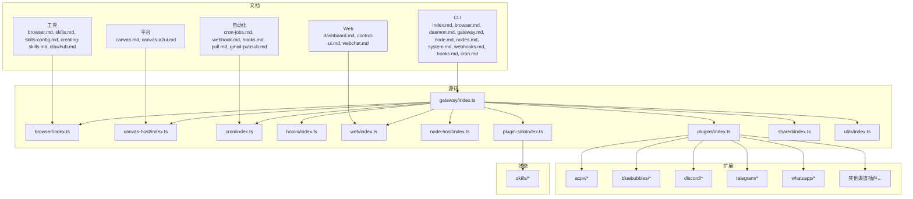
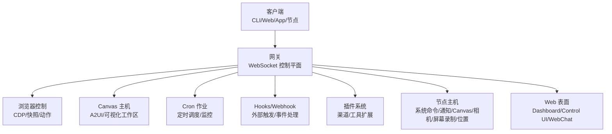
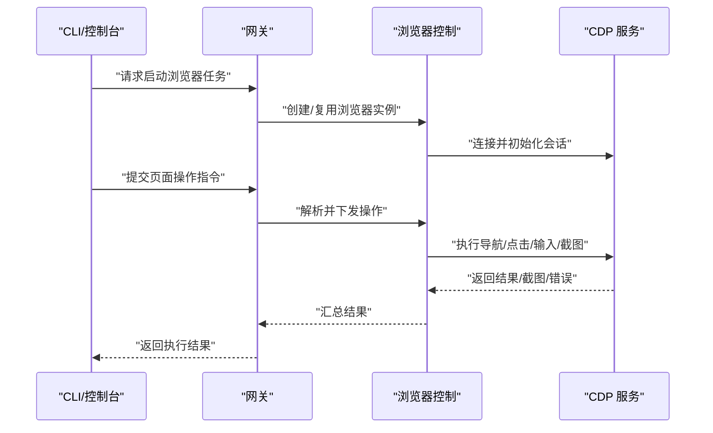
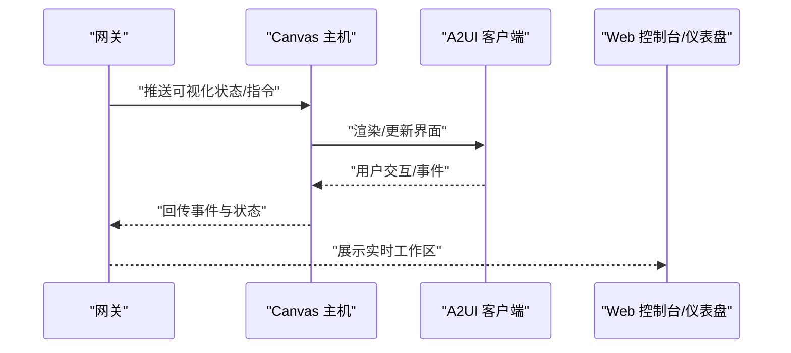
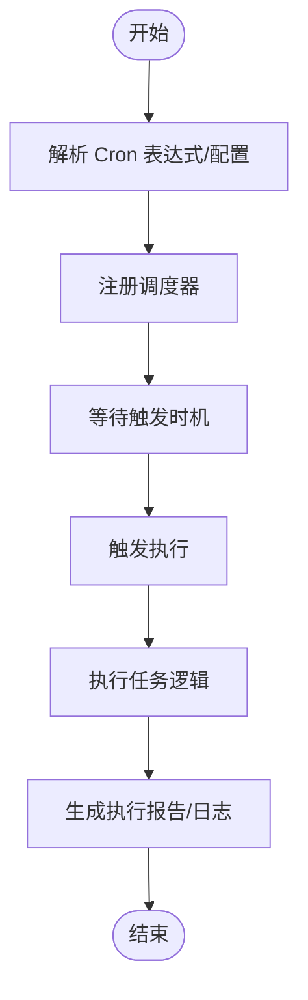
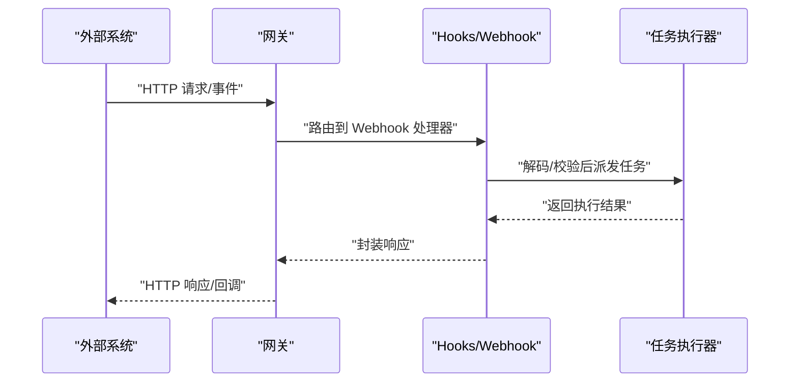
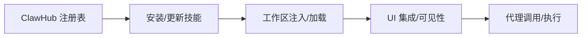
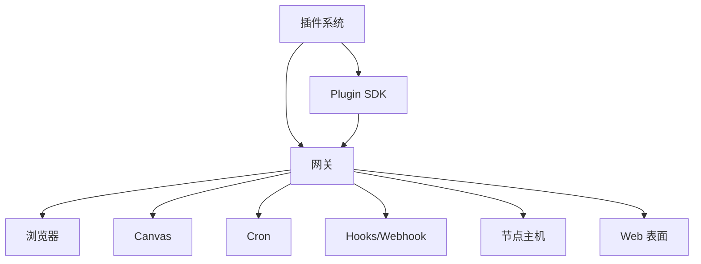

# 工具和自动化

<cite>
**本文引用的文件**
- [README.md](file://README.md)
- [browser.md](file://docs/tools/browser.md)
- [browser-login.md](file://docs/tools/browser-login.md)
- [browser-linux-troubleshooting.md](file://docs/tools/browser-linux-troubleshooting.md)
- [browser-wsl2-windows-remote-cdp-troubleshooting.md](file://docs/tools/browser-wsl2-windows-remote-cdp-troubleshooting.md)
- [canvas.md](file://docs/platforms/mac/canvas.md)
- [canvas-a2ui.md](file://docs/platforms/mac/canvas-a2ui.md)
- [cron-jobs.md](file://docs/automation/cron-jobs.md)
- [cron-vs-heartbeat.md](file://docs/automation/cron-vs-heartbeat.md)
- [webhook.md](file://docs/automation/webhook.md)
- [hooks.md](file://docs/automation/hooks.md)
- [poll.md](file://docs/automation/poll.md)
- [gmail-pubsub.md](file://docs/automation/gmail-pubsub.md)
- [skills.md](file://docs/tools/skills.md)
- [skills-config.md](file://docs/tools/skills-config.md)
- [creating-skills.md](file://docs/tools/creating-skills.md)
- [clawhub.md](file://docs/tools/clawhub.md)
- [index.md](file://docs/cli/index.md)
- [browser.md](file://docs/cli/browser.md)
- [daemon.md](file://docs/cli/daemon.md)
- [gateway.md](file://docs/cli/gateway.md)
- [node.md](file://docs/cli/node.md)
- [nodes.md](file://docs/cli/nodes.md)
- [system.md](file://docs/cli/system.md)
- [webhooks.md](file://docs/cli/webhooks.md)
- [hooks.md](file://docs/cli/hooks.md)
- [cron.md](file://docs/cli/cron.md)
- [dashboard.md](file://docs/web/dashboard.md)
- [control-ui.md](file://docs/web/control-ui.md)
- [webchat.md](file://docs/web/webchat.md)
- [gateway.md](file://src/gateway/index.ts)
- [browser.ts](file://src/browser/index.ts)
- [canvas-host.ts](file://src/canvas-host/index.ts)
- [cron.ts](file://src/cron/index.ts)
- [hooks.ts](file://src/hooks/index.ts)
- [web.ts](file://src/web/index.ts)
- [node-host.ts](file://src/node-host/index.ts)
- [plugin-sdk.ts](file://src/plugin-sdk/index.ts)
- [plugins.ts](file://src/plugins/index.ts)
- [shared.ts](file://src/shared/index.ts)
- [utils.ts](file://src/utils/index.ts)
- [runtime.ts](file://src/runtime.ts)
- [globals.ts](file://src/globals.ts)
- [entry.ts](file://src/entry.ts)
- [openclaw.plugin.json](file://extensions/acpx/openclaw.plugin.json)
- [index.ts](file://extensions/acpx/index.ts)
- [openclaw.plugin.json](file://extensions/bluebubbles/openclaw.plugin.json)
- [index.ts](file://extensions/bluebubbles/index.ts)
- [openclaw.plugin.json](file://extensions/discord/openclaw.plugin.json)
- [index.ts](file://extensions/discord/index.ts)
- [openclaw.plugin.json](file://extensions/telegram/openclaw.plugin.json)
- [index.ts](file://extensions/telegram/index.ts)
- [openclaw.plugin.json](file://extensions/feishu/openclaw.plugin.json)
- [index.ts](file://extensions/feishu/index.ts)
- [openclaw.plugin.json](file://extensions/signal/openclaw.plugin.json)
- [index.ts](file://extensions/signal/index.ts)
- [openclaw.plugin.json](file://extensions/whatsapp/openclaw.plugin.json)
- [index.ts](file://extensions/whatsapp/index.ts)
- [openclaw.plugin.json](file://extensions/teams/openclaw.plugin.json)
- [index.ts](file://extensions/teams/index.ts)
- [openclaw.plugin.json](file://extensions/matrix/openclaw.plugin.json)
- [index.ts](file://extensions/matrix/index.ts)
- [openclaw.plugin.json](file://extensions/irc/openclaw.plugin.json)
- [index.ts](file://extensions/irc/index.ts)
- [openclaw.plugin.json](file://extensions/line/openclaw.plugin.json)
- [index.ts](file://extensions/line/index.ts)
- [openclaw.plugin.json](file://extensions/mattermost/openclaw.plugin.json)
- [index.ts](file://extensions/mattermost/index.ts)
- [openclaw.plugin.json](file://extensions/nextcloud-talk/openclaw.plugin.json)
- [index.ts](file://extensions/nextcloud-talk/index.ts)
- [openclaw.plugin.json](file://extensions/nostr/openclaw.plugin.json)
- [index.ts](file://extensions/nostr/index.ts)
- [openclaw.plugin.json](file://extensions/synology-chat/openclaw.plugin.json)
- [index.ts](file://extensions/synology-chat/index.ts)
- [openclaw.plugin.json](file://extensions/tlon/openclaw.plugin.json)
- [index.ts](file://extensions/tlon/index.ts)
- [openclaw.plugin.json](file://extensions/twitch/openclaw.plugin.json)
- [index.ts](file://extensions/twitch/index.ts)
- [openclaw.plugin.json](file://extensions/zalo/openclaw.plugin.json)
- [index.ts](file://extensions/zalo/index.ts)
- [openclaw.plugin.json](file://extensions/zalouser/openclaw.plugin.json)
- [index.ts](file://extensions/zalouser/index.ts)
- [openclaw.plugin.json](file://extensions/llm-task/openclaw.plugin.json)
- [index.ts](file://extensions/llm-task/index.ts)
- [openclaw.plugin.json](file://extensions/lobster/openclaw.plugin.json)
- [index.ts](file://extensions/lobster/index.ts)
- [openclaw.plugin.json](file://extensions/memory-core/openclaw.plugin.json)
- [index.ts](file://extensions/memory-core/index.ts)
- [openclaw.plugin.json](file://extensions/memory-lancedb/openclaw.plugin.json)
- [index.ts](file://extensions/memory-lancedb/index.ts)
- [openclaw.plugin.json](file://extensions/thread-ownership/openclaw.plugin.json)
- [index.ts](file://extensions/thread-ownership/index.ts)
- [openclaw.plugin.json](file://extensions/phone-control/openclaw.plugin.json)
- [index.ts](file://extensions/phone-control/index.ts)
- [openclaw.plugin.json](file://extensions/talk-voice/openclaw.plugin.json)
- [index.ts](file://extensions/talk-voice/index.ts)
- [openclaw.plugin.json](file://extensions/voice-call/openclaw.plugin.json)
- [index.ts](file://extensions/voice-call/index.ts)
- [openclaw.plugin.json](file://extensions/telegram/src/index.ts)
- [openclaw.plugin.json](file://extensions/whatsapp/src/index.ts)
- [openclaw.plugin.json](file://extensions/teams/src/index.ts)
- [openclaw.plugin.json](file://extensions/discord/src/index.ts)
- [openclaw.plugin.json](file://extensions/feishu/src/index.ts)
- [openclaw.plugin.json](file://extensions/line/src/index.ts)
- [openclaw.plugin.json](file://extensions/mattermost/src/index.ts)
- [openclaw.plugin.json](file://extensions/matrix/src/index.ts)
- [openclaw.plugin.json](file://extensions/nextcloud-talk/src/index.ts)
- [openclaw.plugin.json](file://extensions/nostr/src/index.ts)
- [openclaw.plugin.json](file://extensions/signal/src/index.ts)
- [openclaw.plugin.json](file://extensions/synology-chat/src/index.ts)
- [openclaw.plugin.json](file://extensions/tlon/src/index.ts)
- [openclaw.plugin.json](file://extensions/twitch/src/index.ts)
- [openclaw.plugin.json](file://extensions/zalo/src/index.ts)
- [openclaw.plugin.json](file://extensions/zalouser/src/index.ts)
- [openclaw.plugin.json](file://extensions/irc/src/index.ts)
- [openclaw.plugin.json](file://extensions/llm-task/src/index.ts)
- [openclaw.plugin.json](file://extensions/lobster/src/index.ts)
- [openclaw.plugin.json](file://extensions/memory-core/src/index.ts)
- [openclaw.plugin.json](file://extensions/memory-lancedb/src/index.ts)
- [openclaw.plugin.json](file://extensions/thread-ownership/src/index.ts)
- [openclaw.plugin.json](file://extensions/phone-control/src/index.ts)
- [openclaw.plugin.json](file://extensions/talk-voice/src/index.ts)
- [openclaw.plugin.json](file://extensions/voice-call/src/index.ts)
- [openclaw.plugin.json](file://extensions/voice-call/src/index.ts)
- [openclaw.plugin.json](file://extensions/voice-call/src/index.ts)
- [openclaw.plugin.json](file://extensions/voice-call/src/index.ts)
- [openclaw.plugin.json](file://extensions/voice-call/src/index.ts)
- [openclaw.plugin.json](file://extensions/voice-call/src/index.ts)
- [openclaw.plugin.json](file://extensions/voice-call/src/index.ts)
- [openclaw.plugin.json](file://extensions/voice-call/src/index.ts)
- [openclaw.plugin.json](file://extensions/voice-call/src/index.ts)
- [openclaw.plugin.json](file://extensions/voice-call/src/index.ts)
- [openclaw.plugin.json](file://extensions/voice-call/src/index.ts)
- [openclaw.plugin.json](file://extensions/voice-call/src/index.ts)
- [openclaw.plugin.json](file://extensions/voice-call/src/index.ts)
- [openclaw.plugin.json](file://extensions/voice-call/src/index.ts)
- [openclaw.plugin.json](file://extensions/voice-call/src/index.ts)
- [openclaw.plugin.json](file://extensions/voice-call/src/index.ts)
- [openclaw.plugin.json](file://extensions/voice-call/src/index.ts)
- [openclaw.plugin.json](file://extensions/voice-call/src/index.ts)
- [openclaw.plugin.json](file://extensions/voice-call/src/index.ts)
- [openclaw.plugin.json](file://extensions/voice-call/src/index.ts)
- [openclaw.plugin.json](file://extensions/voice-call/src/index.ts)
- [openclaw.plugin.json](file://extensions/voice-call/src/index.ts)
- [openclaw.plugin.json](file://extensions/voice-call/src/index.ts)
- [openclaw.plugin.json](file://extensions/voice-call/src/index.ts)
- [openclaw.plugin.json](file://extensions/voice-call/src/index.ts)
- [openclaw.plugin.json](file://extensions/voice-call/src/index.ts)
- [openclaw.plugin.json](file://extensions/voice-call/src/index.ts)
- [openclaw.plugin.json](file://extensions/voice-call/src/index.ts)
- [......]
</cite>

## 目录
1. [简介](#简介)
2. [项目结构](#项目结构)
3. [核心组件](#核心组件)
4. [架构总览](#架构总览)
5. [详细组件分析](#详细组件分析)
6. [依赖关系分析](#依赖关系分析)
7. [性能考量](#性能考量)
8. [故障排除指南](#故障排除指南)
9. [结论](#结论)
10. [附录](#附录)

## 简介
本文件面向 OpenClaw 的工具与自动化系统，聚焦以下能力域：
- 浏览器控制系统：Chrome/Chromium 管理、CDP 控制、页面操作与登录流程
- Canvas 主机系统：可视化工作区、A2UI 集成与实时渲染
- Cron 作业系统：定时任务调度、触发机制与执行监控
- Webhook 集成：外部触发器配置、事件处理与响应机制
- 技能平台：技能注册表、安装管理与 UI 集成
- 工具使用指南：节点控制、媒体处理与系统集成
- 自动化工作流设计模式与最佳实践
- 故障排除与性能优化建议

OpenClaw 以“本地优先”的网关作为统一控制平面，通过 WebSocket 连接各客户端、工具与事件面；同时提供 CLI、Web 控制台与 Canvas 可视化工作区，支撑多通道消息、设备节点、浏览器与 Cron 等自动化能力。

章节来源
- [README.md:126-176](file://README.md#L126-L176)

## 项目结构
从仓库结构可见，OpenClaw 将功能按子系统划分：
- 文档层：docs 下涵盖自动化、工具、平台、CLI、网关等主题
- 源码层：src 下包含 gateway、browser、canvas-host、cron、hooks、web、node-host、plugin-sdk、plugins、shared、utils 等模块
- 扩展层：extensions 下为各渠道插件（如 Discord、Telegram、WhatsApp 等）
- 技能层：skills 下为可安装的技能包
- UI 层：ui 下为前端控制台与仪表盘
- 脚本与工具：scripts 下包含构建、打包、测试、运维脚本

图示来源
- [README.md:126-176](file://README.md#L126-L176)
- [src/gateway/index.ts](file://src/gateway/index.ts)
- [src/browser/index.ts](file://src/browser/index.ts)
- [src/canvas-host/index.ts](file://src/canvas-host/index.ts)
- [src/cron/index.ts](file://src/cron/index.ts)
- [src/hooks/index.ts](file://src/hooks/index.ts)
- [src/web/index.ts](file://src/web/index.ts)
- [src/node-host/index.ts](file://src/node-host/index.ts)
- [src/plugin-sdk/index.ts](file://src/plugin-sdk/index.ts)
- [src/plugins/index.ts](file://src/plugins/index.ts)
- [src/shared/index.ts](file://src/shared/index.ts)
- [src/utils/index.ts](file://src/utils/index.ts)

章节来源
- [README.md:126-176](file://README.md#L126-L176)

## 核心组件
- 网关（Gateway）：WebSocket 控制平面，承载会话、通道路由、工具与事件分发
- 浏览器控制（Browser）：基于 Chrome/Chromium 的专用实例，支持 CDP 控制、快照、动作与上传
- Canvas 主机（Canvas Host）：可视化工作区，支持 A2UI 推送/重置/求值/快照
- Cron 作业（Cron）：定时任务调度与触发，支持监控与报告
- Hooks/Webhook：外部触发器与事件处理，支持轮询与 Pub/Sub
- 技能平台（Skills）：技能注册表、安装管理与 UI 集成
- 插件系统（Plugins/Plugin SDK）：扩展生态，适配多渠道与工具
- 节点主机（Node Host）：设备节点能力（系统命令、通知、Canvas、相机、屏幕录制、位置等）

章节来源
- [README.md:126-176](file://README.md#L126-L176)
- [src/gateway/index.ts](file://src/gateway/index.ts)
- [src/browser/index.ts](file://src/browser/index.ts)
- [src/canvas-host/index.ts](file://src/canvas-host/index.ts)
- [src/cron/index.ts](file://src/cron/index.ts)
- [src/hooks/index.ts](file://src/hooks/index.ts)
- [src/web/index.ts](file://src/web/index.ts)
- [src/node-host/index.ts](file://src/node-host/index.ts)
- [src/plugin-sdk/index.ts](file://src/plugin-sdk/index.ts)
- [src/plugins/index.ts](file://src/plugins/index.ts)
- [src/shared/index.ts](file://src/shared/index.ts)
- [src/utils/index.ts](file://src/utils/index.ts)

## 架构总览
OpenClaw 的控制平面由网关统一承载，客户端（CLI、Web、App、节点）通过 WebSocket 与其交互；工具与事件通过网关分发到对应模块或插件。

图示来源
- [README.md:126-176](file://README.md#L126-L176)
- [src/gateway/index.ts](file://src/gateway/index.ts)
- [src/browser/index.ts](file://src/browser/index.ts)
- [src/canvas-host/index.ts](file://src/canvas-host/index.ts)
- [src/cron/index.ts](file://src/cron/index.ts)
- [src/hooks/index.ts](file://src/hooks/index.ts)
- [src/web/index.ts](file://src/web/index.ts)
- [src/node-host/index.ts](file://src/node-host/index.ts)
- [src/plugin-sdk/index.ts](file://src/plugin-sdk/index.ts)
- [src/plugins/index.ts](file://src/plugins/index.ts)

## 详细组件分析

### 浏览器控制系统
- 功能要点
  - 独立的 openclaw Chrome/Chromium 实例，便于隔离与安全控制
  - CDP（Chrome DevTools Protocol）控制，支持页面导航、元素操作、截图、上传等
  - 登录流程与凭据管理，支持不同平台的登录策略
  - Linux 与 WSL2 环境下的问题排查与远程 CDP 访问
- 关键文档
  - 浏览器工具概览与配置
  - 登录流程与凭据
  - Linux 与 WSL2 环境故障排除
- 使用场景
  - 自动化网页交互、数据抓取、登录验证、页面快照
  - 与 Cron 或 Webhook 结合实现定时/事件驱动的网页任务

图示来源
- [docs/tools/browser.md](file://docs/tools/browser.md)
- [docs/tools/browser-login.md](file://docs/tools/browser-login.md)
- [docs/tools/browser-linux-troubleshooting.md](file://docs/tools/browser-linux-troubleshooting.md)
- [docs/tools/browser-wsl2-windows-remote-cdp-troubleshooting.md](file://docs/tools/browser-wsl2-windows-remote-cdp-troubleshooting.md)
- [src/browser/index.ts](file://src/browser/index.ts)

章节来源
- [docs/tools/browser.md](file://docs/tools/browser.md)
- [docs/tools/browser-login.md](file://docs/tools/browser-login.md)
- [docs/tools/browser-linux-troubleshooting.md](file://docs/tools/browser-linux-troubleshooting.md)
- [docs/tools/browser-wsl2-windows-remote-cdp-troubleshooting.md](file://docs/tools/browser-wsl2-windows-remote-cdp-troubleshooting.md)
- [src/browser/index.ts](file://src/browser/index.ts)

### Canvas 主机系统（可视化工作区与 A2UI 集成）
- 功能要点
  - Canvas 作为代理驱动的可视化工作区，支持 A2UI 推送、重置、求值与快照
  - 与网关协作，将可视化状态与交互反馈给客户端
- 关键文档
  - Canvas 平台与 A2UI 集成说明
- 使用场景
  - 可视化调试、演示、实时渲染与跨端共享

图示来源
- [docs/platforms/mac/canvas.md](file://docs/platforms/mac/canvas.md)
- [docs/platforms/mac/canvas-a2ui.md](file://docs/platforms/mac/canvas-a2ui.md)
- [src/canvas-host/index.ts](file://src/canvas-host/index.ts)
- [src/web/index.ts](file://src/web/index.ts)

章节来源
- [docs/platforms/mac/canvas.md](file://docs/platforms/mac/canvas.md)
- [docs/platforms/mac/canvas-a2ui.md](file://docs/platforms/mac/canvas-a2ui.md)
- [src/canvas-host/index.ts](file://src/canvas-host/index.ts)
- [src/web/index.ts](file://src/web/index.ts)

### Cron 作业系统（定时任务调度）
- 功能要点
  - 基于时间表达式或周期性触发的任务调度
  - 触发机制与执行监控，支持报告与告警
  - 与 Cron/心跳机制的差异与选择
- 关键文档
  - Cron 作业与心跳机制对比
  - Cron 作业与执行监控
- 使用场景
  - 定时巡检、数据同步、清理任务、周期性报表

图示来源
- [docs/automation/cron-jobs.md](file://docs/automation/cron-jobs.md)
- [docs/automation/cron-vs-heartbeat.md](file://docs/automation/cron-vs-heartbeat.md)
- [src/cron/index.ts](file://src/cron/index.ts)

章节来源
- [docs/automation/cron-jobs.md](file://docs/automation/cron-jobs.md)
- [docs/automation/cron-vs-heartbeat.md](file://docs/automation/cron-vs-heartbeat.md)
- [src/cron/index.ts](file://src/cron/index.ts)

### Webhook 集成（外部触发器与事件处理）
- 功能要点
  - 外部系统可通过 Webhook 触发 OpenClaw 任务
  - 支持轮询（Poll）、Gmail Pub/Sub 等多种事件源
  - 事件处理与响应机制，确保幂等与可观测性
- 关键文档
  - Webhook 与轮询机制
  - Gmail Pub/Sub 集成
- 使用场景
  - 第三方系统事件联动、邮件订阅、外部 API 回调

图示来源
- [docs/automation/webhook.md](file://docs/automation/webhook.md)
- [docs/automation/hooks.md](file://docs/automation/hooks.md)
- [docs/automation/poll.md](file://docs/automation/poll.md)
- [docs/automation/gmail-pubsub.md](file://docs/automation/gmail-pubsub.md)
- [src/hooks/index.ts](file://src/hooks/index.ts)

章节来源
- [docs/automation/webhook.md](file://docs/automation/webhook.md)
- [docs/automation/hooks.md](file://docs/automation/hooks.md)
- [docs/automation/poll.md](file://docs/automation/poll.md)
- [docs/automation/gmail-pubsub.md](file://docs/automation/gmail-pubsub.md)
- [src/hooks/index.ts](file://src/hooks/index.ts)

### 技能平台（技能注册表、安装管理与 UI 集成）
- 功能要点
  - 技能注册表（ClawHub）用于发现与拉取技能
  - 技能安装、版本管理与 UI 集成
  - 技能配置与工作区管理
- 关键文档
  - 技能概览与配置
  - 创建新技能
  - ClawHub 使用
- 使用场景
  - 快速扩展能力边界、团队共享技能、工作流编排

图示来源
- [docs/tools/skills.md](file://docs/tools/skills.md)
- [docs/tools/skills-config.md](file://docs/tools/skills-config.md)
- [docs/tools/creating-skills.md](file://docs/tools/creating-skills.md)
- [docs/tools/clawhub.md](file://docs/tools/clawhub.md)
- [src/plugins/index.ts](file://src/plugins/index.ts)
- [src/plugin-sdk/index.ts](file://src/plugin-sdk/index.ts)

章节来源
- [docs/tools/skills.md](file://docs/tools/skills.md)
- [docs/tools/skills-config.md](file://docs/tools/skills-config.md)
- [docs/tools/creating-skills.md](file://docs/tools/creating-skills.md)
- [docs/tools/clawhub.md](file://docs/tools/clawhub.md)
- [src/plugins/index.ts](file://src/plugins/index.ts)
- [src/plugin-sdk/index.ts](file://src/plugin-sdk/index.ts)

### 工具使用指南（节点控制、媒体处理与系统集成）
- 节点控制
  - 系统命令执行、通知、Canvas、相机、屏幕录制、位置等
- 媒体处理
  - 图像/音频/视频管线、转录钩子、临时文件生命周期
- 系统集成
  - 与网关协议协作，通过 node.invoke 执行本地动作
- 关键文档
  - CLI 工具参考（browser、daemon、gateway、node、nodes、system、webhooks、hooks、cron）
  - Web 表面（Dashboard、Control UI、WebChat）
- 使用场景
  - 设备侧动作编排、本地资源访问、跨端协作

章节来源
- [docs/cli/index.md](file://docs/cli/index.md)
- [docs/cli/browser.md](file://docs/cli/browser.md)
- [docs/cli/daemon.md](file://docs/cli/daemon.md)
- [docs/cli/gateway.md](file://docs/cli/gateway.md)
- [docs/cli/node.md](file://docs/cli/node.md)
- [docs/cli/nodes.md](file://docs/cli/nodes.md)
- [docs/cli/system.md](file://docs/cli/system.md)
- [docs/cli/webhooks.md](file://docs/cli/webhooks.md)
- [docs/cli/hooks.md](file://docs/cli/hooks.md)
- [docs/cli/cron.md](file://docs/cli/cron.md)
- [docs/web/dashboard.md](file://docs/web/dashboard.md)
- [docs/web/control-ui.md](file://docs/web/control-ui.md)
- [docs/web/webchat.md](file://docs/web/webchat.md)
- [src/node-host/index.ts](file://src/node-host/index.ts)
- [src/web/index.ts](file://src/web/index.ts)

### 自动化工作流设计模式与最佳实践
- 触发模式
  - Cron：周期性任务，适合稳定节奏的后台作业
  - Webhook/Poll：事件驱动，适合对外部系统响应
  - Gmail Pub/Sub：邮件类事件的高吞吐接入
- 幂等与重试
  - 对外接口需保证幂等，内部任务支持重试与退避
- 监控与可观测性
  - 执行报告、日志聚合、健康检查与告警
- 安全与权限
  - 默认主会话全权，群组/频道会话可启用沙箱
  - macOS TCC 权限与 Elevated 访问控制

章节来源
- [docs/automation/cron-jobs.md](file://docs/automation/cron-jobs.md)
- [docs/automation/webhook.md](file://docs/automation/webhook.md)
- [docs/automation/poll.md](file://docs/automation/poll.md)
- [docs/automation/gmail-pubsub.md](file://docs/automation/gmail-pubsub.md)
- [README.md:332-338](file://README.md#L332-L338)

## 依赖关系分析
- 组件耦合
  - 网关是中枢，向上承接 CLI/Web/App，向下连接浏览器、Canvas、Cron、Hooks、Node Host、Web 表面与插件系统
  - 插件系统通过 Plugin SDK 与网关协议对接，形成生态扩展
- 外部依赖
  - 浏览器控制依赖 Chrome/Chromium 与 CDP
  - Webhook/Pub/Sub 依赖外部系统（如 Gmail Pub/Sub）
  - Canvas 依赖 A2UI 客户端渲染
- 潜在循环依赖
  - 插件与网关之间通过接口契约解耦，避免直接循环引用
- 接口契约
  - WebSocket 协议、节点描述与调用约定、工具方法签名

图示来源
- [src/gateway/index.ts](file://src/gateway/index.ts)
- [src/browser/index.ts](file://src/browser/index.ts)
- [src/canvas-host/index.ts](file://src/canvas-host/index.ts)
- [src/cron/index.ts](file://src/cron/index.ts)
- [src/hooks/index.ts](file://src/hooks/index.ts)
- [src/node-host/index.ts](file://src/node-host/index.ts)
- [src/web/index.ts](file://src/web/index.ts)
- [src/plugin-sdk/index.ts](file://src/plugin-sdk/index.ts)
- [src/plugins/index.ts](file://src/plugins/index.ts)

章节来源
- [src/gateway/index.ts](file://src/gateway/index.ts)
- [src/browser/index.ts](file://src/browser/index.ts)
- [src/canvas-host/index.ts](file://src/canvas-host/index.ts)
- [src/cron/index.ts](file://src/cron/index.ts)
- [src/hooks/index.ts](file://src/hooks/index.ts)
- [src/node-host/index.ts](file://src/node-host/index.ts)
- [src/web/index.ts](file://src/web/index.ts)
- [src/plugin-sdk/index.ts](file://src/plugin-sdk/index.ts)
- [src/plugins/index.ts](file://src/plugins/index.ts)

## 性能考量
- 浏览器控制
  - 合理复用浏览器实例，减少启动开销；对长耗时页面操作设置超时与重试
- Canvas 渲染
  - 控制帧率与刷新频率，避免过度绘制；对大尺寸快照进行压缩
- Cron 作业
  - 避免密集并发，合理分布任务；对失败任务进行指数退避
- Hooks/Webhook
  - 对外请求设置超时与重试；对重复事件进行去重
- 插件与技能
  - 加载策略与缓存，避免热路径上的阻塞；按需懒加载

## 故障排除指南
- 浏览器控制
  - Linux 环境常见问题与解决步骤
  - WSL2 远程 CDP 访问问题排查
  - 登录流程异常与凭据修复
- Canvas/A2UI
  - 渲染异常、界面卡顿、权限不足等问题定位
- Cron 作业
  - 表达式解析错误、触发不生效、执行失败排查
- Hooks/Webhook
  - 外部系统连通性、鉴权与签名验证、轮询参数调整
- 技能与插件
  - 安装失败、版本冲突、UI 不显示等问题
- 通用诊断
  - 日志采集、健康检查、远程访问（Tailscale/SSH 隧道）与安全策略

章节来源
- [docs/tools/browser-linux-troubleshooting.md](file://docs/tools/browser-linux-troubleshooting.md)
- [docs/tools/browser-wsl2-windows-remote-cdp-troubleshooting.md](file://docs/tools/browser-wsl2-windows-remote-cdp-troubleshooting.md)
- [docs/tools/browser-login.md](file://docs/tools/browser-login.md)
- [docs/platforms/mac/canvas.md](file://docs/platforms/mac/canvas.md)
- [docs/platforms/mac/canvas-a2ui.md](file://docs/platforms/mac/canvas-a2ui.md)
- [docs/automation/cron-jobs.md](file://docs/automation/cron-jobs.md)
- [docs/automation/webhook.md](file://docs/automation/webhook.md)
- [docs/automation/poll.md](file://docs/automation/poll.md)
- [docs/automation/gmail-pubsub.md](file://docs/automation/gmail-pubsub.md)
- [docs/tools/skills.md](file://docs/tools/skills.md)
- [docs/tools/skills-config.md](file://docs/tools/skills-config.md)
- [README.md:442-450](file://README.md#L442-L450)

## 结论
OpenClaw 的工具与自动化体系以网关为核心，围绕浏览器控制、Canvas 可视化、Cron 定时、Webhook 事件与技能平台构建了完整的自动化闭环。通过 CLI、Web 表面与节点主机，用户可在本地或远程环境中灵活编排任务与工作流。结合安全模型与可观测性设计，OpenClaw 在易用性与可控性之间取得平衡，适用于个人助理与团队协作场景。

## 附录
- 相关文档索引
  - 自动化：cron-jobs、webhook、hooks、poll、gmail-pubsub
  - 工具：browser、skills、skills-config、creating-skills、clawhub
  - 平台：canvas、canvas-a2ui
  - CLI：index、browser、daemon、gateway、node、nodes、system、webhooks、hooks、cron
  - Web：dashboard、control-ui、webchat
- 关键实现入口
  - 网关：src/gateway/index.ts
  - 浏览器：src/browser/index.ts
  - Canvas：src/canvas-host/index.ts
  - Cron：src/cron/index.ts
  - Hooks：src/hooks/index.ts
  - Web：src/web/index.ts
  - 节点主机：src/node-host/index.ts
  - 插件与 SDK：src/plugins/index.ts、src/plugin-sdk/index.ts
  - 共享与工具：src/shared/index.ts、src/utils/index.ts