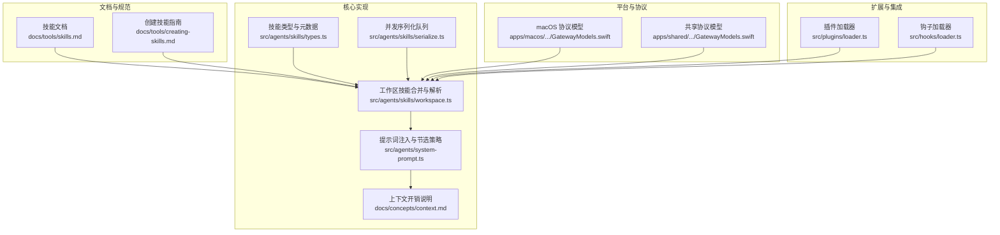
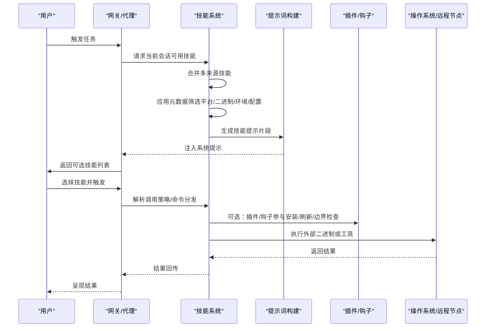
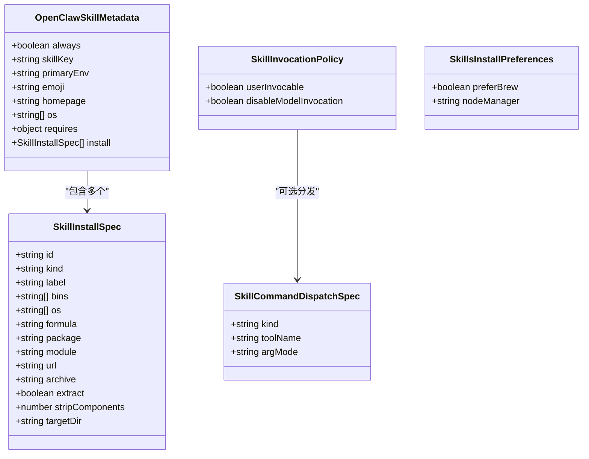
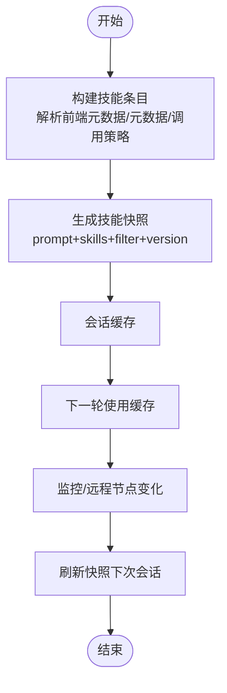
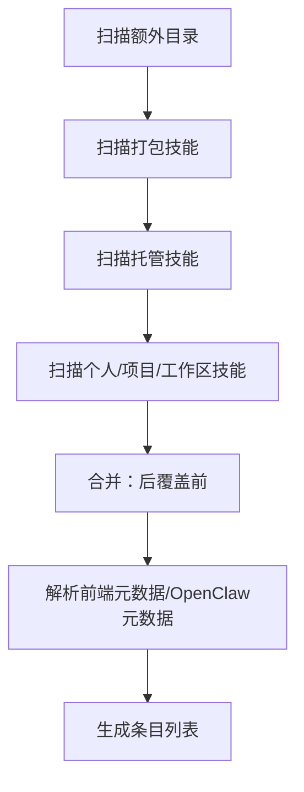
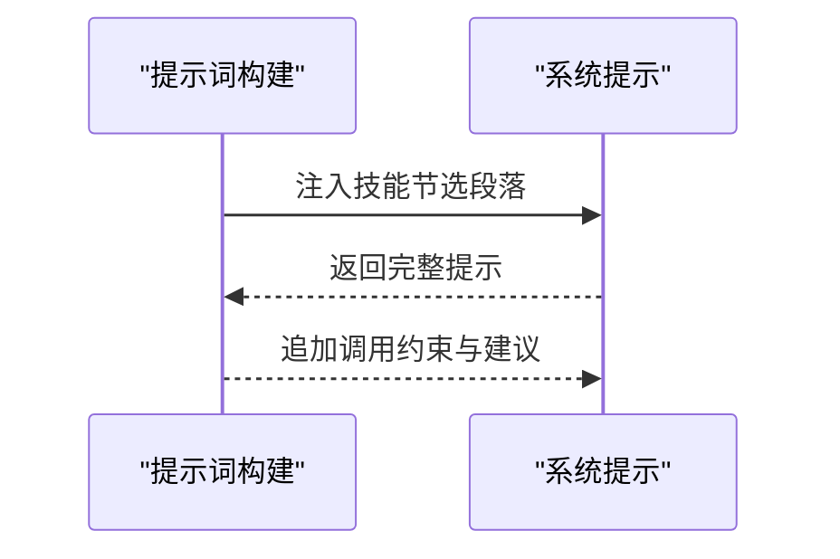
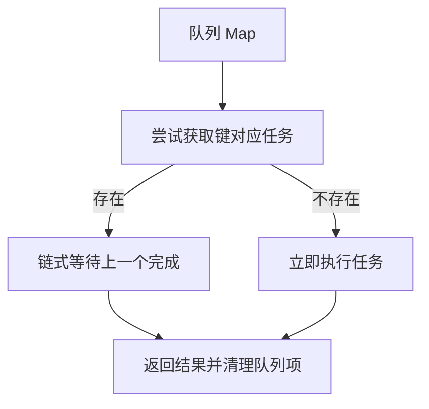
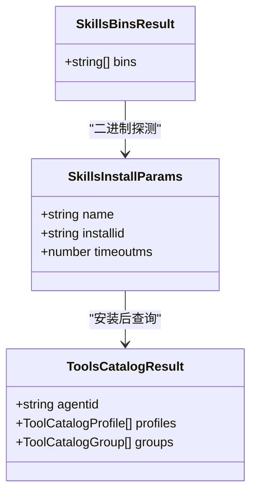
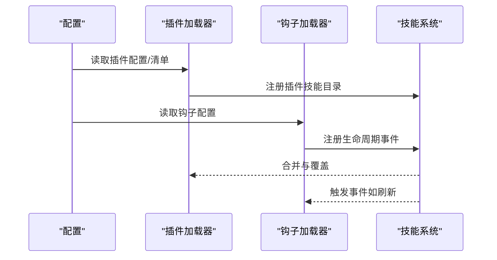
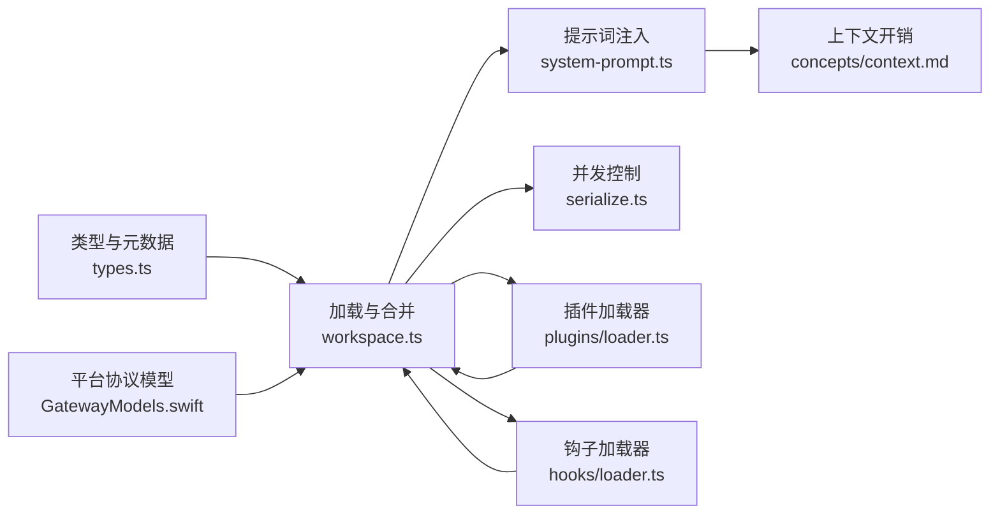

# 内置技能

<cite>
**本文引用的文件**
- [skills.md](file://docs/tools/skills.md)
- [creating-skills.md](file://docs/tools/creating-skills.md)
- [types.ts](file://src/agents/skills/types.ts)
- [workspace.ts](file://src/agents/skills/workspace.ts)
- [system-prompt.ts](file://src/agents/system-prompt.ts)
- [context.md](file://docs/concepts/context.md)
- [loader.ts（插件）](file://src/plugins/loader.ts)
- [loader.ts（钩子）](file://src/hooks/loader.ts)
- [serialize.ts](file://src/agents/skills/serialize.ts)
- [GatewayModels.swift（macOS）](file://apps/macos/Sources/OpenClawProtocol/GatewayModels.swift)
- [GatewayModels.swift（共享）](file://apps/shared/OpenClawKit/Sources/OpenClawProtocol/GatewayModels.swift)
- [技能目录](file://skills/)
</cite>

## 目录
1. [简介](#简介)
2. [项目结构](#项目结构)
3. [核心组件](#核心组件)
4. [架构总览](#架构总览)
5. [详细组件分析](#详细组件分析)
6. [依赖关系分析](#依赖关系分析)
7. [性能考量](#性能考量)
8. [故障排除指南](#故障排除指南)
9. [结论](#结论)
10. [附录](#附录)

## 简介
本文件面向 OpenClaw 的“内置技能集合”，系统性梳理技能的定义、加载、筛选、注入与调用机制，并结合仓库中的文档与源码，给出实现原理、配置选项、协作机制、最佳实践、故障排除与性能优化建议。技能以“可被代理识别并按需调用”的能力单元形式存在，通过统一的目录结构与元数据规范，实现跨平台、可扩展、可安全控制的能力装配。

## 项目结构
OpenClaw 的技能体系由以下关键部分组成：
- 文档层：技能格式、加载顺序、环境注入、安装器、配置覆盖等规则
- 源码层：技能类型定义、工作区/托管/打包技能合并、提示词注入、序列化并发控制
- 平台层：macOS/共享协议中对“技能清单、安装参数、二进制探测”的模型支持
- 插件与钩子：插件可携带技能；钩子可参与技能生命周期管理（如热重载）

**图表来源**
- [skills.md:1-303](file://docs/tools/skills.md#L1-L303)
- [creating-skills.md:1-59](file://docs/tools/creating-skills.md#L1-L59)
- [types.ts:1-90](file://src/agents/skills/types.ts#L1-L90)
- [workspace.ts:490-536](file://src/agents/skills/workspace.ts#L490-L536)
- [system-prompt.ts:20-36](file://src/agents/system-prompt.ts#L20-L36)
- [context.md:36-77](file://docs/concepts/context.md#L36-L77)
- [serialize.ts:1-14](file://src/agents/skills/serialize.ts#L1-L14)
- [GatewayModels.swift（macOS）:2523-2581](file://apps/macos/Sources/OpenClawProtocol/GatewayModels.swift#L2523-L2581)
- [GatewayModels.swift（共享）:2523-2581](file://apps/shared/OpenClawKit/Sources/OpenClawProtocol/GatewayModels.swift#L2523-L2581)
- [loader.ts（插件）:447-800](file://src/plugins/loader.ts#L447-L800)
- [loader.ts（钩子）:42-201](file://src/hooks/loader.ts#L42-L201)

**章节来源**
- [skills.md:1-303](file://docs/tools/skills.md#L1-L303)
- [creating-skills.md:1-59](file://docs/tools/creating-skills.md#L1-L59)
- [types.ts:1-90](file://src/agents/skills/types.ts#L1-L90)
- [workspace.ts:490-536](file://src/agents/skills/workspace.ts#L490-L536)
- [system-prompt.ts:20-36](file://src/agents/system-prompt.ts#L20-L36)
- [context.md:36-77](file://docs/concepts/context.md#L36-L77)
- [serialize.ts:1-14](file://src/agents/skills/serialize.ts#L1-L14)
- [GatewayModels.swift（macOS）:2523-2581](file://apps/macos/Sources/OpenClawProtocol/GatewayModels.swift#L2523-L2581)
- [GatewayModels.swift（共享）:2523-2581](file://apps/shared/OpenClawKit/Sources/OpenClawProtocol/GatewayModels.swift#L2523-L2581)
- [loader.ts（插件）:447-800](file://src/plugins/loader.ts#L447-L800)
- [loader.ts（钩子）:42-201](file://src/hooks/loader.ts#L42-L201)

## 核心组件
- 技能类型与元数据
  - 定义了技能安装规格、OpenClaw 元数据（平台/二进制/环境/配置要求、安装器）、调用策略、命令分发、安装偏好等
- 技能条目与快照
  - 条目包含技能对象、解析的前端元数据、OpenClaw 元数据、调用策略
  - 快照包含用于提示词的技能列表、过滤条件、版本号等
- 加载与合并
  - 支持多来源合并（额外目录、打包、托管、个人/项目/工作区），并按优先级覆盖
- 提示词注入
  - 将可执行技能列表注入系统提示，指导代理选择与读取具体技能文档
- 并发控制
  - 基于键的串行化队列，避免并发安装/刷新冲突
- 平台协议
  - macOS/共享协议中提供“技能安装参数”“二进制探测结果”等模型，支撑 UI 与安装流程

**章节来源**
- [types.ts:1-90](file://src/agents/skills/types.ts#L1-L90)
- [workspace.ts:490-536](file://src/agents/skills/workspace.ts#L490-L536)
- [system-prompt.ts:20-36](file://src/agents/system-prompt.ts#L20-L36)
- [serialize.ts:1-14](file://src/agents/skills/serialize.ts#L1-L14)
- [GatewayModels.swift（macOS）:2523-2581](file://apps/macos/Sources/OpenClawProtocol/GatewayModels.swift#L2523-L2581)
- [GatewayModels.swift（共享）:2523-2581](file://apps/shared/OpenClawKit/Sources/OpenClawProtocol/GatewayModels.swift#L2523-L2581)

## 架构总览
技能从“发现—筛选—合并—注入—调用”形成闭环。文档与规范定义了技能格式与加载规则；源码实现负责解析、合并、注入与并发控制；平台协议支撑 UI 与安装；插件与钩子提供扩展与生命周期管理。

**图表来源**
- [skills.md:106-187](file://docs/tools/skills.md#L106-L187)
- [workspace.ts:490-536](file://src/agents/skills/workspace.ts#L490-L536)
- [system-prompt.ts:20-36](file://src/agents/system-prompt.ts#L20-L36)
- [loader.ts（插件）:447-800](file://src/plugins/loader.ts#L447-L800)
- [loader.ts（钩子）:42-201](file://src/hooks/loader.ts#L42-L201)

## 详细组件分析

### 组件一：技能类型与元数据
- 关键点
  - 安装规格：brew/node/go/uv/download 多种安装器，支持平台过滤、二进制校验、目标目录
  - 元数据：平台白名单、二进制/环境/配置依赖、主密钥字段、安装器数组
  - 调用策略：是否允许用户直接调用、是否禁用模型驱动调用
  - 命令分发：支持“工具直连”模式与原始参数透传
  - 安装偏好：Node 包管理器选择（npm/pnpm/yarn/bun）
- 设计要点
  - 类型与元数据解耦，便于在不同阶段（加载/运行/安装）复用
  - 安装器与二进制探测分离，利于跨主机（远程节点）能力扩展

**图表来源**
- [types.ts:3-62](file://src/agents/skills/types.ts#L3-L62)

**章节来源**
- [types.ts:1-90](file://src/agents/skills/types.ts#L1-L90)

### 组件二：技能条目与快照
- 关键点
  - 条目结构：技能对象、前端元数据、OpenClaw 元数据、调用策略
  - 快照结构：提示文本、技能清单（名称/主环境/所需环境）、过滤条件、版本号
- 设计要点
  - 快照在会话开始时生成并缓存，减少重复计算
  - 支持“热重载”：当启用监控或远程节点出现时，下一轮会话生效

**图表来源**
- [workspace.ts:511-527](file://src/agents/skills/workspace.ts#L511-L527)
- [types.ts:66-89](file://src/agents/skills/types.ts#L66-L89)

**章节来源**
- [workspace.ts:490-536](file://src/agents/skills/workspace.ts#L490-L536)
- [types.ts:64-89](file://src/agents/skills/types.ts#L64-L89)

### 组件三：加载与合并（多来源优先级）
- 关键点
  - 来源与优先级：额外目录 < 打包 < 托管(~/.openclaw/skills) < 个人/项目/工作区
  - 合并策略：同名覆盖，保留最终有效技能
  - 前端元数据解析与 OpenClaw 元数据解析
- 设计要点
  - 严格路径边界检查，防止越界访问
  - 支持插件声明技能目录，参与优先级与覆盖

**图表来源**
- [workspace.ts:490-527](file://src/agents/skills/workspace.ts#L490-L527)
- [skills.md:13-48](file://docs/tools/skills.md#L13-L48)

**章节来源**
- [workspace.ts:490-536](file://src/agents/skills/workspace.ts#L490-L536)
- [skills.md:13-48](file://docs/tools/skills.md#L13-L48)

### 组件四：提示词注入与调用约束
- 关键点
  - 将可执行技能列表注入系统提示，指导代理“先扫描再选择再读取”
  - 对写类外部 API 调用提出速率限制与序列化建议
- 设计要点
  - 提示词节选策略与字符/令牌成本估算，便于控制上下文开销

**图表来源**
- [system-prompt.ts:20-36](file://src/agents/system-prompt.ts#L20-L36)
- [context.md:36-77](file://docs/concepts/context.md#L36-L77)

**章节来源**
- [system-prompt.ts:20-36](file://src/agents/system-prompt.ts#L20-L36)
- [context.md:36-77](file://docs/concepts/context.md#L36-L77)

### 组件五：并发控制与安装/刷新
- 关键点
  - 基于键的串行化队列，确保同一资源的安装/刷新不并发
- 设计要点
  - 避免竞态条件，提升稳定性

**图表来源**
- [serialize.ts:1-14](file://src/agents/skills/serialize.ts#L1-L14)

**章节来源**
- [serialize.ts:1-14](file://src/agents/skills/serialize.ts#L1-L14)

### 组件六：平台协议与安装/二进制探测
- 关键点
  - macOS/共享协议中提供“技能安装参数”“二进制探测结果”等模型
  - 支持 UI 展示安装器、安装进度与结果
- 设计要点
  - 与 UI/安装器/远程节点能力对接，提升用户体验与可运维性

**图表来源**
- [GatewayModels.swift（macOS）:2523-2581](file://apps/macos/Sources/OpenClawProtocol/GatewayModels.swift#L2523-L2581)
- [GatewayModels.swift（共享）:2523-2581](file://apps/shared/OpenClawKit/Sources/OpenClawProtocol/GatewayModels.swift#L2523-L2581)

**章节来源**
- [GatewayModels.swift（macOS）:2523-2581](file://apps/macos/Sources/OpenClawProtocol/GatewayModels.swift#L2523-L2581)
- [GatewayModels.swift（共享）:2523-2581](file://apps/shared/OpenClawKit/Sources/OpenClawProtocol/GatewayModels.swift#L2523-L2581)

### 组件七：插件与钩子对技能的支持
- 插件加载器
  - 支持插件声明技能目录，参与优先级与覆盖
  - 提供注册期的配置校验与错误诊断
- 钩子加载器
  - 支持目录式钩子发现与注册，可用于技能生命周期事件（如热重载）
- 设计要点
  - 插件/钩子与技能系统边界清晰，通过约定的入口与事件进行协作

**图表来源**
- [loader.ts（插件）:447-800](file://src/plugins/loader.ts#L447-L800)
- [loader.ts（钩子）:42-201](file://src/hooks/loader.ts#L42-L201)
- [skills.md:41-48](file://docs/tools/skills.md#L41-L48)

**章节来源**
- [loader.ts（插件）:447-800](file://src/plugins/loader.ts#L447-L800)
- [loader.ts（钩子）:42-201](file://src/hooks/loader.ts#L42-L201)
- [skills.md:41-48](file://docs/tools/skills.md#L41-L48)

## 依赖关系分析
- 组件耦合
  - 技能类型与元数据是核心契约，被加载器、提示词构建、平台协议广泛依赖
  - 加载器与合并逻辑依赖前端元数据解析与 OpenClaw 元数据解析
  - 提示词构建依赖快照与节选策略
  - 并发控制独立但被安装/刷新流程复用
  - 插件/钩子作为外部扩展，通过约定接口与技能系统协作
- 外部依赖
  - 平台协议模型（macOS/共享）用于 UI 与安装器对接
  - 文件系统与边界检查保障安全性

**图表来源**
- [types.ts:1-90](file://src/agents/skills/types.ts#L1-L90)
- [workspace.ts:490-536](file://src/agents/skills/workspace.ts#L490-L536)
- [system-prompt.ts:20-36](file://src/agents/system-prompt.ts#L20-L36)
- [serialize.ts:1-14](file://src/agents/skills/serialize.ts#L1-L14)
- [loader.ts（插件）:447-800](file://src/plugins/loader.ts#L447-L800)
- [loader.ts（钩子）:42-201](file://src/hooks/loader.ts#L42-L201)
- [context.md:36-77](file://docs/concepts/context.md#L36-L77)
- [GatewayModels.swift（macOS）:2523-2581](file://apps/macos/Sources/OpenClawProtocol/GatewayModels.swift#L2523-L2581)

**章节来源**
- [types.ts:1-90](file://src/agents/skills/types.ts#L1-L90)
- [workspace.ts:490-536](file://src/agents/skills/workspace.ts#L490-L536)
- [system-prompt.ts:20-36](file://src/agents/system-prompt.ts#L20-L36)
- [serialize.ts:1-14](file://src/agents/skills/serialize.ts#L1-L14)
- [loader.ts（插件）:447-800](file://src/plugins/loader.ts#L447-L800)
- [loader.ts（钩子）:42-201](file://src/hooks/loader.ts#L42-L201)
- [context.md:36-77](file://docs/concepts/context.md#L36-L77)
- [GatewayModels.swift（macOS）:2523-2581](file://apps/macos/Sources/OpenClawProtocol/GatewayModels.swift#L2523-L2581)

## 性能考量
- 技能列表注入的成本
  - 固定开销与每技能附加开销取决于 XML 字段长度与转义
  - 建议控制技能数量与描述长度，避免提示词过长
- 会话快照与热重载
  - 会话内复用快照，减少重复解析与注入
  - 启用监控可在变更时尽快生效（下一次会话）
- 并发与安装
  - 使用串行化队列避免重复安装与资源竞争
- 上下文开销
  - 参考上下文文档中的统计，合理裁剪技能与工具列表

**章节来源**
- [skills.md:269-286](file://docs/tools/skills.md#L269-L286)
- [context.md:36-77](file://docs/concepts/context.md#L36-L77)
- [serialize.ts:1-14](file://src/agents/skills/serialize.ts#L1-L14)

## 故障排除指南
- 第三方技能风险
  - 未审阅的技能可能包含不受信任代码，建议沙箱运行与最小权限原则
- 安全边界
  - 技能目录仅接受合法根下的真实路径，防止越界
- 环境变量与密钥
  - 仅在进程启动时注入，作用域限定于单次运行
- 安装失败排查
  - 检查安装器规格、平台过滤、二进制是否存在、网络与容器权限
- 远程节点能力
  - 当远程 macOS 节点具备所需二进制时，可临时视为可用，离线则不可用

**章节来源**
- [skills.md:69-76](file://docs/tools/skills.md#L69-L76)
- [skills.md:138-147](file://docs/tools/skills.md#L138-L147)
- [skills.md:230-241](file://docs/tools/skills.md#L230-L241)
- [skills.md:248-252](file://docs/tools/skills.md#L248-L252)

## 结论
OpenClaw 的技能系统以“AgentSkills 兼容”的目录与元数据规范为基础，结合严格的加载/筛选/注入/调用流程，实现了跨平台、可扩展、可安全控制的能力装配。通过文档与源码的协同，用户可以理解并定制技能，开发者可以基于插件与钩子扩展生态，同时利用平台协议与并发控制提升体验与稳定性。

## 附录
- 技能目录概览
  - 仓库中包含大量内置技能示例，涵盖系统工具、生产力工具、通信助手、娱乐应用等多个类别，可作为参考与模板
- 最佳实践
  - 明确技能元数据与调用策略，合理设置安装器与依赖
  - 控制技能数量与描述长度，关注上下文开销
  - 使用插件与钩子实现自动化与可观测性
- 开发参考
  - 参考“创建技能”指南快速搭建本地工作区技能
  - 参考类型定义与加载器实现，设计自定义安装器与调用策略

**章节来源**
- [技能目录](file://skills/)
- [creating-skills.md:17-59](file://docs/tools/creating-skills.md#L17-L59)
- [types.ts:1-90](file://src/agents/skills/types.ts#L1-L90)
- [workspace.ts:490-536](file://src/agents/skills/workspace.ts#L490-L536)