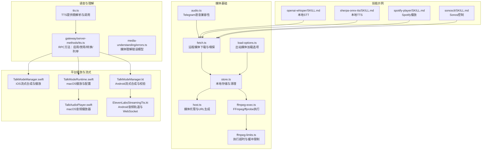
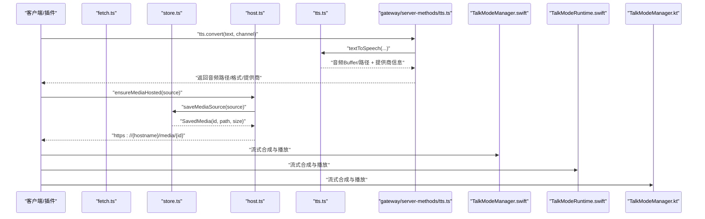
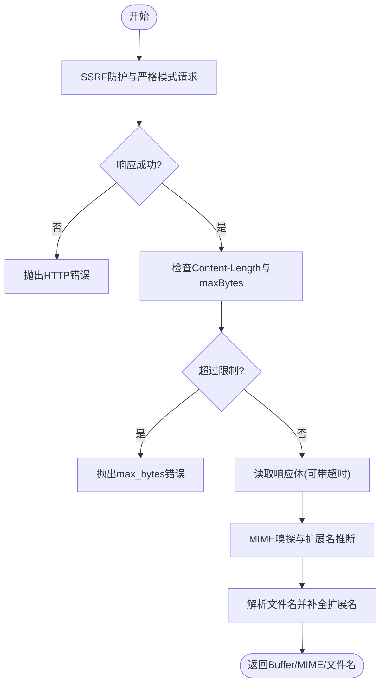
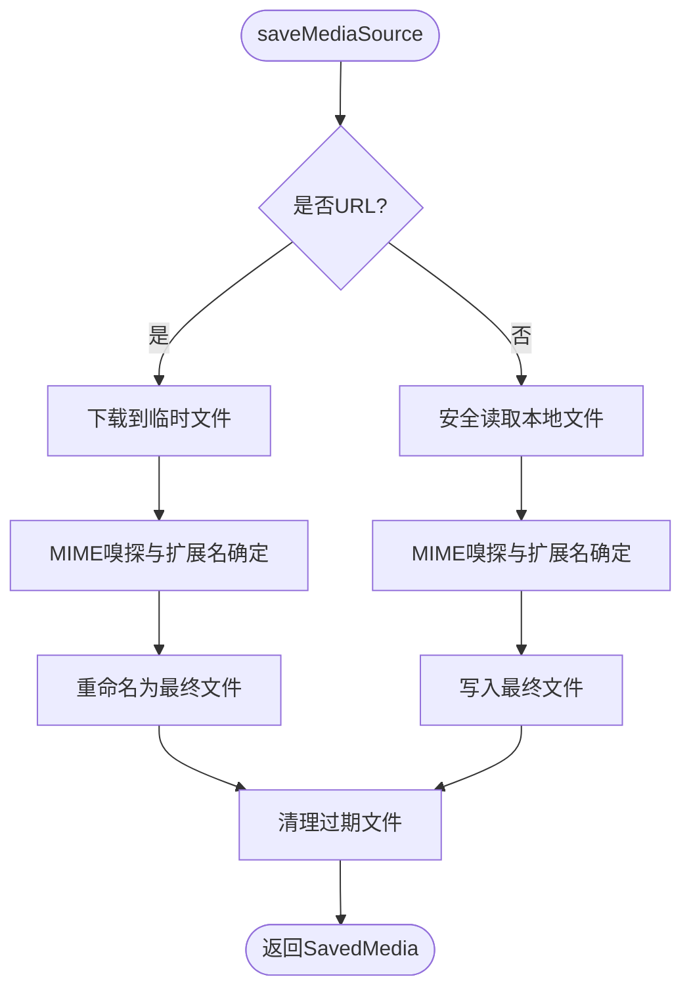
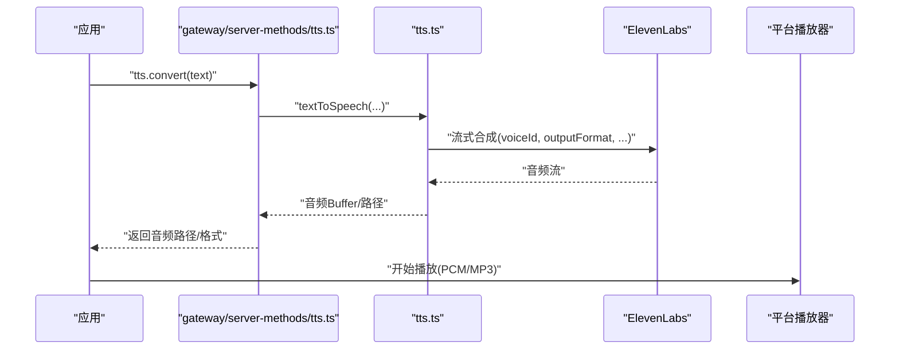
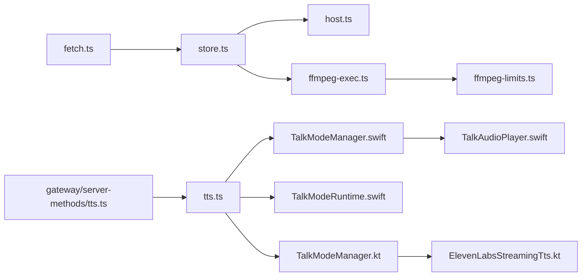

# 媒体处理类

<cite>
**本文引用的文件**
- [src/media/audio.ts](file://src/media/audio.ts)
- [src/media/fetch.ts](file://src/media/fetch.ts)
- [src/media/store.ts](file://src/media/store.ts)
- [src/media/host.ts](file://src/media/host.ts)
- [src/media/load-options.ts](file://src/media/load-options.ts)
- [src/media/ffmpeg-exec.ts](file://src/media/ffmpeg-exec.ts)
- [src/media/ffmpeg-limits.ts](file://src/media/ffmpeg-limits.ts)
- [src/media-understanding/errors.ts](file://src/media-understanding/errors.ts)
- [src/tts/tts.ts](file://src/tts/tts.ts)
- [src/gateway/server-methods/tts.ts](file://src/gateway/server-methods/tts.ts)
- [apps/ios/Sources/Voice/TalkModeManager.swift](file://apps/ios/Sources/Voice/TalkModeManager.swift)
- [apps/macos/Sources/OpenClaw/TalkModeRuntime.swift](file://apps/macos/Sources/OpenClaw/TalkModeRuntime.swift)
- [apps/macos/Sources/OpenClaw/TalkAudioPlayer.swift](file://apps/macos/Sources/OpenClaw/TalkAudioPlayer.swift)
- [apps/android/app/src/main/java/ai/openclaw/app/voice/TalkModeManager.kt](file://apps/android/app/src/main/java/ai/openclaw/app/voice/TalkModeManager.kt)
- [apps/android/app/src/main/java/ai/openclaw/app/voice/ElevenLabsStreamingTts.kt](file://apps/android/app/src/main/java/ai/openclaw/app/voice/ElevenLabsStreamingTts.kt)
- [skills/openai-whisper/SKILL.md](file://skills/openai-whisper/SKILL.md)
- [skills/sherpa-onnx-tts/SKILL.md](file://skills/sherpa-onnx-tts/SKILL.md)
- [skills/spotify-player/SKILL.md](file://skills/spotify-player/SKILL.md)
- [skills/sonoscli/SKILL.md](file://skills/sonoscli/SKILL.md)
</cite>

## 目录
1. [简介](#简介)
2. [项目结构](#项目结构)
3. [核心组件](#核心组件)
4. [架构总览](#架构总览)
5. [详细组件分析](#详细组件分析)
6. [依赖关系分析](#依赖关系分析)
7. [性能考量](#性能考量)
8. [故障排查指南](#故障排查指南)
9. [结论](#结论)
10. [附录](#附录)

## 简介
本技术文档聚焦于 OpenClaw 的媒体处理类技能，系统阐述音频播放、语音识别（STT）与文本转语音（TTS）三大能力的实现原理、配置项、数据处理流程与平台集成方式。文档覆盖以下要点：
- 音频编解码与格式支持：基于 FFmpeg 工具链与 MIME 类型检测，支持常见音频容器与编码。
- 语音处理：本地 Whisper 语音识别与本地 sherpa-onnx TTS，以及云端 ElevenLabs 流式合成。
- 多媒体格式与兼容性：统一的媒体下载、存储、嗅探与托管机制，确保跨平台一致性。
- 配置与参数：输出格式、采样率、延迟等级、语言与音质等关键参数。
- 性能优化与兼容性：超时控制、缓冲区策略、SSRF 防护与错误降级。

## 项目结构
媒体相关能力主要分布在如下模块：
- 媒体基础与工具：下载、嗅探、存储、托管、FFmpeg 执行与限制、加载选项。
- 语音理解与错误模型：媒体理解跳过原因与异常类型。
- TTS 能力：服务端 RPC 方法、提供商解析与调用、平台侧播放器与流式合成。
- 平台集成：iOS/macOS/Android 的播放器、流式合成与音频轨道配置。
- 技能示例：Whisper 本地 STT、sherpa-onnx 本地 TTS、Spotify 播放器、Sonos 控制。

**图表来源**
- [src/media/fetch.ts:84-206](file://src/media/fetch.ts#L84-L206)
- [src/media/store.ts:303-344](file://src/media/store.ts#L303-L344)
- [src/media/host.ts:21-56](file://src/media/host.ts#L21-L56)
- [src/media/ffmpeg-exec.ts:26-42](file://src/media/ffmpeg-exec.ts#L26-L42)
- [src/media/ffmpeg-limits.ts:1-5](file://src/media/ffmpeg-limits.ts#L1-L5)
- [src/media/load-options.ts:17-25](file://src/media/load-options.ts#L17-L25)
- [src/media/audio.ts:20-48](file://src/media/audio.ts#L20-L48)
- [src/tts/tts.ts:747-790](file://src/tts/tts.ts#L747-L790)
- [src/gateway/server-methods/tts.ts:69-157](file://src/gateway/server-methods/tts.ts#L69-L157)
- [apps/ios/Sources/Voice/TalkModeManager.swift:1058-1705](file://apps/ios/Sources/Voice/TalkModeManager.swift#L1058-L1705)
- [apps/macos/Sources/OpenClaw/TalkModeRuntime.swift:567-799](file://apps/macos/Sources/OpenClaw/TalkModeRuntime.swift#L567-L799)
- [apps/macos/Sources/OpenClaw/TalkAudioPlayer.swift:64-100](file://apps/macos/Sources/OpenClaw/TalkAudioPlayer.swift#L64-L100)
- [apps/android/app/src/main/java/ai/openclaw/app/voice/TalkModeManager.kt:1125-1158](file://apps/android/app/src/main/java/ai/openclaw/app/voice/TalkModeManager.kt#L1125-L1158)
- [apps/android/app/src/main/java/ai/openclaw/app/voice/ElevenLabsStreamingTts.kt:89-129](file://apps/android/app/src/main/java/ai/openclaw/app/voice/ElevenLabsStreamingTts.kt#L89-L129)
- [skills/openai-whisper/SKILL.md:1-39](file://skills/openai-whisper/SKILL.md#L1-L39)
- [skills/sherpa-onnx-tts/SKILL.md:1-104](file://skills/sherpa-onnx-tts/SKILL.md#L1-L104)
- [skills/spotify-player/SKILL.md:1-65](file://skills/spotify-player/SKILL.md#L1-L65)
- [skills/sonoscli/SKILL.md:1-66](file://skills/sonoscli/SKILL.md#L1-L66)

**章节来源**
- [src/media/fetch.ts:84-206](file://src/media/fetch.ts#L84-L206)
- [src/media/store.ts:303-344](file://src/media/store.ts#L303-L344)
- [src/media/host.ts:21-56](file://src/media/host.ts#L21-L56)
- [src/media/ffmpeg-exec.ts:26-42](file://src/media/ffmpeg-exec.ts#L26-L42)
- [src/media/ffmpeg-limits.ts:1-5](file://src/media/ffmpeg-limits.ts#L1-L5)
- [src/media/load-options.ts:17-25](file://src/media/load-options.ts#L17-L25)
- [src/media/audio.ts:20-48](file://src/media/audio.ts#L20-L48)
- [src/tts/tts.ts:747-790](file://src/tts/tts.ts#L747-L790)
- [src/gateway/server-methods/tts.ts:69-157](file://src/gateway/server-methods/tts.ts#L69-L157)
- [apps/ios/Sources/Voice/TalkModeManager.swift:1058-1705](file://apps/ios/Sources/Voice/TalkModeManager.swift#L1058-L1705)
- [apps/macos/Sources/OpenClaw/TalkModeRuntime.swift:567-799](file://apps/macos/Sources/OpenClaw/TalkModeRuntime.swift#L567-L799)
- [apps/macos/Sources/OpenClaw/TalkAudioPlayer.swift:64-100](file://apps/macos/Sources/OpenClaw/TalkAudioPlayer.swift#L64-L100)
- [apps/android/app/src/main/java/ai/openclaw/app/voice/TalkModeManager.kt:1125-1158](file://apps/android/app/src/main/java/ai/openclaw/app/voice/TalkModeManager.kt#L1125-L1158)
- [apps/android/app/src/main/java/ai/openclaw/app/voice/ElevenLabsStreamingTts.kt:89-129](file://apps/android/app/src/main/java/ai/openclaw/app/voice/ElevenLabsStreamingTts.kt#L89-L129)
- [skills/openai-whisper/SKILL.md:1-39](file://skills/openai-whisper/SKILL.md#L1-L39)
- [skills/sherpa-onnx-tts/SKILL.md:1-104](file://skills/sherpa-onnx-tts/SKILL.md#L1-L104)
- [skills/spotify-player/SKILL.md:1-65](file://skills/spotify-player/SKILL.md#L1-L65)
- [skills/sonoscli/SKILL.md:1-66](file://skills/sonoscli/SKILL.md#L1-L66)

## 核心组件
- 媒体下载与嗅探：支持 SSRF 防护、重定向、内容长度限制、空闲读取超时、Content-Disposition 文件名提取与 MIME 嗅探。
- 媒体存储与清理：本地目录管理、过期清理（默认2分钟）、最大文件大小限制（默认5MB）、安全文件名清洗。
- FFmpeg 工具链：封装 ffprobe/ffmpeg 执行，带超时与缓冲限制，解析编解码与采样率。
- 媒体托管：在 Tailnet 主机上临时启动媒体服务器，生成可访问 URL。
- 出站媒体加载：允许指定本地根目录与最大字节数，用于受控的本地文件暴露。
- 语音理解错误模型：定义媒体理解跳过原因与异常类型，便于上层降级处理。
- TTS 服务端 RPC：提供启用/禁用、转换、列举提供商等接口；平台侧负责流式合成与播放。
- 平台播放与流式：iOS/macOS/Android 分别实现 ElevenLabs 流式合成、音频轨道与播放器控制。

**章节来源**
- [src/media/fetch.ts:84-206](file://src/media/fetch.ts#L84-L206)
- [src/media/store.ts:303-344](file://src/media/store.ts#L303-L344)
- [src/media/ffmpeg-exec.ts:26-42](file://src/media/ffmpeg-exec.ts#L26-L42)
- [src/media/ffmpeg-limits.ts:1-5](file://src/media/ffmpeg-limits.ts#L1-L5)
- [src/media/host.ts:21-56](file://src/media/host.ts#L21-L56)
- [src/media/load-options.ts:17-25](file://src/media/load-options.ts#L17-L25)
- [src/media-understanding/errors.ts:1-20](file://src/media-understanding/errors.ts#L1-L20)
- [src/gateway/server-methods/tts.ts:69-157](file://src/gateway/server-methods/tts.ts#L69-L157)

## 架构总览
媒体处理从“输入”到“播放”的典型路径：
- 输入来源：本地文件、URL、Base64 或平台直传。
- 下载与嗅探：远程资源经 SSRF 保护下载，自动识别 MIME 与文件名。
- 存储与清理：写入本地媒体目录，按 TTL 清理旧文件。
- 编解码与元数据：必要时通过 FFmpeg 获取编解码与采样率信息。
- 转换与播放：根据平台与提供商进行 TTS 合成或本地播放；支持流式合成与实时播放。
- 托管与分享：将媒体文件托管为可访问 URL，供通道或外部系统使用。

**图表来源**
- [src/gateway/server-methods/tts.ts:69-157](file://src/gateway/server-methods/tts.ts#L69-L157)
- [src/tts/tts.ts:747-790](file://src/tts/tts.ts#L747-L790)
- [src/media/store.ts:303-344](file://src/media/store.ts#L303-L344)
- [src/media/host.ts:21-56](file://src/media/host.ts#L21-L56)
- [apps/ios/Sources/Voice/TalkModeManager.swift:1058-1705](file://apps/ios/Sources/Voice/TalkModeManager.swift#L1058-L1705)
- [apps/macos/Sources/OpenClaw/TalkModeRuntime.swift:567-799](file://apps/macos/Sources/OpenClaw/TalkModeRuntime.swift#L567-L799)
- [apps/android/app/src/main/java/ai/openclaw/app/voice/TalkModeManager.kt:1125-1158](file://apps/android/app/src/main/java/ai/openclaw/app/voice/TalkModeManager.kt#L1125-L1158)

## 详细组件分析

### 组件一：媒体下载与嗅探（fetch.ts）
- 功能要点
  - SSRF 保护与严格模式请求，支持自定义 fetch 实现与 DNS 查找函数。
  - 支持最大字节数、重定向次数、读取空闲超时。
  - 解析 Content-Disposition 中的文件名，结合 URL 与 MIME 推断扩展名。
  - 对 HTTP 错误与响应体溢出进行分类错误抛出。
- 关键流程

**图表来源**
- [src/media/fetch.ts:84-206](file://src/media/fetch.ts#L84-L206)

**章节来源**
- [src/media/fetch.ts:84-206](file://src/media/fetch.ts#L84-L206)

### 组件二：媒体存储与清理（store.ts）
- 功能要点
  - 默认媒体目录位于配置目录下的 media 子目录，文件权限对非所有者可读以支持容器访问。
  - 保存来源支持 URL 与本地路径：URL 先写临时文件再重命名为最终文件；本地路径直接安全读取后写入。
  - 自动清理过期文件（默认2分钟），支持递归清理与空目录修剪。
  - 最大文件大小限制（默认5MB），超限抛出错误。
- 关键流程

**图表来源**
- [src/media/store.ts:303-344](file://src/media/store.ts#L303-L344)

**章节来源**
- [src/media/store.ts:303-344](file://src/media/store.ts#L303-L344)

### 组件三：FFmpeg 执行与限制（ffmpeg-exec.ts, ffmpeg-limits.ts）
- 功能要点
  - 封装 ffprobe/ffmpeg 执行，统一超时与最大缓冲区限制。
  - 提供 CSV 字段解析与编解码/采样率解析辅助。
- 性能与限制
  - 默认超时与缓冲限制避免长时间阻塞与内存占用过高。
  - 适用于音频元数据获取与格式转换场景。

**章节来源**
- [src/media/ffmpeg-exec.ts:26-42](file://src/media/ffmpeg-exec.ts#L26-L42)
- [src/media/ffmpeg-limits.ts:1-5](file://src/media/ffmpeg-limits.ts#L1-L5)

### 组件四：媒体托管（host.ts）
- 功能要点
  - 将已保存媒体通过 Tailnet 主机暴露为 HTTPS URL。
  - 若端口未占用且未允许启动服务器，则删除临时文件并提示启动网关。
- 使用场景
  - 在无常驻媒体服务器时，临时启动媒体主机以生成可访问链接。

**章节来源**
- [src/media/host.ts:21-56](file://src/media/host.ts#L21-L56)

### 组件五：出站媒体加载选项（load-options.ts）
- 功能要点
  - 将外部传入的本地根目录与最大字节限制转换为内部加载选项。
  - 为空值时忽略，保持默认行为。

**章节来源**
- [src/media/load-options.ts:17-25](file://src/media/load-options.ts#L17-L25)

### 组件六：Telegram 语音兼容性（audio.ts）
- 功能要点
  - 定义 Telegram 语音消息支持的 MIME 类型与扩展名集合。
  - 提供文件名与 MIME 双重判断的兼容性检测。

**章节来源**
- [src/media/audio.ts:20-48](file://src/media/audio.ts#L20-L48)

### 组件七：TTS 服务端 RPC（gateway/server-methods/tts.ts）
- 功能要点
  - 提供 tts.enable/tts.disable：切换 TTS 开关并持久化偏好。
  - 提供 tts.convert：将文本转为音频，返回音频路径、提供商与输出格式。
  - 提供 tts.providers：列举可用提供商及其模型/配置状态。
- 错误处理
  - 对无效请求与不可用服务返回标准化错误形状。

**章节来源**
- [src/gateway/server-methods/tts.ts:69-157](file://src/gateway/server-methods/tts.ts#L69-L157)

### 组件八：TTS 提供商解析与调用（tts.ts）
- 功能要点
  - 解析用户配置与偏好，按顺序尝试提供商。
  - 对特定提供商（如 Edge）进行不支持检查与跳过。
  - 生成输出格式与采样率信息，记录调用耗时。
- 兼容性
  - 对电话场景的输出格式进行适配（telephony output）。

**章节来源**
- [src/tts/tts.ts:747-790](file://src/tts/tts.ts#L747-L790)

### 组件九：平台播放与流式合成（iOS/macOS/Android）
- iOS（TalkModeManager.swift）
  - ElevenLabs 流式合成，支持中断与恢复；根据输出格式选择 PCM 或 MP3 播放路径。
  - 与系统语音合成器协作，支持打断与静默窗口。
- macOS（TalkModeRuntime.swift / TalkAudioPlayer.swift）
  - 加载配置（默认音色、模型、输出格式、静默超时、API Key）。
  - PCM/MP3 两种播放路径，支持停止与完成回调。
- Android（TalkModeManager.kt / ElevenLabsStreamingTts.kt）
  - 校验输出格式与采样率，延迟 AudioTrack 初始化以避免欠载。
  - 通过 WebSocket 连接 ElevenLabs，使用 MODE_STREAM 实时播放。

**图表来源**
- [src/gateway/server-methods/tts.ts:69-157](file://src/gateway/server-methods/tts.ts#L69-L157)
- [src/tts/tts.ts:747-790](file://src/tts/tts.ts#L747-L790)
- [apps/ios/Sources/Voice/TalkModeManager.swift:1058-1705](file://apps/ios/Sources/Voice/TalkModeManager.swift#L1058-L1705)
- [apps/macos/Sources/OpenClaw/TalkModeRuntime.swift:567-799](file://apps/macos/Sources/OpenClaw/TalkModeRuntime.swift#L567-L799)
- [apps/macos/Sources/OpenClaw/TalkAudioPlayer.swift:64-100](file://apps/macos/Sources/OpenClaw/TalkAudioPlayer.swift#L64-L100)
- [apps/android/app/src/main/java/ai/openclaw/app/voice/TalkModeManager.kt:1125-1158](file://apps/android/app/src/main/java/ai/openclaw/app/voice/TalkModeManager.kt#L1125-L1158)
- [apps/android/app/src/main/java/ai/openclaw/app/voice/ElevenLabsStreamingTts.kt:89-129](file://apps/android/app/src/main/java/ai/openclaw/app/voice/ElevenLabsStreamingTts.kt#L89-L129)

**章节来源**
- [apps/ios/Sources/Voice/TalkModeManager.swift:1058-1705](file://apps/ios/Sources/Voice/TalkModeManager.swift#L1058-L1705)
- [apps/macos/Sources/OpenClaw/TalkModeRuntime.swift:567-799](file://apps/macos/Sources/OpenClaw/TalkModeRuntime.swift#L567-L799)
- [apps/macos/Sources/OpenClaw/TalkAudioPlayer.swift:64-100](file://apps/macos/Sources/OpenClaw/TalkAudioPlayer.swift#L64-L100)
- [apps/android/app/src/main/java/ai/openclaw/app/voice/TalkModeManager.kt:1125-1158](file://apps/android/app/src/main/java/ai/openclaw/app/voice/TalkModeManager.kt#L1125-L1158)
- [apps/android/app/src/main/java/ai/openclaw/app/voice/ElevenLabsStreamingTts.kt:89-129](file://apps/android/app/src/main/java/ai/openclaw/app/voice/ElevenLabsStreamingTts.kt#L89-L129)

### 组件十：媒体理解错误模型（media-understanding/errors.ts）
- 功能要点
  - 定义媒体理解跳过原因（超限、超时、不支持、空、过小）。
  - 提供类型守卫以识别跳过错误。

**章节来源**
- [src/media-understanding/errors.ts:1-20](file://src/media-understanding/errors.ts#L1-L20)

### 组件十一：技能示例（STT/TTS/播放）
- Whisper 本地 STT（openai-whisper/SKILL.md）
  - 本地 CLI 转录，支持多种模型与输出格式。
- sherpa-onnx 本地 TTS（sherpa-onnx-tts/SKILL.md）
  - 本地离线 TTS，需设置运行时与模型目录环境变量。
- Spotify 播放器（spotify-player/SKILL.md）
  - 通过 spogo 或 spotify_player 控制播放与设备。
- Sonos 控制（sonoscli/SKILL.md）
  - 本地网络发现与控制，支持分组、收藏与队列操作。

**章节来源**
- [skills/openai-whisper/SKILL.md:1-39](file://skills/openai-whisper/SKILL.md#L1-L39)
- [skills/sherpa-onnx-tts/SKILL.md:1-104](file://skills/sherpa-onnx-tts/SKILL.md#L1-L104)
- [skills/spotify-player/SKILL.md:1-65](file://skills/spotify-player/SKILL.md#L1-L65)
- [skills/sonoscli/SKILL.md:1-66](file://skills/sonoscli/SKILL.md#L1-L66)

## 依赖关系分析
- 模块内聚与耦合
  - fetch.ts 与 store.ts 高度耦合：前者负责下载，后者负责存储与清理。
  - ffmpeg-exec.ts 与 ffmpeg-limits.ts 弱耦合：前者依赖后者提供的超时与缓冲常量。
  - host.ts 依赖 store.ts 与 server.ts（未在本节展开）。
  - tts.ts 依赖提供商解析与配置；gateway/server-methods/tts.ts 提供 RPC 接口。
  - 平台侧播放器与流式合成相互独立，但共享相同的输出格式约定。
- 外部依赖
  - FFmpeg/ffprobe 可执行文件。
  - ElevenLabs API（流式合成）。
  - 平台音频框架（AVFoundation/AudioTrack）。

**图表来源**
- [src/media/fetch.ts:84-206](file://src/media/fetch.ts#L84-L206)
- [src/media/store.ts:303-344](file://src/media/store.ts#L303-L344)
- [src/media/host.ts:21-56](file://src/media/host.ts#L21-L56)
- [src/media/ffmpeg-exec.ts:26-42](file://src/media/ffmpeg-exec.ts#L26-L42)
- [src/media/ffmpeg-limits.ts:1-5](file://src/media/ffmpeg-limits.ts#L1-L5)
- [src/gateway/server-methods/tts.ts:69-157](file://src/gateway/server-methods/tts.ts#L69-L157)
- [src/tts/tts.ts:747-790](file://src/tts/tts.ts#L747-L790)
- [apps/ios/Sources/Voice/TalkModeManager.swift:1058-1705](file://apps/ios/Sources/Voice/TalkModeManager.swift#L1058-L1705)
- [apps/macos/Sources/OpenClaw/TalkModeRuntime.swift:567-799](file://apps/macos/Sources/OpenClaw/TalkModeRuntime.swift#L567-L799)
- [apps/macos/Sources/OpenClaw/TalkAudioPlayer.swift:64-100](file://apps/macos/Sources/OpenClaw/TalkAudioPlayer.swift#L64-L100)
- [apps/android/app/src/main/java/ai/openclaw/app/voice/TalkModeManager.kt:1125-1158](file://apps/android/app/src/main/java/ai/openclaw/app/voice/TalkModeManager.kt#L1125-L1158)
- [apps/android/app/src/main/java/ai/openclaw/app/voice/ElevenLabsStreamingTts.kt:89-129](file://apps/android/app/src/main/java/ai/openclaw/app/voice/ElevenLabsStreamingTts.kt#L89-L129)

**章节来源**
- [src/media/fetch.ts:84-206](file://src/media/fetch.ts#L84-L206)
- [src/media/store.ts:303-344](file://src/media/store.ts#L303-L344)
- [src/media/host.ts:21-56](file://src/media/host.ts#L21-L56)
- [src/media/ffmpeg-exec.ts:26-42](file://src/media/ffmpeg-exec.ts#L26-L42)
- [src/media/ffmpeg-limits.ts:1-5](file://src/media/ffmpeg-limits.ts#L1-L5)
- [src/gateway/server-methods/tts.ts:69-157](file://src/gateway/server-methods/tts.ts#L69-L157)
- [src/tts/tts.ts:747-790](file://src/tts/tts.ts#L747-L790)
- [apps/ios/Sources/Voice/TalkModeManager.swift:1058-1705](file://apps/ios/Sources/Voice/TalkModeManager.swift#L1058-L1705)
- [apps/macos/Sources/OpenClaw/TalkModeRuntime.swift:567-799](file://apps/macos/Sources/OpenClaw/TalkModeRuntime.swift#L567-L799)
- [apps/macos/Sources/OpenClaw/TalkAudioPlayer.swift:64-100](file://apps/macos/Sources/OpenClaw/TalkAudioPlayer.swift#L64-L100)
- [apps/android/app/src/main/java/ai/openclaw/app/voice/TalkModeManager.kt:1125-1158](file://apps/android/app/src/main/java/ai/openclaw/app/voice/TalkModeManager.kt#L1125-L1158)
- [apps/android/app/src/main/java/ai/openclaw/app/voice/ElevenLabsStreamingTts.kt:89-129](file://apps/android/app/src/main/java/ai/openclaw/app/voice/ElevenLabsStreamingTts.kt#L89-L129)

## 性能考量
- 超时与缓冲
  - FFmpeg/ffprobe 设置了固定超时与最大缓冲区，避免长时间阻塞与内存膨胀。
- 读取与下载
  - 下载时限制最大字节数与空闲读取超时，防止慢连接导致资源占用。
- 播放与流式
  - Android 延迟 AudioTrack 初始化，避免欠载；iOS/macOS 根据输出格式选择最优播放路径。
- 清理与缓存
  - 媒体目录定期清理过期文件，降低磁盘压力；托管 URL TTL 短，减少长期占用。

[本节为通用性能建议，无需列出具体文件来源]

## 故障排查指南
- HTTP 错误与响应体溢出
  - 现象：下载失败或被判定为超限。
  - 处理：检查 URL、重定向、Content-Length 与 maxBytes 设置。
  - 参考：下载错误类型与错误信息构造。
- SSRF 防护与端口占用
  - 现象：托管媒体需要网关服务，否则抛错并提示启动命令。
  - 处理：启动网关或使用 --serve-media 参数。
- 本地文件安全
  - 现象：路径不在工作区、符号链接、过大等导致保存失败。
  - 处理：确认路径安全、文件存在且未超限。
- 平台播放问题
  - 现象：AudioTrack 初始化失败、播放器拒绝播放。
  - 处理：检查权限、采样率与输出格式匹配；确保流式数据持续到达。

**章节来源**
- [src/media/fetch.ts:114-135](file://src/media/fetch.ts#L114-L135)
- [src/media/store.ts:275-301](file://src/media/store.ts#L275-L301)
- [src/media/host.ts:37-42](file://src/media/host.ts#L37-L42)
- [apps/android/app/src/main/java/ai/openclaw/app/voice/TalkModeManager.kt:1141-1144](file://apps/android/app/src/main/java/ai/openclaw/app/voice/TalkModeManager.kt#L1141-L1144)
- [apps/macos/Sources/OpenClaw/TalkAudioPlayer.swift:69-77](file://apps/macos/Sources/OpenClaw/TalkAudioPlayer.swift#L69-L77)

## 结论
OpenClaw 的媒体处理类技能以“安全、可控、可扩展”为核心设计原则：通过严格的下载与嗅探、安全的本地存储与清理、可配置的 FFmpeg 工具链与平台流式播放，实现了从 STT 到 TTS 再到播放的完整闭环。配合技能生态与多平台集成，开发者可以快速构建稳定可靠的多媒体应用。

[本节为总结性内容，无需列出具体文件来源]

## 附录

### 配置与参数速查
- TTS 提供商与模型
  - ElevenLabs：支持多模型与音色；电话场景输出格式适配。
  - OpenAI：支持多种模型与音色。
  - Edge TTS：当前不支持电话场景。
- 输出格式与采样率
  - ElevenLabs 支持 MP3 与 PCM（常见采样率：16kHz/22.05kHz/24kHz/44.1kHz）。
  - 平台侧会进行格式校验与验证。
- 静默超时与中断
  - 可配置静默窗口，支持在说话时自动开始识别。
- 本地媒体限制
  - 默认最大文件大小 5MB，TTL 2 分钟；可调整。

**章节来源**
- [src/gateway/server-methods/tts.ts:129-152](file://src/gateway/server-methods/tts.ts#L129-L152)
- [apps/ios/Sources/Voice/TalkModeManager.swift:1664-1696](file://apps/ios/Sources/Voice/TalkModeManager.swift#L1664-L1696)
- [apps/macos/Sources/OpenClaw/TalkModeRuntime.swift:772-799](file://apps/macos/Sources/OpenClaw/TalkModeRuntime.swift#L772-L799)
- [apps/android/app/src/main/java/ai/openclaw/app/voice/TalkModeManager.kt:1664-1696](file://apps/android/app/src/main/java/ai/openclaw/app/voice/TalkModeManager.kt#L1664-L1696)

### 使用示例与集成方案
- 文本转语音
  - 通过 RPC 调用 tts.convert，获得音频路径与格式；平台侧根据提供商与输出格式进行播放。
- 语音识别（本地）
  - 使用 Whisper 技能进行本地转录；支持多种模型与输出格式。
- 本地 TTS（离线）
  - 使用 sherpa-onnx 技能进行本地合成；需正确设置运行时与模型目录。
- 播放器集成
  - iOS/macOS/Android 分别实现 ElevenLabs 流式合成与播放；注意采样率与格式匹配。

**章节来源**
- [src/gateway/server-methods/tts.ts:69-91](file://src/gateway/server-methods/tts.ts#L69-L91)
- [skills/openai-whisper/SKILL.md:25-39](file://skills/openai-whisper/SKILL.md#L25-L39)
- [skills/sherpa-onnx-tts/SKILL.md:64-104](file://skills/sherpa-onnx-tts/SKILL.md#L64-L104)
- [apps/ios/Sources/Voice/TalkModeManager.swift:1058-1705](file://apps/ios/Sources/Voice/TalkModeManager.swift#L1058-L1705)
- [apps/macos/Sources/OpenClaw/TalkModeRuntime.swift:567-799](file://apps/macos/Sources/OpenClaw/TalkModeRuntime.swift#L567-L799)
- [apps/android/app/src/main/java/ai/openclaw/app/voice/ElevenLabsStreamingTts.kt:89-129](file://apps/android/app/src/main/java/ai/openclaw/app/voice/ElevenLabsStreamingTts.kt#L89-L129)