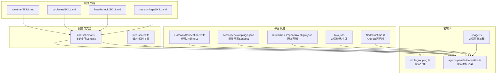
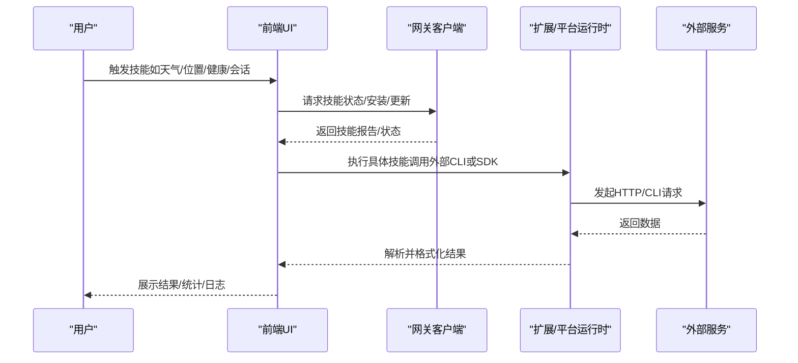
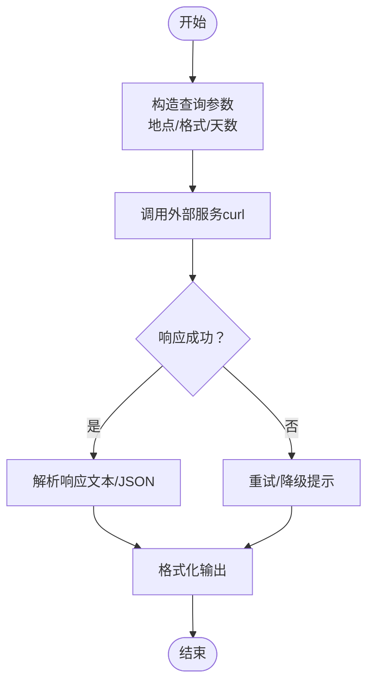
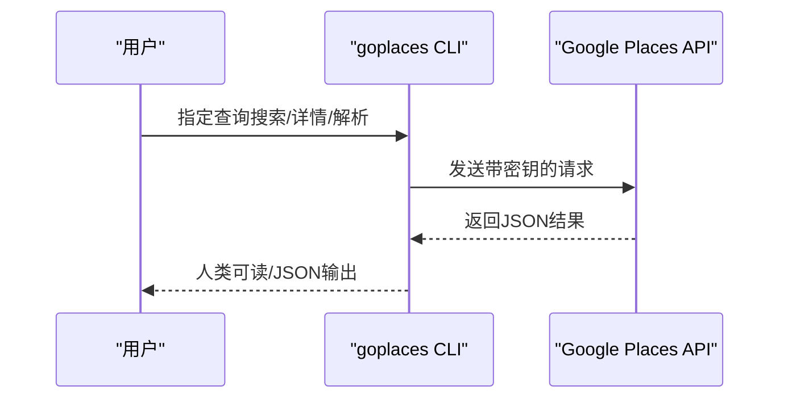
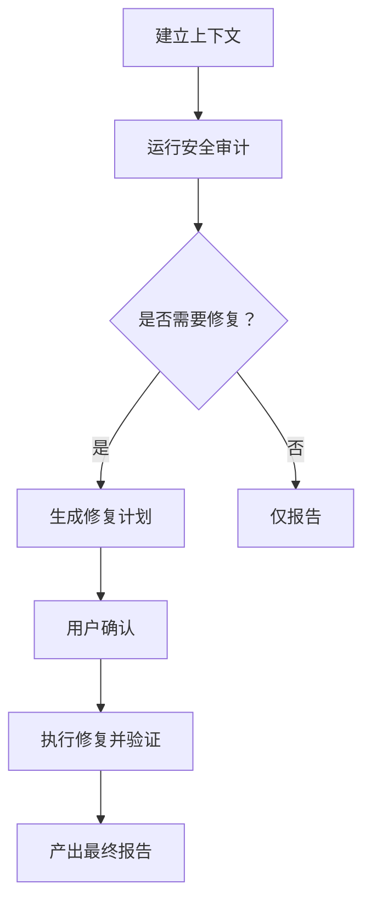
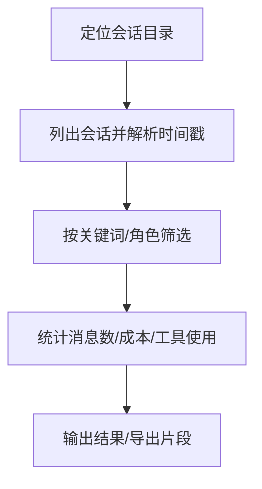
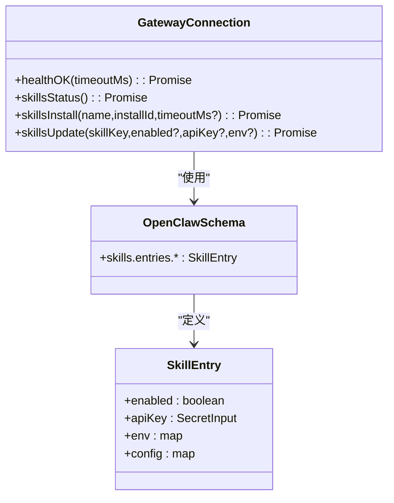
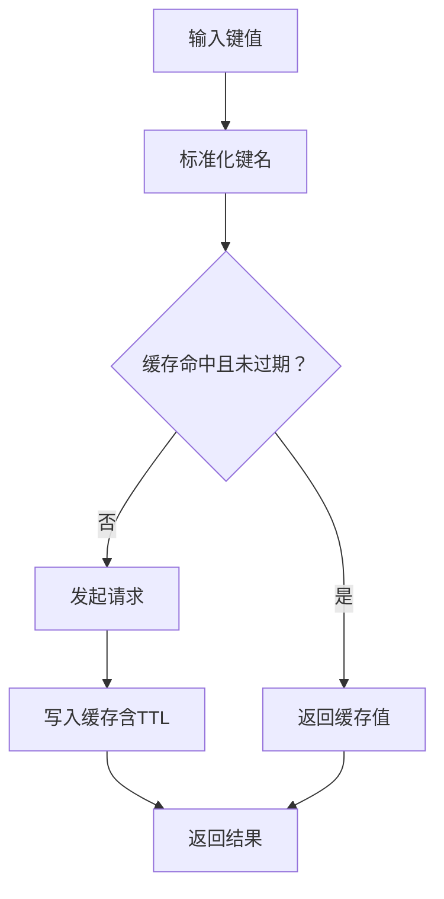
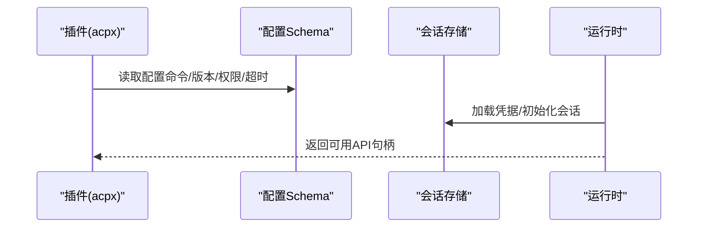
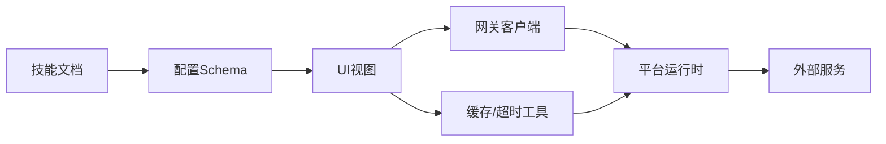

# 实用工具类

<cite>
**本文引用的文件**   
- [weather/SKILL.md](file://skills/weather/SKILL.md)
- [goplaces/SKILL.md](file://skills/goplaces/SKILL.md)
- [healthcheck/SKILL.md](file://skills/healthcheck/SKILL.md)
- [session-logs/SKILL.md](file://skills/session-logs/SKILL.md)
- [zod-schema.ts](file://src/config/zod-schema.ts)
- [web-shared.ts](file://src/agents/tools/web-shared.ts)
- [GatewayConnection.swift](file://apps/macos/Sources/OpenClaw/GatewayConnection.swift)
- [skills-grouping.ts](file://ui/src/ui/views/skills-grouping.ts)
- [agents-panels-tools-skills.ts](file://ui/src/ui/views/agents-panels-tools-skills.ts)
- [openclaw.plugin.json（acpx）](file://extensions/acpx/openclaw.plugin.json)
- [openclaw.plugin.json（bluebubbles）](file://extensions/bluebubbles/openclaw.plugin.json)
- [zalo-js.ts](file://extensions/zalouser/src/zalo-js.ts)
- [NodeRuntime.kt](file://apps/android/app/src/main/java/ai/openclaw/app/NodeRuntime.kt)
- [usage.ts](file://ui/src/ui/controllers/usage.ts)
</cite>

## 目录
1. [简介](#简介)
2. [项目结构](#项目结构)
3. [核心组件](#核心组件)
4. [架构总览](#架构总览)
5. [详细组件分析](#详细组件分析)
6. [依赖关系分析](#依赖关系分析)
7. [性能考量](#性能考量)
8. [故障排查指南](#故障排查指南)
9. [结论](#结论)
10. [附录](#附录)

## 简介
本文件面向 OpenClaw 的“实用工具类”技能，系统化梳理天气查询、位置服务、健康检查与会话管理等能力的实现与使用方法。内容覆盖：
- 功能特性：数据获取、信息展示、状态监控与可配置项
- 集成方式：外部服务调用、数据解析与缓存策略
- 使用场景与配置示例：帮助用户快速上手并获得良好体验
- 准确性与性能：数据校验与优化建议

## 项目结构
围绕实用工具类技能，相关代码与文档分布如下：
- 技能文档：位于 skills/<skill>/SKILL.md，描述用途、触发条件、命令与注意事项
- 配置与类型：src/config 下的 Zod Schema 定义了技能条目与通用配置字段
- 工具层缓存：src/agents/tools/web-shared.ts 提供统一的缓存与超时策略
- 前端 UI：ui/src 下的视图与控制器负责技能分组、过滤与使用统计
- 平台集成：各平台（macOS、Android、扩展插件）对技能进行安装、启用与参数注入

**图表来源**
- [weather/SKILL.md:1-113](file://skills/weather/SKILL.md#L1-L113)
- [goplaces/SKILL.md:1-53](file://skills/goplaces/SKILL.md#L1-L53)
- [healthcheck/SKILL.md:1-246](file://skills/healthcheck/SKILL.md#L1-L246)
- [session-logs/SKILL.md:1-116](file://skills/session-logs/SKILL.md#L1-L116)
- [zod-schema.ts:140-147](file://src/config/zod-schema.ts#L140-L147)
- [web-shared.ts:1-39](file://src/agents/tools/web-shared.ts#L1-L39)
- [skills-grouping.ts:1-40](file://ui/src/ui/views/skills-grouping.ts#L1-L40)
- [agents-panels-tools-skills.ts:312-348](file://ui/src/ui/views/agents-panels-tools-skills.ts#L312-L348)
- [usage.ts:270-315](file://ui/src/ui/controllers/usage.ts#L270-L315)
- [GatewayConnection.swift:547-588](file://apps/macos/Sources/OpenClaw/GatewayConnection.swift#L547-L588)
- [openclaw.plugin.json（acpx）:1-106](file://extensions/acpx/openclaw.plugin.json#L1-L106)
- [openclaw.plugin.json（bluebubbles)】(file://extensions/bluebubbles/openclaw.plugin.json#L1-L10)
- [zalo-js.ts:496-635](file://extensions/zalouser/src/zalo-js.ts#L496-L635)
- [NodeRuntime.kt:74-124](file://apps/android/app/src/main/java/ai/openclaw/app/NodeRuntime.kt#L74-L124)

**章节来源**
- [weather/SKILL.md:1-113](file://skills/weather/SKILL.md#L1-L113)
- [goplaces/SKILL.md:1-53](file://skills/goplaces/SKILL.md#L1-L53)
- [healthcheck/SKILL.md:1-246](file://skills/healthcheck/SKILL.md#L1-L246)
- [session-logs/SKILL.md:1-116](file://skills/session-logs/SKILL.md#L1-L116)
- [zod-schema.ts:140-147](file://src/config/zod-schema.ts#L140-L147)
- [web-shared.ts:1-39](file://src/agents/tools/web-shared.ts#L1-L39)
- [skills-grouping.ts:1-40](file://ui/src/ui/views/skills-grouping.ts#L1-L40)
- [agents-panels-tools-skills.ts:312-348](file://ui/src/ui/views/agents-panels-tools-skills.ts#L312-L348)
- [usage.ts:270-315](file://ui/src/ui/controllers/usage.ts#L270-L315)
- [GatewayConnection.swift:547-588](file://apps/macos/Sources/OpenClaw/GatewayConnection.swift#L547-L588)
- [openclaw.plugin.json（acpx）:1-106](file://extensions/acpx/openclaw.plugin.json#L1-L106)
- [openclaw.plugin.json（bluebubbles）:1-10](file://extensions/bluebubbles/openclaw.plugin.json#L1-L10)
- [zalo-js.ts:496-635](file://extensions/zalouser/src/zalo-js.ts#L496-L635)
- [NodeRuntime.kt:74-124](file://apps/android/app/src/main/java/ai/openclaw/app/NodeRuntime.kt#L74-L124)

## 核心组件
- 天气查询（weather）
  - 数据源：wttr.in 或 Open-Meteo（按文档说明）
  - 获取方式：通过 curl 发起请求，支持多种格式（文本、JSON、PNG）
  - 适用场景：当前天气、短期/周级预报、关键词查询
- 位置服务（goplaces）
  - 数据源：Google Places API（新）
  - 获取方式：goplaces CLI，支持人类可读输出与 JSON 输出
  - 配置要求：需 GOOGLE_PLACES_API_KEY；可选 GOOGLE_PLACES_BASE_URL
- 主机安全审计（healthcheck）
  - 功能：系统上下文收集、安全审计、版本状态检查、周期性任务调度
  - 命令：openclaw security audit、update status、cron add/list/runs
  - 流程：建立上下文 → 运行审计 → 确定风险容忍度 → 生成修复计划 → 可选执行与验证
- 会话日志检索（session-logs）
  - 存储：~/.openclaw/agents/<agentId>/sessions/
  - 结构：sessions.json（索引）、<session-id>.jsonl（对话记录）
  - 工具：jq、ripgrep（rg）进行检索与统计

**章节来源**
- [weather/SKILL.md:1-113](file://skills/weather/SKILL.md#L1-L113)
- [goplaces/SKILL.md:1-53](file://skills/goplaces/SKILL.md#L1-L53)
- [healthcheck/SKILL.md:1-246](file://skills/healthcheck/SKILL.md#L1-L246)
- [session-logs/SKILL.md:1-116](file://skills/session-logs/SKILL.md#L1-L116)

## 架构总览
下图展示了从用户触发到结果呈现的关键路径，以及与外部服务的交互。

**图表来源**
- [GatewayConnection.swift:547-588](file://apps/macos/Sources/OpenClaw/GatewayConnection.swift#L547-L588)
- [agents-panels-tools-skills.ts:312-348](file://ui/src/ui/views/agents-panels-tools-skills.ts#L312-L348)
- [weather/SKILL.md:38-105](file://skills/weather/SKILL.md#L38-L105)
- [goplaces/SKILL.md:30-53](file://skills/goplaces/SKILL.md#L30-L53)
- [healthcheck/SKILL.md:169-203](file://skills/healthcheck/SKILL.md#L169-L203)
- [session-logs/SKILL.md:15-116](file://skills/session-logs/SKILL.md#L15-L116)

## 详细组件分析

### 天气查询（weather）
- 功能特性
  - 支持当前天气、短期/周级预报、特定日期查询
  - 多种输出格式：文本摘要、详细信息、JSON、PNG 图像
  - 格式码：天气状况、体感温度、风力、湿度、降水等
- 数据获取与展示
  - 通过 wttr.in 提供的查询参数组合实现不同粒度的数据获取
  - 文本格式适合快速阅读，JSON 便于脚本处理
- 配置与限制
  - 无需 API Key
  - 存在速率限制，避免频繁请求
  - 支持机场三字码等地点标识

**图表来源**
- [weather/SKILL.md:36-113](file://skills/weather/SKILL.md#L36-L113)

**章节来源**
- [weather/SKILL.md:1-113](file://skills/weather/SKILL.md#L1-L113)

### 位置服务（goplaces）
- 功能特性
  - 文本搜索、地点详情、解析与评论
  - 支持偏置（经纬度/半径）、分页、JSON 输出
- 数据获取与展示
  - 通过 goplaces CLI 访问 Google Places API（新）
  - 默认人类可读输出，--json 用于脚本
- 配置与环境
  - 必需：GOOGLE_PLACES_API_KEY
  - 可选：GOOGLE_PLACES_BASE_URL（测试/代理）

**图表来源**
- [goplaces/SKILL.md:30-53](file://skills/goplaces/SKILL.md#L30-L53)

**章节来源**
- [goplaces/SKILL.md:1-53](file://skills/goplaces/SKILL.md#L1-L53)

### 健康检查（healthcheck）
- 功能特性
  - 系统上下文识别（OS/权限/访问路径/暴露情况/备份/磁盘加密/自动更新）
  - 运行 OpenClaw 安全审计（含 --deep/--fix/--json）
  - 版本与更新状态检查
  - 风险容忍度确定与修复计划生成
  - 周期性任务调度（cron）
- 数据获取与展示
  - 通过 openclaw CLI 命令读取系统状态与审计结果
  - UI 中以步骤化流程引导用户确认与执行
- 配置与流程
  - 严格审批流程：所有变更前需明确授权
  - 可逆与回滚策略：优先可撤销更改
  - 日志与审计：记录命令、影响与修改文件

**图表来源**
- [healthcheck/SKILL.md:23-152](file://skills/healthcheck/SKILL.md#L23-L152)

**章节来源**
- [healthcheck/SKILL.md:1-246](file://skills/healthcheck/SKILL.md#L1-L246)

### 会话管理（session-logs）
- 功能特性
  - 搜索历史会话、提取用户消息、统计成本与令牌、工具使用分析
  - 支持跨全部会话检索与按日期汇总
- 数据获取与展示
  - 会话存储于 JSONL 文件，使用 jq/rg 进行解析与检索
  - UI 提供过滤与分组，便于定位历史上下文
- 配置与位置
  - 存放路径：~/.openclaw/agents/<agentId>/sessions/
  - 索引文件：sessions.json；对话文件：<session-id>.jsonl

**图表来源**
- [session-logs/SKILL.md:15-116](file://skills/session-logs/SKILL.md#L15-L116)

**章节来源**
- [session-logs/SKILL.md:1-116](file://skills/session-logs/SKILL.md#L1-L116)

### 技能配置与管理（后端与UI）
- 配置模型
  - 技能条目支持 enabled、apiKey、env、config 等字段
  - 支持自定义配置键值，便于扩展第三方服务参数
- UI 分组与过滤
  - 按来源分组（内置/已安装/额外），支持按名称/描述/来源过滤
  - 允许启用/禁用、批量操作与配置保存
- 网关接口
  - 提供 healthOK、skillsStatus、skillsInstall、skillsUpdate 等方法
  - 支持超时控制与参数透传

**图表来源**
- [zod-schema.ts:140-147](file://src/config/zod-schema.ts#L140-L147)
- [GatewayConnection.swift:547-588](file://apps/macos/Sources/OpenClaw/GatewayConnection.swift#L547-L588)

**章节来源**
- [zod-schema.ts:140-147](file://src/config/zod-schema.ts#L140-L147)
- [skills-grouping.ts:1-40](file://ui/src/ui/views/skills-grouping.ts#L1-L40)
- [agents-panels-tools-skills.ts:312-348](file://ui/src/ui/views/agents-panels-tools-skills.ts#L312-L348)
- [GatewayConnection.swift:547-588](file://apps/macos/Sources/OpenClaw/GatewayConnection.swift#L547-L588)

### 缓存与超时策略（工具层）
- 统一缓存
  - 键规范化、过期判断、插入时间记录
  - TTL 默认 15 分钟，超时默认 30 秒
- 适用场景
  - 降低重复请求、提升响应速度、减少外部依赖压力

**图表来源**
- [web-shared.ts:1-39](file://src/agents/tools/web-shared.ts#L1-L39)

**章节来源**
- [web-shared.ts:1-39](file://src/agents/tools/web-shared.ts#L1-L39)

### 平台集成与会话恢复
- 插件配置
  - acpx 插件提供命令路径、版本策略、工作目录、权限模式、超时与队列 TTL 等配置项
- 通道与扩展
  - bluebubbles 插件声明支持的通道
- 会话恢复与失效
  - zalo-js 通过持久化凭据恢复会话，支持超时与失效检测
- Android 运行时
  - NodeRuntime.kt 注入调试、位置、设备、通知、系统、照片、联系人、日历、运动、短信、A2UI 等处理器

**图表来源**
- [openclaw.plugin.json（acpx）:1-106](file://extensions/acpx/openclaw.plugin.json#L1-L106)
- [zalo-js.ts:496-635](file://extensions/zalouser/src/zalo-js.ts#L496-L635)
- [NodeRuntime.kt:74-124](file://apps/android/app/src/main/java/ai/openclaw/app/NodeRuntime.kt#L74-L124)

**章节来源**
- [openclaw.plugin.json（acpx）:1-106](file://extensions/acpx/openclaw.plugin.json#L1-L106)
- [openclaw.plugin.json（bluebubbles）:1-10](file://extensions/bluebubbles/openclaw.plugin.json#L1-L10)
- [zalo-js.ts:496-635](file://extensions/zalouser/src/zalo-js.ts#L496-L635)
- [NodeRuntime.kt:74-124](file://apps/android/app/src/main/java/ai/openclaw/app/NodeRuntime.kt#L74-L124)

## 依赖关系分析
- 技能文档驱动行为边界与使用约束
- 配置 Schema 约束技能条目字段，确保可扩展性与一致性
- 工具层缓存为技能调用提供统一的性能保障
- UI 层负责技能分组、过滤与可视化，连接网关与平台运行时
- 平台运行时承载外部服务调用与会话管理

**图表来源**
- [zod-schema.ts:140-147](file://src/config/zod-schema.ts#L140-L147)
- [web-shared.ts:1-39](file://src/agents/tools/web-shared.ts#L1-L39)
- [agents-panels-tools-skills.ts:312-348](file://ui/src/ui/views/agents-panels-tools-skills.ts#L312-L348)
- [GatewayConnection.swift:547-588](file://apps/macos/Sources/OpenClaw/GatewayConnection.swift#L547-L588)

**章节来源**
- [zod-schema.ts:140-147](file://src/config/zod-schema.ts#L140-L147)
- [web-shared.ts:1-39](file://src/agents/tools/web-shared.ts#L1-L39)
- [agents-panels-tools-skills.ts:312-348](file://ui/src/ui/views/agents-panels-tools-skills.ts#L312-L348)
- [GatewayConnection.swift:547-588](file://apps/macos/Sources/OpenClaw/GatewayConnection.swift#L547-L588)

## 性能考量
- 合理设置缓存 TTL 与超时，避免频繁外部请求
- 对大体量会话日志采用流式解析与分页检索，降低内存占用
- 在 UI 中启用过滤与分组，减少一次性渲染压力
- 对健康检查与周期性任务，建议使用 cron 进行定时执行，避免阻塞主线程

## 故障排查指南
- 天气查询
  - 若返回为空或错误，检查网络连通性与速率限制
  - 尝试更换格式参数或指定更精确的地点标识
- 位置服务
  - 确认 GOOGLE_PLACES_API_KEY 已正确设置
  - 如需代理/测试，设置 GOOGLE_PLACES_BASE_URL
- 健康检查
  - 严格遵循审批流程，确保关键变更前有明确授权
  - 使用 openclaw security audit --deep 与 --fix 辅助诊断与修复
- 会话日志
  - 确认 sessions.json 与 <session-id>.jsonl 文件存在且可读
  - 使用 jq/rg 进行小范围检索，逐步扩大范围定位问题
- UI 用量与日志
  - 若用量时间序列或日志加载失败，检查网关连接状态与客户端可用性

**章节来源**
- [weather/SKILL.md:107-113](file://skills/weather/SKILL.md#L107-L113)
- [goplaces/SKILL.md:34-38](file://skills/goplaces/SKILL.md#L34-L38)
- [healthcheck/SKILL.md:153-203](file://skills/healthcheck/SKILL.md#L153-L203)
- [session-logs/SKILL.md:15-116](file://skills/session-logs/SKILL.md#L15-L116)
- [usage.ts:270-315](file://ui/src/ui/controllers/usage.ts#L270-L315)

## 结论
实用工具类技能在 OpenClaw 中承担了“即开即用”的能力封装：天气查询、位置服务、健康检查与会话管理分别覆盖日常高频场景。通过清晰的技能文档、严谨的配置 Schema、统一的缓存与超时策略、以及完善的 UI 与平台集成，用户可以高效地获取所需信息并进行状态监控。建议在实际部署中结合业务需求合理配置缓存与更新频率，并遵循健康检查的审批与回滚流程，以获得更稳定与安全的使用体验。

## 附录
- 使用场景示例
  - 天气查询：旅行规划、每日通勤提醒、户外活动安排
  - 位置服务：餐厅/商店查找、导航与路线规划、周边优惠查询
  - 健康检查：主机安全加固、定期审计与版本更新、风险策略制定
  - 会话日志：历史对话回顾、成本与工具使用分析、知识沉淀
- 配置示例要点
  - 技能条目：enabled/env/config 字段按需填写
  - 外部服务：API Key、基础URL、超时与TTL
  - UI：分组与过滤、批量启用/禁用、配置保存