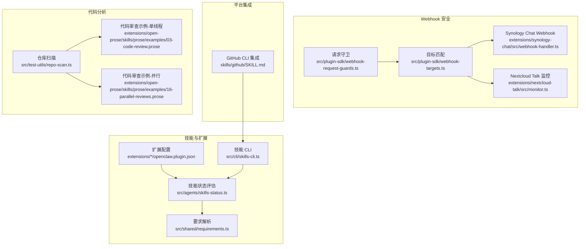
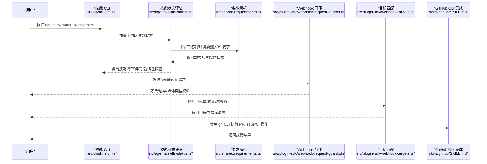
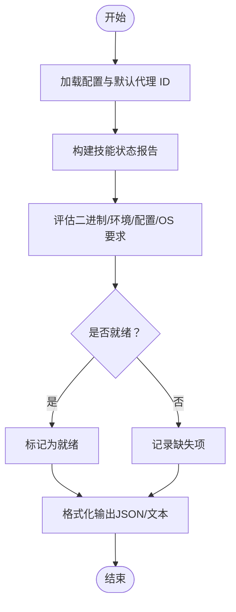
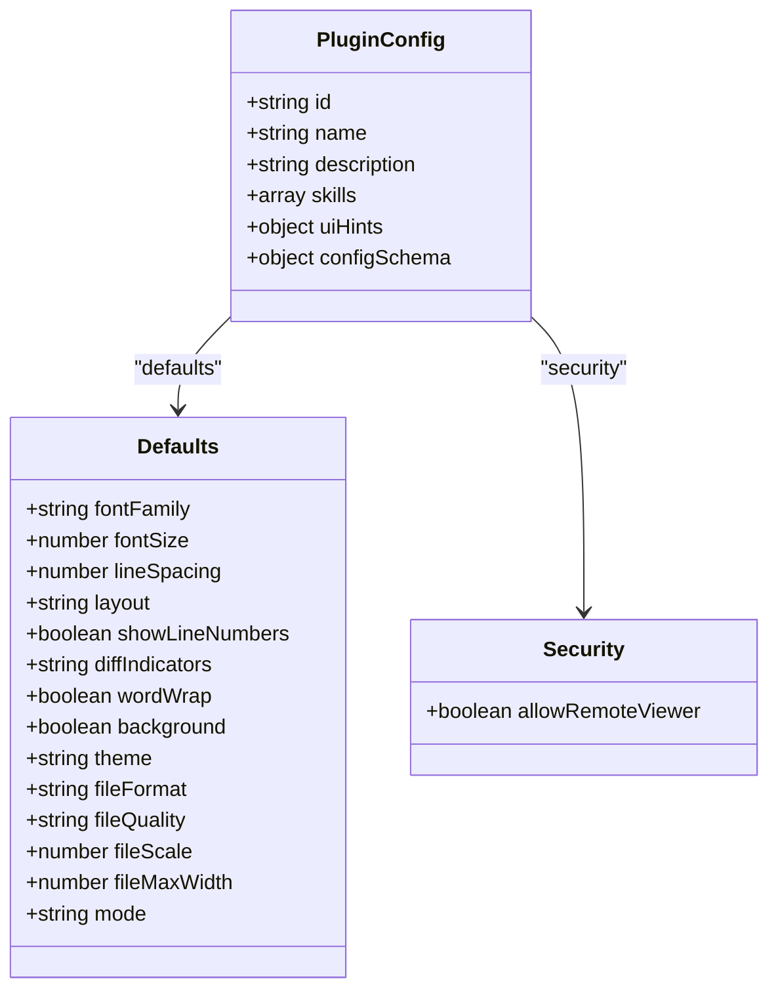
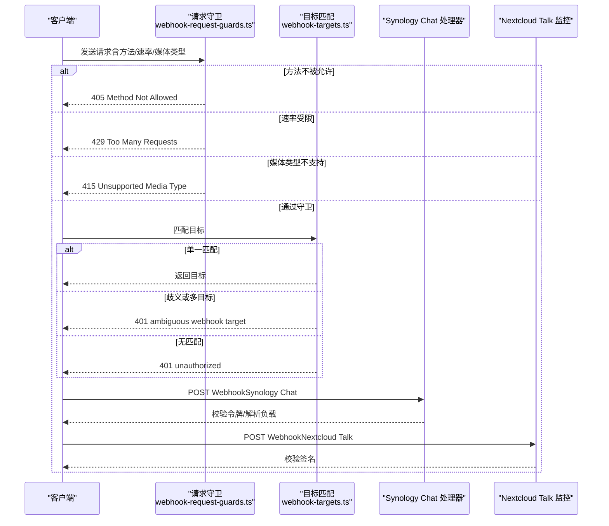
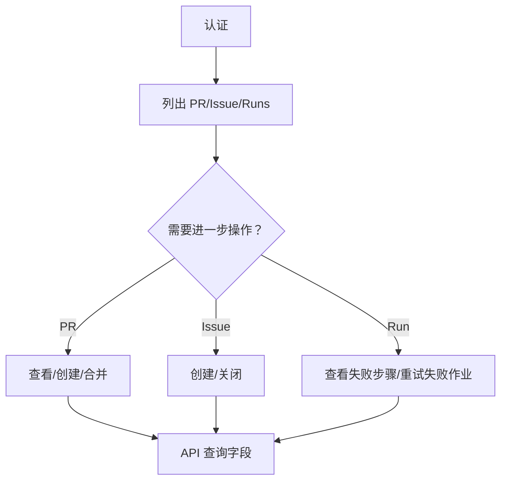
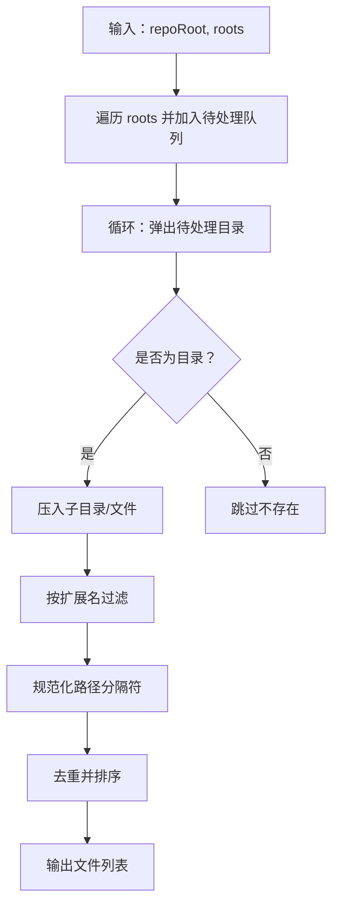
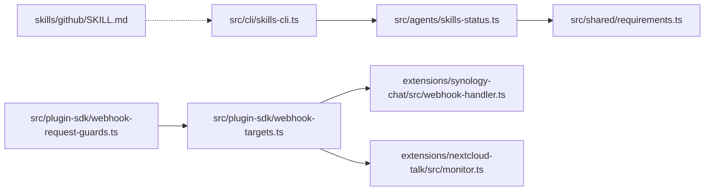

# 开发工具类

<cite>
**本文引用的文件**
- [extensions/diffs/openclaw.plugin.json](file://extensions/diffs/openclaw.plugin.json)
- [extensions/lobster/openclaw.plugin.json](file://extensions/lobster/openclaw.plugin.json)
- [src/cli/skills-cli.ts](file://src/cli/skills-cli.ts)
- [src/cli/skills-cli.format.ts](file://src/cli/skills-cli.format.ts)
- [src/agents/skills-status.ts](file://src/agents/skills-status.ts)
- [src/shared/requirements.ts](file://src/shared/requirements.ts)
- [src/plugin-sdk/webhook-targets.ts](file://src/plugin-sdk/webhook-targets.ts)
- [src/plugin-sdk/webhook-request-guards.ts](file://src/plugin-sdk/webhook-request-guards.ts)
- [extensions/synology-chat/src/webhook-handler.ts](file://extensions/synology-chat/src/webhook-handler.ts)
- [extensions/nextcloud-talk/src/monitor.ts](file://extensions/nextcloud-talk/src/monitor.ts)
- [skills/github/SKILL.md](file://skills/github/SKILL.md)
- [docs/cli/skills.md](file://docs/cli/skills.md)
- [src/test-utils/repo-scan.ts](file://src/test-utils/repo-scan.ts)
- [extensions/open-prose/skills/prose/examples/03-code-review.prose](file://extensions/open-prose/skills/prose/examples/03-code-review.prose)
- [extensions/open-prose/skills/prose/examples/16-parallel-reviews.prose](file://extensions/open-prose/skills/prose/examples/16-parallel-reviews.prose)
</cite>

## 目录
1. [简介](#简介)
2. [项目结构](#项目结构)
3. [核心组件](#核心组件)
4. [架构总览](#架构总览)
5. [详细组件分析](#详细组件分析)
6. [依赖关系分析](#依赖关系分析)
7. [性能考量](#性能考量)
8. [故障排除指南](#故障排除指南)
9. [结论](#结论)
10. [附录](#附录)

## 简介
本文件面向 OpenClaw 的“开发工具类”能力，系统化梳理与开发工具相关的核心模块：技能（Skills）体系、插件配置、Webhook 认证与安全、以及与开发平台（如 GitHub CLI）的集成方式。文档重点覆盖以下方面：
- 技能的发现、状态检查、安装偏好与环境要求评估
- 插件配置与 UI 提示项（Defaults/Security）的定义与生效
- Webhook 请求的通用守卫、目标匹配与认证校验流程
- 与开发平台（GitHub CLI）的 API 调用与工作流集成
- 版本控制与代码管理最佳实践及常见问题排查

## 项目结构
围绕“开发工具类”的关键目录与文件：
- 扩展与技能配置：extensions/*/openclaw.plugin.json 定义扩展 ID、名称、描述与配置模式（configSchema），并声明技能路径
- 技能 CLI：src/cli/skills-cli.* 提供技能列表、信息查询、就绪性检查等命令行能力
- 技能状态与要求：src/agents/skills-status.ts 与 src/shared/requirements.ts 组成技能就绪性评估与要求解析
- Webhook 安全：src/plugin-sdk/webhook-request-guards.ts 与 src/plugin-sdk/webhook-targets.ts 提供请求守卫与目标匹配
- 平台集成示例：skills/github/SKILL.md 展示 GitHub CLI 的认证、PR/Issue/CI 等常用操作
- 仓库扫描与代码分析：src/test-utils/repo-scan.ts 提供仓库文件扫描能力；open-prose 示例展示多视角代码审查流水线

图表来源
- [extensions/diffs/openclaw.plugin.json:1-183](file://extensions/diffs/openclaw.plugin.json#L1-L183)
- [src/agents/skills-status.ts:1-254](file://src/agents/skills-status.ts#L1-L254)
- [src/shared/requirements.ts:1-222](file://src/shared/requirements.ts#L1-L222)
- [src/cli/skills-cli.ts:1-81](file://src/cli/skills-cli.ts#L1-L81)
- [src/plugin-sdk/webhook-request-guards.ts:139-177](file://src/plugin-sdk/webhook-request-guards.ts#L139-L177)
- [src/plugin-sdk/webhook-targets.ts:250-281](file://src/plugin-sdk/webhook-targets.ts#L250-L281)
- [extensions/synology-chat/src/webhook-handler.ts:133-289](file://extensions/synology-chat/src/webhook-handler.ts#L133-L289)
- [extensions/nextcloud-talk/src/monitor.ts:94-130](file://extensions/nextcloud-talk/src/monitor.ts#L94-L130)
- [skills/github/SKILL.md:46-120](file://skills/github/SKILL.md#L46-L120)
- [src/test-utils/repo-scan.ts:45-78](file://src/test-utils/repo-scan.ts#L45-L78)
- [extensions/open-prose/skills/prose/examples/03-code-review.prose:1-17](file://extensions/open-prose/skills/prose/examples/03-code-review.prose#L1-L17)
- [extensions/open-prose/skills/prose/examples/16-parallel-reviews.prose:1-19](file://extensions/open-prose/skills/prose/examples/16-parallel-reviews.prose#L1-L19)

章节来源
- [extensions/diffs/openclaw.plugin.json:1-183](file://extensions/diffs/openclaw.plugin.json#L1-L183)
- [src/cli/skills-cli.ts:1-81](file://src/cli/skills-cli.ts#L1-L81)
- [src/agents/skills-status.ts:1-254](file://src/agents/skills-status.ts#L1-L254)
- [src/shared/requirements.ts:1-222](file://src/shared/requirements.ts#L1-L222)
- [src/plugin-sdk/webhook-request-guards.ts:139-177](file://src/plugin-sdk/webhook-request-guards.ts#L139-L177)
- [src/plugin-sdk/webhook-targets.ts:250-281](file://src/plugin-sdk/webhook-targets.ts#L250-L281)
- [extensions/synology-chat/src/webhook-handler.ts:133-289](file://extensions/synology-chat/src/webhook-handler.ts#L133-L289)
- [extensions/nextcloud-talk/src/monitor.ts:94-130](file://extensions/nextcloud-talk/src/monitor.ts#L94-L130)
- [skills/github/SKILL.md:46-120](file://skills/github/SKILL.md#L46-L120)
- [src/test-utils/repo-scan.ts:45-78](file://src/test-utils/repo-scan.ts#L45-L78)
- [extensions/open-prose/skills/prose/examples/03-code-review.prose:1-17](file://extensions/open-prose/skills/prose/examples/03-code-review.prose#L1-L17)
- [extensions/open-prose/skills/prose/examples/16-parallel-reviews.prose:1-19](file://extensions/open-prose/skills/prose/examples/16-parallel-reviews.prose#L1-L19)

## 核心组件
- 技能状态与要求评估
  - 通过构建技能状态报告，汇总技能来源、是否打包、是否禁用、是否被允许列表限制、是否满足运行要求、缺失项与可选安装方案
  - 支持按平台偏好选择安装器（brew/npm/go/uv/download），并生成安装建议
- 插件配置与 UI 提示
  - 扩展配置文件中定义 defaults 与 security 两类配置项，支持字体、字号、主题、布局、缩放、最大宽度、输出模式等 UI 偏好，以及远程查看器访问开关
- Webhook 安全与认证
  - 通用请求守卫：方法白名单、速率限制、Content-Type 校验
  - 目标匹配：单目标、歧义（多目标）、未授权三种匹配结果
  - 平台示例：Synology Chat 令牌校验；Nextcloud Talk 签名验证
- 平台集成（以 GitHub 为例）
  - 使用 gh CLI 进行认证、PR/Issue/CI 等操作，并通过 API 查询字段
- 代码分析与仓库扫描
  - 仓库文件扫描：遍历根目录集合，过滤扩展名，规范化路径，去重排序
  - 多视角代码审查：顺序与并行两种流水线示例

章节来源
- [src/agents/skills-status.ts:169-225](file://src/agents/skills-status.ts#L169-L225)
- [src/shared/requirements.ts:114-164](file://src/shared/requirements.ts#L114-L164)
- [extensions/diffs/openclaw.plugin.json:68-181](file://extensions/diffs/openclaw.plugin.json#L68-L181)
- [src/plugin-sdk/webhook-request-guards.ts:139-177](file://src/plugin-sdk/webhook-request-guards.ts#L139-L177)
- [src/plugin-sdk/webhook-targets.ts:250-281](file://src/plugin-sdk/webhook-targets.ts#L250-L281)
- [extensions/synology-chat/src/webhook-handler.ts:133-289](file://extensions/synology-chat/src/webhook-handler.ts#L133-L289)
- [extensions/nextcloud-talk/src/monitor.ts:94-130](file://extensions/nextcloud-talk/src/monitor.ts#L94-L130)
- [skills/github/SKILL.md:46-120](file://skills/github/SKILL.md#L46-L120)
- [src/test-utils/repo-scan.ts:61-78](file://src/test-utils/repo-scan.ts#L61-L78)
- [extensions/open-prose/skills/prose/examples/03-code-review.prose:1-17](file://extensions/open-prose/skills/prose/examples/03-code-review.prose#L1-L17)
- [extensions/open-prose/skills/prose/examples/16-parallel-reviews.prose:1-19](file://extensions/open-prose/skills/prose/examples/16-parallel-reviews.prose#L1-L19)

## 架构总览
下图展示从“技能 CLI 到技能状态评估再到 Webhook 安全与平台集成”的整体调用链路。

图表来源
- [src/cli/skills-cli.ts:20-35](file://src/cli/skills-cli.ts#L20-L35)
- [src/agents/skills-status.ts:227-252](file://src/agents/skills-status.ts#L227-L252)
- [src/shared/requirements.ts:114-164](file://src/shared/requirements.ts#L114-L164)
- [src/plugin-sdk/webhook-request-guards.ts:139-177](file://src/plugin-sdk/webhook-request-guards.ts#L139-L177)
- [src/plugin-sdk/webhook-targets.ts:250-281](file://src/plugin-sdk/webhook-targets.ts#L250-L281)
- [skills/github/SKILL.md:46-120](file://skills/github/SKILL.md#L46-L120)

## 详细组件分析

### 技能系统与 CLI
- 功能要点
  - 列表：支持 JSON 输出、仅显示就绪技能、详细展示缺失依赖
  - 详情：按技能名展示信息，支持 JSON 输出
  - 就绪性检查：输出哪些技能可用、哪些因缺少二进制/环境变量/配置/OS 不满足而不可用
- 内部流程
  - 加载配置与工作区，构建技能状态报告，格式化输出
  - 评估逻辑基于二进制存在性、环境变量、配置路径真值、操作系统兼容性，以及扩展打包与允许列表策略

图表来源
- [src/cli/skills-cli.ts:20-35](file://src/cli/skills-cli.ts#L20-L35)
- [src/agents/skills-status.ts:227-252](file://src/agents/skills-status.ts#L227-L252)
- [src/shared/requirements.ts:114-164](file://src/shared/requirements.ts#L114-L164)

章节来源
- [src/cli/skills-cli.ts:1-81](file://src/cli/skills-cli.ts#L1-L81)
- [src/cli/skills-cli.format.ts](file://src/cli/skills-cli.format.ts)
- [src/agents/skills-status.ts:169-225](file://src/agents/skills-status.ts#L169-L225)
- [src/shared/requirements.ts:114-164](file://src/shared/requirements.ts#L114-L164)
- [docs/cli/skills.md:1-27](file://docs/cli/skills.md#L1-L27)

### 插件配置与 UI 提示（Defaults/Security）
- defaults
  - 字体家族、字号、行距、布局（统一/拆分）、行号、差异指示样式、自动换行、背景高亮、主题（浅色/深色）、文件渲染格式（PNG/PDF）、质量、缩放、最大宽度、输出模式（视图/图像/文件/两者）
- security
  - 允许远程查看器访问（当已知令牌路径时）

图表来源
- [extensions/diffs/openclaw.plugin.json:1-183](file://extensions/diffs/openclaw.plugin.json#L1-L183)

章节来源
- [extensions/diffs/openclaw.plugin.json:68-181](file://extensions/diffs/openclaw.plugin.json#L68-L181)

### Webhook 安全与认证
- 通用守卫
  - 方法白名单校验（405）
  - 速率限制（429）
  - Content-Type 校验（415）
- 目标匹配
  - 单一匹配：返回目标
  - 歧义匹配：返回 401（ambiguous webhook target）
  - 未匹配：返回 401（unauthorized）
- 平台示例
  - Synology Chat：支持 application/json 与 application/x-www-form-urlencoded，令牌解析优先级（body.token > query.token > headers），字段别名映射
  - Nextcloud Talk：校验签名头与随机数，使用密钥进行 HMAC 验证

图表来源
- [src/plugin-sdk/webhook-request-guards.ts:139-177](file://src/plugin-sdk/webhook-request-guards.ts#L139-L177)
- [src/plugin-sdk/webhook-targets.ts:250-281](file://src/plugin-sdk/webhook-targets.ts#L250-L281)
- [extensions/synology-chat/src/webhook-handler.ts:133-289](file://extensions/synology-chat/src/webhook-handler.ts#L133-L289)
- [extensions/nextcloud-talk/src/monitor.ts:94-130](file://extensions/nextcloud-talk/src/monitor.ts#L94-L130)

章节来源
- [src/plugin-sdk/webhook-request-guards.ts:139-177](file://src/plugin-sdk/webhook-request-guards.ts#L139-L177)
- [src/plugin-sdk/webhook-targets.ts:250-281](file://src/plugin-sdk/webhook-targets.ts#L250-L281)
- [extensions/synology-chat/src/webhook-handler.ts:133-289](file://extensions/synology-chat/src/webhook-handler.ts#L133-L289)
- [extensions/nextcloud-talk/src/monitor.ts:94-130](file://extensions/nextcloud-talk/src/monitor.ts#L94-L130)

### 平台集成：GitHub CLI
- 认证与验证
  - 使用 gh auth login 完成一次性认证
  - 使用 gh auth status 验证当前会话
- 常用命令
  - PR 列表、检查状态、查看详情、创建、合并
  - Issue 列表、创建、关闭
  - Workflow Runs 列表、查看失败步骤日志、重试失败作业
- API 查询
  - 使用 gh api 获取指定字段（如标题、状态、作者）

图表来源
- [skills/github/SKILL.md:46-120](file://skills/github/SKILL.md#L46-L120)

章节来源
- [skills/github/SKILL.md:46-120](file://skills/github/SKILL.md#L46-L120)

### 代码分析与仓库扫描
- 仓库扫描
  - 输入：仓库根目录 + 根路径集合
  - 处理：遍历根目录，递归收集文件，按扩展名过滤，规范化相对路径，去重并排序
  - 输出：文件路径数组
- 代码审查示例
  - 单线程：依次进行理解、安全、性能、可维护性审查，最后综合报告
  - 并行：多个专门 Agent 并发执行不同维度审查，再合成报告

图表来源
- [src/test-utils/repo-scan.ts:61-78](file://src/test-utils/repo-scan.ts#L61-L78)

章节来源
- [src/test-utils/repo-scan.ts:45-78](file://src/test-utils/repo-scan.ts#L45-L78)
- [extensions/open-prose/skills/prose/examples/03-code-review.prose:1-17](file://extensions/open-prose/skills/prose/examples/03-code-review.prose#L1-L17)
- [extensions/open-prose/skills/prose/examples/16-parallel-reviews.prose:1-19](file://extensions/open-prose/skills/prose/examples/16-parallel-reviews.prose#L1-L19)

## 依赖关系分析
- 技能 CLI 依赖技能状态评估模块，后者依赖要求解析模块
- Webhook 安全由守卫与目标匹配共同组成，平台侧处理器（Synology Chat/Nextcloud Talk）在守卫之后执行具体业务逻辑
- 平台集成（GitHub CLI）独立于上述模块，但可通过技能封装后纳入统一的技能生态

图表来源
- [src/cli/skills-cli.ts:1-81](file://src/cli/skills-cli.ts#L1-L81)
- [src/agents/skills-status.ts:1-254](file://src/agents/skills-status.ts#L1-L254)
- [src/shared/requirements.ts:1-222](file://src/shared/requirements.ts#L1-L222)
- [src/plugin-sdk/webhook-request-guards.ts:139-177](file://src/plugin-sdk/webhook-request-guards.ts#L139-L177)
- [src/plugin-sdk/webhook-targets.ts:250-281](file://src/plugin-sdk/webhook-targets.ts#L250-L281)
- [extensions/synology-chat/src/webhook-handler.ts:133-289](file://extensions/synology-chat/src/webhook-handler.ts#L133-L289)
- [extensions/nextcloud-talk/src/monitor.ts:94-130](file://extensions/nextcloud-talk/src/monitor.ts#L94-L130)
- [skills/github/SKILL.md:46-120](file://skills/github/SKILL.md#L46-L120)

章节来源
- [src/cli/skills-cli.ts:1-81](file://src/cli/skills-cli.ts#L1-L81)
- [src/agents/skills-status.ts:1-254](file://src/agents/skills-status.ts#L1-L254)
- [src/shared/requirements.ts:1-222](file://src/shared/requirements.ts#L1-L222)
- [src/plugin-sdk/webhook-request-guards.ts:139-177](file://src/plugin-sdk/webhook-request-guards.ts#L139-L177)
- [src/plugin-sdk/webhook-targets.ts:250-281](file://src/plugin-sdk/webhook-targets.ts#L250-L281)
- [extensions/synology-chat/src/webhook-handler.ts:133-289](file://extensions/synology-chat/src/webhook-handler.ts#L133-L289)
- [extensions/nextcloud-talk/src/monitor.ts:94-130](file://extensions/nextcloud-talk/src/monitor.ts#L94-L130)
- [skills/github/SKILL.md:46-120](file://skills/github/SKILL.md#L46-L120)

## 性能考量
- 技能就绪性评估
  - 二进制检测与环境变量检查为 O(n)，其中 n 为所需项数量；配置路径检查为 O(m)，m 为配置检查项数量
  - 通过缓存与预计算（如安装器偏好）减少重复开销
- Webhook 处理
  - 优先进行头部与方法校验，避免读取大体积请求体
  - 令牌/签名验证尽量在解析负载前完成，降低无效请求对后端的压力
- 仓库扫描
  - 对路径进行规范化与去重，避免重复 IO；合理设置根路径集合，减少遍历范围

## 故障排除指南
- 技能 CLI
  - 列表为空：确认工作区与打包技能目录是否存在；参考文档链接了解如何安装与启用
  - 缺少依赖：根据就绪性检查输出，安装对应二进制或配置环境变量/配置文件
- Webhook
  - 405 Method Not Allowed：确保使用 POST 方法
  - 429 Too Many Requests：检查速率限制配置或客户端退避策略
  - 415 Unsupported Media Type：确保 Content-Type 设置为 application/json 或 application/x-www-form-urlencoded
  - 401 Unauthorized/Ambiguous：核对目标匹配规则与认证参数（令牌/签名）
  - 平台特定
    - Synology Chat：确认 token 解析顺序与必填字段（token/user_id/text）
    - Nextcloud Talk：确认签名头与随机数、密钥配置正确
- 平台集成（GitHub CLI）
  - 认证失败：重新执行 gh auth login 并验证 gh auth status
  - 权限不足：检查仓库权限与 scopes；必要时调整 gh CLI 的认证账户

章节来源
- [docs/cli/skills.md:1-27](file://docs/cli/skills.md#L1-L27)
- [src/plugin-sdk/webhook-request-guards.ts:139-177](file://src/plugin-sdk/webhook-request-guards.ts#L139-L177)
- [src/plugin-sdk/webhook-targets.ts:250-281](file://src/plugin-sdk/webhook-targets.ts#L250-L281)
- [extensions/synology-chat/src/webhook-handler.ts:133-289](file://extensions/synology-chat/src/webhook-handler.ts#L133-L289)
- [extensions/nextcloud-talk/src/monitor.ts:94-130](file://extensions/nextcloud-talk/src/monitor.ts#L94-L130)
- [skills/github/SKILL.md:46-120](file://skills/github/SKILL.md#L46-L120)

## 结论
OpenClaw 的“开发工具类”以技能体系为核心，结合插件配置、Webhook 安全与平台集成，形成一套可扩展、可审计且易于运维的开发辅助能力。通过 CLI 快速诊断技能就绪性，借助守卫与目标匹配保障 Webhook 安全，配合 GitHub CLI 实现高效的版本控制与协作流程。建议在团队内推广使用统一的技能清单与配置模式，持续完善仓库扫描与代码审查流水线，提升开发效率与质量。

## 附录
- 扩展与技能配置参考
  - 扩展配置文件中的 configSchema 与 uiHints 定义了 UI 偏好与安全开关
- 代码审查示例参考
  - 单线程与并行两种代码审查流水线，便于按需组合不同视角的审查任务

章节来源
- [extensions/diffs/openclaw.plugin.json:68-181](file://extensions/diffs/openclaw.plugin.json#L68-L181)
- [extensions/open-prose/skills/prose/examples/03-code-review.prose:1-17](file://extensions/open-prose/skills/prose/examples/03-code-review.prose#L1-L17)
- [extensions/open-prose/skills/prose/examples/16-parallel-reviews.prose:1-19](file://extensions/open-prose/skills/prose/examples/16-parallel-reviews.prose#L1-L19)