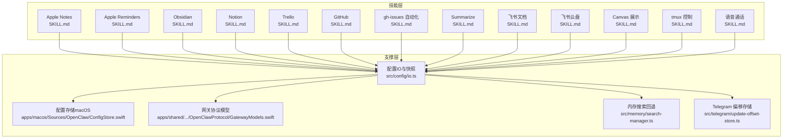
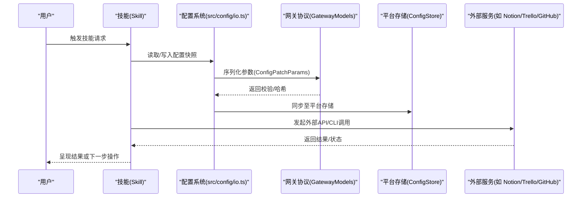
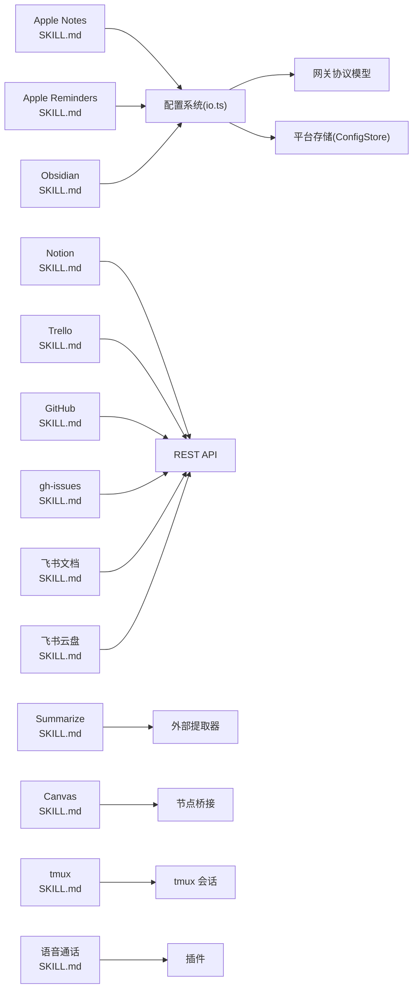

# 生产力工具类

<cite>
**本文引用的文件**
- [SKILL.md（Apple Notes）](file://skills/apple-notes/SKILL.md)
- [SKILL.md（Apple Reminders）](file://skills/apple-reminders/SKILL.md)
- [SKILL.md（Notion）](file://skills/notion/SKILL.md)
- [SKILL.md（Obsidian）](file://skills/obsidian/SKILL.md)
- [SKILL.md（Trello）](file://skills/trello/SKILL.md)
- [SKILL.md（GitHub）](file://skills/github/SKILL.md)
- [SKILL.md（gh-issues 自动化）](file://skills/gh-issues/SKILL.md)
- [SKILL.md（Summarize 摘要）](file://skills/summarize/SKILL.md)
- [SKILL.md（飞书文档）](file://extensions/feishu/skills/feishu-doc/SKILL.md)
- [SKILL.md（飞书云盘）](file://extensions/feishu/skills/feishu-drive/SKILL.md)
- [SKILL.md（Canvas 展示）](file://skills/canvas/SKILL.md)
- [SKILL.md（tmux 远程控制）](file://skills/tmux/SKILL.md)
- [SKILL.md（语音通话）](file://skills/voice-call/SKILL.md)
- [GatewayModels.swift（网关协议模型）](file://apps/shared/OpenClawKit/Sources/OpenClawProtocol/GatewayModels.swift)
- [ConfigStore.swift（配置存储）](file://apps/macos/Sources/OpenClaw/ConfigStore.swift)
- [io.ts（配置IO与快照）](file://src/config/io.ts)
- [search-manager.ts（内存搜索与回退）](file://src/memory/search-manager.ts)
- [update-offset-store.ts（Telegram 更新偏移存储）](file://src/telegram/update-offset-store.ts)
- [TOOL模板（本地笔记）](file://docs/reference/templates/TOOLS.md)
</cite>

## 目录
1. [简介](#简介)
2. [项目结构](#项目结构)
3. [核心组件](#核心组件)
4. [架构总览](#架构总览)
5. [详细组件分析](#详细组件分析)
6. [依赖关系分析](#依赖关系分析)
7. [性能考量](#性能考量)
8. [故障排除指南](#故障排除指南)
9. [结论](#结论)
10. [附录](#附录)

## 简介
本文件面向 OpenClaw 的“生产力工具类技能”，系统梳理笔记管理、任务跟踪、日程安排、文档处理、自动化协作与展示等能力的实现原理、配置选项、数据交换方式与使用流程。重点覆盖以下方面：
- 笔记与文档：Apple Notes/Reminders、Obsidian、Notion、飞书文档与云盘
- 协作与任务：Trello、GitHub 及其自动化子代理流程
- 内容摘要与转录：Summarize
- 设备与展示：Canvas（跨端 HTML 展示）、tmux 远程控制、语音通话
- 配置与同步：配置快照、哈希校验、回退策略、状态持久化
- 故障排除：常见问题定位与修复建议

## 项目结构
OpenClaw 将“技能”以独立的技能目录组织，每个技能包含一个 SKILL.md 文档，描述功能、安装、配置与使用方法；同时在后端提供配置、存储、网关与扩展等支撑模块。

图表来源
- [SKILL.md（Apple Notes）](file://skills/apple-notes/SKILL.md)
- [SKILL.md（Apple Reminders）](file://skills/apple-reminders/SKILL.md)
- [SKILL.md（Obsidian）](file://skills/obsidian/SKILL.md)
- [SKILL.md（Notion）](file://skills/notion/SKILL.md)
- [SKILL.md（Trello）](file://skills/trello/SKILL.md)
- [SKILL.md（GitHub）](file://skills/github/SKILL.md)
- [SKILL.md（gh-issues 自动化）](file://skills/gh-issues/SKILL.md)
- [SKILL.md（Summarize）](file://skills/summarize/SKILL.md)
- [SKILL.md（飞书文档）](file://extensions/feishu/skills/feishu-doc/SKILL.md)
- [SKILL.md（飞书云盘）](file://extensions/feishu/skills/feishu-drive/SKILL.md)
- [SKILL.md（Canvas 展示）](file://skills/canvas/SKILL.md)
- [SKILL.md（tmux 远程控制）](file://skills/tmux/SKILL.md)
- [SKILL.md（语音通话）](file://skills/voice-call/SKILL.md)
- [io.ts（配置IO与快照）](file://src/config/io.ts)
- [ConfigStore.swift（配置存储）](file://apps/macos/Sources/OpenClaw/ConfigStore.swift)
- [GatewayModels.swift（网关协议模型）](file://apps/shared/OpenClawKit/Sources/OpenClawProtocol/GatewayModels.swift)
- [search-manager.ts（内存搜索与回退）](file://src/memory/search-manager.ts)
- [update-offset-store.ts（Telegram 更新偏移存储）](file://src/telegram/update-offset-store.ts)

章节来源
- [SKILL.md（Apple Notes）](file://skills/apple-notes/SKILL.md)
- [SKILL.md（Apple Reminders）](file://skills/apple-reminders/SKILL.md)
- [SKILL.md（Obsidian）](file://skills/obsidian/SKILL.md)
- [SKILL.md（Notion）](file://skills/notion/SKILL.md)
- [SKILL.md（Trello）](file://skills/trello/SKILL.md)
- [SKILL.md（GitHub）](file://skills/github/SKILL.md)
- [SKILL.md（gh-issues 自动化）](file://skills/gh-issues/SKILL.md)
- [SKILL.md（Summarize）](file://skills/summarize/SKILL.md)
- [SKILL.md（飞书文档）](file://extensions/feishu/skills/feishu-doc/SKILL.md)
- [SKILL.md（飞书云盘）](file://extensions/feishu/skills/feishu-drive/SKILL.md)
- [SKILL.md（Canvas 展示）](file://skills/canvas/SKILL.md)
- [SKILL.md（tmux 远程控制）](file://skills/tmux/SKILL.md)
- [SKILL.md（语音通话）](file://skills/voice-call/SKILL.md)
- [io.ts（配置IO与快照）](file://src/config/io.ts)
- [ConfigStore.swift（配置存储）](file://apps/macos/Sources/OpenClaw/ConfigStore.swift)
- [GatewayModels.swift（网关协议模型）](file://apps/shared/OpenClawKit/Sources/OpenClawProtocol/GatewayModels.swift)
- [search-manager.ts（内存搜索与回退）](file://src/memory/search-manager.ts)
- [update-offset-store.ts（Telegram 更新偏移存储）](file://src/telegram/update-offset-store.ts)

## 核心组件
- 技能文档（SKILL.md）：定义工具能力、触发条件、安装与配置、命令示例与注意事项。
- 配置系统：统一的配置快照、哈希校验与补丁合并，支持跨平台配置同步与回退。
- 网关协议：标准化的请求参数结构（如 ConfigPatchParams），确保配置变更可追踪与可审计。
- 存储与状态：不同平台的配置存储实现（如 macOS 的 ConfigStore），以及状态持久化（如 Telegram 偏移存储）。
- 扩展工具：第三方平台（如飞书）的文档/云盘工具，提供统一的动作接口与权限要求。

章节来源
- [SKILL.md（Notion）](file://skills/notion/SKILL.md)
- [SKILL.md（Obsidian）](file://skills/obsidian/SKILL.md)
- [SKILL.md（Trello）](file://skills/trello/SKILL.md)
- [SKILL.md（GitHub）](file://skills/github/SKILL.md)
- [SKILL.md（gh-issues 自动化）](file://skills/gh-issues/SKILL.md)
- [SKILL.md（Summarize）](file://skills/summarize/SKILL.md)
- [SKILL.md（飞书文档）](file://extensions/feishu/skills/feishu-doc/SKILL.md)
- [SKILL.md（飞书云盘）](file://extensions/feishu/skills/feishu-drive/SKILL.md)
- [SKILL.md（Canvas 展示）](file://skills/canvas/SKILL.md)
- [SKILL.md（tmux 远程控制）](file://skills/tmux/SKILL.md)
- [SKILL.md（语音通话）](file://skills/voice-call/SKILL.md)
- [io.ts（配置IO与快照）](file://src/config/io.ts)
- [ConfigStore.swift（配置存储）](file://apps/macos/Sources/OpenClaw/ConfigStore.swift)
- [GatewayModels.swift（网关协议模型）](file://apps/shared/OpenClawKit/Sources/OpenClawProtocol/GatewayModels.swift)
- [search-manager.ts（内存搜索与回退）](file://src/memory/search-manager.ts)
- [update-offset-store.ts（Telegram 更新偏移存储）](file://src/telegram/update-offset-store.ts)

## 架构总览
下图展示了从用户意图到具体执行的端到端路径，涵盖技能调用、配置同步、外部服务交互与状态持久化。

图表来源
- [io.ts（配置IO与快照）](file://src/config/io.ts)
- [GatewayModels.swift（网关协议模型）](file://apps/shared/OpenClawKit/Sources/OpenClawProtocol/GatewayModels.swift)
- [ConfigStore.swift（配置存储）](file://apps/macos/Sources/OpenClaw/ConfigStore.swift)
- [SKILL.md（Notion）](file://skills/notion/SKILL.md)
- [SKILL.md（Trello）](file://skills/trello/SKILL.md)
- [SKILL.md（GitHub）](file://skills/github/SKILL.md)

## 详细组件分析

### 笔记与文档类技能
- Apple Notes/Reminders
  - 实现要点：通过系统原生 CLI（memo、remindctl）直接操作系统应用，适合 macOS 环境下的快速笔记与提醒管理。
  - 数据同步：依赖系统应用的本地与 iCloud 同步，技能本身不引入额外同步层。
  - 使用场景：快速新增/编辑/删除/移动/导出笔记；按日期/列表筛选提醒。
- Obsidian
  - 实现要点：基于本地文件系统的纯文本 Markdown，通过 obsidian-cli 读取默认库、搜索、创建、移动与删除。
  - 数据同步：由 Obsidian 本地与外部同步方案（如 Git/云盘）负责，技能仅做轻量封装。
  - 使用场景：多库管理、安全重命名/移动、内容搜索与批量操作。
- Notion
  - 实现要点：通过 Notion REST API 进行页面/数据库/块的增删改查，支持查询、更新属性与追加块。
  - 数据同步：API 侧的版本头与速率限制需遵循，技能文档给出明确的请求规范。
  - 使用场景：自动化创建/更新页面、查询数据库、嵌入块与属性管理。
- 飞书文档/云盘
  - 实现要点：统一动作接口（read/write/append/create/list_blocks/upload_*），支持表格、图片、附件上传与权限控制。
  - 数据同步：依赖飞书文档/云盘的权限与版本管理，技能提供结构化读写能力。
  - 使用场景：在线文档协作、表格构建、附件上传与块级编辑。

章节来源
- [SKILL.md（Apple Notes）](file://skills/apple-notes/SKILL.md)
- [SKILL.md（Apple Reminders）](file://skills/apple-reminders/SKILL.md)
- [SKILL.md（Obsidian）](file://skills/obsidian/SKILL.md)
- [SKILL.md（Notion）](file://skills/notion/SKILL.md)
- [SKILL.md（飞书文档）](file://extensions/feishu/skills/feishu-doc/SKILL.md)
- [SKILL.md（飞书云盘）](file://extensions/feishu/skills/feishu-drive/SKILL.md)

### 协作与任务类技能
- Trello
  - 实现要点：通过 Trello REST API 列表/卡片/评论等操作，适合看板式任务管理。
  - 数据同步：依赖 Trello 平台的版本与权限，技能文档提供完整的 API 调用示例。
  - 使用场景：创建卡片、移动卡片、添加评论、归档卡片。
- GitHub
  - 实现要点：通过 gh CLI 或 REST API 进行 PR/Issue/CI 等操作，支持 JSON 输出与过滤。
  - 数据同步：依赖 GitHub 的分支/PR/CI 流程，技能提供常用命令与模板。
  - 使用场景：查看 PR 状态、创建/关闭 Issue、查看 CI 日志、进行代码审查。
- gh-issues 自动化
  - 实现要点：自动抓取 Issue、派生子代理并行修复、监控 PR 审查意见并自动修复。
  - 数据同步：通过远程仓库与分支策略、令牌校验与声明式“认领”避免重复处理。
  - 使用场景：大规模 Issue 自动化修复、持续审查处理、通知汇总。

章节来源
- [SKILL.md（Trello）](file://skills/trello/SKILL.md)
- [SKILL.md（GitHub）](file://skills/github/SKILL.md)
- [SKILL.md（gh-issues 自动化）](file://skills/gh-issues/SKILL.md)

### 内容摘要与转录
- Summarize
  - 实现要点：对 URL、本地文件与 YouTube 链接进行摘要/转录，支持多种模型与提取器。
  - 数据同步：本地缓存与外部服务（Firecrawl、Apify）结合，技能提供配置文件与环境变量。
  - 使用场景：快速理解链接内容、提取视频字幕、生成摘要报告。

章节来源
- [SKILL.md（Summarize）](file://skills/summarize/SKILL.md)

### 展示与远程控制
- Canvas
  - 实现要点：在 Mac/iOS/Android 节点上展示 HTML 内容，支持导航、隐藏、快照与热重载。
  - 数据同步：通过网关绑定模式（loopback/lan/tailnet/auto）与节点桥接通信。
  - 使用场景：可视化演示、仪表盘展示、动态内容推送。
- tmux
  - 实现要点：发送按键、捕获面板输出、窗口/窗格导航，适用于交互式会话管理。
  - 数据同步：tmux 会话持久化，SSH 断开后仍保持运行。
  - 使用场景：监控 Claude/Codex 会话、并行工作区管理、后台任务状态检查。
- 语音通话
  - 实现要点：通过插件发起/继续/结束通话与查询状态，支持 Twilio/Telnyx/Plivo/Mock。
  - 数据同步：插件配置与调用状态在系统内流转。
  - 使用场景：自动外呼、通话状态查询、与用户语音交互。

章节来源
- [SKILL.md（Canvas 展示）](file://skills/canvas/SKILL.md)
- [SKILL.md（tmux 远程控制）](file://skills/tmux/SKILL.md)
- [SKILL.md（语音通话）](file://skills/voice-call/SKILL.md)

### 配置与状态管理
- 配置快照与哈希
  - 作用：统一配置的序列化、哈希计算与补丁合并，保证一致性与可回滚性。
  - 关键点：支持从 raw 或 hash 解析，结构化克隆与对象校验。
- 网关协议参数
  - 作用：标准化配置变更参数（如 raw/baseHash/sessionKey/note/restartDelayMs），便于跨平台一致处理。
- 平台存储
  - 作用：将配置写入网关并拉取最新快照，支持 baseHash 对比与增量更新。
- 内存搜索回退
  - 作用：主索引失败时自动切换到备用索引，保障可用性与可观测的回退信息。
- Telegram 偏移存储
  - 作用：持久化 lastUpdateId 与 botId，支持版本兼容与状态恢复。

章节来源
- [io.ts（配置IO与快照）](file://src/config/io.ts)
- [GatewayModels.swift（网关协议模型）](file://apps/shared/OpenClawKit/Sources/OpenClawProtocol/GatewayModels.swift)
- [ConfigStore.swift（配置存储）](file://apps/macos/Sources/OpenClaw/ConfigStore.swift)
- [search-manager.ts（内存搜索与回退）](file://src/memory/search-manager.ts)
- [update-offset-store.ts（Telegram 更新偏移存储）](file://src/telegram/update-offset-store.ts)

## 依赖关系分析
- 技能与外部服务
  - Notion/Trello/GitHub/飞书等均通过 REST API 或 CLI 工具与平台交互，技能文档提供明确的调用示例与注意事项。
- 技能与配置系统
  - 所有技能在执行前/后都会与配置系统交互，确保参数正确、快照一致与变更可追踪。
- 平台差异
  - macOS 上的配置存储与网关协议模型提供统一抽象，其他平台可复用相同参数结构。

图表来源
- [SKILL.md（Apple Notes）](file://skills/apple-notes/SKILL.md)
- [SKILL.md（Apple Reminders）](file://skills/apple-reminders/SKILL.md)
- [SKILL.md（Obsidian）](file://skills/obsidian/SKILL.md)
- [SKILL.md（Notion）](file://skills/notion/SKILL.md)
- [SKILL.md（Trello）](file://skills/trello/SKILL.md)
- [SKILL.md（GitHub）](file://skills/github/SKILL.md)
- [SKILL.md（gh-issues 自动化）](file://skills/gh-issues/SKILL.md)
- [SKILL.md（Summarize）](file://skills/summarize/SKILL.md)
- [SKILL.md（飞书文档）](file://extensions/feishu/skills/feishu-doc/SKILL.md)
- [SKILL.md（飞书云盘）](file://extensions/feishu/skills/feishu-drive/SKILL.md)
- [SKILL.md（Canvas 展示）](file://skills/canvas/SKILL.md)
- [SKILL.md（tmux 远程控制）](file://skills/tmux/SKILL.md)
- [SKILL.md（语音通话）](file://skills/voice-call/SKILL.md)
- [io.ts（配置IO与快照）](file://src/config/io.ts)
- [GatewayModels.swift（网关协议模型）](file://apps/shared/OpenClawKit/Sources/OpenClawProtocol/GatewayModels.swift)
- [ConfigStore.swift（配置存储）](file://apps/macos/Sources/OpenClaw/ConfigStore.swift)

## 性能考量
- API 调用节流：遵循各平台速率限制（如 Notion 的平均 3 请求/秒、Trello 的 300/10 秒上限），必要时使用缓存与批量请求。
- 并行与并发：在自动化场景中（如 gh-issues），合理设置并发数与超时时间，避免资源争用与超时失败。
- 本地缓存与增量更新：利用配置快照哈希与补丁合并，减少不必要的全量传输。
- 热重载与开发效率：Canvas 的 liveReload 在开发阶段显著提升迭代速度。

## 故障排除指南
- 配置无法同步/回退
  - 现象：配置更新后未生效或出现冲突。
  - 排查：确认 baseHash 是否正确传递；检查快照哈希解析与补丁合并逻辑；必要时回退到上一版本。
  - 参考：配置 IO 与快照解析、网关参数结构。
- 外部服务错误
  - 现象：API 返回 401/403/429 或速率受限。
  - 排查：核对令牌与权限范围；检查请求头（如 Notion-Version）；遵循速率限制与 Retry-After。
  - 参考：各技能文档中的 API 示例与限制说明。
- 状态丢失/异常
  - 现象：Telegram 更新偏移丢失导致消息重复或遗漏。
  - 排查：检查状态存储版本与字段类型；验证 lastUpdateId 合法性；必要时重建偏移状态。
  - 参考：Telegram 偏移存储解析逻辑。
- 搜索不可用
  - 现象：主索引失败导致搜索中断。
  - 排查：启用备用索引；记录回退原因；观察 fallback 状态。
  - 参考：内存搜索回退管理器。
- 本地笔记/文档异常
  - 现象：Obsidian/Obsidian CLI 无法定位默认库；飞书文档权限不足。
  - 排查：读取配置文件确定活动库；确认飞书权限与 owner_open_id；必要时重新授权。
  - 参考：Obsidian 快速定位默认库、飞书文档权限要求。

章节来源
- [io.ts（配置IO与快照）](file://src/config/io.ts)
- [GatewayModels.swift（网关协议模型）](file://apps/shared/OpenClawKit/Sources/OpenClawProtocol/GatewayModels.swift)
- [ConfigStore.swift（配置存储）](file://apps/macos/Sources/OpenClaw/ConfigStore.swift)
- [search-manager.ts（内存搜索与回退）](file://src/memory/search-manager.ts)
- [update-offset-store.ts（Telegram 更新偏移存储）](file://src/telegram/update-offset-store.ts)
- [SKILL.md（Obsidian）](file://skills/obsidian/SKILL.md)
- [SKILL.md（飞书文档）](file://extensions/feishu/skills/feishu-doc/SKILL.md)
- [SKILL.md（Notion）](file://skills/notion/SKILL.md)
- [SKILL.md（Trello）](file://skills/trello/SKILL.md)
- [SKILL.md（GitHub）](file://skills/github/SKILL.md)

## 结论
OpenClaw 的生产力工具类技能通过“技能文档 + 配置系统 + 网关协议 + 平台存储”的组合，实现了从笔记/文档、任务/协作、内容摘要到展示/远程控制的全链路能力。其关键优势在于：
- 统一的配置快照与哈希校验，确保变更可控与可回滚；
- 标准化的网关参数结构，降低跨平台差异；
- 丰富的外部服务集成与自动化流程，提升协作效率；
- 完善的故障排除与回退策略，保障稳定性。

## 附录
- 本地笔记模板参考：用于存放环境特定的本地备注与配置，与技能分离，便于团队共享与个人定制。
  
章节来源
- [TOOL模板（本地笔记）](file://docs/reference/templates/TOOLS.md)