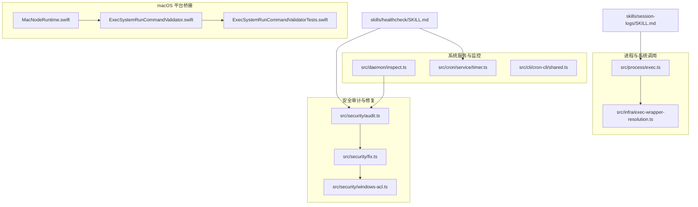
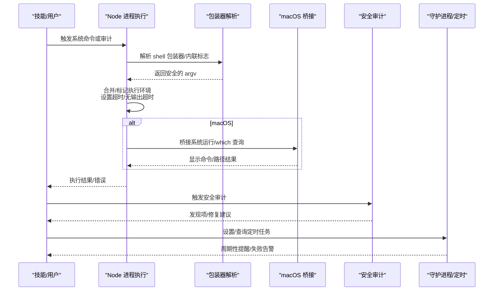
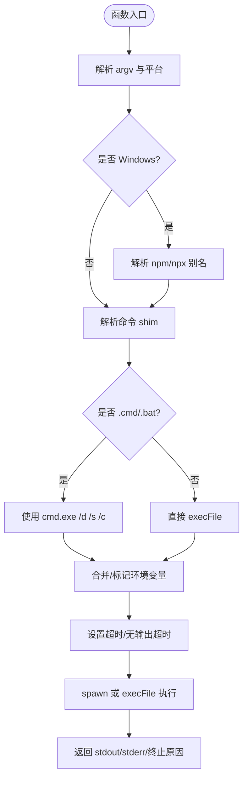
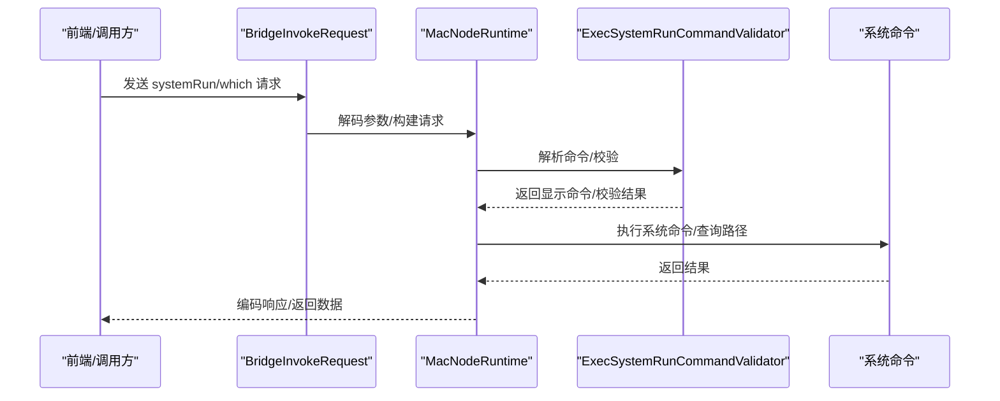
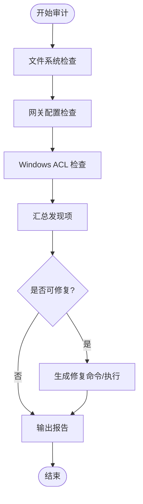
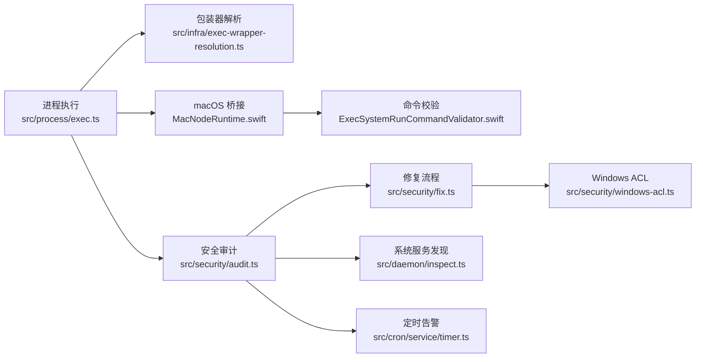

# 系统工具类

<cite>
**本文引用的文件**
- [src/process/exec.ts](file://src/process/exec.ts)
- [src/infra/exec-wrapper-resolution.ts](file://src/infra/exec-wrapper-resolution.ts)
- [apps/macos/Sources/OpenClaw/NodeMode/MacNodeRuntime.swift](file://apps/macos/Sources/OpenClaw/NodeMode/MacNodeRuntime.swift)
- [apps/macos/Sources/OpenClaw/ExecSystemRunCommandValidator.swift](file://apps/macos/Sources/OpenClaw/ExecSystemRunCommandValidator.swift)
- [apps/macos/Tests/OpenClawIPCTests/ExecSystemRunCommandValidatorTests.swift](file://apps/macos/Tests/OpenClawIPCTests/ExecSystemRunCommandValidatorTests.swift)
- [src/security/audit.ts](file://src/security/audit.ts)
- [src/security/fix.ts](file://src/security/fix.ts)
- [src/security/windows-acl.ts](file://src/security/windows-acl.ts)
- [src/daemon/inspect.ts](file://src/daemon/inspect.ts)
- [skills/healthcheck/SKILL.md](file://skills/healthcheck/SKILL.md)
- [skills/session-logs/SKILL.md](file://skills/session-logs/SKILL.md)
- [src/cron/service/timer.ts](file://src/cron/service/timer.ts)
- [src/cli/cron-cli/shared.ts](file://src/cli/cron-cli/shared.ts)
- [SECURITY.md](file://SECURITY.md)
</cite>

## 目录
1. [简介](#简介)
2. [项目结构](#项目结构)
3. [核心组件](#核心组件)
4. [架构总览](#架构总览)
5. [详细组件分析](#详细组件分析)
6. [依赖关系分析](#依赖关系分析)
7. [性能考量](#性能考量)
8. [故障排除指南](#故障排除指南)
9. [结论](#结论)
10. [附录](#附录)

## 简介
本文件面向 OpenClaw 的“系统工具类”能力，聚焦系统级工具技能在密码管理、文件操作、进程管理与系统监控方面的功能与实现。内容涵盖：
- 工具实现原理：系统调用封装、命令行集成、跨平台兼容与安全机制
- 配置选项与使用方法：参数设置、权限控制、执行环境
- 与操作系统和硬件的交互：API 调用、文件系统访问、网络通信
- 最佳实践与安全注意事项
- 常见问题排查与性能优化建议

## 项目结构
围绕系统工具类的关键目录与文件：
- 进程执行与系统调用封装：src/process/exec.ts、src/infra/exec-wrapper-resolution.ts
- macOS 平台桥接与命令校验：apps/macos/Sources/OpenClaw/NodeMode/MacNodeRuntime.swift、ExecSystemRunCommandValidator.swift 及其测试
- 安全审计与修复：src/security/audit.ts、src/security/fix.ts、src/security/windows-acl.ts
- 守护进程与系统服务发现：src/daemon/inspect.ts
- 技能与使用示例：skills/healthcheck/SKILL.md、skills/session-logs/SKILL.md
- 定时任务与告警：src/cron/service/timer.ts、src/cli/cron-cli/shared.ts
- 安全边界与信任模型：SECURITY.md

**图表来源**
- [src/process/exec.ts:1-336](file://src/process/exec.ts#L1-L336)
- [src/infra/exec-wrapper-resolution.ts:1-46](file://src/infra/exec-wrapper-resolution.ts#L1-L46)
- [apps/macos/Sources/OpenClaw/NodeMode/MacNodeRuntime.swift:546-581](file://apps/macos/Sources/OpenClaw/NodeMode/MacNodeRuntime.swift#L546-L581)
- [apps/macos/Sources/OpenClaw/ExecSystemRunCommandValidator.swift:1-50](file://apps/macos/Sources/OpenClaw/ExecSystemRunCommandValidator.swift#L1-L50)
- [apps/macos/Tests/OpenClawIPCTests/ExecSystemRunCommandValidatorTests.swift:1-40](file://apps/macos/Tests/OpenClawIPCTests/ExecSystemRunCommandValidatorTests.swift#L1-L40)
- [src/security/audit.ts:1-800](file://src/security/audit.ts#L1-L800)
- [src/security/fix.ts:110-163](file://src/security/fix.ts#L110-L163)
- [src/security/windows-acl.ts:1-43](file://src/security/windows-acl.ts#L1-L43)
- [src/daemon/inspect.ts:360-432](file://src/daemon/inspect.ts#L360-L432)
- [src/cron/service/timer.ts:246-288](file://src/cron/service/timer.ts#L246-L288)
- [src/cli/cron-cli/shared.ts:108-160](file://src/cli/cron-cli/shared.ts#L108-L160)
- [skills/healthcheck/SKILL.md:1-246](file://skills/healthcheck/SKILL.md#L1-L246)
- [skills/session-logs/SKILL.md:1-116](file://skills/session-logs/SKILL.md#L1-L116)

**章节来源**
- [src/process/exec.ts:1-336](file://src/process/exec.ts#L1-L336)
- [src/infra/exec-wrapper-resolution.ts:1-46](file://src/infra/exec-wrapper-resolution.ts#L1-L46)
- [apps/macos/Sources/OpenClaw/NodeMode/MacNodeRuntime.swift:546-581](file://apps/macos/Sources/OpenClaw/NodeMode/MacNodeRuntime.swift#L546-L581)
- [apps/macos/Sources/OpenClaw/ExecSystemRunCommandValidator.swift:1-50](file://apps/macos/Sources/OpenClaw/ExecSystemRunCommandValidator.swift#L1-L50)
- [apps/macos/Tests/OpenClawIPCTests/ExecSystemRunCommandValidatorTests.swift:1-40](file://apps/macos/Tests/OpenClawIPCTests/ExecSystemRunCommandValidatorTests.swift#L1-L40)
- [src/security/audit.ts:1-800](file://src/security/audit.ts#L1-L800)
- [src/security/fix.ts:110-163](file://src/security/fix.ts#L110-L163)
- [src/security/windows-acl.ts:1-43](file://src/security/windows-acl.ts#L1-L43)
- [src/daemon/inspect.ts:360-432](file://src/daemon/inspect.ts#L360-L432)
- [src/cron/service/timer.ts:246-288](file://src/cron/service/timer.ts#L246-L288)
- [src/cli/cron-cli/shared.ts:108-160](file://src/cli/cron-cli/shared.ts#L108-L160)
- [skills/healthcheck/SKILL.md:1-246](file://skills/healthcheck/SKILL.md#L1-L246)
- [skills/session-logs/SKILL.md:1-116](file://skills/session-logs/SKILL.md#L1-L116)

## 核心组件
- 进程执行与系统调用封装：统一处理跨平台命令执行、超时控制、输入输出流继承、环境变量合并与标记、Windows 批处理与 npm/yarn 兼容性处理。
- 命令包装器解析：识别 shell 包装器、内联命令标志、多路复用器（busybox/toybox）以及调度型包装器（sudo、timeout 等），并进行安全限制与深度解析。
- macOS 平台桥接与命令校验：在 macOS 上通过 Swift 桥接 Node 运行时，提供系统运行命令与 which 查询，并对命令进行严格解析与校验，避免注入风险。
- 安全审计与修复：对状态目录、配置文件、通道与网关暴露面进行扫描，生成可修复建议；在 Windows 上基于 ACL 检测与重置策略。
- 守护进程与系统服务发现：在 Linux/macOS/Windows 上枚举 systemd 服务、计划任务等，辅助安全审计与系统健康检查。
- 技能与自动化：healthcheck 技能提供主机加固与周期性审计流程；session-logs 技能用于会话日志检索与分析。
- 定时任务与告警：定时服务失败告警与 CLI 输出格式化。

**章节来源**
- [src/process/exec.ts:100-336](file://src/process/exec.ts#L100-L336)
- [src/infra/exec-wrapper-resolution.ts:1-46](file://src/infra/exec-wrapper-resolution.ts#L1-L46)
- [apps/macos/Sources/OpenClaw/NodeMode/MacNodeRuntime.swift:546-581](file://apps/macos/Sources/OpenClaw/NodeMode/MacNodeRuntime.swift#L546-L581)
- [src/security/audit.ts:208-337](file://src/security/audit.ts#L208-L337)
- [src/security/fix.ts:110-163](file://src/security/fix.ts#L110-L163)
- [src/daemon/inspect.ts:360-432](file://src/daemon/inspect.ts#L360-L432)
- [skills/healthcheck/SKILL.md:1-246](file://skills/healthcheck/SKILL.md#L1-L246)
- [skills/session-logs/SKILL.md:1-116](file://skills/session-logs/SKILL.md#L1-L116)
- [src/cron/service/timer.ts:246-288](file://src/cron/service/timer.ts#L246-L288)
- [src/cli/cron-cli/shared.ts:108-160](file://src/cli/cron-cli/shared.ts#L108-L160)

## 架构总览
系统工具类以“进程执行—平台桥接—安全审计—系统监控—技能编排”的链路协同工作，确保命令执行的安全性、可观测性与可恢复性。

**图表来源**
- [src/process/exec.ts:100-336](file://src/process/exec.ts#L100-L336)
- [src/infra/exec-wrapper-resolution.ts:1-46](file://src/infra/exec-wrapper-resolution.ts#L1-L46)
- [apps/macos/Sources/OpenClaw/NodeMode/MacNodeRuntime.swift:546-581](file://apps/macos/Sources/OpenClaw/NodeMode/MacNodeRuntime.swift#L546-L581)
- [src/security/audit.ts:208-337](file://src/security/audit.ts#L208-L337)
- [src/cron/service/timer.ts:246-288](file://src/cron/service/timer.ts#L246-L288)

## 详细组件分析

### 组件一：进程执行与系统调用封装
- 功能要点
  - 统一封装 execFile/spawn，支持超时、无输出超时、stdin 输入、环境变量合并与标记
  - Windows 平台兼容：.cmd/.bat 直接执行限制、npm/npx 解析到 node + cli 脚本、cmd.exe 命令行转义
  - 安全策略：禁止 argv 基于 shell 的隐式路由，显式 shell 包装需由调用方验证/转义
- 关键实现
  - 超时与无输出超时：通过定时器与子进程事件驱动终止
  - 环境变量处理：过滤 undefined、字符串化、抑制 npm fund 提示、标记 OpenClaw 执行环境
  - Windows 批处理：使用 ComSpec/cmd.exe 包装，verbatim 参数传递
- 复杂度与性能
  - 时间复杂度近似 O(1) 的单次调用；I/O 由底层 child_process 决定
  - 通过 no-output-timeout 防止僵尸进程与资源泄漏
- 安全机制
  - 严格拒绝危险字符进入 cmd.exe 参数
  - 禁止 shell 路由 argv，避免注入
  - 对 npm/yarn 等非 .exe 命令进行 shim 解析

**图表来源**
- [src/process/exec.ts:100-336](file://src/process/exec.ts#L100-L336)

**章节来源**
- [src/process/exec.ts:100-336](file://src/process/exec.ts#L100-L336)

### 组件二：命令包装器解析与安全限制
- 功能要点
  - 识别 POSIX/Windows shell 包装器、内联命令标志、多路复用器与调度型包装器
  - 限制最大分发包装器深度，避免链式包装导致的绕过与不可控行为
  - Windows 可执行后缀别名展开与去除
- 实现要点
  - POSIX_SHELL_WRAPPER_NAMES、WINDOWS_CMD_WRAPPER_NAMES、POWERSHELL_WRAPPER_NAMES、SHELL_MULTIPLEXER_WRAPPER_NAMES、DISPATCH_WRAPPER_NAMES
  - POSIX_INLINE_COMMAND_FLAGS、POWERSHELL_INLINE_COMMAND_FLAGS
- 安全意义
  - 限定允许的包装器集合，减少注入与越权执行风险
  - 通过 MAX_DISPATCH_WRAPPER_DEPTH 控制递归深度

**章节来源**
- [src/infra/exec-wrapper-resolution.ts:1-46](file://src/infra/exec-wrapper-resolution.ts#L1-L46)

### 组件三：macOS 平台桥接与命令校验
- 功能要点
  - 提供 systemRun 与 which 查询接口，将 Node 侧命令安全地转发至系统层
  - 对命令进行严格解析与校验，避免 shell 注入与路径歧义
- 关键实现
  - MacNodeRuntime.swift 中 handleSystemWhich 与 executeSystemRun
  - ExecSystemRunCommandValidator.swift 对 shell 包装器、内联标志、多路复用器进行匹配与裁剪
  - 测试用例确保契约一致性与错误信息可预期

**图表来源**
- [apps/macos/Sources/OpenClaw/NodeMode/MacNodeRuntime.swift:546-581](file://apps/macos/Sources/OpenClaw/NodeMode/MacNodeRuntime.swift#L546-L581)
- [apps/macos/Sources/OpenClaw/ExecSystemRunCommandValidator.swift:1-50](file://apps/macos/Sources/OpenClaw/ExecSystemRunCommandValidator.swift#L1-L50)
- [apps/macos/Tests/OpenClawIPCTests/ExecSystemRunCommandValidatorTests.swift:1-40](file://apps/macos/Tests/OpenClawIPCTests/ExecSystemRunCommandValidatorTests.swift#L1-L40)

**章节来源**
- [apps/macos/Sources/OpenClaw/NodeMode/MacNodeRuntime.swift:546-581](file://apps/macos/Sources/OpenClaw/NodeMode/MacNodeRuntime.swift#L546-L581)
- [apps/macos/Sources/OpenClaw/ExecSystemRunCommandValidator.swift:1-50](file://apps/macos/Sources/OpenClaw/ExecSystemRunCommandValidator.swift#L1-L50)
- [apps/macos/Tests/OpenClawIPCTests/ExecSystemRunCommandValidatorTests.swift:1-40](file://apps/macos/Tests/OpenClawIPCTests/ExecSystemRunCommandValidatorTests.swift#L1-L40)

### 组件四：安全审计与修复（文件系统与网关）
- 功能要点
  - 文件系统权限检测：状态目录、配置文件的可读写权限、符号链接风险
  - 网关暴露面评估：绑定地址、认证模式、反向代理信任、尾云模式、mDNS 模式等
  - Windows ACL 检测与重置：识别不受信任主体、可信主体，生成修复命令
- 关键实现
  - collectFilesystemFindings：基于 inspectPathPermissions 与 formatPermissionRemediation
  - collectGatewayConfigFindings：对 gateway.bind、auth、controlUi、trustedProxies、tailscale 等进行综合评估
  - safeAclReset：针对 Windows ACL 的安全重置流程
- 安全意义
  - 将潜在风险（世界可写、组可写、未认证绑定、尾云公开暴露）转化为可修复建议
  - 在 Windows 上通过 ACL 语义化分类与重置，降低凭据泄露与越权风险

**图表来源**
- [src/security/audit.ts:208-337](file://src/security/audit.ts#L208-L337)
- [src/security/audit.ts:339-687](file://src/security/audit.ts#L339-L687)
- [src/security/fix.ts:110-163](file://src/security/fix.ts#L110-L163)
- [src/security/windows-acl.ts:1-43](file://src/security/windows-acl.ts#L1-43)

**章节来源**
- [src/security/audit.ts:208-337](file://src/security/audit.ts#L208-L337)
- [src/security/audit.ts:339-687](file://src/security/audit.ts#L339-L687)
- [src/security/fix.ts:110-163](file://src/security/fix.ts#L110-L163)
- [src/security/windows-acl.ts:1-43](file://src/security/windows-acl.ts#L1-43)

### 组件五：守护进程与系统服务发现
- 功能要点
  - Linux：扫描用户与系统级 systemd 单元，支持深搜
  - Windows：查询计划任务列表，过滤 OpenClaw 相关任务，识别潜在风险标记
- 实现要点
  - scanSystemdDir：遍历 .service/.timer 等单元文件
  - parseSchtasksList：解析 schtasks 输出，提取任务名称与执行命令
- 应用场景
  - 结合安全审计，识别持久化与自动启动项，辅助主机加固

**章节来源**
- [src/daemon/inspect.ts:360-432](file://src/daemon/inspect.ts#L360-L432)

### 组件六：技能与使用示例
- healthcheck 技能
  - 主机上下文收集、只读检查、安全审计（含 --fix）、版本状态检查、周期性审计调度
  - 强调最小权限、可逆变更与回滚策略
- session-logs 技能
  - 使用 jq/rg 搜索会话日志，统计成本、消息数、工具使用情况，支持跨会话全文检索

**章节来源**
- [skills/healthcheck/SKILL.md:1-246](file://skills/healthcheck/SKILL.md#L1-L246)
- [skills/session-logs/SKILL.md:1-116](file://skills/session-logs/SKILL.md#L1-L116)

### 组件七：定时任务与告警
- 功能要点
  - 失败告警：连续失败次数、最后错误截断、渠道通知或系统事件
  - CLI 输出格式化：时间、相对时间、状态列宽与截断
- 实现要点
  - emitFailureAlert：根据配置发送告警或入队系统事件
  - shared：表格列宽、时间格式化、相对时间展示

**章节来源**
- [src/cron/service/timer.ts:246-288](file://src/cron/service/timer.ts#L246-L288)
- [src/cli/cron-cli/shared.ts:108-160](file://src/cli/cron-cli/shared.ts#L108-L160)

## 依赖关系分析
- 组件耦合
  - 进程执行模块与包装器解析模块强相关，前者依赖后者提供的安全 argv
  - macOS 桥接模块与命令校验模块紧密配合，确保跨语言调用的安全性
  - 安全审计模块依赖文件系统与网关配置解析，Windows ACL 模块提供平台特定修复能力
  - 守护进程与系统服务发现为审计提供系统级上下文
- 外部依赖
  - Node child_process、fs、path、os
  - Windows icacls、schtasks
  - macOS systemd、计划任务（通过 schtasks）

**图表来源**
- [src/process/exec.ts:100-336](file://src/process/exec.ts#L100-L336)
- [src/infra/exec-wrapper-resolution.ts:1-46](file://src/infra/exec-wrapper-resolution.ts#L1-L46)
- [apps/macos/Sources/OpenClaw/NodeMode/MacNodeRuntime.swift:546-581](file://apps/macos/Sources/OpenClaw/NodeMode/MacNodeRuntime.swift#L546-L581)
- [apps/macos/Sources/OpenClaw/ExecSystemRunCommandValidator.swift:1-50](file://apps/macos/Sources/OpenClaw/ExecSystemRunCommandValidator.swift#L1-L50)
- [src/security/audit.ts:208-337](file://src/security/audit.ts#L208-L337)
- [src/security/fix.ts:110-163](file://src/security/fix.ts#L110-L163)
- [src/security/windows-acl.ts:1-43](file://src/security/windows-acl.ts#L1-43)
- [src/daemon/inspect.ts:360-432](file://src/daemon/inspect.ts#L360-L432)
- [src/cron/service/timer.ts:246-288](file://src/cron/service/timer.ts#L246-L288)

**章节来源**
- [src/process/exec.ts:100-336](file://src/process/exec.ts#L100-L336)
- [src/infra/exec-wrapper-resolution.ts:1-46](file://src/infra/exec-wrapper-resolution.ts#L1-L46)
- [apps/macos/Sources/OpenClaw/NodeMode/MacNodeRuntime.swift:546-581](file://apps/macos/Sources/OpenClaw/NodeMode/MacNodeRuntime.swift#L546-L581)
- [apps/macos/Sources/OpenClaw/ExecSystemRunCommandValidator.swift:1-50](file://apps/macos/Sources/OpenClaw/ExecSystemRunCommandValidator.swift#L1-L50)
- [src/security/audit.ts:208-337](file://src/security/audit.ts#L208-L337)
- [src/security/fix.ts:110-163](file://src/security/fix.ts#L110-L163)
- [src/security/windows-acl.ts:1-43](file://src/security/windows-acl.ts#L1-43)
- [src/daemon/inspect.ts:360-432](file://src/daemon/inspect.ts#L360-L432)
- [src/cron/service/timer.ts:246-288](file://src/cron/service/timer.ts#L246-L288)

## 性能考量
- 进程执行
  - 合理设置 timeout 与 noOutputTimeout，避免长时间阻塞与资源占用
  - 在 Windows 上优先使用 node + cli 脚本替代 .cmd/.bat，减少 shell 层开销
- 安全审计
  - 深度审计仅在必要时启用，避免频繁系统调用
  - Windows ACL 检测按需执行，避免重复扫描
- 定时任务
  - 失败告警频率与渠道限流，避免噪声干扰
  - CLI 输出格式化采用固定宽度与截断，提升大列表渲染效率

[本节为通用指导，无需具体文件分析]

## 故障排除指南
- 命令执行失败
  - 检查 argv 是否被错误地路由到 shell，确认是否使用了显式 shell 包装并正确转义
  - Windows 下确认 .cmd/.bat 是否通过 cmd.exe 包装，避免直接 spawn 导致 EINVAL
  - 查看 verbose 日志定位 stdout/stderr
- 权限问题
  - 文件系统：状态目录与配置文件应限制为 0700/0600；避免世界可写或组可写
  - Windows ACL：识别不受信任主体（Everyone、Authenticated Users 等），使用安全重置命令
- 网关暴露风险
  - 非 loopback 绑定必须配置认证；控制 UI 允许来源需明确列出；禁用危险配置项
  - 尾云模式选择 serve 或 off，避免公开暴露
- 定时任务告警
  - 检查连续失败次数与最后错误；必要时调整 wakeMode 或渠道配置
- 技能使用
  - healthcheck：先只读检查再申请变更，遵循最小权限与可逆原则
  - session-logs：使用 jq/rg 精准检索，注意大文件采样 head/tail

**章节来源**
- [src/process/exec.ts:100-336](file://src/process/exec.ts#L100-L336)
- [src/security/audit.ts:208-337](file://src/security/audit.ts#L208-L337)
- [src/security/fix.ts:110-163](file://src/security/fix.ts#L110-L163)
- [src/cron/service/timer.ts:246-288](file://src/cron/service/timer.ts#L246-L288)
- [skills/healthcheck/SKILL.md:1-246](file://skills/healthcheck/SKILL.md#L1-L246)
- [skills/session-logs/SKILL.md:1-116](file://skills/session-logs/SKILL.md#L1-L116)

## 结论
OpenClaw 的系统工具类通过严格的进程执行封装、平台桥接与命令校验、全面的安全审计与修复、系统服务发现与定时告警，构建了从命令执行到系统监控的完整闭环。结合 healthcheck 与 session-logs 等技能，用户可在保证安全的前提下高效完成密码管理、文件操作、进程管理与系统监控任务。

[本节为总结性内容，无需具体文件分析]

## 附录
- 安全边界与信任模型参考：了解 out of scope 与信任边界，有助于正确评估风险与合规要求

**章节来源**
- [SECURITY.md:112-131](file://SECURITY.md#L112-L131)