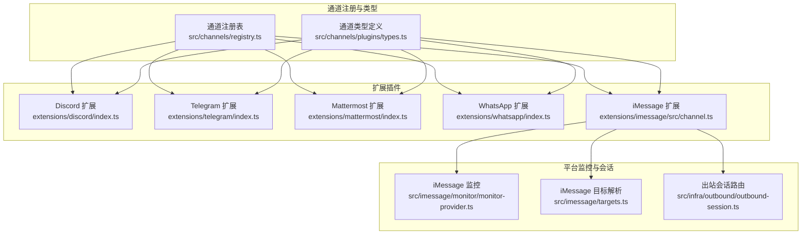
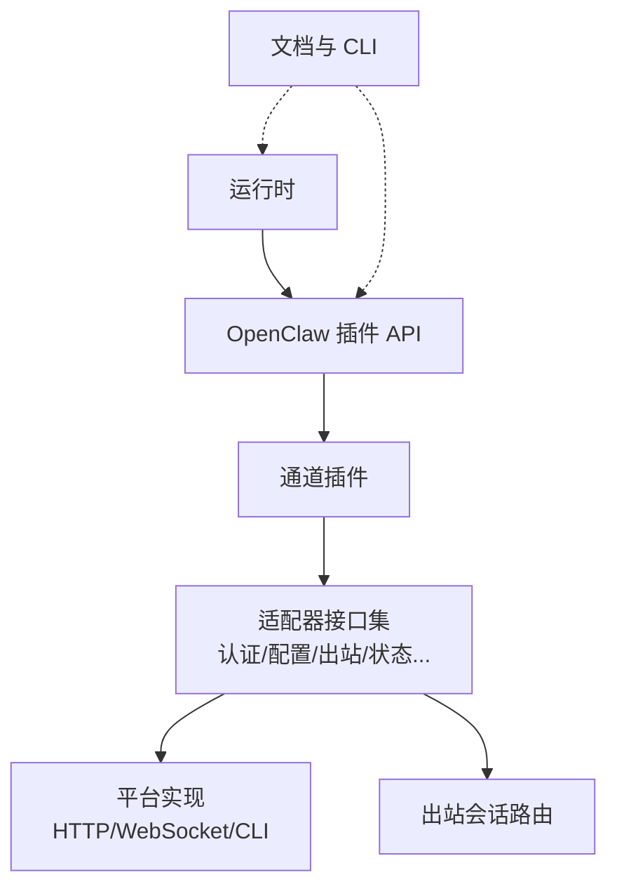
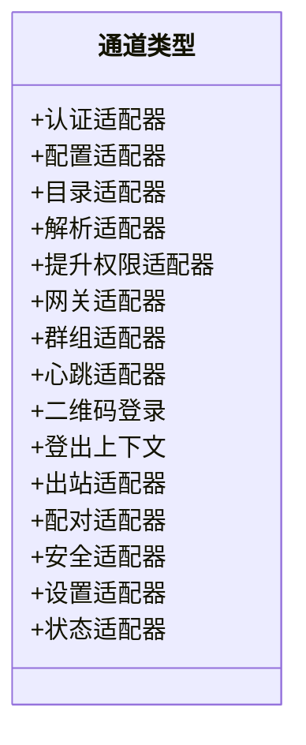
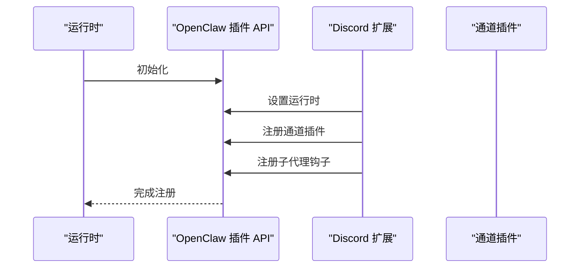
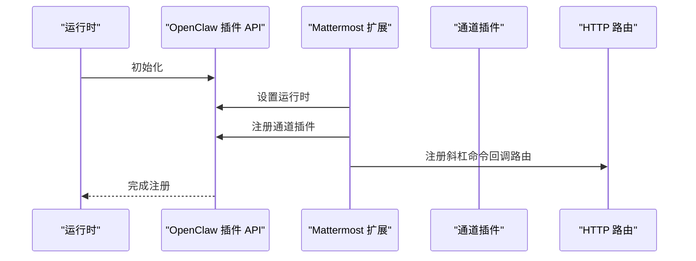
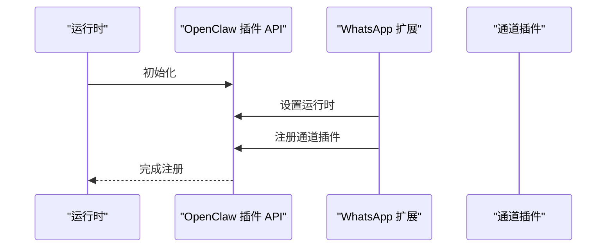
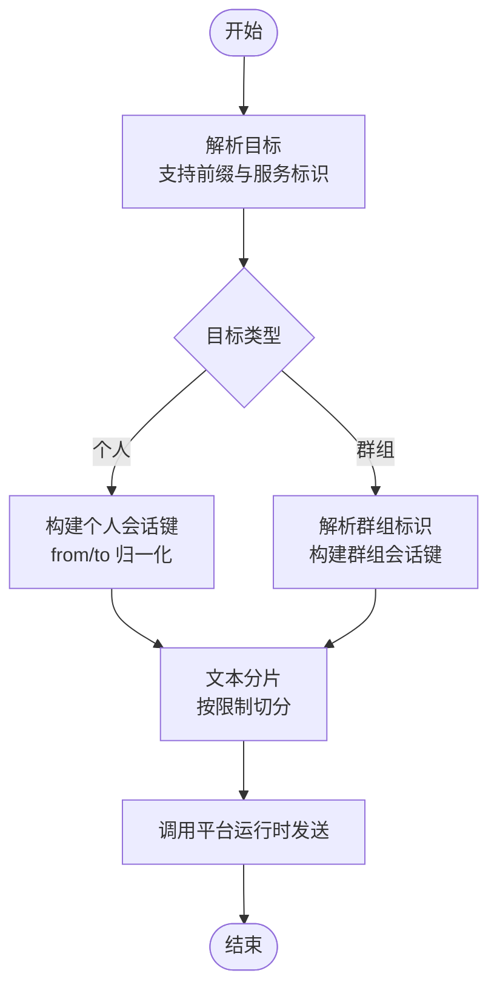
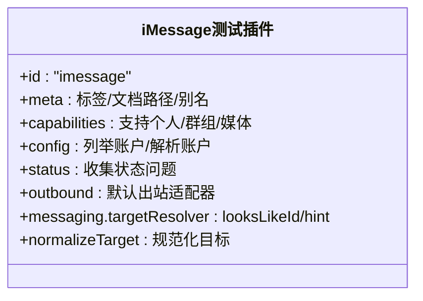
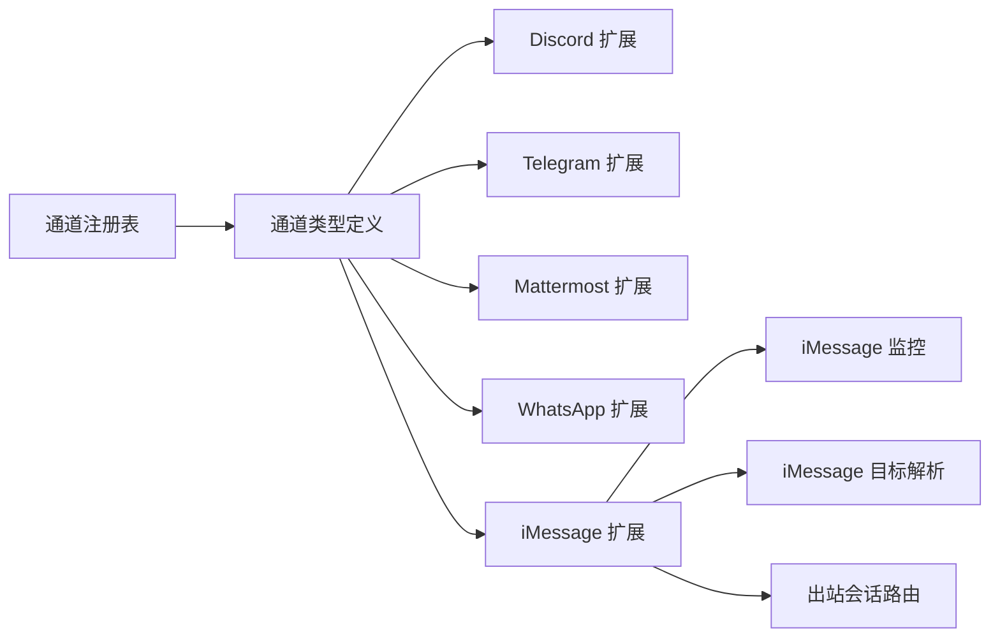

# 通信技能类

<cite>
**本文引用的文件**
- [src/channels/registry.ts](file://src/channels/registry.ts)
- [src/channels/plugins/types.ts](file://src/channels/plugins/types.ts)
- [extensions/discord/index.ts](file://extensions/discord/index.ts)
- [extensions/telegram/index.ts](file://extensions/telegram/index.ts)
- [extensions/mattermost/index.ts](file://extensions/mattermost/index.ts)
- [extensions/whatsapp/index.ts](file://extensions/whatsapp/index.ts)
- [extensions/imessage/src/channel.ts](file://extensions/imessage/src/channel.ts)
- [src/imessage/monitor/monitor-provider.ts](file://src/imessage/monitor/monitor-provider.ts)
- [src/imessage/targets.ts](file://src/imessage/targets.ts)
- [src/infra/outbound/outbound-session.ts](file://src/infra/outbound/outbound-session.ts)
- [src/test-utils/imessage-test-plugin.ts](file://src/test-utils/imessage-test-plugin.ts)
- [docs/channels/index.md](file://docs/channels/index.md)
- [docs/channels/discord.md](file://docs/channels/discord.md)
- [docs/channels/telegram.md](file://docs/channels/telegram.md)
- [docs/channels/mattermost.md](file://docs/channels/mattermost.md)
- [docs/channels/whatsapp.md](file://docs/channels/whatsapp.md)
- [docs/channels/imessage.md](file://docs/channels/imessage.md)
- [docs/concepts/messages.md](file://docs/concepts/messages.md)
- [docs/gateway/configuration.md](file://docs/gateway/configuration.md)
- [docs/gateway/authentication.md](file://docs/gateway/authentication.md)
- [docs/cli/channels.md](file://docs/cli/channels.md)
</cite>

## 目录
1. [简介](#简介)
2. [项目结构](#项目结构)
3. [核心组件](#核心组件)
4. [架构总览](#架构总览)
5. [详细组件分析](#详细组件分析)
6. [依赖关系分析](#依赖关系分析)
7. [性能考虑](#性能考虑)
8. [故障排除指南](#故障排除指南)
9. [结论](#结论)
10. [附录](#附录)

## 简介
本技术文档聚焦于 OpenClaw 的“通信技能类”，系统阐述其对多即时通讯平台（如 Discord、Telegram、Mattermost、WhatsApp、iMessage 等）的集成能力与实现原理。内容涵盖消息发送、频道管理、用户身份验证、群组协作、消息路由与状态同步、跨平台协议转换与兼容性处理、配置与权限管理、以及使用示例与最佳实践，并提供故障排除与性能优化建议。

## 项目结构
OpenClaw 将“通道插件”作为通信能力的扩展点，各平台通过独立的扩展模块注册到统一的通道框架中。核心结构包括：
- 通道注册表：集中声明支持的通信平台及其元信息
- 插件入口：各平台扩展在安装后通过注册函数向运行时注入通道能力
- 通道类型定义：统一的适配器接口，确保不同平台具备一致的对外能力模型
- 平台特定实现：各扩展内部封装平台 API、认证、消息分片与发送逻辑
- 监控与会话：针对平台特性（如 iMessage）提供监控、目标解析与会话路由

**图表来源**
- [src/channels/registry.ts:69-121](file://src/channels/registry.ts#L69-L121)
- [src/channels/plugins/types.ts:1-66](file://src/channels/plugins/types.ts#L1-L66)
- [extensions/discord/index.ts:1-20](file://extensions/discord/index.ts#L1-L20)
- [extensions/telegram/index.ts:1-18](file://extensions/telegram/index.ts#L1-L18)
- [extensions/mattermost/index.ts:1-24](file://extensions/mattermost/index.ts#L1-L24)
- [extensions/whatsapp/index.ts:1-18](file://extensions/whatsapp/index.ts#L1-L18)
- [extensions/imessage/src/channel.ts:197-243](file://extensions/imessage/src/channel.ts#L197-L243)
- [src/imessage/monitor/monitor-provider.ts:86-118](file://src/imessage/monitor/monitor-provider.ts#L86-L118)
- [src/imessage/targets.ts:76-128](file://src/imessage/targets.ts#L76-L128)
- [src/infra/outbound/outbound-session.ts:447-505](file://src/infra/outbound/outbound-session.ts#L447-L505)

**章节来源**
- [src/channels/registry.ts:69-121](file://src/channels/registry.ts#L69-L121)
- [src/channels/plugins/types.ts:1-66](file://src/channels/plugins/types.ts#L1-L66)

## 核心组件
- 通道注册表：列举受支持的通信平台，包含标识、标签、文档路径等元信息，用于 UI 展示与配置引导
- 通道类型定义：定义认证、配置、目录、解析、提升权限、网关、群组、心跳、二维码登录、登出、出站、配对、安全、设置、状态等适配器接口，形成统一能力契约
- 平台扩展入口：各扩展在注册时注入运行时、注册通道插件并可附加钩子或路由
- 平台特定实现：以 iMessage 为例，扩展内提供出站发送、文本分片、目标解析与会话路由
- 监控与会话：iMessage 提供监控循环、历史记录缓存、速率限制与会话键构建

**章节来源**
- [src/channels/registry.ts:69-121](file://src/channels/registry.ts#L69-L121)
- [src/channels/plugins/types.ts:7-63](file://src/channels/plugins/types.ts#L7-L63)
- [extensions/discord/index.ts:7-16](file://extensions/discord/index.ts#L7-L16)
- [extensions/telegram/index.ts:6-14](file://extensions/telegram/index.ts#L6-L14)
- [extensions/mattermost/index.ts:7-20](file://extensions/mattermost/index.ts#L7-L20)
- [extensions/whatsapp/index.ts:6-14](file://extensions/whatsapp/index.ts#L6-L14)
- [extensions/imessage/src/channel.ts:197-243](file://extensions/imessage/src/channel.ts#L197-L243)
- [src/imessage/monitor/monitor-provider.ts:86-118](file://src/imessage/monitor/monitor-provider.ts#L86-L118)
- [src/infra/outbound/outbound-session.ts:447-505](file://src/infra/outbound/outbound-session.ts#L447-L505)

## 架构总览
OpenClaw 采用“通道插件 + 统一适配器”的架构模式：
- 运行时负责加载扩展并注册通道
- 通道插件暴露统一的出站发送、目标解析、能力声明等接口
- 平台特定实现封装 API 调用、认证与消息分片策略
- 出站会话路由根据目标类型（个人/群组）生成会话键与路由信息
- 文档与 CLI 提供配置与使用指导

**图表来源**
- [extensions/discord/index.ts:12-15](file://extensions/discord/index.ts#L12-L15)
- [extensions/telegram/index.ts:11-13](file://extensions/telegram/index.ts#L11-L13)
- [extensions/mattermost/index.ts:12-19](file://extensions/mattermost/index.ts#L12-L19)
- [extensions/whatsapp/index.ts:11-13](file://extensions/whatsapp/index.ts#L11-L13)
- [src/channels/plugins/types.ts:7-63](file://src/channels/plugins/types.ts#L7-L63)
- [src/infra/outbound/outbound-session.ts:447-505](file://src/infra/outbound/outbound-session.ts#L447-L505)
- [docs/channels/index.md](file://docs/channels/index.md)

## 详细组件分析

### 通道注册与类型体系
- 注册表列出平台标识、标签、文档路径与图标，便于 UI 选择与用户指引
- 类型体系定义了认证、配置、目录、解析、提升权限、网关、群组、心跳、二维码登录、登出、出站、配对、安全、设置、状态等适配器，确保各平台遵循统一契约

**图表来源**
- [src/channels/plugins/types.ts:7-63](file://src/channels/plugins/types.ts#L7-L63)

**章节来源**
- [src/channels/registry.ts:69-121](file://src/channels/registry.ts#L69-L121)
- [src/channels/plugins/types.ts:1-66](file://src/channels/plugins/types.ts#L1-L66)

### Discord 通道插件
- 扩展入口负责设置运行时、注册通道插件并注册子代理钩子
- 使用空配置模式，简化安装流程

**图表来源**
- [extensions/discord/index.ts:12-16](file://extensions/discord/index.ts#L12-L16)

**章节来源**
- [extensions/discord/index.ts:1-20](file://extensions/discord/index.ts#L1-L20)

### Telegram 通道插件
- 扩展入口设置运行时并注册通道插件，保持与平台一致的最小配置

**图表来源**
- [extensions/telegram/index.ts:11-13](file://extensions/telegram/index.ts#L11-L13)

**章节来源**
- [extensions/telegram/index.ts:1-18](file://extensions/telegram/index.ts#L1-L18)

### Mattermost 通道插件
- 扩展入口设置运行时并注册通道插件；同时注册 HTTP 路由以接收斜杠命令回调
- 斜杠命令的实际注册在监控阶段完成（连接后获取团队 ID）

**图表来源**
- [extensions/mattermost/index.ts:12-19](file://extensions/mattermost/index.ts#L12-L19)

**章节来源**
- [extensions/mattermost/index.ts:1-24](file://extensions/mattermost/index.ts#L1-L24)

### WhatsApp 通道插件
- 扩展入口设置运行时并注册通道插件，保持最小配置与平台一致性

**图表来源**
- [extensions/whatsapp/index.ts:11-13](file://extensions/whatsapp/index.ts#L11-L13)

**章节来源**
- [extensions/whatsapp/index.ts:1-18](file://extensions/whatsapp/index.ts#L1-L18)

### iMessage 通道插件与会话路由
- 扩展提供出站发送、文本分片、目标解析与会话路由
- 监控提供历史记录缓存、速率限制与会话键构建
- 目标解析支持多种前缀与服务标识，自动归一化个人与群组目标
- 出站会话根据目标类型生成会话键与路由信息，区分个人与群组聊天

**图表来源**
- [extensions/imessage/src/channel.ts:226-243](file://extensions/imessage/src/channel.ts#L226-L243)
- [src/imessage/targets.ts:76-128](file://src/imessage/targets.ts#L76-L128)
- [src/infra/outbound/outbound-session.ts:447-505](file://src/infra/outbound/outbound-session.ts#L447-L505)

**章节来源**
- [extensions/imessage/src/channel.ts:197-243](file://extensions/imessage/src/channel.ts#L197-L243)
- [src/imessage/monitor/monitor-provider.ts:86-118](file://src/imessage/monitor/monitor-provider.ts#L86-L118)
- [src/imessage/targets.ts:76-128](file://src/imessage/targets.ts#L76-L128)
- [src/infra/outbound/outbound-session.ts:447-505](file://src/infra/outbound/outbound-session.ts#L447-L505)

### 测试插件与目标解析
- 测试插件提供 iMessage 能力的最小实现，用于单元测试与开发验证
- 目标解析器支持多种输入形态（邮箱、电话、前缀），并提供规范化输出

**图表来源**
- [src/test-utils/imessage-test-plugin.ts:6-46](file://src/test-utils/imessage-test-plugin.ts#L6-L46)

**章节来源**
- [src/test-utils/imessage-test-plugin.ts:1-46](file://src/test-utils/imessage-test-plugin.ts#L1-L46)
- [src/imessage/targets.ts:76-128](file://src/imessage/targets.ts#L76-L128)

## 依赖关系分析
- 通道注册表与类型定义是所有扩展的基础契约
- 各扩展通过注册函数注入运行时与通道插件，形成松耦合
- 平台特定实现依赖运行时提供的 API（如发送、分片、认证）
- 出站会话路由依赖目标解析与平台特性（如 iMessage 的群组标识）

**图表来源**
- [src/channels/registry.ts:69-121](file://src/channels/registry.ts#L69-L121)
- [src/channels/plugins/types.ts:1-66](file://src/channels/plugins/types.ts#L1-L66)
- [extensions/discord/index.ts:12-15](file://extensions/discord/index.ts#L12-L15)
- [extensions/telegram/index.ts:11-13](file://extensions/telegram/index.ts#L11-L13)
- [extensions/mattermost/index.ts:12-19](file://extensions/mattermost/index.ts#L12-L19)
- [extensions/whatsapp/index.ts:11-13](file://extensions/whatsapp/index.ts#L11-L13)
- [extensions/imessage/src/channel.ts:197-243](file://extensions/imessage/src/channel.ts#L197-L243)
- [src/imessage/monitor/monitor-provider.ts:86-118](file://src/imessage/monitor/monitor-provider.ts#L86-L118)
- [src/imessage/targets.ts:76-128](file://src/imessage/targets.ts#L76-L128)
- [src/infra/outbound/outbound-session.ts:447-505](file://src/infra/outbound/outbound-session.ts#L447-L505)

**章节来源**
- [src/channels/registry.ts:69-121](file://src/channels/registry.ts#L69-L121)
- [src/channels/plugins/types.ts:1-66](file://src/channels/plugins/types.ts#L1-L66)

## 性能考虑
- 文本分片：平台对单条消息长度有限制，应按平台限制进行分片发送，避免失败重试
- 速率限制：监控循环中内置速率限制器，避免触发平台限流
- 历史记录缓存：对群组历史进行缓存，减少重复查询与重复处理
- 会话键复用：基于会话键与路由信息复用连接与上下文，降低握手成本
- 异步并发：出站发送采用异步模式，结合分片与缓存提升吞吐量

[本节为通用性能建议，不直接分析具体文件]

## 故障排除指南
- 认证与权限
  - 检查平台配置是否正确（令牌、密钥、团队/服务器 ID 等）
  - 参考平台文档与 CLI 配置说明，确认权限范围与作用域
- 目标解析错误
  - 确认目标字符串是否符合平台前缀规范（如 iMessage 的服务前缀与标识）
  - 使用目标解析器的规范化输出进行调试
- 发送失败
  - 查看分片后的每段是否超过平台限制
  - 检查速率限制是否触发，适当降低发送频率
- 群组协作
  - 确认群组标识解析正确，会话键生成是否一致
  - 对于 Mattermost，确认斜杠命令回调路由已注册且可达
- 状态与健康检查
  - 使用状态适配器收集问题并定位异常账户或通道

**章节来源**
- [docs/gateway/authentication.md](file://docs/gateway/authentication.md)
- [docs/cli/channels.md](file://docs/cli/channels.md)
- [src/imessage/targets.ts:76-128](file://src/imessage/targets.ts#L76-L128)
- [src/infra/outbound/outbound-session.ts:447-505](file://src/infra/outbound/outbound-session.ts#L447-L505)
- [extensions/mattermost/index.ts:16-19](file://extensions/mattermost/index.ts#L16-L19)

## 结论
OpenClaw 的通信技能类通过统一的通道类型体系与平台扩展机制，实现了对多即时通讯平台的一致接入。借助目标解析、会话路由、分片与速率控制等机制，系统在保证跨平台兼容性的同时，提供了良好的可维护性与可扩展性。配合完善的文档与 CLI 指南，用户可以高效地完成配置、部署与运维。

[本节为总结性内容，不直接分析具体文件]

## 附录

### 平台能力概览与文档索引
- 平台列表与文档路径参考通道注册表
- 各平台文档提供详细的配置步骤与使用说明

**章节来源**
- [src/channels/registry.ts:69-121](file://src/channels/registry.ts#L69-L121)
- [docs/channels/index.md](file://docs/channels/index.md)
- [docs/channels/discord.md](file://docs/channels/discord.md)
- [docs/channels/telegram.md](file://docs/channels/telegram.md)
- [docs/channels/mattermost.md](file://docs/channels/mattermost.md)
- [docs/channels/whatsapp.md](file://docs/channels/whatsapp.md)
- [docs/channels/imessage.md](file://docs/channels/imessage.md)

### 消息格式与概念
- 消息格式与富文本支持参见消息概念文档
- 在不同平台间进行消息格式化时，需遵循各平台的渲染规则与限制

**章节来源**
- [docs/concepts/messages.md](file://docs/concepts/messages.md)