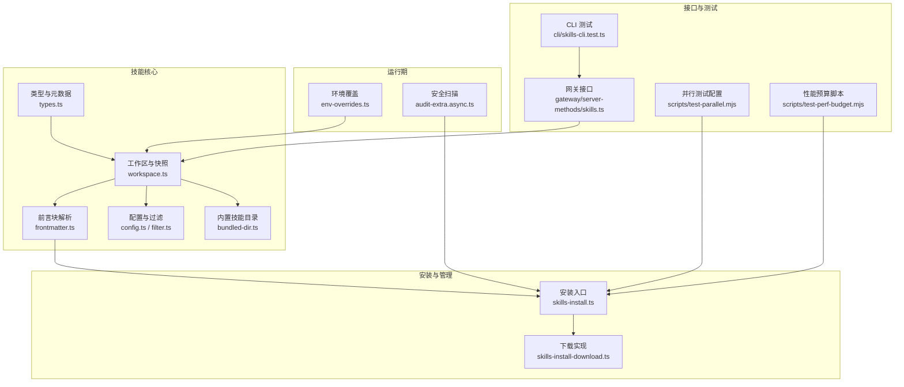
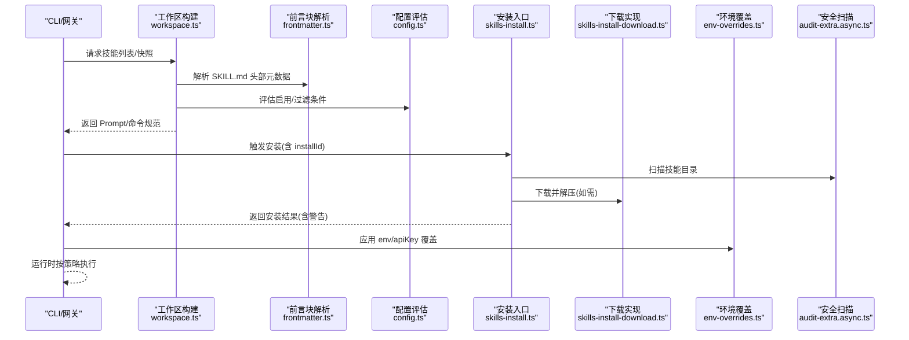
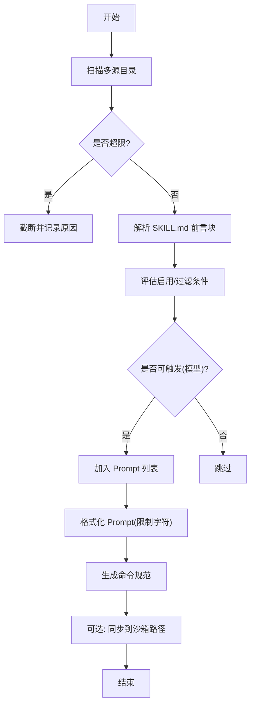
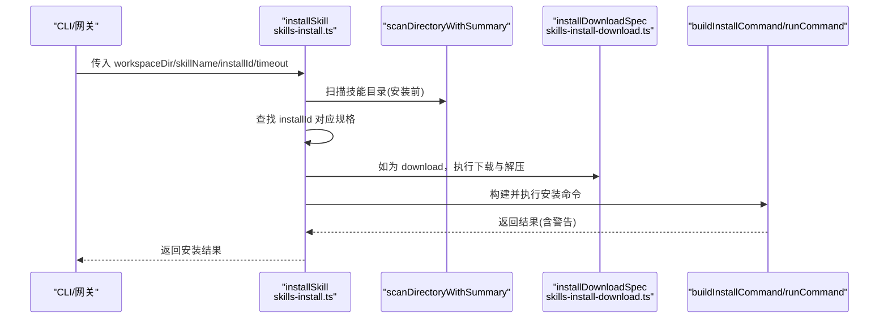
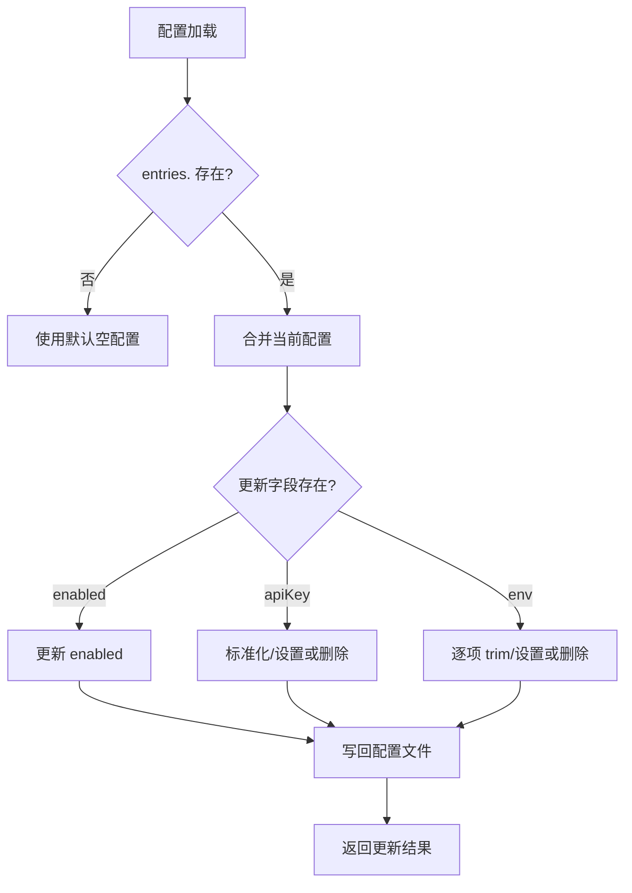
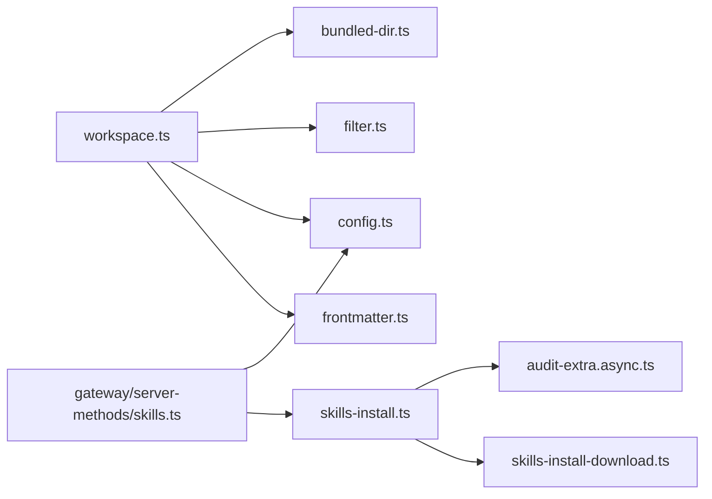

# 技能平台

<cite>
**本文引用的文件**
- [src/agents/skills/types.ts](file://src/agents/skills/types.ts)
- [src/agents/skills/workspace.ts](file://src/agents/skills/workspace.ts)
- [src/agents/skills/frontmatter.ts](file://src/agents/skills/frontmatter.ts)
- [src/agents/skills/config.ts](file://src/agents/skills/config.ts)
- [src/agents/skills/filter.ts](file://src/agents/skills/filter.ts)
- [src/agents/skills/bundled-dir.ts](file://src/agents/skills/bundled-dir.ts)
- [src/agents/skills-install.ts](file://src/agents/skills-install.ts)
- [src/agents/skills-install-download.ts](file://src/agents/skills-install-download.ts)
- [src/agents/skills-install.download.test.ts](file://src/agents/skills-install.download.test.ts)
- [src/agents/skills-install.download-test-utils.ts](file://src/agents/skills-install.download-test-utils.ts)
- [src/agents/skills/env-overrides.ts](file://src/agents/skills/env-overrides.ts)
- [src/gateway/server-methods/skills.ts](file://src/gateway/server-methods/skills.ts)
- [src/gateway/server.skills-status.test.ts](file://src/gateway/server.skills-status.test.ts)
- [docs/tools/skills-config.md](file://docs/tools/skills-config.md)
- [docs/zh-CN/help/testing.md](file://docs/zh-CN/help/testing.md)
- [scripts/test-parallel.mjs](file://scripts/test-parallel.mjs)
- [scripts/test-perf-budget.mjs](file://scripts/test-perf-budget.mjs)
- [skills/skill-creator/SKILL.md](file://skills/skill-creator/SKILL.md)
- [skills/skill-creator/scripts/init_skill.py](file://skills/skill-creator/scripts/init_skill.py)
- [src/cli/skills-cli.test.ts](file://src/cli/skills-cli.test.ts)
- [src/security/audit-extra.async.ts](file://src/security/audit-extra.async.ts)
</cite>

## 目录
1. [简介](#简介)
2. [项目结构](#项目结构)
3. [核心组件](#核心组件)
4. [架构总览](#架构总览)
5. [详细组件分析](#详细组件分析)
6. [依赖分析](#依赖分析)
7. [性能考量](#性能考量)
8. [故障排查指南](#故障排查指南)
9. [结论](#结论)
10. [附录](#附录)

## 简介
本文件面向 OpenClaw 技能平台，系统化阐述技能系统的架构与实现，覆盖技能注册表、生命周期管理、依赖关系、安装与管理机制、配置系统、测试与调试工具、最佳实践以及扩展与自定义方法。文档以仓库中的真实源码为依据，辅以可视化图示帮助读者快速理解从“技能发现”到“执行”的完整链路。

## 项目结构
OpenClaw 将技能能力拆分为多个子模块：
- 技能元数据与类型定义：位于 src/agents/skills/types.ts
- 技能发现与快照构建：src/agents/skills/workspace.ts
- 前言块解析与元数据提取：src/agents/skills/frontmatter.ts
- 技能过滤与配置评估：src/agents/skills/config.ts、src/agents/skills/filter.ts
- 内置技能目录定位：src/agents/skills/bundled-dir.ts
- 技能安装与下载：src/agents/skills-install.ts、src/agents/skills-install-download.ts
- 环境变量覆盖与安全扫描：src/agents/skills/env-overrides.ts、src/security/audit-extra.async.ts
- 网关接口与状态检查：src/gateway/server-methods/skills.ts、src/gateway/server.skills-status.test.ts
- CLI 与测试：docs/tools/skills-config.md、scripts/test-parallel.mjs、scripts/test-perf-budget.mjs、src/cli/skills-cli.test.ts
- 技能模板与初始化脚本：skills/skill-creator/SKILL.md、skills/skill-creator/scripts/init_skill.py

图表来源
- [src/agents/skills/types.ts:1-90](file://src/agents/skills/types.ts#L1-L90)
- [src/agents/skills/workspace.ts:1-882](file://src/agents/skills/workspace.ts#L1-L882)
- [src/agents/skills/frontmatter.ts:1-223](file://src/agents/skills/frontmatter.ts#L1-L223)
- [src/agents/skills/config.ts:1-104](file://src/agents/skills/config.ts#L1-L104)
- [src/agents/skills/filter.ts:1-34](file://src/agents/skills/filter.ts#L1-L34)
- [src/agents/skills/bundled-dir.ts:1-91](file://src/agents/skills/bundled-dir.ts#L1-L91)
- [src/agents/skills-install.ts:1-471](file://src/agents/skills-install.ts#L1-L471)
- [src/agents/skills-install-download.ts:1-142](file://src/agents/skills-install-download.ts#L1-L142)
- [src/agents/skills/env-overrides.ts:133-167](file://src/agents/skills/env-overrides.ts#L133-L167)
- [src/security/audit-extra.async.ts:1287-1314](file://src/security/audit-extra.async.ts#L1287-L1314)
- [src/gateway/server-methods/skills.ts:134-204](file://src/gateway/server-methods/skills.ts#L134-L204)
- [src/cli/skills-cli.test.ts:203-245](file://src/cli/skills-cli.test.ts#L203-L245)
- [scripts/test-parallel.mjs:56-77](file://scripts/test-parallel.mjs#L56-L77)
- [scripts/test-perf-budget.mjs:98-127](file://scripts/test-perf-budget.mjs#L98-L127)

章节来源
- [src/agents/skills/workspace.ts:292-527](file://src/agents/skills/workspace.ts#L292-L527)
- [src/agents/skills/types.ts:19-89](file://src/agents/skills/types.ts#L19-L89)

## 核心组件
- 类型与元数据
  - 定义了技能安装规格、OpenClaw 元数据、调用策略、命令规范等核心类型，确保安装、解析、过滤、执行各环节的数据契约一致。
- 技能发现与快照
  - 负责扫描工作区、合并多源技能、过滤不可用项、生成 Prompt 文本与命令规范，并支持同步到沙箱路径。
- 前言块解析
  - 解析 SKILL.md 头部元数据，标准化安装规格、OS/二进制/环境依赖声明，解析调用策略（用户可触发、禁用模型触发）。
- 配置与过滤
  - 评估技能启用状态、内置技能白名单、运行时环境与二进制可用性、配置路径真值，决定技能是否纳入候选集。
- 安装与下载
  - 支持 brew、node、go、uv、download 等多种安装方式；对下载进行安全校验与解压，限制目标路径逃逸，支持 stripComponents。
- 环境变量覆盖
  - 将配置中的 env/apiKey 注入到运行环境，区分敏感键与受控键，避免外部已设置的键被覆盖。
- 网关接口
  - 提供技能更新、安装等 RPC 方法，统一响应结构与错误编码。
- 安全扫描
  - 对技能目录进行代码安全扫描，识别危险/可疑模式，输出告警并在安装阶段收集结果。

章节来源
- [src/agents/skills/types.ts:3-89](file://src/agents/skills/types.ts#L3-L89)
- [src/agents/skills/workspace.ts:567-658](file://src/agents/skills/workspace.ts#L567-L658)
- [src/agents/skills/frontmatter.ts:186-222](file://src/agents/skills/frontmatter.ts#L186-L222)
- [src/agents/skills/config.ts:71-103](file://src/agents/skills/config.ts#L71-L103)
- [src/agents/skills-install.ts:392-470](file://src/agents/skills-install.ts#L392-L470)
- [src/agents/skills-install-download.ts:104-142](file://src/agents/skills-install-download.ts#L104-L142)
- [src/agents/skills/env-overrides.ts:133-167](file://src/agents/skills/env-overrides.ts#L133-L167)
- [src/gateway/server-methods/skills.ts:146-204](file://src/gateway/server-methods/skills.ts#L146-L204)
- [src/security/audit-extra.async.ts:1287-1314](file://src/security/audit-extra.async.ts#L1287-L1314)

## 架构总览
下图展示从“技能发现/解析”到“安装/执行”的端到端流程，以及与网关接口、CLI 和测试的交互。

图表来源
- [src/agents/skills/workspace.ts:567-658](file://src/agents/skills/workspace.ts#L567-L658)
- [src/agents/skills/frontmatter.ts:186-222](file://src/agents/skills/frontmatter.ts#L186-L222)
- [src/agents/skills/config.ts:71-103](file://src/agents/skills/config.ts#L71-L103)
- [src/agents/skills-install.ts:392-470](file://src/agents/skills-install.ts#L392-L470)
- [src/agents/skills-install-download.ts:104-142](file://src/agents/skills-install-download.ts#L104-L142)
- [src/agents/skills/env-overrides.ts:133-167](file://src/agents/skills/env-overrides.ts#L133-L167)
- [src/security/audit-extra.async.ts:1287-1314](file://src/security/audit-extra.async.ts#L1287-L1314)

## 详细组件分析

### 组件一：技能注册表与生命周期
- 注册表来源
  - 多源合并：extraDirs、bundled、managed、agents personal/project、workspace skills，按优先级去重合并。
  - 前言块解析：提取 name/description、openclaw 元数据（install、requires、os、primaryEnv 等）、调用策略。
- 生命周期
  - 发现：扫描目录、限制候选数量与 Prompt 字符数、过滤超大文件。
  - 快照：生成 Prompt 文本、命令规范、可选的 resolvedSkills。
  - 同步：将有效技能复制到目标工作区，避免路径逃逸。
- 关键点
  - 路径安全：严格限制在根目录内，拒绝逃逸路径。
  - Prompt 限额：按数量与字符上限二分搜索裁剪，保证上下文可控。
  - 命令名规范化：避免非法字符，冲突重命名，长度限制。

图表来源
- [src/agents/skills/workspace.ts:292-527](file://src/agents/skills/workspace.ts#L292-L527)
- [src/agents/skills/workspace.ts:529-565](file://src/agents/skills/workspace.ts#L529-L565)
- [src/agents/skills/workspace.ts:710-766](file://src/agents/skills/workspace.ts#L710-L766)
- [src/agents/skills/frontmatter.ts:186-222](file://src/agents/skills/frontmatter.ts#L186-L222)
- [src/agents/skills/config.ts:71-103](file://src/agents/skills/config.ts#L71-L103)

章节来源
- [src/agents/skills/workspace.ts:660-766](file://src/agents/skills/workspace.ts#L660-L766)
- [src/agents/skills/bundled-dir.ts:36-90](file://src/agents/skills/bundled-dir.ts#L36-L90)

### 组件二：技能安装与管理机制
- 安装入口
  - 根据 installId 查找对应安装规格，支持 brew、node、go、uv、download。
  - 自动检测/安装依赖工具（如 brew、uv、go），必要时设置环境变量（如 GOBIN）。
- 下载与解压
  - 安全校验：拒绝相对路径逃逸、zip-slip、tar-slip 等；支持 stripComponents 安全解包。
  - 目标目录约束：必须位于 per-skill tools 根目录内。
- 安全扫描
  - 安装前后扫描技能目录，收集危险/可疑模式，作为警告返回。
- 错误处理
  - 统一失败消息格式，保留 stdout/stderr/code，便于诊断。

图表来源
- [src/agents/skills-install.ts:392-470](file://src/agents/skills-install.ts#L392-L470)
- [src/agents/skills-install-download.ts:104-142](file://src/agents/skills-install-download.ts#L104-L142)
- [src/security/audit-extra.async.ts:1287-1314](file://src/security/audit-extra.async.ts#L1287-L1314)

章节来源
- [src/agents/skills-install.ts:19-34](file://src/agents/skills-install.ts#L19-L34)
- [src/agents/skills-install.ts:114-154](file://src/agents/skills-install.ts#L114-L154)
- [src/agents/skills-install-download.ts:23-142](file://src/agents/skills-install-download.ts#L23-L142)
- [src/agents/skills-install.download.test.ts:169-238](file://src/agents/skills-install.download.test.ts#L169-L238)

### 组件三：技能配置系统
- 配置字段
  - enabled：显式启用/禁用
  - env：注入环境变量（仅当未被外部设置）
  - apiKey：主环境变量便捷写法，支持 SecretRef 对象
- 生效范围
  - host 运行：全局 env 与 per-skill env/apiKey 生效
  - 沙箱运行：Docker 不继承宿主 process.env，需通过 agents.defaults.sandbox.docker.env 或自定义镜像 bake
- 网关更新
  - skills.update 接口支持更新 enabled、apiKey、env，写回配置文件并返回当前配置

图表来源
- [src/gateway/server-methods/skills.ts:146-204](file://src/gateway/server-methods/skills.ts#L146-L204)
- [docs/tools/skills-config.md:54-78](file://docs/tools/skills-config.md#L54-L78)

章节来源
- [src/gateway/server-methods/skills.ts:146-204](file://src/gateway/server-methods/skills.ts#L146-L204)
- [src/agents/skills/env-overrides.ts:133-167](file://src/agents/skills/env-overrides.ts#L133-L167)
- [docs/tools/skills-config.md:54-78](file://docs/tools/skills-config.md#L54-L78)

### 组件四：测试与调试工具
- 单元测试
  - 下载/解压安全测试：覆盖 zip-slip、tar-slip、targetDir 逃逸等边界场景。
  - CLI 输出 JSON 格式测试：list/info/check 命令支持 --json。
- 性能与稳定性
  - 并行测试配置：将高开销测试从“unit-fast”路径移出，降低竞争。
  - 性能预算脚本：统计耗时与文件扫描耗时，支持基线回归阈值。
- 网关状态检查
  - skills.check 返回配置检查项，屏蔽敏感值，便于审计。

章节来源
- [src/agents/skills-install.download.test.ts:169-238](file://src/agents/skills-install.download.test.ts#L169-L238)
- [src/cli/skills-cli.test.ts:203-245](file://src/cli/skills-cli.test.ts#L203-L245)
- [scripts/test-parallel.mjs:56-77](file://scripts/test-parallel.mjs#L56-L77)
- [scripts/test-perf-budget.mjs:98-127](file://scripts/test-perf-budget.mjs#L98-L127)
- [src/gateway/server.skills-status.test.ts:36-49](file://src/gateway/server.skills-status.test.ts#L36-L49)

### 组件五：技能开发框架与模板
- 接口与参数
  - SKILL.md 头部：name、description 用于触发与筛选；body 为按需加载的指引。
  - openclaw 元数据：install（多规格）、requires（bin/env/config/os）、primaryEnv、skillKey、homepage、emoji、always。
  - 调用策略：user-invocable、disable-model-invocation。
- 参数规范与返回值
  - 安装规格：kind、id、bins、os、formula/package/module/url/archive/extract/stripComponents/targetDir。
  - 返回值：ok/message/stdout/stderr/code，可带 warnings。
- 示例与模板
  - 使用 init_skill.py 初始化技能目录，生成 SKILL.md 模板与可选资源目录及示例文件。
  - 模板文档提供结构化建议、渐进披露模式与打包流程。

章节来源
- [src/agents/skills/frontmatter.ts:186-222](file://src/agents/skills/frontmatter.ts#L186-L222)
- [src/agents/skills/types.ts:3-89](file://src/agents/skills/types.ts#L3-L89)
- [skills/skill-creator/SKILL.md:42-212](file://skills/skill-creator/SKILL.md#L42-L212)
- [skills/skill-creator/scripts/init_skill.py:255-318](file://skills/skill-creator/scripts/init_skill.py#L255-L318)

## 依赖分析
- 组件耦合
  - workspace.ts 依赖 frontmatter.ts、config.ts、bundled-dir.ts、filter.ts，形成“发现→解析→评估→生成”的清晰流水线。
  - skills-install.ts 依赖 install-download.ts 与安全扫描模块，形成“安装→扫描→反馈”的闭环。
  - 网关 server-methods/skills.ts 依赖配置加载与安装入口，提供统一 RPC 接口。
- 外部依赖
  - brew、npm/pnpm/yarn/bun、go、uv 等系统工具；网络下载与归档解压；Docker（沙箱）。
- 潜在风险
  - 路径逃逸与归档攻击：通过严格路径校验与 stripComponents 降低风险。
  - 环境变量冲突：通过 allowedSensitiveKeys 与覆盖规则避免意外污染。

图表来源
- [src/agents/skills/workspace.ts:1-882](file://src/agents/skills/workspace.ts#L1-L882)
- [src/agents/skills/frontmatter.ts:1-223](file://src/agents/skills/frontmatter.ts#L1-L223)
- [src/agents/skills/config.ts:1-104](file://src/agents/skills/config.ts#L1-L104)
- [src/agents/skills/filter.ts:1-34](file://src/agents/skills/filter.ts#L1-L34)
- [src/agents/skills/bundled-dir.ts:1-91](file://src/agents/skills/bundled-dir.ts#L1-L91)
- [src/agents/skills-install.ts:1-471](file://src/agents/skills-install.ts#L1-L471)
- [src/agents/skills-install-download.ts:1-142](file://src/agents/skills-install-download.ts#L1-L142)
- [src/security/audit-extra.async.ts:1287-1314](file://src/security/audit-extra.async.ts#L1287-L1314)
- [src/gateway/server-methods/skills.ts:134-204](file://src/gateway/server-methods/skills.ts#L134-L204)

## 性能考量
- 发现与 Prompt 生成
  - 采用二分搜索在字符上限内最大化技能数量，避免 Prompt 超限导致截断。
- 安装阶段
  - 限制单次安装超时时间，避免阻塞；对 apt/sudo 等场景做最佳努力尝试，减少失败成本。
- 测试与 CI
  - 将高开销测试移出 unit-fast 路径，结合性能预算脚本监控回归。

章节来源
- [src/agents/skills/workspace.ts:529-565](file://src/agents/skills/workspace.ts#L529-L565)
- [src/agents/skills-install.ts:392-470](file://src/agents/skills-install.ts#L392-L470)
- [scripts/test-parallel.mjs:56-77](file://scripts/test-parallel.mjs#L56-L77)
- [scripts/test-perf-budget.mjs:98-127](file://scripts/test-perf-budget.mjs#L98-L127)

## 故障排查指南
- 下载/解压安全
  - 若出现“拒绝安装于技能工具目录之外”或“外部写入保护”，检查 targetDir 是否相对路径逃逸，或归档中是否存在 ../ 路径。
- 安装失败
  - 查看 stdout/stderr/code 与 warnings；确认依赖工具（brew/uv/go）是否可用，必要时手动安装。
- 环境变量
  - 沙箱运行时注意 Docker 不继承宿主环境，需通过 agents.defaults.sandbox.docker.env 或自定义镜像 bake。
- 网关状态
  - 使用 skills.check 审计配置检查项，确认敏感值被屏蔽；关注 configChecks 中的 satisfied 与 value 字段。

章节来源
- [src/agents/skills-install.download.test.ts:169-238](file://src/agents/skills-install.download.test.ts#L169-L238)
- [src/agents/skills-install.ts:392-470](file://src/agents/skills-install.ts#L392-L470)
- [docs/tools/skills-config.md:54-78](file://docs/tools/skills-config.md#L54-L78)
- [src/gateway/server.skills-status.test.ts:36-49](file://src/gateway/server.skills-status.test.ts#L36-L49)

## 结论
OpenClaw 技能平台通过“类型驱动 + 前言块解析 + 多源发现 + 安全扫描 + 网关接口”的架构，实现了可扩展、可审计、可测试的技能生命周期管理。开发者可基于模板与 CLI 工具快速创建高质量技能，配合严格的安装与环境控制保障运行安全。

## 附录
- 最佳实践
  - 严格遵循 SKILL.md 结构与渐进披露原则，将复杂内容放入 references/，保持 SKILL.md 精炼。
  - 明确安装规格与依赖声明，优先使用 download + stripComponents，避免本地二进制污染。
  - 使用 --json 输出与性能预算脚本持续优化安装与执行性能。
- 扩展与自定义
  - 通过 openclaw.extraDirs 与插件技能目录扩展来源；通过 skills.allowBundled 白名单控制内置技能。
  - 自定义沙箱镜像时 bake 必要环境变量，避免 host 运行与沙箱运行差异。

章节来源
- [skills/skill-creator/SKILL.md:121-212](file://skills/skill-creator/SKILL.md#L121-L212)
- [src/agents/skills/bundled-dir.ts:36-90](file://src/agents/skills/bundled-dir.ts#L36-L90)
- [docs/tools/skills-config.md:54-78](file://docs/tools/skills-config.md#L54-L78)