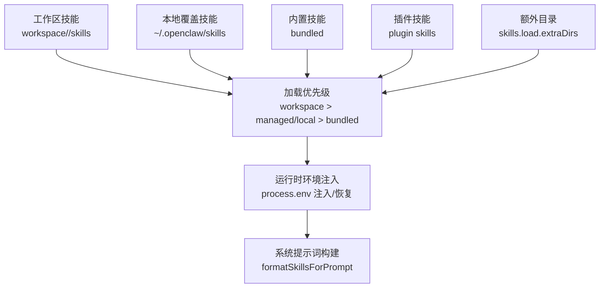
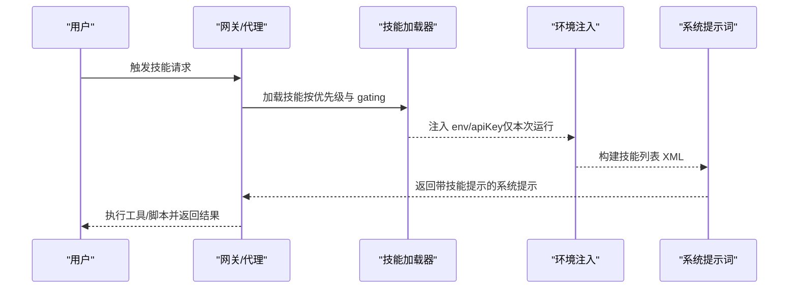
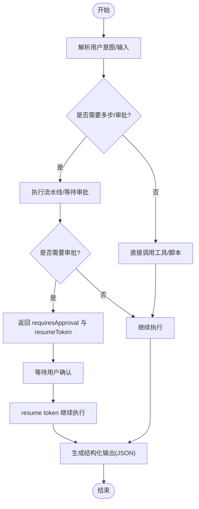
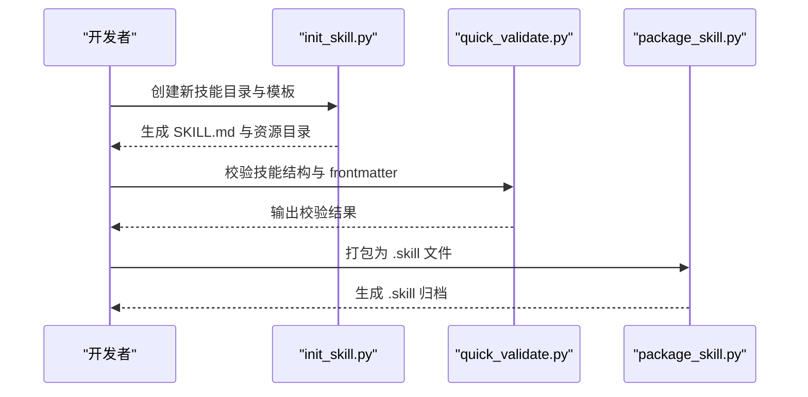
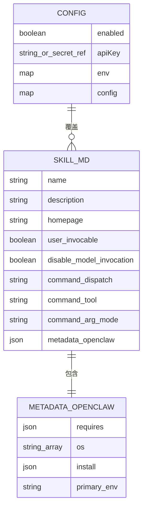
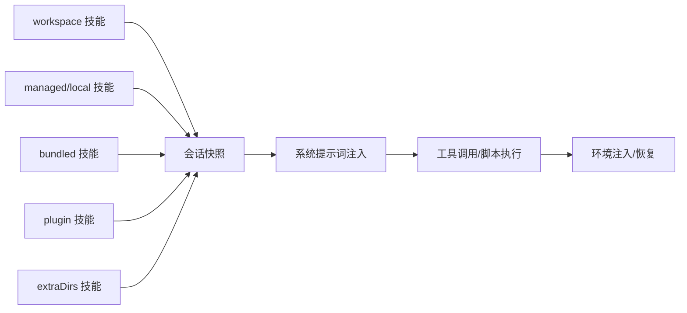

# 技能开发

<cite>
**本文引用的文件**
- [README.md](file://README.md)
- [creating-skills.md](file://docs/tools/creating-skills.md)
- [skills.md](file://docs/tools/skills.md)
- [SKILL.md（示例：summarize）](file://skills/summarize/SKILL.md)
- [SKILL.md（示例：nano-banana-pro）](file://skills/nano-banana-pro/SKILL.md)
- [generate_image.py（示例：nano-banana-pro 脚本）](file://skills/nano-banana-pro/scripts/generate_image.py)
- [SKILL.md（示例：coding-agent）](file://skills/coding-agent/SKILL.md)
- [SKILL.md（示例：lobster）](file://extensions/lobster/SKILL.md)
- [SKILL.md（示例：skill-creator）](file://skills/skill-creator/SKILL.md)
- [init_skill.py（技能初始化工具）](file://skills/skill-creator/scripts/init_skill.py)
- [package_skill.py（技能打包工具）](file://skills/skill-creator/scripts/package_skill.py)
- [quick_validate.py（技能快速校验工具）](file://skills/skill-creator/scripts/quick_validate.py)
</cite>

## 目录
1. [简介](#简介)
2. [项目结构](#项目结构)
3. [核心组件](#核心组件)
4. [架构总览](#架构总览)
5. [详细组件分析](#详细组件分析)
6. [依赖关系分析](#依赖关系分析)
7. [性能考量](#性能考量)
8. [故障排查指南](#故障排查指南)
9. [结论](#结论)
10. [附录](#附录)

## 简介
本文件面向 OpenClaw 技能开发者，系统阐述技能开发框架的设计原理与最佳实践，覆盖技能接口定义、参数规范、返回值格式、模板系统（初始化脚本、包管理器与构建流程）、开发工具链（快速验证、打包与测试）、元数据规范（描述文件格式、依赖声明与版本管理），并提供从简单命令到复杂工具的完整实现示例，以及调试与测试指南。

## 项目结构
OpenClaw 的技能体系以“技能目录 + SKILL.md 元数据 + 可选资源（scripts/references/assets）”为核心，支持多级加载优先级与运行时环境注入，并通过 CLI 工具链完成初始化、校验与打包。

- 技能位置与优先级
  - 内置技能（bundled）
  - 本地覆盖技能（managed/local：~/.openclaw/skills）
  - 工作区技能（workspace：<workspace>/skills）
  - 插件自带技能（plugin skills）
  - 额外扫描目录（skills.load.extraDirs）

- 技能元数据
  - 必填字段：name、description
  - 可选字段：homepage、user-invocable、disable-model-invocation、command-dispatch、command-tool、command-arg-mode、metadata.openclaw.*
  - metadata.openclaw 支持 gating（环境/二进制/配置）、安装器、平台过滤等

- 资源组织
  - scripts/：可执行脚本（Python/Bash 等）
  - references/：按需加载的参考文档
  - assets/：输出使用的资源文件（模板、图标、字体等）

图示来源
- [skills.md:13-40](file://docs/tools/skills.md#L13-L40)
- [skills.md:189-241](file://docs/tools/skills.md#L189-L241)

章节来源
- [README.md:458-468](file://README.md#L458-L468)
- [skills.md:13-40](file://docs/tools/skills.md#L13-L40)
- [skills.md:78-105](file://docs/tools/skills.md#L78-L105)

## 核心组件
- 技能描述文件（SKILL.md）
  - YAML frontmatter 定义 name、description、metadata 等
  - Markdown 正文提供使用说明与工作流
- 资源目录
  - scripts/：可直接执行的自动化脚本
  - references/：分模块的参考文档，按需加载
  - assets/：模板与素材，不直接加载到上下文
- 运行时与安全
  - 环境变量注入与恢复
  - 沙箱模式下的二进制与依赖准备
  - 远程节点能力探测与节点工具调用

章节来源
- [skills.md:78-105](file://docs/tools/skills.md#L78-L105)
- [skills.md:230-241](file://docs/tools/skills.md#L230-L241)
- [skills.md:138-147](file://docs/tools/skills.md#L138-L147)

## 架构总览
技能在加载阶段根据 gating 条件筛选，在会话开始时快照缓存，运行时通过系统提示词注入技能清单；当启用技能监视器或远程节点可用时，支持热更新。

图示来源
- [skills.md:106-147](file://docs/tools/skills.md#L106-L147)
- [skills.md:230-247](file://docs/tools/skills.md#L230-L247)

章节来源
- [skills.md:106-147](file://docs/tools/skills.md#L106-L147)
- [skills.md:230-247](file://docs/tools/skills.md#L230-L247)

## 详细组件分析

### 组件一：技能接口与参数规范
- 接口形态
  - 通过系统提示词与工具调用交互
  - 用户可通过 slash 命令或模型推理触发技能
- 参数规范
  - 工具参数（以 bash 工具为例）：command、pty、workdir、background、timeout、elevated
  - 进程控制动作（process 工具）：list、poll、log、write、submit、send-keys、paste、kill
- 返回值格式
  - 结构化 JSON 包裹，包含 protocolVersion、ok/status、output、requiresApproval 等字段
  - 示例见 lobster 技能的返回体约定

图示来源
- [SKILL.md（示例：lobster）:23-66](file://extensions/lobster/SKILL.md#L23-L66)
- [SKILL.md（示例：coding-agent）:37-61](file://skills/coding-agent/SKILL.md#L37-L61)

章节来源
- [SKILL.md（示例：coding-agent）:37-61](file://skills/coding-agent/SKILL.md#L37-L61)
- [SKILL.md（示例：lobster）:23-66](file://extensions/lobster/SKILL.md#L23-L66)

### 组件二：技能模板系统（初始化、包管理与构建）
- 初始化脚本（init_skill.py）
  - 生成标准化 SKILL.md 模板与资源目录
  - 支持选择资源类型（scripts/references/assets）与示例文件
  - 名称规范化（小写、连字符、长度限制）
- 快速校验（quick_validate.py）
  - 校验 frontmatter 格式、必填字段、命名规则、描述长度与非法字符
  - 无 PyYAML 时采用简化解析
- 打包工具（package_skill.py）
  - 将技能目录打包为 .skill 文件（zip）
  - 安全策略：拒绝符号链接、排除版本控制与临时目录、避免归档自身
  - 依赖 quick_validate 的前置校验

图示来源
- [init_skill.py:255-317](file://skills/skill-creator/scripts/init_skill.py#L255-L317)
- [quick_validate.py:67-149](file://skills/skill-creator/scripts/quick_validate.py#L67-L149)
- [package_skill.py:28-111](file://skills/skill-creator/scripts/package_skill.py#L28-L111)

章节来源
- [init_skill.py:255-317](file://skills/skill-creator/scripts/init_skill.py#L255-L317)
- [quick_validate.py:67-149](file://skills/skill-creator/scripts/quick_validate.py#L67-L149)
- [package_skill.py:28-111](file://skills/skill-creator/scripts/package_skill.py#L28-L111)

### 组件三：技能元数据规范与依赖声明
- 必填字段
  - name：技能名（小写连字符、长度限制）
  - description：触发与用途说明（长度限制、不含尖括号）
- 可选字段
  - homepage、user-invocable、disable-model-invocation、command-dispatch、command-tool、command-arg-mode
- metadata.openclaw
  - requires：bins/anyBins、env、config
  - os：平台过滤
  - install：安装器（brew/node/go/uv/download）
  - primaryEnv：用于 apiKey 的主环境变量
- 配置覆盖
  - 在 openclaw.json 中对技能进行启用/禁用、env 注入、apiKey 设置、自定义 config

图示来源
- [skills.md:78-105](file://docs/tools/skills.md#L78-L105)
- [skills.md:106-187](file://docs/tools/skills.md#L106-L187)
- [skills.md:189-229](file://docs/tools/skills.md#L189-L229)

章节来源
- [skills.md:78-105](file://docs/tools/skills.md#L78-L105)
- [skills.md:106-187](file://docs/tools/skills.md#L106-L187)
- [skills.md:189-229](file://docs/tools/skills.md#L189-L229)

### 组件四：开发工具链（快速验证、打包与测试）
- 快速验证
  - 自动检测 frontmatter 并进行严格校验
  - 提示修复建议，失败时不打包
- 打包
  - 生成 .skill 文件，便于分发与共享
  - 安全检查与路径约束
- 测试
  - 建议在本地使用 openclaw agent --message 验证技能行为
  - 对脚本类技能，建议编写最小化测试用例并集成到 CI

章节来源
- [quick_validate.py:67-149](file://skills/skill-creator/scripts/quick_validate.py#L67-L149)
- [package_skill.py:28-111](file://skills/skill-creator/scripts/package_skill.py#L28-L111)
- [creating-skills.md:50-58](file://docs/tools/creating-skills.md#L50-L58)

### 组件五：最佳实践
- 代码组织
  - 保持 SKILL.md 精简，将详细内容放入 references/；assets/ 仅存放最终产物资源
  - scripts/ 仅放可复用的确定性脚本
- 错误处理
  - 对外部工具/API 失败进行显式错误输出与退出码
  - 对敏感操作（如删除/发送）增加审批门禁
- 文档编写
  - frontmatter 中明确触发条件与使用场景
  - 使用表格/示例展示参数与行为
- 安全
  - 不信任第三方技能，读取前先审阅
  - 沙箱运行高风险脚本，避免在宿主上执行不受控命令

章节来源
- [creating-skills.md:50-58](file://docs/tools/creating-skills.md#L50-L58)
- [skills.md:69-76](file://docs/tools/skills.md#L69-L76)

### 组件六：完整技能开发示例

#### 示例一：简单命令型技能（summarize）
- 元数据与触发
  - name、description、homepage
  - metadata.openclaw.requires.bins 指定外部二进制
  - install 字段提供安装器
- 使用方式
  - 直接调用 summarize CLI，支持多种输入与模型切换
- 关键点
  - API key 通过环境变量或配置注入
  - 支持抽取/转录/摘要等不同模式

章节来源
- [SKILL.md（示例：summarize）:1-88](file://skills/summarize/SKILL.md#L1-L88)

#### 示例二：脚本驱动型技能（nano-banana-pro）
- 元数据与依赖
  - metadata.openclaw.requires.env/bins
  - metadata.openclaw.primaryEnv 指定主密钥
  - install 提供 brew 安装 uv
- 脚本功能
  - generate_image.py 支持生成/编辑/合成图片
  - 解析分辨率与宽高比，自动推断输出质量
  - 输出 MEDIA: 路径供聊天界面自动附件
- 参数与行为
  - 支持多输入图像合成（最多 14 张）
  - 输出 PNG，必要时转换颜色空间

章节来源
- [SKILL.md（示例：nano-banana-pro）:1-66](file://skills/nano-banana-pro/SKILL.md#L1-L66)
- [generate_image.py（示例：nano-banana-pro 脚本）:1-236](file://skills/nano-banana-pro/scripts/generate_image.py#L1-L236)

#### 示例三：多步骤/审批型技能（lobster）
- 行为特征
  - 支持流水线执行与审批门禁
  - 返回结构化 JSON，包含 requiresApproval 与 resumeToken
- 使用方式
  - run 启动流水线，若需审批则等待用户确认后 resume
- 适用场景
  - 需要人类审批的发送/发布/同步任务

章节来源
- [SKILL.md（示例：lobster）:1-98](file://extensions/lobster/SKILL.md#L1-L98)

#### 示例四：复杂工具型技能（coding-agent）
- 工具参数
  - bash 工具：pty、workdir、background、timeout、elevated
  - process 工具：list/poll/log/write/submit/send-keys/paste/kill
- 使用模式
  - 交互式终端（PTY）与非交互式（--print）两种执行模式
  - 并行批处理与 PR 审查工作流
- 安全与规则
  - 严禁在 OpenClaw 项目目录内启动 Codex
  - 严格区分工具选择与执行模式

章节来源
- [SKILL.md（示例：coding-agent）:1-296](file://skills/coding-agent/SKILL.md#L1-L296)

## 依赖关系分析
- 技能加载与优先级
  - workspace > managed/local > bundled > plugin > extraDirs
- 环境注入与恢复
  - 仅在当前 agent run 作用域内生效，结束后恢复原环境
- 远程节点与沙箱
  - macOS 节点具备 system.run 能力时，可将 macOS-only 技能视为可用
  - 沙箱内需准备所需二进制与依赖

图示来源
- [skills.md:13-40](file://docs/tools/skills.md#L13-L40)
- [skills.md:230-247](file://docs/tools/skills.md#L230-L247)
- [skills.md:248-253](file://docs/tools/skills.md#L248-L253)

章节来源
- [skills.md:13-40](file://docs/tools/skills.md#L13-L40)
- [skills.md:230-247](file://docs/tools/skills.md#L230-L247)
- [skills.md:248-253](file://docs/tools/skills.md#L248-L253)

## 性能考量
- 技能列表注入成本
  - 基础开销约 195 字符；每技能约 97+XML 转义后的字段长度
  - 建议保持 SKILL.md 精简，减少描述与位置信息长度
- 会话快照
  - 会话开始时缓存可执行技能列表，变更在新会话生效
  - 启用监视器可在 SKILL.md 变更时热更新

章节来源
- [skills.md:269-286](file://docs/tools/skills.md#L269-L286)
- [skills.md:242-247](file://docs/tools/skills.md#L242-L247)

## 故障排查指南
- 常见问题
  - frontmatter 格式错误或缺少必填字段
  - 技能名称不符合命名规范（小写连字符、长度限制）
  - 描述过长或包含非法字符
  - 打包时发现符号链接或输出目录位于技能根下
- 定位方法
  - 使用 quick_validate.py 获取具体错误信息
  - 检查 openclaw.json 中的 skills.entries.* 配置
  - 确认 PATH 与环境变量是否满足 metadata.openclaw.requires
- 修复建议
  - 修正 frontmatter 与命名
  - 移除符号链接与版本控制目录
  - 为沙箱准备所需二进制与依赖

章节来源
- [quick_validate.py:67-149](file://skills/skill-creator/scripts/quick_validate.py#L67-L149)
- [package_skill.py:75-111](file://skills/skill-creator/scripts/package_skill.py#L75-L111)
- [skills.md:106-147](file://docs/tools/skills.md#L106-L147)

## 结论
OpenClaw 技能体系以 SKILL.md 为中心，结合资源目录与运行时环境注入，实现了可扩展、可审计、可分发的技能生态。通过 init_skill.py、quick_validate.py 与 package_skill.py 构成的工具链，开发者可以高效地创建、验证与打包技能；借助 gating 与安装器机制，技能可以在不同平台与环境中稳定运行。遵循本文的最佳实践与示例，可快速构建从简单命令到复杂工具的高质量技能。

## 附录
- 快速开始
  - 创建技能目录与 SKILL.md
  - 使用 init_skill.py 生成模板与资源
  - 使用 quick_validate.py 校验
  - 使用 package_skill.py 打包分发
- 参考文档
  - 技能创建与管理：[creating-skills.md](file://docs/tools/creating-skills.md)
  - 技能规范与配置：[skills.md](file://docs/tools/skills.md)