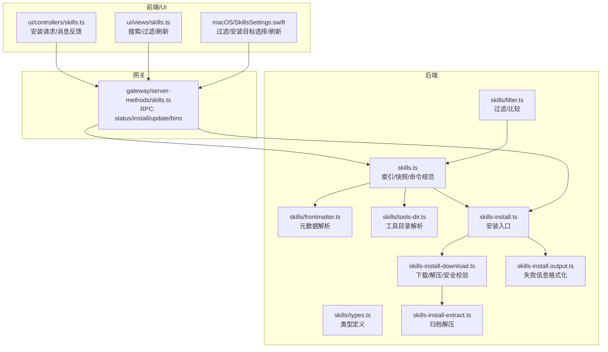
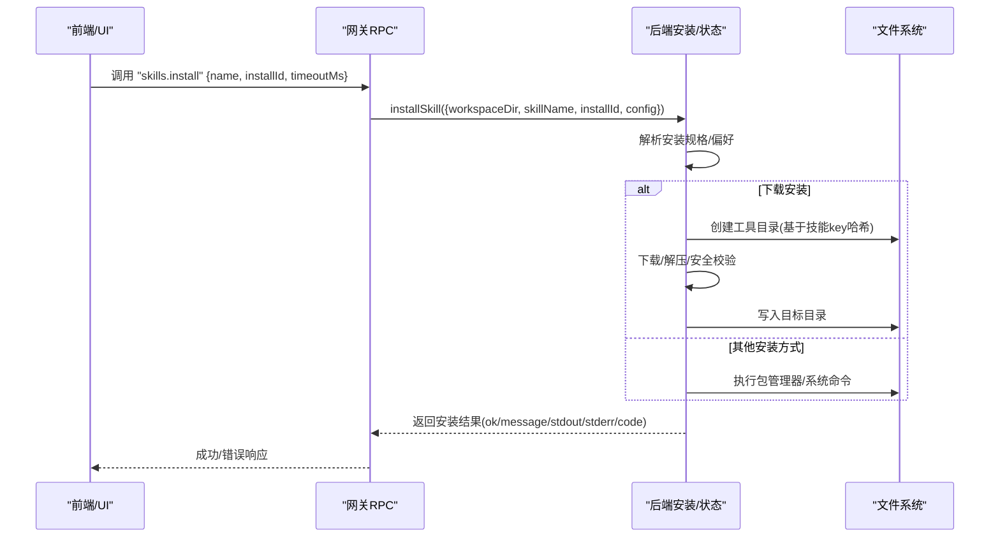
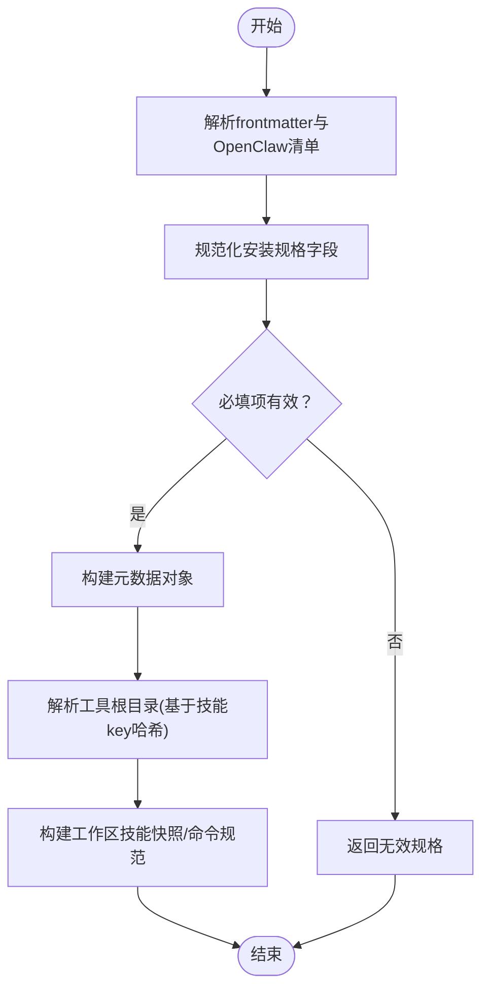
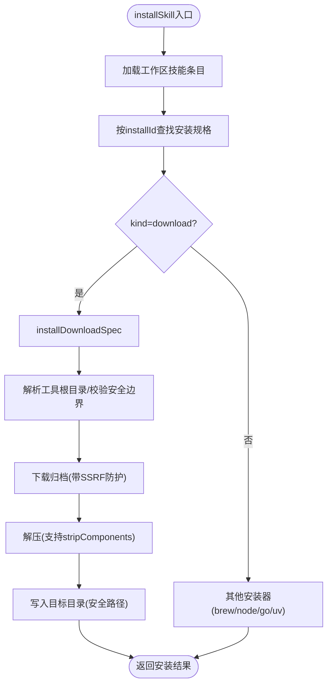
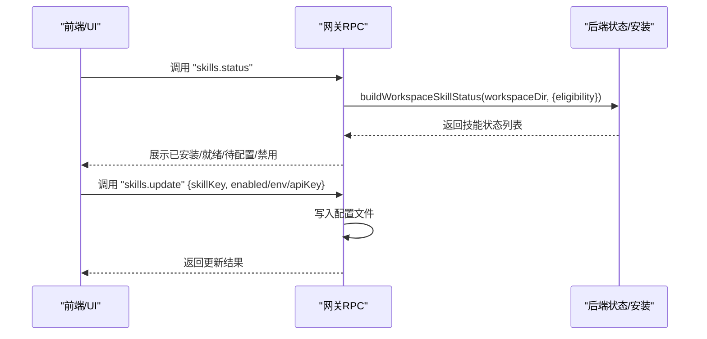
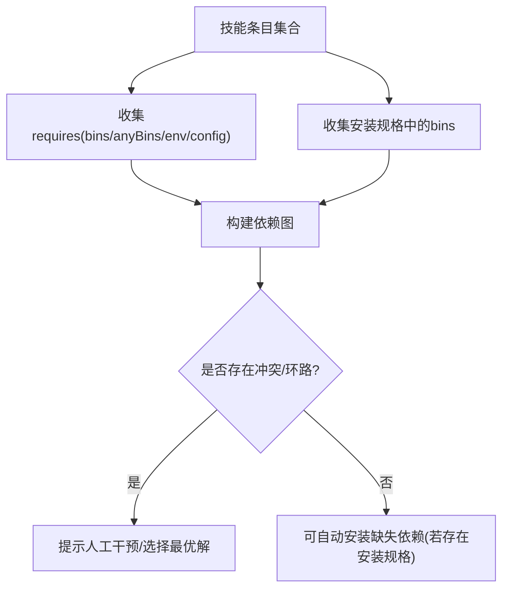
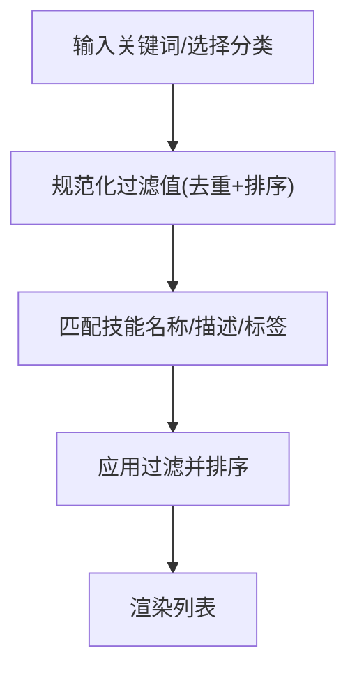
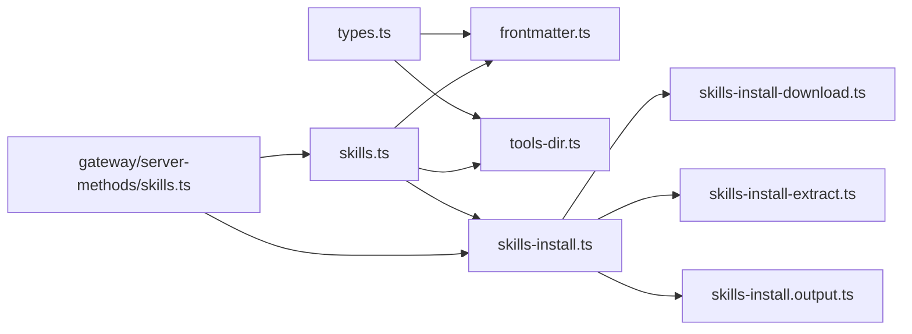

# 技能注册表

<cite>
**本文引用的文件**
- [src/agents/skills.ts](file://src/agents/skills.ts)
- [src/agents/skills/types.ts](file://src/agents/skills/types.ts)
- [src/agents/skills/frontmatter.ts](file://src/agents/skills/frontmatter.ts)
- [src/agents/skills/tools-dir.ts](file://src/agents/skills/tools-dir.ts)
- [src/agents/skills-install.ts](file://src/agents/skills-install.ts)
- [src/agents/skills-install-download.ts](file://src/agents/skills-install-download.ts)
- [src/agents/skills-install-extract.ts](file://src/agents/skills-install-extract.ts)
- [src/agents/skills-install.output.ts](file://src/agents/skills-install.output.ts)
- [src/agents/skills/filter.ts](file://src/agents/skills/filter.ts)
- [src/agents/skills/filter.test.ts](file://src/agents/skills/filter.test.ts)
- [src/gateway/server-methods/skills.ts](file://src/gateway/server-methods/skills.ts)
- [ui/src/ui/controllers/skills.ts](file://ui/src/ui/controllers/skills.ts)
- [apps/macos/Sources/OpenClaw/SkillsSettings.swift](file://apps/macos/Sources/OpenClaw/SkillsSettings.swift)
- [ui/src/ui/views/skills.ts](file://ui/src/ui/views/skills.ts)
</cite>

## 目录
1. [简介](#简介)
2. [项目结构](#项目结构)
3. [核心组件](#核心组件)
4. [架构总览](#架构总览)
5. [详细组件分析](#详细组件分析)
6. [依赖分析](#依赖分析)
7. [性能考虑](#性能考虑)
8. [故障排查指南](#故障排查指南)
9. [结论](#结论)
10. [附录](#附录)

## 简介
本文件为 OpenClaw 技能注册表系统的权威技术文档，聚焦于技能索引、元数据管理与版本控制、安装流程（下载/解压/权限/完整性）、状态管理（已安装列表、更新检测、卸载）、依赖解析（依赖图、冲突与自动安装）、搜索与发现（关键词/分类/排序）、管理工具（批量操作/批量更新/故障恢复）以及性能优化与缓存策略。文档以代码为依据，结合可视化图示帮助读者从高层到细节全面理解系统。

## 项目结构
技能注册表相关能力横跨后端 Agent、网关服务端方法、前端 UI 控制器与视图，以及 macOS 原生设置界面。关键模块如下：
- 后端技能索引与元数据：解析技能清单、构建工作区快照、生成命令规范与提示词
- 安装子系统：支持 brew/node/go/uv/download 多种安装方式，含下载、解压、安全路径校验与输出格式化
- 网关 RPC 方法：对外暴露 skills.status、skills.install、skills.update 等接口
- 前端与原生界面：提供技能列表展示、过滤、安装触发与状态刷新

**图表来源**
- [src/agents/skills.ts:1-47](file://src/agents/skills.ts#L1-L47)
- [src/agents/skills/types.ts:1-90](file://src/agents/skills/types.ts#L1-L90)
- [src/agents/skills/frontmatter.ts:1-223](file://src/agents/skills/frontmatter.ts#L1-L223)
- [src/agents/skills/tools-dir.ts:1-12](file://src/agents/skills/tools-dir.ts#L1-L12)
- [src/agents/skills-install.ts:392-439](file://src/agents/skills-install.ts#L392-L439)
- [src/agents/skills-install-download.ts:104-142](file://src/agents/skills-install-download.ts#L104-L142)
- [src/agents/skills-install-extract.ts:1-200](file://src/agents/skills-install-extract.ts#L1-L200)
- [src/agents/skills-install.output.ts:1-200](file://src/agents/skills-install.output.ts#L1-L200)
- [src/agents/skills/filter.ts:1-33](file://src/agents/skills/filter.ts#L1-L33)
- [src/gateway/server-methods/skills.ts:57-205](file://src/gateway/server-methods/skills.ts#L57-L205)
- [ui/src/ui/controllers/skills.ts:125-157](file://ui/src/ui/controllers/skills.ts#L125-L157)
- [ui/src/ui/views/skills.ts:38-66](file://ui/src/ui/views/skills.ts#L38-L66)
- [apps/macos/Sources/OpenClaw/SkillsSettings.swift:111-161](file://apps/macos/Sources/OpenClaw/SkillsSettings.swift#L111-L161)

**章节来源**
- [src/agents/skills.ts:1-47](file://src/agents/skills.ts#L1-L47)
- [src/gateway/server-methods/skills.ts:57-205](file://src/gateway/server-methods/skills.ts#L57-L205)
- [ui/src/ui/controllers/skills.ts:125-157](file://ui/src/ui/controllers/skills.ts#L125-L157)
- [apps/macos/Sources/OpenClaw/SkillsSettings.swift:111-161](file://apps/macos/Sources/OpenClaw/SkillsSettings.swift#L111-L161)
- [ui/src/ui/views/skills.ts:38-66](file://ui/src/ui/views/skills.ts#L38-L66)

## 核心组件
- 技能类型与元数据
  - 安装规格：支持 brew、node、go、uv、download 五类安装方式，字段覆盖二进制、平台、包名、模块、URL、归档类型、是否解压、stripComponents、目标目录等
  - 元数据：always、skillKey、primaryEnv、homepage、os、requires（bins/anyBins/env/config）、install 列表
  - 技能条目：封装 Skill、frontmatter、metadata、invocation 策略
- 安装偏好：是否优先 brew、Node 包管理器选择（npm/pnpm/yarn/bun）
- 过滤与比较：规范化字符串列表、去重排序、比较两组过滤条件是否等价

**章节来源**
- [src/agents/skills/types.ts:3-33](file://src/agents/skills/types.ts#L3-L33)
- [src/agents/skills/types.ts:59-71](file://src/agents/skills/types.ts#L59-L71)
- [src/agents/skills.ts:36-46](file://src/agents/skills.ts#L36-L46)
- [src/agents/skills/filter.ts:1-33](file://src/agents/skills/filter.ts#L1-L33)

## 架构总览
技能注册表围绕“工作区技能索引 + 安装执行 + 状态报告 + RPC 接口 + 前端交互”展开。核心流程：
- 网关接收客户端请求（如安装/状态查询），调用后端安装或状态构建逻辑
- 安装时根据安装规格选择对应安装器（brew/node/go/uv/download），执行下载、解压、安全校验与写入
- 状态构建汇总各技能的可用性、依赖满足情况、安装选项等
- 前端通过 RPC 获取状态并渲染，支持搜索、过滤、刷新与安装

**图表来源**
- [src/gateway/server-methods/skills.ts:114-145](file://src/gateway/server-methods/skills.ts#L114-L145)
- [src/agents/skills-install.ts:392-439](file://src/agents/skills-install.ts#L392-L439)
- [src/agents/skills-install-download.ts:104-142](file://src/agents/skills-install-download.ts#L104-L142)
- [src/agents/skills-install-extract.ts:1-200](file://src/agents/skills-install-extract.ts#L1-L200)

## 详细组件分析

### 组件一：技能索引与元数据管理
- 解析与规范化
  - frontmatter 解析与 OpenClaw 清单块解析，生成元数据对象；对 brew/node/go/uv/download 的字段进行安全规范化
  - 安装规格解析：校验必填项（如 brew 需 formula、node 需 package、go 需 module、uv 需 package、download 需 url）
- 工具目录解析
  - 基于技能 key 生成安全路径段，并拼接至配置目录下的 tools 子目录，确保隔离与可追踪
- 快照与命令规范
  - 构建工作区技能快照，包含 prompt、技能列表、过滤条件、resolvedSkills、版本号等；生成命令规范用于代理调度

**图表来源**
- [src/agents/skills/frontmatter.ts:111-184](file://src/agents/skills/frontmatter.ts#L111-L184)
- [src/agents/skills/frontmatter.ts:186-206](file://src/agents/skills/frontmatter.ts#L186-L206)
- [src/agents/skills/tools-dir.ts:7-11](file://src/agents/skills/tools-dir.ts#L7-L11)
- [src/agents/skills.ts:27-34](file://src/agents/skills.ts#L27-L34)

**章节来源**
- [src/agents/skills/frontmatter.ts:111-206](file://src/agents/skills/frontmatter.ts#L111-L206)
- [src/agents/skills/tools-dir.ts:7-11](file://src/agents/skills/tools-dir.ts#L7-L11)
- [src/agents/skills.ts:27-34](file://src/agents/skills.ts#L27-L34)

### 组件二：安装流程（下载/解压/权限/完整性）
- 安装入口
  - 根据工作区加载技能条目，定位目标安装规格；若未找到则返回错误
  - 支持多种安装方式：download、brew、node、go、uv；download 走专用下载/解压流程
- 下载与解压
  - 解析安全根目录（工具目录），校验 targetDir 不越界
  - 下载归档并进行安全解压：stripComponents、路径规范化、拒绝路径穿越
- 权限与完整性
  - 使用安全路径工具保证写入仅限于 per-skill tools 根目录
  - 对下载 URL、包名、模块等进行白名单/正则校验，避免危险输入
- 输出与错误处理
  - 统一格式化失败信息，便于前端展示与诊断

**图表来源**
- [src/agents/skills-install.ts:392-439](file://src/agents/skills-install.ts#L392-L439)
- [src/agents/skills-install-download.ts:104-142](file://src/agents/skills-install-download.ts#L104-L142)
- [src/agents/skills-install-extract.ts:1-200](file://src/agents/skills-install-extract.ts#L1-L200)

**章节来源**
- [src/agents/skills-install.ts:392-439](file://src/agents/skills-install.ts#L392-L439)
- [src/agents/skills-install-download.ts:104-142](file://src/agents/skills-install-download.ts#L104-L142)
- [src/agents/skills-install-extract.ts:1-200](file://src/agents/skills-install-extract.ts#L1-L200)

### 组件三：状态管理（已安装、更新检测、卸载）
- 状态构建
  - 网关 skills.status 汇总工作区技能状态，结合远程可用性与本地依赖满足情况
  - 收集所有技能所需的二进制与安装规格中的 bins，形成全局 bins 视图
- 更新与配置
  - skills.update 支持启用/禁用、API Key、环境变量等配置项的原子更新
- 卸载
  - 当前仓库未提供独立卸载 RPC；可通过删除工具目录与更新配置实现卸载效果

**图表来源**
- [src/gateway/server-methods/skills.ts:58-90](file://src/gateway/server-methods/skills.ts#L58-L90)
- [src/gateway/server-methods/skills.ts:91-113](file://src/gateway/server-methods/skills.ts#L91-L113)
- [src/gateway/server-methods/skills.ts:146-203](file://src/gateway/server-methods/skills.ts#L146-L203)

**章节来源**
- [src/gateway/server-methods/skills.ts:58-113](file://src/gateway/server-methods/skills.ts#L58-L113)
- [src/gateway/server-methods/skills.ts:146-203](file://src/gateway/server-methods/skills.ts#L146-L203)

### 组件四：依赖解析（依赖图、冲突、自动安装）
- 依赖来源
  - 元数据 requires：bins/anyBins/env/config；安装规格 bins：安装器可能声明所需二进制
- 依赖图与冲突
  - 可从技能条目集合构建依赖图：每个节点为技能，边表示 requires 关系
  - 冲突检测：当多个技能要求同一二进制的不同版本或互斥资源时，需人工干预或选择最优解
- 自动安装
  - 在安装某技能时，若其依赖未满足且存在可选安装规格，则可引导用户选择安装依赖
  - 实际安装流程已在安装入口与下载/解压模块中体现

**图表来源**
- [src/gateway/server-methods/skills.ts:26-55](file://src/gateway/server-methods/skills.ts#L26-L55)
- [src/agents/skills/types.ts:26-32](file://src/agents/skills/types.ts#L26-L32)

**章节来源**
- [src/gateway/server-methods/skills.ts:26-55](file://src/gateway/server-methods/skills.ts#L26-L55)
- [src/agents/skills/types.ts:26-32](file://src/agents/skills/types.ts#L26-L32)

### 组件五：搜索与发现（关键词/分类/排序）
- 前端搜索与过滤
  - UI 提供输入框进行关键词过滤，显示匹配数量
  - macOS 设置界面提供 Ready/Needs Setup/Disabled 等分类筛选
- 过滤比较
  - 过滤值规范化：去除空白、去重、排序，确保缓存命中与比较稳定
  - 比较函数判断两组过滤条件是否等价，避免重复刷新

**图表来源**
- [ui/src/ui/views/skills.ts:38-66](file://ui/src/ui/views/skills.ts#L38-L66)
- [apps/macos/Sources/OpenClaw/SkillsSettings.swift:123-136](file://apps/macos/Sources/OpenClaw/SkillsSettings.swift#L123-L136)
- [src/agents/skills/filter.ts:1-33](file://src/agents/skills/filter.ts#L1-L33)

**章节来源**
- [ui/src/ui/views/skills.ts:38-66](file://ui/src/ui/views/skills.ts#L38-L66)
- [apps/macos/Sources/OpenClaw/SkillsSettings.swift:123-136](file://apps/macos/Sources/OpenClaw/SkillsSettings.swift#L123-L136)
- [src/agents/skills/filter.ts:1-33](file://src/agents/skills/filter.ts#L1-L33)
- [src/agents/skills/filter.test.ts:1-35](file://src/agents/skills/filter.test.ts#L1-L35)

### 组件六：管理工具（批量操作/批量更新/故障恢复）
- 批量安装/更新
  - 前端控制器与 macOS 设置界面支持逐个技能安装与切换安装目标（网关/本地）
  - 网关 skills.update 支持批量更新技能键对应的配置（启用/禁用、API Key、环境变量）
- 故障恢复
  - 安装失败统一格式化输出，前端展示错误消息
  - 若安装被中断，可重新触发安装；下载/解压阶段的安全校验可避免破坏性写入

**章节来源**
- [ui/src/ui/controllers/skills.ts:125-157](file://ui/src/ui/controllers/skills.ts#L125-L157)
- [apps/macos/Sources/OpenClaw/SkillsSettings.swift:502-519](file://apps/macos/Sources/OpenClaw/SkillsSettings.swift#L502-L519)
- [src/gateway/server-methods/skills.ts:146-203](file://src/gateway/server-methods/skills.ts#L146-L203)
- [src/agents/skills-install.output.ts:1-200](file://src/agents/skills-install.output.ts#L1-L200)

## 依赖分析
- 组件耦合
  - skills.ts 作为聚合导出入口，向上层网关与 UI 提供快照、过滤、命令规范等能力
  - skills-install.ts 依赖 frontmatter 解析、tools-dir、download/extract 模块与输出格式化
  - 网关 skillsHandlers 依赖安装与状态构建，同时负责参数校验与错误码
- 外部依赖与集成点
  - brew/node/go/uv 命令行工具由系统提供
  - 下载使用受 SSRF 保护的网络获取器
  - 文件系统写入严格限制在 per-skill tools 根目录内

**图表来源**
- [src/agents/skills/types.ts:1-90](file://src/agents/skills/types.ts#L1-L90)
- [src/agents/skills/frontmatter.ts:1-223](file://src/agents/skills/frontmatter.ts#L1-L223)
- [src/agents/skills/tools-dir.ts:1-12](file://src/agents/skills/tools-dir.ts#L1-L12)
- [src/agents/skills.ts:1-47](file://src/agents/skills.ts#L1-L47)
- [src/agents/skills-install.ts:392-439](file://src/agents/skills-install.ts#L392-L439)
- [src/agents/skills-install-download.ts:104-142](file://src/agents/skills-install-download.ts#L104-L142)
- [src/agents/skills-install-extract.ts:1-200](file://src/agents/skills-install-extract.ts#L1-L200)
- [src/agents/skills-install.output.ts:1-200](file://src/agents/skills-install.output.ts#L1-L200)
- [src/gateway/server-methods/skills.ts:57-205](file://src/gateway/server-methods/skills.ts#L57-L205)

**章节来源**
- [src/agents/skills.ts:1-47](file://src/agents/skills.ts#L1-L47)
- [src/agents/skills-install.ts:392-439](file://src/agents/skills-install.ts#L392-L439)
- [src/gateway/server-methods/skills.ts:57-205](file://src/gateway/server-methods/skills.ts#L57-L205)

## 性能考虑
- 缓存与增量
  - 过滤比较采用规范化+排序，避免重复渲染；建议 UI 层缓存过滤结果
  - 工具目录按技能 key 哈希命名，避免长路径与频繁扫描
- I/O 优化
  - 归档解压支持 stripComponents，减少冗余层级；仅在需要时解压
  - 下载阶段使用流式管道与一次性写入，降低内存占用
- 并发与超时
  - 安装超时范围限制在合理区间，避免长时间阻塞
  - 建议 UI 层对批量安装进行节流与并发上限控制

[本节为通用指导，无需特定文件引用]

## 故障排查指南
- 安装失败
  - 查看安装结果中的 message/stdout/stderr/code，结合失败信息格式化模块定位问题
  - 若为下载/解压阶段，检查 URL、归档类型、stripComponents 与目标目录是否越界
- 权限与路径
  - 确认工具目录位于 per-skill tools 根目录内；避免相对路径逃逸
- 前端错误
  - 前端控制器捕获异常并展示错误消息；检查连接状态与 RPC 超时

**章节来源**
- [src/agents/skills-install.output.ts:1-200](file://src/agents/skills-install.output.ts#L1-L200)
- [src/agents/skills-install-download.ts:104-142](file://src/agents/skills-install-download.ts#L104-L142)
- [ui/src/ui/controllers/skills.ts:125-157](file://ui/src/ui/controllers/skills.ts#L125-L157)

## 结论
OpenClaw 技能注册表以清晰的类型体系与严格的安装安全机制为核心，结合网关 RPC 与多端 UI，提供了从索引、元数据、安装到状态管理与搜索发现的完整闭环。通过规范化过滤、安全路径校验与统一错误输出，系统在易用性与安全性之间取得良好平衡。后续可在批量安装并发控制、依赖冲突可视化与自动修复方面进一步增强。

## 附录
- 关键流程参考路径
  - 安装入口与分支：[src/agents/skills-install.ts:392-439](file://src/agents/skills-install.ts#L392-L439)
  - 下载/解压安全校验：[src/agents/skills-install-download.ts:104-142](file://src/agents/skills-install-download.ts#L104-L142)
  - 状态构建与 RPC：[src/gateway/server-methods/skills.ts:58-113](file://src/gateway/server-methods/skills.ts#L58-L113)
  - 前端安装触发与错误处理：[ui/src/ui/controllers/skills.ts:125-157](file://ui/src/ui/controllers/skills.ts#L125-L157)
  - 过滤规范化与比较：[src/agents/skills/filter.ts:1-33](file://src/agents/skills/filter.ts#L1-L33)