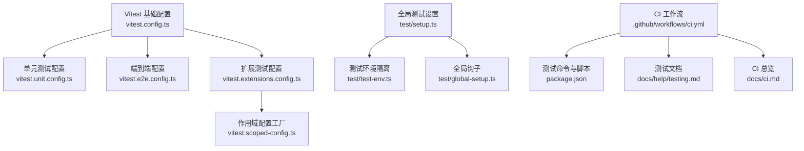
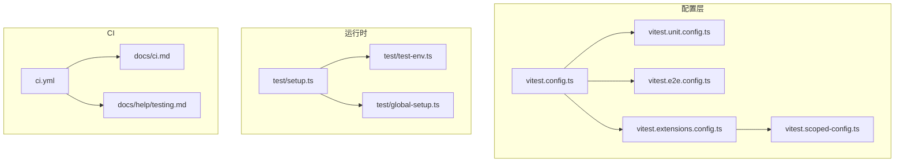
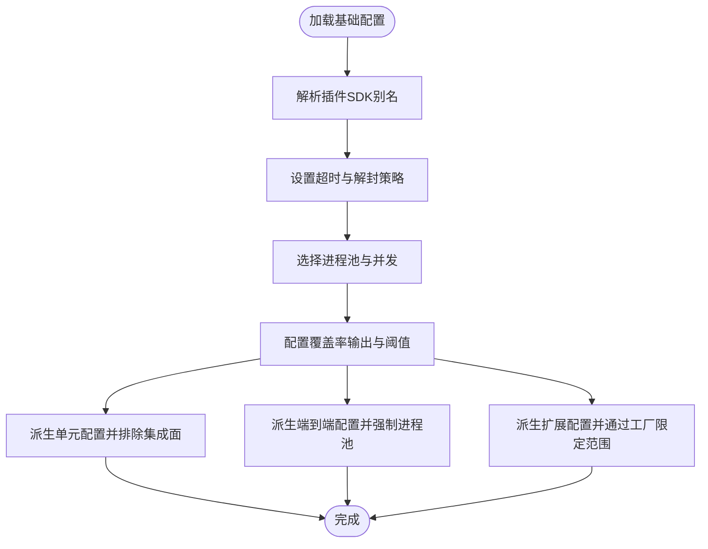
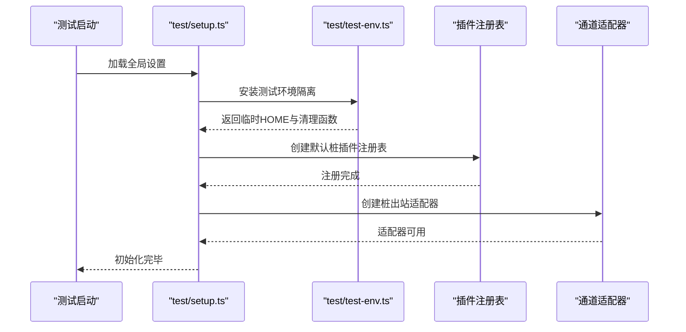
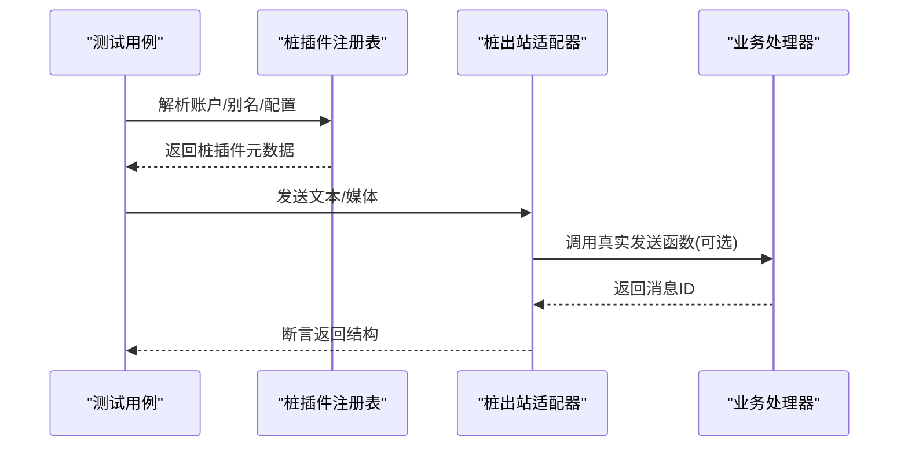
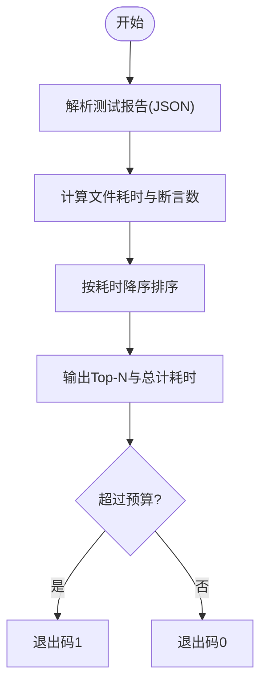
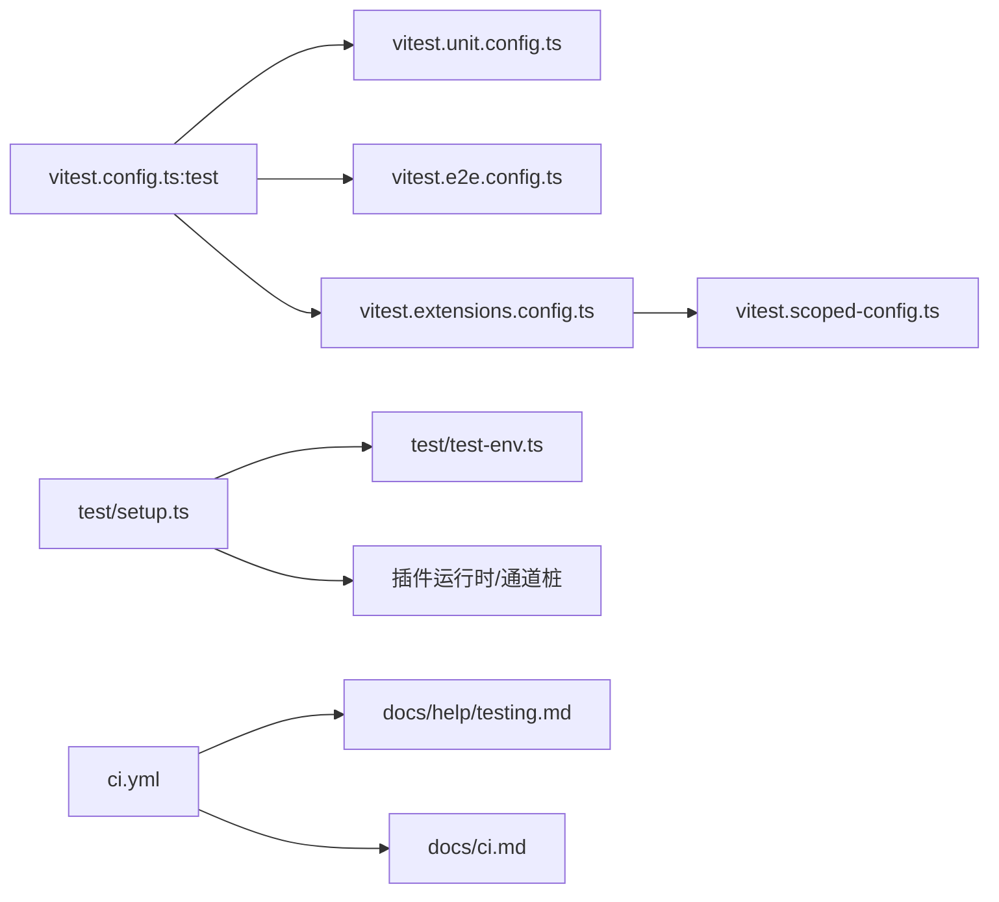

# 技能测试

<cite>
**本文引用的文件**
- [vitest.config.ts](file://vitest.config.ts)
- [vitest.unit.config.ts](file://vitest.unit.config.ts)
- [vitest.e2e.config.ts](file://vitest.e2e.config.ts)
- [vitest.extensions.config.ts](file://vitest.extensions.config.ts)
- [vitest.scoped-config.ts](file://vitest.scoped-config.ts)
- [test/setup.ts](file://test/setup.ts)
- [test/global-setup.ts](file://test/global-setup.ts)
- [test/test-env.ts](file://test/test-env.ts)
- [scripts/test-perf-budget.mjs](file://scripts/test-perf-budget.mjs)
- [scripts/test-hotspots.mjs](file://scripts/test-hotspots.mjs)
- [docs/ci.md](file://docs/ci.md)
- [.github/workflows/ci.yml](file://.github/workflows/ci.yml)
- [package.json](file://package.json)
- [docs/help/testing.md](file://docs/help/testing.md)
- [src/test-utils/fixture-suite.ts](file://src/test-utils/fixture-suite.ts)
- [src/test-utils/mock-http-response.ts](file://src/test-utils/mock-http-response.ts)
- [src/test-utils/camera-url-test-helpers.ts](file://src/test-utils/camera-url-test-helpers.ts)
- [src/agents/openai-ws-connection.test.ts](file://src/agents/openai-ws-connection.test.ts)
- [extensions/bluebubbles/src/test-mocks.ts](file://extensions/bluebubbles/src/test-mocks.ts)
- [extensions/nostr/src/nostr-profile-http.test.ts](file://extensions/nostr/src/nostr-profile-http.test.ts)
- [src/cli/skills-cli.test.ts](file://src/cli/skills-cli.test.ts)
</cite>

## 目录
1. [简介](#简介)
2. [项目结构](#项目结构)
3. [核心组件](#核心组件)
4. [架构总览](#架构总览)
5. [详细组件分析](#详细组件分析)
6. [依赖关系分析](#依赖关系分析)
7. [性能考量](#性能考量)
8. [故障排查指南](#故障排查指南)
9. [结论](#结论)
10. [附录](#附录)

## 简介
本文件面向 OpenClaw 技能测试体系，系统化阐述测试框架设计与实现，覆盖测试套件组织、模拟环境与断言机制；提供单元测试、集成测试与端到端测试策略；说明性能测试方法（响应时间、资源与并发）；详解测试数据管理（夹具、模拟数据与环境隔离）；并给出测试工具使用指南（运行器、覆盖率与 CI 配置）、最佳实践与调试技巧。

## 项目结构
OpenClaw 测试体系以 Vitest 为核心，结合多套配置文件与全局/局部测试环境，形成“单元/扩展/网关/端到端”的分层测试能力，并通过 CI 工作流按变更范围裁剪执行矩阵，兼顾稳定性与效率。



**图表来源**
- [vitest.config.ts:1-203](file://vitest.config.ts#L1-L203)
- [vitest.unit.config.ts:1-31](file://vitest.unit.config.ts#L1-L31)
- [vitest.e2e.config.ts:1-33](file://vitest.e2e.config.ts#L1-L33)
- [vitest.extensions.config.ts:1-4](file://vitest.extensions.config.ts#L1-L4)
- [vitest.scoped-config.ts:1-18](file://vitest.scoped-config.ts#L1-L18)
- [test/setup.ts:1-211](file://test/setup.ts#L1-L211)
- [test/test-env.ts:1-148](file://test/test-env.ts#L1-L148)
- [test/global-setup.ts:1-7](file://test/global-setup.ts#L1-L7)
- [.github/workflows/ci.yml:1-737](file://.github/workflows/ci.yml#L1-L737)
- [package.json:306-322](file://package.json#L306-L322)
- [docs/help/testing.md:42-78](file://docs/help/testing.md#L42-L78)
- [docs/ci.md:14-29](file://docs/ci.md#L14-L29)

**章节来源**
- [vitest.config.ts:1-203](file://vitest.config.ts#L1-L203)
- [vitest.unit.config.ts:1-31](file://vitest.unit.config.ts#L1-L31)
- [vitest.e2e.config.ts:1-33](file://vitest.e2e.config.ts#L1-L33)
- [vitest.extensions.config.ts:1-4](file://vitest.extensions.config.ts#L1-L4)
- [vitest.scoped-config.ts:1-18](file://vitest.scoped-config.ts#L1-L18)
- [test/setup.ts:1-211](file://test/setup.ts#L1-L211)
- [test/test-env.ts:1-148](file://test/test-env.ts#L1-L148)
- [test/global-setup.ts:1-7](file://test/global-setup.ts#L1-L7)
- [.github/workflows/ci.yml:1-737](file://.github/workflows/ci.yml#L1-L737)
- [package.json:306-322](file://package.json#L306-L322)
- [docs/help/testing.md:42-78](file://docs/help/testing.md#L42-L78)
- [docs/ci.md:14-29](file://docs/ci.md#L14-L29)

## 核心组件
- 测试运行器与配置
  - 基础配置统一解析别名、超时、池策略、覆盖率阈值与排除规则，确保跨平台与 CI 稳定性。
  - 单元/扩展/网关/端到端等专用配置基于基础配置派生，限定 include/exclude 与池类型。
- 全局测试设置
  - 安装进程警告过滤、插件注册表默认桩、通道适配器桩、隔离 HOME 环境，保证测试间无泄漏。
- 测试工具与夹具
  - 提供文件夹夹具生成器、HTTP 响应桩、fetch 文本桩、WebSocket 模拟等通用测试辅助。
- 性能与热点分析
  - 提供性能预算脚本与测试热点统计脚本，定位耗时文件与断言热点。
- CI 与任务编排
  - 按变更范围裁剪任务矩阵，统一 Node/Bun 测试、Swift 检查、Android 构建与测试、Python 技能脚本检查等。

**章节来源**
- [vitest.config.ts:57-201](file://vitest.config.ts#L57-L201)
- [vitest.unit.config.ts:6-30](file://vitest.unit.config.ts#L6-L30)
- [vitest.e2e.config.ts:20-32](file://vitest.e2e.config.ts#L20-L32)
- [vitest.extensions.config.ts:1-4](file://vitest.extensions.config.ts#L1-L4)
- [vitest.scoped-config.ts:4-17](file://vitest.scoped-config.ts#L4-L17)
- [test/setup.ts:31-211](file://test/setup.ts#L31-L211)
- [test/test-env.ts:54-148](file://test/test-env.ts#L54-L148)
- [src/test-utils/fixture-suite.ts:1-29](file://src/test-utils/fixture-suite.ts#L1-L29)
- [src/test-utils/mock-http-response.ts:1-27](file://src/test-utils/mock-http-response.ts#L1-L27)
- [src/test-utils/camera-url-test-helpers.ts:1-21](file://src/test-utils/camera-url-test-helpers.ts#L1-L21)
- [scripts/test-perf-budget.mjs:98-127](file://scripts/test-perf-budget.mjs#L98-L127)
- [scripts/test-hotspots.mjs:54-83](file://scripts/test-hotspots.mjs#L54-L83)
- [.github/workflows/ci.yml:12-737](file://.github/workflows/ci.yml#L12-L737)
- [docs/help/testing.md:42-78](file://docs/help/testing.md#L42-L78)

## 架构总览
下图展示测试运行器、配置、全局设置与 CI 的交互关系，以及不同测试类型的入口与职责边界。



**图表来源**
- [vitest.config.ts:1-203](file://vitest.config.ts#L1-L203)
- [vitest.unit.config.ts:1-31](file://vitest.unit.config.ts#L1-L31)
- [vitest.e2e.config.ts:1-33](file://vitest.e2e.config.ts#L1-L33)
- [vitest.extensions.config.ts:1-4](file://vitest.extensions.config.ts#L1-L4)
- [vitest.scoped-config.ts:1-18](file://vitest.scoped-config.ts#L1-L18)
- [test/setup.ts:1-211](file://test/setup.ts#L1-L211)
- [test/test-env.ts:1-148](file://test/test-env.ts#L1-L148)
- [test/global-setup.ts:1-7](file://test/global-setup.ts#L1-L7)
- [.github/workflows/ci.yml:1-737](file://.github/workflows/ci.yml#L1-L737)
- [docs/ci.md:14-29](file://docs/ci.md#L14-L29)
- [docs/help/testing.md:42-78](file://docs/help/testing.md#L42-L78)

## 详细组件分析

### 组件一：测试运行器与配置
- 基础配置要点
  - 别名映射：对插件 SDK 子路径进行精确别名替换，确保测试导入稳定。
  - 超时与解封：统一 test/hook 超时，启用 unstubEnvs/unstubGlobals，避免 vmForks 下环境泄漏。
  - 池与并发：默认 fork 池，CI/本地 CPU 自适应 maxWorkers；Windows 增大 hook 超时。
  - 覆盖率：v8 提供者，文本+lcov 输出，阈值与 include/exclude 精准锚定核心源码。
- 单元测试配置
  - 排除网关/各渠道/浏览器/UI 等集成面，聚焦纯单元与轻量集成。
- 端到端配置
  - 强制 fork 池，避免 vmForks 导致模块状态泄漏；支持 OPENCLAW_E2E_WORKERS 与 VERBOSE 控制。
- 扩展测试配置
  - 通过作用域工厂快速限定扩展目录匹配模式。



**图表来源**
- [vitest.config.ts:57-201](file://vitest.config.ts#L57-L201)
- [vitest.unit.config.ts:6-30](file://vitest.unit.config.ts#L6-L30)
- [vitest.e2e.config.ts:20-32](file://vitest.e2e.config.ts#L20-L32)
- [vitest.extensions.config.ts:1-4](file://vitest.extensions.config.ts#L1-L4)
- [vitest.scoped-config.ts:4-17](file://vitest.scoped-config.ts#L4-L17)

**章节来源**
- [vitest.config.ts:57-201](file://vitest.config.ts#L57-L201)
- [vitest.unit.config.ts:6-30](file://vitest.unit.config.ts#L6-L30)
- [vitest.e2e.config.ts:20-32](file://vitest.e2e.config.ts#L20-L32)
- [vitest.extensions.config.ts:1-4](file://vitest.extensions.config.ts#L1-L4)
- [vitest.scoped-config.ts:4-17](file://vitest.scoped-config.ts#L4-L17)

### 组件二：全局测试设置与环境隔离
- 进程级设置
  - 安装测试警告过滤，提升日志可读性。
  - 设置 OPENCLAW_PLUGIN_MANIFEST_CACHE_MS 缓存，减少重复发现开销。
  - 提升最大监听器上限，避免 vmForks 下过多监听器告警。
- 插件注册表与通道适配器
  - 默认注册 Discord/Slack/Telegram/WhatsApp/Signal/iMessage 的桩插件与出站适配器，便于断言消息发送行为。
- 环境隔离
  - 通过 withIsolatedTestHome 将 HOME/XDG_* 等路径隔离至临时目录，删除真实密钥与端口变量，避免污染。
  - 支持 LIVE 模式保留真实用户环境（用于需要真实密钥的实时测试）。



**图表来源**
- [test/setup.ts:19-211](file://test/setup.ts#L19-L211)
- [test/test-env.ts:54-148](file://test/test-env.ts#L54-L148)

**章节来源**
- [test/setup.ts:19-211](file://test/setup.ts#L19-L211)
- [test/test-env.ts:54-148](file://test/test-env.ts#L54-L148)

### 组件三：测试夹具与模拟数据
- 夹具套件
  - createFixtureSuite 提供临时目录与用例目录创建，自动清理，适合端到端与文件系统相关测试。
- HTTP/网络模拟
  - createMockServerResponse 提供最小 HTTP 响应桩，便于断言服务端行为。
  - extensions/nostr 的测试通过自定义 IncomingMessage/ServerResponse 桩驱动路由与处理器。
- Fetch 与媒体
  - stubFetchTextResponse 与 readFileUtf8AndCleanup 组合，便于断言 fetch 行为与临时文件清理。
- WebSocket 模拟
  - src/agents/openai-ws-connection.test.ts 中对 ws 的默认导出进行 mock，便于断言连接与事件序列。

```mermaid
classDiagram
class FixtureSuite {
+setup() void
+cleanup() void
+createCaseDir(prefix) string
}
class MockHTTP {
+createMockServerResponse() ServerResponse
}
class CameraHelpers {
+stubFetchTextResponse(text, init) void
+readFileUtf8AndCleanup(path) string
}
class WS_Mock {
+mock ws default export
}
FixtureSuite <.. MockHTTP : "组合"
FixtureSuite <.. CameraHelpers : "组合"
WS_Mock ..> "使用" : "vi.mock"
```

**图表来源**
- [src/test-utils/fixture-suite.ts:1-29](file://src/test-utils/fixture-suite.ts#L1-L29)
- [src/test-utils/mock-http-response.ts:1-27](file://src/test-utils/mock-http-response.ts#L1-L27)
- [src/test-utils/camera-url-test-helpers.ts:1-21](file://src/test-utils/camera-url-test-helpers.ts#L1-L21)
- [src/agents/openai-ws-connection.test.ts:126-150](file://src/agents/openai-ws-connection.test.ts#L126-L150)

**章节来源**
- [src/test-utils/fixture-suite.ts:1-29](file://src/test-utils/fixture-suite.ts#L1-L29)
- [src/test-utils/mock-http-response.ts:1-27](file://src/test-utils/mock-http-response.ts#L1-L27)
- [src/test-utils/camera-url-test-helpers.ts:1-21](file://src/test-utils/camera-url-test-helpers.ts#L1-L21)
- [src/agents/openai-ws-connection.test.ts:126-150](file://src/agents/openai-ws-connection.test.ts#L126-L150)
- [extensions/nostr/src/nostr-profile-http.test.ts:35-93](file://extensions/nostr/src/nostr-profile-http.test.ts#L35-L93)

### 组件四：断言与测试策略
- 单元测试
  - 聚焦纯函数与模块内部逻辑，使用桩与夹具隔离外部依赖。
  - 示例：src/cli/skills-cli.test.ts 对技能检查/列表/信息输出的断言，覆盖 JSON 输出与文本格式。
- 集成测试
  - 通过默认桩插件与通道适配器，断言消息发送流程、会话查找与别名解析。
- 端到端测试
  - 使用 e2e 配置与 fork 池，覆盖多实例网关行为、WebSocket/HTTP 表面、节点配对与网络交互。
- 外部依赖测试
  - extensions/bluebubbles 的测试通过 vi.mock 分离账户与探测模块，降低真实依赖耦合。



**图表来源**
- [test/setup.ts:100-192](file://test/setup.ts#L100-L192)
- [src/cli/skills-cli.test.ts:160-245](file://src/cli/skills-cli.test.ts#L160-L245)
- [extensions/bluebubbles/src/test-mocks.ts:1-11](file://extensions/bluebubbles/src/test-mocks.ts#L1-L11)

**章节来源**
- [test/setup.ts:100-192](file://test/setup.ts#L100-L192)
- [src/cli/skills-cli.test.ts:160-245](file://src/cli/skills-cli.test.ts#L160-L245)
- [extensions/bluebubbles/src/test-mocks.ts:1-11](file://extensions/bluebubbles/src/test-mocks.ts#L1-L11)

### 组件五：性能测试与热点分析
- 性能预算
  - scripts/test-perf-budget.mjs 支持最大墙钟时间与基线回归预算校验，失败时退出非零。
- 测试热点
  - scripts/test-hotspots.mjs 从 Jest 报告解析文件级耗时，排序输出 Top-N，辅助定位慢文件。



**图表来源**
- [scripts/test-hotspots.mjs:54-83](file://scripts/test-hotspots.mjs#L54-L83)
- [scripts/test-perf-budget.mjs:98-127](file://scripts/test-perf-budget.mjs#L98-L127)

**章节来源**
- [scripts/test-hotspots.mjs:54-83](file://scripts/test-hotspots.mjs#L54-L83)
- [scripts/test-perf-budget.mjs:98-127](file://scripts/test-perf-budget.mjs#L98-L127)

## 依赖关系分析
- 配置继承
  - 各专用配置均基于 vitest.config.ts 的 test 字段派生，确保一致的超时、池与覆盖率策略。
- 运行时依赖
  - test/setup.ts 依赖 test/test-env.ts 进行环境隔离；同时依赖插件运行时与通道插件桩。
- CI 依赖
  - .github/workflows/ci.yml 依据 docs/ci.md 的作业矩阵与 docs/help/testing.md 的测试命令，组织 Node/Bun/Windows/macOS/Android 等测试。



**图表来源**
- [vitest.config.ts:71-100](file://vitest.config.ts#L71-L100)
- [vitest.unit.config.ts:11-30](file://vitest.unit.config.ts#L11-L30)
- [vitest.e2e.config.ts:20-32](file://vitest.e2e.config.ts#L20-L32)
- [vitest.extensions.config.ts:1-4](file://vitest.extensions.config.ts#L1-L4)
- [vitest.scoped-config.ts:4-17](file://vitest.scoped-config.ts#L4-L17)
- [test/setup.ts:31-211](file://test/setup.ts#L31-L211)
- [test/test-env.ts:54-148](file://test/test-env.ts#L54-L148)
- [.github/workflows/ci.yml:12-737](file://.github/workflows/ci.yml#L12-L737)
- [docs/help/testing.md:42-78](file://docs/help/testing.md#L42-L78)
- [docs/ci.md:14-29](file://docs/ci.md#L14-L29)

**章节来源**
- [vitest.config.ts:71-100](file://vitest.config.ts#L71-L100)
- [vitest.unit.config.ts:11-30](file://vitest.unit.config.ts#L11-L30)
- [vitest.e2e.config.ts:20-32](file://vitest.e2e.config.ts#L20-L32)
- [vitest.extensions.config.ts:1-4](file://vitest.extensions.config.ts#L1-L4)
- [vitest.scoped-config.ts:4-17](file://vitest.scoped-config.ts#L4-L17)
- [test/setup.ts:31-211](file://test/setup.ts#L31-L211)
- [test/test-env.ts:54-148](file://test/test-env.ts#L54-L148)
- [.github/workflows/ci.yml:12-737](file://.github/workflows/ci.yml#L12-L737)
- [docs/help/testing.md:42-78](file://docs/help/testing.md#L42-L78)
- [docs/ci.md:14-29](file://docs/ci.md#L14-L29)

## 性能考量
- 响应时间与回归预算
  - 使用 scripts/test-perf-budget.mjs 对关键场景设定最大墙钟时间与基线回归阈值，防止性能回退。
- 资源使用监控
  - CI 中为 Node 测试设置 OPENCLAW_TEST_WORKERS 与 OPENCLAW_TEST_MAX_OLD_SPACE_SIZE_MB，缓解内存压力。
- 并发与稳定性
  - 基于平台与 CPU 数动态设置 maxWorkers；Windows 特增 hook 超时；端到端强制 fork 池避免状态泄漏。
- 热点定位
  - 使用 scripts/test-hotspots.mjs 输出 Top-N 慢文件，指导优化重点。

**章节来源**
- [scripts/test-perf-budget.mjs:98-127](file://scripts/test-perf-budget.mjs#L98-L127)
- [.github/workflows/ci.yml:177-184](file://.github/workflows/ci.yml#L177-L184)
- [vitest.config.ts:7-10](file://vitest.config.ts#L7-L10)
- [vitest.e2e.config.ts:24-28](file://vitest.e2e.config.ts#L24-L28)
- [scripts/test-hotspots.mjs:54-83](file://scripts/test-hotspots.mjs#L54-L83)

## 故障排查指南
- 环境泄漏与定时器
  - test/setup.ts 在 afterEach 中恢复真实计时器，避免假计时器跨文件泄漏。
- 真实密钥与端口冲突
  - test/test-env.ts 在隔离模式下删除 TELEGRAM/DISCORD/SLACK 等令牌与端口变量，避免真实依赖与端口冲突。
- 跨文件状态污染
  - vitest.config.ts 开启 unstubEnvs/unstubGlobals，配合 e2e 强制 fork 池，降低 vmForks 下模块状态泄漏风险。
- CI 并发不稳定
  - Windows 场景通过 OPENCLAW_TEST_WORKERS 限制并发，必要时启用 OPENCLAW_E2E_VERBOSE 查看详细日志。
- 覆盖率异常
  - 若覆盖率阈值不达标，检查 vitest.config.ts 的 include/exclude 与阈值配置，确认目标文件被纳入统计。

**章节来源**
- [test/setup.ts:202-211](file://test/setup.ts#L202-L211)
- [test/test-env.ts:94-122](file://test/test-env.ts#L94-L122)
- [vitest.config.ts:74-79](file://vitest.config.ts#L74-L79)
- [vitest.e2e.config.ts:24-28](file://vitest.e2e.config.ts#L24-L28)
- [.github/workflows/ci.yml:334-340](file://.github/workflows/ci.yml#L334-L340)

## 结论
OpenClaw 的测试体系以 Vitest 为核心，通过分层配置与严格的环境隔离，实现了从单元到端到端的全面覆盖。配合 CI 的按需裁剪与性能预算/热点分析工具，既保障了质量，也提升了工程效率。建议在新增功能时优先编写单元与集成测试，并在必要场景引入端到端验证，持续完善覆盖率与性能基线。

## 附录
- 测试命令与脚本
  - pnpm test / pnpm test:fast / pnpm test:e2e / pnpm test:coverage / pnpm test:extensions / pnpm test:gateway
  - Docker 相关测试脚本位于 scripts/e2e 与 scripts/test-*.sh
- CI 作业概览
  - 包含 docs-scope、changed-scope、check、checks、checks-windows、macos、android、skills-python、secrets、build-artifacts、release-check 等

**章节来源**
- [package.json:306-322](file://package.json#L306-L322)
- [.github/workflows/ci.yml:12-737](file://.github/workflows/ci.yml#L12-L737)
- [docs/ci.md:14-29](file://docs/ci.md#L14-L29)
- [docs/help/testing.md:42-78](file://docs/help/testing.md#L42-L78)