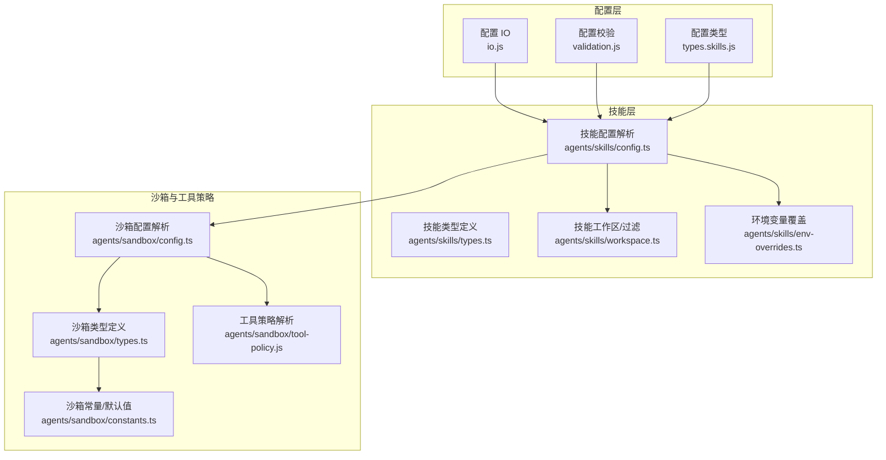
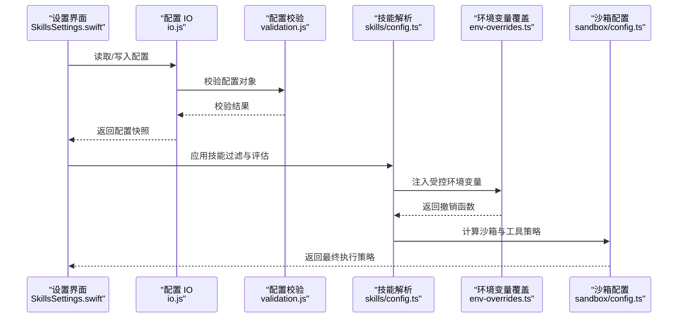
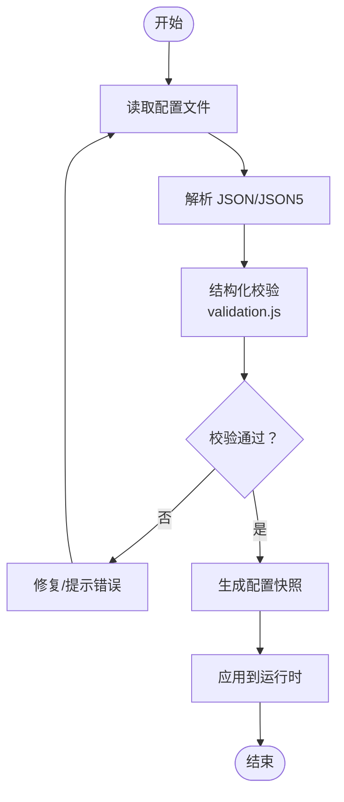
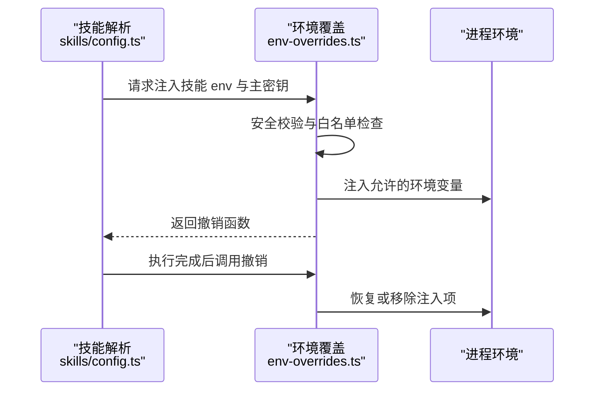
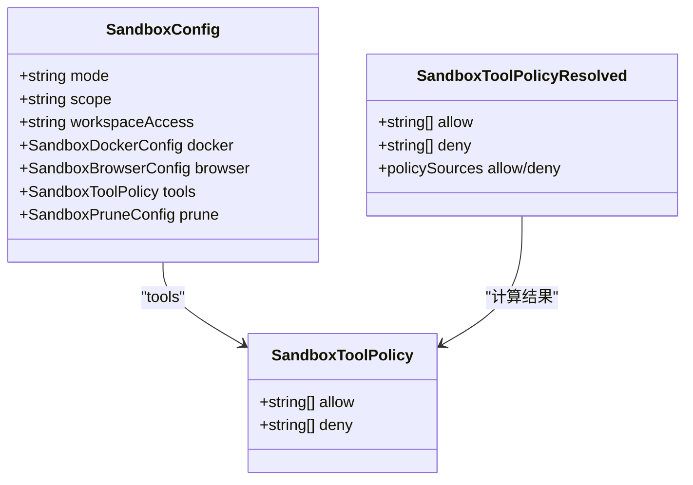
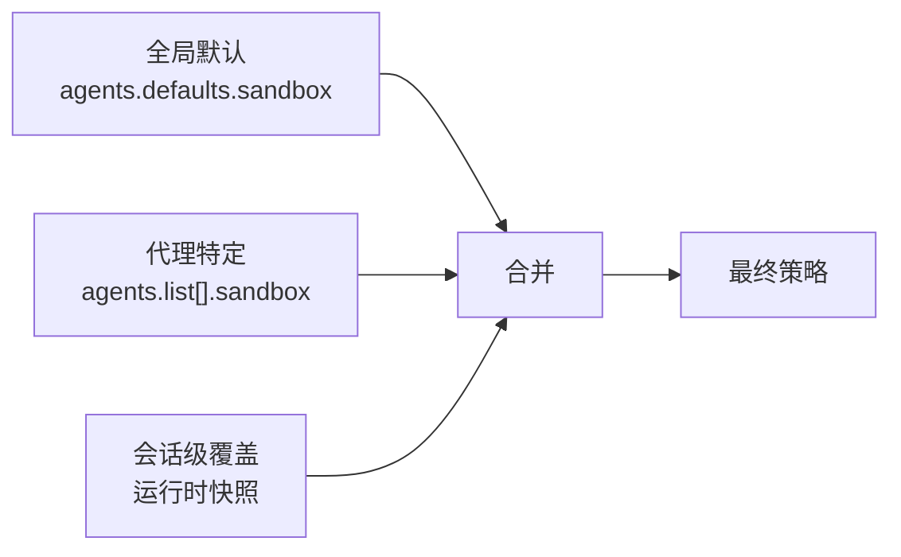
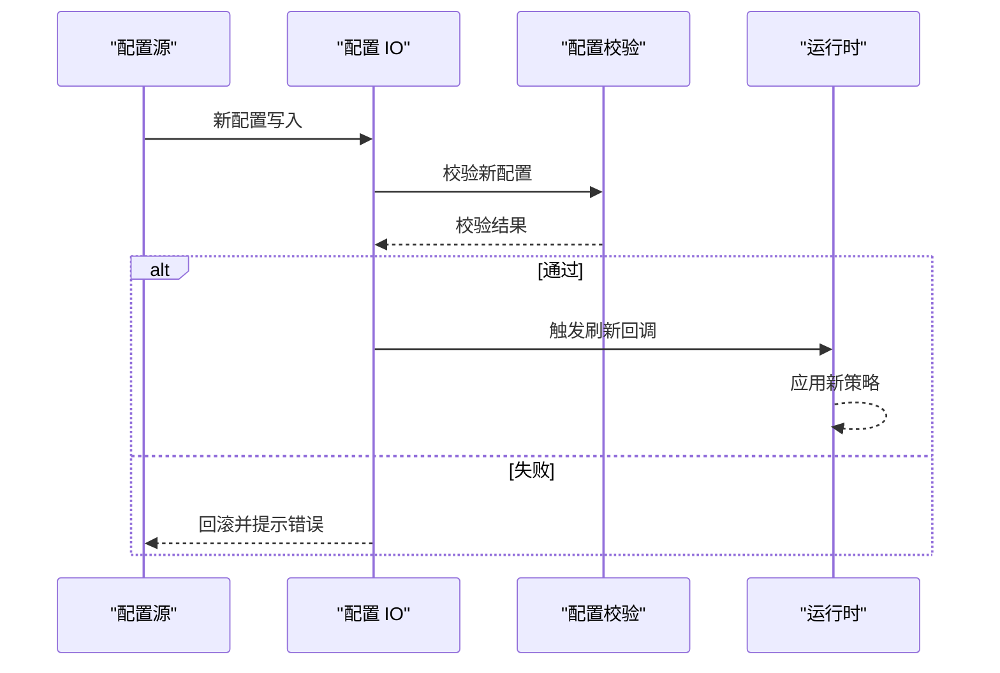
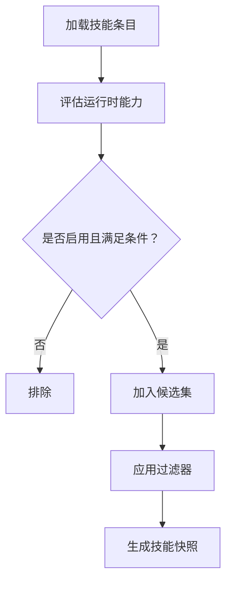
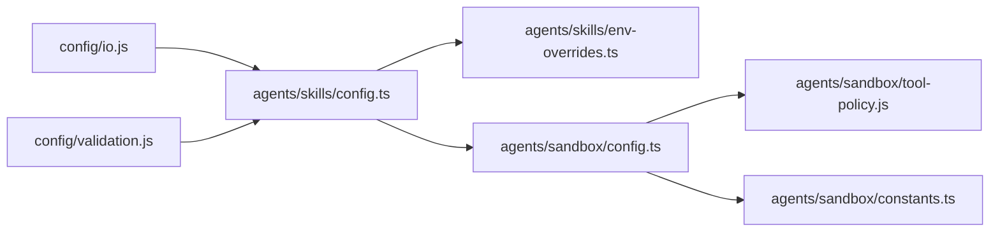

# 技能配置

<cite>
**本文引用的文件**
- [src/config/config.ts](file://src/config/config.ts)
- [src/config/io.js](file://src/config/io.js)
- [src/config/validation.js](file://src/config/validation.js)
- [src/config/types.skills.js](file://src/config/types.skills.js)
- [src/agents/skills/config.ts](file://src/agents/skills/config.ts)
- [src/agents/skills/types.ts](file://src/agents/skills/types.ts)
- [src/agents/skills/workspace.ts](file://src/agents/skills/workspace.ts)
- [src/agents/skills/env-overrides.ts](file://src/agents/skills/env-overrides.ts)
- [src/agents/sandbox/config.ts](file://src/agents/sandbox/config.ts)
- [src/agents/sandbox/types.ts](file://src/agents/sandbox/types.ts)
- [src/agents/sandbox/constants.ts](file://src/agents/sandbox/constants.ts)
- [src/agents/sandbox/tool-policy.js](file://src/agents/sandbox/tool-policy.js)
- [src/agents/sandbox-explain.test.ts](file://src/agents/sandbox-explain.test.ts)
- [src/security/audit.test.ts](file://src/security/audit.test.ts)
- [apps/macos/Sources/OpenClaw/SkillsSettings.swift](file://apps/macos/Sources/OpenClaw/SkillsSettings.swift)
- [src/browser/cdp-proxy-bypass.ts](file://src/browser/cdp-proxy-bypass.ts)
</cite>

## 目录
1. [简介](#简介)
2. [项目结构](#项目结构)
3. [核心组件](#核心组件)
4. [架构总览](#架构总览)
5. [详细组件分析](#详细组件分析)
6. [依赖关系分析](#依赖关系分析)
7. [性能考量](#性能考量)
8. [故障排除指南](#故障排除指南)
9. [结论](#结论)
10. [附录](#附录)

## 简介
本文件面向 OpenClaw 技能配置系统，系统性阐述技能配置的架构设计、配置文件格式、参数验证与默认值管理、技能参数传递（环境变量注入、运行时参数、上下文传递）、权限控制（工具策略、沙箱限制、安全策略）、配置继承与覆盖（全局、代理特定、会话级）、动态更新（热重载、验证与回滚）以及最佳实践与故障排除。内容以代码为依据，辅以图示帮助理解。

## 项目结构
技能配置系统横跨配置层、技能解析层与沙箱/工具策略层，主要涉及以下模块：
- 配置层：负责配置加载、校验、快照与 IO 操作
- 技能层：负责技能筛选、元数据评估、环境变量覆盖
- 沙箱与工具策略层：负责工具策略解析与合并、沙箱配置解析与覆盖

**图表来源**
- [src/config/io.js](file://src/config/io.js)
- [src/config/validation.js](file://src/config/validation.js)
- [src/config/types.skills.js](file://src/config/types.skills.js)
- [src/agents/skills/config.ts](file://src/agents/skills/config.ts)
- [src/agents/skills/types.ts](file://src/agents/skills/types.ts)
- [src/agents/skills/workspace.ts](file://src/agents/skills/workspace.ts)
- [src/agents/skills/env-overrides.ts](file://src/agents/skills/env-overrides.ts)
- [src/agents/sandbox/config.ts](file://src/agents/sandbox/config.ts)
- [src/agents/sandbox/types.ts](file://src/agents/sandbox/types.ts)
- [src/agents/sandbox/constants.ts](file://src/agents/sandbox/constants.ts)
- [src/agents/sandbox/tool-policy.js](file://src/agents/sandbox/tool-policy.js)

**章节来源**
- [src/config/config.ts:1-29](file://src/config/config.ts#L1-L29)
- [src/agents/skills/config.ts:1-104](file://src/agents/skills/config.ts#L1-L104)
- [src/agents/sandbox/config.ts:1-217](file://src/agents/sandbox/config.ts#L1-L217)

## 核心组件
- 配置加载与 IO：提供配置文件读写、快照、哈希、运行时刷新回调等能力
- 配置校验：对配置对象进行结构化校验，支持插件扩展
- 技能配置解析：按技能键解析技能级配置，结合默认值与运行时条件决定是否启用与可用
- 环境变量覆盖：在安全前提下，将技能配置中的 env 注入到进程环境，并跟踪活跃注入项
- 沙箱与工具策略：解析并合并全局/代理/会话级沙箱配置，计算工具允许/拒绝集合
- 技能工作区与过滤：根据过滤器与能力评估，生成候选技能集与提示词快照

**章节来源**
- [src/config/config.ts:1-29](file://src/config/config.ts#L1-L29)
- [src/config/validation.js](file://src/config/validation.js)
- [src/agents/skills/config.ts:1-104](file://src/agents/skills/config.ts#L1-L104)
- [src/agents/skills/env-overrides.ts:1-263](file://src/agents/skills/env-overrides.ts#L1-L263)
- [src/agents/sandbox/config.ts:1-217](file://src/agents/sandbox/config.ts#L1-L217)
- [src/agents/skills/workspace.ts:68-100](file://src/agents/skills/workspace.ts#L68-L100)

## 架构总览
技能配置系统遵循“配置驱动 + 运行时评估 + 权限收敛”的设计原则：
- 配置来源：全局配置、代理特定配置、会话级配置（通过运行时覆盖）
- 解析顺序：先解析全局默认，再叠加代理特定，最后叠加会话级覆盖
- 权限收敛：工具策略与沙箱策略在多源配置中进行合并与最严格优先
- 安全边界：环境变量注入前进行安全校验与阻断，避免危险键与越权行为

**图表来源**
- [apps/macos/Sources/OpenClaw/SkillsSettings.swift:1-35](file://apps/macos/Sources/OpenClaw/SkillsSettings.swift#L1-L35)
- [src/config/io.js](file://src/config/io.js)
- [src/config/validation.js](file://src/config/validation.js)
- [src/agents/skills/config.ts:1-104](file://src/agents/skills/config.ts#L1-L104)
- [src/agents/skills/env-overrides.ts:1-263](file://src/agents/skills/env-overrides.ts#L1-L263)
- [src/agents/sandbox/config.ts:1-217](file://src/agents/sandbox/config.ts#L1-L217)

## 详细组件分析

### 配置文件格式与参数验证
- 文件格式与 IO：提供配置文件读写、快照、哈希、运行时刷新回调等接口，支持增量写入与回滚
- 参数验证：对配置对象进行结构化校验，支持插件扩展校验，确保字段类型与取值范围正确
- 类型定义：技能配置类型由配置类型模块导出，约束技能条目、元数据、调用策略等字段

**图表来源**
- [src/config/io.js](file://src/config/io.js)
- [src/config/validation.js](file://src/config/validation.js)
- [src/config/types.skills.js](file://src/config/types.skills.js)

**章节来源**
- [src/config/config.ts:1-29](file://src/config/config.ts#L1-L29)
- [src/config/validation.js](file://src/config/validation.js)
- [src/config/types.skills.js](file://src/config/types.skills.js)

### 技能参数传递机制
- 环境变量注入：从技能配置 env 字段与主密钥字段提取敏感键白名单，经安全校验后注入进程环境；同时维护活跃注入表，确保可撤销
- 运行时参数：结合技能元数据（如 OS、二进制依赖、环境变量需求）与配置路径表达式进行运行时评估
- 上下文传递：通过技能快照携带已解析技能清单与主密钥/必需环境键，用于后续执行阶段复用

**图表来源**
- [src/agents/skills/config.ts:71-103](file://src/agents/skills/config.ts#L71-L103)
- [src/agents/skills/env-overrides.ts:136-203](file://src/agents/skills/env-overrides.ts#L136-L203)

**章节来源**
- [src/agents/skills/config.ts:1-104](file://src/agents/skills/config.ts#L1-L104)
- [src/agents/skills/env-overrides.ts:1-263](file://src/agents/skills/env-overrides.ts#L1-L263)
- [src/agents/skills/types.ts:64-89](file://src/agents/skills/types.ts#L64-L89)

### 技能权限控制系统
- 工具策略：支持 allow/deny 列表，允许使用组名快捷展开，deny 优先于 allow 生效
- 沙箱限制：解析全局/代理/会话级沙箱配置，合并 Docker、浏览器、工作区访问与裁剪策略
- 安全策略：审计与安全测试覆盖危险 Docker 配置（网络模式、绑定挂载、安全配置），阻断危险环境变量注入

**图表来源**
- [src/agents/sandbox/types.ts:6-64](file://src/agents/sandbox/types.ts#L6-L64)
- [src/agents/sandbox/config.ts:170-216](file://src/agents/sandbox/config.ts#L170-L216)
- [src/agents/sandbox/tool-policy.js](file://src/agents/sandbox/tool-policy.js)

**章节来源**
- [src/agents/sandbox/config.ts:1-217](file://src/agents/sandbox/config.ts#L1-L217)
- [src/agents/sandbox/types.ts:1-91](file://src/agents/sandbox/types.ts#L1-L91)
- [src/agents/sandbox/constants.ts:1-55](file://src/agents/sandbox/constants.ts#L1-L55)
- [src/agents/sandbox-explain.test.ts:1-87](file://src/agents/sandbox-explain.test.ts#L1-L87)
- [src/security/audit.test.ts:1027-1088](file://src/security/audit.test.ts#L1027-L1088)

### 技能配置继承与覆盖机制
- 全局配置：agents.defaults.sandbox 提供默认沙箱与工具策略
- 代理特定配置：agents.list[].sandbox 覆盖全局默认
- 会话级配置：通过运行时覆盖与快照传递，实现临时策略调整
- 合并策略：沙箱配置按“代理覆盖 > 全局默认”顺序合并；工具策略按“代理来源 > 全局来源 > 默认”记录来源并收敛

**图表来源**
- [src/agents/sandbox/config.ts:170-216](file://src/agents/sandbox/config.ts#L170-L216)
- [src/agents/sandbox-explain.test.ts:8-34](file://src/agents/sandbox-explain.test.ts#L8-L34)

**章节来源**
- [src/agents/sandbox/config.ts:170-216](file://src/agents/sandbox/config.ts#L170-L216)
- [src/agents/sandbox-explain.test.ts:1-87](file://src/agents/sandbox-explain.test.ts#L1-L87)

### 技能配置的动态更新
- 热重载：配置 IO 支持读取最新快照、设置运行时刷新回调，实现配置变更后的即时生效
- 验证与回滚：校验失败时保留旧快照，必要时触发回滚流程
- 环境变量安全：在注入前进行阻断与警告，确保不泄漏敏感信息或引入危险键

**图表来源**
- [src/config/io.js](file://src/config/io.js)
- [src/config/validation.js](file://src/config/validation.js)
- [src/agents/skills/env-overrides.ts:184-203](file://src/agents/skills/env-overrides.ts#L184-L203)

**章节来源**
- [src/config/config.ts:1-29](file://src/config/config.ts#L1-L29)
- [src/agents/skills/env-overrides.ts:184-203](file://src/agents/skills/env-overrides.ts#L184-L203)

### 技能工作区与过滤
- 过滤逻辑：支持按技能名称白名单/黑名单过滤，结合运行时能力评估（OS、二进制、环境变量、配置路径）决定候选集
- 快照生成：构建技能提示词快照，记录已解析技能与主密钥/必需环境键，便于后续执行阶段复用

**图表来源**
- [src/agents/skills/workspace.ts:68-100](file://src/agents/skills/workspace.ts#L68-L100)
- [src/agents/skills/config.ts:71-103](file://src/agents/skills/config.ts#L71-L103)

**章节来源**
- [src/agents/skills/workspace.ts:68-100](file://src/agents/skills/workspace.ts#L68-L100)
- [src/agents/skills/config.ts:71-103](file://src/agents/skills/config.ts#L71-L103)

## 依赖关系分析
- 配置层依赖：配置 IO 与校验模块被技能解析与沙箱配置解析广泛使用
- 技能层依赖：技能解析依赖运行时平台与二进制检测、配置路径求值；环境变量覆盖依赖安全校验与撤销机制
- 沙箱层依赖：沙箱配置解析依赖工具策略解析与常量默认值；工具策略解析依赖组名展开与来源追踪

**图表来源**
- [src/config/io.js](file://src/config/io.js)
- [src/config/validation.js](file://src/config/validation.js)
- [src/agents/skills/config.ts:1-104](file://src/agents/skills/config.ts#L1-L104)
- [src/agents/skills/env-overrides.ts:1-263](file://src/agents/skills/env-overrides.ts#L1-L263)
- [src/agents/sandbox/config.ts:1-217](file://src/agents/sandbox/config.ts#L1-L217)
- [src/agents/sandbox/tool-policy.js](file://src/agents/sandbox/tool-policy.js)
- [src/agents/sandbox/constants.ts:1-55](file://src/agents/sandbox/constants.ts#L1-L55)

**章节来源**
- [src/agents/skills/config.ts:1-104](file://src/agents/skills/config.ts#L1-L104)
- [src/agents/sandbox/config.ts:1-217](file://src/agents/sandbox/config.ts#L1-L217)

## 性能考量
- 配置缓存与快照：通过快照与哈希减少重复解析与 IO 开销
- 工具策略预计算：在解析阶段完成组名展开与来源标记，降低运行时开销
- 环境变量注入最小化：仅注入必要的敏感键，避免频繁修改进程环境
- 沙箱配置合并：分层合并策略减少深层遍历成本

[本节为通用指导，无需列出具体文件来源]

## 故障排除指南
- 环境变量注入失败
  - 检查是否被阻断（危险键或外部已管理）
  - 查看注入警告与阻断日志，确认敏感值校验结果
  - 参考：环境变量覆盖与安全校验逻辑
- 沙箱策略未生效
  - 确认代理特定配置是否覆盖全局默认
  - 检查工具策略合并来源与 deny 优先规则
  - 参考：沙箱解释测试用例
- 危险沙箱配置被审计标记
  - 关注危险 Docker 配置（网络模式、绑定挂载、安全配置）
  - 参考：安全审计测试用例
- NO_PROXY 与 CDP 代理绕过
  - 使用 scoped 包装确保只对回环地址生效，避免污染全局代理
  - 参考：CDP 代理绕过实现

**章节来源**
- [src/agents/skills/env-overrides.ts:184-203](file://src/agents/skills/env-overrides.ts#L184-L203)
- [src/agents/sandbox-explain.test.ts:1-87](file://src/agents/sandbox-explain.test.ts#L1-L87)
- [src/security/audit.test.ts:1027-1088](file://src/security/audit.test.ts#L1027-L1088)
- [src/browser/cdp-proxy-bypass.ts:144-151](file://src/browser/cdp-proxy-bypass.ts#L144-L151)

## 结论
OpenClaw 技能配置系统以“配置驱动 + 运行时评估 + 权限收敛”为核心，通过分层配置与工具策略合并、严格的环境变量安全校验与沙箱限制，实现了灵活、可控、可审计的技能执行环境。建议在实际使用中遵循最佳实践，确保配置清晰、权限最小化与变更可追溯。

[本节为总结性内容，无需列出具体文件来源]

## 附录

### 配置文件组织与示例要点
- 全局默认：agents.defaults.sandbox 定义默认沙箱模式、工具策略与工作区访问
- 代理特定：agents.list[].sandbox 覆盖全局默认，支持 perSession 与 scope 控制
- 会话级：通过运行时快照与覆盖实现临时策略调整
- 示例参考：沙箱解释测试用例展示了“代理覆盖 > 全局 > 默认”的合并过程与来源标注

**章节来源**
- [src/agents/sandbox-explain.test.ts:8-34](file://src/agents/sandbox-explain.test.ts#L8-L34)

### 敏感信息保护
- 环境变量注入前进行安全校验与阻断，避免危险键与越权行为
- 主密钥与必需环境键在白名单内才允许注入
- 活跃注入表确保撤销时机正确，防止泄漏

**章节来源**
- [src/agents/skills/env-overrides.ts:73-134](file://src/agents/skills/env-overrides.ts#L73-L134)

### 配置迁移与兼容
- 配置 IO 提供迁移与兼容处理入口，建议在升级时保留旧配置并逐步迁移
- 校验模块支持插件扩展，便于向后兼容新增字段

**章节来源**
- [src/config/config.ts:18-28](file://src/config/config.ts#L18-L28)