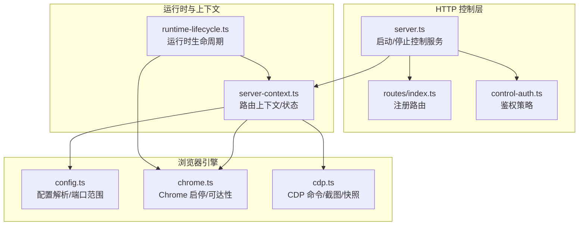
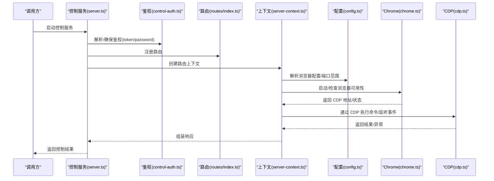
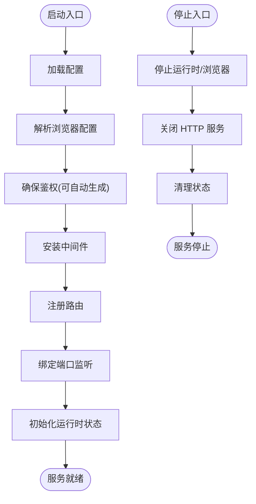
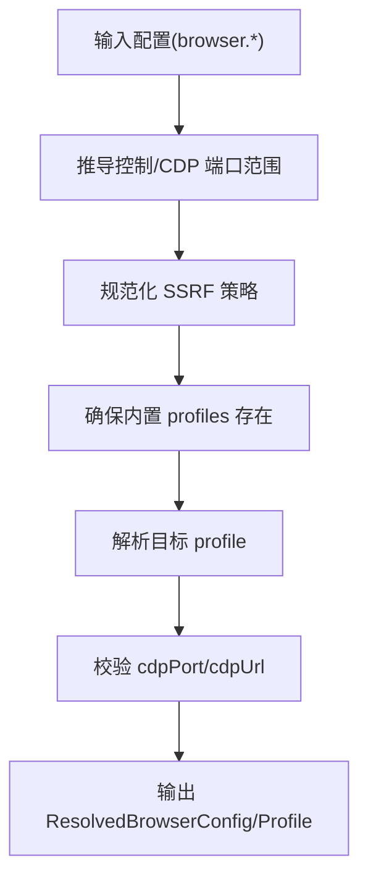
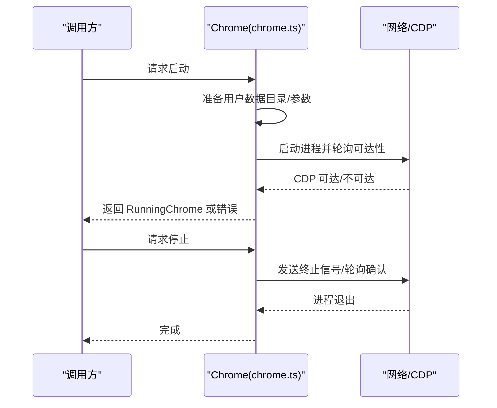
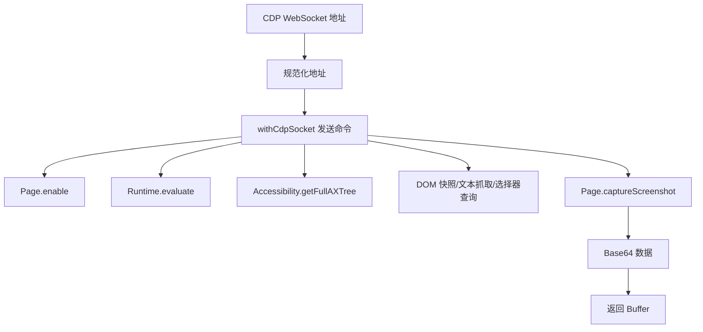
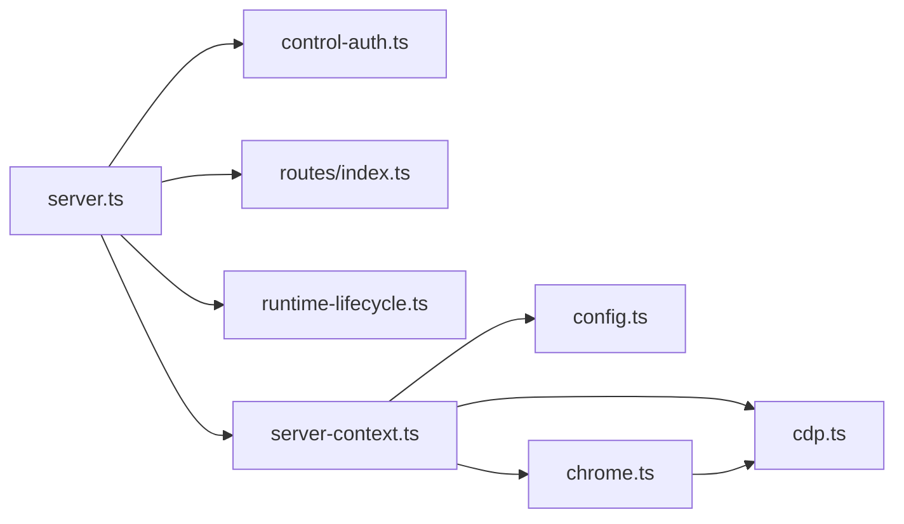

# 浏览器控制系统

<cite>
**本文引用的文件**
- [src/browser/server.ts](file://src/browser/server.ts)
- [src/browser/cdp.ts](file://src/browser/cdp.ts)
- [src/browser/chrome.ts](file://src/browser/chrome.ts)
- [src/browser/config.ts](file://src/browser/config.ts)
- [src/browser/routes/index.ts](file://src/browser/routes/index.ts)
- [src/browser/control-auth.ts](file://src/browser/control-auth.ts)
- [src/browser/runtime-lifecycle.ts](file://src/browser/runtime-lifecycle.ts)
- [src/browser/server-context.ts](file://src/browser/server-context.ts)
</cite>

## 目录
1. [简介](#简介)
2. [项目结构](#项目结构)
3. [核心组件](#核心组件)
4. [架构总览](#架构总览)
5. [详细组件分析](#详细组件分析)
6. [依赖关系分析](#依赖关系分析)
7. [性能考量](#性能考量)
8. [故障排除指南](#故障排除指南)
9. [结论](#结论)
10. [附录：API 接口文档](#附录api-接口文档)

## 简介
本技术文档面向 OpenClaw 的浏览器控制系统，系统以“浏览器控制 HTTP 服务 + CDP（Chrome DevTools Protocol）驱动 + 配置与运行时生命周期管理”为核心架构，提供对本地或远程 Chrome/Chromium 实例的统一控制能力，包括：
- 浏览器实例启动、停止与状态监控
- CDP 连接建立、命令发送与事件监听
- 配置文件管理（创建、删除、重置）
- 页面操作（标签页管理、页面快照、交互操作）
- 登录与认证流程
- 控制 API 的请求/响应规范与错误处理
- 实际使用示例与常见问题排查

## 项目结构
浏览器控制子系统位于 src/browser 目录，采用“按职责分层 + 按功能模块划分”的组织方式：
- 启动与路由：server.ts、routes/index.ts
- 认证与鉴权：control-auth.ts
- 配置解析与端口范围：config.ts
- 运行时生命周期：runtime-lifecycle.ts、server-context.ts
- Chrome/Chromium 启停与可达性探测：chrome.ts
- CDP 工具与页面操作：cdp.ts

图表来源
- [src/browser/server.ts:1-100](file://src/browser/server.ts#L1-L100)
- [src/browser/routes/index.ts:1-12](file://src/browser/routes/index.ts#L1-L12)
- [src/browser/control-auth.ts:1-99](file://src/browser/control-auth.ts#L1-L99)
- [src/browser/server-context.ts:1-242](file://src/browser/server-context.ts#L1-L242)
- [src/browser/runtime-lifecycle.ts:1-61](file://src/browser/runtime-lifecycle.ts#L1-L61)
- [src/browser/config.ts:1-366](file://src/browser/config.ts#L1-L366)
- [src/browser/chrome.ts:1-448](file://src/browser/chrome.ts#L1-L448)
- [src/browser/cdp.ts:1-486](file://src/browser/cdp.ts#L1-L486)

章节来源
- [src/browser/server.ts:1-100](file://src/browser/server.ts#L1-L100)
- [src/browser/routes/index.ts:1-12](file://src/browser/routes/index.ts#L1-L12)
- [src/browser/control-auth.ts:1-99](file://src/browser/control-auth.ts#L1-L99)
- [src/browser/server-context.ts:1-242](file://src/browser/server-context.ts#L1-L242)
- [src/browser/runtime-lifecycle.ts:1-61](file://src/browser/runtime-lifecycle.ts#L1-L61)
- [src/browser/config.ts:1-366](file://src/browser/config.ts#L1-L366)
- [src/browser/chrome.ts:1-448](file://src/browser/chrome.ts#L1-L448)
- [src/browser/cdp.ts:1-486](file://src/browser/cdp.ts#L1-L486)

## 核心组件
- 控制服务启动器：负责加载配置、安装中间件、注册路由并启动 HTTP 服务器，同时初始化运行时状态。
- 路由注册器：集中注册基础路由、标签页路由与代理类路由。
- 鉴权策略：从网关配置中解析 token/password，支持自动注入默认 token。
- 配置解析器：解析浏览器控制端口、CDP 端口范围、默认配置、SSRF 策略等。
- 运行时生命周期：负责扩展中继、启动/停止浏览器实例、关闭 HTTP 服务。
- Chrome 引擎：负责本地 Chrome 启动、可达性探测、WebSocket CDP 地址解析、优雅停止。
- CDP 工具集：封装截图、全页布局度量、Runtime.evaluate、无障碍树快照、DOM 快照、文本/HTML 抓取、选择器查询等。

章节来源
- [src/browser/server.ts:1-100](file://src/browser/server.ts#L1-L100)
- [src/browser/routes/index.ts:1-12](file://src/browser/routes/index.ts#L1-L12)
- [src/browser/control-auth.ts:1-99](file://src/browser/control-auth.ts#L1-L99)
- [src/browser/config.ts:1-366](file://src/browser/config.ts#L1-L366)
- [src/browser/runtime-lifecycle.ts:1-61](file://src/browser/runtime-lifecycle.ts#L1-L61)
- [src/browser/chrome.ts:1-448](file://src/browser/chrome.ts#L1-L448)
- [src/browser/cdp.ts:1-486](file://src/browser/cdp.ts#L1-L486)

## 架构总览
下图展示浏览器控制服务从启动到运行的关键交互路径，以及与 CDP 的协作关系。

图表来源
- [src/browser/server.ts:20-86](file://src/browser/server.ts#L20-L86)
- [src/browser/control-auth.ts:40-98](file://src/browser/control-auth.ts#L40-L98)
- [src/browser/routes/index.ts:7-11](file://src/browser/routes/index.ts#L7-L11)
- [src/browser/server-context.ts:118-241](file://src/browser/server-context.ts#L118-L241)
- [src/browser/config.ts:212-319](file://src/browser/config.ts#L212-L319)
- [src/browser/chrome.ts:238-415](file://src/browser/chrome.ts#L238-L415)
- [src/browser/cdp.ts:19-140](file://src/browser/cdp.ts#L19-L140)

## 详细组件分析

### 控制服务与路由
- 启动流程：加载配置 → 解析浏览器配置 → 鉴权准备（可自动生成 token）→ 安装通用与鉴权中间件 → 注册路由 → 监听本地回环端口 → 初始化运行时状态。
- 停止流程：停止已知浏览器配置对应的实例 → 关闭 HTTP 服务 → 清理运行时状态。

图表来源
- [src/browser/server.ts:20-86](file://src/browser/server.ts#L20-L86)
- [src/browser/runtime-lifecycle.ts:6-25](file://src/browser/runtime-lifecycle.ts#L6-L25)

章节来源
- [src/browser/server.ts:1-100](file://src/browser/server.ts#L1-L100)
- [src/browser/runtime-lifecycle.ts:1-61](file://src/browser/runtime-lifecycle.ts#L1-L61)

### 配置解析与端口管理
- 支持从配置派生控制端口与 CDP 端口范围；默认控制端口与 CDP 端口通常相邻。
- 自动补全默认“openclaw”与“chrome”内置配置，避免首次使用缺失配置。
- SSRF 策略可细粒度控制私有网络访问与允许主机白名单。
- 提供 profile 解析与校验，确保每个 profile 至少定义 cdpPort 或 cdpUrl。

图表来源
- [src/browser/config.ts:212-361](file://src/browser/config.ts#L212-L361)

章节来源
- [src/browser/config.ts:1-366](file://src/browser/config.ts#L1-L366)

### Chrome 启动与可达性
- 本地启动：解析可执行文件、准备用户数据目录、必要时先启动一次以生成默认偏好，再进行装饰与二次启动。
- 可达性探测：支持 HTTP /json/version 与直接 WebSocket 握手两种方式；超时与握手超时可配置。
- WebSocket CDP 地址规范化：针对容器化场景将 0.0.0.0/[::] 重写为外部主机与协议，并继承凭据与查询参数。
- 优雅停止：优先 SIGTERM，超时后强制 SIGKILL，并轮询确认进程退出。

图表来源
- [src/browser/chrome.ts:238-415](file://src/browser/chrome.ts#L238-L415)
- [src/browser/chrome.ts:417-448](file://src/browser/chrome.ts#L417-L448)
- [src/browser/cdp.ts:19-47](file://src/browser/cdp.ts#L19-L47)

章节来源
- [src/browser/chrome.ts:1-448](file://src/browser/chrome.ts#L1-L448)
- [src/browser/cdp.ts:1-486](file://src/browser/cdp.ts#L1-L486)

### CDP 控制机制
- 连接建立：支持 HTTP 发现与直接 WebSocket；规范化地址（主机、端口、协议、凭据、查询参数）。
- 命令发送：封装 Page.enable、Page.captureScreenshot、Runtime.enable/Runtime.evaluate、Accessibility.*、DOM 快照与文本抓取、选择器查询等常用操作。
- 事件监听：通过 withCdpSocket 封装 WebSocket 生命周期，确保消息收发与异常处理。
- 截图与全页布局：根据布局度量计算裁剪区域，支持 PNG/JPEG 与质量参数。
- 无障碍与 DOM 快照：限制节点数量与文本长度，便于下游处理。

图表来源
- [src/browser/cdp.ts:19-140](file://src/browser/cdp.ts#L19-L140)
- [src/browser/cdp.ts:159-187](file://src/browser/cdp.ts#L159-L187)
- [src/browser/cdp.ts:282-295](file://src/browser/cdp.ts#L282-L295)
- [src/browser/cdp.ts:297-364](file://src/browser/cdp.ts#L297-L364)
- [src/browser/cdp.ts:422-474](file://src/browser/cdp.ts#L422-L474)

章节来源
- [src/browser/cdp.ts:1-486](file://src/browser/cdp.ts#L1-L486)

### 配置文件管理（创建、删除、重置）
- 创建：首次启动时若用户数据目录缺失，会先启动一次以生成默认偏好，随后进行装饰（如设置启动页、清理策略等），再进行二次启动。
- 删除：通过“重置配置”操作，结合运行时状态与可达性探测，安全停止浏览器并清理用户数据目录。
- 重置：在上下文中提供 resetProfile，结合 stopRunningBrowser 与 isHttpReachable，确保资源回收与状态清理。

章节来源
- [src/browser/chrome.ts:314-351](file://src/browser/chrome.ts#L314-L351)
- [src/browser/server-context.ts:95-101](file://src/browser/server-context.ts#L95-L101)

### 页面操作（标签页管理、快照、交互）
- 标签页管理：提供 listTabs/openTab/focusTab/closeTab 等操作，内部通过 ensureTabAvailable 保证浏览器与目标标签可用。
- 页面快照：DOM 快照、无障碍树快照、文本/HTML 抓取、元素选择器查询，均通过 Runtime.evaluate 或 Accessibility/Page 命令实现。
- 交互操作：通过 Runtime.evaluate 执行表达式，支持 awaitPromise 与 returnByValue 控制返回值语义。

章节来源
- [src/browser/server-context.ts:72-93](file://src/browser/server-context.ts#L72-L93)
- [src/browser/cdp.ts:297-364](file://src/browser/cdp.ts#L297-L364)
- [src/browser/cdp.ts:422-474](file://src/browser/cdp.ts#L422-L474)
- [src/browser/cdp.ts:159-187](file://src/browser/cdp.ts#L159-L187)

### 登录与认证流程
- 鉴权来源：从网关配置解析 token/password；支持自动注入默认 token（受环境变量与模式约束）。
- 失败策略：鉴权引导失败且无显式 fallback 时，控制服务拒绝启动（fail-closed）。
- 中间件：安装通用中间件与鉴权中间件，确保所有路由受控。

章节来源
- [src/browser/control-auth.ts:11-26](file://src/browser/control-auth.ts#L11-L26)
- [src/browser/control-auth.ts:40-98](file://src/browser/control-auth.ts#L40-L98)
- [src/browser/server.ts:53-56](file://src/browser/server.ts#L53-L56)

## 依赖关系分析
- server.ts 依赖 control-auth.ts、routes/index.ts、server-context.ts、runtime-lifecycle.ts 与 config.ts。
- server-context.ts 依赖 config.ts、chrome.ts、cdp.ts 与若干上下文操作模块。
- chrome.ts 依赖 cdp.helpers 与 cdp.ts 的地址规范化工具。
- routes/index.ts 仅负责路由注册，不直接耦合业务逻辑。

图表来源
- [src/browser/server.ts:1-14](file://src/browser/server.ts#L1-L14)
- [src/browser/server-context.ts:1-23](file://src/browser/server-context.ts#L1-L23)
- [src/browser/chrome.ts:1-21](file://src/browser/chrome.ts#L1-L21)
- [src/browser/cdp.ts:1-17](file://src/browser/cdp.ts#L1-L17)
- [src/browser/routes/index.ts:1-5](file://src/browser/routes/index.ts#L1-L5)

章节来源
- [src/browser/server.ts:1-100](file://src/browser/server.ts#L1-L100)
- [src/browser/server-context.ts:1-242](file://src/browser/server-context.ts#L1-L242)
- [src/browser/chrome.ts:1-448](file://src/browser/chrome.ts#L1-L448)
- [src/browser/cdp.ts:1-486](file://src/browser/cdp.ts#L1-L486)
- [src/browser/routes/index.ts:1-12](file://src/browser/routes/index.ts#L1-L12)

## 性能考量
- CDP 命令批量化：尽量合并多次调用，减少往返开销（例如先 Page.enable 再批量截图/查询）。
- 截图质量与尺寸：合理设置截图格式与质量，避免过大的 JPEG 质量导致内存与带宽压力。
- DOM/无障碍快照限制：通过节点数与文本长度上限控制输出规模，避免大页面造成内存峰值。
- 启动与停止策略：优先 SIGTERM 并设置合理超时，避免频繁强制终止影响稳定性。
- 端口与并发：合理规划 CDP 端口范围与 profile 数量，避免端口冲突与资源争用。

## 故障排除指南
- 无法绑定端口：检查控制端口与 CDP 端口是否被占用，确认防火墙与权限。
- CDP 不可达：确认浏览器已启动且监听 127.0.0.1，检查容器/沙箱模式下的网络映射。
- 启动失败诊断：查看 Chrome 启动时收集的 stderr 片段，留意 Linux 下沙箱相关提示。
- 选择器/快照为空：确认页面已渲染完成，必要时增加等待或使用导航守卫策略。
- 鉴权失败：核对 token/password 来源与环境变量，确认 fail-closed 行为与自动注入策略。

章节来源
- [src/browser/server.ts:67-70](file://src/browser/server.ts#L67-L70)
- [src/browser/chrome.ts:379-396](file://src/browser/chrome.ts#L379-L396)
- [src/browser/cdp.ts:297-364](file://src/browser/cdp.ts#L297-L364)

## 结论
OpenClaw 的浏览器控制系统以清晰的分层设计实现了从配置解析、服务启动、鉴权控制到 CDP 驱动与页面操作的完整闭环。通过内置的 profile 管理、运行时生命周期与错误映射，系统在易用性与可靠性之间取得平衡。建议在生产环境中结合鉴权策略、SSRF 策略与合理的端口规划，确保稳定与安全。

## 附录：API 接口文档

### 通用约定
- 协议与地址：控制服务监听 127.0.0.1，端口由配置推导；CDP 默认通过 http://127.0.0.1:port/json/version 获取 WebSocket 地址。
- 鉴权：支持 token 与 password 两种模式，未配置时可自动注入默认 token。
- 错误映射：路由层将具体错误映射为标准 HTTP 状态码与消息，便于客户端处理。

章节来源
- [src/browser/server.ts:63-84](file://src/browser/server.ts#L63-L84)
- [src/browser/control-auth.ts:11-26](file://src/browser/control-auth.ts#L11-L26)
- [src/browser/server-context.ts:210-222](file://src/browser/server-context.ts#L210-L222)

### 路由注册与上下文
- 路由注册：集中于 routes/index.ts，分别注册基础、标签页与代理类路由。
- 上下文：createBrowserRouteContext 提供按 profile 的上下文工厂，支持列出配置、确保浏览器/标签可用、打开/聚焦/关闭标签、停止浏览器与重置配置。

章节来源
- [src/browser/routes/index.ts:7-11](file://src/browser/routes/index.ts#L7-L11)
- [src/browser/server-context.ts:118-241](file://src/browser/server-context.ts#L118-L241)

### CDP 命令与页面操作
- 截图：支持 PNG/JPEG，可选全页布局度量与裁剪。
- 评估：Runtime.evaluate，支持 awaitPromise 与 returnByValue。
- 快照：无障碍树与 DOM 快照，限制节点数与文本长度。
- 文本/HTML：按选择器或全文抓取，支持截断。
- 选择器查询：返回匹配元素的元信息与 HTML 片段。

章节来源
- [src/browser/cdp.ts:49-101](file://src/browser/cdp.ts#L49-L101)
- [src/browser/cdp.ts:159-187](file://src/browser/cdp.ts#L159-L187)
- [src/browser/cdp.ts:282-295](file://src/browser/cdp.ts#L282-L295)
- [src/browser/cdp.ts:297-364](file://src/browser/cdp.ts#L297-L364)
- [src/browser/cdp.ts:381-420](file://src/browser/cdp.ts#L381-L420)
- [src/browser/cdp.ts:422-474](file://src/browser/cdp.ts#L422-L474)

### 配置与运行时
- 配置解析：解析控制端口、CDP 端口范围、默认 profile、SSRF 策略、额外启动参数等。
- 运行时：创建/停止运行时状态，确保扩展中继与浏览器实例生命周期一致。

章节来源
- [src/browser/config.ts:212-319](file://src/browser/config.ts#L212-L319)
- [src/browser/runtime-lifecycle.ts:6-25](file://src/browser/runtime-lifecycle.ts#L6-L25)