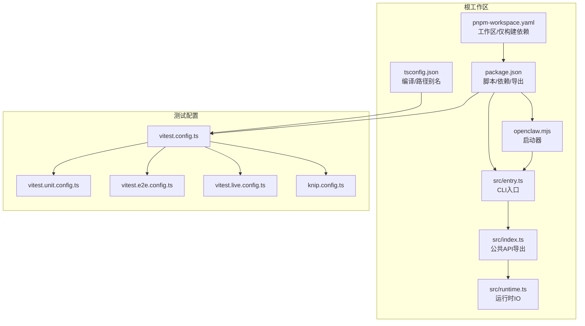
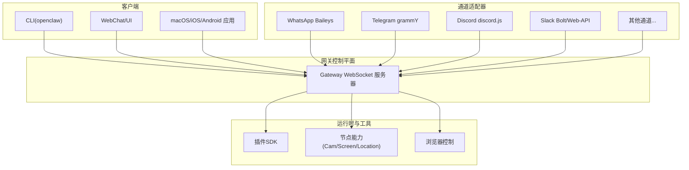
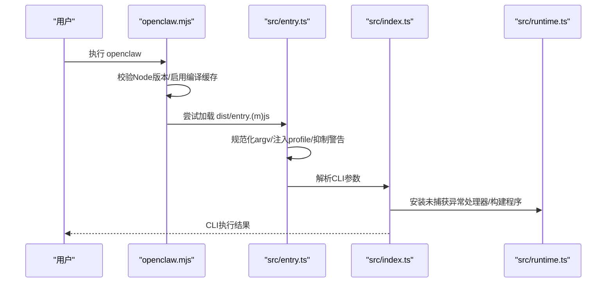
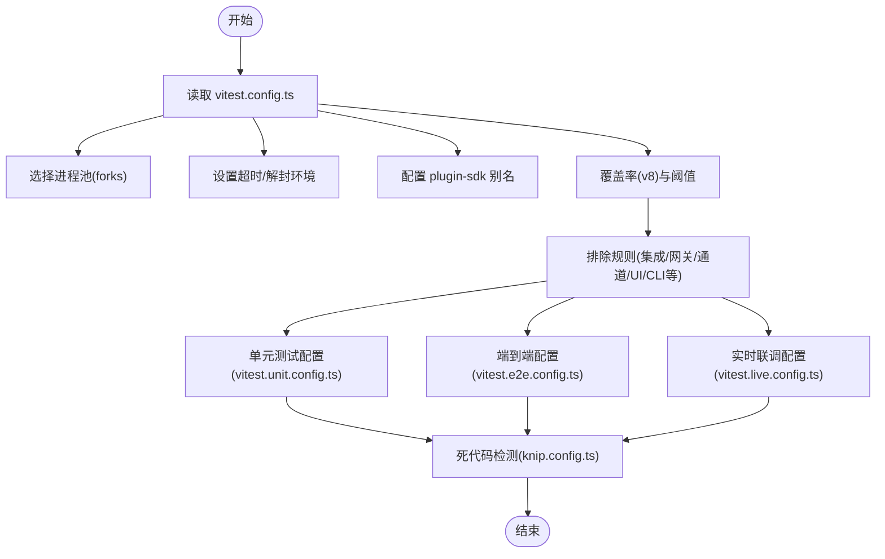
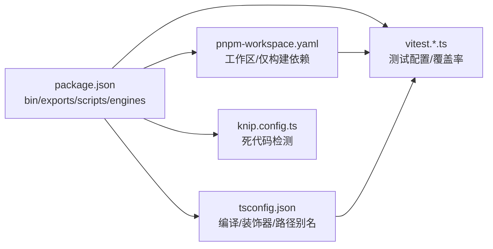

# 开发者指南

<cite>
**本文引用的文件**
- [README.md](file://README.md)
- [CONTRIBUTING.md](file://CONTRIBUTING.md)
- [package.json](file://package.json)
- [pnpm-workspace.yaml](file://pnpm-workspace.yaml)
- [tsconfig.json](file://tsconfig.json)
- [vitest.config.ts](file://vitest.config.ts)
- [vitest.unit.config.ts](file://vitest.unit.config.ts)
- [vitest.e2e.config.ts](file://vitest.e2e.config.ts)
- [vitest.live.config.ts](file://vitest.live.config.ts)
- [knip.config.ts](file://knip.config.ts)
- [src/index.ts](file://src/index.ts)
- [src/entry.ts](file://src/entry.ts)
- [openclaw.mjs](file://openclaw.mjs)
- [src/runtime.ts](file://src/runtime.ts)
- [src/gateway/server.ts](file://src/gateway/server.ts)
</cite>

## 目录
1. [简介](#简介)
2. [项目结构](#项目结构)
3. [核心组件](#核心组件)
4. [架构总览](#架构总览)
5. [详细组件分析](#详细组件分析)
6. [依赖分析](#依赖分析)
7. [性能考虑](#性能考虑)
8. [故障排查指南](#故障排查指南)
9. [结论](#结论)
10. [附录](#附录)

## 简介
OpenClaw 是一个可在本地设备上运行的个人 AI 助手平台，支持多通道消息接入（如 WhatsApp、Telegram、Discord、Slack、Google Chat、Signal、iMessage、BlueBubbles、IRC、Microsoft Teams、Matrix、Feishu、LINE、Mattermost、Nextcloud Talk、Nostr、Synology Chat、Tlon、Twitch、Zalo、Zalo Personal、WebChat 等），并提供语音唤醒与对话、Canvas 可视化工作区、浏览器控制、节点能力（相机、屏幕录制、位置等）、技能生态（ClawHub）以及远程网关控制等能力。项目采用多包工作区（pnpm workspace）组织，核心通过 CLI 启动网关（WebSocket 控制平面），同时提供 macOS/iOS/Android 节点应用与 WebChat 界面。

本开发者指南面向希望参与 OpenClaw 开发的工程师，覆盖代码结构与架构、开发环境搭建、测试策略、贡献流程、重构与演进策略、开发工具与脚本、常见问题排查以及质量保障与持续集成实践。

章节来源
- [README.md:1-560](file://README.md#L1-L560)

## 项目结构
OpenClaw 采用 monorepo 多包工作区布局，根目录包含核心 CLI、网关、通道适配器、插件 SDK、应用层（macOS/iOS/Android）、UI、文档与脚本等模块。包管理采用 pnpm workspace，并通过 overrides 与 onlyBuiltDependencies 控制依赖版本与原生扩展编译。

- 根级入口与运行时
  - openclaw.mjs：Node 版本校验与分发加载 dist/entry.(m)js 的启动器
  - src/entry.ts：CLI 入口与进程桥接、实验性警告抑制、快速帮助/版本路径
  - src/index.ts：导出 CLI 构建、会话存储、端口检查、错误处理等公共 API
  - src/runtime.ts：统一日志输出与退出行为，便于测试与终端状态恢复

- 包与工作区
  - package.json：定义 bin 命令、exports 导出、脚本命令、依赖与 devDependencies、engines（Node ≥22）
  - pnpm-workspace.yaml：声明工作区包范围与仅构建依赖列表
  - tsconfig.json：统一 TypeScript 编译选项与路径别名（含 plugin-sdk）

- 测试与覆盖率
  - vitest.config.ts：基础测试配置（池类型、超时、覆盖率排除/包含规则、别名映射）
  - vitest.unit.config.ts：单元测试专用配置（排除集成/网关/通道等）
  - vitest.e2e.config.ts：端到端测试配置（进程池、并发、显式包含 e2e 测试）
  - vitest.live.config.ts：实时联调测试配置（单工并发）
  - knip.config.ts：工作区死代码检测配置（根入口、忽略文件、各工作区项目）

图表来源
- [openclaw.mjs:1-90](file://openclaw.mjs#L1-L90)
- [src/entry.ts:1-195](file://src/entry.ts#L1-L195)
- [src/index.ts:1-94](file://src/index.ts#L1-L94)
- [src/runtime.ts:1-54](file://src/runtime.ts#L1-L54)
- [package.json:1-465](file://package.json#L1-L465)
- [pnpm-workspace.yaml:1-18](file://pnpm-workspace.yaml#L1-L18)
- [tsconfig.json:1-29](file://tsconfig.json#L1-L29)
- [vitest.config.ts:1-203](file://vitest.config.ts#L1-L203)
- [vitest.unit.config.ts:1-31](file://vitest.unit.config.ts#L1-L31)
- [vitest.e2e.config.ts:1-33](file://vitest.e2e.config.ts#L1-L33)
- [vitest.live.config.ts:1-17](file://vitest.live.config.ts#L1-L17)
- [knip.config.ts:1-106](file://knip.config.ts#L1-L106)

章节来源
- [package.json:1-465](file://package.json#L1-L465)
- [pnpm-workspace.yaml:1-18](file://pnpm-workspace.yaml#L1-L18)
- [tsconfig.json:1-29](file://tsconfig.json#L1-L29)
- [vitest.config.ts:1-203](file://vitest.config.ts#L1-L203)
- [vitest.unit.config.ts:1-31](file://vitest.unit.config.ts#L1-L31)
- [vitest.e2e.config.ts:1-33](file://vitest.e2e.config.ts#L1-L33)
- [vitest.live.config.ts:1-17](file://vitest.live.config.ts#L1-L17)
- [knip.config.ts:1-106](file://knip.config.ts#L1-L106)

## 核心组件
- CLI 与启动链路
  - openclaw.mjs：确保 Node 版本满足要求，尝试加载 dist/entry.(m)js，缺失则报错
  - src/entry.ts：处理 argv 规范化、实验性警告抑制、profile 注入、快速帮助/版本路径、spawn 子进程桥接
  - src/index.ts：构建 CLI 程序、加载 dotenv、标准化环境、端口可用性检查、未捕获异常处理、导出公共 API
  - src/runtime.ts：统一日志与退出，避免测试污染与终端状态残留

- 网关服务
  - src/gateway/server.ts：导出网关服务器类型与工厂函数，提供测试用重置模型缓存能力

- 插件 SDK 与别名
  - package.json exports：为 plugin-sdk 子路径提供默认/类型导出
  - tsconfig.json：为 openclaw/plugin-sdk/* 配置路径别名，便于扩展开发

章节来源
- [openclaw.mjs:1-90](file://openclaw.mjs#L1-L90)
- [src/entry.ts:1-195](file://src/entry.ts#L1-L195)
- [src/index.ts:1-94](file://src/index.ts#L1-L94)
- [src/runtime.ts:1-54](file://src/runtime.ts#L1-L54)
- [src/gateway/server.ts:1-4](file://src/gateway/server.ts#L1-L4)
- [package.json:37-216](file://package.json#L37-L216)
- [tsconfig.json:20-24](file://tsconfig.json#L20-L24)

## 架构总览
OpenClaw 的核心是“网关 WebSocket 控制平面”，所有客户端（CLI、WebChat、桌面应用、移动端节点）通过该平面进行连接与交互；通道适配器负责对接不同 IM 平台；插件 SDK 提供扩展能力；UI 由 Vite/Vitest 驱动；测试体系覆盖单元、端到端与实时联调。

图表来源
- [README.md:185-238](file://README.md#L185-L238)
- [README.md:415-441](file://README.md#L415-L441)

章节来源
- [README.md:185-238](file://README.md#L185-L238)
- [README.md:415-441](file://README.md#L415-L441)

## 详细组件分析

### CLI 启动与运行时
- 版本前置校验与启动器
  - openclaw.mjs 在启动前校验 Node 版本，启用模块编译缓存，按顺序尝试加载 dist/entry.(m)js
- 进程与警告处理
  - src/entry.ts：规范化 argv、注入 CLI profile、抑制实验性警告、快速帮助/版本路径、spawn 子进程桥接
- CLI 主流程
  - src/index.ts：加载 dotenv、标准化环境、端口可用性检查、安装未捕获异常处理器、构建并解析 CLI
- 运行时 IO
  - src/runtime.ts：统一日志输出、退出时恢复终端状态，支持测试场景下的非退出式退出

图表来源
- [openclaw.mjs:1-90](file://openclaw.mjs#L1-L90)
- [src/entry.ts:1-195](file://src/entry.ts#L1-L195)
- [src/index.ts:1-94](file://src/index.ts#L1-L94)
- [src/runtime.ts:1-54](file://src/runtime.ts#L1-L54)

章节来源
- [openclaw.mjs:1-90](file://openclaw.mjs#L1-L90)
- [src/entry.ts:1-195](file://src/entry.ts#L1-L195)
- [src/index.ts:1-94](file://src/index.ts#L1-L94)
- [src/runtime.ts:1-54](file://src/runtime.ts#L1-L54)

### 网关服务器接口
- 导出类型与工厂
  - src/gateway/server.ts：导出 GatewayServer 类型、GatewayServerOptions、startGatewayServer 工厂方法，以及测试用模型目录缓存重置函数

章节来源
- [src/gateway/server.ts:1-4](file://src/gateway/server.ts#L1-L4)

### 测试配置与策略
- 基础配置（vitest.config.ts）
  - 池类型：forks；CPU 自适应最大并发；超时与环境解封；别名映射 openclaw/plugin-sdk/*
  - 覆盖率：v8 提供者，阈值 70%/70%/55%/70%，锚定 src/，排除大量集成/网关/通道/UI/CLI 等
- 单元测试（vitest.unit.config.ts）
  - 在基础配置基础上进一步排除网关、通道、Web、浏览器、Line、Agents、Auto-Reply、Commands 等
- 端到端测试（vitest.e2e.config.ts）
  - 强制 fork 池以避免 VM 上下文泄漏；可由环境变量控制并发；显式包含 e2e 测试
- 实时联调测试（vitest.live.config.ts）
  - 单工并发，显式包含 *.live.test.ts
- 死代码检测（knip.config.ts）
  - 根入口、忽略文件、工作区项目扫描、扩展工作区独立入口

图表来源
- [vitest.config.ts:1-203](file://vitest.config.ts#L1-L203)
- [vitest.unit.config.ts:1-31](file://vitest.unit.config.ts#L1-L31)
- [vitest.e2e.config.ts:1-33](file://vitest.e2e.config.ts#L1-L33)
- [vitest.live.config.ts:1-17](file://vitest.live.config.ts#L1-L17)
- [knip.config.ts:1-106](file://knip.config.ts#L1-L106)

章节来源
- [vitest.config.ts:1-203](file://vitest.config.ts#L1-L203)
- [vitest.unit.config.ts:1-31](file://vitest.unit.config.ts#L1-L31)
- [vitest.e2e.config.ts:1-33](file://vitest.e2e.config.ts#L1-L33)
- [vitest.live.config.ts:1-17](file://vitest.live.config.ts#L1-L17)
- [knip.config.ts:1-106](file://knip.config.ts#L1-L106)

## 依赖分析
- 包管理与工作区
  - pnpm-workspace.yaml：声明根、ui、packages/*、extensions/* 为工作区包；onlyBuiltDependencies 指定需要原生编译的依赖
  - package.json：bin 指向 openclaw.mjs；exports 为 plugin-sdk 子路径提供默认/类型导出；engines 要求 Node ≥22；脚本涵盖构建、格式化、检查、测试、打包、协议生成等
- TypeScript 配置
  - tsconfig.json：开启 experimentalDecorators、useDefineForClassFields=false；paths 映射 openclaw/plugin-sdk/*，便于扩展开发
- 测试与质量工具
  - vitest.*：统一测试配置与覆盖率策略
  - knip：工作区死代码检测，结合 ignoreFiles 与 workspaces 配置

图表来源
- [package.json:1-465](file://package.json#L1-L465)
- [pnpm-workspace.yaml:1-18](file://pnpm-workspace.yaml#L1-L18)
- [tsconfig.json:1-29](file://tsconfig.json#L1-L29)
- [vitest.config.ts:1-203](file://vitest.config.ts#L1-L203)
- [knip.config.ts:1-106](file://knip.config.ts#L1-L106)

章节来源
- [package.json:1-465](file://package.json#L1-L465)
- [pnpm-workspace.yaml:1-18](file://pnpm-workspace.yaml#L1-L18)
- [tsconfig.json:1-29](file://tsconfig.json#L1-L29)
- [vitest.config.ts:1-203](file://vitest.config.ts#L1-L203)
- [knip.config.ts:1-106](file://knip.config.ts#L1-L106)

## 性能考虑
- 启动与运行时
  - openclaw.mjs 与 src/entry.ts 中启用模块编译缓存与实验性警告抑制，减少启动开销与噪音
  - src/runtime.ts 在日志输出前后清理进度行，避免 UI 干扰
- 测试并发与隔离
  - vitest.e2e.config.ts 使用 fork 池避免 VM 上下文泄漏；unit 配置排除大量集成面，降低测试成本
- 依赖与原生扩展
  - pnpm-workspace.yaml 的 onlyBuiltDependencies 限定原生扩展编译范围，避免不必要的构建时间

章节来源
- [openclaw.mjs:1-90](file://openclaw.mjs#L1-L90)
- [src/entry.ts:1-195](file://src/entry.ts#L1-L195)
- [src/runtime.ts:1-54](file://src/runtime.ts#L1-L54)
- [vitest.e2e.config.ts:1-33](file://vitest.e2e.config.ts#L1-L33)
- [pnpm-workspace.yaml:7-17](file://pnpm-workspace.yaml#L7-L17)

## 故障排查指南
- CLI 启动失败
  - 检查 Node 版本是否满足 engines 要求（≥22）
  - 查看 openclaw.mjs 的版本校验输出与 dist/entry.(m)js 是否存在
- 端口占用
  - 使用 src/index.ts 中的端口检查与错误处理逻辑，确认端口被占用或归属不明时的提示
- 实验性警告与进程重启
  - src/entry.ts 对实验性警告进行抑制并可能自动 respawn；若禁用 respawn 或已抑制，需检查 NODE_OPTIONS 与 execArgv
- 日志与退出
  - src/runtime.ts 统一日志输出并在退出时恢复终端状态；测试中可通过 createNonExitingRuntime() 验证退出行为
- 测试相关
  - 单元测试排除了大量集成面；端到端测试使用 fork 池；覆盖率仅统计实际执行文件，避免过度排除导致阈值漂移

章节来源
- [openclaw.mjs:1-90](file://openclaw.mjs#L1-L90)
- [src/index.ts:1-94](file://src/index.ts#L1-L94)
- [src/entry.ts:1-195](file://src/entry.ts#L1-L195)
- [src/runtime.ts:1-54](file://src/runtime.ts#L1-L54)
- [vitest.config.ts:71-202](file://vitest.config.ts#L71-L202)

## 结论
OpenClaw 通过清晰的 CLI 启动链路、统一的网关控制平面与丰富的通道适配器，构建了可扩展的个人 AI 助手平台。其多包工作区与严格的测试/质量配置（vitest、knip、lint/format）确保了在复杂功能迭代中的稳定性与可维护性。开发者可基于本文档快速搭建开发环境、理解模块职责与依赖关系、编写与运行各类测试，并遵循贡献流程与规范推进高质量交付。

## 附录

### 开发环境搭建
- 运行时与包管理
  - Node ≥22；推荐使用 pnpm（package.json 指定 engines 与 packageManager）
- 安装与构建
  - pnpm install；pnpm build；pnpm ui:build（首次自动安装 UI 依赖）
- 开发循环
  - pnpm gateway:watch（TypeScript 文件变更自动重载）
- 运行与调试
  - pnpm openclaw onboard --install-daemon；pnpm gateway:dev 或 pnpm start

章节来源
- [README.md:92-111](file://README.md#L92-L111)
- [package.json:217-338](file://package.json#L217-L338)

### 测试策略与框架
- 单元测试
  - vitest.unit.config.ts：排除网关/通道/Web/浏览器/Line/Agents/Auto-Reply/Commands 等
- 端到端测试
  - vitest.e2e.config.ts：fork 池、可配置并发、显式包含 e2e 测试
- 实时联调测试
  - vitest.live.config.ts：单工并发，显式包含 *.live.test.ts
- 覆盖率
  - vitest.config.ts：v8 提供者，阈值 70%/70%/55%/70%，仅统计 src/ 下实际执行文件
- 死代码检测
  - knip.config.ts：根入口、忽略文件、工作区项目扫描

章节来源
- [vitest.unit.config.ts:1-31](file://vitest.unit.config.ts#L1-L31)
- [vitest.e2e.config.ts:1-33](file://vitest.e2e.config.ts#L1-L33)
- [vitest.live.config.ts:1-17](file://vitest.live.config.ts#L1-L17)
- [vitest.config.ts:101-202](file://vitest.config.ts#L101-L202)
- [knip.config.ts:1-106](file://knip.config.ts#L1-L106)

### 代码贡献流程与规范
- 贡献方式
  - 小问题直接提 PR；新特性/架构变更先发起讨论或在 Discord 提问
- 提交前检查
  - 本地实例验证；pnpm build && pnpm check && pnpm test；Codex review（可选但建议）
  - PR 保持聚焦、描述“做了什么/为什么”、附带问题/修复截图（UI/视觉变更）
- 代码风格与装饰器
  - Control UI 使用传统装饰器（legacy decorators），避免切换至标准 accessor 字段除非同步更新 UI 构建工具链
- 安全披露
  - 漏洞报告按组件分别提交至对应仓库或安全邮箱

章节来源
- [CONTRIBUTING.md:79-136](file://CONTRIBUTING.md#L79-L136)
- [CONTRIBUTING.md:169-194](file://CONTRIBUTING.md#L169-L194)

### 重构与演进策略
- 架构改进
  - 保持 CLI 启动链路稳定（openclaw.mjs → src/entry.ts → src/index.ts），避免重复启动
  - 网关服务器接口通过 src/gateway/server.ts 明确导出，便于替换实现
- 性能优化
  - 启用模块编译缓存与实验性警告抑制；合理拆分测试套件，减少集成面测试成本
- 兼容性维护
  - 严格遵守 engines 要求；对 plugin-sdk 的路径别名与 exports 保持向后兼容

章节来源
- [openclaw.mjs:1-90](file://openclaw.mjs#L1-L90)
- [src/entry.ts:1-195](file://src/entry.ts#L1-L195)
- [src/index.ts:1-94](file://src/index.ts#L1-L94)
- [src/gateway/server.ts:1-4](file://src/gateway/server.ts#L1-L4)
- [package.json:422-425](file://package.json#L422-L425)
- [tsconfig.json:20-24](file://tsconfig.json#L20-L24)

### 开发工具与实用脚本
- 构建与打包
  - pnpm build：构建插件 SDK d.ts、写入构建信息与 CLI 兼容元数据、复制 Canvas A2UI 资源
  - pnpm build:docker：面向容器构建
- 质量检查
  - pnpm check：格式化检查、文档检查、lint（含 Swift）、重复代码检测、死代码报告
  - pnpm check:docs：文档格式与链接检查
- 测试
  - pnpm test：并行测试；pnpm test:all：全量测试（含 e2e/live/docker）
  - pnpm test:coverage：生成覆盖率报告
- 平台与应用
  - pnpm ios:*、android:*、mac:*：iOS/Android/macOS 相关构建与运行脚本
- 协议与文档
  - pnpm protocol:gen/protocol:gen:swift：生成跨语言协议模型
  - pnpm docs:*：文档开发与链接检查

章节来源
- [package.json:217-338](file://package.json#L217-L338)

### 常见开发问题与调试技巧
- Node 版本不满足要求
  - 依据 openclaw.mjs 输出提示使用 nvm 安装/切换版本
- 端口占用
  - 使用 src/index.ts 的端口检查与错误处理输出定位占用者
- CLI 帮助/版本快速路径
  - src/entry.ts 支持快速显示帮助与版本，避免完整初始化
- 测试隔离与并发
  - e2e 使用 fork 池；unit 排除集成面；覆盖率仅统计实际执行文件

章节来源
- [openclaw.mjs:21-34](file://openclaw.mjs#L21-L34)
- [src/index.ts:25-29](file://src/index.ts#L25-L29)
- [src/entry.ts:128-164](file://src/entry.ts#L128-L164)
- [vitest.e2e.config.ts:24-26](file://vitest.e2e.config.ts#L24-L26)
- [vitest.config.ts:101-115](file://vitest.config.ts#L101-L115)

### 质量保证体系与持续集成
- 质量工具链
  - 格式化（oxfmt）、lint（oxlint）、Swift 格式/lint、文档检查、重复代码检测（jscpd）、死代码检测（knip）
- 测试矩阵
  - 单元测试、端到端测试、实时联调测试、Docker 场景测试（安装/网关/插件/网络等）
- 覆盖率策略
  - 仅统计实际执行文件，避免因嵌套 src/ 导致误计数；设定合理阈值

章节来源
- [package.json:231-338](file://package.json#L231-L338)
- [vitest.config.ts:101-202](file://vitest.config.ts#L101-L202)
- [knip.config.ts:1-106](file://knip.config.ts#L1-L106)