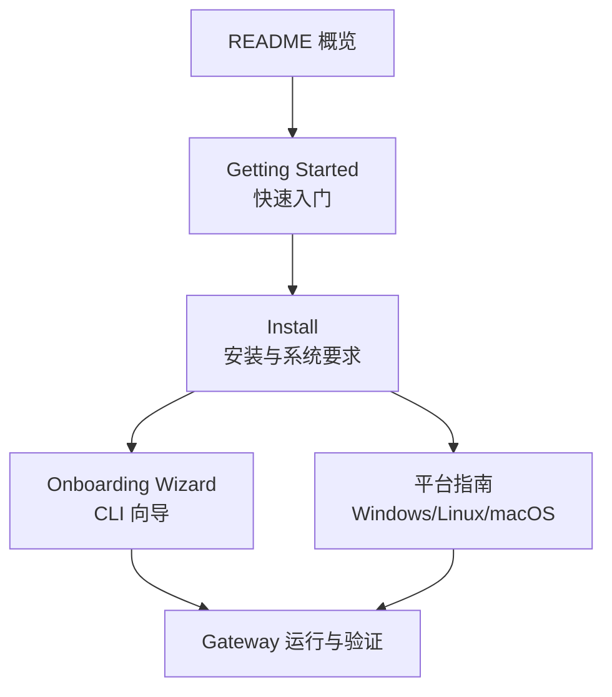
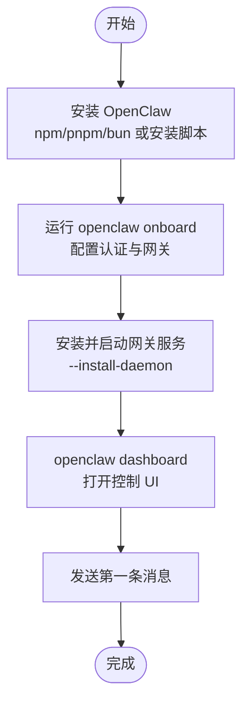
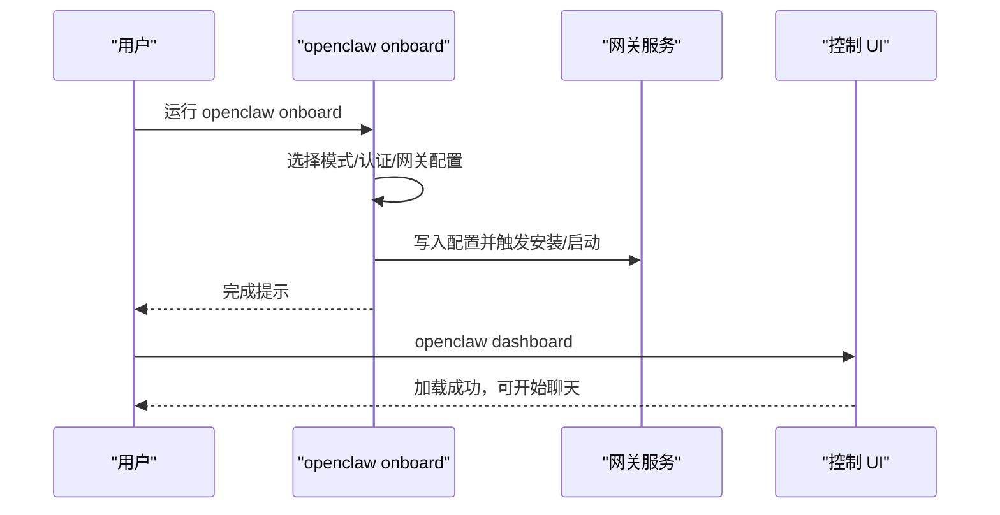
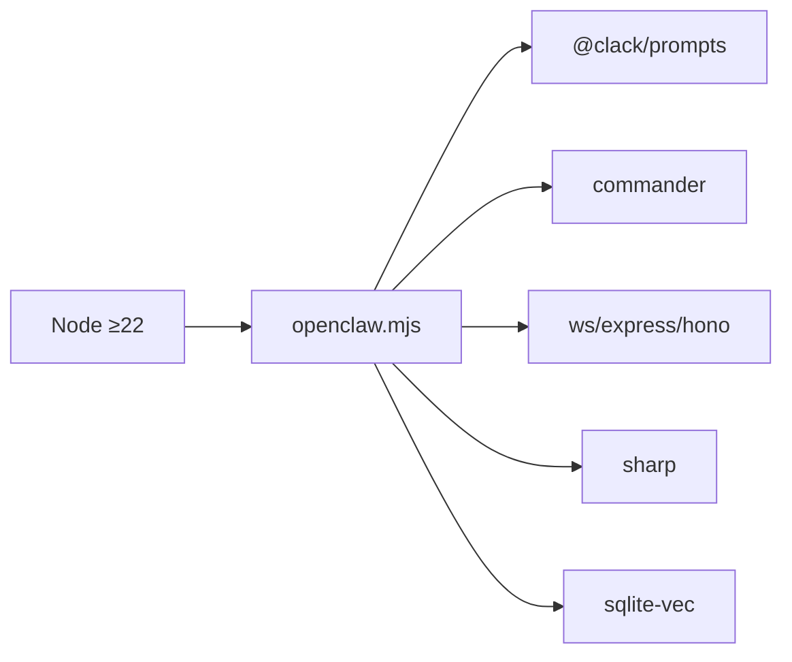

# 快速开始

<cite>
**本文引用的文件**
- [README.md](file://README.md)
- [docs/start/getting-started.md](file://docs/start/getting-started.md)
- [docs/install/index.md](file://docs/install/index.md)
- [docs/platforms/windows.md](file://docs/platforms/windows.md)
- [docs/platforms/linux.md](file://docs/platforms/linux.md)
- [docs/platforms/macos.md](file://docs/platforms/macos.md)
- [docs/cli/onboard.md](file://docs/cli/onboard.md)
- [docs/start/onboarding.md](file://docs/start/onboarding.md)
- [package.json](file://package.json)
</cite>

## 目录
1. [简介](#简介)
2. [项目结构](#项目结构)
3. [核心组件](#核心组件)
4. [架构总览](#架构总览)
5. [详细组件分析](#详细组件分析)
6. [依赖分析](#依赖分析)
7. [性能考虑](#性能考虑)
8. [故障排查指南](#故障排查指南)
9. [结论](#结论)
10. [附录](#附录)

## 简介
本指南面向首次接触 OpenClaw 的用户，目标是在最短时间内完成安装、初始化配置与基础验证，从而运行第一个聊天会话。内容覆盖系统要求、多种安装方式（npm、pnpm、bun）、跨平台（macOS、Linux、Windows WSL2）的具体步骤、onboarding wizard 的使用方法与工作流、初始设置后的验证步骤以及常见问题的解决方案。

## 项目结构
- 安装与入门相关文档集中在 docs 目录：
  - Getting Started：从零到第一句聊天的最快路径
  - Install：系统要求、安装方法、更新与卸载
  - 平台指南：Windows（WSL2）、Linux、macOS
  - CLI 参考：onboard（交互式向导）
  - macOS 应用：权限与本地/远程模式
- 根目录 README 提供总体概览与推荐路径
- 包管理器与脚本定义在 package.json 中

**章节来源**
- [README.md:28-81](file://README.md#L28-L81)
- [docs/start/getting-started.md:9-77](file://docs/start/getting-started.md#L9-L77)

## 核心组件
- CLI 命令
  - openclaw onboard：交互式向导，配置网关、认证、可选渠道与技能
  - openclaw gateway：启动/安装网关服务
  - openclaw dashboard：打开控制 UI
  - openclaw doctor：诊断配置问题
- 系统要求
  - Node ≥22
  - macOS、Linux 或 Windows（强烈建议通过 WSL2）

**章节来源**
- [README.md:50-81](file://README.md#L50-L81)
- [docs/install/index.md:14-22](file://docs/install/index.md#L14-L22)
- [docs/platforms/windows.md:11-15](file://docs/platforms/windows.md#L11-L15)

## 架构总览
下图展示从安装到首次聊天的关键路径：安装 → 启动向导 → 配置网关 → 打开控制 UI → 发送第一条消息。

**图表来源**
- [docs/start/getting-started.md:28-77](file://docs/start/getting-started.md#L28-L77)
- [docs/install/index.md:24-70](file://docs/install/index.md#L24-L70)

**章节来源**
- [docs/start/getting-started.md:28-77](file://docs/start/getting-started.md#L28-L77)
- [docs/install/index.md:24-70](file://docs/install/index.md#L24-L70)

## 详细组件分析

### 系统要求与运行时
- Node 版本：≥22
- 推荐安装方式：使用安装脚本（自动检测/安装 Node 并引导 onboarding）
- Windows 用户：强烈建议通过 WSL2 运行

**章节来源**
- [docs/install/index.md:14-22](file://docs/install/index.md#L14-L22)
- [docs/platforms/windows.md:11-15](file://docs/platforms/windows.md#L11-L15)

### 多种安装方式对比（npm、pnpm、bun）
- npm
  - 全局安装：npm install -g openclaw@latest
  - 安装后运行向导：openclaw onboard --install-daemon
  - 注意：若系统已全局安装 libvips（如 macOS Homebrew），可能出现 sharp 构建错误，可通过环境变量强制使用预编译二进制或安装构建工具解决
- pnpm
  - 全局安装：pnpm add -g openclaw@latest
  - 首次安装出现“忽略构建脚本”警告后，需执行 pnpm approve-builds -g 显式批准包的构建
- bun
  - 作为 CLI 运行时使用（仅 CLI，不推荐用于 Gateway）

**章节来源**
- [docs/install/index.md:72-103](file://docs/install/index.md#L72-L103)
- [docs/install/index.md:158-161](file://docs/install/index.md#L158-L161)

### 跨平台安装与注意事项

#### macOS
- 安装脚本或 npm/pnpm 安装后，可选择安装全局 CLI（bun 不推荐用于 Gateway）
- macOS 应用负责权限管理、菜单栏状态、本地/远程模式下的网关连接与节点能力暴露
- 若使用 Nix 模式，需显式设置 OPENCLAW_NIX_MODE=1，并在 defaults 中启用 Nix 模式

**章节来源**
- [docs/platforms/macos.md:24](file://docs/platforms/macos.md#L24)
- [docs/platforms/macos.md:139-145](file://docs/platforms/macos.md#L139-L145)
- [docs/install/nix.md:46-62](file://docs/install/nix.md#L46-L62)

#### Linux
- 推荐使用 Node 作为运行时；Bun 不推荐用于 Gateway
- 一键安装脚本或 npm 安装后，使用 openclaw onboard --install-daemon 安装并启动服务
- 可使用 systemd 用户服务或系统服务（共享/常驻服务器场景）

**章节来源**
- [docs/platforms/linux.md:11-14](file://docs/platforms/linux.md#L11-L14)
- [docs/platforms/linux.md:37-63](file://docs/platforms/linux.md#L37-L63)

#### Windows（WSL2）
- 强烈建议通过 WSL2（Ubuntu）安装与运行
- 在 WSL2 内部执行 openclaw onboard --install-daemon 安装服务
- 支持开机自启链路：WSL 自启动 → linger 用户服务 → 网关服务
- 如需从其他机器访问 WSL 内的服务，可使用端口转发（portproxy）

**章节来源**
- [docs/platforms/windows.md:11-15](file://docs/platforms/windows.md#L11-L15)
- [docs/platforms/windows.md:30-56](file://docs/platforms/windows.md#L30-L56)
- [docs/platforms/windows.md:58-100](file://docs/platforms/windows.md#L58-L100)
- [docs/platforms/windows.md:102-146](file://docs/platforms/windows.md#L102-L146)
- [docs/platforms/windows.md:185-198](file://docs/platforms/windows.md#L185-L198)

### onboarding wizard 使用指南
- 启动方式
  - openclaw onboard（交互式）
  - openclaw onboard --flow quickstart（最小化提示）
  - openclaw onboard --flow manual（完整交互）
  - openclaw onboard --mode remote --remote-url wss://gateway-host:18789（远程模式）
- 非交互模式
  - 支持指定认证方案（如自定义 API Key、Z.AI、Mistral 等）
  - 支持以 SecretRef 存储密钥，避免明文写入配置
  - 支持指定网关认证令牌（明文或 SecretRef）
- 与 macOS 应用的配合
  - macOS 首次运行会引导本地/远程模式选择、权限授予、CLI 安装等
  - 应用可作为网关代理，本地/远程模式下分别管理服务与节点能力

**图表来源**
- [docs/cli/onboard.md:20-27](file://docs/cli/onboard.md#L20-L27)
- [docs/start/getting-started.md:55-77](file://docs/start/getting-started.md#L55-L77)

**章节来源**
- [docs/cli/onboard.md:8-139](file://docs/cli/onboard.md#L8-L139)
- [docs/start/onboarding.md:17-92](file://docs/start/onboarding.md#L17-L92)

### 初始设置后的验证步骤
- openclaw doctor：检查配置问题
- openclaw status：查看网关状态
- openclaw dashboard：打开浏览器 UI
- 若通过 SSH 访问远程网关，确保端口转发与隧道正常

**章节来源**
- [docs/install/index.md:163-171](file://docs/install/index.md#L163-L171)
- [docs/platforms/windows.md:102-146](file://docs/platforms/windows.md#L102-L146)

### 常见问题与解决方案
- openclaw 命令找不到
  - 检查 Node/npm 版本与 npm prefix -g 输出是否在 PATH 中
  - 在 shell 启动文件中追加 npm prefix -g 对应路径
- Windows WSL2 开机自启
  - 在 PowerShell 中创建计划任务以启动 WSL
  - 在 WSL 内启用 linger 用户服务
- Linux systemd 服务
  - 使用 systemctl --user 管理用户服务；共享/常驻服务器使用系统服务
- macOS Nix 模式
  - 设置 OPENCLAW_NIX_MODE=1 或通过 defaults 启用 Nix 模式，避免自动安装与自升级流程

**章节来源**
- [docs/install/index.md:181-204](file://docs/install/index.md#L181-L204)
- [docs/platforms/windows.md:58-100](file://docs/platforms/windows.md#L58-L100)
- [docs/platforms/linux.md:65-94](file://docs/platforms/linux.md#L65-L94)
- [docs/install/nix.md:46-81](file://docs/install/nix.md#L46-L81)

## 依赖分析
- 运行时与工具链
  - Node ≥22（引擎要求）
  - 包管理器：pnpm（开发与构建首选）
  - CLI 入口：openclaw.mjs
- 关键依赖（示例）
  - @mariozechner/pi-agent-core：代理内核
  - @clack/prompts：交互式向导
  - commander：命令行参数解析
  - ws、express、hono：网络与服务框架
  - sharp：图像处理
  - sqlite-vec：向量数据库支持

**图表来源**
- [package.json:422-424](file://package.json#L422-L424)
- [package.json:16-18](file://package.json#L16-L18)
- [package.json:340-395](file://package.json#L340-L395)

**章节来源**
- [package.json:422-424](file://package.json#L422-L424)
- [package.json:16-18](file://package.json#L16-L18)
- [package.json:340-395](file://package.json#L340-L395)

## 性能考虑
- 运行时选择
  - Linux 推荐 Node；Bun 不推荐用于 Gateway（存在兼容性问题）
  - Windows 建议 WSL2，以获得更一致的 Linux 工具链与二进制兼容性
- 服务安装
  - 使用 --install-daemon 安装用户服务，确保开机自启与后台稳定运行
- 远程访问
  - 通过 SSH 隧道或 Tailscale 实现安全访问，避免直接暴露网关端口

[本节为通用指导，无需具体文件引用]

## 故障排查指南
- 命令不可用
  - 检查 PATH 是否包含 npm prefix -g 输出的路径
  - 在 zsh/bash 中重新加载 shell 或使用 hash -r/rehash
- Sharp 构建失败（macOS Homebrew）
  - 设置 SHARP_IGNORE_GLOBAL_LIBVIPS=1 或安装 node-gyp
- Windows WSL2 端口转发
  - 使用 netsh interface portproxy 添加规则，并允许防火墙
- Linux systemd 服务未启动
  - 检查用户服务状态与日志，必要时切换到系统服务

**章节来源**
- [docs/install/index.md:181-204](file://docs/install/index.md#L181-L204)
- [docs/platforms/windows.md:102-146](file://docs/platforms/windows.md#L102-L146)
- [docs/platforms/linux.md:65-94](file://docs/platforms/linux.md#L65-L94)

## 结论
通过安装脚本或 npm/pnpm/bun 安装 OpenClaw，使用 openclaw onboard 完成认证与网关配置，并借助 openclaw dashboard 进行首次聊天验证，即可在多平台上快速落地。遇到问题时，优先检查 PATH、WSL2 端口转发与 systemd 服务状态，必要时参考各平台指南与 CLI 参考文档。

[本节为总结，无需具体文件引用]

## 附录

### 快速命令清单
- 安装（推荐）：curl -fsSL https://openclaw.ai/install.sh | bash
- 启动向导并安装服务：openclaw onboard --install-daemon
- 查看状态：openclaw gateway status
- 打开控制 UI：openclaw dashboard
- 诊断配置：openclaw doctor

**章节来源**
- [docs/start/getting-started.md:28-77](file://docs/start/getting-started.md#L28-L77)
- [docs/install/index.md:163-171](file://docs/install/index.md#L163-L171)