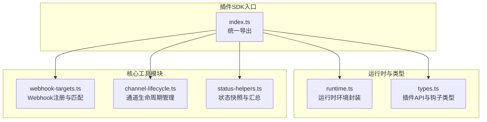
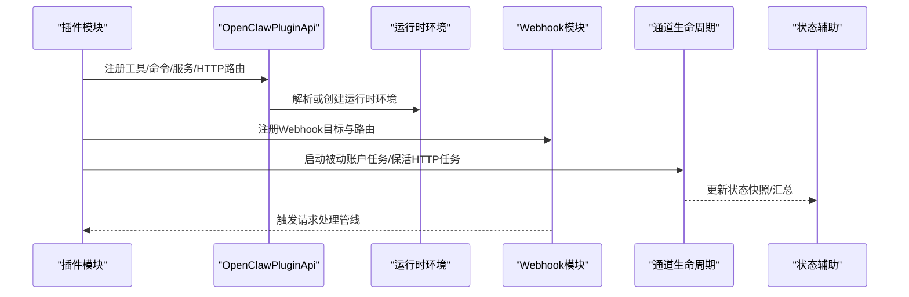
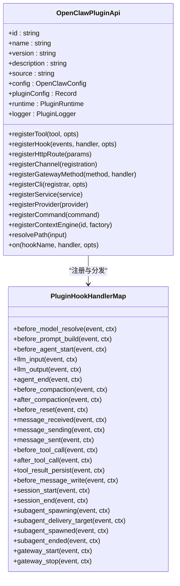
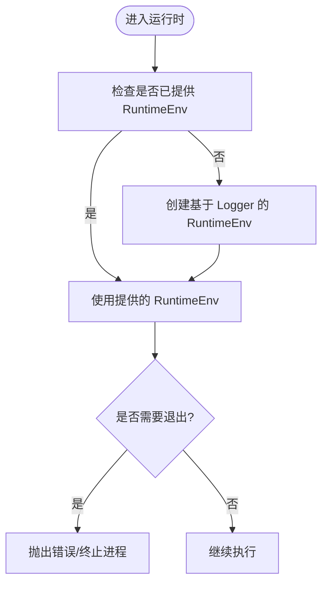
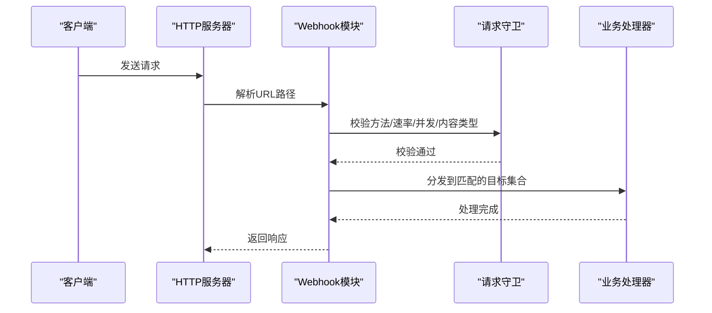
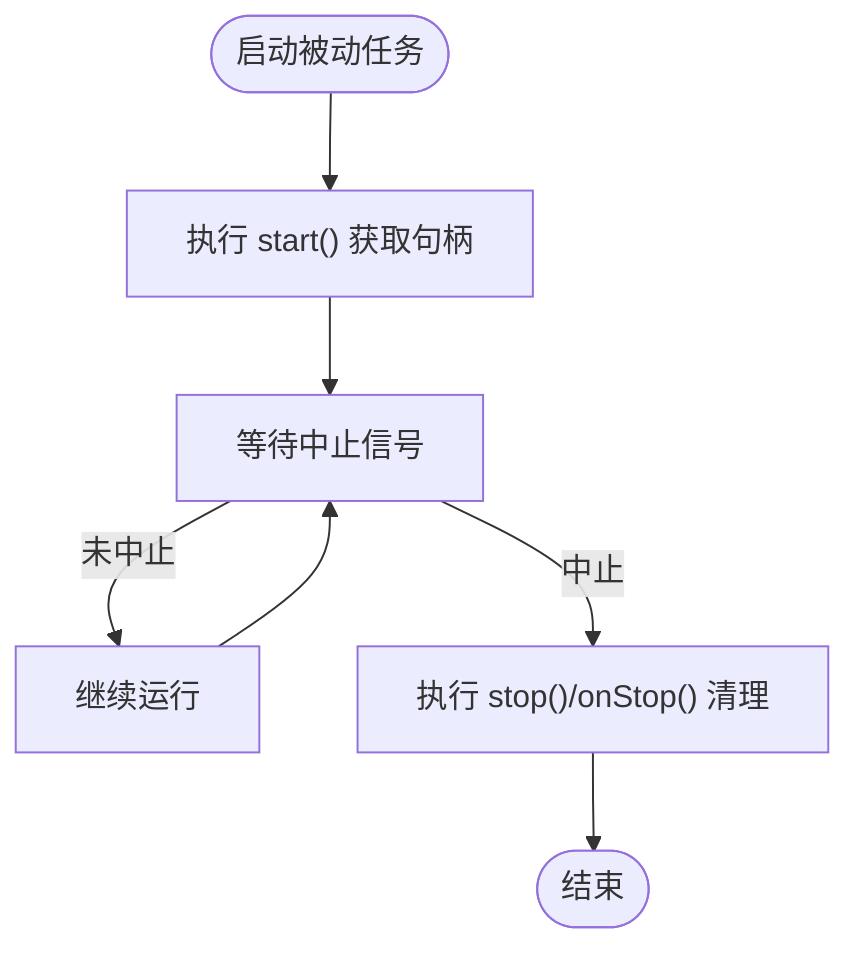
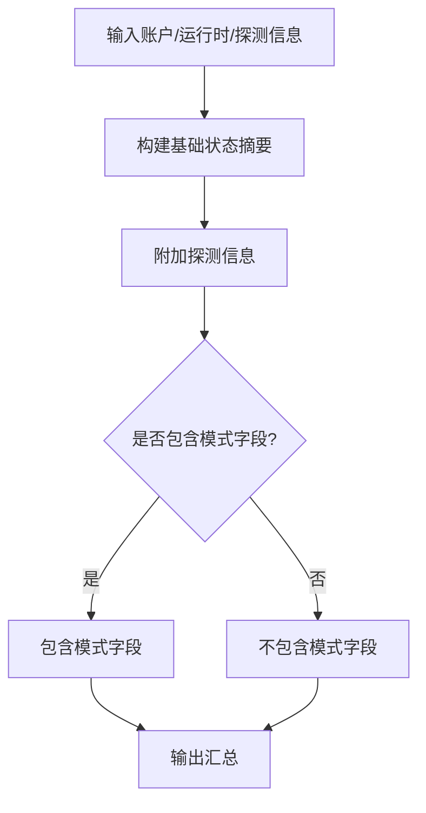
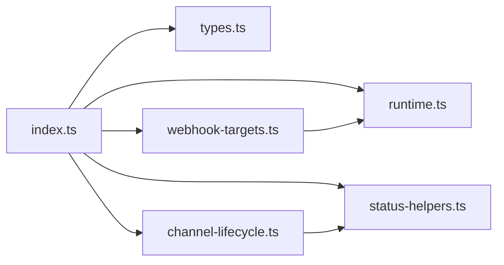

# 插件 SDK 使用指南

<cite>
**本文档引用的文件**
- [src/plugin-sdk/index.ts](file://src/plugin-sdk/index.ts)
- [src/plugin-sdk/runtime.ts](file://src/plugin-sdk/runtime.ts)
- [src/plugins/types.ts](file://src/plugins/types.ts)
- [src/plugin-sdk/webhook-targets.ts](file://src/plugin-sdk/webhook-targets.ts)
- [src/plugin-sdk/channel-lifecycle.ts](file://src/plugin-sdk/channel-lifecycle.ts)
- [src/plugin-sdk/status-helpers.ts](file://src/plugin-sdk/status-helpers.ts)
</cite>

## 目录
1. [简介](#简介)
2. [项目结构](#项目结构)
3. [核心组件](#核心组件)
4. [架构总览](#架构总览)
5. [详细组件分析](#详细组件分析)
6. [依赖关系分析](#依赖关系分析)
7. [性能考虑](#性能考虑)
8. [故障排查指南](#故障排查指南)
9. [结论](#结论)
10. [附录](#附录)

## 简介
本指南面向希望基于 OpenClaw 插件 SDK 开发扩展的开发者，系统讲解 SDK 的安装与配置、核心 API（插件生命周期回调、工具函数、实用程序）、典型插件实现模式、开发工具链、版本兼容性与升级路径，以及常见开发模式与最佳实践。文档中的所有技术细节均来自仓库源码，确保准确性与可追溯性。

## 项目结构
OpenClaw 将插件 SDK 能力集中在 src/plugin-sdk 目录，并通过统一入口导出能力；插件运行时与类型定义位于 src/plugins 下。整体结构清晰，便于按需引入与扩展。

图表来源
- [src/plugin-sdk/index.ts:1-826](file://src/plugin-sdk/index.ts#L1-L826)
- [src/plugin-sdk/runtime.ts:1-45](file://src/plugin-sdk/runtime.ts#L1-L45)
- [src/plugins/types.ts:1-893](file://src/plugins/types.ts#L1-L893)
- [src/plugin-sdk/webhook-targets.ts:1-282](file://src/plugin-sdk/webhook-targets.ts#L1-L282)
- [src/plugin-sdk/channel-lifecycle.ts:1-108](file://src/plugin-sdk/channel-lifecycle.ts#L1-L108)
- [src/plugin-sdk/status-helpers.ts:1-173](file://src/plugin-sdk/status-helpers.ts#L1-L173)

章节来源
- [src/plugin-sdk/index.ts:1-826](file://src/plugin-sdk/index.ts#L1-L826)

## 核心组件
- 插件 API 定义：提供插件注册、工具注册、HTTP 路由注册、命令注册、服务注册、提供方注册等能力，以及丰富的生命周期钩子事件模型。
- 运行时环境：封装日志、错误退出、运行时上下文解析，适配不同宿主环境。
- Webhook 工具：支持将多个目标按路径聚合注册到统一 HTTP 路由，内置速率限制、并发控制、内容类型校验等防护。
- 通道生命周期：提供被动账户任务生命周期管理、HTTP 服务器任务保活、中止信号处理等。
- 状态辅助：构建通道与账户状态快照、汇总与问题收集，便于诊断与监控。

章节来源
- [src/plugins/types.ts:248-306](file://src/plugins/types.ts#L248-L306)
- [src/plugin-sdk/runtime.ts:9-44](file://src/plugin-sdk/runtime.ts#L9-L44)
- [src/plugin-sdk/webhook-targets.ts:27-100](file://src/plugin-sdk/webhook-targets.ts#L27-L100)
- [src/plugin-sdk/channel-lifecycle.ts:51-107](file://src/plugin-sdk/channel-lifecycle.ts#L51-L107)
- [src/plugin-sdk/status-helpers.ts:12-173](file://src/plugin-sdk/status-helpers.ts#L12-L173)

## 架构总览
下图展示了插件 SDK 的关键交互：插件通过 OpenClawPluginApi 注册各类能力；运行时负责日志与退出；Webhook 模块负责请求路由与安全防护；生命周期与状态模块贯穿通道与账户的运行期管理。

图表来源
- [src/plugins/types.ts:263-306](file://src/plugins/types.ts#L263-L306)
- [src/plugin-sdk/runtime.ts:26-44](file://src/plugin-sdk/runtime.ts#L26-L44)
- [src/plugin-sdk/webhook-targets.ts:27-162](file://src/plugin-sdk/webhook-targets.ts#L27-L162)
- [src/plugin-sdk/channel-lifecycle.ts:51-107](file://src/plugin-sdk/channel-lifecycle.ts#L51-L107)
- [src/plugin-sdk/status-helpers.ts:32-173](file://src/plugin-sdk/status-helpers.ts#L32-L173)

## 详细组件分析

### 组件A：插件 API 与生命周期钩子
- 职责：定义插件能力边界，暴露注册接口与生命周期钩子事件模型，覆盖从消息接收、工具调用到会话与子代理生命周期的全链路。
- 关键点：
  - 钩子名称集合与类型约束，确保编译期校验钩子名正确性。
  - 钩子事件参数与返回值结构化，便于插件在特定阶段注入逻辑（如提示词改写、模型选择、消息发送前拦截）。
  - 生命周期钩子涵盖“before_model_resolve”、“before_prompt_build”、“before_agent_start”、“llm_input/llm_output”、“message_*”、“tool_*”、“session_*”、“subagent_*”、“gateway_*”等。
- 实现要点：
  - 使用 on 方法注册钩子处理器，支持优先级。
  - 在钩子处理器中可返回修改后的结果以影响后续流程。

图表来源
- [src/plugins/types.ts:263-306](file://src/plugins/types.ts#L263-L306)
- [src/plugins/types.ts:317-394](file://src/plugins/types.ts#L317-L394)

章节来源
- [src/plugins/types.ts:248-306](file://src/plugins/types.ts#L248-L306)
- [src/plugins/types.ts:317-394](file://src/plugins/types.ts#L317-L394)

### 组件B：运行时环境与日志
- 职责：为插件提供统一的日志与退出抽象，屏蔽底层宿主差异。
- 关键点：
  - createLoggerBackedRuntime 基于外部 LoggerLike 封装 log/info/error 与 exit。
  - resolveRuntimeEnv 支持传入已有 RuntimeEnv 或自动创建。
  - resolveRuntimeEnvWithUnavailableExit 提供不可用退出场景的兜底错误。

图表来源
- [src/plugin-sdk/runtime.ts:9-44](file://src/plugin-sdk/runtime.ts#L9-L44)

章节来源
- [src/plugin-sdk/runtime.ts:9-44](file://src/plugin-sdk/runtime.ts#L9-L44)

### 组件C：Webhook 注册与请求处理管线
- 职责：将多个 Webhook 目标按路径聚合，注册到统一 HTTP 路由，提供请求守卫（方法、速率、并发、内容类型）与认证匹配。
- 关键点：
  - registerWebhookTargetWithPluginRoute 将目标映射到插件路由，首次命中时自动注册路由，最后移除时自动清理。
  - withResolvedWebhookRequestPipeline 统一处理请求：解析路径、开始请求生命周期、执行业务处理、释放资源。
  - resolveSingleWebhookTarget/Async 支持同步与异步匹配，返回单一定位、歧义或未授权三种结果。
  - rejectNonPostWebhookRequest 对非 POST 请求直接拒绝。

图表来源
- [src/plugin-sdk/webhook-targets.ts:115-162](file://src/plugin-sdk/webhook-targets.ts#L115-L162)
- [src/plugin-sdk/webhook-targets.ts:186-220](file://src/plugin-sdk/webhook-targets.ts#L186-L220)
- [src/plugin-sdk/webhook-targets.ts:273-281](file://src/plugin-sdk/webhook-targets.ts#L273-L281)

章节来源
- [src/plugin-sdk/webhook-targets.ts:27-100](file://src/plugin-sdk/webhook-targets.ts#L27-L100)
- [src/plugin-sdk/webhook-targets.ts:115-162](file://src/plugin-sdk/webhook-targets.ts#L115-L162)
- [src/plugin-sdk/webhook-targets.ts:186-220](file://src/plugin-sdk/webhook-targets.ts#L186-L220)
- [src/plugin-sdk/webhook-targets.ts:273-281](file://src/plugin-sdk/webhook-targets.ts#L273-L281)

### 组件D：通道生命周期管理
- 职责：管理通道账户的被动任务生命周期与 HTTP 服务器保活，支持中止信号与清理回调。
- 关键点：
  - runPassiveAccountLifecycle 在中止前优雅停止并执行清理。
  - keepHttpServerTaskAlive 在服务器 close 事件后才结束，支持可选的 abort 触发器。
  - waitUntilAbort 提供统一的中止等待机制。

图表来源
- [src/plugin-sdk/channel-lifecycle.ts:51-62](file://src/plugin-sdk/channel-lifecycle.ts#L51-L62)

章节来源
- [src/plugin-sdk/channel-lifecycle.ts:14-107](file://src/plugin-sdk/channel-lifecycle.ts#L14-L107)

### 组件E：状态快照与汇总
- 职责：构建通道与账户的状态快照、汇总与问题收集，便于诊断与监控。
- 关键点：
  - createDefaultChannelRuntimeState 初始化运行时状态。
  - buildBaseChannelStatusSummary/buildProbeChannelStatusSummary/buildTokenChannelStatusSummary 构建不同粒度的状态摘要。
  - collectStatusIssuesFromLastError 将最近错误转换为状态问题列表。

图表来源
- [src/plugin-sdk/status-helpers.ts:32-152](file://src/plugin-sdk/status-helpers.ts#L32-L152)

章节来源
- [src/plugin-sdk/status-helpers.ts:12-173](file://src/plugin-sdk/status-helpers.ts#L12-L173)

## 依赖关系分析
- 入口导出：index.ts 将运行时、类型、Webhook、生命周期、状态辅助等模块统一导出，形成 SDK 的对外 API 表面。
- 内部耦合：Webhook 模块依赖运行时与请求守卫；生命周期模块与状态模块相互配合；类型模块为所有模块提供契约。

图表来源
- [src/plugin-sdk/index.ts:1-826](file://src/plugin-sdk/index.ts#L1-L826)
- [src/plugin-sdk/runtime.ts:1-45](file://src/plugin-sdk/runtime.ts#L1-L45)
- [src/plugins/types.ts:1-893](file://src/plugins/types.ts#L1-L893)
- [src/plugin-sdk/webhook-targets.ts:1-282](file://src/plugin-sdk/webhook-targets.ts#L1-L282)
- [src/plugin-sdk/channel-lifecycle.ts:1-108](file://src/plugin-sdk/channel-lifecycle.ts#L1-L108)
- [src/plugin-sdk/status-helpers.ts:1-173](file://src/plugin-sdk/status-helpers.ts#L1-L173)

章节来源
- [src/plugin-sdk/index.ts:1-826](file://src/plugin-sdk/index.ts#L1-L826)

## 性能考虑
- Webhook 并发与速率控制：通过内存限流器与飞行请求数限制，避免过载。
- 请求体大小与超时：对请求体大小与读取超时进行限制，降低异常流量风险。
- 状态汇总与问题收集：集中构建状态摘要，减少重复计算与 IO。
- 生命周期保活：在服务器关闭后再结束任务，避免资源泄漏。

## 故障排查指南
- Webhook 认证失败或歧义：使用 resolveWebhookTargetWithAuthOrReject/同步版本进行匹配，根据返回结果判断 401/400 等状态码。
- 非 POST 请求：rejectNonPostWebhookRequest 会返回 405 并声明允许的方法。
- 中止信号处理：确保在 runPassiveAccountLifecycle/keepHttpServerTaskAlive 中正确传递 AbortSignal 并实现清理逻辑。
- 状态诊断：collectStatusIssuesFromLastError 可将最近错误转为状态问题，便于统一上报与定位。

章节来源
- [src/plugin-sdk/webhook-targets.ts:222-271](file://src/plugin-sdk/webhook-targets.ts#L222-L271)
- [src/plugin-sdk/webhook-targets.ts:273-281](file://src/plugin-sdk/webhook-targets.ts#L273-L281)
- [src/plugin-sdk/channel-lifecycle.ts:29-61](file://src/plugin-sdk/channel-lifecycle.ts#L29-L61)
- [src/plugin-sdk/status-helpers.ts:154-173](file://src/plugin-sdk/status-helpers.ts#L154-L173)

## 结论
OpenClaw 插件 SDK 提供了完善的插件注册、运行时抽象、Webhook 安全处理、生命周期管理与状态辅助能力。通过统一的 API 与严格的类型约束，开发者可以快速构建稳定、可观测、可扩展的插件。建议在实际开发中遵循本文档的模式与最佳实践，结合仓库中的具体实现路径进行参考与扩展。

## 附录
- 安装与配置：请参考项目根目录 README 与相关文档，确保 Node.js 环境与包管理器准备就绪。
- 版本兼容性与升级路径：请关注仓库中的变更日志与发布说明，遵循向后兼容策略进行升级。
- 开发工具链：利用内置的测试配置、构建脚本与调试工具，提升开发效率与质量。