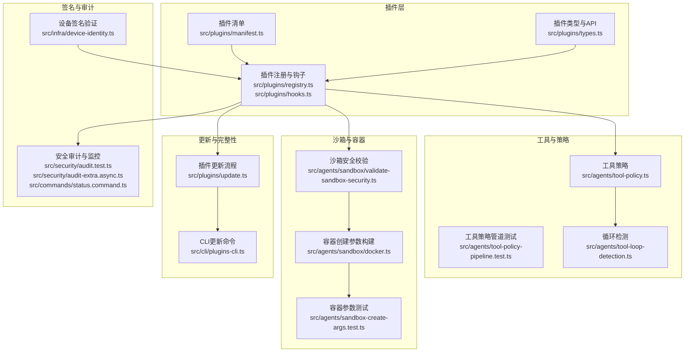
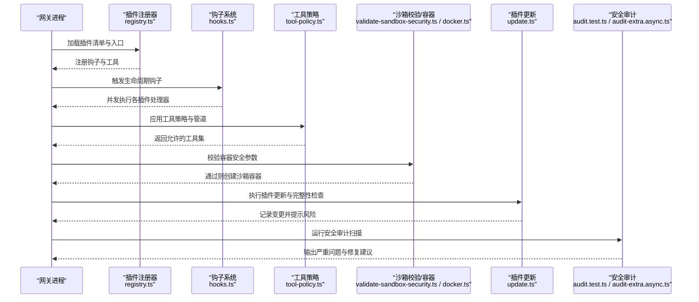
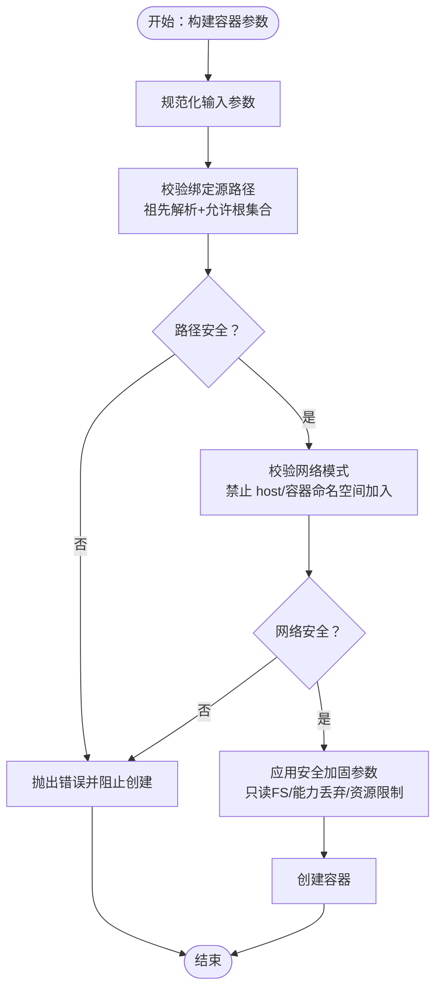
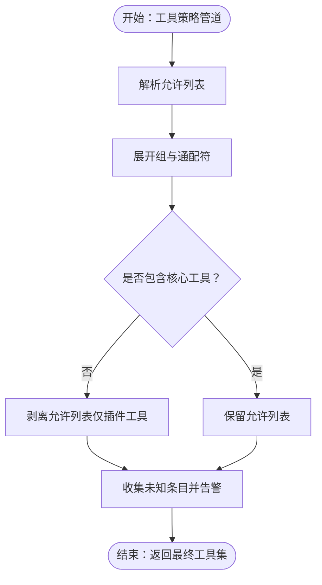
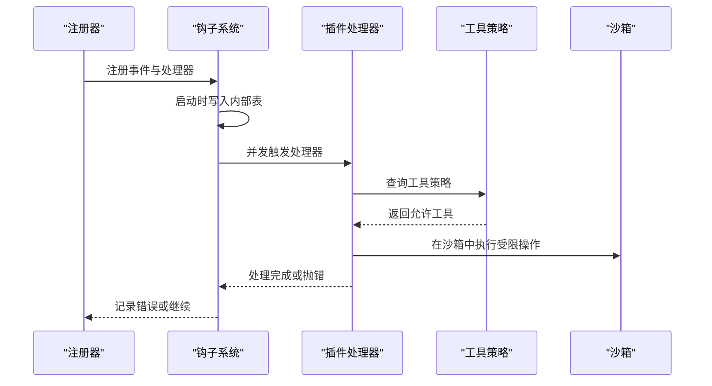
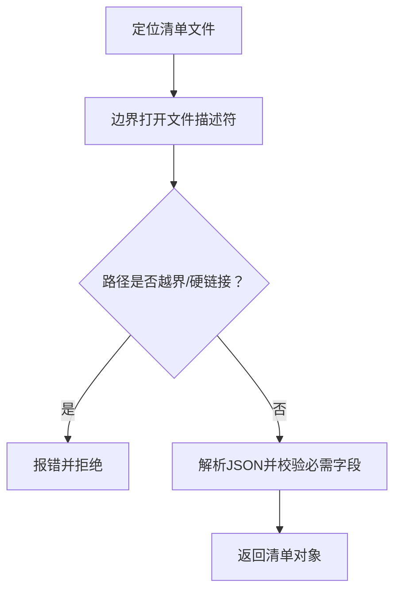
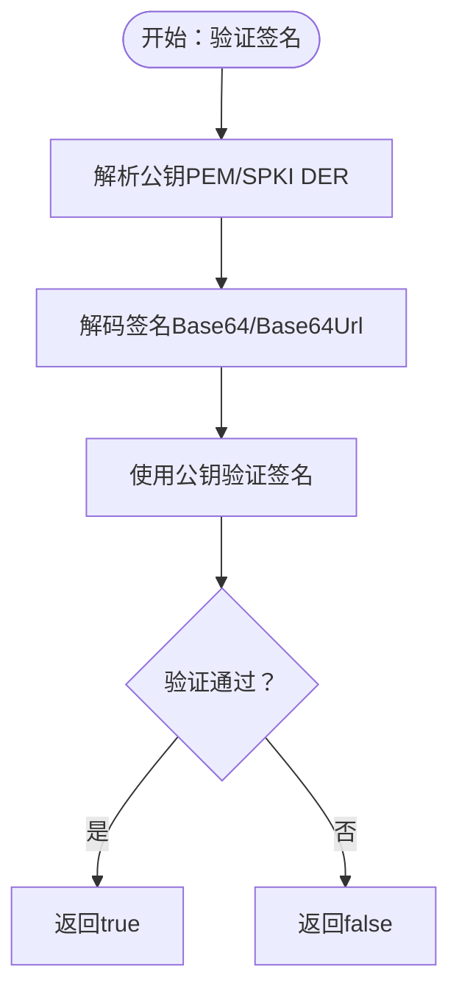
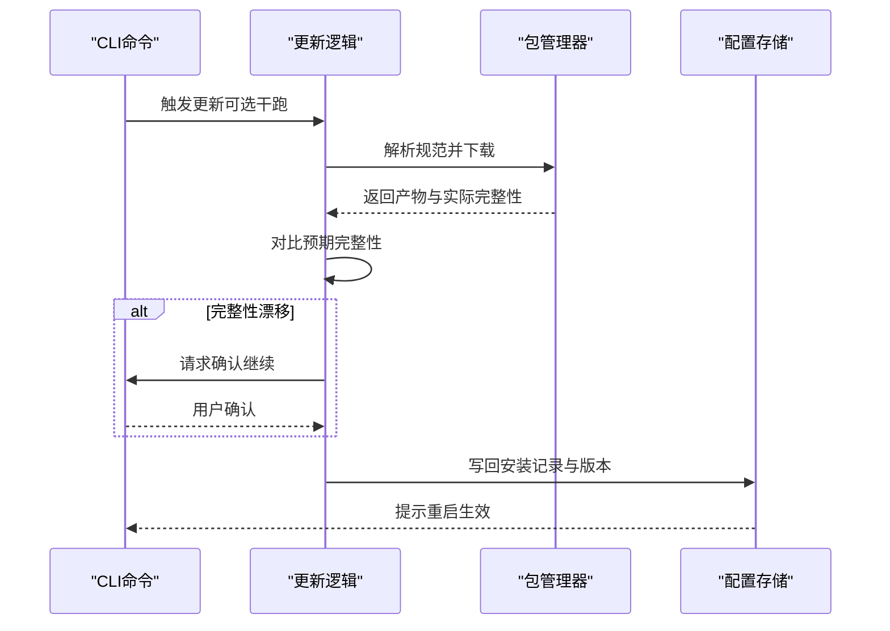
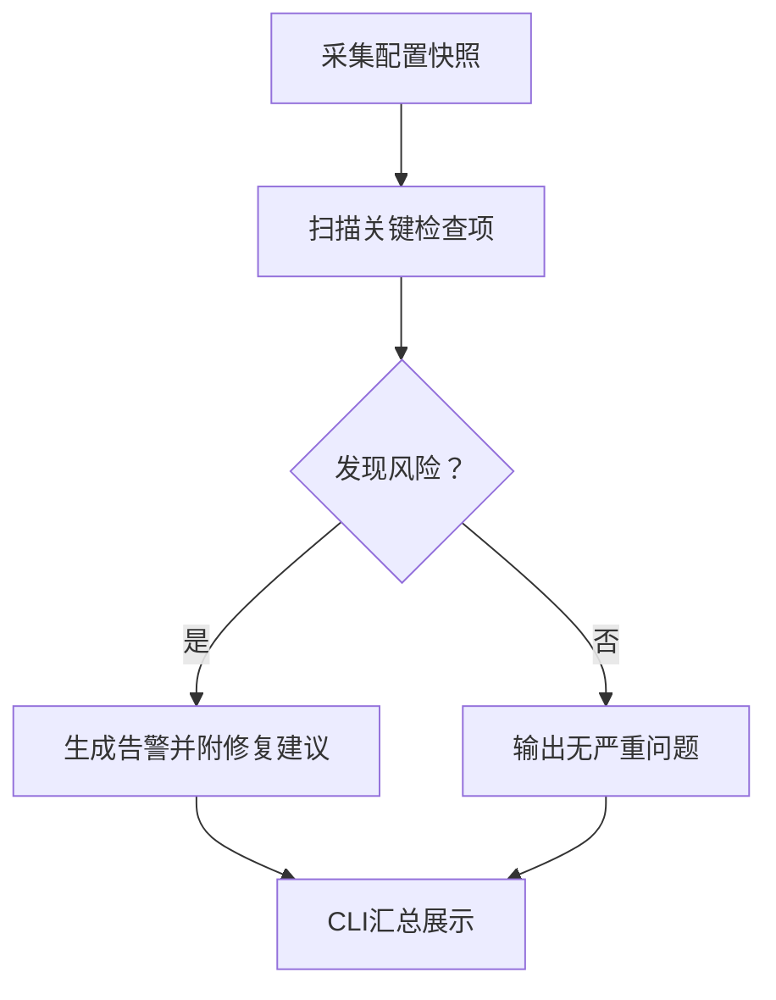
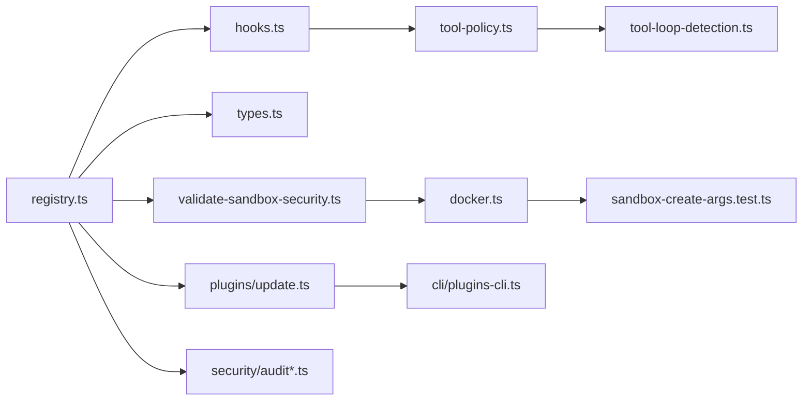

# 插件安全模型

<cite>
**本文引用的文件**
- [SECURITY.md](file://SECURITY.md)
- [src/plugins/manifest.ts](file://src/plugins/manifest.ts)
- [src/plugins/types.ts](file://src/plugins/types.ts)
- [src/plugins/hooks.ts](file://src/plugins/hooks.ts)
- [src/plugins/registry.ts](file://src/plugins/registry.ts)
- [src/plugins/update.ts](file://src/plugins/update.ts)
- [src/cli/plugins-cli.ts](file://src/cli/plugins-cli.ts)
- [src/agents/tool-policy.ts](file://src/agents/tool-policy.ts)
- [src/agents/tool-policy-pipeline.test.ts](file://src/agents/tool-policy-pipeline.test.ts)
- [src/agents/tool-loop-detection.ts](file://src/agents/tool-loop-detection.ts)
- [src/agents/sandbox/validate-sandbox-security.ts](file://src/agents/sandbox/validate-sandbox-security.ts)
- [src/agents/sandbox/docker.ts](file://src/agents/sandbox/docker.ts)
- [src/agents/sandbox-create-args.test.ts](file://src/agents/sandbox-create-args.test.ts)
- [src/infra/device-identity.ts](file://src/infra/device-identity.ts)
- [src/security/audit.test.ts](file://src/security/audit.test.ts)
- [src/security/audit-extra.async.ts](file://src/security/audit-extra.async.ts)
- [src/commands/status.command.ts](file://src/commands/status.command.ts)
- [extensions/voice-call/src/webhook-security.ts](file://extensions/voice-call/src/webhook-security.ts)
</cite>

## 目录
1. [引言](#引言)
2. [项目结构](#项目结构)
3. [核心组件](#核心组件)
4. [架构总览](#架构总览)
5. [详细组件分析](#详细组件分析)
6. [依赖关系分析](#依赖关系分析)
7. [性能考量](#性能考量)
8. [故障排查指南](#故障排查指南)
9. [结论](#结论)
10. [附录](#附录)

## 引言
本文件系统化阐述 OpenClaw 插件安全模型，覆盖插件沙箱机制（执行隔离、资源访问限制、权限控制）、插件工具安全策略（调用验证、参数过滤、输出限制）、插件钩子安全考虑（事件传播控制、副作用防护、循环依赖检测）、插件签名与验证机制（数字签名、完整性检查、来源验证）、插件更新安全流程（版本验证、回滚机制、降级策略），以及安全审计与监控方案。目标是帮助开发者与运营者在理解信任边界的前提下，正确配置与使用插件，最大化整体安全性。

## 项目结构
OpenClaw 将“信任边界”作为安全设计的核心：插件作为受信组件加载到网关进程中，其行为等同于本地主机上的受信代码；同时通过工具策略、沙箱、钩子与审计等手段实现纵深防御。关键模块分布如下：
- 插件清单与类型定义：负责插件元数据解析、入口解析与类型约束
- 插件注册与钩子系统：负责插件生命周期、事件注册与并发执行
- 工具策略与管道：负责工具调用白名单、未知条目告警与核心工具保护
- 沙箱与容器安全：负责容器运行时安全校验、网络模式限制、资源限制
- 设备身份与签名验证：负责设备侧签名验证
- 更新与完整性校验：负责插件安装/更新过程中的完整性检查与交互确认
- 安全审计与监控：负责部署与运行态安全扫描、权限检查与风险提示

**图表来源**
- [src/plugins/manifest.ts:1-199](file://src/plugins/manifest.ts#L1-L199)
- [src/plugins/types.ts:248-306](file://src/plugins/types.ts#L248-L306)
- [src/plugins/registry.ts:241-288](file://src/plugins/registry.ts#L241-L288)
- [src/plugins/hooks.ts:184-224](file://src/plugins/hooks.ts#L184-L224)
- [src/agents/tool-policy.ts:156-200](file://src/agents/tool-policy.ts#L156-L200)
- [src/agents/tool-loop-detection.ts:290-314](file://src/agents/tool-loop-detection.ts#L290-L314)
- [src/agents/sandbox/validate-sandbox-security.ts:272-306](file://src/agents/sandbox/validate-sandbox-security.ts#L272-L306)
- [src/agents/sandbox/docker.ts:317-344](file://src/agents/sandbox/docker.ts#L317-L344)
- [src/agents/sandbox-create-args.test.ts:41-73](file://src/agents/sandbox-create-args.test.ts#L41-L73)
- [src/plugins/update.ts:197-416](file://src/plugins/update.ts#L197-L416)
- [src/cli/plugins-cli.ts:749-789](file://src/cli/plugins-cli.ts#L749-L789)
- [src/infra/device-identity.ts:154-182](file://src/infra/device-identity.ts#L154-L182)
- [src/security/audit.test.ts:593-643](file://src/security/audit.test.ts#L593-L643)
- [src/security/audit-extra.async.ts:1069-1127](file://src/security/audit-extra.async.ts#L1069-L1127)
- [src/commands/status.command.ts:473-508](file://src/commands/status.command.ts#L473-L508)

**章节来源**
- [SECURITY.md:88-131](file://SECURITY.md#L88-L131)
- [src/plugins/manifest.ts:1-199](file://src/plugins/manifest.ts#L1-L199)
- [src/plugins/types.ts:248-306](file://src/plugins/types.ts#L248-L306)
- [src/plugins/registry.ts:241-288](file://src/plugins/registry.ts#L241-L288)
- [src/plugins/hooks.ts:184-224](file://src/plugins/hooks.ts#L184-L224)

## 核心组件
- 插件清单与入口解析：确保插件元数据与入口路径在受控根目录内，拒绝硬链接等不安全路径，避免越界读取
- 插件类型与API：统一插件对外接口，明确工具注册、钩子注册、HTTP路由、命令注册等能力边界
- 工具策略与管道：对工具白名单进行规范化处理，自动剥离仅包含插件工具的允许列表，保留核心工具可用性，并对未知条目发出警告
- 沙箱与容器安全：对容器网络模式、绑定挂载源、用户/能力/资源限制等进行严格校验，阻断高危配置
- 循环检测：基于工具调用历史与参数哈希，识别交替式无进展循环，防止死循环或资源耗尽
- 设备签名验证：支持 ED25519 公钥派生与签名验证，用于设备侧可信验证
- 插件更新与完整性：在更新前计算预期完整性，遇到漂移时要求人工确认，支持干跑与变更记录
- 安全审计与监控：对网关绑定、认证、日志脱敏、文件权限等进行扫描与提示，CLI 命令汇总展示严重问题

**章节来源**
- [src/plugins/manifest.ts:45-119](file://src/plugins/manifest.ts#L45-L119)
- [src/plugins/types.ts:248-306](file://src/plugins/types.ts#L248-L306)
- [src/agents/tool-policy.ts:156-200](file://src/agents/tool-policy.ts#L156-L200)
- [src/agents/tool-policy-pipeline.test.ts:1-66](file://src/agents/tool-policy-pipeline.test.ts#L1-L66)
- [src/agents/tool-loop-detection.ts:290-314](file://src/agents/tool-loop-detection.ts#L290-L314)
- [src/infra/device-identity.ts:154-182](file://src/infra/device-identity.ts#L154-L182)
- [src/plugins/update.ts:197-416](file://src/plugins/update.ts#L197-L416)
- [src/cli/plugins-cli.ts:749-789](file://src/cli/plugins-cli.ts#L749-L789)
- [src/security/audit.test.ts:593-643](file://src/security/audit.test.ts#L593-L643)
- [src/security/audit-extra.async.ts:1069-1127](file://src/security/audit-extra.async.ts#L1069-L1127)
- [src/commands/status.command.ts:473-508](file://src/commands/status.command.ts#L473-L508)

## 架构总览
下图展示了插件从加载、注册、工具调用到沙箱执行与安全审计的整体流程，强调信任边界与多层防护：

**图表来源**
- [src/plugins/registry.ts:241-288](file://src/plugins/registry.ts#L241-L288)
- [src/plugins/hooks.ts:184-224](file://src/plugins/hooks.ts#L184-L224)
- [src/agents/tool-policy.ts:156-200](file://src/agents/tool-policy.ts#L156-L200)
- [src/agents/sandbox/validate-sandbox-security.ts:272-306](file://src/agents/sandbox/validate-sandbox-security.ts#L272-L306)
- [src/agents/sandbox/docker.ts:317-344](file://src/agents/sandbox/docker.ts#L317-L344)
- [src/plugins/update.ts:197-416](file://src/plugins/update.ts#L197-L416)
- [src/security/audit.test.ts:593-643](file://src/security/audit.test.ts#L593-L643)
- [src/security/audit-extra.async.ts:1069-1127](file://src/security/audit-extra.async.ts#L1069-L1127)

## 详细组件分析

### 沙箱机制与执行隔离
- 路径与绑定安全：对绑定挂载源进行规范化与祖先路径解析，强制允许根集合校验，防止符号链接逃逸与越界访问
- 网络模式限制：默认禁止 host 网络与容器命名空间加入，避免绕过沙箱隔离
- 容器参数硬核：只允许受限能力、只读根文件系统、禁用特权、设置内存/CPU/句柄等资源上限，启用 seccomp/AppArmor 等强化
- 参数构建链路：在创建容器前集中校验，失败即刻中止，避免危险参数进入运行时

**图表来源**
- [src/agents/sandbox/validate-sandbox-security.ts:272-306](file://src/agents/sandbox/validate-sandbox-security.ts#L272-L306)
- [src/agents/sandbox/docker.ts:317-344](file://src/agents/sandbox/docker.ts#L317-L344)
- [src/agents/sandbox-create-args.test.ts:41-73](file://src/agents/sandbox-create-args.test.ts#L41-L73)

**章节来源**
- [src/agents/sandbox/validate-sandbox-security.ts:272-306](file://src/agents/sandbox/validate-sandbox-security.ts#L272-L306)
- [src/agents/sandbox/docker.ts:317-344](file://src/agents/sandbox/docker.ts#L317-L344)
- [src/agents/sandbox-create-args.test.ts:41-73](file://src/agents/sandbox-create-args.test.ts#L41-L73)

### 插件工具的安全策略
- 允许列表剥离：当仅存在插件工具的允许列表时，自动剥离以避免误禁用核心工具（如 read/exec）
- 未知条目告警：对不在核心工具与插件工具集合中的条目发出警告，便于发现误配
- 管道化处理：支持多步策略叠加，逐步收敛工具集，保证最小可用集

**图表来源**
- [src/agents/tool-policy.ts:156-200](file://src/agents/tool-policy.ts#L156-L200)
- [src/agents/tool-policy-pipeline.test.ts:1-66](file://src/agents/tool-policy-pipeline.test.ts#L1-L66)

**章节来源**
- [src/agents/tool-policy.ts:156-200](file://src/agents/tool-policy.ts#L156-L200)
- [src/agents/tool-policy-pipeline.test.ts:1-66](file://src/agents/tool-policy-pipeline.test.ts#L1-L66)

### 插件钩子的安全考虑
- 事件传播控制：钩子注册时写入内部钩子表，仅在启用时注册到内部系统，避免未授权事件扩散
- 并发执行与错误处理：并发触发所有处理器，捕获单个插件异常并按配置决定抛出或记录，避免单点故障影响全局
- 副作用防护：通过严格的工具策略与沙箱隔离，限制钩子可执行的操作范围
- 循环依赖检测：基于工具调用历史与参数哈希，识别交替式无进展循环，及时终止

**图表来源**
- [src/plugins/registry.ts:241-288](file://src/plugins/registry.ts#L241-L288)
- [src/plugins/hooks.ts:184-224](file://src/plugins/hooks.ts#L184-L224)
- [src/agents/tool-policy.ts:156-200](file://src/agents/tool-policy.ts#L156-L200)
- [src/agents/tool-loop-detection.ts:290-314](file://src/agents/tool-loop-detection.ts#L290-L314)

**章节来源**
- [src/plugins/registry.ts:241-288](file://src/plugins/registry.ts#L241-L288)
- [src/plugins/hooks.ts:184-224](file://src/plugins/hooks.ts#L184-L224)
- [src/agents/tool-loop-detection.ts:290-314](file://src/agents/tool-loop-detection.ts#L290-L314)

### 插件清单与来源验证
- 清单解析：限定清单文件名，解析根目录内的清单，拒绝越界路径与硬链接，确保只在插件根目录内读取
- 来源约束：通过受控入口候选与包元数据扩展字段，确保插件来源与入口合法

**图表来源**
- [src/plugins/manifest.ts:35-119](file://src/plugins/manifest.ts#L35-L119)

**章节来源**
- [src/plugins/manifest.ts:35-119](file://src/plugins/manifest.ts#L35-L119)

### 插件签名与验证机制
- 设备签名验证：支持 PEM 或 SPKI DER 形式的公钥，兼容 Base64/Base64Url 编码的签名输入，统一验证流程
- 适用场景：可用于设备侧可信验证，确保插件或工件来源可信

**图表来源**
- [src/infra/device-identity.ts:154-182](file://src/infra/device-identity.ts#L154-L182)

**章节来源**
- [src/infra/device-identity.ts:154-182](file://src/infra/device-identity.ts#L154-L182)

### 插件更新的安全流程
- 版本验证：根据当前安装规范计算预期完整性，若实际产物与预期不符，触发漂移告警
- 交互确认：在非干跑模式下，要求用户确认是否继续更新，避免静默降级
- 变更记录：成功更新后写回配置，提示重启以生效
- 通道同步：支持将捆绑插件切换为 npm 安装，或反之，同时记录切换结果

**图表来源**
- [src/plugins/update.ts:197-416](file://src/plugins/update.ts#L197-L416)
- [src/cli/plugins-cli.ts:749-789](file://src/cli/plugins-cli.ts#L749-L789)

**章节来源**
- [src/plugins/update.ts:197-416](file://src/plugins/update.ts#L197-L416)
- [src/cli/plugins-cli.ts:749-789](file://src/cli/plugins-cli.ts#L749-L789)

### 安全审计与监控方案
- 部署与运行态扫描：对网关绑定、认证、日志脱敏、文件权限等进行检查，识别潜在风险
- 权限检查：针对会话存储与日志文件检查世界可读/组可读等风险
- CLI 展示：在状态命令中汇总严重问题，优先显示 CRITICAL/WARN 级别，辅助快速处置

**图表来源**
- [src/security/audit.test.ts:593-643](file://src/security/audit.test.ts#L593-L643)
- [src/security/audit-extra.async.ts:1069-1127](file://src/security/audit-extra.async.ts#L1069-L1127)
- [src/commands/status.command.ts:473-508](file://src/commands/status.command.ts#L473-L508)

**章节来源**
- [src/security/audit.test.ts:593-643](file://src/security/audit.test.ts#L593-L643)
- [src/security/audit-extra.async.ts:1069-1127](file://src/security/audit-extra.async.ts#L1069-L1127)
- [src/commands/status.command.ts:473-508](file://src/commands/status.command.ts#L473-L508)

## 依赖关系分析
- 插件注册与钩子系统依赖工具策略与沙箱模块，确保钩子执行在受控范围内
- 工具策略依赖插件工具分组与核心工具集合，避免误删核心能力
- 沙箱安全校验前置于容器创建参数构建，形成强约束链路
- 安全审计贯穿部署与运行态，为其他组件提供风险反馈

**图表来源**
- [src/plugins/registry.ts:241-288](file://src/plugins/registry.ts#L241-L288)
- [src/plugins/hooks.ts:184-224](file://src/plugins/hooks.ts#L184-L224)
- [src/plugins/types.ts:248-306](file://src/plugins/types.ts#L248-L306)
- [src/agents/tool-policy.ts:156-200](file://src/agents/tool-policy.ts#L156-L200)
- [src/agents/tool-loop-detection.ts:290-314](file://src/agents/tool-loop-detection.ts#L290-L314)
- [src/agents/sandbox/validate-sandbox-security.ts:272-306](file://src/agents/sandbox/validate-sandbox-security.ts#L272-L306)
- [src/agents/sandbox/docker.ts:317-344](file://src/agents/sandbox/docker.ts#L317-L344)
- [src/agents/sandbox-create-args.test.ts:41-73](file://src/agents/sandbox-create-args.test.ts#L41-L73)
- [src/plugins/update.ts:197-416](file://src/plugins/update.ts#L197-L416)
- [src/cli/plugins-cli.ts:749-789](file://src/cli/plugins-cli.ts#L749-L789)
- [src/security/audit.test.ts:593-643](file://src/security/audit.test.ts#L593-L643)
- [src/security/audit-extra.async.ts:1069-1127](file://src/security/audit-extra.async.ts#L1069-L1127)

**章节来源**
- [src/plugins/registry.ts:241-288](file://src/plugins/registry.ts#L241-L288)
- [src/plugins/hooks.ts:184-224](file://src/plugins/hooks.ts#L184-L224)
- [src/agents/tool-policy.ts:156-200](file://src/agents/tool-policy.ts#L156-L200)
- [src/agents/sandbox/validate-sandbox-security.ts:272-306](file://src/agents/sandbox/validate-sandbox-security.ts#L272-L306)
- [src/agents/sandbox/docker.ts:317-344](file://src/agents/sandbox/docker.ts#L317-L344)
- [src/plugins/update.ts:197-416](file://src/plugins/update.ts#L197-L416)
- [src/security/audit.test.ts:593-643](file://src/security/audit.test.ts#L593-L643)

## 性能考量
- 钩子并发：并发执行所有处理器以提升吞吐，但需注意单个处理器的错误不会阻塞其他处理器
- 工具策略管道：多步骤处理在小规模工具集上开销可忽略，大规模场景建议合理拆分策略步骤
- 沙箱参数构建：集中校验减少运行时失败重试成本，但需避免过度复杂的绑定与网络配置
- 审计扫描：按需选择检查项与平台特定检查，避免在生产环境频繁全量扫描

[本节为通用指导，无需具体文件引用]

## 故障排查指南
- 插件加载失败：检查清单路径是否越界、是否为硬链接、必需字段是否完整
- 工具不可用：确认工具策略是否剥离了仅插件工具的允许列表，或是否存在未知条目告警
- 沙箱启动失败：检查网络模式是否为 host 或容器命名空间加入，确认绑定源路径是否在允许根内
- 更新中断：关注完整性漂移告警，确认是否需要交互确认继续；必要时回滚至上一版本
- 安全审计告警：优先处理 CRITICAL/WARN 级别问题，如网关绑定、认证缺失、日志脱敏关闭、文件权限过大等

**章节来源**
- [src/plugins/manifest.ts:45-119](file://src/plugins/manifest.ts#L45-L119)
- [src/agents/tool-policy.ts:156-200](file://src/agents/tool-policy.ts#L156-L200)
- [src/agents/sandbox/validate-sandbox-security.ts:272-306](file://src/agents/sandbox/validate-sandbox-security.ts#L272-L306)
- [src/plugins/update.ts:197-416](file://src/plugins/update.ts#L197-L416)
- [src/security/audit.test.ts:593-643](file://src/security/audit.test.ts#L593-L643)

## 结论
OpenClaw 的插件安全模型以“信任边界”为核心，结合工具策略、沙箱隔离、钩子控制、签名验证与持续审计，形成从加载、运行到更新的全链路安全闭环。遵循推荐的最小权限原则与严格的边界校验，可在个人助理或受控共享场景中有效降低风险。建议在生产环境中启用沙箱、严格工具策略、定期安全审计，并对插件更新实施完整性校验与交互确认。

[本节为总结性内容，无需具体文件引用]

## 附录
- 受信任插件概念：插件被视为与本地主机同等信任，安装/启用即授予相同权限，安全报告需证明边界绕过而非仅插件恶意行为
- 运行时要求：建议使用 Node.js 22.12.0 或更高版本，以获得关键安全补丁
- Docker 安全建议：官方镜像以非 root 用户运行，建议使用只读文件系统与能力丢弃

**章节来源**
- [SECURITY.md:88-131](file://SECURITY.md#L88-L131)
- [SECURITY.md:246-276](file://SECURITY.md#L246-L276)