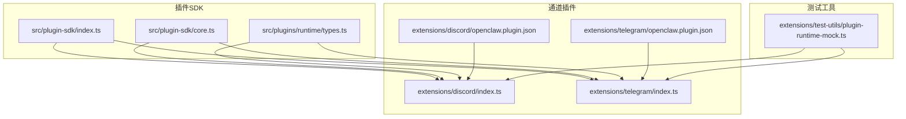
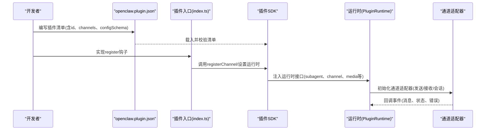
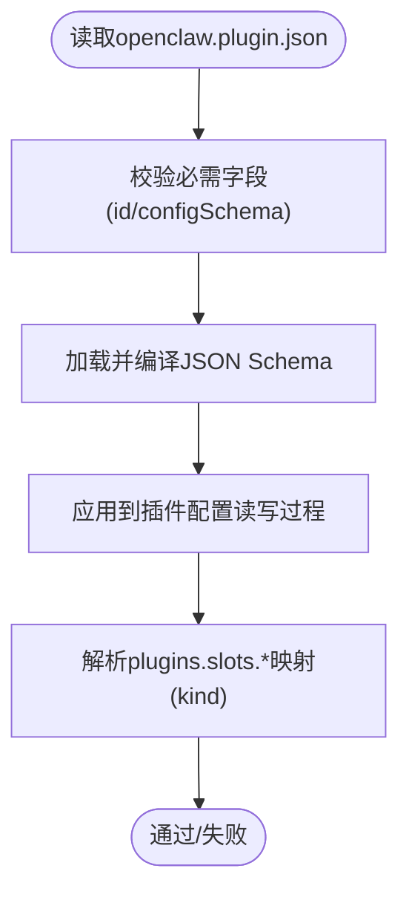
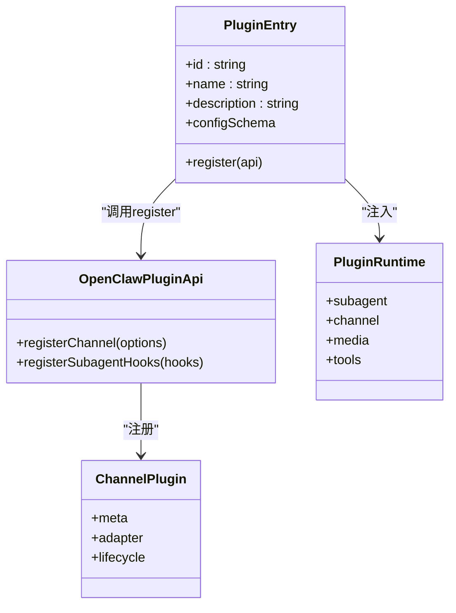
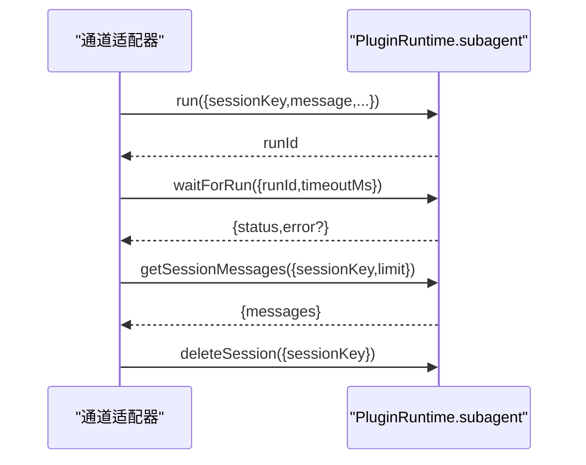
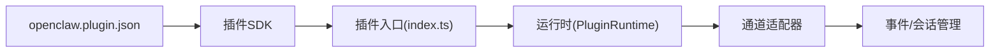

# 插件开发最佳实践

<cite>
**本文档引用的文件**
- [README.md](file://README.md)
- [CONTRIBUTING.md](file://CONTRIBUTING.md)
- [src/plugin-sdk/index.ts](file://src/plugin-sdk/index.ts)
- [src/plugin-sdk/core.ts](file://src/plugin-sdk/core.ts)
- [src/plugins/runtime/types.ts](file://src/plugins/runtime/types.ts)
- [docs/plugins/manifest.md](file://docs/plugins/manifest.md)
- [extensions/discord/openclaw.plugin.json](file://extensions/discord/openclaw.plugin.json)
- [extensions/telegram/openclaw.plugin.json](file://extensions/telegram/openclaw.plugin.json)
- [extensions/discord/index.ts](file://extensions/discord/index.ts)
- [extensions/telegram/index.ts](file://extensions/telegram/index.ts)
- [extensions/test-utils/plugin-runtime-mock.ts](file://extensions/test-utils/plugin-runtime-mock.ts)
</cite>

## 目录
1. [引言](#引言)
2. [项目结构](#项目结构)
3. [核心组件](#核心组件)
4. [架构总览](#架构总览)
5. [详细组件分析](#详细组件分析)
6. [依赖关系分析](#依赖关系分析)
7. [性能考量](#性能考量)
8. [故障排查指南](#故障排查指南)
9. [结论](#结论)
10. [附录](#附录)

## 引言
本指南面向在 OpenClaw 平台上开发插件的工程师与贡献者，系统阐述从需求分析到发布维护的完整流程，并结合仓库中的插件 SDK、通道插件与测试工具，给出可操作的最佳实践。内容涵盖：标准开发流程、错误处理策略、性能优化技巧、兼容性考虑、代码质量保障以及发布与维护策略。

## 项目结构
OpenClaw 的插件体系由“插件 SDK + 通道插件 + 测试工具”三部分组成：
- 插件 SDK：统一导出类型、运行时接口、工具函数与配置校验能力，位于 src/plugin-sdk。
- 通道插件：具体渠道（如 Discord、Telegram）的实现，位于 extensions/<channel>。
- 测试工具：用于模拟运行时环境与断言行为，位于 extensions/test-utils。

**图表来源**
- [src/plugin-sdk/index.ts:1-826](file://src/plugin-sdk/index.ts#L1-L826)
- [src/plugin-sdk/core.ts:1-44](file://src/plugin-sdk/core.ts#L1-L44)
- [src/plugins/runtime/types.ts:1-64](file://src/plugins/runtime/types.ts#L1-L64)
- [extensions/discord/index.ts:1-20](file://extensions/discord/index.ts#L1-L20)
- [extensions/telegram/index.ts:1-18](file://extensions/telegram/index.ts#L1-L18)
- [extensions/discord/openclaw.plugin.json:1-10](file://extensions/discord/openclaw.plugin.json#L1-L10)
- [extensions/telegram/openclaw.plugin.json:1-10](file://extensions/telegram/openclaw.plugin.json#L1-L10)
- [extensions/test-utils/plugin-runtime-mock.ts:1-272](file://extensions/test-utils/plugin-runtime-mock.ts#L1-L272)

**章节来源**
- [README.md:1-560](file://README.md#L1-L560)
- [src/plugin-sdk/index.ts:1-826](file://src/plugin-sdk/index.ts#L1-L826)
- [src/plugin-sdk/core.ts:1-44](file://src/plugin-sdk/core.ts#L1-L44)
- [src/plugins/runtime/types.ts:1-64](file://src/plugins/runtime/types.ts#L1-L64)
- [extensions/discord/index.ts:1-20](file://extensions/discord/index.ts#L1-L20)
- [extensions/telegram/index.ts:1-18](file://extensions/telegram/index.ts#L1-L18)
- [extensions/discord/openclaw.plugin.json:1-10](file://extensions/discord/openclaw.plugin.json#L1-L10)
- [extensions/telegram/openclaw.plugin.json:1-10](file://extensions/telegram/openclaw.plugin.json#L1-L10)
- [extensions/test-utils/plugin-runtime-mock.ts:1-272](file://extensions/test-utils/plugin-runtime-mock.ts#L1-L272)

## 核心组件
- 插件注册与导出
  - SDK 统一导出插件类型、运行时接口、配置校验与工具函数，便于各通道插件按约定实现。
  - 通道插件通过 openclaw.plugin.json 声明 id、channels、configSchema 等元数据；index.ts 中以 register 钩子完成注册。
- 运行时接口
  - Subagent 运行时提供 run/waitForRun/getSessionMessages/deleteSession 等方法，支撑插件内嵌会话生命周期管理。
- 测试工具
  - 提供 createPluginRuntimeMock，快速构建可注入的运行时桩，覆盖媒体、文本、路由、配对、会话等模块。

**章节来源**
- [src/plugin-sdk/index.ts:1-826](file://src/plugin-sdk/index.ts#L1-L826)
- [src/plugin-sdk/core.ts:1-44](file://src/plugin-sdk/core.ts#L1-L44)
- [src/plugins/runtime/types.ts:1-64](file://src/plugins/runtime/types.ts#L1-L64)
- [extensions/discord/index.ts:1-20](file://extensions/discord/index.ts#L1-L20)
- [extensions/telegram/index.ts:1-18](file://extensions/telegram/index.ts#L1-L18)
- [extensions/test-utils/plugin-runtime-mock.ts:1-272](file://extensions/test-utils/plugin-runtime-mock.ts#L1-L272)

## 架构总览
下图展示插件从声明到运行的关键交互路径：manifest 校验 -> 注册 -> 运行时注入 -> 通道适配器 -> 事件与会话管理。

**图表来源**
- [docs/plugins/manifest.md:1-76](file://docs/plugins/manifest.md#L1-L76)
- [extensions/discord/index.ts:1-20](file://extensions/discord/index.ts#L1-L20)
- [extensions/telegram/index.ts:1-18](file://extensions/telegram/index.ts#L1-L18)
- [src/plugin-sdk/index.ts:1-826](file://src/plugin-sdk/index.ts#L1-L826)
- [src/plugins/runtime/types.ts:1-64](file://src/plugins/runtime/types.ts#L1-L64)

## 详细组件分析

### 插件清单与配置校验
- 必填字段
  - id：插件唯一标识
  - configSchema：JSON Schema，用于严格校验配置
- 可选字段
  - kind、channels、providers、skills、name、description、uiHints、version
- 行为约束
  - 未知 channels.* 键将报错，除非该通道在其他插件中已声明
  - plugins.slots.* 通过 kind 选择独占型插件（如 memory/context-engine）
  - 清单缺失或损坏将阻断配置校验，Doctor 将报告错误

**图表来源**
- [docs/plugins/manifest.md:1-76](file://docs/plugins/manifest.md#L1-L76)
- [extensions/discord/openclaw.plugin.json:1-10](file://extensions/discord/openclaw.plugin.json#L1-L10)
- [extensions/telegram/openclaw.plugin.json:1-10](file://extensions/telegram/openclaw.plugin.json#L1-L10)

**章节来源**
- [docs/plugins/manifest.md:1-76](file://docs/plugins/manifest.md#L1-L76)
- [extensions/discord/openclaw.plugin.json:1-10](file://extensions/discord/openclaw.plugin.json#L1-L10)
- [extensions/telegram/openclaw.plugin.json:1-10](file://extensions/telegram/openclaw.plugin.json#L1-L10)

### 插件注册与通道适配
- 入口文件职责
  - 定义 id/name/description
  - 提供 configSchema（通常使用 emptyPluginConfigSchema）
  - 在 register 钩子中设置运行时、注册通道插件、挂载子代理钩子
- 示例对比
  - Discord：设置运行时、注册通道、注册子代理钩子
  - Telegram：设置运行时、注册通道

**图表来源**
- [extensions/discord/index.ts:1-20](file://extensions/discord/index.ts#L1-L20)
- [extensions/telegram/index.ts:1-18](file://extensions/telegram/index.ts#L1-L18)
- [src/plugin-sdk/index.ts:1-826](file://src/plugin-sdk/index.ts#L1-L826)
- [src/plugins/runtime/types.ts:1-64](file://src/plugins/runtime/types.ts#L1-L64)

**章节来源**
- [extensions/discord/index.ts:1-20](file://extensions/discord/index.ts#L1-L20)
- [extensions/telegram/index.ts:1-18](file://extensions/telegram/index.ts#L1-L18)
- [src/plugin-sdk/index.ts:1-826](file://src/plugin-sdk/index.ts#L1-L826)

### 运行时接口与子代理
- 子代理运行时
  - run/waitForRun：异步执行与等待结果
  - getSessionMessages：查询会话消息
  - deleteSession：清理会话
- 典型用法
  - 在通道适配器中触发子代理执行，等待结果后进行回复或状态上报
  - 使用 idempotencyKey 避免重复执行

**图表来源**
- [src/plugins/runtime/types.ts:1-64](file://src/plugins/runtime/types.ts#L1-L64)
- [src/plugin-sdk/index.ts:1-826](file://src/plugin-sdk/index.ts#L1-L826)

**章节来源**
- [src/plugins/runtime/types.ts:1-64](file://src/plugins/runtime/types.ts#L1-L64)

### 测试与模拟运行时
- 模拟运行时
  - createPluginRuntimeMock 提供完整的运行时桩，覆盖 config、system、media、tts、stt、tools、channel、events、logging、state、modelAuth、subagent 等模块
  - 支持深度合并覆盖，便于针对特定场景定制行为
- 使用建议
  - 单测中优先使用 mock，减少外部依赖
  - 对关键分支（如媒体加载、会话查询、命令授权）编写断言

**章节来源**
- [extensions/test-utils/plugin-runtime-mock.ts:1-272](file://extensions/test-utils/plugin-runtime-mock.ts#L1-L272)

## 依赖关系分析
- 内聚与耦合
  - 插件 SDK 作为统一入口，降低通道插件对底层实现细节的耦合
  - 通道插件仅通过 register 钩子与 SDK 交互，保持高内聚
- 外部依赖
  - 清单校验在加载阶段完成，避免运行期因配置错误导致崩溃
  - 运行时接口抽象清晰，便于替换不同通道适配器

**图表来源**
- [docs/plugins/manifest.md:1-76](file://docs/plugins/manifest.md#L1-L76)
- [src/plugin-sdk/index.ts:1-826](file://src/plugin-sdk/index.ts#L1-L826)
- [src/plugins/runtime/types.ts:1-64](file://src/plugins/runtime/types.ts#L1-L64)
- [extensions/discord/index.ts:1-20](file://extensions/discord/index.ts#L1-L20)
- [extensions/telegram/index.ts:1-18](file://extensions/telegram/index.ts#L1-L18)

**章节来源**
- [src/plugin-sdk/index.ts:1-826](file://src/plugin-sdk/index.ts#L1-L826)

## 性能考量
- 内存管理
  - 使用 withTempDownloadPath 与临时目录管理媒体资源，避免磁盘膨胀
  - 合理限制 webhook 请求体大小与速率，防止内存峰值过高
- 并发处理
  - 使用 keyed-async-queue 控制并发任务，避免通道风暴
  - 对子代理执行采用超时控制，防止阻塞
- 资源复用
  - 通过持久化去重缓存（persistent-dedupe）避免重复请求
  - 合理利用运行时媒体缓存与 MIME 推断，减少重复计算

**章节来源**
- [src/plugin-sdk/index.ts:1-826](file://src/plugin-sdk/index.ts#L1-L826)
- [src/plugin-sdk/core.ts:1-44](file://src/plugin-sdk/core.ts#L1-L44)

## 故障排查指南
- 清单与配置
  - 若 Doctor 报告“插件清单缺失/损坏”，检查 openclaw.plugin.json 的 id 与 configSchema 是否符合规范
- 运行时错误
  - 子代理 waitForRun 返回 error 或 timeout，需检查上游通道状态与消息幂等键
- 网络与安全
  - SSRF 与私网地址访问受控，若出现连接失败，确认主机名白名单与 HTTPS 要求
- 日志与诊断
  - 使用 getChildLogger 输出上下文日志，配合诊断事件收集器定位问题

**章节来源**
- [docs/plugins/manifest.md:1-76](file://docs/plugins/manifest.md#L1-L76)
- [src/plugin-sdk/index.ts:1-826](file://src/plugin-sdk/index.ts#L1-L826)

## 结论
遵循本文档的流程与最佳实践，可在 OpenClaw 上高效、稳定地开发与维护插件。重点在于：严格的清单与配置校验、清晰的运行时接口、完善的测试与模拟、稳健的错误处理与性能优化，以及持续的兼容性与发布维护。

## 附录

### 开发流程速查
- 需求分析：明确通道能力边界、配置项与安全策略
- 设计规划：定义 openclaw.plugin.json 字段、配置 Schema、运行时接口契约
- 编码实现：在 index.ts 中注册通道与运行时，实现适配器逻辑
- 测试验证：使用 createPluginRuntimeMock 编写单元测试与集成测试
- 发布维护：更新版本号、更新文档、在 Doctor 中自检

**章节来源**
- [docs/plugins/manifest.md:1-76](file://docs/plugins/manifest.md#L1-L76)
- [CONTRIBUTING.md:1-194](file://CONTRIBUTING.md#L1-L194)