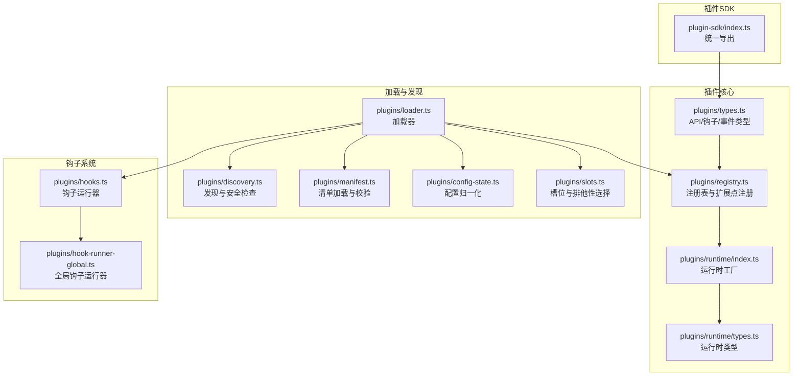
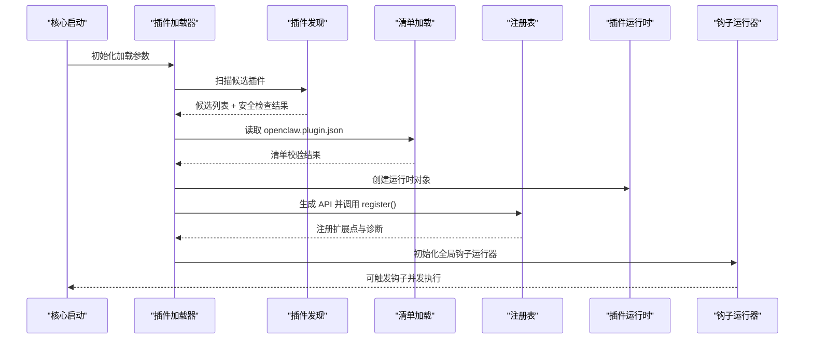
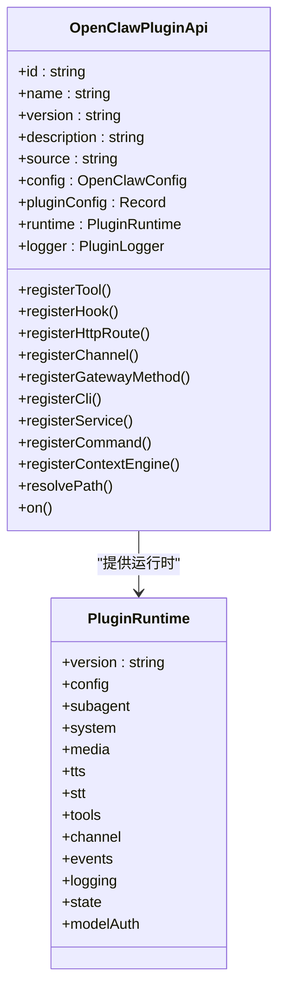
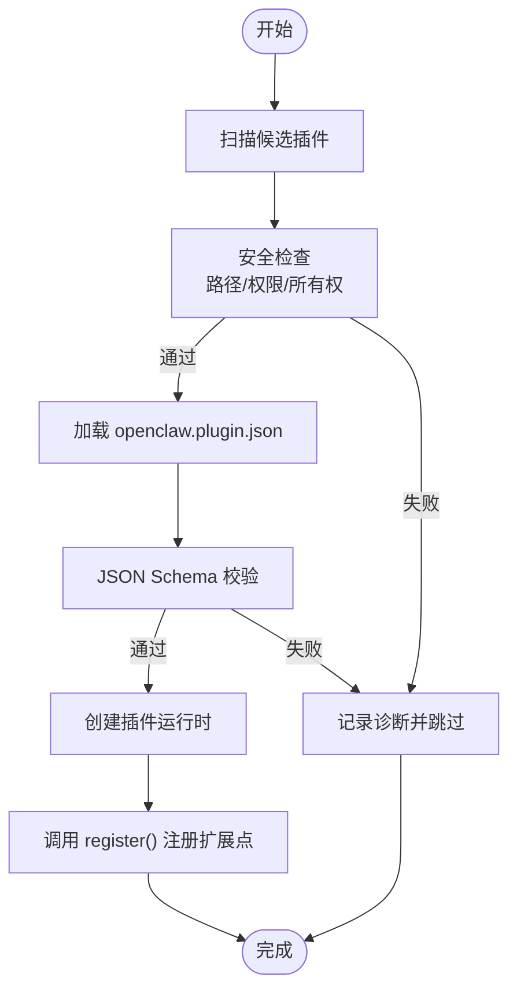
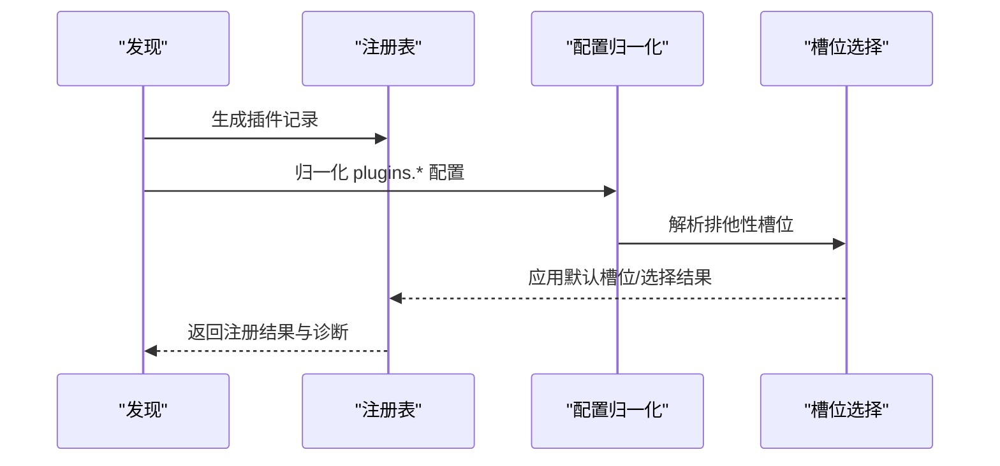
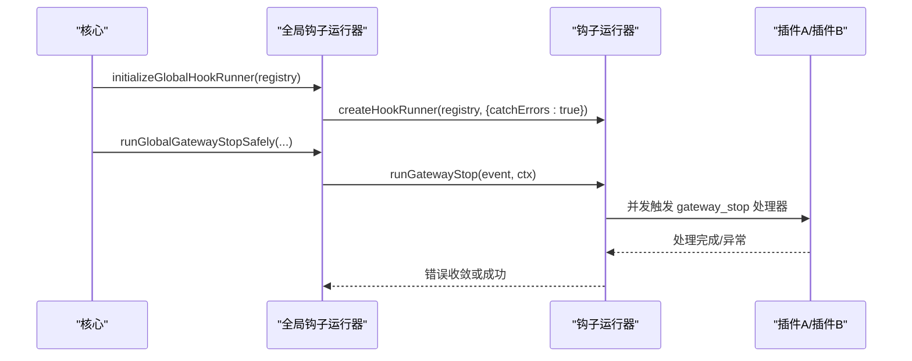
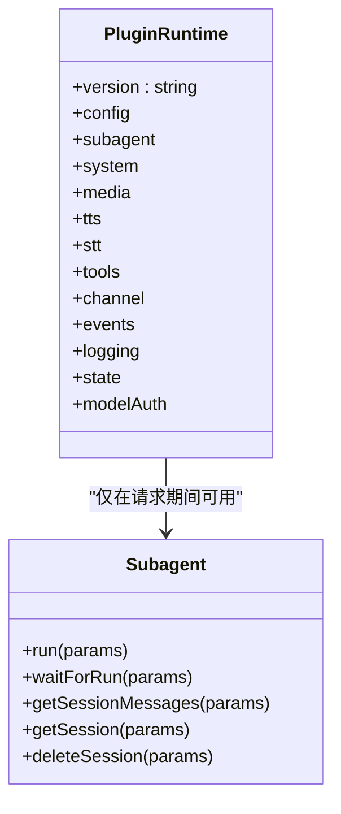
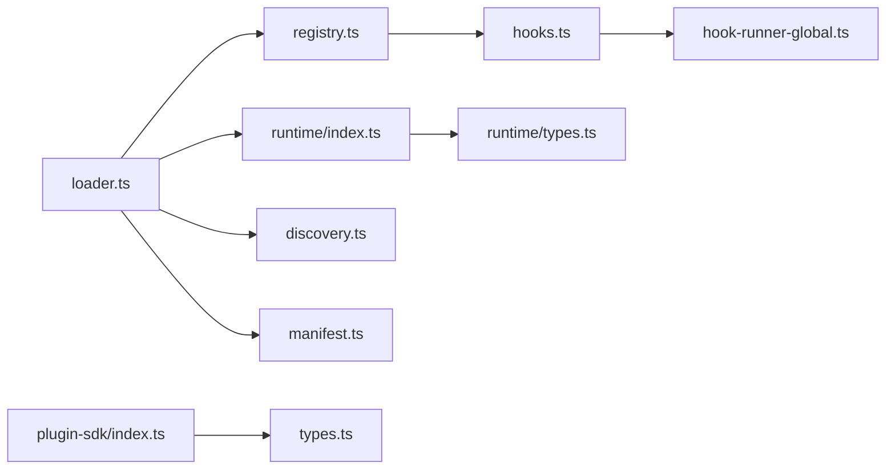

# 插件架构设计

<cite>
**本文档引用的文件**
- [src/plugin-sdk/index.ts](file://src/plugin-sdk/index.ts)
- [src/plugins/types.ts](file://src/plugins/types.ts)
- [src/plugins/registry.ts](file://src/plugins/registry.ts)
- [src/plugins/loader.ts](file://src/plugins/loader.ts)
- [src/plugins/runtime/index.ts](file://src/plugins/runtime/index.ts)
- [src/plugins/runtime/types.ts](file://src/plugins/runtime/types.ts)
- [src/plugins/hooks.ts](file://src/plugins/hooks.ts)
- [src/plugins/hook-runner-global.ts](file://src/plugins/hook-runner-global.ts)
- [src/plugins/discovery.ts](file://src/plugins/discovery.ts)
- [src/plugins/config-state.ts](file://src/plugins/config-state.ts)
- [src/plugins/slots.ts](file://src/plugins/slots.ts)
- [src/plugins/manifest.ts](file://src/plugins/manifest.ts)
- [docs/plugins/manifest.md](file://docs/plugins/manifest.md)
- [docs/gateway/sandboxing.md](file://docs/gateway/sandboxing.md)
- [src/plugin-sdk/runtime-store.ts](file://src/plugin-sdk/runtime-store.ts)
</cite>

## 目录
1. [引言](#引言)
2. [项目结构](#项目结构)
3. [核心组件](#核心组件)
4. [架构总览](#架构总览)
5. [详细组件分析](#详细组件分析)
6. [依赖关系分析](#依赖关系分析)
7. [性能考量](#性能考量)
8. [故障排查指南](#故障排查指南)
9. [结论](#结论)
10. [附录](#附录)

## 引言
本文件面向 OpenClaw 插件系统的架构设计与实现，聚焦以下目标：
- 插件加载机制：自动发现、清单校验、安全路径检查、模块解析与缓存。
- 运行时环境与生命周期：运行时对象创建、请求上下文隔离、子代理运行能力、日志与事件系统。
- 接口规范：插件 API、钩子系统、HTTP 路由注册、命令与服务扩展点。
- 插件发现与注册：清单驱动的发现、显式允许/拒绝列表、槽位选择与排他性插件。
- 插件间通信：内部钩子系统、全局钩子运行器、事件广播与错误处理。
- 隔离与沙箱：运行时工具访问限制、模型鉴权封装、网关侧沙箱策略。

## 项目结构
OpenClaw 的插件体系围绕“清单驱动 + 类型安全 + 生命周期管理”展开，核心目录与职责如下：
- 插件 SDK 汇总导出：统一对外暴露插件开发所需的类型、工具函数与适配器。
- 插件类型与钩子：定义插件 API、钩子名称集合、事件载荷与处理签名。
- 注册表与运行时：构建注册表、注册各类扩展点、创建插件运行时对象。
- 加载器与发现：扫描候选插件、读取清单、校验配置、执行注册回调。
- 钩子运行器：集中管理钩子注册与触发，支持并发执行与错误收敛。
- 配置与槽位：标准化插件配置、允许/拒绝列表、排他性槽位选择。
- 安全与沙箱：边界文件读取、路径权限检查、运行时工具访问约束、网关沙箱策略。

**图表来源**
- [src/plugin-sdk/index.ts:1-826](file://src/plugin-sdk/index.ts#L1-L826)
- [src/plugins/types.ts:1-893](file://src/plugins/types.ts#L1-L893)
- [src/plugins/registry.ts:1-625](file://src/plugins/registry.ts#L1-L625)
- [src/plugins/runtime/index.ts:1-90](file://src/plugins/runtime/index.ts#L1-L90)
- [src/plugins/runtime/types.ts:1-64](file://src/plugins/runtime/types.ts#L1-L64)
- [src/plugins/loader.ts:1-829](file://src/plugins/loader.ts#L1-L829)
- [src/plugins/discovery.ts:1-733](file://src/plugins/discovery.ts#L1-L733)
- [src/plugins/manifest.ts:45-88](file://src/plugins/manifest.ts#L45-L88)
- [src/plugins/config-state.ts:1-287](file://src/plugins/config-state.ts#L1-L287)
- [src/plugins/slots.ts:1-56](file://src/plugins/slots.ts#L1-L56)
- [src/plugins/hooks.ts:184-723](file://src/plugins/hooks.ts#L184-L723)
- [src/plugins/hook-runner-global.ts:1-104](file://src/plugins/hook-runner-global.ts#L1-L104)

**章节来源**
- [src/plugin-sdk/index.ts:1-826](file://src/plugin-sdk/index.ts#L1-L826)
- [src/plugins/types.ts:1-893](file://src/plugins/types.ts#L1-L893)
- [src/plugins/registry.ts:1-625](file://src/plugins/registry.ts#L1-L625)
- [src/plugins/loader.ts:1-829](file://src/plugins/loader.ts#L1-L829)
- [src/plugins/discovery.ts:1-733](file://src/plugins/discovery.ts#L1-L733)
- [src/plugins/manifest.ts:45-88](file://src/plugins/manifest.ts#L45-L88)
- [src/plugins/config-state.ts:1-287](file://src/plugins/config-state.ts#L1-L287)
- [src/plugins/slots.ts:1-56](file://src/plugins/slots.ts#L1-L56)
- [src/plugins/hooks.ts:184-723](file://src/plugins/hooks.ts#L184-L723)
- [src/plugins/hook-runner-global.ts:1-104](file://src/plugins/hook-runner-global.ts#L1-L104)

## 核心组件
- 插件 API 与类型
  - 提供插件注册入口（工具、钩子、HTTP 路由、通道、网关方法、CLI、服务、命令、上下文引擎）。
  - 定义完整的钩子名称集、事件载荷与处理签名，覆盖模型解析、提示构建、消息收发、工具调用、会话与子代理生命周期等。
- 注册表与扩展点
  - 统一记录插件已注册的工具、钩子、HTTP 路由、通道、提供方、网关方法、CLI 命令、服务与诊断信息。
  - 支持重复注册检测、冲突告警与错误诊断。
- 运行时环境
  - 创建插件运行时对象，提供配置、系统、媒体、TTS/STT、工具、通道、事件、日志、状态目录与模型鉴权封装。
  - 子代理运行能力仅在网关请求期间可用，避免越界使用。
- 加载器与发现
  - 自动扫描内置与工作区插件目录，读取清单并进行安全路径检查，按配置决定启用状态与加载顺序。
  - 支持缓存键构建、重复候选去重与诊断收集。
- 钩子系统
  - 内部钩子注册与触发，支持并发执行（fire-and-forget）、错误收敛与可选的严格模式。
  - 全局钩子运行器在插件加载完成后初始化，便于跨模块安全触发。
- 配置与槽位
  - 归一化插件配置（启用、允许/拒绝、加载路径、槽位），支持排他性插件（如内存插件）的选择与默认槽位回退。
- 清单与验证
  - 强制要求每个插件提供 openclaw.plugin.json，包含 id 与 JSON Schema；缺失或非法将阻断配置校验。
- 沙箱与隔离
  - 网关侧沙箱策略控制工具执行容器化，限制文件系统与网络访问；插件运行时对模型鉴权进行封装，防止跨插件凭据泄漏。

**章节来源**
- [src/plugins/types.ts:248-306](file://src/plugins/types.ts#L248-L306)
- [src/plugins/registry.ts:129-142](file://src/plugins/registry.ts#L129-L142)
- [src/plugins/runtime/index.ts:52-87](file://src/plugins/runtime/index.ts#L52-L87)
- [src/plugins/loader.ts:1-200](file://src/plugins/loader.ts#L1-L200)
- [src/plugins/hooks.ts:184-723](file://src/plugins/hooks.ts#L184-L723)
- [src/plugins/hook-runner-global.ts:36-52](file://src/plugins/hook-runner-global.ts#L36-L52)
- [src/plugins/config-state.ts:90-104](file://src/plugins/config-state.ts#L90-L104)
- [src/plugins/slots.ts:22-31](file://src/plugins/slots.ts#L22-L31)
- [src/plugins/manifest.ts:45-88](file://src/plugins/manifest.ts#L45-L88)
- [docs/plugins/manifest.md:1-76](file://docs/plugins/manifest.md#L1-L76)
- [docs/gateway/sandboxing.md:1-260](file://docs/gateway/sandboxing.md#L1-L260)

## 架构总览
下图展示插件系统从“发现与加载”到“运行时执行”的端到端流程：

**图表来源**
- [src/plugins/loader.ts:1-200](file://src/plugins/loader.ts#L1-L200)
- [src/plugins/discovery.ts:1-200](file://src/plugins/discovery.ts#L1-L200)
- [src/plugins/manifest.ts:45-88](file://src/plugins/manifest.ts#L45-L88)
- [src/plugins/registry.ts:575-624](file://src/plugins/registry.ts#L575-L624)
- [src/plugins/runtime/index.ts:52-87](file://src/plugins/runtime/index.ts#L52-L87)
- [src/plugins/hook-runner-global.ts:36-52](file://src/plugins/hook-runner-global.ts#L36-L52)

## 详细组件分析

### 插件接口规范与生命周期
- 必需接口定义
  - 插件定义：id、name、description、version、kind、configSchema、register、activate。
  - 插件 API：工具注册、钩子注册、HTTP 路由注册、通道注册、网关方法注册、CLI 注册、服务注册、命令注册、上下文引擎注册、路径解析、生命周期钩子 on。
- 可选功能与扩展点
  - 工具：支持单个或工厂函数形式，可声明别名与可选性。
  - 钩子：支持内部事件与类型化钩子，带优先级与策略（如禁止提示注入）。
  - HTTP 路由：支持精确匹配与前缀匹配，认证策略（gateway 或 plugin），冲突检测与替换规则。
  - 通道与提供方：注册渠道适配器与模型提供方，含鉴权方法与模型配置。
  - CLI：注册命令与帮助信息，支持多命令批量注册。
  - 服务：生命周期 start/stop，状态目录与日志接入。
  - 命令：绕过 LLM 的简单命令处理，先于内置命令与代理调用。
  - 上下文引擎：排他性槽位注册，仅一个生效。
- 生命周期管理
  - 加载阶段：发现 → 清单校验 → 运行时创建 → register 回调 → 注册扩展点 → 诊断收集。
  - 激活阶段：初始化全局钩子运行器，插件进入可触发状态。
  - 运行阶段：请求上下文中提供子代理运行能力与通道访问；钩子并发触发；错误收敛与日志输出。

**图表来源**
- [src/plugins/types.ts:263-306](file://src/plugins/types.ts#L263-L306)
- [src/plugins/runtime/types.ts:51-63](file://src/plugins/runtime/types.ts#L51-L63)

**章节来源**
- [src/plugins/types.ts:248-306](file://src/plugins/types.ts#L248-L306)
- [src/plugins/runtime/types.ts:1-64](file://src/plugins/runtime/types.ts#L1-L64)

### 插件加载机制与安全
- 自动扫描与候选生成
  - 支持内置插件目录、配置扩展目录与自定义额外路径；缓存窗口短以合并启动期突发刷新。
  - 对路径进行安全检查：禁止源逃逸根目录、禁止世界可写、可疑所有权等。
- 清单与配置校验
  - 强制要求 openclaw.plugin.json，包含 id 与 JSON Schema；非法清单直接阻断。
  - 插件配置通过 JSON Schema 校验，错误转为诊断信息。
- 模块解析与 SDK 别名
  - 支持 openclaw/plugin-sdk 的子路径别名解析，兼容 dist 与 src 两套产物。
- 缓存与重用
  - 基于工作区路径与插件配置生成缓存键，避免重复加载。

**图表来源**
- [src/plugins/discovery.ts:117-200](file://src/plugins/discovery.ts#L117-L200)
- [src/plugins/manifest.ts:45-88](file://src/plugins/manifest.ts#L45-L88)
- [src/plugins/loader.ts:167-194](file://src/plugins/loader.ts#L167-L194)

**章节来源**
- [src/plugins/discovery.ts:1-200](file://src/plugins/discovery.ts#L1-L200)
- [src/plugins/manifest.ts:45-88](file://src/plugins/manifest.ts#L45-L88)
- [src/plugins/loader.ts:167-194](file://src/plugins/loader.ts#L167-L194)

### 插件发现与注册机制
- 发现与注册
  - 发现阶段：遍历候选目录，读取清单，生成插件记录与来源信息。
  - 注册阶段：通过注册表 API 将工具、钩子、HTTP 路由、通道、提供方、网关方法、CLI、服务、命令等登记入册。
  - 冲突与重复：HTTP 路由重叠、提供方重复、命令重复均产生诊断警告或错误。
- 配置与启用状态
  - 归一化插件配置，支持启用/禁用、允许/拒绝列表、加载路径与槽位。
  - 显式配置优先，未显式配置时测试环境默认关闭内存槽位。
- 槽位与排他性插件
  - 通过插件 kind 与槽位映射，确定默认槽位；仅允许一个排他性插件生效。

**图表来源**
- [src/plugins/registry.ts:185-624](file://src/plugins/registry.ts#L185-L624)
- [src/plugins/config-state.ts:90-104](file://src/plugins/config-state.ts#L90-L104)
- [src/plugins/slots.ts:22-31](file://src/plugins/slots.ts#L22-L31)

**章节来源**
- [src/plugins/registry.ts:185-624](file://src/plugins/registry.ts#L185-L624)
- [src/plugins/config-state.ts:90-104](file://src/plugins/config-state.ts#L90-L104)
- [src/plugins/slots.ts:22-31](file://src/plugins/slots.ts#L22-L31)

### 插件间通信：事件系统、钩子机制与共享状态
- 内部钩子系统
  - 通过 registerInternalHook 注册处理器，支持通用事件类型与具体动作事件。
  - 触发时按事件键分发，空数组不触发，清理空数组。
- 全局钩子运行器
  - 在插件加载完成后初始化，提供 hasHooks/getGlobalHookRunner/getGlobalPluginRegistry 等查询接口。
  - runGlobalGatewayStopSafely 提供安全的 gateway_stop 触发，错误可回调或降级记录。
- 钩子运行器
  - runVoidHook 并发执行多个处理器，catchErrors 控制是否抛错；错误统一格式化并记录。
  - typed hooks 支持策略约束（如禁止提示注入），并记录诊断。
- 共享状态管理
  - 运行时对象提供 events/logging/state 等共享能力；插件通过 API 获取运行时上下文。
  - 子代理运行能力受请求上下文约束，非请求期间不可用。

**图表来源**
- [src/plugins/hook-runner-global.ts:36-95](file://src/plugins/hook-runner-global.ts#L36-L95)
- [src/plugins/hooks.ts:689-723](file://src/plugins/hooks.ts#L689-L723)

**章节来源**
- [src/plugins/hook-runner-global.ts:1-104](file://src/plugins/hook-runner-global.ts#L1-L104)
- [src/plugins/hooks.ts:184-723](file://src/plugins/hooks.ts#L184-L723)

### 插件运行时环境与生命周期
- 运行时对象
  - 版本号、配置、系统、媒体、TTS/STT、工具、通道、事件、日志、状态目录与模型鉴权封装。
  - 子代理运行能力在非请求期间不可用，避免越界调用。
- 请求上下文隔离
  - 运行时通过 API 注入，插件在每次请求中获得独立上下文（会话键、消息通道、请求者标识等）。
- 生命周期钩子
  - on(hookName, handler, { priority }) 支持优先级排序与策略约束（如禁止提示注入）。

**图表来源**
- [src/plugins/runtime/index.ts:52-87](file://src/plugins/runtime/index.ts#L52-L87)
- [src/plugins/runtime/types.ts:8-63](file://src/plugins/runtime/types.ts#L8-L63)

**章节来源**
- [src/plugins/runtime/index.ts:1-90](file://src/plugins/runtime/index.ts#L1-L90)
- [src/plugins/runtime/types.ts:1-64](file://src/plugins/runtime/types.ts#L1-L64)

### 插件隔离与沙箱机制
- 运行时工具访问限制
  - 模型鉴权封装：插件仅能指定 provider/model，核心自动选择凭证，防止跨插件凭据访问。
  - 子代理运行能力仅在请求上下文中可用，避免插件滥用。
- 网关侧沙箱策略
  - 工具执行容器化，可配置模式（off/non-main/all）、作用域（session/agent/shared）、工作区访问（none/ro/rw）。
  - 浏览器沙箱可选，容器网络与启动参数可定制，默认限制网络与图形特性。
  - 绑定挂载需谨慎，系统阻止危险来源，建议只读挂载敏感数据。
- 插件 SDK 的安全约束
  - 禁止导入 monolithic openclaw/plugin-sdk，必须使用子路径（如 /core、/channel 等）。

**章节来源**
- [src/plugins/runtime/index.ts:66-83](file://src/plugins/runtime/index.ts#L66-L83)
- [docs/gateway/sandboxing.md:1-260](file://docs/gateway/sandboxing.md#L1-L260)
- [scripts/check-no-monolithic-plugin-sdk-entry-imports.ts:73-103](file://scripts/check-no-monolithic-plugin-sdk-entry-imports.ts#L73-L103)

## 依赖关系分析
- 组件耦合与内聚
  - 插件 API 与运行时高度内聚，通过注册表解耦扩展点注册与触发。
  - 钩子系统通过全局运行器与内部钩子解耦插件间通信。
  - 发现与清单校验与加载器强耦合，确保配置与安全前置。
- 外部依赖与集成点
  - jiti 模块用于动态加载插件模块。
  - 边界文件读取与路径安全工具保障清单读取安全。
  - Docker 容器用于工具执行沙箱化（网关侧）。

**图表来源**
- [src/plugins/loader.ts:1-200](file://src/plugins/loader.ts#L1-L200)
- [src/plugins/registry.ts:1-625](file://src/plugins/registry.ts#L1-L625)
- [src/plugins/runtime/index.ts:1-90](file://src/plugins/runtime/index.ts#L1-L90)
- [src/plugins/discovery.ts:1-200](file://src/plugins/discovery.ts#L1-L200)
- [src/plugins/manifest.ts:45-88](file://src/plugins/manifest.ts#L45-L88)
- [src/plugins/hooks.ts:184-723](file://src/plugins/hooks.ts#L184-L723)
- [src/plugins/hook-runner-global.ts:1-104](file://src/plugins/hook-runner-global.ts#L1-L104)
- [src/plugin-sdk/index.ts:1-826](file://src/plugin-sdk/index.ts#L1-L826)
- [src/plugins/types.ts:1-893](file://src/plugins/types.ts#L1-L893)
- [src/plugins/runtime/types.ts:1-64](file://src/plugins/runtime/types.ts#L1-L64)

**章节来源**
- [src/plugins/loader.ts:1-200](file://src/plugins/loader.ts#L1-L200)
- [src/plugins/registry.ts:1-625](file://src/plugins/registry.ts#L1-L625)
- [src/plugins/runtime/index.ts:1-90](file://src/plugins/runtime/index.ts#L1-L90)
- [src/plugins/discovery.ts:1-200](file://src/plugins/discovery.ts#L1-L200)
- [src/plugins/manifest.ts:45-88](file://src/plugins/manifest.ts#L45-L88)
- [src/plugins/hooks.ts:184-723](file://src/plugins/hooks.ts#L184-L723)
- [src/plugins/hook-runner-global.ts:1-104](file://src/plugins/hook-runner-global.ts#L1-L104)
- [src/plugin-sdk/index.ts:1-826](file://src/plugin-sdk/index.ts#L1-L826)
- [src/plugins/types.ts:1-893](file://src/plugins/types.ts#L1-L893)
- [src/plugins/runtime/types.ts:1-64](file://src/plugins/runtime/types.ts#L1-L64)

## 性能考量
- 并发钩子执行
  - runVoidHook 并发触发多个处理器，提升事件处理吞吐；注意错误收敛与日志开销。
- 缓存与去重
  - 插件发现与清单加载具备缓存机制，减少重复 IO；注册表对重复注册与冲突进行快速判定。
- 路由与命令注册
  - HTTP 路由与命令注册在加载期完成，运行期仅做查找与转发，降低请求路径开销。
- 子代理运行
  - 子代理运行能力仅在请求上下文中可用，避免常驻资源占用。

[本节为通用指导，无需特定文件来源]

## 故障排查指南
- 清单与配置错误
  - 缺失 openclaw.plugin.json 或 JSON Schema 不合法将阻断配置校验；检查清单字段与 schema 结构。
- 路由冲突
  - HTTP 路由重叠或认证策略冲突会产生诊断错误；根据诊断信息调整路由或替换策略。
- 提供方重复
  - 同一提供方 ID 重复注册会报错；检查插件提供的 provider 列表。
- 命令重复
  - 命令名称重复会报错；确保命令唯一性。
- 钩子策略约束
  - typed hooks 的提示注入被禁止时会记录诊断；检查 plugins.entries.<id>.hooks.allowPromptInjection。
- 安全路径问题
  - 源逃逸根目录、世界可写、可疑所有权等会被阻断；修正目录权限与归属。
- 网关停止钩子
  - gateway_stop 钩子失败会被降级记录；检查插件处理器日志与依赖。

**章节来源**
- [src/plugins/manifest.ts:45-88](file://src/plugins/manifest.ts#L45-L88)
- [src/plugins/registry.ts:318-400](file://src/plugins/registry.ts#L318-L400)
- [src/plugins/registry.ts:430-457](file://src/plugins/registry.ts#L430-L457)
- [src/plugins/registry.ts:487-517](file://src/plugins/registry.ts#L487-L517)
- [src/plugins/discovery.ts:117-200](file://src/plugins/discovery.ts#L117-L200)
- [src/plugins/hook-runner-global.ts:77-95](file://src/plugins/hook-runner-global.ts#L77-L95)

## 结论
OpenClaw 插件系统以“清单驱动 + 类型安全 + 生命周期管理”为核心，结合严格的发现与安全检查、灵活的扩展点注册与钩子系统，并通过运行时封装与网关沙箱策略实现可控的隔离与可观测性。该设计既满足生态扩展需求，又兼顾安全性与性能，适合在复杂场景下稳定演进。

[本节为总结性内容，无需特定文件来源]

## 附录
- 插件清单要求
  - 必须提供 openclaw.plugin.json，包含 id 与 JSON Schema；未知渠道或插件 id 会触发错误。
- 运行时工具访问
  - 模型鉴权封装防止跨插件凭据访问；子代理运行能力仅在请求上下文中可用。
- 沙箱策略
  - 工具执行容器化可配置模式、作用域与工作区访问；浏览器沙箱可选且默认限制网络与图形特性。

**章节来源**
- [docs/plugins/manifest.md:1-76](file://docs/plugins/manifest.md#L1-L76)
- [src/plugins/runtime/index.ts:66-83](file://src/plugins/runtime/index.ts#L66-L83)
- [docs/gateway/sandboxing.md:1-260](file://docs/gateway/sandboxing.md#L1-L260)