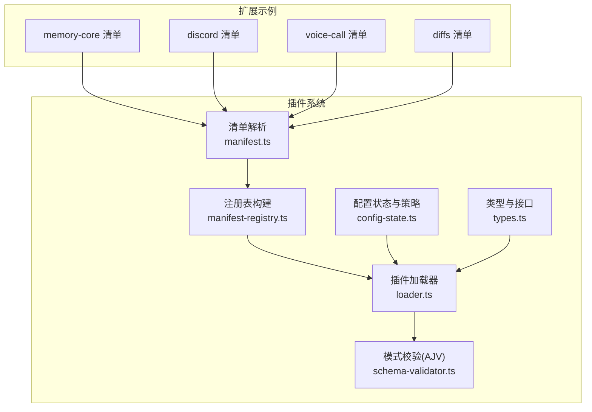
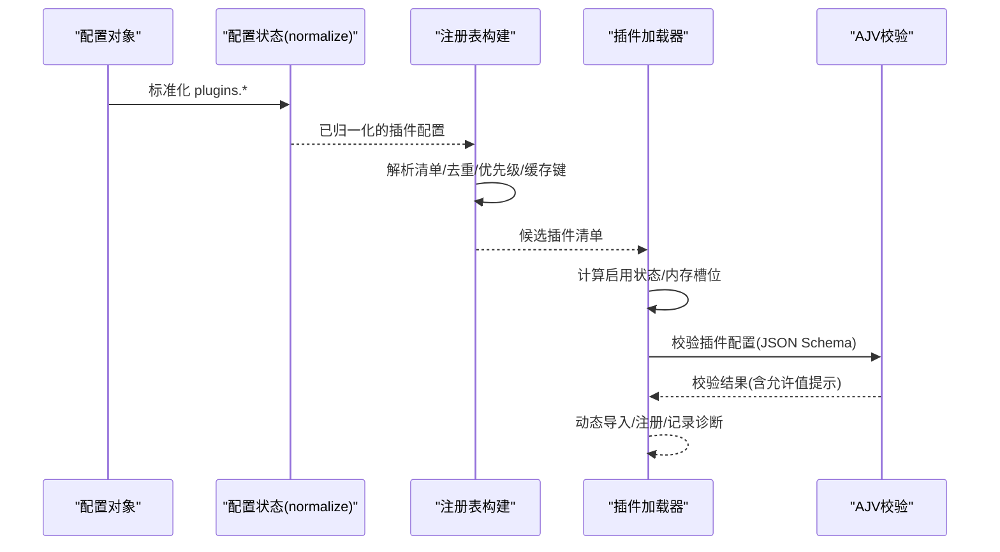
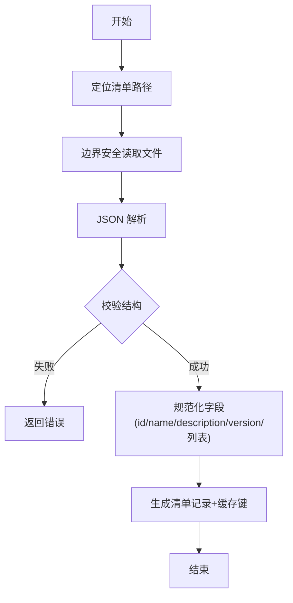
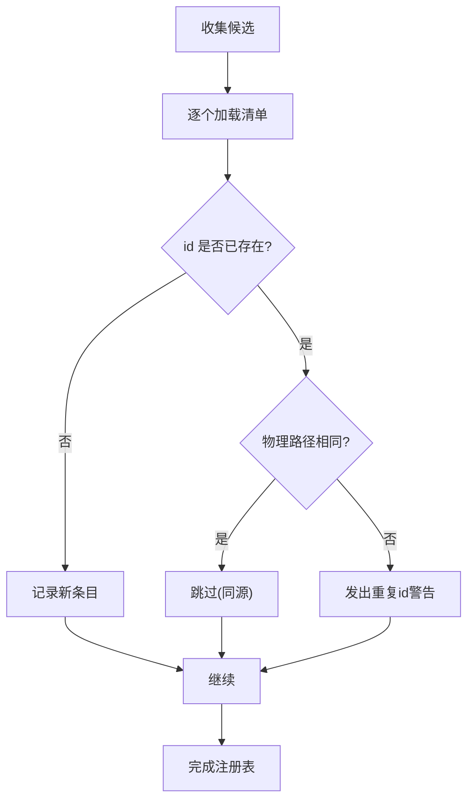
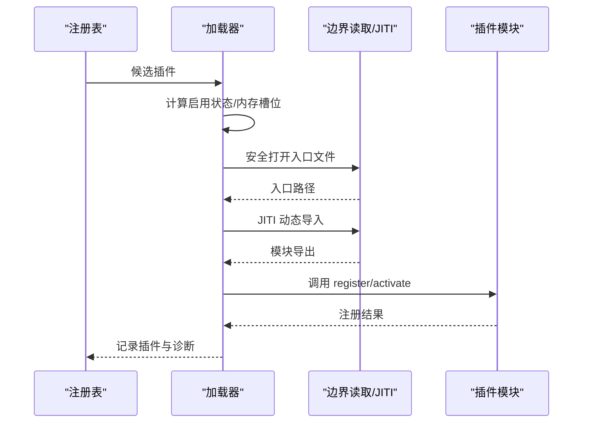
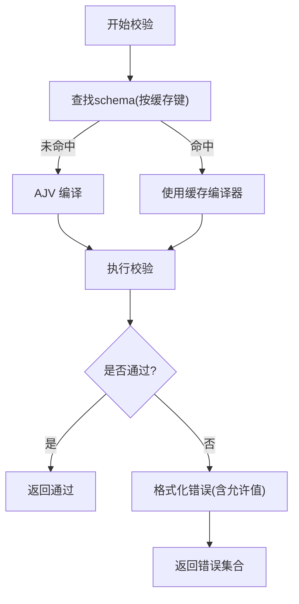
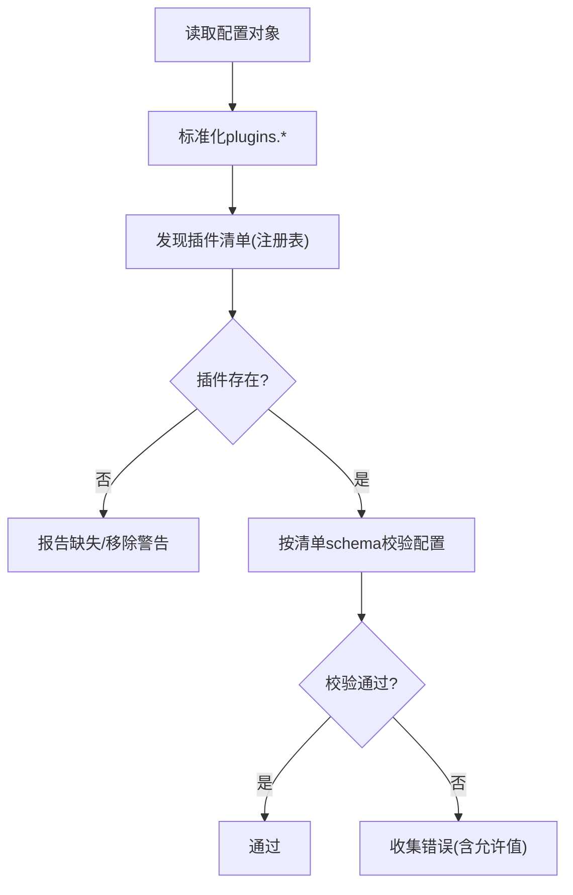
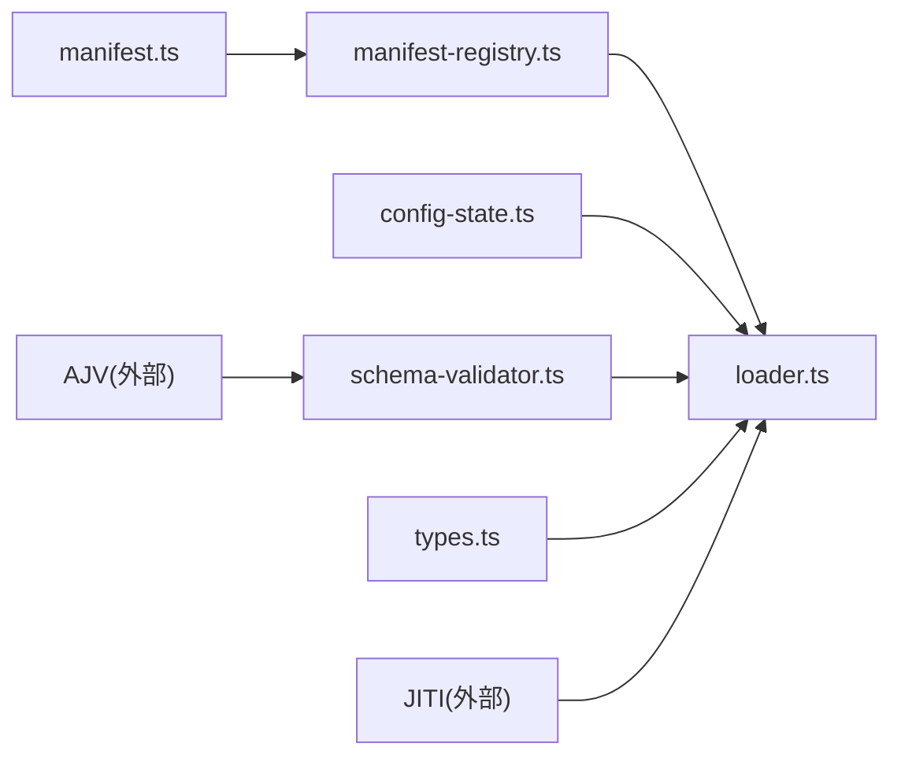

# 插件清单和配置

<cite>
**本文档引用的文件**
- [manifest.ts](file://src/plugins/manifest.ts)
- [manifest-registry.ts](file://src/plugins/manifest-registry.ts)
- [loader.ts](file://src/plugins/loader.ts)
- [config-state.ts](file://src/plugins/config-state.ts)
- [schema-validator.ts](file://src/plugins/schema-validator.ts)
- [types.ts](file://src/plugins/types.ts)
- [config.plugin-validation.test.ts](file://src/config/config.plugin-validation.test.ts)
- [validation.ts](file://src/config/validation.ts)
- [openclaw.plugin.json（memory-core）](file://extensions/memory-core/openclaw.plugin.json)
- [openclaw.plugin.json（discord）](file://extensions/discord/openclaw.plugin.json)
- [openclaw.plugin.json（voice-call）](file://extensions/voice-call/openclaw.plugin.json)
- [openclaw.plugin.json（diffs）](file://extensions/diffs/openclaw.plugin.json)
</cite>

## 目录
1. [简介](#简介)
2. [项目结构](#项目结构)
3. [核心组件](#核心组件)
4. [架构总览](#架构总览)
5. [详细组件分析](#详细组件分析)
6. [依赖关系分析](#依赖关系分析)
7. [性能考量](#性能考量)
8. [故障排查指南](#故障排查指南)
9. [结论](#结论)
10. [附录：清单与配置模板](#附录清单与配置模板)

## 简介
本文件系统性阐述 OpenClaw 的插件清单与配置体系，覆盖以下主题：
- 插件清单文件的结构与字段语义（元数据、能力声明、配置模式）
- 配置模式的定义与校验机制（必填项、可选项、默认值、枚举约束）
- 插件注册表的工作原理（清单解析、版本与缓存、冲突与优先级）
- 插件配置的动态更新与运行时修改路径
- 完整的清单与配置示例及常见错误诊断

## 项目结构
OpenClaw 将插件系统拆分为“清单解析”“注册表管理”“加载器”“配置状态与策略”“模式校验”等模块，并在扩展目录中提供多种插件示例。

图示来源
- [manifest.ts:11-119](file://src/plugins/manifest.ts#L11-L119)
- [manifest-registry.ts:135-261](file://src/plugins/manifest-registry.ts#L135-L261)
- [loader.ts:447-820](file://src/plugins/loader.ts#L447-L820)
- [config-state.ts:90-104](file://src/plugins/config-state.ts#L90-L104)
- [schema-validator.ts:133-151](file://src/plugins/schema-validator.ts#L133-L151)
- [types.ts:248-306](file://src/plugins/types.ts#L248-L306)

章节来源
- [manifest.ts:1-199](file://src/plugins/manifest.ts#L1-L199)
- [manifest-registry.ts:1-262](file://src/plugins/manifest-registry.ts#L1-L262)
- [loader.ts:1-829](file://src/plugins/loader.ts#L1-L829)
- [config-state.ts:1-287](file://src/plugins/config-state.ts#L1-L287)
- [schema-validator.ts:1-151](file://src/plugins/schema-validator.ts#L1-L151)
- [types.ts:1-893](file://src/plugins/types.ts#L1-L893)

## 核心组件
- 插件清单模型与解析：定义清单字段、校验与规范化流程，支持 uiHints、channels/providers/skills 能力标注。
- 注册表：聚合候选插件，执行去重、来源优先级、schema 缓存键生成、重复 id 警告。
- 加载器：根据配置决定启用/禁用，边界安全检查，JITI 动态导入，注册阶段 API 创建与调用。
- 配置状态：标准化 plugins.* 配置，计算有效启用状态与内存槽位决策。
- 模式校验：基于 AJV 的 JSON Schema 校验，缓存编译结果，格式化错误并注入允许值提示。

章节来源
- [manifest.ts:11-119](file://src/plugins/manifest.ts#L11-L119)
- [manifest-registry.ts:23-133](file://src/plugins/manifest-registry.ts#L23-L133)
- [loader.ts:447-820](file://src/plugins/loader.ts#L447-L820)
- [config-state.ts:6-104](file://src/plugins/config-state.ts#L6-L104)
- [schema-validator.ts:133-151](file://src/plugins/schema-validator.ts#L133-L151)

## 架构总览
下图展示从配置到插件加载与校验的关键流程：

图示来源
- [config-state.ts:90-104](file://src/plugins/config-state.ts#L90-L104)
- [manifest-registry.ts:135-261](file://src/plugins/manifest-registry.ts#L135-L261)
- [loader.ts:569-820](file://src/plugins/loader.ts#L569-L820)
- [schema-validator.ts:133-151](file://src/plugins/schema-validator.ts#L133-L151)

## 详细组件分析

### 组件A：插件清单模型与解析
- 字段定义
  - 必填：id、configSchema
  - 可选：kind、name、description、version、channels、providers、skills、uiHints
  - uiHints 支持 label/help/tags/advanced/sensitive/placeholder 等元信息
- 解析流程
  - 定位清单文件，边界安全读取，JSON 解析，字段校验与规范化
  - 生成清单记录并附带 schemaCacheKey（基于清单 mtime 或路径）

图示来源
- [manifest.ts:35-119](file://src/plugins/manifest.ts#L35-L119)

章节来源
- [manifest.ts:11-119](file://src/plugins/manifest.ts#L11-L119)

### 组件B：插件注册表与冲突解决
- 来源优先级：config > workspace > global > bundled
- 去重与冲突
  - 同 id 多来源：若物理路径相同则忽略；否则发出警告并以更高优先级来源为准
  - schema 缓存键：基于清单路径与 mtime，避免频繁重载导致重复编译
- 重复 id 警告与来源匹配

图示来源
- [manifest-registry.ts:170-251](file://src/plugins/manifest-registry.ts#L170-L251)

章节来源
- [manifest-registry.ts:15-262](file://src/plugins/manifest-registry.ts#L15-L262)

### 组件C：插件加载与动态导入
- 启用策略
  - 基于 plugins.enabled、allow/deny、entries.enabled、origin、bundled 默认集
  - 内存插件槽位：memory slot 决策，确保唯一且符合策略
- 边界安全与入口解析
  - 使用边界读取防止越界与别名检查
  - JITI 动态导入，支持别名映射与扩展子路径
- 注册阶段
  - 创建 API 对象（含 config/pluginConfig/hookPolicy），调用 register/activate
  - 记录诊断（错误/警告），支持缓存与激活

图示来源
- [loader.ts:569-820](file://src/plugins/loader.ts#L569-L820)
- [config-state.ts:189-256](file://src/plugins/config-state.ts#L189-L256)

章节来源
- [loader.ts:447-820](file://src/plugins/loader.ts#L447-L820)
- [config-state.ts:189-287](file://src/plugins/config-state.ts#L189-L287)

### 组件D：配置模式定义与验证
- 模式来源
  - 清单中的 configSchema（JSON Schema）
  - 可选 uiHints 提供 UI 展示与帮助
- 校验机制
  - AJV 编译缓存，一次性编译多次复用
  - 错误格式化：路径、消息、允许值摘要
  - 在加载阶段对插件配置进行校验，未通过则记录错误并禁用插件

图示来源
- [schema-validator.ts:133-151](file://src/plugins/schema-validator.ts#L133-L151)
- [loader.ts:745-755](file://src/plugins/loader.ts#L745-L755)

章节来源
- [schema-validator.ts:1-151](file://src/plugins/schema-validator.ts#L1-L151)
- [loader.ts:175-194](file://src/plugins/loader.ts#L175-L194)

### 组件E：配置对象与插件校验集成
- 配置对象校验
  - 校验 plugins.* 字段，报告缺失/不存在的插件引用（如 load 路径、entries、allow/deny、slots）
  - 对移除或陈旧的插件 id 发出警告而非阻断
- 插件配置校验
  - 若插件启用或存在配置，则使用其 configSchema 进行校验
  - 未启用但有配置时发出警告

图示来源
- [config.plugin-validation.test.ts:133-167](file://src/config/config.plugin-validation.test.ts#L133-L167)
- [validation.ts:549-604](file://src/config/validation.ts#L549-L604)

章节来源
- [config.plugin-validation.test.ts:1-200](file://src/config/config.plugin-validation.test.ts#L1-L200)
- [validation.ts:549-604](file://src/config/validation.ts#L549-L604)

## 依赖关系分析
- 模块耦合
  - loader 依赖 manifest-registry、config-state、schema-validator、types
  - manifest-registry 依赖 manifest、config-state、path-safety
  - schema-validator 依赖 ajv，受缓存键影响
- 关键依赖链
  - 清单解析 → 注册表构建 → 加载器 → 模式校验 → 注册阶段
- 外部依赖
  - AJV 用于 JSON Schema 校验
  - JITI 用于动态导入与别名映射

图示来源
- [loader.ts:10-34](file://src/plugins/loader.ts#L10-L34)
- [manifest-registry.ts:1-9](file://src/plugins/manifest-registry.ts#L1-L9)
- [schema-validator.ts:1-27](file://src/plugins/schema-validator.ts#L1-L27)

章节来源
- [loader.ts:1-829](file://src/plugins/loader.ts#L1-L829)
- [manifest-registry.ts:1-262](file://src/plugins/manifest-registry.ts#L1-L262)
- [schema-validator.ts:1-151](file://src/plugins/schema-validator.ts#L1-L151)

## 性能考量
- 清单缓存
  - 注册表与模式校验均使用缓存键，减少重复编译与 IO
  - 可通过环境变量控制清单缓存 TTL 与禁用
- 快速路径
  - 对捆绑内存插件在槽位决策前快速禁用，避免导入重型模块
- 延迟初始化
  - 运行时组件按需创建，启动路径避免无谓加载

章节来源
- [manifest-registry.ts:47-77](file://src/plugins/manifest-registry.ts#L47-L77)
- [loader.ts:636-653](file://src/plugins/loader.ts#L636-L653)

## 故障排查指南
- 常见问题与定位
  - 清单路径不存在或越界：检查清单路径与边界读取规则
  - 重复 id：查看注册表诊断，确认来源优先级与物理路径
  - 配置不合法：查看 AJV 格式化错误，关注允许值提示
  - 插件未加载：确认启用策略（allow/deny/entries.enabled/origin）
  - 内存槽位冲突：检查 slots.memory 设置与多个 memory 插件
- 诊断输出
  - 加载器与注册表会记录 error/warn 级诊断，包含插件 id 与来源
  - 配置校验会报告缺失/移除的插件引用与警告

章节来源
- [loader.ts:661-673](file://src/plugins/loader.ts#L661-L673)
- [loader.ts:787-799](file://src/plugins/loader.ts#L787-L799)
- [manifest-registry.ts:232-238](file://src/plugins/manifest-registry.ts#L232-L238)
- [validation.ts:574-582](file://src/config/validation.ts#L574-L582)

## 结论
OpenClaw 的插件系统以“清单驱动 + 配置强校验 + 注册表优先级”为核心设计，既保证了灵活性（能力声明、UI 提示、动态导入），又确保了安全性（边界检查、缓存与快速路径）。通过清晰的启用策略与槽位决策，系统在复杂场景下仍能保持稳定与可维护性。

## 附录：清单与配置模板

### 清单字段定义与示例
- 最小清单（仅 id 与空配置）
  - 示例参考：[openclaw.plugin.json（memory-core）:1-10](file://extensions/memory-core/openclaw.plugin.json#L1-L10)
- 元数据与能力清单
  - 示例参考：[openclaw.plugin.json（discord）:1-10](file://extensions/discord/openclaw.plugin.json#L1-L10)
- 丰富配置与 UI 提示
  - 示例参考：[openclaw.plugin.json（diffs）:1-183](file://extensions/diffs/openclaw.plugin.json#L1-L183)
- 语音通话插件（复杂配置模式）
  - 示例参考：[openclaw.plugin.json（voice-call）:1-612](file://extensions/voice-call/openclaw.plugin.json#L1-L612)

清单字段要点
- 必填：id、configSchema
- 可选：kind、name、description、version、channels、providers、skills、uiHints
- uiHints 支持 label/help/tags/advanced/sensitive/placeholder 等

章节来源
- [manifest.ts:11-22](file://src/plugins/manifest.ts#L11-L22)
- [openclaw.plugin.json（memory-core）:1-10](file://extensions/memory-core/openclaw.plugin.json#L1-L10)
- [openclaw.plugin.json（discord）:1-10](file://extensions/discord/openclaw.plugin.json#L1-L10)
- [openclaw.plugin.json（diffs）:1-183](file://extensions/diffs/openclaw.plugin.json#L1-L183)
- [openclaw.plugin.json（voice-call）:1-612](file://extensions/voice-call/openclaw.plugin.json#L1-L612)

### 配置模式定义与验证要点
- 模式来源：清单中的 configSchema（JSON Schema）
- 校验时机：加载阶段对启用或存在配置的插件进行校验
- 允许值提示：AJV 错误中自动注入允许值摘要
- 缓存策略：schemaCacheKey 基于清单路径与 mtime

章节来源
- [schema-validator.ts:133-151](file://src/plugins/schema-validator.ts#L133-L151)
- [loader.ts:745-755](file://src/plugins/loader.ts#L745-L755)

### 插件注册表与冲突解决
- 来源优先级：config > workspace > global > bundled
- 去重策略：物理路径相同视为同一来源；不同来源同 id 发出警告
- 缓存键：清单路径 + mtime，提升注册表构建性能

章节来源
- [manifest-registry.ts:15-262](file://src/plugins/manifest-registry.ts#L15-L262)

### 插件加载与动态更新
- 动态导入：JITI 动态加载插件入口，支持别名映射
- 注册阶段：创建 API 并调用 register/activate，记录诊断
- 运行时修改：通过配置变更触发重新加载（注册表缓存键包含 loadPaths 与 workspaceDir）

章节来源
- [loader.ts:539-558](file://src/plugins/loader.ts#L539-L558)
- [loader.ts:769-787](file://src/plugins/loader.ts#L769-L787)
- [manifest-registry.ts:79-92](file://src/plugins/manifest-registry.ts#L79-L92)