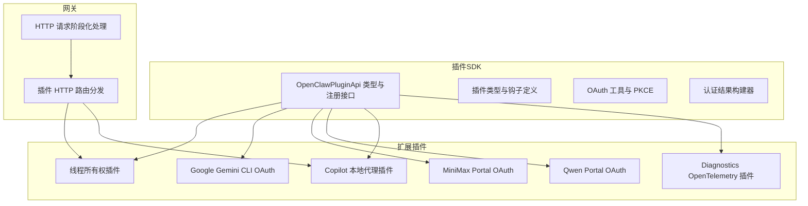
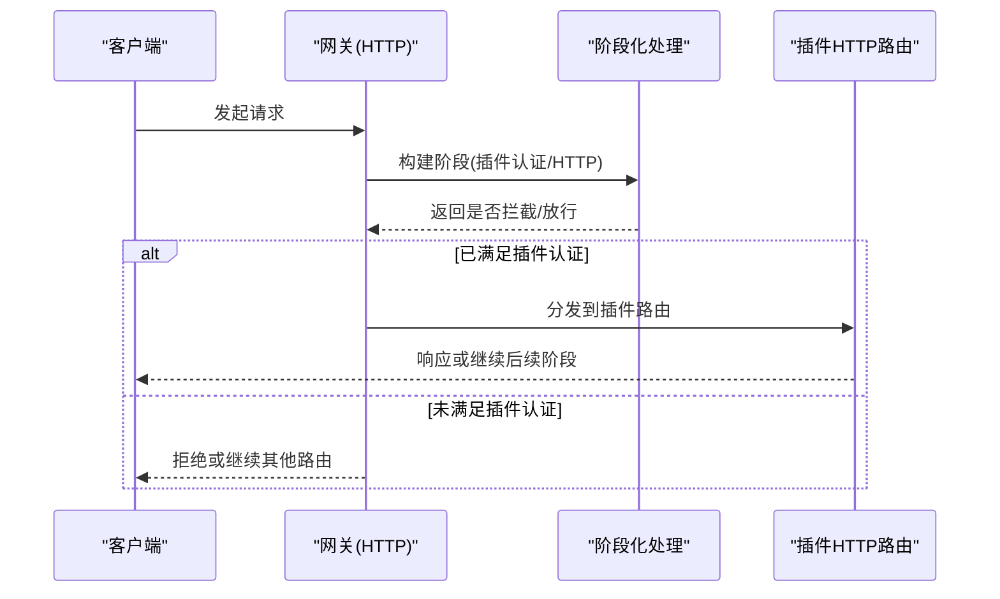
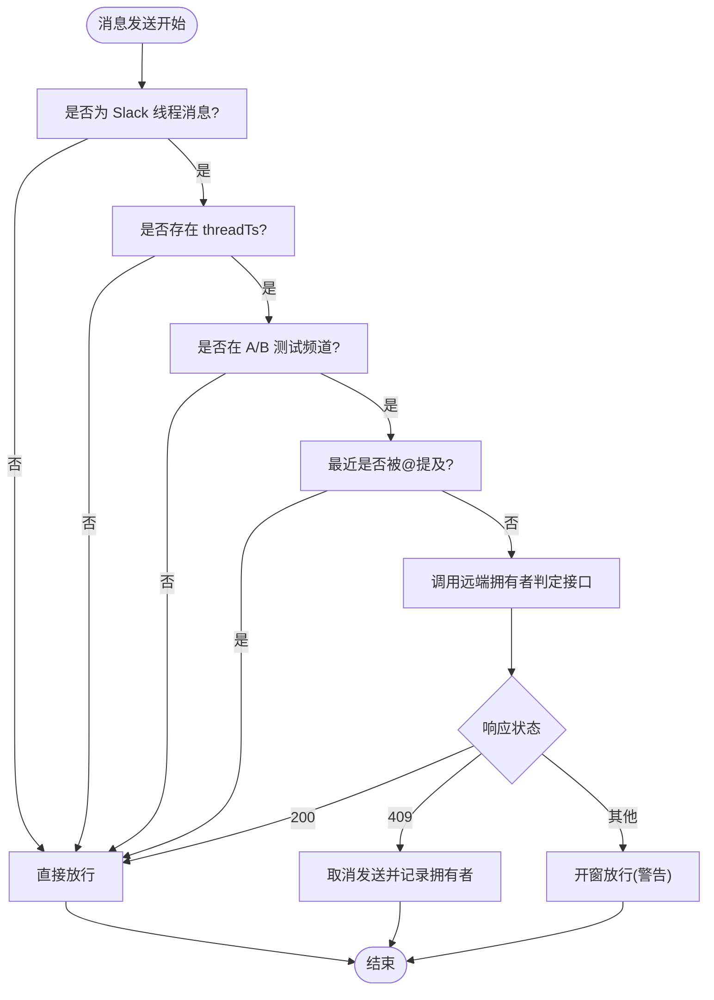
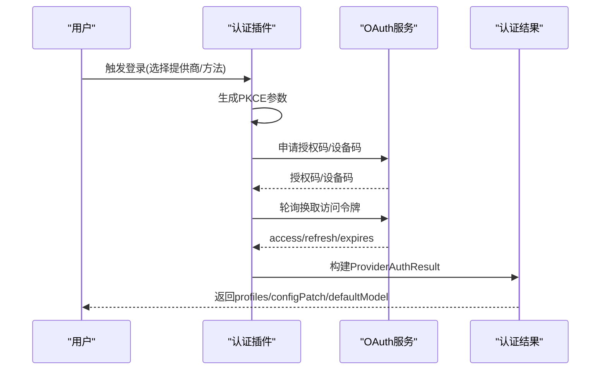
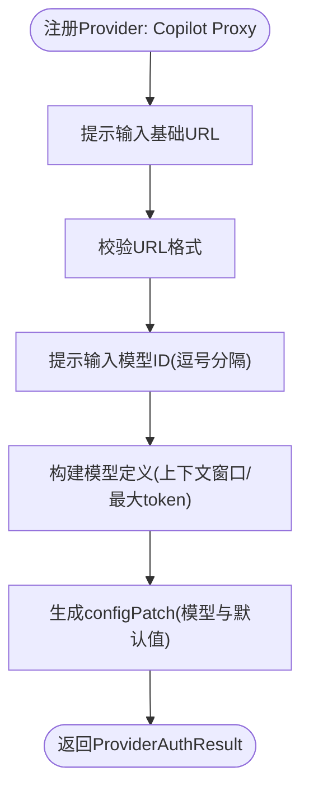
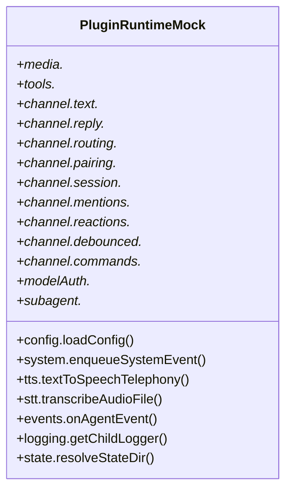
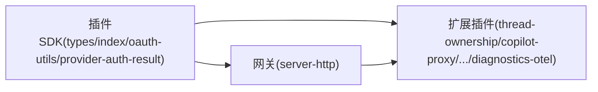

# 实用工具插件开发

<cite>
**本文档引用的文件**
- [src/plugin-sdk/index.ts](file://src/plugin-sdk/index.ts)
- [src/plugin-sdk/types.ts](file://src/plugins/types.ts)
- [src/plugin-sdk/oauth-utils.ts](file://src/plugin-sdk/oauth-utils.ts)
- [src/plugin-sdk/provider-auth-result.ts](file://src/plugin-sdk/provider-auth-result.ts)
- [src/plugins/runtime/types.ts](file://src/plugins/runtime/types.ts)
- [extensions/thread-ownership/index.ts](file://extensions/thread-ownership/index.ts)
- [extensions/test-utils/plugin-runtime-mock.ts](file://extensions/test-utils/plugin-runtime-mock.ts)
- [extensions/google-gemini-cli-auth/oauth.ts](file://extensions/google-gemini-cli-auth/oauth.ts)
- [extensions/minimax-portal-auth/oauth.ts](file://extensions/minimax-portal-auth/oauth.ts)
- [extensions/qwen-portal-auth/oauth.ts](file://extensions/qwen-portal-auth/oauth.ts)
- [extensions/copilot-proxy/index.ts](file://extensions/copilot-proxy/index.ts)
- [extensions/diagnostics-otel/index.ts](file://extensions/diagnostics-otel/index.ts)
- [src/gateway/server-http.ts](file://src/gateway/server-http.ts)
- [src/gateway/server.plugins-http.test.ts](file://src/gateway/server.plugins-http.test.ts)
- [docs/tools/plugin.md](file://docs/tools/plugin.md)
- [docs/gateway/trusted-proxy-auth.md](file://docs/gateway/trusted-proxy-auth.md)
</cite>

## 目录
1. [简介](#简介)
2. [项目结构](#项目结构)
3. [核心组件](#核心组件)
4. [架构总览](#架构总览)
5. [详细组件分析](#详细组件分析)
6. [依赖关系分析](#依赖关系分析)
7. [性能考虑](#性能考虑)
8. [故障排查指南](#故障排查指南)
9. [结论](#结论)
10. [附录](#附录)

## 简介
本指南面向在 OpenClaw 中开发“实用工具插件”的工程师与技术作者，系统讲解如何基于插件 SDK 构建代理工具、认证工具、测试工具与调试工具。内容涵盖：
- 插件架构与生命周期（注册、激活、钩子、HTTP 路由）
- 认证流程（OAuth、设备码、API Key）与令牌刷新
- 中间件处理与网关路由集成
- 测试辅助与调试工具
- 配置管理、错误处理与性能优化
- 可复用性、可测试性与可维护性的设计原则

## 项目结构
OpenClaw 将插件能力集中在统一的插件 SDK 中，并通过扩展目录提供具体插件实现。核心结构要点：
- 插件 SDK：导出插件 API、类型定义、OAuth 工具、认证结果构建器等
- 扩展插件：如线程所有权、认证门户（Google Gemini、MiniMax、Qwen）、Copilot 代理、诊断 OTel 等
- 网关集成：HTTP 请求在进入插件前经过网关阶段化处理（认证、转发）

**图表来源**
- [src/plugin-sdk/index.ts:1-826](file://src/plugin-sdk/index.ts#L1-L826)
- [src/plugin-sdk/types.ts:263-306](file://src/plugins/types.ts#L263-L306)
- [src/gateway/server-http.ts:285-735](file://src/gateway/server-http.ts#L285-L735)

**章节来源**
- [src/plugin-sdk/index.ts:1-826](file://src/plugin-sdk/index.ts#L1-L826)
- [src/gateway/server-http.ts:285-735](file://src/gateway/server-http.ts#L285-L735)

## 核心组件
- 插件 API（OpenClawPluginApi）：提供注册工具、钩子、HTTP 路由、命令、服务、通道、网关方法、提供商等能力
- 插件类型系统：定义 ProviderAuthKind、ProviderAuthContext、ProviderAuthResult、PluginHook 系列事件与结果
- OAuth 工具：PKCE 生成、表单编码
- 认证结果构建器：标准化 ProviderAuthResult 输出，自动填充默认模型与配置补丁
- 运行时类型：子代理运行、等待、会话查询与删除

**章节来源**
- [src/plugin-sdk/types.ts:92-132](file://src/plugins/types.ts#L92-L132)
- [src/plugin-sdk/types.ts:263-306](file://src/plugins/types.ts#L263-L306)
- [src/plugin-sdk/oauth-utils.ts:1-14](file://src/plugin-sdk/oauth-utils.ts#L1-L14)
- [src/plugin-sdk/provider-auth-result.ts:1-48](file://src/plugin-sdk/provider-auth-result.ts#L1-L48)
- [src/plugins/runtime/types.ts:51-64](file://src/plugins/runtime/types.ts#L51-L64)

## 架构总览
OpenClaw 的插件体系以“插件 SDK + 扩展插件 + 网关”三层协同：
- 插件 SDK：统一的类型与工具层，约束插件行为与输出
- 扩展插件：具体业务实现（认证、代理、测试、调试）
- 网关：请求在进入插件前按阶段执行（如插件网关认证），再交由插件 HTTP 路由处理

**图表来源**
- [src/gateway/server-http.ts:285-346](file://src/gateway/server-http.ts#L285-L346)
- [src/gateway/server.plugins-http.test.ts:167-207](file://src/gateway/server.plugins-http.test.ts#L167-L207)

**章节来源**
- [src/gateway/server-http.ts:285-735](file://src/gateway/server-http.ts#L285-L735)
- [src/gateway/server.plugins-http.test.ts:1-324](file://src/gateway/server.plugins-http.test.ts#L1-L324)

## 详细组件分析

### 组件A：线程所有权插件（Thread Ownership）
用途：在多代理共享的 Slack 线程中，避免并发写入冲突；支持 A/B 测试通道、@提及记忆窗口与远端拥有者判定。

关键机制：
- 钩子：监听消息接收（记录最近 @提及）与消息发送（检查线程归属）
- 外部调用：向远端“拥有者判定”服务发起 POST，根据返回状态决定是否允许发送
- 容错：网络异常或非 409 状态时采用“开窗放行”，降低可用性风险

**图表来源**
- [extensions/thread-ownership/index.ts:63-132](file://extensions/thread-ownership/index.ts#L63-L132)

**章节来源**
- [extensions/thread-ownership/index.ts:1-134](file://extensions/thread-ownership/index.ts#L1-L134)

### 组件B：认证门户插件（Google Gemini/Qwen/MiniMax）
目标：为不同大模型平台提供“设备码/OAuth”认证流程，返回标准化 ProviderAuthResult，供后续模型使用。

通用流程：
- 生成 PKCE 参数（verifier/challenge）
- 向平台发起授权码/设备码申请
- 在有效期内轮询换取访问令牌
- 使用认证结果构建器生成 profiles/configPatch/defaultModel

**图表来源**
- [extensions/google-gemini-cli-auth/oauth.ts:659-734](file://extensions/google-gemini-cli-auth/oauth.ts#L659-L734)
- [extensions/minimax-portal-auth/oauth.ts:184-244](file://extensions/minimax-portal-auth/oauth.ts#L184-L244)
- [extensions/qwen-portal-auth/oauth.ts:132-182](file://extensions/qwen-portal-auth/oauth.ts#L132-L182)
- [src/plugin-sdk/oauth-utils.ts:9-13](file://src/plugin-sdk/oauth-utils.ts#L9-L13)
- [src/plugin-sdk/provider-auth-result.ts:5-47](file://src/plugin-sdk/provider-auth-result.ts#L5-L47)

**章节来源**
- [extensions/google-gemini-cli-auth/oauth.ts:1-735](file://extensions/google-gemini-cli-auth/oauth.ts#L1-L735)
- [extensions/minimax-portal-auth/oauth.ts:1-245](file://extensions/minimax-portal-auth/oauth.ts#L1-L245)
- [extensions/qwen-portal-auth/oauth.ts:1-183](file://extensions/qwen-portal-auth/oauth.ts#L1-L183)
- [src/plugin-sdk/oauth-utils.ts:1-14](file://src/plugin-sdk/oauth-utils.ts#L1-L14)
- [src/plugin-sdk/provider-auth-result.ts:1-48](file://src/plugin-sdk/provider-auth-result.ts#L1-L48)

### 组件C：Copilot 本地代理插件（API 代理）
目标：将本地 Copilot 代理（VS Code LM）作为 OpenAI 兼容接口提供给 OpenClaw 使用，支持动态配置基础 URL 与模型列表。

关键点：
- 注册 Provider，提供“本地代理”认证方式
- 交互式提示输入基础 URL 与模型 ID 列表
- 自动生成 Provider 配置与默认模型映射

**图表来源**
- [extensions/copilot-proxy/index.ts:74-152](file://extensions/copilot-proxy/index.ts#L74-L152)

**章节来源**
- [extensions/copilot-proxy/index.ts:1-155](file://extensions/copilot-proxy/index.ts#L1-L155)

### 组件D：诊断 OpenTelemetry 插件
目标：将诊断事件导出到 OpenTelemetry，便于集中观测与告警。

实现要点：
- 使用空配置模式注册服务
- 启动时创建诊断 OTel 服务实例并注册

**章节来源**
- [extensions/diagnostics-otel/index.ts:1-16](file://extensions/diagnostics-otel/index.ts#L1-L16)

### 组件E：测试工具与模拟（Test Utils）
目标：为插件开发提供可测试的运行时模拟，覆盖媒体、TTS/STT、工具、通道、会话、配对、去重等场景。

关键能力：
- 深度合并覆盖的运行时 Mock
- 通道文本分块、回复派发、会话读写、提及匹配、反应处理等
- 子代理运行/等待/会话查询/删除

**图表来源**
- [extensions/test-utils/plugin-runtime-mock.ts:35-271](file://extensions/test-utils/plugin-runtime-mock.ts#L35-L271)

**章节来源**
- [extensions/test-utils/plugin-runtime-mock.ts:1-272](file://extensions/test-utils/plugin-runtime-mock.ts#L1-L272)
- [src/plugins/runtime/types.ts:51-64](file://src/plugins/runtime/types.ts#L51-L64)

## 依赖关系分析
- 插件 SDK 为所有扩展插件提供统一的 API 与类型约束
- 网关通过“阶段化处理”控制插件路由的访问权限与执行顺序
- 认证门户插件依赖 OAuth 工具与认证结果构建器
- 测试工具依赖插件 SDK 的运行时类型与工具集

**图表来源**
- [src/plugin-sdk/index.ts:1-826](file://src/plugin-sdk/index.ts#L1-L826)
- [src/plugin-sdk/types.ts:263-306](file://src/plugins/types.ts#L263-L306)
- [src/gateway/server-http.ts:285-735](file://src/gateway/server-http.ts#L285-L735)

**章节来源**
- [src/plugin-sdk/index.ts:1-826](file://src/plugin-sdk/index.ts#L1-L826)
- [src/gateway/server-http.ts:285-735](file://src/gateway/server-http.ts#L285-L735)

## 性能考虑
- 线程所有权：使用内存缓存与 TTL 清理减少重复查询；对外部服务调用设置合理超时
- 认证轮询：指数退避与最大间隔限制，避免频繁轮询导致平台限流
- 插件 HTTP 路由：精确匹配优先于前缀匹配，减少不必要的处理链
- 网关阶段化：仅在必要路径启用插件认证，避免全局强制认证带来的额外开销
- 日志与可观测：使用轻量级日志与诊断事件，避免高频写入影响吞吐

## 故障排查指南
常见问题与定位建议：
- 插件 HTTP 路由未生效
  - 检查路由注册与匹配策略（精确 vs 前缀）
  - 确认网关阶段化是否正确放行
- 认证失败或超时
  - 校验 PKCE 参数一致性与平台回调状态
  - 检查网络连通性与平台限流
- 线程所有权冲突
  - 关注 409 冲突与“开窗放行”日志
  - 核对 A/B 测试频道白名单
- 网关可信代理认证
  - 确认代理仅暴露于受信网络
  - 校验请求头来源与用户头字段配置

**章节来源**
- [src/gateway/server.plugins-http.test.ts:209-244](file://src/gateway/server.plugins-http.test.ts#L209-L244)
- [docs/gateway/trusted-proxy-auth.md:192-264](file://docs/gateway/trusted-proxy-auth.md#L192-L264)

## 结论
通过统一的插件 SDK 与严格的类型约束，OpenClaw 为实用工具插件提供了高内聚、低耦合的开发框架。围绕认证、代理、测试与调试的插件实现，既保证了可复用性与可维护性，又兼顾了可测试性与性能优化。遵循本文档的设计原则与最佳实践，可快速构建稳定可靠的实用工具插件。

## 附录

### 开发示例清单
- 代理工具：参考 Copilot 本地代理插件的 Provider 注册与配置补丁生成
- 认证工具：参考 Google Gemini/Qwen/MiniMax 的 OAuth 设备码流程与轮询策略
- 测试工具：参考测试运行时 Mock 的覆盖策略与断言
- 调试工具：参考诊断 OTel 插件的服务注册与启动流程
- 网关集成：参考网关阶段化处理与插件 HTTP 路由分发逻辑

**章节来源**
- [extensions/copilot-proxy/index.ts:74-152](file://extensions/copilot-proxy/index.ts#L74-L152)
- [extensions/google-gemini-cli-auth/oauth.ts:659-734](file://extensions/google-gemini-cli-auth/oauth.ts#L659-L734)
- [extensions/minimax-portal-auth/oauth.ts:184-244](file://extensions/minimax-portal-auth/oauth.ts#L184-L244)
- [extensions/qwen-portal-auth/oauth.ts:132-182](file://extensions/qwen-portal-auth/oauth.ts#L132-L182)
- [extensions/test-utils/plugin-runtime-mock.ts:35-271](file://extensions/test-utils/plugin-runtime-mock.ts#L35-L271)
- [extensions/diagnostics-otel/index.ts:1-16](file://extensions/diagnostics-otel/index.ts#L1-L16)
- [src/gateway/server-http.ts:285-735](file://src/gateway/server-http.ts#L285-L735)