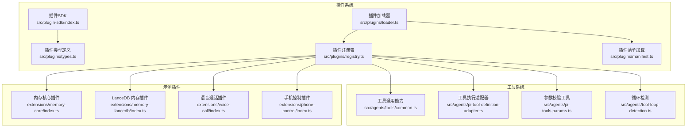
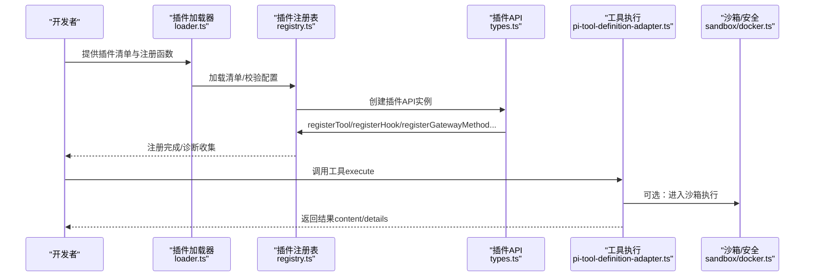
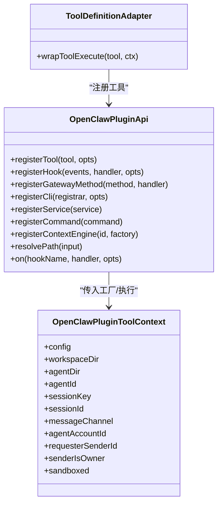
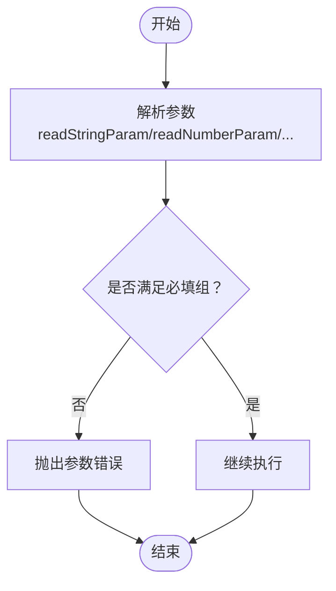
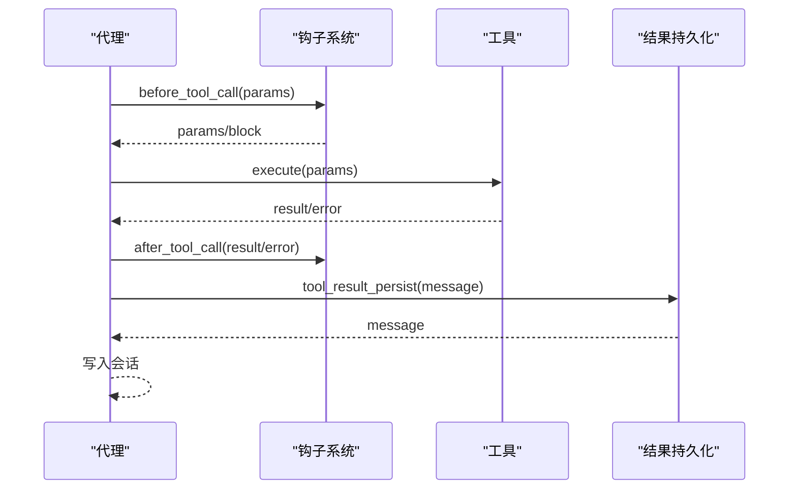
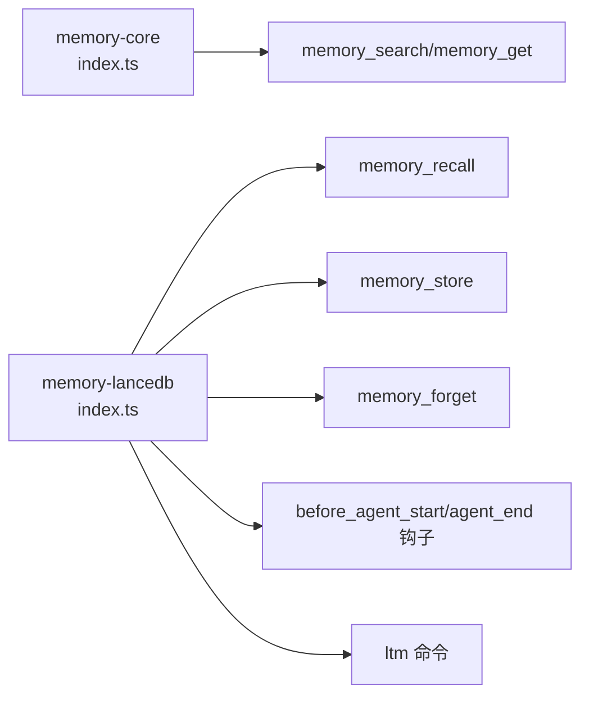
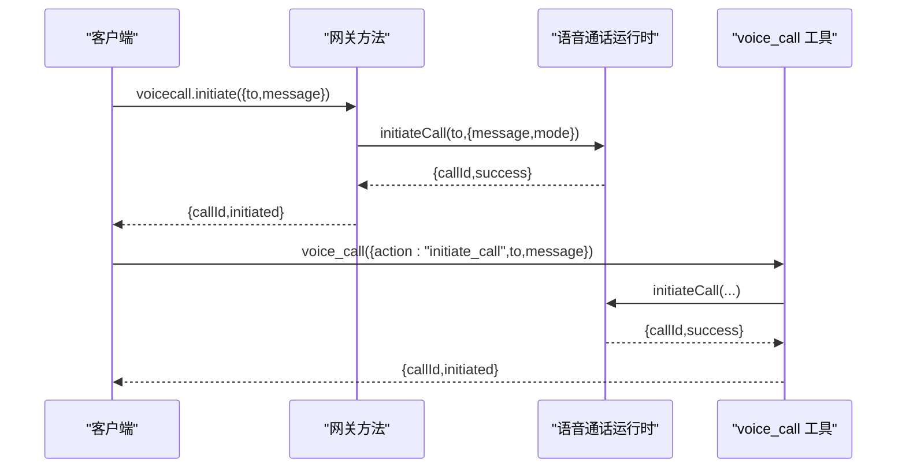
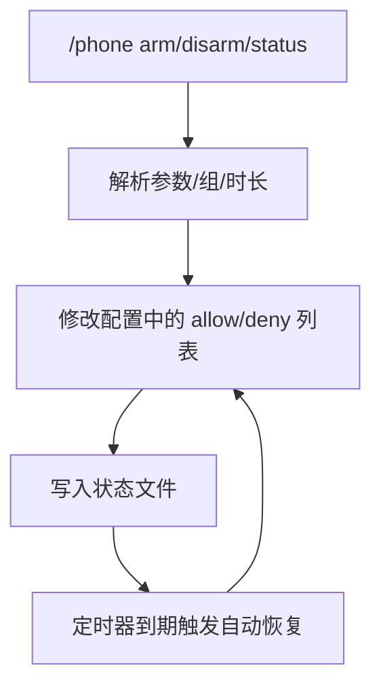
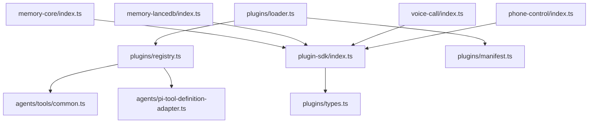

# 工具插件开发

<cite>
**本文引用的文件**
- [src/plugin-sdk/index.ts](file://src/plugin-sdk/index.ts)
- [src/plugins/types.ts](file://src/plugins/types.ts)
- [src/plugins/registry.ts](file://src/plugins/registry.ts)
- [src/plugins/loader.ts](file://src/plugins/loader.ts)
- [src/plugins/manifest.ts](file://src/plugins/manifest.ts)
- [src/agents/tools/common.ts](file://src/agents/tools/common.ts)
- [src/agents/pi-tool-definition-adapter.ts](file://src/agents/pi-tool-definition-adapter.ts)
- [src/agents/pi-tools.params.ts](file://src/agents/pi-tools.params.ts)
- [src/agents/tool-loop-detection.ts](file://src/agents/tool-loop-detection.ts)
- [src/agents/pi-extensions/compaction-safeguard.ts](file://src/agents/pi-extensions/compaction-safeguard.ts)
- [src/agents/pi-embedded-subscribe.tools.ts](file://src/agents/pi-embedded-subscribe.tools.ts)
- [src/agents/sandbox/docker.ts](file://src/agents/sandbox/docker.ts)
- [src/agents/sandbox-create-args.test.ts](file://src/agents/sandbox-create-args.test.ts)
- [extensions/memory-core/index.ts](file://extensions/memory-core/index.ts)
- [extensions/memory-lancedb/index.ts](file://extensions/memory-lancedb/index.ts)
- [extensions/voice-call/index.ts](file://extensions/voice-call/index.ts)
- [extensions/phone-control/index.ts](file://extensions/phone-control/index.ts)
- [extensions/feishu/src/tool-result.ts](file://extensions/feishu/src/tool-result.ts)
- [extensions/feishu/src/tool-factory-test-harness.ts](file://extensions/feishu/src/tool-factory-test-harness.ts)
- [SECURITY.md](file://SECURITY.md)
</cite>

## 目录
1. [简介](#简介)
2. [项目结构](#项目结构)
3. [核心组件](#核心组件)
4. [架构总览](#架构总览)
5. [详细组件分析](#详细组件分析)
6. [依赖关系分析](#依赖关系分析)
7. [性能考量](#性能考量)
8. [故障排查指南](#故障排查指南)
9. [结论](#结论)
10. [附录](#附录)

## 简介
本指南面向希望在 OpenClaw 平台上开发“工具插件”的开发者，系统讲解工具插件的架构设计、工具定义与参数校验、执行流程与结果处理、不同类型的工具实现（内存工具、语音工具、设备控制工具等）、核心接口（工具注册、参数解析、执行权限与错误处理）、安全与隔离策略（权限控制、沙箱隔离、资源限制），以及测试策略、调试技巧与性能优化方法。文档以仓库中的真实实现为依据，辅以可视化图示帮助理解。

## 项目结构
OpenClaw 将“插件”作为扩展能力的核心单元，围绕插件生命周期、配置校验、工具注册与执行、钩子系统、HTTP 路由、CLI 命令、服务与网关方法进行组织。核心模块包括：
- 插件 SDK：统一的插件 API 定义与导出入口
- 插件注册表与加载器：负责插件清单加载、配置校验、注册 API 创建、插件激活
- 工具系统：工具定义、参数解析、执行适配、结果封装与错误处理
- 钩子系统：在代理运行的关键阶段注入上下文或拦截行为
- 安全与沙箱：容器化与系统级安全加固
- 示例插件：内存工具（核心/LanceDB）、语音通话、手机控制等

**图表来源**
- [src/plugin-sdk/index.ts:1-826](file://src/plugin-sdk/index.ts#L1-L826)
- [src/plugins/types.ts:1-893](file://src/plugins/types.ts#L1-L893)
- [src/plugins/registry.ts:189-608](file://src/plugins/registry.ts#L189-L608)
- [src/plugins/loader.ts:706-828](file://src/plugins/loader.ts#L706-L828)
- [src/plugins/manifest.ts:45-88](file://src/plugins/manifest.ts#L45-L88)
- [src/agents/tools/common.ts:1-341](file://src/agents/tools/common.ts#L1-L341)
- [src/agents/pi-tool-definition-adapter.ts:167-194](file://src/agents/pi-tool-definition-adapter.ts#L167-L194)
- [src/agents/pi-tools.params.ts:154-204](file://src/agents/pi-tools.params.ts#L154-L204)
- [src/agents/tool-loop-detection.ts:172-196](file://src/agents/tool-loop-detection.ts#L172-L196)
- [extensions/memory-core/index.ts:1-39](file://extensions/memory-core/index.ts#L1-L39)
- [extensions/memory-lancedb/index.ts:1-679](file://extensions/memory-lancedb/index.ts#L1-L679)
- [extensions/voice-call/index.ts:1-543](file://extensions/voice-call/index.ts#L1-L543)
- [extensions/phone-control/index.ts:1-422](file://extensions/phone-control/index.ts#L1-L422)

**章节来源**
- [src/plugin-sdk/index.ts:1-826](file://src/plugin-sdk/index.ts#L1-L826)
- [src/plugins/types.ts:1-893](file://src/plugins/types.ts#L1-L893)
- [src/plugins/registry.ts:189-608](file://src/plugins/registry.ts#L189-L608)
- [src/plugins/loader.ts:706-828](file://src/plugins/loader.ts#L706-L828)
- [src/plugins/manifest.ts:45-88](file://src/plugins/manifest.ts#L45-L88)

## 核心组件
- 插件 API 与类型
  - OpenClawPluginApi 提供注册工具、钩子、HTTP 路由、通道、网关方法、CLI、服务、提供者、上下文引擎等能力
  - OpenClawPluginToolContext 提供工具执行时的上下文（会话、请求者、沙箱标记等）
  - 插件生命周期钩子覆盖模型解析、提示构建、消息收发、工具调用前后、压缩、会话开始/结束、子代理等
- 工具系统
  - 工具定义与执行：AnyAgentTool、工具执行结果封装、图片结果封装、权限门控
  - 参数解析：字符串/数字/数组/反应参数等解析与校验
  - 执行适配：将插件工具包装为代理可用的 ToolDefinition，统一错误处理与日志
  - 循环检测与失败汇总：避免重复执行、聚合工具失败信息
- 插件注册与加载
  - 清单加载与校验、配置 Schema 校验、插件注册 API 创建、插件激活与诊断收集
- 安全与沙箱
  - Docker 沙箱参数构建、安全加固（只读根、网络隔离、cap-drop、ulimit、seccomp/apparmor 等）

**章节来源**
- [src/plugins/types.ts:263-306](file://src/plugins/types.ts#L263-L306)
- [src/plugins/types.ts:58-73](file://src/plugins/types.ts#L58-L73)
- [src/plugins/types.ts:321-377](file://src/plugins/types.ts#L321-L377)
- [src/agents/tools/common.ts:7-341](file://src/agents/tools/common.ts#L7-L341)
- [src/agents/pi-tool-definition-adapter.ts:167-194](file://src/agents/pi-tool-definition-adapter.ts#L167-L194)
- [src/agents/pi-tools.params.ts:154-204](file://src/agents/pi-tools.params.ts#L154-L204)
- [src/agents/tool-loop-detection.ts:172-196](file://src/agents/tool-loop-detection.ts#L172-L196)
- [src/plugins/registry.ts:189-218](file://src/plugins/registry.ts#L189-L218)
- [src/plugins/loader.ts:706-828](file://src/plugins/loader.ts#L706-L828)
- [src/agents/sandbox/docker.ts:292-344](file://src/agents/sandbox/docker.ts#L292-L344)

## 架构总览
下图展示了从插件注册到工具执行、结果处理与安全隔离的整体流程。

**图表来源**
- [src/plugins/loader.ts:706-828](file://src/plugins/loader.ts#L706-L828)
- [src/plugins/registry.ts:575-608](file://src/plugins/registry.ts#L575-L608)
- [src/plugins/types.ts:263-306](file://src/plugins/types.ts#L263-L306)
- [src/agents/pi-tool-definition-adapter.ts:167-194](file://src/agents/pi-tool-definition-adapter.ts#L167-L194)
- [src/agents/sandbox/docker.ts:292-344](file://src/agents/sandbox/docker.ts#L292-L344)

## 详细组件分析

### 组件A：工具注册与执行适配
- 工具注册
  - 支持直接注册工具对象或工厂函数；支持多名称别名与可选工具
  - 工厂函数接收 OpenClawPluginToolContext，按上下文动态生成工具集合
- 执行适配
  - 将工具包装为 ToolDefinition，捕获异常并格式化错误消息
  - 记录调试与错误日志，返回标准化结果结构（content/details）
- 权限与门控
  - 可通过 wrapOwnerOnlyToolExecution 对仅所有者可用的工具进行执行前检查
  - 提供 createActionGate 用于基于动作开关的细粒度授权

**图表来源**
- [src/plugins/types.ts:263-306](file://src/plugins/types.ts#L263-L306)
- [src/plugins/types.ts:58-73](file://src/plugins/types.ts#L58-L73)
- [src/agents/pi-tool-definition-adapter.ts:167-194](file://src/agents/pi-tool-definition-adapter.ts#L167-L194)
- [src/agents/tools/common.ts:242-255](file://src/agents/tools/common.ts#L242-L255)

**章节来源**
- [src/plugins/registry.ts:193-218](file://src/plugins/registry.ts#L193-L218)
- [src/agents/pi-tool-definition-adapter.ts:167-194](file://src/agents/pi-tool-definition-adapter.ts#L167-L194)
- [src/agents/tools/common.ts:242-255](file://src/agents/tools/common.ts#L242-L255)

### 组件B：参数解析与校验
- 参数读取
  - 字符串/数字/数组/反应参数等解析，支持必填、去空、类型严格模式
- 必填参数组校验
  - assertRequiredParams 支持“或”键组（如 path 或 file_path）至少满足一个
- 错误处理
  - 统一抛出 ToolInputError/ToolAuthorizationError，便于上层识别与反馈

**图表来源**
- [src/agents/tools/common.ts:74-155](file://src/agents/tools/common.ts#L74-L155)
- [src/agents/pi-tools.params.ts:168-204](file://src/agents/pi-tools.params.ts#L168-L204)

**章节来源**
- [src/agents/tools/common.ts:74-155](file://src/agents/tools/common.ts#L74-L155)
- [src/agents/pi-tools.params.ts:168-204](file://src/agents/pi-tools.params.ts#L168-L204)

### 组件C：工具执行流程与结果处理
- 执行流程
  - 工具执行前：before_tool_call 钩子可修改参数或阻断调用
  - 工具执行后：after_tool_call 钩子记录结果/错误与耗时
  - 结果持久化：tool_result_persist 钩子可裁剪或修改写入会话的消息
- 结果封装
  - jsonResult 统一文本内容与详情对象
  - 图片结果封装 imageResult/imageResultFromFile 支持 MIME 类型与可选净化
- 失败与循环
  - 循环检测：基于工具名/参数/结果/错误的哈希去重
  - 失败汇总：聚合工具失败信息，限制数量并添加溢出提示

**图表来源**
- [src/plugins/types.ts:606-657](file://src/plugins/types.ts#L606-L657)
- [src/agents/pi-tool-definition-adapter.ts:167-194](file://src/agents/pi-tool-definition-adapter.ts#L167-L194)
- [src/agents/tools/common.ts:230-302](file://src/agents/tools/common.ts#L230-L302)
- [src/agents/tool-loop-detection.ts:172-196](file://src/agents/tool-loop-detection.ts#L172-L196)
- [src/agents/pi-extensions/compaction-safeguard.ts:95-121](file://src/agents/pi-extensions/compaction-safeguard.ts#L95-L121)

**章节来源**
- [src/plugins/types.ts:606-657](file://src/plugins/types.ts#L606-L657)
- [src/agents/tools/common.ts:230-302](file://src/agents/tools/common.ts#L230-L302)
- [src/agents/tool-loop-detection.ts:172-196](file://src/agents/tool-loop-detection.ts#L172-L196)
- [src/agents/pi-extensions/compaction-safeguard.ts:95-121](file://src/agents/pi-extensions/compaction-safeguard.ts#L95-L121)

### 组件D：内存工具（核心与 LanceDB）
- 核心内存工具
  - 提供 memory_search 与 memory_get 工具，注册为工厂函数，按会话键创建
  - 提供 CLI 子命令 memory
- LanceDB 内存工具
  - 提供 memory_recall/memory_store/memory_forget 三类工具
  - 自动召回与自动捕获：在 before_agent_start 与 agent_end 钩子中注入上下文或存储重要信息
  - CLI 命令 ltm 支持 list/search/stats

**图表来源**
- [extensions/memory-core/index.ts:10-35](file://extensions/memory-core/index.ts#L10-L35)
- [extensions/memory-lancedb/index.ts:314-494](file://extensions/memory-lancedb/index.ts#L314-L494)
- [extensions/memory-lancedb/index.ts:546-658](file://extensions/memory-lancedb/index.ts#L546-L658)
- [extensions/memory-lancedb/index.ts:500-540](file://extensions/memory-lancedb/index.ts#L500-L540)

**章节来源**
- [extensions/memory-core/index.ts:10-35](file://extensions/memory-core/index.ts#L10-L35)
- [extensions/memory-lancedb/index.ts:314-494](file://extensions/memory-lancedb/index.ts#L314-L494)
- [extensions/memory-lancedb/index.ts:546-658](file://extensions/memory-lancedb/index.ts#L546-L658)
- [extensions/memory-lancedb/index.ts:500-540](file://extensions/memory-lancedb/index.ts#L500-L540)

### 组件E：语音通话工具
- 网关方法
  - voicecall.initiate/continue/speak/end/status/start
- 工具
  - voice_call 工具，支持多种 action（initiate_call/continue_call/speak_to_user/end_call/get_status）
- CLI
  - voicecall 命令集
- 服务
  - voicecall 服务，启动/停止运行时

**图表来源**
- [extensions/voice-call/index.ts:230-375](file://extensions/voice-call/index.ts#L230-L375)
- [extensions/voice-call/index.ts:377-497](file://extensions/voice-call/index.ts#L377-L497)
- [extensions/voice-call/index.ts:499-508](file://extensions/voice-call/index.ts#L499-L508)
- [extensions/voice-call/index.ts:510-538](file://extensions/voice-call/index.ts#L510-L538)

**章节来源**
- [extensions/voice-call/index.ts:230-375](file://extensions/voice-call/index.ts#L230-L375)
- [extensions/voice-call/index.ts:377-497](file://extensions/voice-call/index.ts#L377-L497)
- [extensions/voice-call/index.ts:499-508](file://extensions/voice-call/index.ts#L499-L508)
- [extensions/voice-call/index.ts:510-538](file://extensions/voice-call/index.ts#L510-L538)

### 组件F：设备控制工具（手机控制）
- 功能
  - /phone status/arm/disarm 命令
  - 支持按组（camera/screen/writes/all）临时放行高风险命令
  - 过期定时器自动恢复
- 实现要点
  - 通过修改配置中的 allow/deny 列表临时放行
  - 状态文件记录武装时间、过期时间、组别与变更项

**图表来源**
- [extensions/phone-control/index.ts:330-420](file://extensions/phone-control/index.ts#L330-L420)
- [extensions/phone-control/index.ts:289-328](file://extensions/phone-control/index.ts#L289-L328)

**章节来源**
- [extensions/phone-control/index.ts:330-420](file://extensions/phone-control/index.ts#L330-L420)
- [extensions/phone-control/index.ts:289-328](file://extensions/phone-control/index.ts#L289-L328)

### 组件G：测试与工具工厂测试夹具
- 工具工厂测试夹具
  - createToolFactoryHarness 支持注册工具并解析指定名称的工具实例，便于单元测试
- 工具结果封装
  - jsonToolResult/unknownToolActionResult/toolExecutionErrorResult 统一工具结果格式

**章节来源**
- [extensions/feishu/src/tool-factory-test-harness.ts:37-76](file://extensions/feishu/src/tool-factory-test-harness.ts#L37-L76)
- [extensions/feishu/src/tool-result.ts:1-14](file://extensions/feishu/src/tool-result.ts#L1-L14)

## 依赖关系分析
- 插件系统依赖
  - 插件 SDK 导出统一类型与工具函数
  - 注册表与加载器依赖清单解析与配置校验
  - 工具系统依赖通用工具与执行适配器
- 示例插件依赖
  - 内存插件依赖嵌入式向量模型与数据库
  - 语音插件依赖外部提供商 SDK 与运行时
  - 设备控制插件依赖配置与状态文件

**图表来源**
- [src/plugin-sdk/index.ts:1-826](file://src/plugin-sdk/index.ts#L1-L826)
- [src/plugins/types.ts:1-893](file://src/plugins/types.ts#L1-L893)
- [src/plugins/loader.ts:706-828](file://src/plugins/loader.ts#L706-L828)
- [src/plugins/registry.ts:189-608](file://src/plugins/registry.ts#L189-L608)
- [src/plugins/manifest.ts:45-88](file://src/plugins/manifest.ts#L45-L88)
- [src/agents/tools/common.ts:1-341](file://src/agents/tools/common.ts#L1-L341)
- [src/agents/pi-tool-definition-adapter.ts:167-194](file://src/agents/pi-tool-definition-adapter.ts#L167-L194)
- [extensions/memory-core/index.ts:1-39](file://extensions/memory-core/index.ts#L1-L39)
- [extensions/memory-lancedb/index.ts:1-679](file://extensions/memory-lancedb/index.ts#L1-L679)
- [extensions/voice-call/index.ts:1-543](file://extensions/voice-call/index.ts#L1-L543)
- [extensions/phone-control/index.ts:1-422](file://extensions/phone-control/index.ts#L1-L422)

**章节来源**
- [src/plugin-sdk/index.ts:1-826](file://src/plugin-sdk/index.ts#L1-L826)
- [src/plugins/loader.ts:706-828](file://src/plugins/loader.ts#L706-L828)
- [src/plugins/registry.ts:189-608](file://src/plugins/registry.ts#L189-L608)

## 性能考量
- 启动与基准
  - 使用 bench-cli-startup.ts 进行 CLI 启动性能采样与分位统计
  - 使用 test-perf-budget.mjs 设置回归阈值，避免性能退化
- 热点定位
  - 使用 test-hotspots.mjs 分析测试文件维度的耗时热点
- 沙箱参数
  - 通过 buildSandboxCreateArgs 构建安全且受限的容器参数（只读根、网络 none、资源限制、seccomp/apparmor 等），降低执行开销与风险

**章节来源**
- [scripts/bench-cli-startup.ts:59-111](file://scripts/bench-cli-startup.ts#L59-L111)
- [scripts/test-perf-budget.mjs:98-127](file://scripts/test-perf-budget.mjs#L98-L127)
- [scripts/test-hotspots.mjs:54-83](file://scripts/test-hotspots.mjs#L54-L83)
- [src/agents/sandbox/docker.ts:317-344](file://src/agents/sandbox/docker.ts#L317-L344)
- [src/agents/sandbox-create-args.test.ts:41-73](file://src/agents/sandbox-create-args.test.ts#L41-L73)

## 故障排查指南
- 插件注册与清单
  - 清单缺失或路径不安全：loadPluginManifest 报错
  - 配置 Schema 缺失或无效：validatePluginConfig 输出问题列表
  - 注册阶段异步返回警告：loader 检测到 Promise 注册被忽略
- 工具执行
  - 参数缺失/非法：抛出 ToolInputError/ToolAuthorizationError
  - 执行异常：pi-tool-definition-adapter 统一捕获并记录错误
  - 循环与失败
    - 循环检测：tool-loop-detection 基于哈希去重
    - 失败汇总：compaction-safeguard 聚合失败并限制输出
- 安全与沙箱
  - validateSandboxSecurity 阻止危险绑定/网络/命名空间加入等
  - Trusted Plugin 概念：安装启用即视为受信边界内的本地代码

**章节来源**
- [src/plugins/manifest.ts:45-88](file://src/plugins/manifest.ts#L45-L88)
- [src/config/validation.ts:549-604](file://src/config/validation.ts#L549-L604)
- [src/plugins/loader.ts:775-784](file://src/plugins/loader.ts#L775-L784)
- [src/agents/tools/common.ts:26-42](file://src/agents/tools/common.ts#L26-L42)
- [src/agents/pi-tool-definition-adapter.ts:167-194](file://src/agents/pi-tool-definition-adapter.ts#L167-L194)
- [src/agents/tool-loop-detection.ts:172-196](file://src/agents/tool-loop-detection.ts#L172-L196)
- [src/agents/pi-extensions/compaction-safeguard.ts:95-121](file://src/agents/pi-extensions/compaction-safeguard.ts#L95-L121)
- [src/agents/sandbox/docker.ts:331-344](file://src/agents/sandbox/docker.ts#L331-L344)
- [SECURITY.md:104-110](file://SECURITY.md#L104-L110)

## 结论
OpenClaw 的工具插件体系以插件 API 为核心，结合严格的参数校验、统一的工具执行适配、灵活的钩子系统与安全沙箱，提供了从简单系统命令到复杂 AI 交互工具的完整开发框架。通过示例插件（内存、语音、设备控制）可以快速上手，配合性能基准与故障排查手段，能够稳定地构建生产级工具插件。

## 附录
- 开发步骤建议
  - 明确工具职责与参数 Schema
  - 在 register 中使用 api.registerTool/api.registerHook
  - 使用 tools/common.ts 的参数解析与结果封装
  - 通过 before_tool_call/after_tool_call 钩子增强可观测性
  - 需要外部资源时，优先采用网关方法或服务，必要时使用沙箱
- 测试策略
  - 使用工具工厂测试夹具解析与调用工具
  - 针对参数缺失/非法场景编写断言
  - 使用性能脚本进行回归测试
- 安全最佳实践
  - 严格最小权限原则，避免授予不必要的权限
  - 使用沙箱隔离与资源限制
  - 对外部输入进行 Prompt 注入防护与内容净化