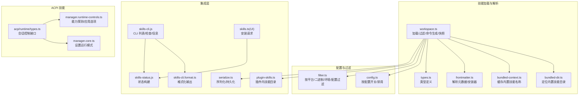
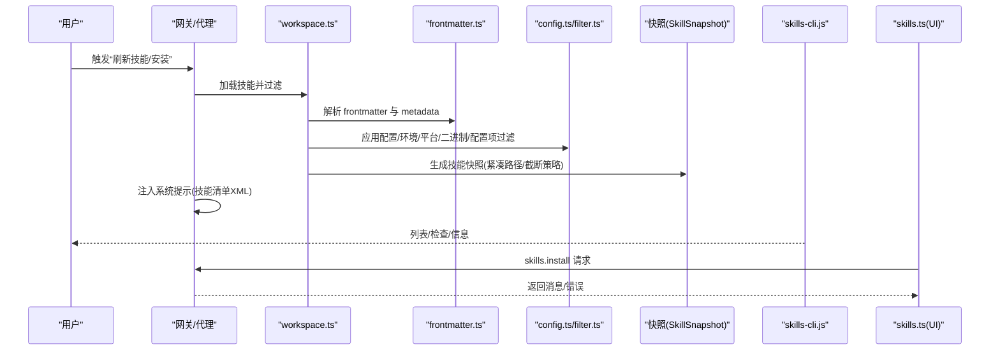
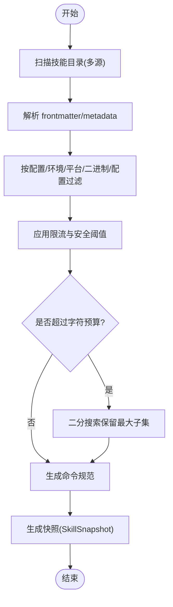
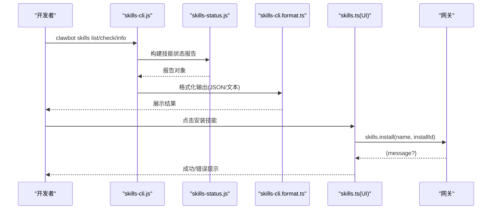
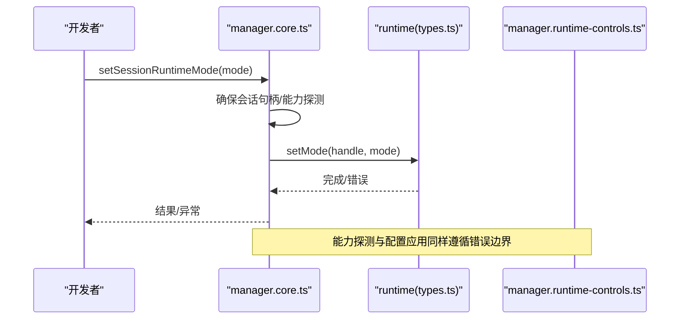
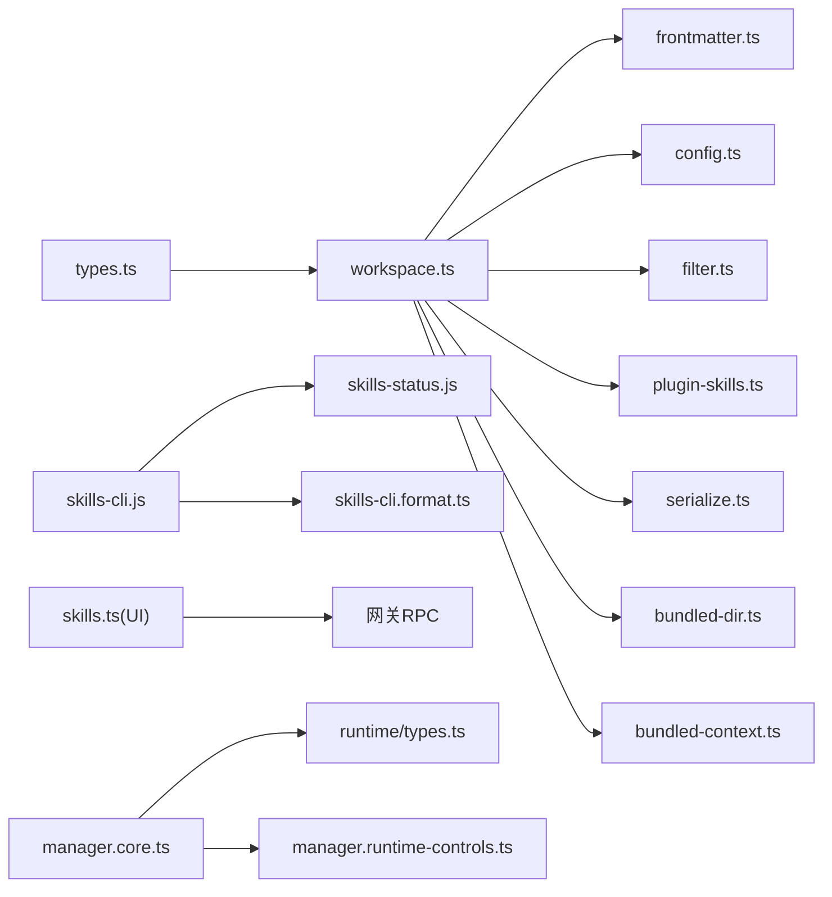

# 技能插件开发

<cite>
**本文引用的文件**
- [src/agents/skills/types.ts](file://src/agents/skills/types.ts)
- [src/agents/skills/workspace.ts](file://src/agents/skills/workspace.ts)
- [src/agents/skills/frontmatter.ts](file://src/agents/skills/frontmatter.ts)
- [src/agents/skills/bundled-dir.ts](file://src/agents/skills/bundled-dir.ts)
- [src/agents/skills/bundled-context.ts](file://src/agents/skills/bundled-context.ts)
- [src/agents/skills/config.ts](file://src/agents/skills/config.ts)
- [src/agents/skills/filter.ts](file://src/agents/skills/filter.ts)
- [src/agents/skills/serialize.ts](file://src/agents/skills/serialize.ts)
- [src/agents/skills/plugin-skills.ts](file://src/agents/skills/plugin-skills.ts)
- [src/agents/skills-status.js](file://src/agents/skills-status.js)
- [src/cli/skills-cli.js](file://src/cli/skills-cli.js)
- [src/cli/skills-cli.format.ts](file://src/cli/skills-cli.format.ts)
- [src/cli/skills-cli.commands.test.ts](file://src/cli/skills-cli.commands.test.ts)
- [src/plugin-sdk/index.ts](file://src/plugin-sdk/index.ts)
- [src/acp/runtime/types.ts](file://src/acp/runtime/types.ts)
- [src/acp/control-plane/manager.runtime-controls.ts](file://src/acp/control-plane/manager.runtime-controls.ts)
- [src/acp/control-plane/manager.core.ts](file://src/acp/control-plane/manager.core.ts)
- [docs/tools/skills.md](file://docs/tools/skills.md)
- [docs/tools/creating-skills.md](file://docs/tools/creating-skills.md)
- [skills/nano-banana-pro/SKILL.md](file://skills/nano-banana-pro/SKILL.md)
- [extensions/lobster/SKILL.md](file://extensions/lobster/SKILL.md)
- [ui/src/ui/controllers/skills.ts](file://ui/src/ui/controllers/skills.ts)
</cite>

## 目录
1. [简介](#简介)
2. [项目结构](#项目结构)
3. [核心组件](#核心组件)
4. [架构总览](#架构总览)
5. [详细组件分析](#详细组件分析)
6. [依赖关系分析](#依赖关系分析)
7. [性能考量](#性能考量)
8. [故障排查指南](#故障排查指南)
9. [结论](#结论)
10. [附录](#附录)

## 简介
本指南面向希望在 OpenClaw 中开发“技能（Skill）”的开发者，系统讲解技能的架构模式与实现方法，覆盖以下主题：
- 技能定义与元数据（frontmatter、metadata）
- 参数配置与环境注入（config、env、apiKey）
- 执行流程（加载、过滤、命令生成、快照复用）
- 结果处理（系统提示拼接、UI 安装、CLI 检查）
- 不同类型技能的实现要点：代码差异技能、文本处理技能、ACPI 技能（会话控制）
- 开发示例：从简单文本处理到多步骤自动化
- 配置管理：参数定义、默认值、校验规则
- 测试策略、调试技巧与性能优化

## 项目结构
OpenClaw 的技能体系由“技能目录 + 解析器 + 过滤器 + 命令生成 + 快照缓存 + UI/CLI 集成”构成。核心位置如下：
- 技能解析与加载：src/agents/skills/*
- 技能元数据与类型：src/agents/skills/types.ts
- 工作区与预设技能加载：src/agents/skills/workspace.ts、src/agents/skills/bundled-dir.ts、src/agents/skills/bundled-context.ts
- 元数据解析与安装器：src/agents/skills/frontmatter.ts
- 过滤与配置：src/agents/skills/config.ts、src/agents/skills/filter.ts
- 序列化与插件技能：src/agents/skills/serialize.ts、src/agents/skills/plugin-skills.ts
- CLI 与 UI：src/cli/skills-cli.*.ts、ui/src/ui/controllers/skills.ts
- ACPI 技能（会话控制）：src/acp/runtime/types.ts、src/acp/control-plane/manager.*.ts
- 文档参考：docs/tools/skills.md、docs/tools/creating-skills.md
- 示例技能：skills/nano-banana-pro/SKILL.md、extensions/lobster/SKILL.md

图表来源
- [src/agents/skills/workspace.ts:1-200](file://src/agents/skills/workspace.ts#L1-L200)
- [src/agents/skills/bundled-dir.ts:1-91](file://src/agents/skills/bundled-dir.ts#L1-L91)
- [src/agents/skills/bundled-context.ts:1-40](file://src/agents/skills/bundled-context.ts#L1-L40)
- [src/agents/skills/frontmatter.ts:1-200](file://src/agents/skills/frontmatter.ts#L1-L200)
- [src/agents/skills/types.ts:1-90](file://src/agents/skills/types.ts#L1-L90)
- [src/agents/skills/config.ts](file://src/agents/skills/config.ts)
- [src/agents/skills/filter.ts](file://src/agents/skills/filter.ts)
- [src/agents/skills/plugin-skills.ts](file://src/agents/skills/plugin-skills.ts)
- [src/agents/skills/serialize.ts](file://src/agents/skills/serialize.ts)
- [src/cli/skills-cli.js](file://src/cli/skills-cli.js)
- [src/cli/skills-cli.format.ts](file://src/cli/skills-cli.format.ts)
- [src/agents/skills-status.js](file://src/agents/skills-status.js)
- [ui/src/ui/controllers/skills.ts:125-157](file://ui/src/ui/controllers/skills.ts#L125-L157)
- [src/acp/runtime/types.ts:1-139](file://src/acp/runtime/types.ts#L1-L139)
- [src/acp/control-plane/manager.runtime-controls.ts:1-118](file://src/acp/control-plane/manager.runtime-controls.ts#L1-L118)
- [src/acp/control-plane/manager.core.ts:395-434](file://src/acp/control-plane/manager.core.ts#L395-L434)

章节来源
- [src/agents/skills/workspace.ts:1-200](file://src/agents/skills/workspace.ts#L1-L200)
- [src/agents/skills/types.ts:1-90](file://src/agents/skills/types.ts#L1-L90)
- [docs/tools/skills.md:1-303](file://docs/tools/skills.md#L1-L303)
- [docs/tools/creating-skills.md:1-59](file://docs/tools/creating-skills.md#L1-L59)

## 核心组件
- 技能类型与元数据
  - 技能条目、调用策略、命令规范、安装偏好、快照结构等均在类型定义中明确。
- 加载与过滤
  - 从多源目录加载，按配置与环境进行过滤；支持工作区优先、托管覆盖、内置回退。
- 命令生成与快照
  - 将可调用技能映射为用户命令；对同一会话复用技能快照以降低开销。
- 元数据解析
  - 解析 frontmatter 与 metadata.openclaw，支持安装器、平台要求、二进制/环境/配置依赖。
- 集成与展示
  - CLI 提供列表、检查、信息输出；UI 支持安装请求；状态构建用于诊断。

章节来源
- [src/agents/skills/types.ts:1-90](file://src/agents/skills/types.ts#L1-L90)
- [src/agents/skills/workspace.ts:68-89](file://src/agents/skills/workspace.ts#L68-L89)
- [src/agents/skills/frontmatter.ts:186-200](file://src/agents/skills/frontmatter.ts#L186-L200)
- [src/cli/skills-cli.js](file://src/cli/skills-cli.js)
- [ui/src/ui/controllers/skills.ts:125-157](file://ui/src/ui/controllers/skills.ts#L125-L157)

## 架构总览
下图展示了从“技能目录”到“系统提示注入”的端到端流程，以及 ACPI 技能的会话控制路径。

图表来源
- [src/agents/skills/workspace.ts:538-584](file://src/agents/skills/workspace.ts#L538-L584)
- [src/agents/skills/frontmatter.ts:186-200](file://src/agents/skills/frontmatter.ts#L186-L200)
- [src/agents/skills/config.ts](file://src/agents/skills/config.ts)
- [src/agents/skills/filter.ts](file://src/agents/skills/filter.ts)
- [src/cli/skills-cli.js](file://src/cli/skills-cli.js)
- [ui/src/ui/controllers/skills.ts:125-157](file://ui/src/ui/controllers/skills.ts#L125-L157)

## 详细组件分析

### 组件A：技能加载与过滤（workspace.ts）
- 职责
  - 多源目录扫描与去重，按配置/环境/平台/二进制/配置项过滤，生成命令规范与快照。
- 关键点
  - 路径压缩：将家目录前缀替换为“~”，减少提示词长度。
  - 截断策略：二分搜索在字符预算内保留最多技能。
  - 命令名规范化与唯一性保证，避免 Discord 等平台限制。
  - 限流与安全：候选数、每源加载数、提示最大字符数、单文件大小限制。
- 性能
  - 会话级快照复用，变更通过监视器热更新。

图表来源
- [src/agents/skills/workspace.ts:46-54](file://src/agents/skills/workspace.ts#L46-L54)
- [src/agents/skills/workspace.ts:538-584](file://src/agents/skills/workspace.ts#L538-L584)
- [src/agents/skills/workspace.ts:102-129](file://src/agents/skills/workspace.ts#L102-L129)
- [src/agents/skills/workspace.ts:139-149](file://src/agents/skills/workspace.ts#L139-L149)

章节来源
- [src/agents/skills/workspace.ts:1-200](file://src/agents/skills/workspace.ts#L1-L200)
- [src/agents/skills/workspace.ts:538-584](file://src/agents/skills/workspace.ts#L538-L584)

### 组件B：元数据解析与安装器（frontmatter.ts）
- 职责
  - 解析 metadata.openclaw，标准化安装器规格（brew/node/go/uv/download），校验字段合法性。
- 关键点
  - 安装器字段校验：包名/模块/URL/归档等。
  - 平台与依赖声明：os、requires.bins/anyBins/env/config。
- 与 UI/CLI 的关系
  - UI 可根据 metadata.openclaw.install 展示安装入口；CLI 可据此生成安装建议。

章节来源
- [src/agents/skills/frontmatter.ts:186-200](file://src/agents/skills/frontmatter.ts#L186-L200)
- [src/agents/skills/frontmatter.ts:111-184](file://src/agents/skills/frontmatter.ts#L111-L184)

### 组件C：内置技能目录与缓存（bundled-dir.ts、bundled-context.ts）
- 职责
  - 定位内置技能目录（支持多种部署形态），缓存已加载技能名称集合，避免重复扫描。
- 关键点
  - 多种定位策略：环境变量覆盖、可执行文件旁路目录、包根相对路径、向上查找。
  - 缓存命中后直接返回名称集合，提升启动与刷新性能。

章节来源
- [src/agents/skills/bundled-dir.ts:36-91](file://src/agents/skills/bundled-dir.ts#L36-L91)
- [src/agents/skills/bundled-context.ts:14-40](file://src/agents/skills/bundled-context.ts#L14-L40)

### 组件D：配置与过滤（config.ts、filter.ts）
- 职责
  - config.ts：根据 openclaw.json 控制技能启用/禁用、环境注入、API Key。
  - filter.ts：按平台、二进制存在性、环境变量或配置项进行筛选。
- 关键点
  - 允许/禁止内置技能白名单、按 agent 级别覆盖。
  - 远程节点场景：当 macOS 节点具备所需二进制时，可临时视为可用。

章节来源
- [src/agents/skills/config.ts](file://src/agents/skills/config.ts)
- [src/agents/skills/filter.ts](file://src/agents/skills/filter.ts)

### 组件E：序列化与插件技能（serialize.ts、plugin-skills.ts）
- 职责
  - serialize.ts：将技能状态序列化/持久化，便于 UI/CLI 使用。
  - plugin-skills.ts：发现并加载插件自带的技能目录，参与统一的加载与优先级规则。
- 关键点
  - 插件技能与内置/工作区技能共享同一解析与过滤管线。

章节来源
- [src/agents/skills/serialize.ts](file://src/agents/skills/serialize.ts)
- [src/agents/skills/plugin-skills.ts](file://src/agents/skills/plugin-skills.ts)

### 组件F：CLI 与 UI 集成（skills-cli.*.ts、skills-status.js、ui 控制器）
- CLI
  - skills-cli.js：注册子命令，调用 skills-status.js 生成报告，使用 skills-cli.format.ts 格式化输出。
  - 支持 JSON 输出、检查缺失依赖、汇总统计。
- UI
  - skills.ts(UI)：向网关发起 skills.install 请求，处理成功/失败消息与错误提示。

图表来源
- [src/cli/skills-cli.js](file://src/cli/skills-cli.js)
- [src/agents/skills-status.js](file://src/agents/skills-status.js)
- [src/cli/skills-cli.format.ts:52-96](file://src/cli/skills-cli.format.ts#L52-L96)
- [ui/src/ui/controllers/skills.ts:125-157](file://ui/src/ui/controllers/skills.ts#L125-L157)

章节来源
- [src/cli/skills-cli.js](file://src/cli/skills-cli.js)
- [src/cli/skills-cli.format.ts:52-96](file://src/cli/skills-cli.format.ts#L52-L96)
- [src/cli/skills-cli.commands.test.ts:1-52](file://src/cli/skills-cli.commands.test.ts#L1-L52)
- [ui/src/ui/controllers/skills.ts:125-157](file://ui/src/ui/controllers/skills.ts#L125-L157)

### 组件G：ACPI 技能（会话控制）
- 职责
  - 通过 ACP 接口控制会话模式（持久/一次性）、配置选项、状态查询与取消/关闭。
- 关键点
  - 能力探测：动态获取后端支持的控制项。
  - 设置运行模式：在确保会话就绪后调用 setMode。
  - 错误边界：统一捕获与降级。

图表来源
- [src/acp/control-plane/manager.core.ts:395-434](file://src/acp/control-plane/manager.core.ts#L395-L434)
- [src/acp/runtime/types.ts:118-139](file://src/acp/runtime/types.ts#L118-L139)
- [src/acp/control-plane/manager.runtime-controls.ts:13-118](file://src/acp/control-plane/manager.runtime-controls.ts#L13-L118)

章节来源
- [src/acp/runtime/types.ts:1-139](file://src/acp/runtime/types.ts#L1-L139)
- [src/acp/control-plane/manager.core.ts:395-434](file://src/acp/control-plane/manager.core.ts#L395-L434)
- [src/acp/control-plane/manager.runtime-controls.ts:13-118](file://src/acp/control-plane/manager.runtime-controls.ts#L13-L118)

## 依赖关系分析
- 类型与实现耦合
  - types.ts 定义了 SkillEntry、SkillInvocationPolicy、SkillCommandSpec、SkillSnapshot 等核心类型，被 workspace.ts、frontmatter.ts、plugin-skills.ts 等广泛使用。
- 加载链路
  - workspace.ts 依赖 bundled-dir.ts、bundled-context.ts、frontmatter.ts、config.ts、filter.ts、plugin-skills.ts、serialize.ts。
- 集成链路
  - CLI 依赖 skills-status.js 与 format 工具；UI 依赖网关 RPC。
- ACPI 控制
  - manager.*.ts 依赖 runtime/types.ts，并通过错误边界封装调用。

图表来源
- [src/agents/skills/types.ts:1-90](file://src/agents/skills/types.ts#L1-L90)
- [src/agents/skills/workspace.ts:1-200](file://src/agents/skills/workspace.ts#L1-L200)
- [src/agents/skills/frontmatter.ts:1-200](file://src/agents/skills/frontmatter.ts#L1-L200)
- [src/agents/skills/config.ts](file://src/agents/skills/config.ts)
- [src/agents/skills/filter.ts](file://src/agents/skills/filter.ts)
- [src/agents/skills/plugin-skills.ts](file://src/agents/skills/plugin-skills.ts)
- [src/agents/skills/serialize.ts](file://src/agents/skills/serialize.ts)
- [src/agents/skills/bundled-dir.ts:1-91](file://src/agents/skills/bundled-dir.ts#L1-L91)
- [src/agents/skills/bundled-context.ts:1-40](file://src/agents/skills/bundled-context.ts#L1-L40)
- [src/cli/skills-cli.js](file://src/cli/skills-cli.js)
- [src/agents/skills-status.js](file://src/agents/skills-status.js)
- [src/cli/skills-cli.format.ts:52-96](file://src/cli/skills-cli.format.ts#L52-L96)
- [ui/src/ui/controllers/skills.ts:125-157](file://ui/src/ui/controllers/skills.ts#L125-L157)
- [src/acp/control-plane/manager.core.ts:395-434](file://src/acp/control-plane/manager.core.ts#L395-L434)
- [src/acp/runtime/types.ts:118-139](file://src/acp/runtime/types.ts#L118-L139)
- [src/acp/control-plane/manager.runtime-controls.ts:13-118](file://src/acp/control-plane/manager.runtime-controls.ts#L13-L118)

章节来源
- [src/agents/skills/workspace.ts:1-200](file://src/agents/skills/workspace.ts#L1-L200)
- [src/agents/skills/types.ts:1-90](file://src/agents/skills/types.ts#L1-L90)

## 性能考量
- 快照复用
  - 会话开始时生成技能快照，后续轮次复用，避免重复解析与拼接。
- 截断策略
  - 当技能过多导致提示词超长时，采用二分搜索保留最大可容纳子集，平衡成本与能力。
- 路径压缩
  - 将家目录路径替换为“~”，显著降低 token 消耗。
- 限流与安全
  - 对候选数、每源加载数、提示字符上限、单文件大小设定阈值，防止资源滥用。
- ACPI 会话控制
  - 通过能力探测与最小必要控制项调用，减少不必要的往返。

章节来源
- [src/agents/skills/workspace.ts:46-54](file://src/agents/skills/workspace.ts#L46-L54)
- [src/agents/skills/workspace.ts:538-584](file://src/agents/skills/workspace.ts#L538-L584)
- [src/agents/skills/workspace.ts:139-149](file://src/agents/skills/workspace.ts#L139-L149)

## 故障排查指南
- CLI 检查
  - 使用 skills list/check/info 查看技能状态与缺失项（二进制/环境/配置/平台）。
  - 支持 JSON 输出以便自动化处理。
- UI 安装
  - 若安装失败，查看 UI 返回的错误消息；确认安装 ID 与网络可达性。
- ACPI 会话
  - 若 setMode/set_config_option 失败，检查后端能力与配置键是否受支持。
- 常见问题
  - 第三方技能未启用或被禁用：检查 openclaw.json 中的 skills.entries.*.enabled。
  - 环境变量未注入：确认 process.env 是否已在运行期注入并在结束后恢复。
  - 提示词过长：减少技能数量或使用过滤器。

章节来源
- [src/cli/skills-cli.format.ts:52-96](file://src/cli/skills-cli.format.ts#L52-L96)
- [ui/src/ui/controllers/skills.ts:125-157](file://ui/src/ui/controllers/skills.ts#L125-L157)
- [src/acp/control-plane/manager.runtime-controls.ts:86-118](file://src/acp/control-plane/manager.runtime-controls.ts#L86-L118)

## 结论
OpenClaw 的技能体系以“可解析的目录结构 + 强约束的元数据 + 可扩展的加载管线 + 会话级快照”为核心，既保证了灵活性，又兼顾了性能与安全性。通过本文档的架构与实现指引，开发者可以快速上手不同类型的技能开发，并在实际项目中落地测试、调试与优化。

## 附录

### A. 技能类型与关键字段
- 技能条目：包含 Skill、frontmatter、metadata、调用策略
- 元数据：always、skillKey、primaryEnv、emoji、homepage、os、requires、install
- 调用策略：userInvocable、disableModelInvocation
- 命令规范：name、skillName、description、dispatch(tool)
- 快照：prompt、skills、skillFilter、resolvedSkills、version

章节来源
- [src/agents/skills/types.ts:19-89](file://src/agents/skills/types.ts#L19-L89)

### B. 开发示例索引
- 简单文本处理技能
  - 参考文档：[docs/tools/creating-skills.md:1-59](file://docs/tools/creating-skills.md#L1-L59)
  - 步骤：创建工作区目录、编写 SKILL.md、刷新/重启网关、本地测试。
- 代码差异技能（示例：图像生成）
  - 参考技能：[skills/nano-banana-pro/SKILL.md:1-66](file://skills/nano-banana-pro/SKILL.md#L1-L66)
  - 关键点：frontmatter 声明依赖（二进制/环境）、提供安装器、脚本调用与媒体输出约定。
- 多步骤自动化技能（示例：Lobster）
  - 参考技能：[extensions/lobster/SKILL.md:1-98](file://extensions/lobster/SKILL.md#L1-L98)
  - 关键点：approval gate、resume token、结构化输出协议。
- ACPI 技能（会话控制）
  - 参考接口：[src/acp/runtime/types.ts:118-139](file://src/acp/runtime/types.ts#L118-L139)
  - 关键点：ensureSession、runTurn、setMode、setConfigOption、doctor/cancel/close。

章节来源
- [docs/tools/creating-skills.md:17-59](file://docs/tools/creating-skills.md#L17-L59)
- [skills/nano-banana-pro/SKILL.md:1-66](file://skills/nano-banana-pro/SKILL.md#L1-L66)
- [extensions/lobster/SKILL.md:1-98](file://extensions/lobster/SKILL.md#L1-L98)
- [src/acp/runtime/types.ts:118-139](file://src/acp/runtime/types.ts#L118-L139)

### C. 配置管理要点
- openclaw.json 中的 skills.entries.*
  - enabled：启用/禁用
  - env：仅在进程未设置时注入
  - apiKey：便捷注入 primaryEnv
  - config：自定义字段容器
  - allowBundled：仅允许内置技能白名单
- 元数据 openclaw
  - requires.bins/anyBins/env/config/os
  - install：安装器数组
  - primaryEnv：与 apiKey 协同

章节来源
- [docs/tools/skills.md:189-303](file://docs/tools/skills.md#L189-L303)

### D. 测试策略与调试技巧
- 测试策略
  - 单元测试：mock 加载与过滤逻辑，验证命令生成与快照截断。
  - 集成测试：CLI 输出 JSON 校验、UI 安装请求与错误处理。
- 调试技巧
  - 使用 CLI skills check 快速定位缺失依赖。
  - 在 ACPI 场景下打印能力探测与控制应用签名。
  - 通过 skills.load.watch 在开发阶段启用热更新。

章节来源
- [src/cli/skills-cli.commands.test.ts:160-245](file://src/cli/skills-cli.commands.test.ts#L160-L245)
- [src/acp/control-plane/manager.runtime-controls.ts:86-118](file://src/acp/control-plane/manager.runtime-controls.ts#L86-L118)
- [docs/tools/skills.md:254-267](file://docs/tools/skills.md#L254-L267)