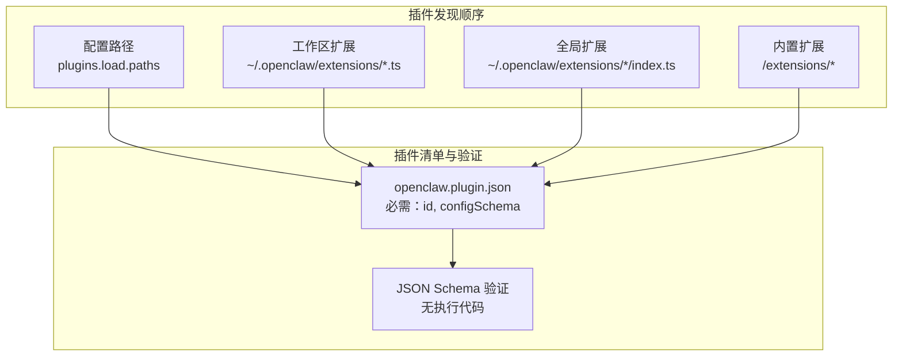
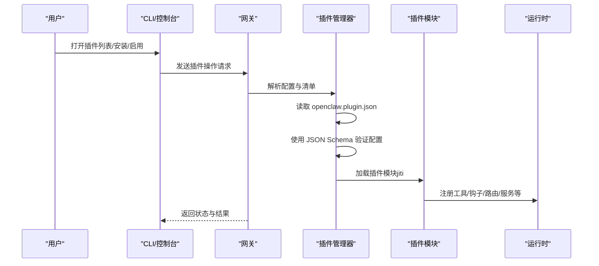
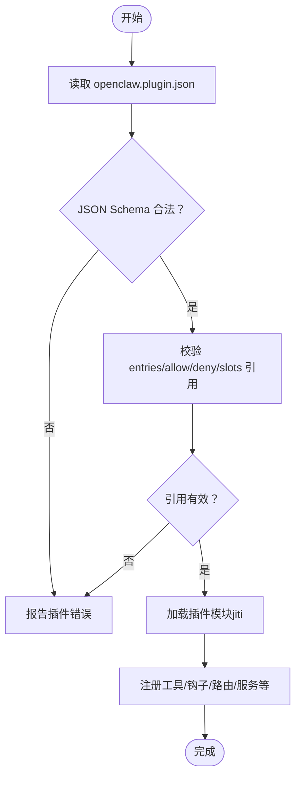
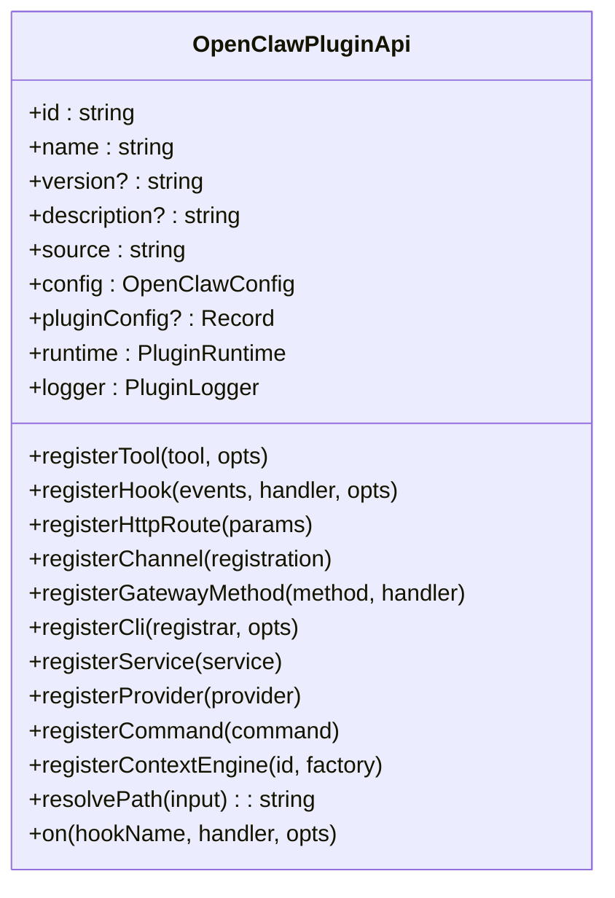
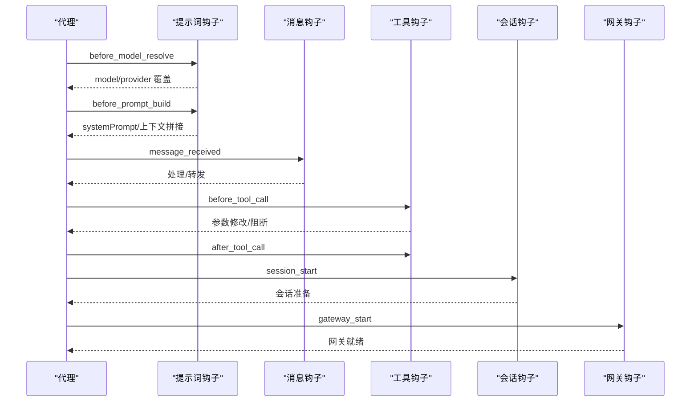
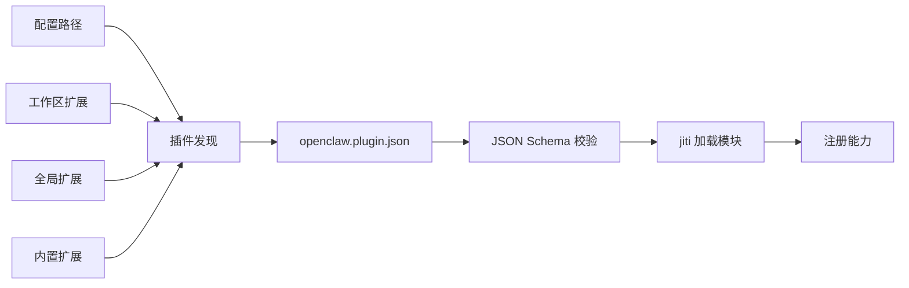

# 插件开发完整指南

<cite>
**本文档引用的文件**
- [README.md](file://README.md)
- [docs/plugins/manifest.md](file://docs/plugins/manifest.md)
- [docs/tools/plugin.md](file://docs/tools/plugin.md)
- [src/plugin-sdk/index.ts](file://src/plugin-sdk/index.ts)
- [src/plugins/types.ts](file://src/plugins/types.ts)
- [extensions/acpx/openclaw.plugin.json](file://extensions/acpx/openclaw.plugin.json)
- [extensions/discord/openclaw.plugin.json](file://extensions/discord/openclaw.plugin.json)
- [extensions/telegram/openclaw.plugin.json](file://extensions/telegram/openclaw.plugin.json)
- [extensions/diffs/openclaw.plugin.json](file://extensions/diffs/openclaw.plugin.json)
- [extensions/memory-core/openclaw.plugin.json](file://extensions/memory-core/openclaw.plugin.json)
</cite>

## 目录
1. [简介](#简介)
2. [项目结构](#项目结构)
3. [核心组件](#核心组件)
4. [架构总览](#架构总览)
5. [详细组件分析](#详细组件分析)
6. [依赖关系分析](#依赖关系分析)
7. [性能考虑](#性能考虑)
8. [故障排除指南](#故障排除指南)
9. [结论](#结论)
10. [附录](#附录)

## 简介
本指南面向希望在 OpenClaw 平台上开发插件（扩展）的开发者，系统阐述插件系统的整体架构、加载机制、生命周期管理与接口规范；给出从项目初始化、依赖配置到构建发布的完整流程；详解插件配置文件 openclaw.plugin.json 的结构与参数；提供最佳实践（代码组织、错误处理、日志记录、性能优化）、测试策略（单元、集成、端到端）以及调试技巧、常见问题解决方案与部署发布流程，并附带可直接参考的示例与模板。

## 项目结构
OpenClaw 将插件以“小而精”的 TypeScript 模块形式运行于网关进程内，通过严格清单与 JSON Schema 在不执行插件代码的前提下完成配置验证。插件发现遵循明确的优先级顺序：配置路径、工作区扩展、全局扩展、内置扩展。每个插件必须在根目录提供 openclaw.plugin.json 清单文件，用于声明 ID、类型、能力与配置模式。

**图表来源**
- [docs/tools/plugin.md:228-277](file://docs/tools/plugin.md#L228-L277)
- [docs/plugins/manifest.md:9-16](file://docs/plugins/manifest.md#L9-L16)

**章节来源**
- [docs/tools/plugin.md:228-277](file://docs/tools/plugin.md#L228-L277)
- [docs/plugins/manifest.md:9-16](file://docs/plugins/manifest.md#L9-L16)

## 核心组件
- 插件清单（openclaw.plugin.json）
  - 必填字段：id、configSchema
  - 可选字段：kind、channels、providers、skills、name、description、uiHints、version
  - 行为约束：缺失或无效清单被视为插件错误，阻止配置验证；manifest 仅用于发现与校验，运行时仍会单独加载模块
- 插件 API（OpenClawPluginApi）
  - 注册能力：工具、钩子、HTTP 路由、通道、网关方法、CLI、服务、提供者、命令、上下文引擎
  - 生命周期：register/activate 阶段；支持 on(...) 类型化钩子注册
  - 运行时访问：api.runtime 提供媒体、TTS/STT 等运行时能力
- 插件类型与钩子
  - OpenClawPluginDefinition/OpenClawPluginModule 支持函数式或对象式导出
  - 钩子覆盖提示词注入、消息收发、工具调用、会话与子代理生命周期等关键节点
- 插件槽位（Exclusive Slots）
  - memory、contextEngine 等为独占槽位，通过 plugins.slots.* 选择激活插件

**章节来源**
- [docs/plugins/manifest.md:18-76](file://docs/plugins/manifest.md#L18-L76)
- [src/plugins/types.ts:248-306](file://src/plugins/types.ts#L248-L306)
- [src/plugins/types.ts:321-394](file://src/plugins/types.ts#L321-L394)
- [docs/tools/plugin.md:393-426](file://docs/tools/plugin.md#L393-L426)

## 架构总览
下图展示插件在 OpenClaw 中的加载、验证与运行时交互：

**图表来源**
- [docs/tools/plugin.md:62-80](file://docs/tools/plugin.md#L62-L80)
- [docs/tools/plugin.md:357-392](file://docs/tools/plugin.md#L357-L392)

**章节来源**
- [docs/tools/plugin.md:62-80](file://docs/tools/plugin.md#L62-L80)
- [docs/tools/plugin.md:357-392](file://docs/tools/plugin.md#L357-L392)

## 详细组件分析

### 组件A：插件清单与配置验证
- 必需字段
  - id：插件唯一标识
  - configSchema：内联 JSON Schema，用于配置校验
- 可选字段
  - kind：插件类型（如 memory/context-engine）
  - channels/providers：声明注册的渠道/提供者 ID
  - skills：相对插件根目录的技能目录数组
  - name/description/uiHints/version：增强 UI 与文档体验
- 验证行为
  - 未知 channels.* 键除非被插件清单声明否则报错
  - plugins.entries.<id>、plugins.allow、plugins.deny、plugins.slots.* 必须引用可发现插件 ID
  - 清单缺失/损坏或 schema 不合法导致验证失败，Doctor 报告插件错误
  - 插件禁用但配置存在时保留配置并在 Doctor + 日志中警告

**图表来源**
- [docs/plugins/manifest.md:53-76](file://docs/plugins/manifest.md#L53-L76)
- [docs/tools/plugin.md:384-392](file://docs/tools/plugin.md#L384-L392)

**章节来源**
- [docs/plugins/manifest.md:18-76](file://docs/plugins/manifest.md#L18-L76)
- [docs/tools/plugin.md:384-392](file://docs/tools/plugin.md#L384-L392)

### 组件B：插件 API 与生命周期
- 导出方式
  - 函数式：(api) => { ... }
  - 对象式：{ id, name, configSchema, register(api) { ... } }
- 生命周期钩子
  - register/activate：在插件加载后进行一次性注册
  - api.on(...)：注册类型化钩子，覆盖提示词构建、消息收发、工具调用、会话与子代理生命周期等
- 运行时能力
  - api.runtime 提供媒体、TTS/STT 等运行时辅助方法
- 典型注册项
  - registerTool、registerHook、registerHttpRoute、registerChannel、registerGatewayMethod、registerCli、registerService、registerProvider、registerCommand、registerContextEngine

**图表来源**
- [src/plugins/types.ts:263-306](file://src/plugins/types.ts#L263-L306)

**章节来源**
- [src/plugins/types.ts:248-306](file://src/plugins/types.ts#L248-L306)
- [docs/tools/plugin.md:484-521](file://docs/tools/plugin.md#L484-L521)

### 组件C：插件钩子体系
- 钩子分类
  - 提示词注入：before_model_resolve、before_prompt_build、before_agent_start
  - 消息流：message_received、message_sending、message_sent、before_message_write
  - 工具链：before_tool_call、after_tool_call、tool_result_persist
  - 会话与子代理：session_start、session_end、subagent_spawning、subagent_delivery_target、subagent_spawned、subagent_ended
  - 网关：gateway_start、gateway_stop
- 结果与优先级
  - 钩子按优先级（数值越大越先）执行，合并同名字段时按执行顺序拼接
  - 提示词注入可通过 before_prompt_build 返回 prependContext、systemPrompt、prependSystemContext、appendSystemContext
  - 运营商可针对插件禁用提示词注入（plugins.entries.<id>.hooks.allowPromptInjection）

**图表来源**
- [src/plugins/types.ts:321-394](file://src/plugins/types.ts#L321-L394)
- [src/plugins/types.ts:422-488](file://src/plugins/types.ts#L422-L488)

**章节来源**
- [src/plugins/types.ts:321-394](file://src/plugins/types.ts#L321-L394)
- [src/plugins/types.ts:422-488](file://src/plugins/types.ts#L422-L488)
- [docs/tools/plugin.md:575-598](file://docs/tools/plugin.md#L575-L598)

### 组件D：HTTP 路由与安全
- 路由注册
  - api.registerHttpRoute({ path, auth, match?, replaceExisting? })
  - auth 可为 "gateway" 或 "plugin"，match 默认 "exact"
  - exact/prefix 冲突受控，不同 auth 级别不允许重叠
- 安全与限制
  - 必须显式声明 auth
  - 覆盖现有路由需 replaceExisting: true，且同一插件不可覆盖其他插件路由
  - 建议使用 exact 匹配避免意外降级

**章节来源**
- [docs/tools/plugin.md:114-145](file://docs/tools/plugin.md#L114-L145)

### 组件E：通道插件与提供者认证
- 通道插件
  - 通过 api.registerChannel({ plugin }) 注册，通道配置位于 channels.<id> 下
  - 可实现 onboarding、security、status、gateway、mentions、threading、streaming、actions、commands 等适配器
- 提供者认证
  - 通过 api.registerProvider(...) 注册模型提供者认证方法（OAuth/API Key/设备码等）
  - 支持在 CLI 中一键登录与默认模型设置

**章节来源**
- [docs/tools/plugin.md:655-721](file://docs/tools/plugin.md#L655-L721)
- [docs/tools/plugin.md:604-654](file://docs/tools/plugin.md#L604-L654)

## 依赖关系分析
- 插件清单与 JSON Schema
  - 所有插件必须提供 openclaw.plugin.json 与 configSchema，用于严格配置校验
- 插件发现与优先级
  - 配置路径 > 工作区扩展 > 全局扩展 > 内置扩展
  - 多个同 id 插件以首次匹配为准
- 运行时加载
  - 清单仅用于发现与校验，实际模块加载通过 jiti，确保不执行未验证代码
- 插件槽位
  - memory/contextEngine 为独占槽位，通过 plugins.slots.* 选择

**图表来源**
- [docs/tools/plugin.md:228-277](file://docs/tools/plugin.md#L228-L277)
- [docs/plugins/manifest.md:9-16](file://docs/plugins/manifest.md#L9-L16)

**章节来源**
- [docs/tools/plugin.md:228-277](file://docs/tools/plugin.md#L228-L277)
- [docs/plugins/manifest.md:9-16](file://docs/plugins/manifest.md#L9-L16)

## 性能考虑
- 缓存策略
  - 插件发现与清单元数据使用短时进程内缓存，减少启动/重载抖动
  - 可通过环境变量禁用缓存或调整缓存窗口
- 路由与钩子
  - 精确匹配（exact）优于前缀匹配（prefix），避免不必要的降级
  - 合理设置钩子优先级，避免过度拼接导致提示词膨胀
- 运行时能力
  - 使用 api.runtime 提供的媒体/语音能力，避免重复实现

**章节来源**
- [docs/tools/plugin.md:219-227](file://docs/tools/plugin.md#L219-L227)
- [docs/tools/plugin.md:114-145](file://docs/tools/plugin.md#L114-L145)

## 故障排除指南
- 清单与配置错误
  - 缺失或非法 openclaw.plugin.json：验证失败，Doctor 报告插件错误
  - 未知插件 ID 或 channels.* 键：报错
  - 插件禁用但配置存在：保留配置并警告
- 安装与信任
  - 未在 plugins.allow 中列出的非内置插件：启动时警告
  - 安全检查：禁止世界可写路径、可疑所有权、路径逃逸
- 调试建议
  - 使用 openclaw plugins doctor 检查插件健康状况
  - 开启详细日志，关注插件注册与钩子执行阶段
  - 临时禁用可疑插件以定位问题

**章节来源**
- [docs/tools/plugin.md:262-270](file://docs/tools/plugin.md#L262-L270)
- [docs/tools/plugin.md:384-392](file://docs/tools/plugin.md#L384-L392)

## 结论
OpenClaw 插件系统以“清单 + JSON Schema”的严格验证为核心，结合类型化的 API 与钩子体系，提供了强大的扩展能力。通过清晰的发现顺序、独占槽位与安全策略，既保证了灵活性，也维护了系统的稳定性与安全性。遵循本文档的开发流程、最佳实践与测试策略，可高效构建高质量的插件。

## 附录

### A. 插件开发流程（从零到上线）
- 初始化项目
  - 创建插件根目录，编写 openclaw.plugin.json（至少包含 id 与 configSchema）
  - 如需通道能力，在插件中实现 ChannelPlugin 并通过 api.registerChannel 注册
- 依赖与构建
  - 若需要 npm 依赖，安装至插件目录，确保 node_modules 可用
  - 使用 pnpm/cnpm/bun 进行开发与打包（遵循仓库开发通道）
- 配置与验证
  - 在配置中启用插件（plugins.entries.<id>.enabled），并通过 plugins.slots.* 选择独占槽位
  - 使用 JSON Schema 验证配置，确保无语法与逻辑错误
- 测试
  - 单元测试：对工具与钩子逻辑进行隔离测试
  - 集成测试：模拟消息收发、工具调用与会话生命周期
  - 端到端测试：在真实网关环境中验证插件与通道/提供者的协同
- 调试与发布
  - 使用 openclaw plugins doctor 检查健康度
  - 本地链接开发版本（plugins install -l）进行迭代
  - 正式发布时通过 npm 安装或本地打包分发

**章节来源**
- [docs/tools/plugin.md:460-483](file://docs/tools/plugin.md#L460-L483)
- [docs/tools/plugin.md:278-304](file://docs/tools/plugin.md#L278-L304)

### B. 插件配置文件结构与参数详解
- 必填字段
  - id：插件唯一标识
  - configSchema：内联 JSON Schema，用于配置校验
- 可选字段
  - kind：插件类型（如 memory/context-engine）
  - channels/providers：声明注册的渠道/提供者 ID
  - skills：相对插件根目录的技能目录数组
  - name/description/uiHints/version：增强 UI 与文档体验
- 示例参考
  - 通道插件（Discord/Telegram）：声明 channels 数组
  - 记忆插件（memory-core）：声明 kind: "memory"
  - 复杂配置插件（Diffs）：提供 uiHints 与嵌套 defaults/security 配置
  - ACPX 运行时（acpx）：提供命令、版本策略、权限模式、MCP 服务器等高级配置

**章节来源**
- [docs/plugins/manifest.md:18-76](file://docs/plugins/manifest.md#L18-L76)
- [extensions/discord/openclaw.plugin.json:1-10](file://extensions/discord/openclaw.plugin.json#L1-L10)
- [extensions/telegram/openclaw.plugin.json:1-10](file://extensions/telegram/openclaw.plugin.json#L1-L10)
- [extensions/memory-core/openclaw.plugin.json:1-10](file://extensions/memory-core/openclaw.plugin.json#L1-L10)
- [extensions/diffs/openclaw.plugin.json:1-183](file://extensions/diffs/openclaw.plugin.json#L1-L183)
- [extensions/acpx/openclaw.plugin.json:1-106](file://extensions/acpx/openclaw.plugin.json#L1-L106)

### C. 插件开发最佳实践
- 代码组织
  - 将工具、钩子、HTTP 路由、通道适配器按功能拆分模块，保持单一职责
  - 使用 src/plugin-sdk 的子路径导入，避免引入无关依赖
- 错误处理
  - 在钩子与工具中返回明确的错误信息，便于 Doctor 诊断
  - 对外部依赖（网络/文件）添加超时与重试策略
- 日志记录
  - 使用 api.logger 输出 debug/info/warn/error，避免直接 console
  - 对敏感信息（密钥、令牌）进行脱敏输出
- 性能优化
  - 合理使用钩子优先级，避免过度拼接提示词
  - 利用 api.runtime 提供的媒体/语音能力，减少重复实现
  - 控制插件加载数量，避免过多独占槽位竞争

**章节来源**
- [src/plugin-sdk/index.ts:146-175](file://src/plugin-sdk/index.ts#L146-L175)
- [docs/tools/plugin.md:575-598](file://docs/tools/plugin.md#L575-L598)

### D. 插件测试策略
- 单元测试
  - 针对工具函数与钩子处理器进行独立测试，使用 mock 上下文
- 集成测试
  - 模拟消息收发、工具调用与会话生命周期，验证插件与核心系统的交互
- 端到端测试
  - 在真实网关环境中安装插件，执行典型场景（发送消息、触发命令、调用工具）
- 自动化
  - 在 CI 中执行测试套件，确保变更不会破坏现有功能

**章节来源**
- [docs/tools/plugin.md:522-550](file://docs/tools/plugin.md#L522-L550)

### E. 插件调试技巧
- 使用 openclaw plugins doctor 查看插件健康状态与错误
- 通过 openclaw hooks list 查看已注册钩子及其来源
- 临时禁用可疑插件以定位问题
- 在插件中增加细粒度日志，区分 info/warn/error 级别

**章节来源**
- [docs/tools/plugin.md:476-477](file://docs/tools/plugin.md#L476-L477)
- [docs/tools/plugin.md:544-550](file://docs/tools/plugin.md#L544-L550)

### F. 部署与发布
- 本地开发
  - 使用 openclaw plugins install -l 链接本地插件目录进行快速迭代
- 生产发布
  - 通过 npm 发布插件包，确保 package.json 与 openclaw.plugin.json 完整
  - 在 README 中提供安装与配置说明，附上最小可运行示例

**章节来源**
- [docs/tools/plugin.md:460-483](file://docs/tools/plugin.md#L460-L483)