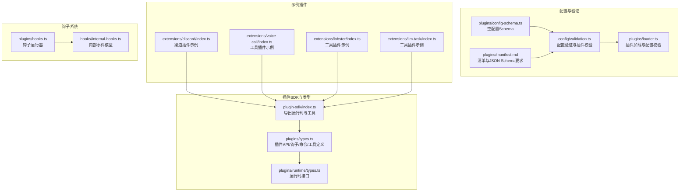
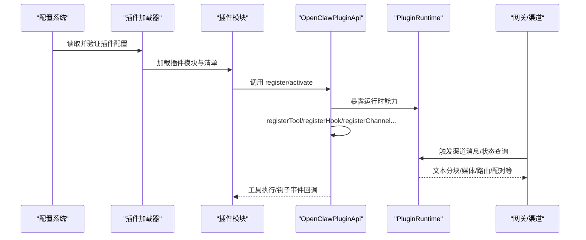
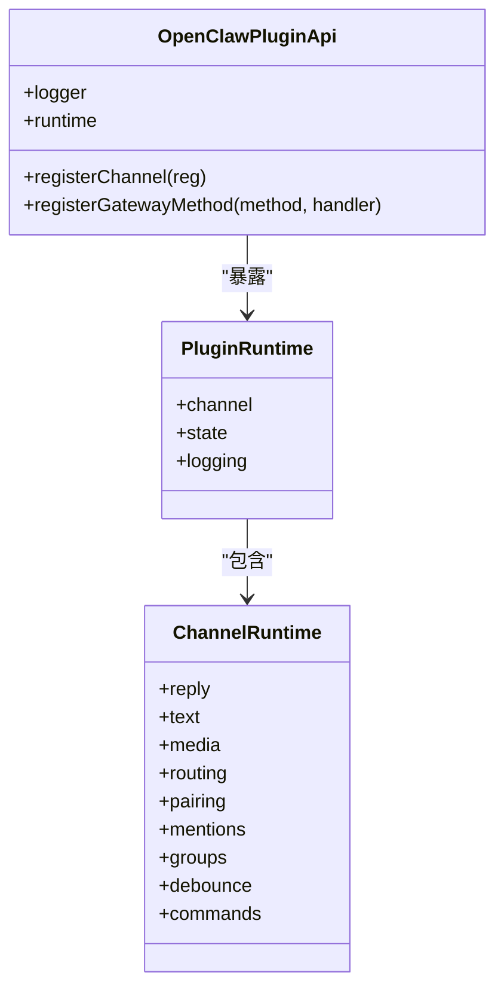
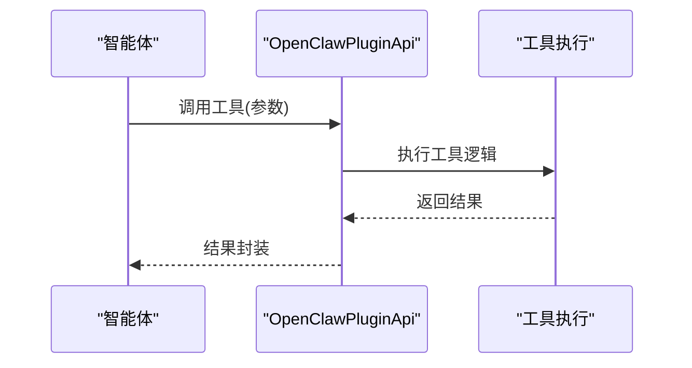
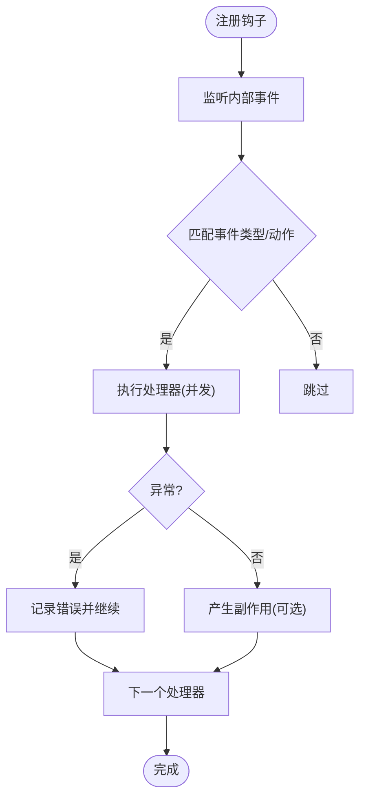
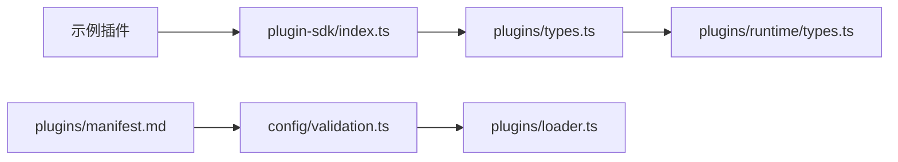

# 插件类型和开发

<cite>
**本文引用的文件**
- [types.ts](file://src/plugins/types.ts)
- [config-schema.ts](file://src/plugins/config-schema.ts)
- [runtime/types.ts](file://src/plugins/runtime/types.ts)
- [plugin-sdk.md](file://docs/refactor/plugin-sdk.md)
- [plugin-sdk.md](file://docs/zh-CN/refactor/plugin-sdk.md)
- [index.ts](file://src/plugin-sdk/index.ts)
- [discord/index.ts](file://extensions/discord/index.ts)
- [voice-call/index.ts](file://extensions/voice-call/index.ts)
- [lobster/index.ts](file://extensions/lobster/index.ts)
- [llm-task/index.ts](file://extensions/llm-task/index.ts)
- [manifest.md](file://docs/plugins/manifest.md)
- [validation.ts](file://src/config/validation.ts)
- [loader.ts](file://src/plugins/loader.ts)
- [hooks.ts](file://src/plugins/hooks.ts)
- [internal-hooks.ts](file://src/hooks/internal-hooks.ts)
- [internal-hooks.test.ts](file://src/hooks/internal-hooks.test.ts)
- [plugin-runtime-mock.ts](file://extensions/test-utils/plugin-runtime-mock.ts)
- [config-state.ts](file://src/plugins/config-state.ts)
- [setup.ts](file://test/setup.ts)
</cite>

## 目录
1. [引言](#引言)
2. [项目结构](#项目结构)
3. [核心组件](#核心组件)
4. [架构总览](#架构总览)
5. [详细组件分析](#详细组件分析)
6. [依赖关系分析](#依赖关系分析)
7. [性能考量](#性能考量)
8. [故障排查指南](#故障排查指南)
9. [结论](#结论)
10. [附录](#附录)

## 引言
本指南面向希望在 OpenClaw 中开发不同类型插件的开发者，系统讲解三类插件的开发范式与最佳实践：
- 渠道插件：负责消息收发、用户认证、会话路由与状态管理。
- 工具插件：定义可被智能体调用的工具，包含参数校验与结果处理。
- 钩子插件：注册内部事件钩子，实现事件监听、条件触发与副作用处理。

同时，文档覆盖插件配置管理（参数定义、默认值、验证规则）、测试策略与调试技巧，并提供从基础模板到高级功能的完整开发示例路径。

## 项目结构
OpenClaw 的插件体系由“插件 SDK”“插件类型与运行时”“插件清单与配置验证”“示例插件”“钩子系统”等模块构成。下图展示关键模块之间的关系：

**图表来源**
- [index.ts:1-826](file://src/plugin-sdk/index.ts#L1-L826)
- [types.ts:248-306](file://src/plugins/types.ts#L248-L306)
- [runtime/types.ts:51-63](file://src/plugins/runtime/types.ts#L51-L63)
- [config-schema.ts:13-33](file://src/plugins/config-schema.ts#L13-L33)
- [validation.ts:308-604](file://src/config/validation.ts#L308-L604)
- [loader.ts:175-217](file://src/plugins/loader.ts#L175-L217)
- [manifest.md:1-76](file://docs/plugins/manifest.md#L1-L76)
- [discord/index.ts:1-20](file://extensions/discord/index.ts#L1-L20)
- [voice-call/index.ts:146-540](file://extensions/voice-call/index.ts#L146-L540)
- [lobster/index.ts:1-19](file://extensions/lobster/index.ts#L1-L19)
- [llm-task/index.ts:1-7](file://extensions/llm-task/index.ts#L1-L7)
- [hooks.ts:184-224](file://src/plugins/hooks.ts#L184-L224)
- [internal-hooks.ts:290-344](file://src/hooks/internal-hooks.ts#L290-L344)

**章节来源**
- [index.ts:1-826](file://src/plugin-sdk/index.ts#L1-L826)
- [types.ts:248-306](file://src/plugins/types.ts#L248-L306)
- [runtime/types.ts:51-63](file://src/plugins/runtime/types.ts#L51-L63)
- [manifest.md:1-76](file://docs/plugins/manifest.md#L1-L76)

## 核心组件
本节聚焦插件开发的核心抽象与职责边界：
- 插件API（OpenClawPluginApi）：统一入口，提供注册工具、钩子、HTTP路由、渠道、网关方法、CLI、服务、提供商等能力。
- 运行时（PluginRuntime）：面向渠道插件的运行时能力，如文本分块、回复派发、路由、配对、媒体、提及、群组策略、去抖、命令授权等；还包含子代理运行能力。
- 配置Schema：插件必须提供 JSON Schema，用于严格配置验证；可通过空Schema支持无配置插件。
- 钩子系统：内置事件名集合与事件上下文，支持并发异步处理与错误隔离。

关键要点：
- 渠道插件通过 registerChannel 注册 ChannelPlugin，使用 runtime.channel 能力处理消息与状态。
- 工具插件通过 registerTool 或 registerTool 工厂注册，结合参数校验与结果封装。
- 钩子插件通过 registerHook 或 on 注册，监听内部事件并执行副作用。

**章节来源**
- [types.ts:263-306](file://src/plugins/types.ts#L263-L306)
- [runtime/types.ts:51-63](file://src/plugins/runtime/types.ts#L51-L63)
- [config-schema.ts:13-33](file://src/plugins/config-schema.ts#L13-L33)
- [plugin-sdk.md:45-145](file://docs/refactor/plugin-sdk.md#L45-L145)

## 架构总览
下图展示插件生命周期与交互流程：从配置加载、插件发现与校验，到运行时能力暴露、工具注册、钩子注册与事件触发，再到渠道消息处理与状态管理。

**图表来源**
- [validation.ts:308-604](file://src/config/validation.ts#L308-L604)
- [loader.ts:175-217](file://src/plugins/loader.ts#L175-L217)
- [types.ts:254-287](file://src/plugins/types.ts#L254-L287)
- [runtime/types.ts:51-63](file://src/plugins/runtime/types.ts#L51-L63)

## 详细组件分析

### 渠道插件开发指南
渠道插件负责与具体消息平台对接，涵盖消息处理、用户认证、会话路由与状态管理。

- 基础模板
  - 参考：[extensions/discord/index.ts:1-20](file://extensions/discord/index.ts#L1-L20)
  - 步骤：定义插件 id/name/description/configSchema，调用 api.registerChannel 注册 ChannelPlugin，必要时设置运行时能力。

- 消息处理
  - 使用 runtime.channel.reply.dispatchReplyWithBufferedBlockDispatcher 派发回复。
  - 使用 runtime.channel.text.chunkMarkdownText 控制输出长度。
  - 使用 runtime.channel.media.fetchRemoteMedia/saveMediaBuffer 处理媒体。

- 用户认证
  - 使用 runtime.channel.pairing.buildPairingReply/readAllowFromStore/upsertPairingRequest 管理配对与允许列表。
  - 结合 runtime.channel.commands.resolveCommandAuthorizedFromAuthorizers 判断命令授权。

- 状态管理
  - 使用 runtime.channel.routing.resolveAgentRoute 解析会话键与账户。
  - 使用 runtime.state.resolveStateDir 获取状态目录。
  - 使用 runtime.logging.getChildLogger 获取子日志器。

- 完整示例路径
  - 渠道插件示例：[extensions/discord/index.ts:1-20](file://extensions/discord/index.ts#L1-L20)

**图表来源**
- [types.ts:263-306](file://src/plugins/types.ts#L263-L306)
- [runtime/types.ts:51-63](file://src/plugins/runtime/types.ts#L51-L63)
- [plugin-sdk.md:45-145](file://docs/refactor/plugin-sdk.md#L45-L145)

**章节来源**
- [discord/index.ts:1-20](file://extensions/discord/index.ts#L1-L20)
- [plugin-sdk.md:45-145](file://docs/refactor/plugin-sdk.md#L45-L145)
- [plugin-sdk.md:42-152](file://docs/zh-CN/refactor/plugin-sdk.md#L42-L152)

### 工具插件开发指南
工具插件向智能体暴露可调用的工具，需定义工具名称、参数 Schema、执行逻辑与结果封装。

- 工具定义与注册
  - 使用 api.registerTool 或 OpenClawPluginToolFactory 注册工具。
  - 参考示例：[extensions/lobster/index.ts:1-19](file://extensions/lobster/index.ts#L1-L19)、[extensions/llm-task/index.ts:1-7](file://extensions/llm-task/index.ts#L1-L7)

- 参数验证
  - 在插件中自定义 parse/uiHints/jsonSchema，参考：[extensions/voice-call/index.ts:16-111](file://extensions/voice-call/index.ts#L16-L111)
  - 使用 JSON Schema 严格约束输入，避免运行时错误。

- 结果处理
  - 工具执行返回结构化内容，便于后续钩子与会话记录处理。
  - 参考：[extensions/voice-call/index.ts:377-497](file://extensions/voice-call/index.ts#L377-L497)

- 完整示例路径
  - 语音通话工具插件：[extensions/voice-call/index.ts:146-540](file://extensions/voice-call/index.ts#L146-L540)

**图表来源**
- [types.ts:75-83](file://src/plugins/types.ts#L75-L83)
- [voice-call/index.ts:377-497](file://extensions/voice-call/index.ts#L377-L497)

**章节来源**
- [lobster/index.ts:1-19](file://extensions/lobster/index.ts#L1-L19)
- [llm-task/index.ts:1-7](file://extensions/llm-task/index.ts#L1-L7)
- [voice-call/index.ts:16-111](file://extensions/voice-call/index.ts#L16-L111)
- [voice-call/index.ts:377-497](file://extensions/voice-call/index.ts#L377-L497)

### 钩子插件开发指南
钩子插件通过注册内部事件钩子，实现对 Agent 生命周期、消息流、工具调用等环节的监听与干预。

- 事件监听与注册
  - 使用 api.registerHook 或 api.on 注册钩子处理器。
  - 支持并发异步处理，错误被捕获并记录，不影响其他处理器。
  - 参考：[src/plugins/hooks.ts:184-224](file://src/plugins/hooks.ts#L184-L224)

- 事件类型与上下文
  - 内部事件模型与事件创建：[src/hooks/internal-hooks.ts:290-344](file://src/hooks/internal-hooks.ts#L290-L344)
  - 测试用例覆盖通用/特定事件、异步处理器与错误捕获：[src/hooks/internal-hooks.test.ts:54-135](file://src/hooks/internal-hooks.test.ts#L54-L135)

- 条件触发与副作用
  - 在处理器中根据事件上下文决定是否阻断、修改或记录副作用。
  - 示例：before_tool_call/after_tool_call/message_sending 等事件可用于拦截与增强消息流。

**图表来源**
- [hooks.ts:184-224](file://src/plugins/hooks.ts#L184-L224)
- [internal-hooks.ts:290-344](file://src/hooks/internal-hooks.ts#L290-L344)
- [internal-hooks.test.ts:54-135](file://src/hooks/internal-hooks.test.ts#L54-L135)

**章节来源**
- [hooks.ts:184-224](file://src/plugins/hooks.ts#L184-L224)
- [internal-hooks.ts:290-344](file://src/hooks/internal-hooks.ts#L290-L344)
- [internal-hooks.test.ts:54-135](file://src/hooks/internal-hooks.test.ts#L54-L135)

## 依赖关系分析
- 插件SDK与类型
  - plugin-sdk/index.ts 统一导出运行时、工具、类型与辅助函数，供插件模块使用。
- 配置与验证
  - plugins/config-schema.ts 提供空配置 Schema；manifest.md 要求每个插件提供 JSON Schema；config/validation.ts 与 plugins/loader.ts 负责配置与插件清单的严格校验。
- 示例插件
  - discord/voice-call/lobster/llm-task 展示了不同插件类型的典型实现路径。

**图表来源**
- [index.ts:1-826](file://src/plugin-sdk/index.ts#L1-L826)
- [types.ts:248-306](file://src/plugins/types.ts#L248-L306)
- [runtime/types.ts:51-63](file://src/plugins/runtime/types.ts#L51-L63)
- [manifest.md:1-76](file://docs/plugins/manifest.md#L1-L76)
- [validation.ts:308-604](file://src/config/validation.ts#L308-L604)
- [loader.ts:175-217](file://src/plugins/loader.ts#L175-L217)

**章节来源**
- [index.ts:1-826](file://src/plugin-sdk/index.ts#L1-L826)
- [manifest.md:1-76](file://docs/plugins/manifest.md#L1-L76)
- [validation.ts:308-604](file://src/config/validation.ts#L308-L604)
- [loader.ts:175-217](file://src/plugins/loader.ts#L175-L217)

## 性能考量
- 并发钩子执行：钩子运行器对处理器采用并发执行，提升吞吐；注意避免共享状态竞争。
- 去抖与限流：渠道运行时提供 inbound debouncer 与 webhook 内存守卫，减少重复与突发请求。
- 子代理运行：通过子代理运行接口进行异步会话管理，避免阻塞主流程。
- 日志与诊断：运行时提供 verbose 日志开关与诊断事件，便于定位性能瓶颈。

[本节为通用指导，无需特定文件来源]

## 故障排查指南
- 配置验证失败
  - 检查插件清单与 JSON Schema 是否符合要求；参考：[manifest.md:47-76](file://docs/plugins/manifest.md#L47-L76)
  - 查看配置验证与插件校验结果中的问题与警告；参考：[validation.ts:308-604](file://src/config/validation.ts#L308-L604)、[loader.ts:175-217](file://src/plugins/loader.ts#L175-L217)

- 插件加载与启用
  - 确认插件 id 是否在 plugins.allow/plugins.deny/plugins.slots 中正确声明；参考：[validation.ts:504-527](file://src/config/validation.ts#L504-L527)
  - 在测试环境应用默认插件配置；参考：[config-state.ts:137-173](file://src/plugins/config-state.ts#L137-L173)、[setup.ts:198-210](file://test/setup.ts#L198-L210)

- 钩子异常
  - 钩子处理器异常会被捕获并记录，不影响其他处理器；参考：[hooks.ts:184-197](file://src/plugins/hooks.ts#L184-L197)
  - 单元测试覆盖通用/特定事件与异步处理器；参考：[internal-hooks.test.ts:54-135](file://src/hooks/internal-hooks.test.ts#L54-L135)

- 运行时模拟与测试
  - 使用插件运行时 Mock 快速搭建测试场景；参考：[plugin-runtime-mock.ts:35-271](file://extensions/test-utils/plugin-runtime-mock.ts#L35-L271)

**章节来源**
- [manifest.md:47-76](file://docs/plugins/manifest.md#L47-L76)
- [validation.ts:308-604](file://src/config/validation.ts#L308-L604)
- [loader.ts:175-217](file://src/plugins/loader.ts#L175-L217)
- [config-state.ts:137-173](file://src/plugins/config-state.ts#L137-L173)
- [setup.ts:198-210](file://test/setup.ts#L198-L210)
- [hooks.ts:184-197](file://src/plugins/hooks.ts#L184-L197)
- [internal-hooks.test.ts:54-135](file://src/hooks/internal-hooks.test.ts#L54-L135)
- [plugin-runtime-mock.ts:35-271](file://extensions/test-utils/plugin-runtime-mock.ts#L35-L271)

## 结论
OpenClaw 的插件体系以清晰的 API 抽象与严格的配置验证为基础，辅以丰富的运行时能力与钩子机制，既满足渠道插件的消息与状态管理需求，也支持工具插件的参数校验与结果封装，还能通过钩子插件实现对 Agent 生命周期的灵活扩展。遵循本文档的开发范式与测试策略，可高效构建稳定、可维护的插件生态。

[本节为总结性内容，无需特定文件来源]

## 附录

### 插件类型与职责速览
- 渠道插件：注册 ChannelPlugin，使用 runtime.channel 处理消息、配对、媒体、路由与群组策略。
- 工具插件：注册工具，定义参数 Schema 与执行逻辑，返回结构化结果。
- 钩子插件：注册内部事件钩子，实现条件触发与副作用处理。

**章节来源**
- [types.ts:248-306](file://src/plugins/types.ts#L248-L306)
- [runtime/types.ts:51-63](file://src/plugins/runtime/types.ts#L51-L63)

### 开发示例路径索引
- 渠道插件：[extensions/discord/index.ts:1-20](file://extensions/discord/index.ts#L1-L20)
- 工具插件（语音通话）：[extensions/voice-call/index.ts:146-540](file://extensions/voice-call/index.ts#L146-L540)
- 工具插件（lobster）：[extensions/lobster/index.ts:1-19](file://extensions/lobster/index.ts#L1-L19)
- 工具插件（llm-task）：[extensions/llm-task/index.ts:1-7](file://extensions/llm-task/index.ts#L1-L7)

**章节来源**
- [discord/index.ts:1-20](file://extensions/discord/index.ts#L1-L20)
- [voice-call/index.ts:146-540](file://extensions/voice-call/index.ts#L146-L540)
- [lobster/index.ts:1-19](file://extensions/lobster/index.ts#L1-L19)
- [llm-task/index.ts:1-7](file://extensions/llm-task/index.ts#L1-L7)