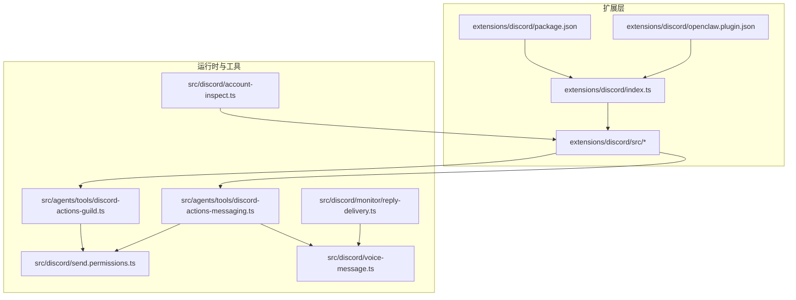
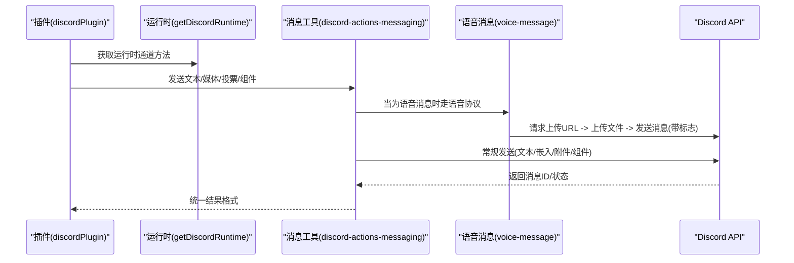
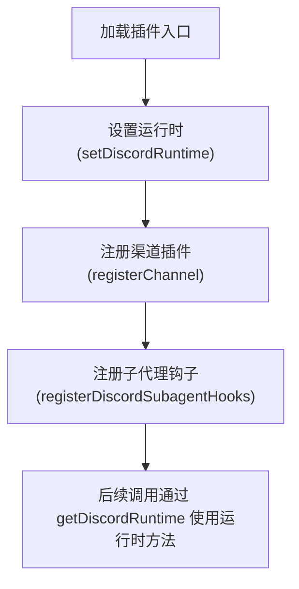
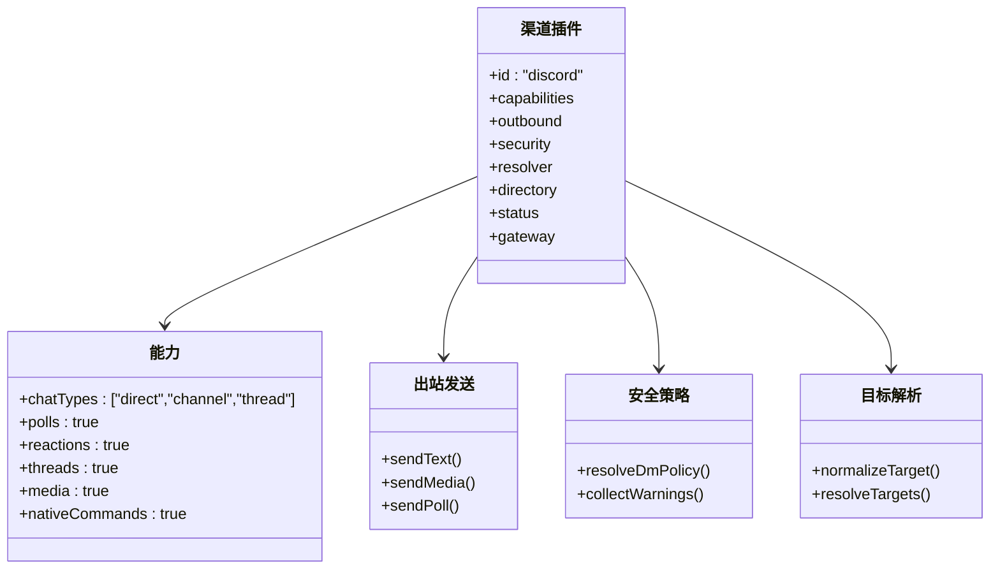
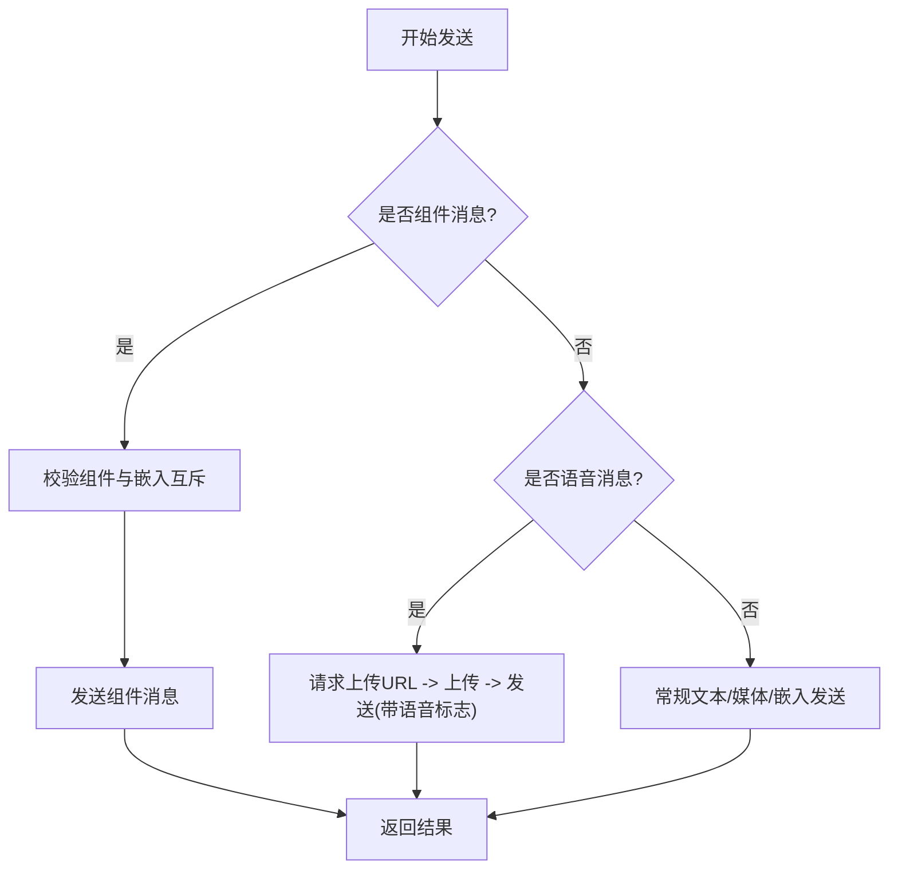
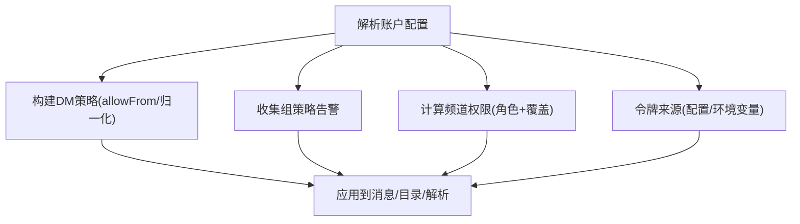
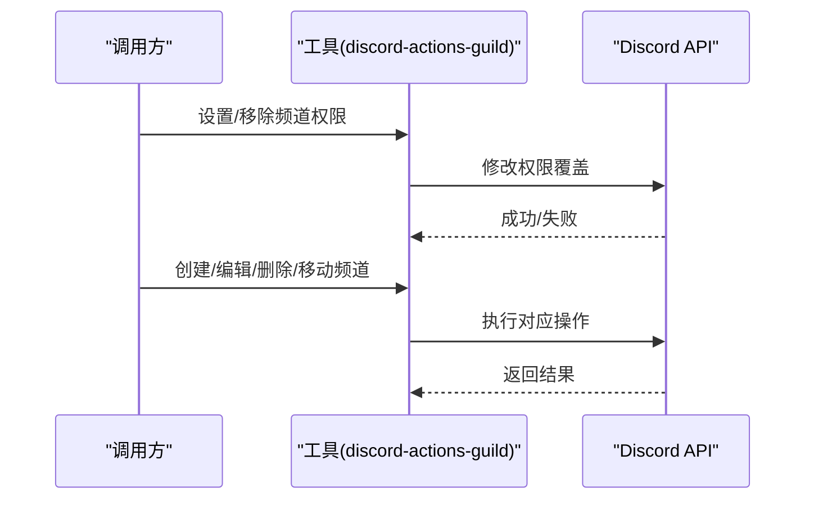
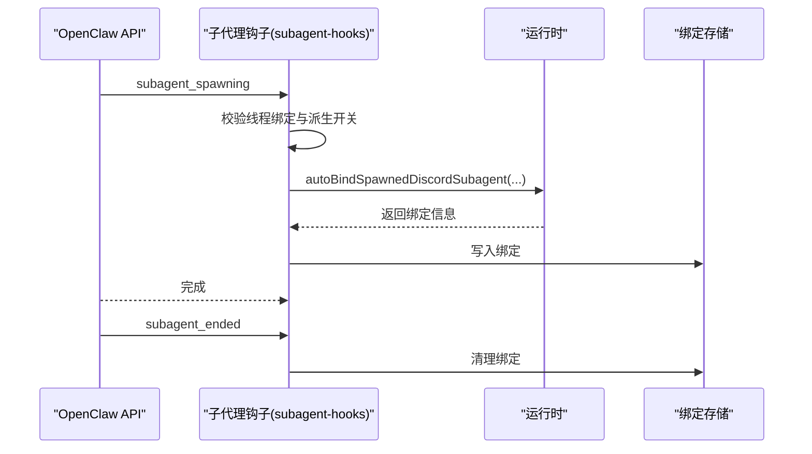
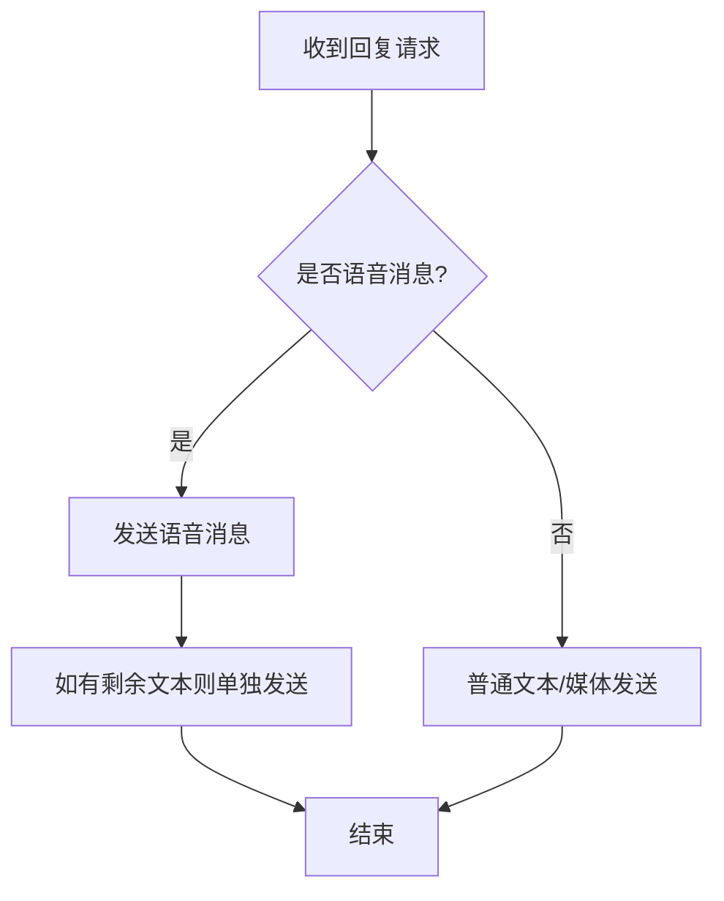
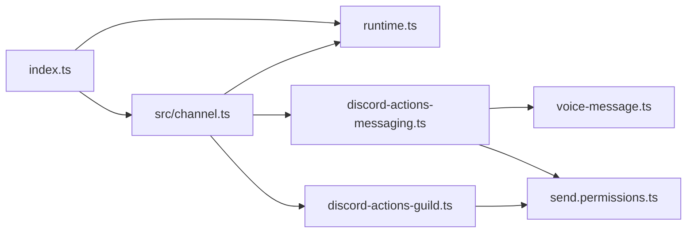

# Discord 渠道插件

<cite>
**本文引用的文件**
- [extensions/discord/index.ts](file://extensions/discord/index.ts)
- [extensions/discord/package.json](file://extensions/discord/package.json)
- [extensions/discord/openclaw.plugin.json](file://extensions/discord/openclaw.plugin.json)
- [extensions/discord/src/channel.ts](file://extensions/discord/src/channel.ts)
- [extensions/discord/src/runtime.ts](file://extensions/discord/src/runtime.ts)
- [extensions/discord/src/subagent-hooks.ts](file://extensions/discord/src/subagent-hooks.ts)
- [skills/discord/SKILL.md](file://skills/discord/SKILL.md)
- [src/discord/account-inspect.ts](file://src/discord/account-inspect.ts)
- [src/discord/send.permissions.ts](file://src/discord/send.permissions.ts)
- [src/agents/tools/discord-actions-messaging.ts](file://src/agents/tools/discord-actions-messaging.ts)
- [src/agents/tools/discord-actions-guild.ts](file://src/agents/tools/discord-actions-guild.ts)
- [src/discord/monitor/reply-delivery.ts](file://src/discord/monitor/reply-delivery.ts)
- [src/discord/voice-message.ts](file://src/discord/voice-message.ts)
</cite>

## 目录
1. [简介](#简介)
2. [项目结构](#项目结构)
3. [核心组件](#核心组件)
4. [架构总览](#架构总览)
5. [详细组件分析](#详细组件分析)
6. [依赖关系分析](#依赖关系分析)
7. [性能考量](#性能考量)
8. [故障排查指南](#故障排查指南)
9. [结论](#结论)
10. [附录](#附录)

## 简介
本文件为 Discord 渠道插件的开发与使用文档，面向需要在 OpenClaw 生态中集成 Discord 的开发者与运维人员。内容涵盖：
- Bot 认证与令牌管理（含环境变量注入）
- 消息收发流程（文本、嵌入、附件、语音消息）
- 权限与安全策略（DM 政策、组路由白名单、意图提示）
- 频道与服务器管理（权限设置、频道创建/编辑/删除、分类管理）
- 线程绑定与子代理会话联动
- 错误处理、重连与可观测性
- 实战示例（以路径形式给出，避免直接粘贴代码）

## 项目结构
该插件位于扩展目录下，通过插件 SDK 注册为渠道插件，并由运行时承载实际的 Discord API 调用。

图示来源
- [extensions/discord/index.ts:1-20](file://extensions/discord/index.ts#L1-L20)
- [extensions/discord/package.json:1-12](file://extensions/discord/package.json#L1-L12)
- [extensions/discord/openclaw.plugin.json:1-10](file://extensions/discord/openclaw.plugin.json#L1-L10)
- [extensions/discord/src/channel.ts:1-463](file://extensions/discord/src/channel.ts#L1-L463)
- [src/agents/tools/discord-actions-messaging.ts:170-316](file://src/agents/tools/discord-actions-messaging.ts#L170-L316)
- [src/agents/tools/discord-actions-guild.ts:274-506](file://src/agents/tools/discord-actions-guild.ts#L274-L506)
- [src/discord/voice-message.ts:240-364](file://src/discord/voice-message.ts#L240-L364)
- [src/discord/send.permissions.ts:178-232](file://src/discord/send.permissions.ts#L178-L232)
- [src/discord/monitor/reply-delivery.ts:340-382](file://src/discord/monitor/reply-delivery.ts#L340-L382)
- [src/discord/account-inspect.ts:88-129](file://src/discord/account-inspect.ts#L88-L129)

章节来源
- [extensions/discord/index.ts:1-20](file://extensions/discord/index.ts#L1-L20)
- [extensions/discord/package.json:1-12](file://extensions/discord/package.json#L1-L12)
- [extensions/discord/openclaw.plugin.json:1-10](file://extensions/discord/openclaw.plugin.json#L1-L10)
- [extensions/discord/src/channel.ts:1-463](file://extensions/discord/src/channel.ts#L1-L463)

## 核心组件
- 插件入口与注册：负责初始化运行时、注册渠道与子代理钩子。
- 渠道插件定义：封装 Discord 的能力边界、消息动作适配器、安全策略、目录解析、目标解析、出站发送等。
- 运行时存储：集中存放 Discord 的运行时方法（发送、探测、监控等）。
- 子代理钩子：实现线程绑定、子代理会话派生与完成回传。

章节来源
- [extensions/discord/index.ts:7-20](file://extensions/discord/index.ts#L7-L20)
- [extensions/discord/src/channel.ts:74-463](file://extensions/discord/src/channel.ts#L74-L463)
- [extensions/discord/src/runtime.ts:1-7](file://extensions/discord/src/runtime.ts#L1-L7)
- [extensions/discord/src/subagent-hooks.ts:19-153](file://extensions/discord/src/subagent-hooks.ts#L19-L153)

## 架构总览
下图展示了从插件到运行时再到 Discord API 的调用链路，以及关键的权限与语音消息路径。

图示来源
- [extensions/discord/src/channel.ts:302-342](file://extensions/discord/src/channel.ts#L302-L342)
- [src/agents/tools/discord-actions-messaging.ts:272-316](file://src/agents/tools/discord-actions-messaging.ts#L272-L316)
- [src/discord/voice-message.ts:240-364](file://src/discord/voice-message.ts#L240-L364)

## 详细组件分析

### 插件注册与运行时
- 插件 ID、名称、描述与空配置模式；注册渠道插件与子代理钩子。
- 运行时通过全局存储保存/获取，供插件各模块共享。

图示来源
- [extensions/discord/index.ts:12-16](file://extensions/discord/index.ts#L12-L16)
- [extensions/discord/src/runtime.ts:4-7](file://extensions/discord/src/runtime.ts#L4-L7)

章节来源
- [extensions/discord/index.ts:1-20](file://extensions/discord/index.ts#L1-L20)
- [extensions/discord/src/runtime.ts:1-7](file://extensions/discord/src/runtime.ts#L1-L7)

### 渠道插件定义与能力
- 能力清单：支持私聊、频道、线程；投票、反应、媒体、原生命令。
- 出站发送：文本、媒体、投票统一走 sendMessageDiscord 或 sendPollDiscord。
- 安全策略：DM 政策构建、组策略告警收集、提及剥离规则。
- 目标解析：支持用户/频道 ID、channel:/user: 形式；群组允许列表解析。
- 状态与审计：探针、连接状态、权限审计、汇总统计。

图示来源
- [extensions/discord/src/channel.ts:90-342](file://extensions/discord/src/channel.ts#L90-L342)
- [extensions/discord/src/channel.ts:115-167](file://extensions/discord/src/channel.ts#L115-L167)
- [extensions/discord/src/channel.ts:174-229](file://extensions/discord/src/channel.ts#L174-L229)

章节来源
- [extensions/discord/src/channel.ts:74-463](file://extensions/discord/src/channel.ts#L74-L463)

### 消息发送与处理流程
- 文本/媒体发送：统一通过 sendMessageDiscord，支持静默与回复引用。
- 投票发送：sendPollDiscord，支持多选、时长与选项上限。
- 组件消息：当存在组件规范时优先发送组件消息；禁止与嵌入混用。
- 语音消息：遵循三步协议（请求上传URL、上传文件、发送消息），不支持文本内容，回复通过 message_reference。

图示来源
- [extensions/discord/src/channel.ts:302-342](file://extensions/discord/src/channel.ts#L302-L342)
- [src/agents/tools/discord-actions-messaging.ts:272-316](file://src/agents/tools/discord-actions-messaging.ts#L272-L316)
- [src/discord/voice-message.ts:240-364](file://src/discord/voice-message.ts#L240-L364)

章节来源
- [extensions/discord/src/channel.ts:296-342](file://extensions/discord/src/channel.ts#L296-L342)
- [src/agents/tools/discord-actions-messaging.ts:170-316](file://src/agents/tools/discord-actions-messaging.ts#L170-L316)
- [src/discord/voice-message.ts:240-364](file://src/discord/voice-message.ts#L240-L364)

### 权限与安全策略
- DM 政策：基于账户作用域构建，支持 allowFrom 列表与条目归一化。
- 组策略：收集开放策略告警，建议配置组策略与路由白名单。
- 权限计算：综合服务器全员权限、成员角色、覆盖项与机器人自身覆盖，生成最终权限集。
- 令牌来源：支持配置与默认账户的环境变量注入。

图示来源
- [extensions/discord/src/channel.ts:115-157](file://extensions/discord/src/channel.ts#L115-L157)
- [src/discord/send.permissions.ts:178-232](file://src/discord/send.permissions.ts#L178-L232)
- [src/discord/account-inspect.ts:88-129](file://src/discord/account-inspect.ts#L88-L129)

章节来源
- [extensions/discord/src/channel.ts:115-157](file://extensions/discord/src/channel.ts#L115-L157)
- [src/discord/send.permissions.ts:178-232](file://src/discord/send.permissions.ts#L178-L232)
- [src/discord/account-inspect.ts:88-129](file://src/discord/account-inspect.ts#L88-L129)

### 频道与服务器管理
- 权限设置/移除：按目标类型（成员/角色）设置或移除覆盖。
- 频道 CRUD：创建、编辑、删除、移动；支持分类管理。
- 权限查询：按频道 ID 查询权限详情。

图示来源
- [src/agents/tools/discord-actions-guild.ts:274-506](file://src/agents/tools/discord-actions-guild.ts#L274-L506)

章节来源
- [src/agents/tools/discord-actions-guild.ts:274-506](file://src/agents/tools/discord-actions-guild.ts#L274-L506)

### 线程绑定与子代理联动
- 子代理派生前校验：仅 Discord 渠道触发，且线程绑定与派生开关开启。
- 自动绑定：根据请求者上下文自动创建/绑定线程，支持按会话键查找绑定。
- 结束回调：清理线程绑定记录。

图示来源
- [extensions/discord/src/subagent-hooks.ts:41-101](file://extensions/discord/src/subagent-hooks.ts#L41-L101)
- [extensions/discord/src/subagent-hooks.ts:103-151](file://extensions/discord/src/subagent-hooks.ts#L103-L151)

章节来源
- [extensions/discord/src/subagent-hooks.ts:19-153](file://extensions/discord/src/subagent-hooks.ts#L19-L153)

### 消息接收与回复投递
- 回复投递：对语音消息特殊处理（先发语音再发剩余文本），并附加其他媒体。
- 速率限制与重试：语音上传 URL 单次有效，上传阶段不重试；消息发送采用统一重试器。

图示来源
- [src/discord/monitor/reply-delivery.ts:340-382](file://src/discord/monitor/reply-delivery.ts#L340-L382)

章节来源
- [src/discord/monitor/reply-delivery.ts:340-382](file://src/discord/monitor/reply-delivery.ts#L340-L382)

## 依赖关系分析
- 插件入口依赖运行时存储与 SDK 中的 Discord 类型与工具函数。
- 渠道插件依赖运行时提供的发送、探测、监控、目录与权限相关方法。
- 工具层（消息/服务器）依赖运行时与底层 API 客户端。

图示来源
- [extensions/discord/index.ts:1-20](file://extensions/discord/index.ts#L1-L20)
- [extensions/discord/src/channel.ts:1-463](file://extensions/discord/src/channel.ts#L1-L463)
- [src/agents/tools/discord-actions-messaging.ts:170-316](file://src/agents/tools/discord-actions-messaging.ts#L170-L316)
- [src/agents/tools/discord-actions-guild.ts:274-506](file://src/agents/tools/discord-actions-guild.ts#L274-L506)
- [src/discord/voice-message.ts:240-364](file://src/discord/voice-message.ts#L240-L364)
- [src/discord/send.permissions.ts:178-232](file://src/discord/send.permissions.ts#L178-L232)

章节来源
- [extensions/discord/src/channel.ts:1-463](file://extensions/discord/src/channel.ts#L1-L463)

## 性能考量
- 分块与流控：出站文本分块上限与流控合并参数可按需调整，避免超限。
- 速率限制：语音上传 URL 单次有效，上传阶段不重试；消息发送统一重试器处理。
- 媒体本地根：发送媒体时传递本地根目录，便于安全访问与缓存命中。
- 连接与意图：启动时探测消息内容意图状态，必要时提示开启或使用提及触发。

章节来源
- [extensions/discord/src/channel.ts:98-100](file://extensions/discord/src/channel.ts#L98-L100)
- [src/discord/voice-message.ts:254-286](file://src/discord/voice-message.ts#L254-L286)
- [extensions/discord/src/channel.ts:417-460](file://extensions/discord/src/channel.ts#L417-L460)

## 故障排查指南
- 令牌缺失：默认账户可使用环境变量注入，非默认账户仅允许默认账户使用环境变量。
- 意图限制：若消息内容意图受限，可能导致无法响应频道消息，需在开发者门户启用或改为提及触发。
- 速率限制：上传 URL 429 时抛出专用错误，需按 retry_after 退避。
- 组件与嵌入互斥：组件消息不可包含嵌入，否则会被拒绝。
- 语音消息限制：语音消息不可包含文本内容，必须提供媒体文件引用。

章节来源
- [extensions/discord/src/channel.ts:240-248](file://extensions/discord/src/channel.ts#L240-L248)
- [extensions/discord/src/channel.ts:434-443](file://extensions/discord/src/channel.ts#L434-L443)
- [src/discord/voice-message.ts:274-286](file://src/discord/voice-message.ts#L274-L286)
- [src/agents/tools/discord-actions-messaging.ts:276-278](file://src/agents/tools/discord-actions-messaging.ts#L276-L278)
- [src/agents/tools/discord-actions-messaging.ts:297-307](file://src/agents/tools/discord-actions-messaging.ts#L297-L307)

## 结论
本插件通过统一的渠道接口与运行时抽象，将 Discord 的认证、消息、权限与服务器管理能力整合进 OpenClaw。其设计强调：
- 明确的能力边界与安全策略
- 可观测的状态与审计
- 对语音消息与组件消息的原生支持
- 与子代理线程绑定的协同

建议在生产环境中：
- 明确组策略与路由白名单
- 合理配置意图与令牌来源
- 关注速率限制与重试策略
- 使用组件消息替代嵌入以获得更丰富的交互体验

## 附录

### 配置与令牌
- 默认账户支持环境变量注入（DISCORD_BOT_TOKEN），非默认账户仅允许默认账户使用环境变量。
- 多账户场景下，令牌可分别配置于 accounts 下。

章节来源
- [src/discord/account-inspect.ts:88-129](file://src/discord/account-inspect.ts#L88-L129)
- [extensions/discord/src/channel.ts:240-248](file://extensions/discord/src/channel.ts#L240-L248)

### 消息发送实战示例（路径）
- 发送文本消息：[extensions/discord/src/channel.ts:302-312](file://extensions/discord/src/channel.ts#L302-L312)
- 发送媒体消息：[extensions/discord/src/channel.ts:313-335](file://extensions/discord/src/channel.ts#L313-L335)
- 发送投票：[extensions/discord/src/channel.ts:336-342](file://extensions/discord/src/channel.ts#L336-L342)
- 发送组件消息：[src/agents/tools/discord-actions-messaging.ts:272-294](file://src/agents/tools/discord-actions-messaging.ts#L272-L294)
- 发送语音消息：[src/agents/tools/discord-actions-messaging.ts:296-316](file://src/agents/tools/discord-actions-messaging.ts#L296-L316)

### 权限与服务器管理实战示例（路径）
- 设置/移除频道权限：[src/agents/tools/discord-actions-guild.ts:452-486](file://src/agents/tools/discord-actions-guild.ts#L452-L486)
- 创建/编辑/删除/移动频道：[src/agents/tools/discord-actions-guild.ts:274-388](file://src/agents/tools/discord-actions-guild.ts#L274-L388)
- 查询频道权限：[src/agents/tools/discord-actions-messaging.ts:180-188](file://src/agents/tools/discord-actions-messaging.ts#L180-L188)

### 线程绑定与子代理实战示例（路径）
- 子代理派生校验与绑定：[extensions/discord/src/subagent-hooks.ts:41-91](file://extensions/discord/src/subagent-hooks.ts#L41-L91)
- 子代理结束清理：[extensions/discord/src/subagent-hooks.ts:93-101](file://extensions/discord/src/subagent-hooks.ts#L93-L101)
- 完成消息回传目标解析：[extensions/discord/src/subagent-hooks.ts:103-151](file://extensions/discord/src/subagent-hooks.ts#L103-L151)

### 技能参考（路径）
- Discord 技能说明与示例：[skills/discord/SKILL.md:1-198](file://skills/discord/SKILL.md#L1-L198)