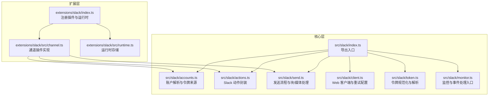
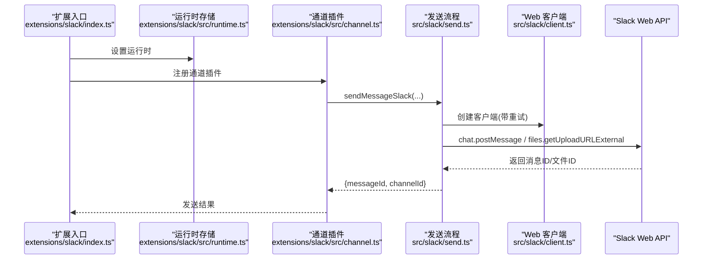
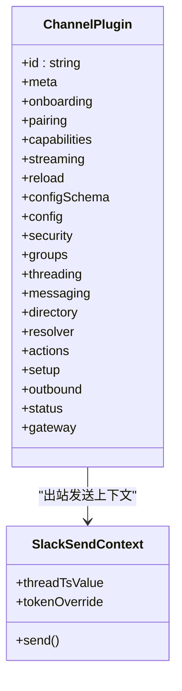
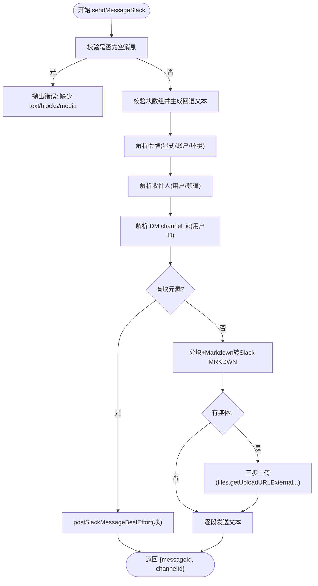
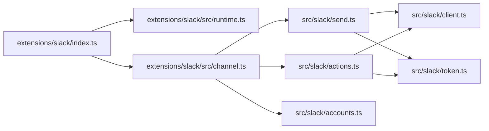

# Slack 渠道插件

<cite>
**本文引用的文件**
- [extensions/slack/index.ts](file://extensions/slack/index.ts)
- [extensions/slack/src/channel.ts](file://extensions/slack/src/channel.ts)
- [extensions/slack/src/runtime.ts](file://extensions/slack/src/runtime.ts)
- [src/slack/index.ts](file://src/slack/index.ts)
- [src/slack/accounts.ts](file://src/slack/accounts.ts)
- [src/slack/actions.ts](file://src/slack/actions.ts)
- [src/slack/send.ts](file://src/slack/send.ts)
- [src/slack/client.ts](file://src/slack/client.ts)
- [src/slack/token.ts](file://src/slack/token.ts)
- [src/slack/monitor.ts](file://src/slack/monitor.ts)
- [src/channels/plugins/onboarding/slack.ts](file://src/channels/plugins/onboarding/slack.ts)
- [skills/slack/SKILL.md](file://skills/slack/SKILL.md)
- [docs/zh-CN/channels/slack.md](file://docs/zh-CN/channels/slack.md)
</cite>

## 目录
1. [简介](#简介)
2. [项目结构](#项目结构)
3. [核心组件](#核心组件)
4. [架构总览](#架构总览)
5. [详细组件分析](#详细组件分析)
6. [依赖关系分析](#依赖关系分析)
7. [性能考量](#性能考量)
8. [故障排查指南](#故障排查指南)
9. [结论](#结论)
10. [附录](#附录)

## 简介
本文件为 Slack 渠道插件的开发与集成文档，面向需要在 OpenClaw 中接入 Slack 的开发者与运维人员。内容覆盖 Slack API 集成（OAuth、Bot Token、App Token、用户 Token、签名密钥）、事件订阅与监控、消息发送（含块元素、文件上传、富文本）、工作区与频道管理（权限策略、频道列表解析、DM 安全策略）、交互式组件与模态窗口、错误处理与事件去重、以及性能优化最佳实践。

## 项目结构
围绕 Slack 的核心代码分布在两处：
- 扩展层：负责将 Slack 插件注册到 OpenClaw 运行时，并桥接运行时能力与通道插件接口。
- 核心层：提供 Slack 账户解析、Web API 客户端、动作封装（反应、消息、文件下载）、发送流程（文本/块/媒体）、监控与事件处理等。

**图表来源**
- [extensions/slack/index.ts:1-18](file://extensions/slack/index.ts#L1-L18)
- [extensions/slack/src/channel.ts:1-475](file://extensions/slack/src/channel.ts#L1-L475)
- [extensions/slack/src/runtime.ts:1-7](file://extensions/slack/src/runtime.ts#L1-L7)
- [src/slack/index.ts:1-26](file://src/slack/index.ts#L1-L26)
- [src/slack/accounts.ts:1-123](file://src/slack/accounts.ts#L1-L123)
- [src/slack/actions.ts:1-447](file://src/slack/actions.ts#L1-L447)
- [src/slack/send.ts:1-361](file://src/slack/send.ts#L1-L361)
- [src/slack/client.ts:1-21](file://src/slack/client.ts#L1-L21)
- [src/slack/token.ts:1-30](file://src/slack/token.ts#L1-L30)
- [src/slack/monitor.ts:1-6](file://src/slack/monitor.ts#L1-L6)

**章节来源**
- [extensions/slack/index.ts:1-18](file://extensions/slack/index.ts#L1-L18)
- [extensions/slack/src/channel.ts:1-475](file://extensions/slack/src/channel.ts#L1-L475)
- [extensions/slack/src/runtime.ts:1-7](file://extensions/slack/src/runtime.ts#L1-L7)
- [src/slack/index.ts:1-26](file://src/slack/index.ts#L1-L26)

## 核心组件
- 插件注册与运行时
  - 扩展入口负责设置运行时并注册 Slack 通道插件。
  - 运行时存储用于在插件生命周期内共享 Slack 能力（发送、监控、目录查询等）。
- 通道插件实现
  - 提供聊天类型、反应、线程、媒体、原生命令等能力开关。
  - 支持 DM 安全策略、组策略与路由白名单警告收集。
  - 解析目标、解析用户/频道、消息动作处理、目录查询（本地与在线）。
  - 出站发送：文本分块、块元素回退文本、媒体上传（三步流）、线程回复。
- 账户与令牌
  - 统一解析账户配置，支持环境变量回退；区分 Bot/ App/User 令牌来源。
  - 规范化令牌输入，确保安全配置路径。
- 发送与动作
  - 封装反应、消息编辑/删除、读取历史、成员信息、表情包列表、钉选/取消钉选、文件下载。
  - 发送流程支持自定义身份（用户名、头像、表情），自动降级缺少权限时的请求。
- 监控与事件
  - 提供监控器启动、策略校验、线程解析、斜杠命令匹配等。

**章节来源**
- [extensions/slack/src/channel.ts:107-475](file://extensions/slack/src/channel.ts#L107-L475)
- [src/slack/accounts.ts:12-123](file://src/slack/accounts.ts#L12-L123)
- [src/slack/actions.ts:13-447](file://src/slack/actions.ts#L13-L447)
- [src/slack/send.ts:47-361](file://src/slack/send.ts#L47-L361)
- [src/slack/client.ts:11-21](file://src/slack/client.ts#L11-L21)
- [src/slack/token.ts:10-30](file://src/slack/token.ts#L10-L30)
- [src/slack/monitor.ts:1-6](file://src/slack/monitor.ts#L1-L6)

## 架构总览
下图展示了从插件注册到消息发送、事件监控的关键交互：

**图表来源**
- [extensions/slack/index.ts:11-14](file://extensions/slack/index.ts#L11-L14)
- [extensions/slack/src/runtime.ts:4-6](file://extensions/slack/src/runtime.ts#L4-L6)
- [extensions/slack/src/channel.ts:353-401](file://extensions/slack/src/channel.ts#L353-L401)
- [src/slack/send.ts:252-361](file://src/slack/send.ts#L252-L361)
- [src/slack/client.ts:18-21](file://src/slack/client.ts#L18-L21)

## 详细组件分析

### 插件注册与运行时
- 扩展入口通过 setSlackRuntime 将运行时注入，随后注册 Slack 通道插件。
- 运行时存储以“Slack runtime not initialized”为兜底错误提示，避免未初始化访问。

**章节来源**
- [extensions/slack/index.ts:1-18](file://extensions/slack/index.ts#L1-L18)
- [extensions/slack/src/runtime.ts:1-7](file://extensions/slack/src/runtime.ts#L1-L7)

### 通道插件实现（capabilities、security、directory、resolver、actions、outbound、status、gateway）
- 能力开关：direct/channel/thread、reactions、threads、media、nativeCommands。
- 安全策略：构建账户级 DM 策略，收集组策略与路由白名单风险提示。
- 目录与解析：支持 peer/group 列表（本地与在线），解析用户/频道允许列表。
- 消息动作：提取工具发送参数、统一处理消息动作。
- 出站发送：文本分块、块元素回退文本、媒体三步上传、线程回复、可选自定义身份。
- 状态与探测：构建账户快照、探测账户连通性。
- 网关启动：按账户启动监控器（Socket Mode 或 HTTP/Webhook）。

**图表来源**
- [extensions/slack/src/channel.ts:107-475](file://extensions/slack/src/channel.ts#L107-L475)

**章节来源**
- [extensions/slack/src/channel.ts:107-475](file://extensions/slack/src/channel.ts#L107-L475)

### 账户解析与令牌来源
- 合并基础配置与账户级配置，计算 enabled、name、各令牌及其来源（config/env/none）。
- 支持按账户解析默认回复模式（按聊天类型或 DM 配置）。
- 环境变量仅对默认账户生效，避免跨账户滥用。

**章节来源**
- [src/slack/accounts.ts:29-123](file://src/slack/accounts.ts#L29-L123)

### 发送流程（文本/块/媒体）
- 输入校验：空消息需至少包含 text/blocks/mediaUrl。
- 块元素：校验数组合法性，生成回退文本；不支持与媒体同时使用。
- 文本分块：根据配置决定分块模式与 Markdown 表格渲染方式，限制单段长度。
- 媒体上传：三步流（获取预签名URL → 上传 → 完成），支持线程与标题。
- 自定义身份：优先 icon_url/icon_emoji，若缺少 chat:write.customize 权限则自动降级。
- 通道解析：用户 ID 统一走 conversations.open 获取 DM channel_id。

**图表来源**
- [src/slack/send.ts:252-361](file://src/slack/send.ts#L252-L361)

**章节来源**
- [src/slack/send.ts:47-361](file://src/slack/send.ts#L47-L361)

### 动作封装（反应、消息、文件下载、成员信息、表情包、钉选）
- 反应：添加/移除/移除自己的反应，列出反应。
- 消息：发送、编辑、删除、读取历史（支持线程与时间范围）。
- 成员信息：users.info。
- 表情包：emoji.list。
- 钉选：pin/unpin/list。
- 文件下载：files.info 获取最新下载链接，校验作用域一致性，再下载到本地媒体存储。

**章节来源**
- [src/slack/actions.ts:80-447](file://src/slack/actions.ts#L80-L447)

### 监控与事件处理
- 监控器启动：按账户启动 Socket Mode(HTTP/Webhook) 监听，支持媒体大小、斜杠命令等配置。
- 事件策略：基于组策略与路由白名单进行允许性判断。
- 线程解析：根据事件解析 thread_ts。
- 斜杠命令匹配：提供命令匹配器。

**章节来源**
- [src/slack/monitor.ts:1-6](file://src/slack/monitor.ts#L1-L6)

### OAuth、Bot Token、App Token、用户 Token 与签名密钥
- OAuth 与应用安装：通过应用清单与 Socket Mode/App-Level Token、Bot Token、签名密钥完成集成。
- 令牌来源：支持配置与环境变量回退；HTTP 模式需要签名密钥。
- 用户令牌：可选，用于写操作（受 userTokenReadOnly 控制）。

**章节来源**
- [docs/zh-CN/channels/slack.md:162-252](file://docs/zh-CN/channels/slack.md#L162-L252)
- [src/channels/plugins/onboarding/slack.ts:101-132](file://src/channels/plugins/onboarding/slack.ts#L101-L132)
- [src/slack/accounts.ts:56-78](file://src/slack/accounts.ts#L56-L78)
- [src/slack/token.ts:10-30](file://src/slack/token.ts#L10-L30)

### 工作区与频道管理
- 权限检查：构建账户级 DM 策略，收集组策略与路由白名单风险提示。
- 频道列表解析：支持解析用户/频道允许列表，标记归档状态。
- 动态频道创建：通过 conversations API 创建或加入频道（具体调用由运行时能力提供）。

**章节来源**
- [extensions/slack/src/channel.ts:167-207](file://extensions/slack/src/channel.ts#L167-L207)
- [extensions/slack/src/channel.ts:234-269](file://extensions/slack/src/channel.ts#L234-L269)

### 交互式组件、模态窗口与用户群组
- 交互式组件：通过消息动作与块元素交互（按钮、选择菜单等）。
- 模态窗口：通过运行时能力触发与管理（具体实现由运行时提供）。
- 用户群组：通过目录查询与解析，支持 peer/group 列表。

**章节来源**
- [extensions/slack/src/channel.ts:270-281](file://extensions/slack/src/channel.ts#L270-L281)
- [extensions/slack/src/channel.ts:225-232](file://extensions/slack/src/channel.ts#L225-L232)

## 依赖关系分析
- 扩展层依赖核心层的发送、动作、账户、客户端与令牌模块。
- 通道插件通过运行时暴露的能力实现发送、监控、目录查询等功能。
- 客户端默认启用有限重试，避免瞬时网络波动导致失败。

**图表来源**
- [extensions/slack/index.ts:1-18](file://extensions/slack/index.ts#L1-L18)
- [extensions/slack/src/channel.ts:1-475](file://extensions/slack/src/channel.ts#L1-L475)
- [src/slack/send.ts:1-361](file://src/slack/send.ts#L1-L361)
- [src/slack/actions.ts:1-447](file://src/slack/actions.ts#L1-L447)
- [src/slack/client.ts:1-21](file://src/slack/client.ts#L1-L21)
- [src/slack/token.ts:1-30](file://src/slack/token.ts#L1-L30)

**章节来源**
- [src/slack/index.ts:1-26](file://src/slack/index.ts#L1-L26)

## 性能考量
- 分块策略：根据配置与 Markdown 表格模式进行分块，避免超过 Slack 单条文本限制。
- 媒体上传：采用三步上传流程，减少中间态失败概率；限制最大字节数。
- 重试机制：默认最多 2 次指数回退重试，避免瞬时抖动放大。
- 线程与去重：发送前识别静默回复标记，避免无效调用；事件处理中进行重复事件过滤（见测试用例）。

**章节来源**
- [src/slack/send.ts:298-320](file://src/slack/send.ts#L298-L320)
- [src/slack/client.ts:3-16](file://src/slack/client.ts#L3-L16)
- [src/slack/monitor/events/members.test.ts:121-138](file://src/slack/monitor/events/members.test.ts#L121-L138)

## 故障排查指南
- 令牌缺失
  - 症状：发送/动作报错提示缺少 Bot Token。
  - 处理：确认 channels.slack.accounts.<id>.botToken 或环境变量 SLACK_BOT_TOKEN 是否正确配置。
- 权限不足
  - 症状：自定义身份失败（chat:write.customize）。
  - 处理：自动降级为无自定义身份发送；或补充所需权限范围。
- HTTP 模式缺少签名密钥
  - 症状：启动时报错缺少签名密钥。
  - 处理：配置 channels.slack.accounts.<id>.signingSecret 或环境变量。
- 文件下载作用域不一致
  - 症状：下载被拒绝。
  - 处理：检查文件分享范围与当前频道/线程是否匹配。
- 事件去重
  - 症状：重复事件导致重复处理。
  - 处理：参考事件测试用例中的去重逻辑，确保事件跟踪与匹配。

**章节来源**
- [src/slack/send.ts:138-160](file://src/slack/send.ts#L138-L160)
- [src/slack/send.ts:63-87](file://src/slack/send.ts#L63-L87)
- [src/slack/monitor/provider.ts:130-152](file://src/slack/monitor/provider.ts#L130-L152)
- [src/slack/actions.ts:413-447](file://src/slack/actions.ts#L413-L447)
- [src/slack/monitor/events/members.test.ts:121-138](file://src/slack/monitor/events/members.test.ts#L121-L138)

## 结论
本插件通过清晰的扩展层与核心层分离，提供了完善的 Slack 集成能力：从令牌解析、发送与动作封装，到事件监控与目录查询，均具备明确的错误处理与性能优化策略。建议在生产环境中：
- 明确权限范围，优先使用 Bot Token；必要时启用用户 Token 并控制只读。
- 使用 Socket Mode 并开启事件订阅；HTTP 模式务必配置签名密钥。
- 对媒体与长文本进行分块与三步上传，结合重试与降级策略提升稳定性。
- 建立路由白名单与组策略，配合 DM 安全策略降低风险。

## 附录
- 技能使用说明：可通过 slack 技能执行反应、消息、钉选、成员信息、表情包等操作。
- 应用清单与权限范围：参考文档中的 Slack 应用清单与事件订阅配置。

**章节来源**
- [skills/slack/SKILL.md:1-145](file://skills/slack/SKILL.md#L1-L145)
- [docs/zh-CN/channels/slack.md:162-252](file://docs/zh-CN/channels/slack.md#L162-L252)