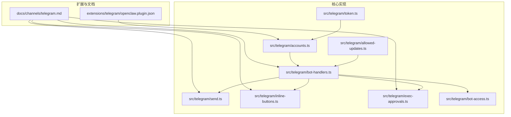
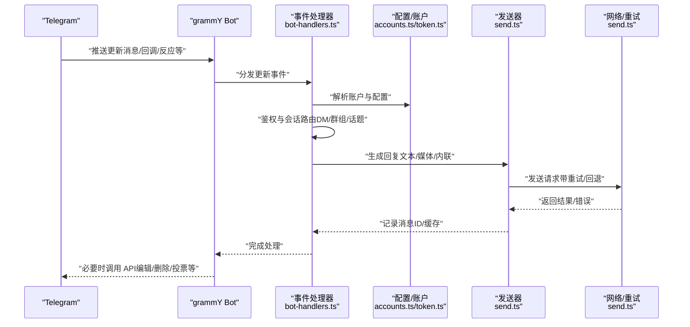
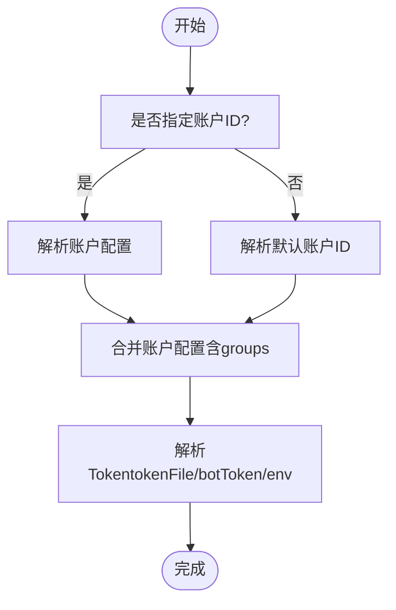
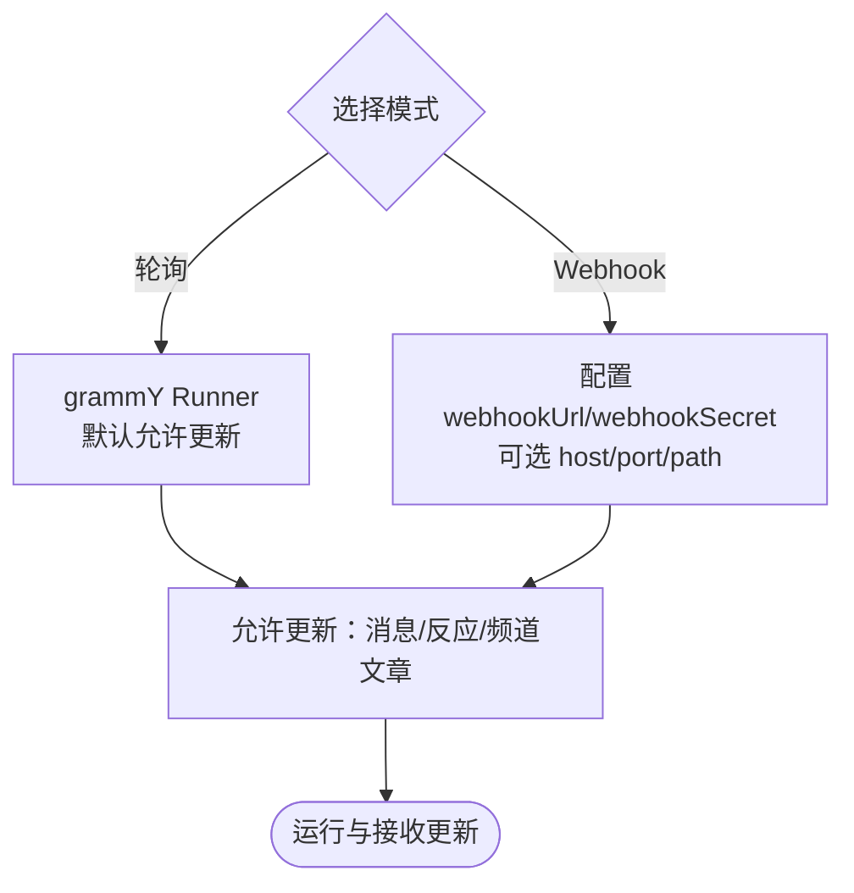
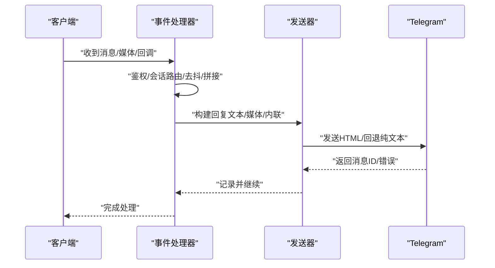
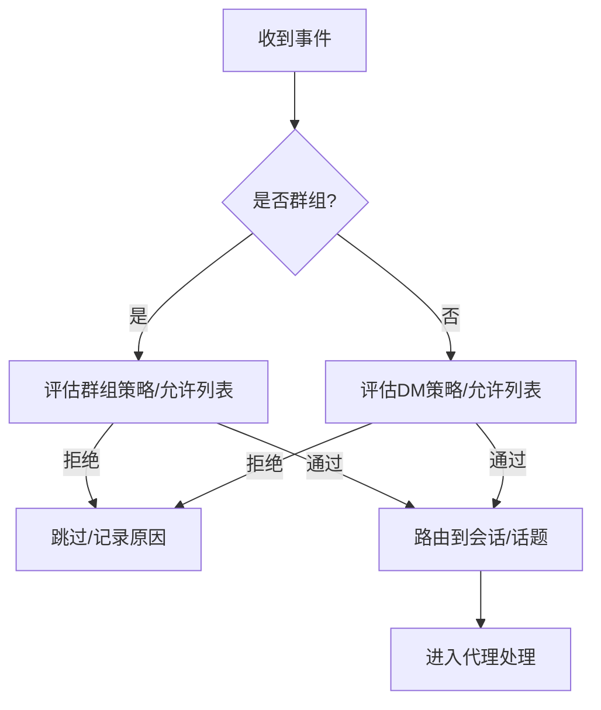
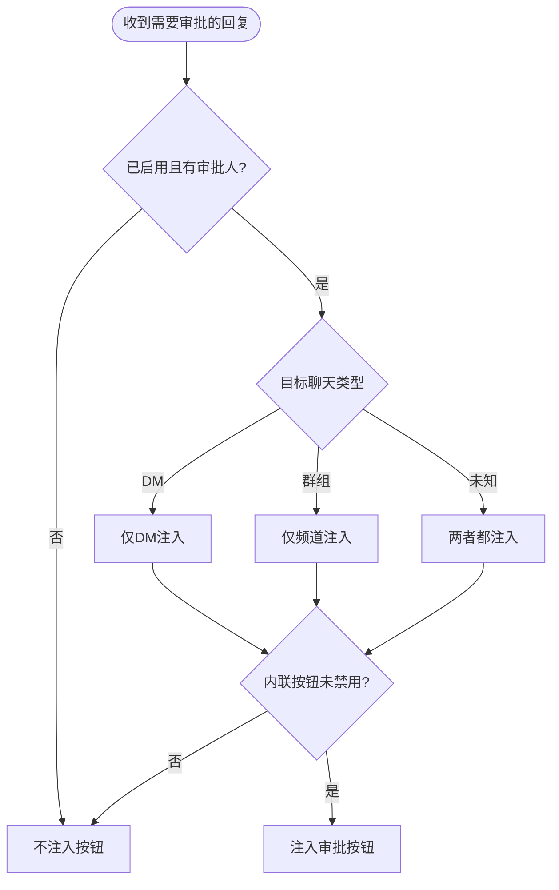
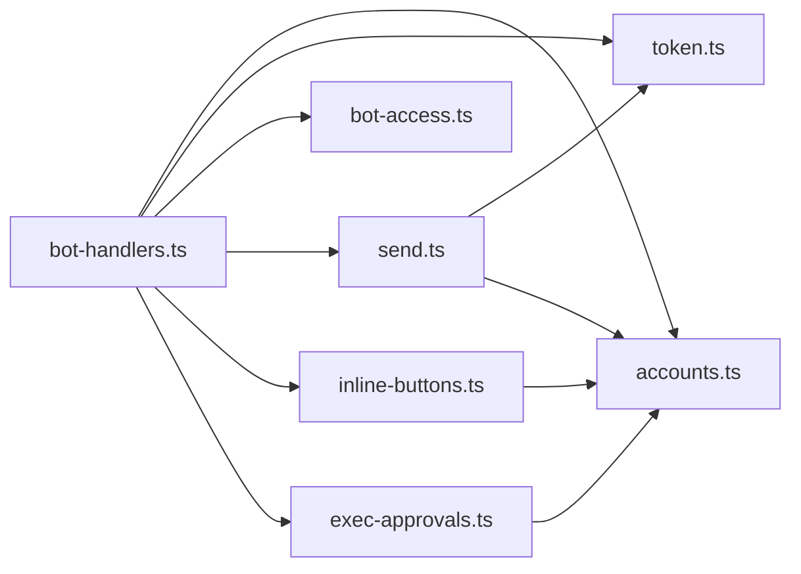

# Telegram 渠道插件

<cite>
**本文档引用的文件**
- [extensions/telegram/openclaw.plugin.json](file://extensions/telegram/openclaw.plugin.json)
- [docs/channels/telegram.md](file://docs/channels/telegram.md)
- [src/telegram/bot-handlers.ts](file://src/telegram/bot-handlers.ts)
- [src/telegram/bot-access.ts](file://src/telegram/bot-access.ts)
- [src/telegram/accounts.ts](file://src/telegram/accounts.ts)
- [src/telegram/allowed-updates.ts](file://src/telegram/allowed-updates.ts)
- [src/telegram/token.ts](file://src/telegram/token.ts)
- [src/telegram/send.ts](file://src/telegram/send.ts)
- [src/telegram/inline-buttons.ts](file://src/telegram/inline-buttons.ts)
- [src/telegram/exec-approvals.ts](file://src/telegram/exec-approvals.ts)
</cite>

## 目录
1. [简介](#简介)
2. [项目结构](#项目结构)
3. [核心组件](#核心组件)
4. [架构总览](#架构总览)
5. [详细组件分析](#详细组件分析)
6. [依赖关系分析](#依赖关系分析)
7. [性能考量](#性能考量)
8. [故障排查指南](#故障排查指南)
9. [结论](#结论)
10. [附录](#附录)

## 简介
本文件面向开发者与运维人员，系统化阐述 OpenClaw 的 Telegram 渠道插件设计与实现，覆盖以下主题：
- Bot API 集成：Token 认证、Webhook 配置与长期轮询机制
- 消息处理：文本、媒体、内联键盘与回调查询
- 用户与群组管理：访问控制、权限检查、管理员与话题路由
- Telegram 特性：内联查询、支付集成、游戏消息等
- 错误处理、重连策略与 API 限制应对

该插件基于 grammY 运行器，默认采用长期轮询；同时支持可选的 Webhook 模式。

## 项目结构
Telegram 插件在仓库中的位置与关键文件如下：
- 扩展清单：定义渠道标识与配置模式
- 文档：官方使用说明、配置项与特性参考
- 核心实现：事件接入、认证、消息处理、发送、内联按钮与执行审批等

**图表来源**
- [extensions/telegram/openclaw.plugin.json:1-10](file://extensions/telegram/openclaw.plugin.json#L1-L10)
- [docs/channels/telegram.md:1-200](file://docs/channels/telegram.md#L1-L200)
- [src/telegram/token.ts:1-99](file://src/telegram/token.ts#L1-L99)
- [src/telegram/accounts.ts:1-209](file://src/telegram/accounts.ts#L1-L209)
- [src/telegram/allowed-updates.ts:1-15](file://src/telegram/allowed-updates.ts#L1-L15)
- [src/telegram/bot-handlers.ts:1-200](file://src/telegram/bot-handlers.ts#L1-L200)
- [src/telegram/send.ts:1-200](file://src/telegram/send.ts#L1-L200)
- [src/telegram/inline-buttons.ts:1-68](file://src/telegram/inline-buttons.ts#L1-L68)
- [src/telegram/exec-approvals.ts:1-107](file://src/telegram/exec-approvals.ts#L1-L107)
- [src/telegram/bot-access.ts:1-95](file://src/telegram/bot-access.ts#L1-L95)

**章节来源**
- [extensions/telegram/openclaw.plugin.json:1-10](file://extensions/telegram/openclaw.plugin.json#L1-L10)
- [docs/channels/telegram.md:1-200](file://docs/channels/telegram.md#L1-L200)

## 核心组件
- Token 解析与账户解析：从配置、环境变量或密钥文件解析 Bot Token，并合并账户级配置
- 允许更新类型：确保消息反应与频道文章等事件被纳入轮询/监听
- 事件处理器：统一处理消息、回调、反应、投票等 Telegram 更新
- 发送器：封装发送文本、媒体、内联键盘、投票、打字状态等能力，并内置重试与回退逻辑
- 内联按钮与执行审批：按作用域与目标聊天类型启用/禁用内联按钮与审批提示

**章节来源**
- [src/telegram/token.ts:1-99](file://src/telegram/token.ts#L1-L99)
- [src/telegram/accounts.ts:1-209](file://src/telegram/accounts.ts#L1-L209)
- [src/telegram/allowed-updates.ts:1-15](file://src/telegram/allowed-updates.ts#L1-L15)
- [src/telegram/bot-handlers.ts:1-200](file://src/telegram/bot-handlers.ts#L1-L200)
- [src/telegram/send.ts:1-200](file://src/telegram/send.ts#L1-L200)
- [src/telegram/inline-buttons.ts:1-68](file://src/telegram/inline-buttons.ts#L1-L68)
- [src/telegram/exec-approvals.ts:1-107](file://src/telegram/exec-approvals.ts#L1-L107)

## 架构总览
下图展示了从 Telegram 更新到业务处理与发送响应的关键路径，以及与配置、账户与网络层的交互。

**图表来源**
- [src/telegram/bot-handlers.ts:120-200](file://src/telegram/bot-handlers.ts#L120-L200)
- [src/telegram/accounts.ts:166-209](file://src/telegram/accounts.ts#L166-L209)
- [src/telegram/token.ts:20-99](file://src/telegram/token.ts#L20-L99)
- [src/telegram/send.ts:588-800](file://src/telegram/send.ts#L588-L800)

## 详细组件分析

### Token 认证与账户解析
- 账户解析顺序：优先使用显式传入的账户 ID，否则回退到默认账户；若无配置则使用环境变量
- Token 来源优先级：账户级 tokenFile > 账户级 botToken > 通道级 tokenFile/ botToken > 默认账户环境变量
- 合并配置：多账户场景下避免错误继承通道级 groups，单账户保持向后兼容

**图表来源**
- [src/telegram/accounts.ts:100-209](file://src/telegram/accounts.ts#L100-L209)
- [src/telegram/token.ts:20-99](file://src/telegram/token.ts#L20-L99)

**章节来源**
- [src/telegram/accounts.ts:1-209](file://src/telegram/accounts.ts#L1-L209)
- [src/telegram/token.ts:1-99](file://src/telegram/token.ts#L1-L99)

### Webhook 配置与长期轮询
- 默认模式：长期轮询（grammY Runner），自动包含允许更新类型
- Webhook 模式：通过通道配置开启，需设置公网 URL、密钥与可选监听地址/端口
- 允许更新：自动包含消息反应与频道文章，便于反应通知与订阅场景

**图表来源**
- [docs/channels/telegram.md:731-747](file://docs/channels/telegram.md#L731-L747)
- [src/telegram/allowed-updates.ts:1-15](file://src/telegram/allowed-updates.ts#L1-L15)

**章节来源**
- [docs/channels/telegram.md:731-747](file://docs/channels/telegram.md#L731-L747)
- [src/telegram/allowed-updates.ts:1-15](file://src/telegram/allowed-updates.ts#L1-L15)

### 消息处理：文本、媒体、内联键盘与回调
- 文本处理：支持 Markdown/HTML 渲染与分块发送；HTML 解析失败自动回退纯文本
- 媒体处理：支持图片、视频、音频、语音、视频消息、贴纸等；视频消息不支持标题时拆分为后续文本
- 内联键盘：按作用域（关闭/Dm/群/全部/白名单）与目标聊天类型启用
- 回调查询：授权后将 callback_data 作为文本传递给代理

**图表来源**
- [src/telegram/bot-handlers.ts:121-200](file://src/telegram/bot-handlers.ts#L121-L200)
- [src/telegram/send.ts:588-800](file://src/telegram/send.ts#L588-L800)
- [src/telegram/inline-buttons.ts:43-68](file://src/telegram/inline-buttons.ts#L43-L68)

**章节来源**
- [src/telegram/bot-handlers.ts:1-800](file://src/telegram/bot-handlers.ts#L1-L800)
- [src/telegram/send.ts:1-800](file://src/telegram/send.ts#L1-L800)
- [src/telegram/inline-buttons.ts:1-68](file://src/telegram/inline-buttons.ts#L1-L68)

### 用户与群组管理：访问控制与权限
- DM 策略：配对（默认）、允许列表、开放、禁用；允许列表支持账户级与按 DM/话题覆盖
- 群组策略：开放/允许列表/禁用；支持 per-group/per-topic 允许列表与提及要求
- 授权规则：根据模式（反应/内联作用域/内联白名单）进行直接与群组授权校验

**图表来源**
- [src/telegram/bot-handlers.ts:607-743](file://src/telegram/bot-handlers.ts#L607-L743)
- [src/telegram/bot-access.ts:1-95](file://src/telegram/bot-access.ts#L1-L95)

**章节来源**
- [src/telegram/bot-handlers.ts:509-743](file://src/telegram/bot-handlers.ts#L509-L743)
- [src/telegram/bot-access.ts:1-95](file://src/telegram/bot-access.ts#L1-L95)

### Telegram 特性：内联查询、支付与游戏消息
- 内联查询：通过命令菜单注册与内联按钮作用域控制
- 支付集成：通过消息动作与工具动作暴露支付相关能力
- 游戏消息：通过消息动作与工具动作支持游戏类消息

说明：具体命令菜单注册与动作接口请参见官方文档与配置参考。

**章节来源**
- [docs/channels/telegram.md:302-352](file://docs/channels/telegram.md#L302-L352)
- [docs/channels/telegram.md:420-443](file://docs/channels/telegram.md#L420-L443)

### 执行审批与内联按钮
- 审批配置：启用开关、审批人列表、目标聊天类型（DM/频道/两者）
- 注入策略：根据目标聊天类型与内联按钮作用域决定是否注入审批按钮
- 抑制本地提示：当存在执行审批元数据时抑制本地提示

**图表来源**
- [src/telegram/exec-approvals.ts:49-96](file://src/telegram/exec-approvals.ts#L49-L96)

**章节来源**
- [src/telegram/exec-approvals.ts:1-107](file://src/telegram/exec-approvals.ts#L1-L107)

## 依赖关系分析
- 组件耦合
  - 事件处理器依赖账户解析与 Token 解析以确定运行上下文
  - 发送器依赖网络层与重试策略，同时受配置影响（超时、代理、链接预览等）
  - 内联按钮与执行审批受配置 capabilities 与账户配置影响
- 外部依赖
  - grammY 作为底层运行框架
  - Telegram Bot API 作为外部服务

**图表来源**
- [src/telegram/bot-handlers.ts:1-120](file://src/telegram/bot-handlers.ts#L1-L120)
- [src/telegram/accounts.ts:1-100](file://src/telegram/accounts.ts#L1-L100)
- [src/telegram/token.ts:1-60](file://src/telegram/token.ts#L1-L60)
- [src/telegram/send.ts:1-120](file://src/telegram/send.ts#L1-L120)
- [src/telegram/inline-buttons.ts:1-40](file://src/telegram/inline-buttons.ts#L1-L40)
- [src/telegram/exec-approvals.ts:1-40](file://src/telegram/exec-approvals.ts#L1-L40)

**章节来源**
- [src/telegram/bot-handlers.ts:1-120](file://src/telegram/bot-handlers.ts#L1-L120)
- [src/telegram/send.ts:1-120](file://src/telegram/send.ts#L1-L120)

## 性能考量
- 长期轮询并发：基于 grammY Runner 的每会话/每话题序列化，整体并发由代理默认并发控制
- 文本分块：按 4000 字符切分，HTML 与纯文本分别规划，必要时回退纯文本
- 媒体处理：媒体组与文本片段缓冲，减少多次往返；媒体尺寸限制与可恢复错误处理
- 网络优化：客户端选项缓存、代理与超时配置、线程参数剥离回退

**章节来源**
- [docs/channels/telegram.md:255-256](file://docs/channels/telegram.md#L255-L256)
- [src/telegram/send.ts:116-150](file://src/telegram/send.ts#L116-L150)
- [src/telegram/bot-handlers.ts:138-152](file://src/telegram/bot-handlers.ts#L138-L152)

## 故障排查指南
- 常见错误与回退
  - HTML 解析失败：自动回退纯文本
  - 线程不存在：移除 thread 参数后重试
  - 聊天不存在：提供更明确的错误提示（可能为未启动 DM、被移出群组、群迁移或 Token 错误）
  - 媒体尺寸超限：跳过不可恢复媒体并继续处理其他媒体
- 重试策略
  - 可安全重试的网络错误与服务器错误自动重试
  - 严格非幂等请求的重试条件由策略函数控制
- 配置问题
  - setMyCommands 失败：通常为出站 DNS/HTTPS 被阻断
  - webhook 地址与密钥：确认公网可达与密钥一致

**章节来源**
- [src/telegram/send.ts:152-157](file://src/telegram/send.ts#L152-L157)
- [src/telegram/send.ts:504-543](file://src/telegram/send.ts#L504-L543)
- [src/telegram/bot-handlers.ts:86-93](file://src/telegram/bot-handlers.ts#L86-L93)
- [docs/channels/telegram.md:338-341](file://docs/channels/telegram.md#L338-L341)

## 结论
OpenClaw 的 Telegram 渠道插件以清晰的模块划分与稳健的错误处理实现了生产级的 Bot API 集成。通过账户与配置的灵活解析、严格的访问控制、完善的发送与回退机制，以及对 Webhook/轮询双模式的支持，能够满足从个人到企业级的多样化需求。建议在生产环境中结合文档中的配置项与限制说明，合理设置超时、代理与重试策略，并通过内联按钮与执行审批增强用户体验与安全性。

## 附录
- 快速开始与配置参考：参见官方文档“Telegram”章节
- 命令菜单与自定义命令：参见官方文档“原生命令与自定义命令”
- 限制与 CLI 目标：参见官方文档“限制、重试与 CLI 目标”

**章节来源**
- [docs/channels/telegram.md:24-70](file://docs/channels/telegram.md#L24-L70)
- [docs/channels/telegram.md:302-352](file://docs/channels/telegram.md#L302-L352)
- [docs/channels/telegram.md:749-789](file://docs/channels/telegram.md#L749-L789)