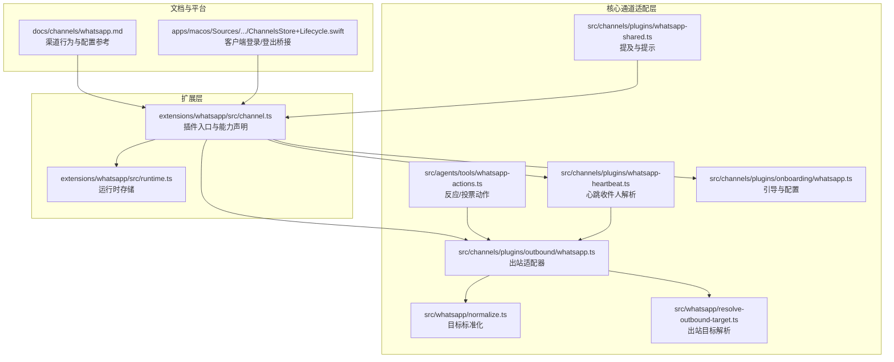
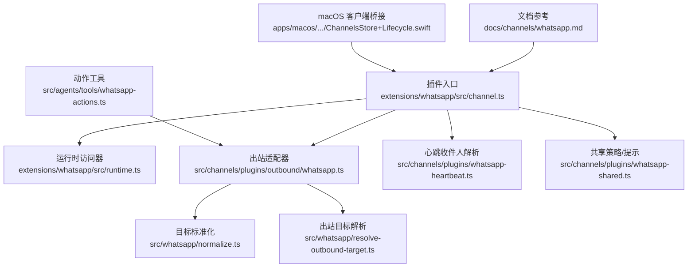
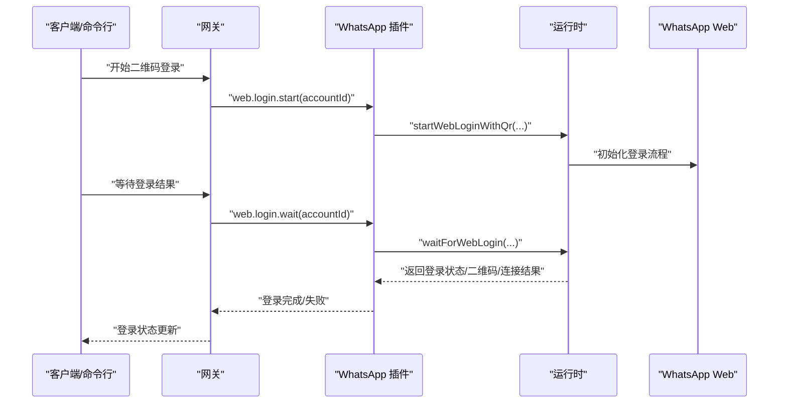
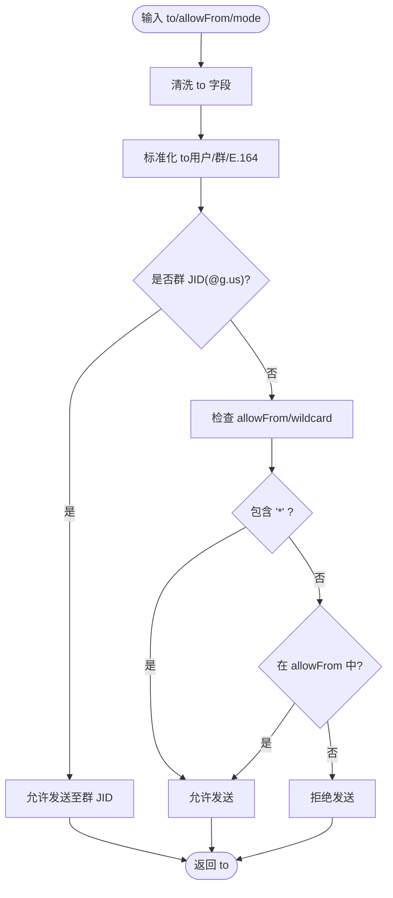
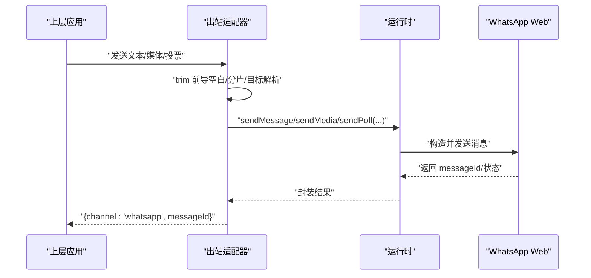
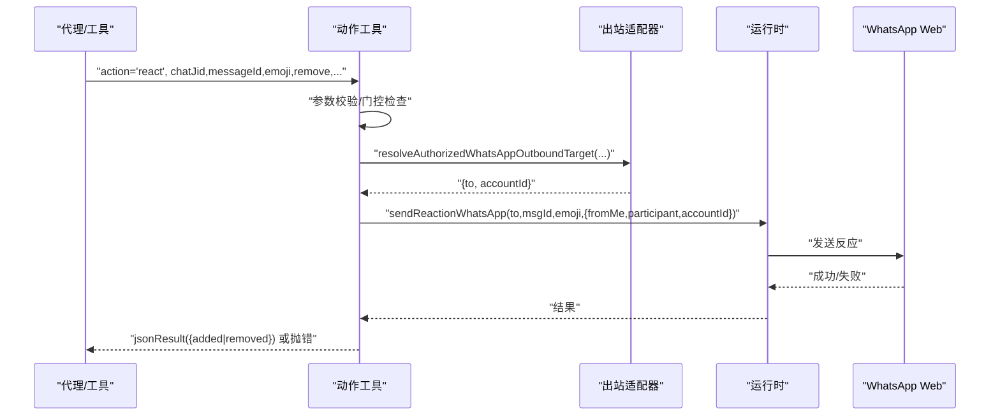
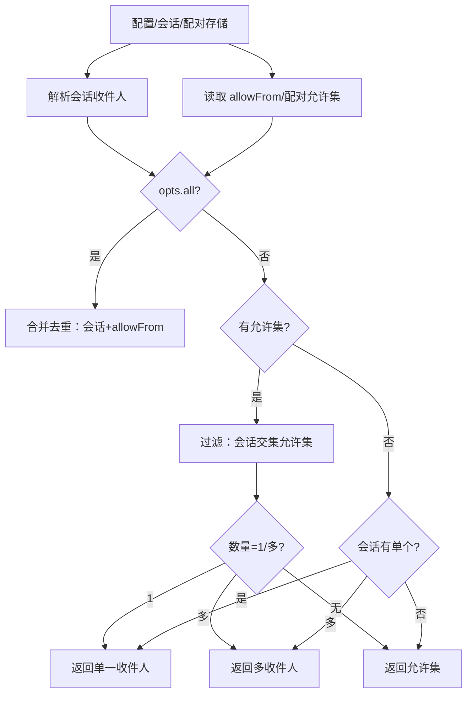
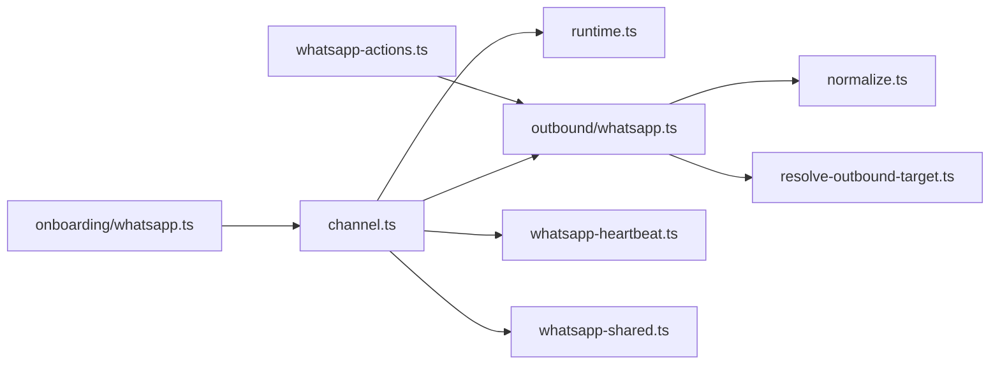

# WhatsApp 渠道插件

<cite>
**本文引用的文件**
- [docs/channels/whatsapp.md](file://docs/channels/whatsapp.md)
- [extensions/whatsapp/src/channel.ts](file://extensions/whatsapp/src/channel.ts)
- [extensions/whatsapp/src/runtime.ts](file://extensions/whatsapp/src/runtime.ts)
- [src/whatsapp/normalize.ts](file://src/whatsapp/normalize.ts)
- [src/whatsapp/resolve-outbound-target.ts](file://src/whatsapp/resolve-outbound-target.ts)
- [src/channels/plugins/whatsapp-shared.ts](file://src/channels/plugins/whatsapp-shared.ts)
- [src/channels/plugins/outbound/whatsapp.ts](file://src/channels/plugins/outbound/whatsapp.ts)
- [src/channels/plugins/onboarding/whatsapp.ts](file://src/channels/plugins/onboarding/whatsapp.ts)
- [src/channels/plugins/whatsapp-heartbeat.ts](file://src/channels/plugins/whatsapp-heartbeat.ts)
- [src/agents/tools/whatsapp-actions.ts](file://src/agents/tools/whatsapp-actions.ts)
- [apps/macos/Sources/OpenClaw/ChannelsStore+Lifecycle.swift](file://apps/macos/Sources/OpenClaw/ChannelsStore+Lifecycle.swift)
</cite>

## 目录
1. [简介](#简介)
2. [项目结构](#项目结构)
3. [核心组件](#核心组件)
4. [架构总览](#架构总览)
5. [详细组件分析](#详细组件分析)
6. [依赖关系分析](#依赖关系分析)
7. [性能考量](#性能考量)
8. [故障排查指南](#故障排查指南)
9. [结论](#结论)
10. [附录](#附录)

## 简介
本文件为 WhatsApp 渠道插件的开发与集成文档，聚焦于基于 Baileys 的 WhatsApp Web 通道，覆盖认证流程（二维码登录）、会话管理、消息路由、消息处理（文本、多媒体、位置、联系人名片）、客户端连接管理（持久化凭据、自动重连）、工具与动作（反应、投票）、错误处理与合规建议等。文档同时提供面向开发者的代码级视图与面向运维的配置参考。

## 项目结构
WhatsApp 插件在仓库中由“扩展层”和“核心通道适配层”共同组成：
- 扩展层：位于 extensions/whatsapp，定义插件入口、能力声明、配置模式、认证与心跳桥接、运行时访问器等。
- 核心通道适配层：位于 src/channels/plugins 与 src/whatsapp，负责消息归一化、出站目标解析、心跳收件人解析、代理发送等。
- 文档与平台集成：docs/channels/whatsapp.md 提供渠道行为、策略与配置参考；macOS 客户端通过 GatewayConnection 与网关交互，支持等待二维码登录结果与登出。

**图表来源**
- [extensions/whatsapp/src/channel.ts:1-474](file://extensions/whatsapp/src/channel.ts#L1-L474)
- [extensions/whatsapp/src/runtime.ts:1-7](file://extensions/whatsapp/src/runtime.ts#L1-L7)
- [src/channels/plugins/outbound/whatsapp.ts:1-74](file://src/channels/plugins/outbound/whatsapp.ts#L1-L74)
- [src/whatsapp/normalize.ts:1-81](file://src/whatsapp/normalize.ts#L1-L81)
- [src/whatsapp/resolve-outbound-target.ts:1-53](file://src/whatsapp/resolve-outbound-target.ts#L1-L53)
- [src/channels/plugins/whatsapp-heartbeat.ts:1-100](file://src/channels/plugins/whatsapp-heartbeat.ts#L1-L100)
- [src/channels/plugins/whatsapp-shared.ts:1-18](file://src/channels/plugins/whatsapp-shared.ts#L1-L18)
- [src/agents/tools/whatsapp-actions.ts:1-51](file://src/agents/tools/whatsapp-actions.ts#L1-L51)
- [src/channels/plugins/onboarding/whatsapp.ts:1-355](file://src/channels/plugins/onboarding/whatsapp.ts#L1-L355)
- [docs/channels/whatsapp.md:1-446](file://docs/channels/whatsapp.md#L1-L446)
- [apps/macos/Sources/OpenClaw/ChannelsStore+Lifecycle.swift:76-119](file://apps/macos/Sources/OpenClaw/ChannelsStore+Lifecycle.swift#L76-L119)

**章节来源**
- [extensions/whatsapp/src/channel.ts:1-474](file://extensions/whatsapp/src/channel.ts#L1-L474)
- [docs/channels/whatsapp.md:1-446](file://docs/channels/whatsapp.md#L1-L446)

## 核心组件
- 插件入口与能力声明：定义渠道元数据、配置模式、安全策略、目录查询、动作支持、出站适配、认证与心跳、状态汇总等。
- 运行时访问器：通过扩展层 runtime.ts 暴露 get/set 运行时，供插件方法调用底层 WhatsApp Web 能力。
- 归一化与目标解析：对用户 JID、群 JID、E.164 号码进行标准化与校验，并在出站时进行允许列表与模式检查。
- 出站适配器：统一文本/媒体/投票发送，支持分片、GIF 回放、本地路径与 HTTP(S) 媒体源。
- 心跳与收件人：从会话存储与允许列表中推导心跳目标，支持单个或全部收件人场景。
- 引导与配置：向导式配置 DM 策略、允许列表、个人号自聊保护、QR 登录与凭据落盘。
- 工具与动作：支持反应动作与投票发送，动作参数经门控与授权解析后执行。
- 客户端桥接：macOS 客户端通过网关 RPC 等待登录结果与登出清理。

**章节来源**
- [extensions/whatsapp/src/channel.ts:43-473](file://extensions/whatsapp/src/channel.ts#L43-L473)
- [extensions/whatsapp/src/runtime.ts:4-7](file://extensions/whatsapp/src/runtime.ts#L4-L7)
- [src/whatsapp/normalize.ts:55-81](file://src/whatsapp/normalize.ts#L55-L81)
- [src/whatsapp/resolve-outbound-target.ts:8-53](file://src/whatsapp/resolve-outbound-target.ts#L8-L53)
- [src/channels/plugins/outbound/whatsapp.ts:12-74](file://src/channels/plugins/outbound/whatsapp.ts#L12-L74)
- [src/channels/plugins/whatsapp-heartbeat.ts:47-99](file://src/channels/plugins/whatsapp-heartbeat.ts#L47-L99)
- [src/channels/plugins/onboarding/whatsapp.ts:254-355](file://src/channels/plugins/onboarding/whatsapp.ts#L254-L355)
- [src/agents/tools/whatsapp-actions.ts:7-51](file://src/agents/tools/whatsapp-actions.ts#L7-L51)
- [apps/macos/Sources/OpenClaw/ChannelsStore+Lifecycle.swift:76-119](file://apps/macos/Sources/OpenClaw/ChannelsStore+Lifecycle.swift#L76-L119)

## 架构总览
下图展示从插件入口到运行时、再到网关与客户端的整体交互：

**图表来源**
- [extensions/whatsapp/src/channel.ts:43-473](file://extensions/whatsapp/src/channel.ts#L43-L473)
- [extensions/whatsapp/src/runtime.ts:4-7](file://extensions/whatsapp/src/runtime.ts#L4-L7)
- [src/channels/plugins/outbound/whatsapp.ts:12-74](file://src/channels/plugins/outbound/whatsapp.ts#L12-L74)
- [src/whatsapp/normalize.ts:55-81](file://src/whatsapp/normalize.ts#L55-L81)
- [src/whatsapp/resolve-outbound-target.ts:8-53](file://src/whatsapp/resolve-outbound-target.ts#L8-L53)
- [src/channels/plugins/whatsapp-heartbeat.ts:47-99](file://src/channels/plugins/whatsapp-heartbeat.ts#L47-L99)
- [src/channels/plugins/whatsapp-shared.ts:6-17](file://src/channels/plugins/whatsapp-shared.ts#L6-L17)
- [src/agents/tools/whatsapp-actions.ts:7-51](file://src/agents/tools/whatsapp-actions.ts#L7-L51)
- [docs/channels/whatsapp.md:1-446](file://docs/channels/whatsapp.md#L1-L446)
- [apps/macos/Sources/OpenClaw/ChannelsStore+Lifecycle.swift:76-119](file://apps/macos/Sources/OpenClaw/ChannelsStore+Lifecycle.swift#L76-L119)

## 详细组件分析

### 认证与会话管理（二维码登录、持久化、自动重连）
- 二维码登录：插件暴露 web.login.start/web.login.wait 网关方法，客户端可启动登录并等待结果；macOS 客户端通过 GatewayConnection 请求等待登录完成。
- 凭据持久化：默认凭据路径为 ~/.openclaw/credentials/whatsapp/<accountId>/creds.json，支持备份文件与历史兼容迁移。
- 自动重连：网关持有 WhatsApp Socket 并维护重连循环；心跳接口检查已链接、监听器活跃状态，用于健康上报与诊断。

**图表来源**
- [extensions/whatsapp/src/channel.ts:455-463](file://extensions/whatsapp/src/channel.ts#L455-L463)
- [apps/macos/Sources/OpenClaw/ChannelsStore+Lifecycle.swift:76-96](file://apps/macos/Sources/OpenClaw/ChannelsStore+Lifecycle.swift#L76-L96)

**章节来源**
- [extensions/whatsapp/src/channel.ts:332-341](file://extensions/whatsapp/src/channel.ts#L332-L341)
- [extensions/whatsapp/src/channel.ts:455-463](file://extensions/whatsapp/src/channel.ts#L455-L463)
- [extensions/whatsapp/src/channel.ts:365-406](file://extensions/whatsapp/src/channel.ts#L365-L406)
- [docs/channels/whatsapp.md:352-364](file://docs/channels/whatsapp.md#L352-L364)
- [apps/macos/Sources/OpenClaw/ChannelsStore+Lifecycle.swift:76-119](file://apps/macos/Sources/OpenClaw/ChannelsStore+Lifecycle.swift#L76-L119)

### 消息路由与目标解析
- 目标标准化：支持用户 JID（含 @s.whatsapp.net 与 @lid）、群 JID（@g.us）与纯 E.164 号码，自动去除前缀并规范化。
- 出站目标解析：根据 allowFrom 与模式（显式/通配），对直接消息进行允许列表校验；群消息仅做格式校验与保留。
- 允许列表与通配：支持 "*" 通配符；当未配置 allowFrom 时，若存在配对记录则合并入允许集。

**图表来源**
- [src/whatsapp/normalize.ts:55-81](file://src/whatsapp/normalize.ts#L55-L81)
- [src/whatsapp/resolve-outbound-target.ts:8-53](file://src/whatsapp/resolve-outbound-target.ts#L8-L53)

**章节来源**
- [src/whatsapp/normalize.ts:3-81](file://src/whatsapp/normalize.ts#L3-L81)
- [src/whatsapp/resolve-outbound-target.ts:8-53](file://src/whatsapp/resolve-outbound-target.ts#L8-L53)
- [extensions/whatsapp/src/channel.ts:220-226](file://extensions/whatsapp/src/channel.ts#L220-L226)

### 消息处理实现（文本、多媒体、位置、联系人名片）
- 文本分片：默认上限 4000，支持按长度或换行分片模式，确保长文本安全拆分。
- 多媒体发送：支持图片、视频、音频（PTT）、文档；自动将 audio/ogg 重写为 audio/ogg; codecs=opus；支持 GIF 回放；多图回复时首项应用标题。
- 媒体尺寸与回退：默认最大 50MB，超限自动优化；发送失败时优先首项回退为文本警告。
- 位置与联系人：位置与联系人载荷在进入路由前被规范化为文本上下文。

**图表来源**
- [src/channels/plugins/outbound/whatsapp.ts:12-74](file://src/channels/plugins/outbound/whatsapp.ts#L12-L74)
- [extensions/whatsapp/src/channel.ts:286-331](file://extensions/whatsapp/src/channel.ts#L286-L331)

**章节来源**
- [src/channels/plugins/outbound/whatsapp.ts:12-74](file://src/channels/plugins/outbound/whatsapp.ts#L12-L74)
- [extensions/whatsapp/src/channel.ts:286-331](file://extensions/whatsapp/src/channel.ts#L286-L331)
- [docs/channels/whatsapp.md:292-316](file://docs/channels/whatsapp.md#L292-L316)

### 工具与动作（反应、投票）
- 反应动作：通过 agent tools 与通道动作接口，支持添加/移除反应；移除时需提供 emoji；动作参数经门控与授权解析后执行。
- 投票动作：支持最多 12 个选项的投票发送。

**图表来源**
- [src/agents/tools/whatsapp-actions.ts:7-51](file://src/agents/tools/whatsapp-actions.ts#L7-L51)
- [extensions/whatsapp/src/channel.ts:245-285](file://extensions/whatsapp/src/channel.ts#L245-L285)

**章节来源**
- [src/agents/tools/whatsapp-actions.ts:7-51](file://src/agents/tools/whatsapp-actions.ts#L7-L51)
- [extensions/whatsapp/src/channel.ts:245-285](file://extensions/whatsapp/src/channel.ts#L245-L285)

### 心跳与状态监控
- 心跳收件人：优先使用会话存储中的最近直聊收件人，其次考虑允许列表与配对存储；支持单一/多收件人与全量模式。
- 状态摘要：包含已链接、认证年龄、自账号信息、运行/连接状态、断线次数、最后事件时间等。

**图表来源**
- [src/channels/plugins/whatsapp-heartbeat.ts:47-99](file://src/channels/plugins/whatsapp-heartbeat.ts#L47-L99)

**章节来源**
- [src/channels/plugins/whatsapp-heartbeat.ts:47-99](file://src/channels/plugins/whatsapp-heartbeat.ts#L47-L99)
- [extensions/whatsapp/src/channel.ts:365-427](file://extensions/whatsapp/src/channel.ts#L365-L427)

### 引导与配置（QR 登录、策略、自聊保护）
- 向导式配置：支持个人号/专用号两种模式；根据策略选择 pairing/allowlist/open/disabled，并可设置 allowFrom。
- 自聊保护：当自账号出现在 allowFrom 中时，启用自聊防护（跳过已读回执、避免自触发提及）。
- 凭据落盘：登录后凭据保存在指定 authDir，后续运行复用。

**章节来源**
- [src/channels/plugins/onboarding/whatsapp.ts:254-355](file://src/channels/plugins/onboarding/whatsapp.ts#L254-L355)
- [docs/channels/whatsapp.md:202-210](file://docs/channels/whatsapp.md#L202-L210)
- [docs/channels/whatsapp.md:343-364](file://docs/channels/whatsapp.md#L343-L364)

## 依赖关系分析
- 插件入口依赖运行时访问器与 SDK 工具函数（配置模式、策略构建、账户解析、提及剥离等）。
- 出站适配器依赖归一化与目标解析模块，以及运行时发送函数。
- 心跳模块依赖会话存储与允许列表存储，用于推导收件人。
- 动作工具依赖出站适配器的目标解析与发送函数。

**图表来源**
- [extensions/whatsapp/src/channel.ts:43-473](file://extensions/whatsapp/src/channel.ts#L43-L473)
- [extensions/whatsapp/src/runtime.ts:4-7](file://extensions/whatsapp/src/runtime.ts#L4-L7)
- [src/channels/plugins/outbound/whatsapp.ts:12-74](file://src/channels/plugins/outbound/whatsapp.ts#L12-L74)
- [src/channels/plugins/whatsapp-heartbeat.ts:47-99](file://src/channels/plugins/whatsapp-heartbeat.ts#L47-L99)
- [src/channels/plugins/whatsapp-shared.ts:6-17](file://src/channels/plugins/whatsapp-shared.ts#L6-L17)
- [src/whatsapp/normalize.ts:55-81](file://src/whatsapp/normalize.ts#L55-L81)
- [src/whatsapp/resolve-outbound-target.ts:8-53](file://src/whatsapp/resolve-outbound-target.ts#L8-L53)
- [src/agents/tools/whatsapp-actions.ts:7-51](file://src/agents/tools/whatsapp-actions.ts#L7-L51)
- [src/channels/plugins/onboarding/whatsapp.ts:254-355](file://src/channels/plugins/onboarding/whatsapp.ts#L254-L355)

**章节来源**
- [extensions/whatsapp/src/channel.ts:43-473](file://extensions/whatsapp/src/channel.ts#L43-L473)
- [src/channels/plugins/outbound/whatsapp.ts:12-74](file://src/channels/plugins/outbound/whatsapp.ts#L12-L74)
- [src/channels/plugins/whatsapp-heartbeat.ts:47-99](file://src/channels/plugins/whatsapp-heartbeat.ts#L47-L99)
- [src/whatsapp/normalize.ts:55-81](file://src/whatsapp/normalize.ts#L55-L81)
- [src/whatsapp/resolve-outbound-target.ts:8-53](file://src/whatsapp/resolve-outbound-target.ts#L8-L53)
- [src/agents/tools/whatsapp-actions.ts:7-51](file://src/agents/tools/whatsapp-actions.ts#L7-L51)
- [src/channels/plugins/onboarding/whatsapp.ts:254-355](file://src/channels/plugins/onboarding/whatsapp.ts#L254-L355)

## 性能考量
- 分片与边界：文本分片优先按换行边界，再按长度安全切分，减少截断风险。
- 媒体优化：自动压缩与尺寸调整，降低传输与存储压力。
- 发送失败回退：媒体发送失败时优先回退为文本警告，保证消息不丢失。
- 心跳收敛：优先使用最近会话收件人，避免广播风暴。

[本节为通用指导，无需列出具体文件来源]

## 故障排查指南
- 未链接（需要 QR）：执行 openclaw channels login 后再次检查状态。
- 已链接但断线/重连：运行 doctor 与日志跟踪，必要时重新登录。
- 发送时报无活动监听器：确认网关运行且账户已链接。
- 群消息被忽略：检查 groupPolicy/groupAllowFrom/groups、提及规则与配置重复键问题。
- Bun 运行时警告：建议使用 Node 环境以稳定运行 WhatsApp/Telegram 网关。

**章节来源**
- [docs/channels/whatsapp.md:374-424](file://docs/channels/whatsapp.md#L374-L424)

## 结论
WhatsApp 渠道插件通过清晰的插件入口、完善的运行时访问、严格的路由与安全策略、稳健的出站适配与动作工具，实现了从 QR 登录到消息发送、从状态监控到故障排查的完整闭环。结合文档参考与平台桥接，开发者可快速集成并稳定运营 WhatsApp Web 通道。

[本节为总结性内容，无需列出具体文件来源]

## 附录
- 配置参考要点：访问控制（dmPolicy/allowFrom）、群策略（groupPolicy/groupAllowFrom/groups）、投递（textChunkLimit/chunkMode/mediaMaxMb/sendReadReceipts/ackReaction）、多账号（accounts.*）、运行（configWrites/debounceMs/web.*）与会话（session.dmScope/historyLimit）等。
- 速率限制与合规：遵循 WhatsApp Web 行为与速率限制，避免滥用；保持最小必要权限与透明的日志记录；遵守数据最小化与隐私保护原则。

**章节来源**
- [docs/channels/whatsapp.md:426-446](file://docs/channels/whatsapp.md#L426-L446)