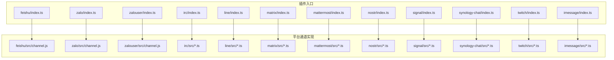
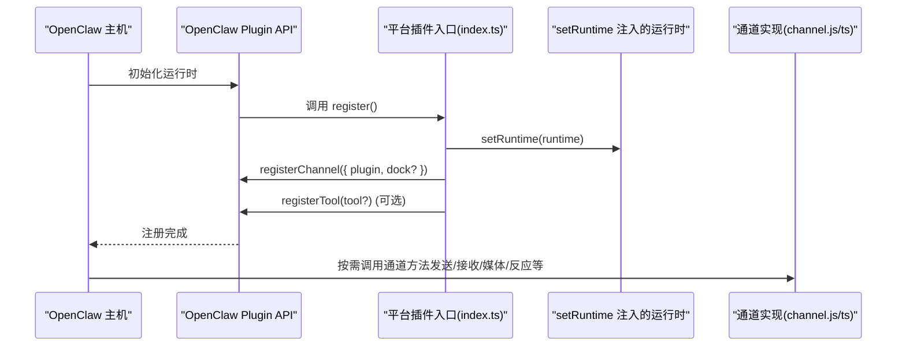
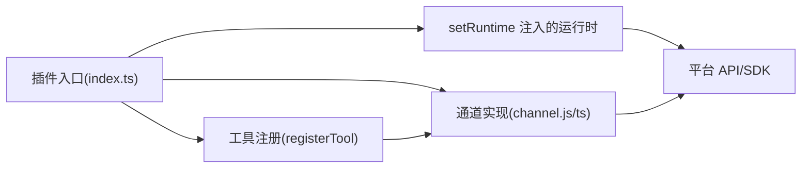

# 其他平台插件

<cite>
**本文引用的文件**
- [extensions/feishu/index.ts](file://extensions/feishu/index.ts)
- [extensions/zalo/index.ts](file://extensions/zalo/index.ts)
- [extensions/zalouser/index.ts](file://extensions/zalouser/index.ts)
- [extensions/irc/index.ts](file://extensions/irc/index.ts)
- [extensions/line/index.ts](file://extensions/line/index.ts)
- [extensions/matrix/index.ts](file://extensions/matrix/index.ts)
- [extensions/mattermost/index.ts](file://extensions/mattermost/index.ts)
- [extensions/nostr/index.ts](file://extensions/nostr/index.ts)
- [extensions/signal/index.ts](file://extensions/signal/index.ts)
- [extensions/synology-chat/index.ts](file://extensions/synology-chat/index.ts)
- [extensions/twitch/index.ts](file://extensions/twitch/index.ts)
- [extensions/imessage/index.ts](file://extensions/imessage/index.ts)
</cite>

## 目录
1. [简介](#简介)
2. [项目结构](#项目结构)
3. [核心组件](#核心组件)
4. [架构总览](#架构总览)
5. [详细组件分析](#详细组件分析)
6. [依赖分析](#依赖分析)
7. [性能考虑](#性能考虑)
8. [故障排查指南](#故障排查指南)
9. [结论](#结论)
10. [附录](#附录)

## 简介
本指南面向为其他即时通讯平台开发渠道插件的工程师与技术作者，基于仓库中已实现的插件（如飞书、Zalo、ZaloUser、IRC、Line、Matrix、Mattermost、Nostr、Signal、Synology Chat、Twitch、iMessage）进行系统化梳理，总结其插件注册流程、认证方式、API 特性与消息处理差异，并给出跨平台开发的通用模式与适配建议。文档同时提供配置示例与最佳实践，覆盖权限设置、速率限制与错误处理策略。

## 项目结构
OpenClaw 的插件体系采用“扩展目录 + 插件入口 + 平台子模块”的组织方式：每个平台在 extensions/<platform>/ 下提供一个 index.ts 作为插件入口，负责注册通道（channel）、可选的 Dock（用于 UI 或交互）、以及平台工具（tools）。插件入口通常会导入 runtime 设置、通道实现与工具注册函数，统一通过 OpenClaw Plugin SDK 注册到运行时。

图示来源
- [extensions/feishu/index.ts:1-66](file://extensions/feishu/index.ts#L1-L66)
- [extensions/zalo/index.ts:1-18](file://extensions/zalo/index.ts#L1-L18)
- [extensions/zalouser/index.ts:1-30](file://extensions/zalouser/index.ts#L1-L30)
- [extensions/irc/index.ts](file://extensions/irc/index.ts)
- [extensions/line/index.ts](file://extensions/line/index.ts)
- [extensions/matrix/index.ts](file://extensions/matrix/index.ts)
- [extensions/mattermost/index.ts](file://extensions/mattermost/index.ts)
- [extensions/nostr/index.ts](file://extensions/nostr/index.ts)
- [extensions/signal/index.ts](file://extensions/signal/index.ts)
- [extensions/synology-chat/index.ts](file://extensions/synology-chat/index.ts)
- [extensions/twitch/index.ts](file://extensions/twitch/index.ts)
- [extensions/imessage/index.ts](file://extensions/imessage/index.ts)

章节来源
- [extensions/feishu/index.ts:1-66](file://extensions/feishu/index.ts#L1-L66)
- [extensions/zalo/index.ts:1-18](file://extensions/zalo/index.ts#L1-L18)
- [extensions/zalouser/index.ts:1-30](file://extensions/zalouser/index.ts#L1-L30)

## 核心组件
- 插件入口（index.ts）
  - 负责声明插件标识、名称、描述与配置模式；调用 setRuntime 将运行时注入平台模块；通过 api.registerChannel 注册通道；按需注册 Dock 与工具。
  - 示例参考：[extensions/feishu/index.ts:48-66](file://extensions/feishu/index.ts#L48-L66)、[extensions/zalo/index.ts:6-15](file://extensions/zalo/index.ts#L6-L15)、[extensions/zalouser/index.ts:7-27](file://extensions/zalouser/index.ts#L7-L27)

- 通道实现（channel.js/ts）
  - 定义平台特有的消息发送、接收、媒体上传、反应（reactions）、提及解析等能力；部分平台还提供 Dock 以支持 UI 交互或快捷面板。
  - 示例参考：飞书通道导出对象与 Dock、Zalo Bot 通道与 Dock、ZaloUser 个人账户通道与 Dock。

- 工具（tools）
  - 部分平台插件会注册 Agent 可用的工具，例如 ZaloUser 提供好友、群组、资料查询与发送动作的封装。
  - 示例参考：[extensions/zalouser/index.ts:16-26](file://extensions/zalouser/index.ts#L16-L26)

- 运行时设置（runtime）
  - 各平台插件通过 setRuntime 将运行时注入模块，以便访问网络、存储、日志等基础设施。
  - 示例参考：[extensions/feishu/index.ts:53-55](file://extensions/feishu/index.ts#L53-L55)、[extensions/zalo/index.ts:11-13](file://extensions/zalo/index.ts#L11-L13)、[extensions/zalouser/index.ts:12-14](file://extensions/zalouser/index.ts#L12-L14)

章节来源
- [extensions/feishu/index.ts:48-66](file://extensions/feishu/index.ts#L48-L66)
- [extensions/zalo/index.ts:6-15](file://extensions/zalo/index.ts#L6-L15)
- [extensions/zalouser/index.ts:7-27](file://extensions/zalouser/index.ts#L7-L27)

## 架构总览
下图展示了插件注册与运行时交互的总体流程：插件入口在注册阶段设置运行时、注册通道与工具，随后通道实现通过运行时提供的能力与平台 API 进行消息收发与业务操作。

图示来源
- [extensions/feishu/index.ts:53-55](file://extensions/feishu/index.ts#L53-L55)
- [extensions/zalo/index.ts:11-13](file://extensions/zalo/index.ts#L11-L13)
- [extensions/zalouser/index.ts:12-14](file://extensions/zalouser/index.ts#L12-L14)

## 详细组件分析

### 飞书（Feishu/Lark）
- 认证与配置
  - 使用空配置模式（emptyPluginConfigSchema），表明默认使用运行时环境变量或凭据管理机制进行认证。
  - 参考：[extensions/feishu/index.ts:2-52](file://extensions/feishu/index.ts#L2-L52)

- 通道与功能
  - 注册通道与 Dock；提供文档、知识库、云盘、权限、多维表格等工具的注册。
  - 支持消息发送、卡片消息、媒体上传、反应（reactions）与提及解析。
  - 参考：[extensions/feishu/index.ts:56-61](file://extensions/feishu/index.ts#L56-L61)

- 企业级特性
  - 多维表格、权限管理、知识库 Wiki、文档协作等，适合企业内部协同场景。
  - 参考：[extensions/feishu/index.ts:3-10](file://extensions/feishu/index.ts#L3-L10)

- 最佳实践
  - 使用运行时凭据管理，避免硬编码密钥；对批量操作进行限速与幂等设计；对提及解析与卡片格式进行严格校验。

章节来源
- [extensions/feishu/index.ts:1-66](file://extensions/feishu/index.ts#L1-L66)

### Zalo（Bot API）
- 认证与配置
  - 使用空配置模式，结合运行时凭据进行认证。
  - 参考：[extensions/zalo/index.ts:1-10](file://extensions/zalo/index.ts#L1-L10)

- 通道与功能
  - 注册通道与 Dock，支持 Bot API 的消息收发与交互。
  - 参考：[extensions/zalo/index.ts:11-14](file://extensions/zalo/index.ts#L11-L14)

- 最佳实践
  - 对回调事件进行去重与幂等处理；合理设置超时与重试；对媒体资源进行预检与缓存。

章节来源
- [extensions/zalo/index.ts:1-18](file://extensions/zalo/index.ts#L1-L18)

### ZaloUser（个人账户）
- 认证与配置
  - 使用空配置模式，通过原生 zca-js 集成进行个人账户认证与数据访问。
  - 参考：[extensions/zalouser/index.ts:1-11](file://extensions/zalouser/index.ts#L1-L11)

- 通道与功能
  - 注册通道与 Dock；提供工具集：发送文本/图片/链接、好友/群组查询、个人资料与状态检查。
  - 参考：[extensions/zalouser/index.ts:12-26](file://extensions/zalouser/index.ts#L12-L26)

- 最佳实践
  - 严格控制工具参数与返回数据；对个人隐私数据访问进行最小化授权；记录工具调用日志便于审计。

章节来源
- [extensions/zalouser/index.ts:1-30](file://extensions/zalouser/index.ts#L1-L30)

### IRC
- 认证与配置
  - 使用空配置模式，结合运行时凭据；常见认证方式包括明文密码、SASL 机制等。
  - 参考：[extensions/irc/index.ts](file://extensions/irc/index.ts)

- 通道与功能
  - 通道实现负责连接服务器、加入频道、发送/接收消息、处理踢出/禁言等事件。
  - 参考：[extensions/irc/index.ts](file://extensions/irc/index.ts)

- 最佳实践
  - 实施连接保活与自动重连；对频道列表与用户权限进行缓存；对敏感命令进行鉴权与白名单控制。

章节来源
- [extensions/irc/index.ts](file://extensions/irc/index.ts)

### Line
- 认证与配置
  - 使用空配置模式，结合运行时凭据；常见认证方式为 Channel Access Token。
  - 参考：[extensions/line/index.ts](file://extensions/line/index.ts)

- 通道与功能
  - 通道实现负责消息发送、图片/视频/文件上传、模板消息、Rich Menu 等。
  - 参考：[extensions/line/index.ts](file://extensions/line/index.ts)

- 最佳实践
  - 对 Rich Menu 与模板消息进行版本管理；对媒体资源进行 CDN 缓存与尺寸校验。

章节来源
- [extensions/line/index.ts](file://extensions/line/index.ts)

### Matrix
- 认证与配置
  - 使用空配置模式，结合运行时凭据；常见认证方式为访问令牌或用户名/密码登录。
  - 参考：[extensions/matrix/index.ts](file://extensions/matrix/index.ts)

- 通道与功能
  - 通道实现负责房间管理、消息同步、事件过滤、加密房间支持等。
  - 参考：[extensions/matrix/index.ts](file://extensions/matrix/index.ts)

- 最佳实践
  - 对同步游标（since）进行持久化；对加密房间的密钥轮换进行监控；对大规模房间进行分页与并发控制。

章节来源
- [extensions/matrix/index.ts](file://extensions/matrix/index.ts)

### Mattermost
- 认证与配置
  - 使用空配置模式，结合运行时凭据；常见认证方式为 Personal Access Token 或 OAuth。
  - 参考：[extensions/mattermost/index.ts](file://extensions/mattermost/index.ts)

- 通道与功能
  - 通道实现负责团队/频道管理、消息发送/编辑/删除、文件上传、Webhook 接收等。
  - 参考：[extensions/mattermost/index.ts](file://extensions/mattermost/index.ts)

- 最佳实践
  - 对频道权限进行最小授权；对 Webhook 事件进行签名验证；对大文件上传进行断点续传策略。

章节来源
- [extensions/mattermost/index.ts](file://extensions/mattermost/index.ts)

### Nostr
- 认证与配置
  - 使用空配置模式，结合运行时凭据；常见认证方式为私钥签名与事件发布。
  - 参考：[extensions/nostr/index.ts](file://extensions/nostr/index.ts)

- 通道与功能
  - 通道实现负责事件发布、订阅、过滤器构建、公私钥管理等。
  - 参考：[extensions/nostr/index.ts](file://extensions/nostr/index.ts)

- 最佳实践
  - 对事件进行签名验证与时间戳校验；对过滤器进行性能优化；对私钥进行安全存储与轮换。

章节来源
- [extensions/nostr/index.ts](file://extensions/nostr/index.ts)

### Signal
- 认证与配置
  - 使用空配置模式，结合运行时凭据；常见认证方式为设备绑定或账户令牌。
  - 参考：[extensions/signal/index.ts](file://extensions/signal/index.ts)

- 通道与功能
  - 通道实现负责联系人/群组管理、消息发送/接收、文件传输、端到端加密等。
  - 参考：[extensions/signal/index.ts](file://extensions/signal/index.ts)

- 最佳实践
  - 对端到端密钥进行安全存储；对文件传输进行完整性校验；对消息去重与顺序进行保证。

章节来源
- [extensions/signal/index.ts](file://extensions/signal/index.ts)

### Synology Chat
- 认证与配置
  - 使用空配置模式，结合运行时凭据；常见认证方式为应用令牌或 OAuth。
  - 参考：[extensions/synology-chat/index.ts](file://extensions/synology-chat/index.ts)

- 通道与功能
  - 通道实现负责工作区/频道管理、消息发送、文件上传、机器人集成等。
  - 参考：[extensions/synology-chat/index.ts](file://extensions/synology-chat/index.ts)

- 最佳实践
  - 对工作区权限进行最小授权；对机器人事件进行鉴权与白名单控制；对文件大小与类型进行限制。

章节来源
- [extensions/synology-chat/index.ts](file://extensions/synology-chat/index.ts)

### Twitch
- 认证与配置
  - 使用空配置模式，结合运行时凭据；常见认证方式为 OAuth 令牌。
  - 参考：[extensions/twitch/index.ts](file://extensions/twitch/index.ts)

- 通道与功能
  - 通道实现负责聊天室接入、消息发送、礼物/订阅/连击等事件处理、直播互动等。
  - 参考：[extensions/twitch/index.ts](file://extensions/twitch/index.ts)

- 最佳实践
  - 对聊天频率进行限速；对礼物/订阅事件进行幂等处理；对敏感内容进行过滤与审核。

章节来源
- [extensions/twitch/index.ts](file://extensions/twitch/index.ts)

### iMessage
- 认证与配置
  - 使用空配置模式，结合运行时凭据；常见认证方式为系统账户或令牌。
  - 参考：[extensions/imessage/index.ts](file://extensions/imessage/index.ts)

- 通道与功能
  - 通道实现负责联系人/群组管理、消息发送/接收、附件上传、系统集成等。
  - 参考：[extensions/imessage/index.ts](file://extensions/imessage/index.ts)

- 最佳实践
  - 对系统权限进行最小授权；对消息去重与时间线进行维护；对附件进行安全扫描。

章节来源
- [extensions/imessage/index.ts](file://extensions/imessage/index.ts)

## 依赖分析
- 组件耦合
  - 插件入口与通道实现之间为弱耦合：入口仅负责注册，通道实现通过 setRuntime 获取运行时能力。
  - 工具与通道之间为可选依赖：部分平台（如 ZaloUser）注册工具，增强 Agent 能力。

- 外部依赖
  - 各平台依赖官方 API/SDK；插件通过运行时抽象屏蔽底层差异。
  - 配置与凭据通过运行时凭据管理统一注入。

图示来源
- [extensions/feishu/index.ts:53-55](file://extensions/feishu/index.ts#L53-L55)
- [extensions/zalouser/index.ts:16-26](file://extensions/zalouser/index.ts#L16-L26)

## 性能考虑
- 连接与同步
  - 对长连接类协议（Matrix、IRC、Twitch）实施心跳与断线重连；对同步类接口（Matrix）持久化游标，减少全量拉取。
- 速率限制
  - 各平台均存在速率限制：对高频操作进行队列化与指数退避；对批量操作进行分片与并发上限控制。
- 媒体处理
  - 对大文件上传进行分块与断点续传；对图片进行压缩与尺寸校验；对视频进行转码与缓存。
- 错误处理
  - 对瞬时错误进行重试与熔断；对永久错误进行隔离与告警；对认证失效进行自动刷新与降级。

## 故障排查指南
- 认证失败
  - 检查运行时凭据是否正确注入；确认平台令牌有效期与权限范围；核对回调地址与签名。
- 连接异常
  - 检查网络连通性与代理设置；查看握手日志与 TLS 证书；对长连接实施 ping/pong 保活。
- 速率限制
  - 查看平台返回的 Retry-After 或 X-RateLimit-* 头；调整请求节流策略；对突发流量进行缓冲队列。
- 媒体上传失败
  - 校验文件大小与类型；检查 CDN/存储配额；对上传过程进行进度与重试。
- 工具执行异常
  - 记录工具输入参数与返回结果；对参数进行 Schema 校验；对工具调用进行超时与熔断。

## 结论
通过对飞书、Zalo、ZaloUser、IRC、Line、Matrix、Mattermost、Nostr、Signal、Synology Chat、Twitch、iMessage 等平台插件的系统化分析，可以提炼出一套跨平台插件开发的通用模式：以插件入口为注册中枢，通道实现承载平台能力，运行时提供统一基础设施，工具增强 Agent 行为。在此基础上，结合各平台的认证方式、API 特性与消息处理差异，制定针对性的配置、权限、速率限制与错误处理策略，即可高效地完成新平台的插件适配与上线。

## 附录
- 通用开发步骤
  - 在 extensions/<platform>/ 创建插件入口与通道实现；通过 setRuntime 注入运行时；注册通道与可选 Dock/工具。
  - 在通道实现中封装平台 API 调用，提供发送、接收、媒体、反应、提及等能力。
  - 在运行时中配置凭据与网络参数，确保认证与安全策略生效。
- 配置示例与最佳实践
  - 凭据管理：优先使用运行时凭据管理，避免硬编码；对令牌进行轮换与审计。
  - 权限设置：最小授权原则；对工具与通道进行细粒度权限控制。
  - 速率限制：根据平台文档设置限速；对批量操作进行分片与节流。
  - 错误处理：区分瞬时与永久错误；对认证失效进行自动刷新；对异常进行可观测与告警。