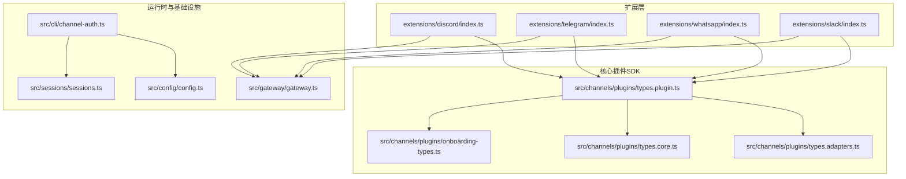
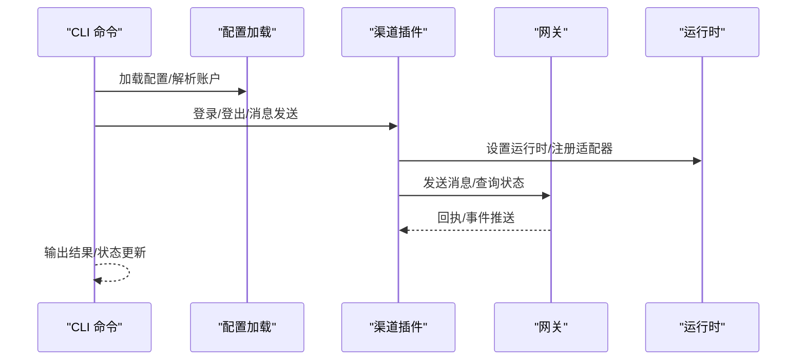
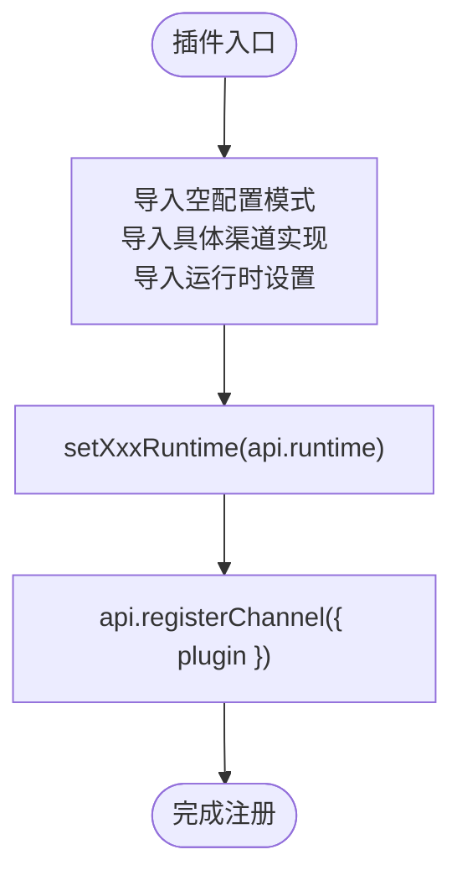
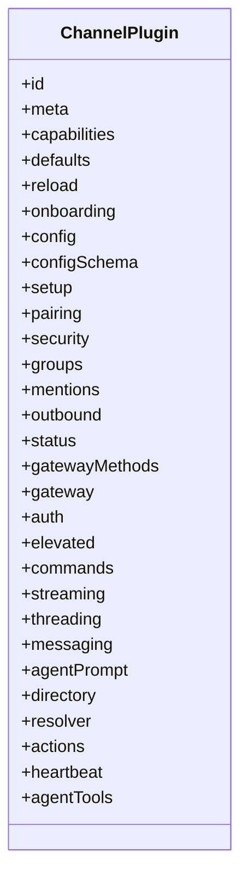
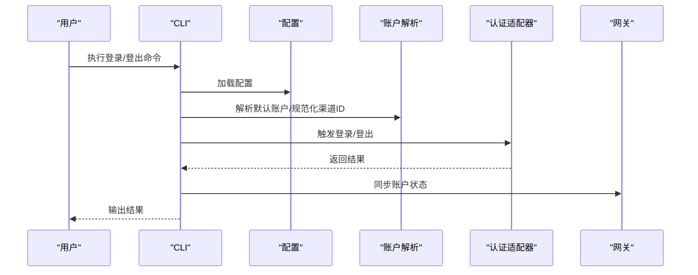
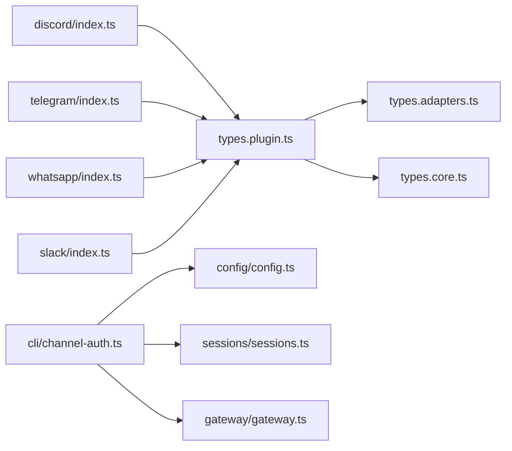

# 渠道插件开发

<cite>
**本文引用的文件**
- [extensions/discord/index.ts](file://extensions/discord/index.ts)
- [extensions/telegram/index.ts](file://extensions/telegram/index.ts)
- [extensions/whatsapp/index.ts](file://extensions/whatsapp/index.ts)
- [extensions/slack/index.ts](file://extensions/slack/index.ts)
- [src/channels/plugins/types.plugin.ts](file://src/channels/plugins/types.plugin.ts)
- [src/channels/plugins/types.adapters.ts](file://src/channels/plugins/types.adapters.ts)
- [src/channels/plugins/types.core.ts](file://src/channels/plugins/types.core.ts)
- [src/channels/plugins/onboarding-types.ts](file://src/channels/plugins/onboarding-types.ts)
- [src/channels/plugins/index.ts](file://src/channels/plugins/index.ts)
- [src/channels/plugins/helpers.ts](file://src/channels/plugins/helpers.ts)
- [src/cli/channel-auth.ts](file://src/cli/channel-auth.ts)
- [src/gateway/gateway.ts](file://src/gateway/gateway.ts)
- [src/sessions/sessions.ts](file://src/sessions/sessions.ts)
- [src/config/config.ts](file://src/config/config.ts)
- [docs/channels/discord.md](file://docs/channels/discord.md)
- [docs/channels/telegram.md](file://docs/channels/telegram.md)
- [docs/channels/whatsapp.md](file://docs/channels/whatsapp.md)
- [docs/channels/slack.md](file://docs/channels/slack.md)
</cite>

## 目录
1. [简介](#简介)
2. [项目结构](#项目结构)
3. [核心组件](#核心组件)
4. [架构总览](#架构总览)
5. [详细组件分析](#详细组件分析)
6. [依赖关系分析](#依赖关系分析)
7. [性能考虑](#性能考虑)
8. [故障排查指南](#故障排查指南)
9. [结论](#结论)
10. [附录](#附录)

## 简介
本指南面向希望为 OpenClaw 开发“渠道插件”的开发者，系统讲解渠道插件的架构模式与实现要点，覆盖消息接收、发送与状态管理；并针对主流即时通讯平台（Discord、Telegram、WhatsApp、Slack）给出集成差异说明与最佳实践。文档同时提供从基础消息转发到复杂交互功能的开发示例路径，并涵盖配置管理、错误处理、重连机制与性能优化建议。

## 项目结构
OpenClaw 的渠道插件以“插件化 + 标准适配器”为核心设计：每个渠道在 extensions/<channel>/ 下提供一个入口文件与具体实现，统一通过 OpenClaw 插件 SDK 注册到运行时。核心类型与适配器定义位于 src/channels/plugins/ 目录下，CLI 认证流程与网关通信在 src/cli/ 与 src/gateway/ 中实现。

图表来源
- [extensions/discord/index.ts:1-20](file://extensions/discord/index.ts#L1-L20)
- [extensions/telegram/index.ts:1-18](file://extensions/telegram/index.ts#L1-L18)
- [extensions/whatsapp/index.ts:1-18](file://extensions/whatsapp/index.ts#L1-L18)
- [extensions/slack/index.ts:1-18](file://extensions/slack/index.ts#L1-L18)
- [src/channels/plugins/types.plugin.ts:1-86](file://src/channels/plugins/types.plugin.ts#L1-L86)
- [src/gateway/gateway.ts](file://src/gateway/gateway.ts)
- [src/cli/channel-auth.ts](file://src/cli/channel-auth.ts)
- [src/config/config.ts](file://src/config/config.ts)
- [src/sessions/sessions.ts](file://src/sessions/sessions.ts)

章节来源
- [extensions/discord/index.ts:1-20](file://extensions/discord/index.ts#L1-L20)
- [extensions/telegram/index.ts:1-18](file://extensions/telegram/index.ts#L1-L18)
- [extensions/whatsapp/index.ts:1-18](file://extensions/whatsapp/index.ts#L1-L18)
- [extensions/slack/index.ts:1-18](file://extensions/slack/index.ts#L1-L18)
- [src/channels/plugins/types.plugin.ts:1-86](file://src/channels/plugins/types.plugin.ts#L1-L86)

## 核心组件
- 渠道插件契约与能力声明：ChannelPlugin 定义了插件 ID、元数据、能力集与可选适配器集合（认证、出站消息、状态、心跳、线程、提及、群组等），用于统一注册与调用。
- 适配器接口族：types.adapters.ts 提供认证、出站、状态、心跳、线程、提及、群组、目录、解析器、动作、流式传输等适配器接口，插件按需实现。
- 运行时与注册：各渠道入口文件通过 OpenClawPluginApi.registerChannel 将插件注册到运行时，并设置各自运行时环境。
- CLI 认证与账户解析：CLI 层负责登录/登出、账户解析与消息通道选择，配合配置加载与会话管理。
- 网关通信：gateway.ts 负责与网关建立与维护连接，承载消息路由与状态同步。

章节来源
- [src/channels/plugins/types.plugin.ts:49-85](file://src/channels/plugins/types.plugin.ts#L49-L85)
- [src/channels/plugins/types.adapters.ts](file://src/channels/plugins/types.adapters.ts)
- [src/channels/plugins/types.core.ts](file://src/channels/plugins/types.core.ts)
- [extensions/discord/index.ts:12-16](file://extensions/discord/index.ts#L12-L16)
- [src/cli/channel-auth.ts](file://src/cli/channel-auth.ts)
- [src/gateway/gateway.ts](file://src/gateway/gateway.ts)
- [src/sessions/sessions.ts](file://src/sessions/sessions.ts)
- [src/config/config.ts](file://src/config/config.ts)

## 架构总览
下图展示了从 CLI 到渠道插件再到网关的整体调用链路与职责边界：

图表来源
- [src/cli/channel-auth.ts](file://src/cli/channel-auth.ts)
- [src/channels/plugins/types.plugin.ts:49-85](file://src/channels/plugins/types.plugin.ts#L49-L85)
- [src/gateway/gateway.ts](file://src/gateway/gateway.ts)

## 详细组件分析

### 渠道插件注册与运行时设置
- 入口文件职责：导入空配置模式、具体渠道实现与运行时设置函数，随后通过 OpenClawPluginApi.registerChannel 注册插件。
- 运行时注入：setXxxRuntime(api.runtime) 将运行时上下文注入到插件内部，便于后续适配器使用。

图表来源
- [extensions/discord/index.ts:12-16](file://extensions/discord/index.ts#L12-L16)
- [extensions/telegram/index.ts:11-14](file://extensions/telegram/index.ts#L11-L14)
- [extensions/whatsapp/index.ts:11-14](file://extensions/whatsapp/index.ts#L11-L14)
- [extensions/slack/index.ts:11-14](file://extensions/slack/index.ts#L11-L14)

章节来源
- [extensions/discord/index.ts:1-20](file://extensions/discord/index.ts#L1-L20)
- [extensions/telegram/index.ts:1-18](file://extensions/telegram/index.ts#L1-L18)
- [extensions/whatsapp/index.ts:1-18](file://extensions/whatsapp/index.ts#L1-L18)
- [extensions/slack/index.ts:1-18](file://extensions/slack/index.ts#L1-L18)

### 渠道插件契约与适配器族
ChannelPlugin 是所有渠道插件必须遵循的契约，包含以下关键字段与可选适配器：
- 必填：id、meta、capabilities、config
- 可选：onboarding、setup、pairing、security、groups、mentions、outbound、status、gatewayMethods、gateway、auth、elevated、commands、streaming、threading、messaging、agentPrompt、directory、resolver、actions、heartbeat、agentTools

图表来源
- [src/channels/plugins/types.plugin.ts:49-85](file://src/channels/plugins/types.plugin.ts#L49-L85)

章节来源
- [src/channels/plugins/types.plugin.ts:1-86](file://src/channels/plugins/types.plugin.ts#L1-L86)

### 消息处理与状态管理
- 出站消息（Outbound）：负责将 OpenClaw 内部消息转换为平台协议消息并发送。
- 入站消息（Messaging）：负责接收平台事件并转换为 OpenClaw 消息格式。
- 状态适配器（Status）：用于探测/审计平台可用性与健康度。
- 心跳适配器（Heartbeat）：维持长连接与健康检查。
- 线程与提及（Threading/Mentions）：支持话题线程与 @ 提及解析。
- 群组与目录（Groups/Directory）：平台群组与成员信息管理。

章节来源
- [src/channels/plugins/types.adapters.ts](file://src/channels/plugins/types.adapters.ts)
- [src/channels/plugins/types.core.ts](file://src/channels/plugins/types.core.ts)

### 平台集成差异（Discord、Telegram、WhatsApp、Slack）
- Discord：通过入口文件注册插件并设置运行时，结合官方 SDK 实现消息收发与状态同步。
- Telegram：入口文件与 Discord 类似，但需注意 Bot Token 与 Webhook 配置差异。
- WhatsApp：基于插件 SDK 实现，注意端到端加密与消息幂等性。
- Slack：入口文件与运行时设置一致，需关注 Workspace 与 Channel 权限模型。

章节来源
- [extensions/discord/index.ts:1-20](file://extensions/discord/index.ts#L1-L20)
- [extensions/telegram/index.ts:1-18](file://extensions/telegram/index.ts#L1-L18)
- [extensions/whatsapp/index.ts:1-18](file://extensions/whatsapp/index.ts#L1-L18)
- [extensions/slack/index.ts:1-18](file://extensions/slack/index.ts#L1-L18)
- [docs/channels/discord.md](file://docs/channels/discord.md)
- [docs/channels/telegram.md](file://docs/channels/telegram.md)
- [docs/channels/whatsapp.md](file://docs/channels/whatsapp.md)
- [docs/channels/slack.md](file://docs/channels/slack.md)

### 用户认证与会话管理
- CLI 登录/登出：通过 runChannelLogin/runChannelLogout 统一处理渠道账户登录与登出。
- 账户解析与默认账户：resolveChannelDefaultAccountId、normalizeChannelId、resolveAccount 等辅助函数确保账户选择一致性。
- 配置加载：loadConfig 提供渠道配置读取与校验。
- 会话管理：sessions 模块负责会话生命周期与清理策略。

图表来源
- [src/cli/channel-auth.ts](file://src/cli/channel-auth.ts)
- [src/channels/plugins/helpers.ts](file://src/channels/plugins/helpers.ts)
- [src/config/config.ts](file://src/config/config.ts)
- [src/sessions/sessions.ts](file://src/sessions/sessions.ts)
- [src/gateway/gateway.ts](file://src/gateway/gateway.ts)

章节来源
- [src/cli/channel-auth.ts](file://src/cli/channel-auth.ts)
- [src/channels/plugins/helpers.ts](file://src/channels/plugins/helpers.ts)
- [src/config/config.ts](file://src/config/config.ts)
- [src/sessions/sessions.ts](file://src/sessions/sessions.ts)
- [src/gateway/gateway.ts](file://src/gateway/gateway.ts)

### 状态同步与心跳机制
- 心跳适配器（Heartbeat）：定期向平台发送心跳包，检测连接有效性。
- 状态适配器（Status）：提供 probe/audit 能力，用于诊断平台可用性与异常。
- 网关侧状态：gateway.ts 维护与网关的心跳与状态同步，避免断线与消息丢失。

章节来源
- [src/channels/plugins/types.adapters.ts](file://src/channels/plugins/types.adapters.ts)
- [src/gateway/gateway.ts](file://src/gateway/gateway.ts)

### 配置管理
- 插件配置模式：emptyPluginConfigSchema 提供空配置模式，便于快速启动。
- 配置 Schema：ChannelConfigSchema 支持 schema 与 UI Hints，用于 CLI 与控制台展示。
- 配置加载：loadConfig 负责读取与合并配置，支持多前缀热重载（reload.configPrefixes）。

章节来源
- [extensions/discord/index.ts](file://extensions/discord/index.ts#L11)
- [extensions/telegram/index.ts](file://extensions/telegram/index.ts#L10)
- [extensions/whatsapp/index.ts](file://extensions/whatsapp/index.ts#L10)
- [extensions/slack/index.ts](file://extensions/slack/index.ts#L10)
- [src/channels/plugins/types.plugin.ts:43-46](file://src/channels/plugins/types.plugin.ts#L43-L46)
- [src/config/config.ts](file://src/config/config.ts)

### 错误处理与重连机制
- 断线重连：在 gateway.ts 中实现指数退避与最大重试次数，避免风暴重试。
- 异常捕获：在适配器中对网络异常、鉴权失败、速率限制进行分类处理。
- 失败回退：当平台不可用时，将消息暂存至本地队列，待恢复后批量重放。

章节来源
- [src/gateway/gateway.ts](file://src/gateway/gateway.ts)

### 性能优化最佳实践
- 消息去抖：通过 ChannelPlugin.defaults.queue.debounceMs 控制消息发送频率。
- 批量处理：聚合小消息为批次，降低平台 API 调用次数。
- 缓存与索引：缓存用户/群组信息，减少重复查询。
- 资源池：复用连接与令牌，避免频繁重建。

章节来源
- [src/channels/plugins/types.plugin.ts:53-57](file://src/channels/plugins/types.plugin.ts#L53-L57)

## 依赖关系分析
- 插件入口依赖 OpenClawPluginApi，统一注册与运行时注入。
- 插件契约依赖适配器接口族，按需实现对应能力。
- CLI 依赖配置与账户解析模块，驱动认证与消息通道选择。
- 网关作为统一出口，承载消息路由与状态同步。

图表来源
- [extensions/discord/index.ts:1-20](file://extensions/discord/index.ts#L1-L20)
- [extensions/telegram/index.ts:1-18](file://extensions/telegram/index.ts#L1-L18)
- [extensions/whatsapp/index.ts:1-18](file://extensions/whatsapp/index.ts#L1-L18)
- [extensions/slack/index.ts:1-18](file://extensions/slack/index.ts#L1-L18)
- [src/channels/plugins/types.plugin.ts:1-86](file://src/channels/plugins/types.plugin.ts#L1-L86)
- [src/cli/channel-auth.ts](file://src/cli/channel-auth.ts)
- [src/config/config.ts](file://src/config/config.ts)
- [src/sessions/sessions.ts](file://src/sessions/sessions.ts)
- [src/gateway/gateway.ts](file://src/gateway/gateway.ts)

章节来源
- [src/channels/plugins/types.plugin.ts:1-86](file://src/channels/plugins/types.plugin.ts#L1-L86)
- [src/channels/plugins/types.adapters.ts](file://src/channels/plugins/types.adapters.ts)
- [src/channels/plugins/types.core.ts](file://src/channels/plugins/types.core.ts)
- [src/cli/channel-auth.ts](file://src/cli/channel-auth.ts)
- [src/gateway/gateway.ts](file://src/gateway/gateway.ts)

## 性能考虑
- 合理设置去抖时间，避免平台限流。
- 使用批处理与并发上限，平衡吞吐与稳定性。
- 对高频查询进行缓存，减少重复请求。
- 在网关层实现背压与队列长度控制，防止内存膨胀。

## 故障排查指南
- 认证失败：检查 CLI 登录流程与账户解析逻辑，确认配置项是否正确。
- 连接断开：查看网关心跳与重连策略，确认平台 API 限额与网络状况。
- 消息丢失：核查 Outbound 适配器的回执处理与本地队列持久化。
- 权限不足：核对平台侧权限范围与 Group/Channel 访问策略。

章节来源
- [src/cli/channel-auth.ts](file://src/cli/channel-auth.ts)
- [src/gateway/gateway.ts](file://src/gateway/gateway.ts)
- [src/channels/plugins/types.adapters.ts](file://src/channels/plugins/types.adapters.ts)

## 结论
通过标准化的 ChannelPlugin 契约与适配器接口，OpenClaw 为多平台渠道插件提供了清晰的开发范式。开发者只需聚焦于平台差异点（认证、消息协议、权限模型），即可快速实现稳定、可维护的渠道插件。配合完善的 CLI、配置与网关机制，可轻松构建从基础消息转发到复杂交互的全栈能力。

## 附录
- 开发示例路径（不展示代码内容，仅提供定位）：
  - 基础消息转发：参考各渠道入口文件与 Outbound 适配器实现位置
  - 复杂交互（线程/提及/群组）：参考 Threading/Mentions/Groups 适配器与 Directory 接口
  - 认证流程：参考 CLI 登录/登出与 Auth 适配器
  - 状态同步：参考 Status/Heartbeat 适配器与网关心跳
- 平台文档参考：
  - Discord：参见文档目录中的 Discord 渠道说明
  - Telegram：参见文档目录中的 Telegram 渠道说明
  - WhatsApp：参见文档目录中的 WhatsApp 渠道说明
  - Slack：参见文档目录中的 Slack 渠道说明