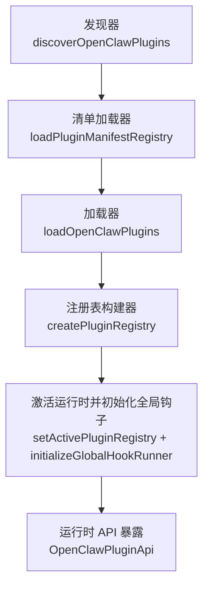
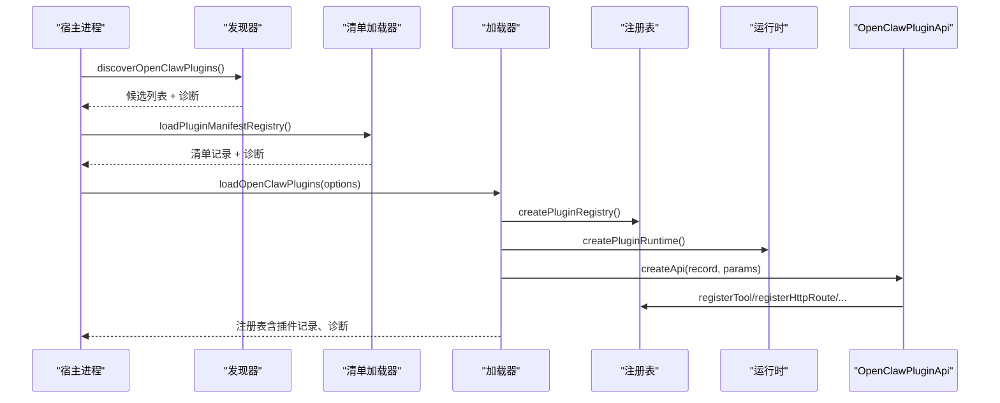
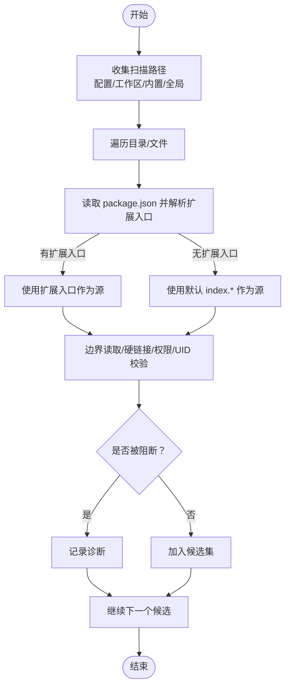
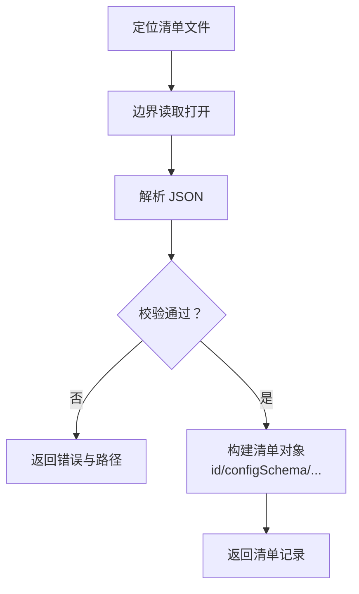
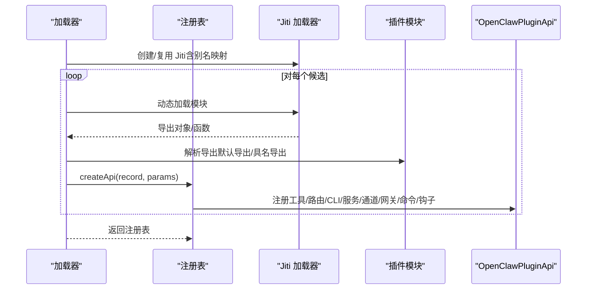
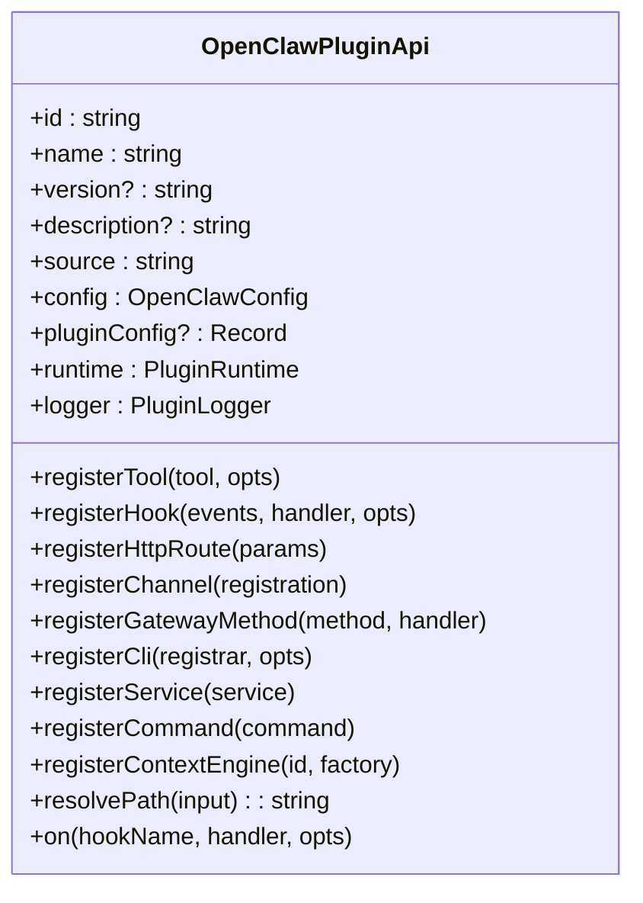
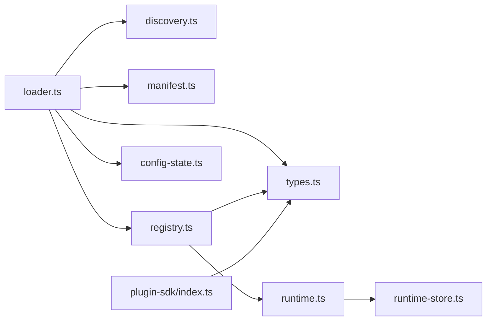

# 插件系统

<cite>
**本文引用的文件**
- [loader.ts](file://src/plugins/loader.ts)
- [registry.ts](file://src/plugins/registry.ts)
- [types.ts](file://src/plugins/types.ts)
- [manifest.ts](file://src/plugins/manifest.ts)
- [discovery.ts](file://src/plugins/discovery.ts)
- [config-state.ts](file://src/plugins/config-state.ts)
- [runtime.ts](file://src/plugins/runtime.ts)
- [runtime-store.ts](file://src/plugin-sdk/runtime-store.ts)
- [index.ts](file://src/plugin-sdk/index.ts)
- [hooks.ts](file://src/plugins/hooks.ts)
- [frontmatter.ts](file://src/shared/frontmatter.ts)
- [plugins-docker.sh](file://scripts/e2e/plugins-docker.sh)
- [plugin-sdk.md](file://docs/zh-CN/refactor/plugin-sdk.md)
- [runtime-env.ts](file://extensions/test-utils/runtime-env.ts)
- [check-no-monolithic-plugin-sdk-entry-imports.ts](file://scripts/check-no-monolithic-plugin-sdk-entry-imports.ts)
- [openclaw.plugin.json](file://extensions/memory-core/openclaw.plugin.json)
- [index.ts](file://extensions/memory-core/index.ts)
- [index.ts](file://extensions/diffs/index.ts)
- [index.ts](file://extensions/discord/index.ts)
</cite>

## 目录
1. [简介](#简介)
2. [项目结构](#项目结构)
3. [核心组件](#核心组件)
4. [架构总览](#架构总览)
5. [详细组件分析](#详细组件分析)
6. [依赖关系分析](#依赖关系分析)
7. [性能考量](#性能考量)
8. [故障排查指南](#故障排查指南)
9. [结论](#结论)
10. [附录](#附录)

## 简介
本文件面向 OpenClaw 的插件系统，提供从架构设计到开发实践的完整技术文档。内容覆盖插件接口规范、生命周期管理、动态加载机制、SDK 使用方法、不同插件类型（渠道、工具、钩子等）的实现模式、插件清单与元数据、安全模型（边界读取、路径安全、别名映射）、最佳实践与调试指南，并给出可直接参考的代码片段路径。

## 项目结构
OpenClaw 插件系统由“发现—清单解析—加载—注册—运行时”五段流水线构成，配合严格的路径安全策略与缓存机制，确保在多来源（内置、工作区、全局、配置指定）下稳定加载与运行。

图示来源
- [loader.ts:447-800](file://src/plugins/loader.ts#L447-L800)
- [discovery.ts:639-733](file://src/plugins/discovery.ts#L639-L733)
- [registry.ts:185-625](file://src/plugins/registry.ts#L185-L625)
- [runtime.ts:25-49](file://src/plugins/runtime.ts#L25-L49)

章节来源
- [loader.ts:447-800](file://src/plugins/loader.ts#L447-L800)
- [discovery.ts:639-733](file://src/plugins/discovery.ts#L639-L733)
- [registry.ts:185-625](file://src/plugins/registry.ts#L185-L625)
- [runtime.ts:25-49](file://src/plugins/runtime.ts#L25-L49)

## 核心组件
- 插件发现与候选收集：扫描内置、工作区、全局与配置指定路径，解析 package.json 扩展入口，生成候选列表并进行路径安全校验。
- 清单解析与校验：读取 openclaw.plugin.json，要求包含 id 与 configSchema；支持 uiHints、kind、channels/providers/skills 等元信息。
- 加载与注册：基于候选逐个加载模块，校验导出形式与注册函数，构建注册表并记录诊断信息。
- 运行时与 API：提供 OpenClawPluginApi，统一注册工具、HTTP 路由、CLI 命令、服务、通道、网关方法、钩子与上下文引擎。
- 配置与策略：支持 allow/deny 列表、entries 配置、内存槽位选择、验证模式与缓存键生成。
- 安全与边界：严格边界读取、拒绝硬链接、禁止世界可写目录、检查可疑所有权、Jiti 别名映射与子路径 SDK 引入约束。

章节来源
- [discovery.ts:1-733](file://src/plugins/discovery.ts#L1-L733)
- [manifest.ts:1-199](file://src/plugins/manifest.ts#L1-L199)
- [loader.ts:1-800](file://src/plugins/loader.ts#L1-L800)
- [registry.ts:1-625](file://src/plugins/registry.ts#L1-L625)
- [types.ts:1-893](file://src/plugins/types.ts#L1-L893)
- [config-state.ts:90-110](file://src/plugins/config-state.ts#L90-L110)
- [runtime.ts:1-49](file://src/plugins/runtime.ts#L1-L49)

## 架构总览
下图展示插件系统从发现到运行的关键交互：

图示来源
- [discovery.ts:639-733](file://src/plugins/discovery.ts#L639-L733)
- [loader.ts:447-800](file://src/plugins/loader.ts#L447-L800)
- [registry.ts:185-625](file://src/plugins/registry.ts#L185-L625)
- [runtime.ts:25-49](file://src/plugins/runtime.ts#L25-L49)

## 详细组件分析

### 组件一：插件发现与候选收集（discoverOpenClawPlugins）
- 支持多来源：配置指定路径、工作区扩展目录、内置扩展目录、全局扩展目录。
- 包装入口优先：若 package.json 中存在 openclaw.extensions，则优先使用其指向的入口文件；否则回退到默认 index.* 文件。
- 路径安全：对每个候选执行边界读取、拒绝硬链接、禁止世界可写、检查 UID 所有权，异常以诊断项记录。
- 缓存：按环境变量与路径组合生成缓存键，短 TTL 抑制启动抖动。

图示来源
- [discovery.ts:415-521](file://src/plugins/discovery.ts#L415-L521)
- [discovery.ts:523-637](file://src/plugins/discovery.ts#L523-L637)
- [discovery.ts:639-733](file://src/plugins/discovery.ts#L639-L733)

章节来源
- [discovery.ts:1-733](file://src/plugins/discovery.ts#L1-L733)

### 组件二：清单解析与校验（loadPluginManifestRegistry + loadPluginManifest）
- 清单文件：openclaw.plugin.json，要求包含 id 与 configSchema；可选 name/description/version/kind/uiHints/channels/providers/skills。
- 解析流程：边界读取 → JSON 解析 → 类型校验 → 归一化字段。
- 元数据扩展：支持 package.json 中的 openclaw 扩展元数据（如 extensions、channel、install），用于安装与引导。

图示来源
- [manifest.ts:45-119](file://src/plugins/manifest.ts#L45-L119)
- [manifest.ts:175-199](file://src/plugins/manifest.ts#L175-L199)

章节来源
- [manifest.ts:1-199](file://src/plugins/manifest.ts#L1-L199)

### 组件三：加载与注册（loadOpenClawPlugins + createPluginRegistry）
- 加载策略：按候选顺序尝试加载模块，使用 Jiti 动态解析，支持 openclaw/plugin-sdk 子路径别名映射。
- 注册 API：createApi 返回 OpenClawPluginApi，统一注册工具、HTTP 路由、CLI、服务、通道、网关方法、命令与钩子。
- 冲突与覆盖：同一 id 后出现的候选会被标记为被覆盖；HTTP 路由重叠会触发诊断；重复注册会报错。
- 验证模式：支持仅验证不实际注册，便于离线检查。
- 缓存键：基于 workspaceDir 与规范化插件配置生成缓存键，命中则直接激活已注册表。

图示来源
- [loader.ts:538-558](file://src/plugins/loader.ts#L538-L558)
- [loader.ts:675-799](file://src/plugins/loader.ts#L675-L799)
- [registry.ts:575-625](file://src/plugins/registry.ts#L575-L625)

章节来源
- [loader.ts:1-800](file://src/plugins/loader.ts#L1-L800)
- [registry.ts:1-625](file://src/plugins/registry.ts#L1-L625)

### 组件四：运行时与 API（OpenClawPluginApi）
- 能力边界：插件通过 OpenClawPluginApi 注册能力，但不得直接导入核心 src/**，需通过 openclaw/plugin-sdk 子路径访问。
- 关键能力：
  - 工具注册：registerTool（支持工厂函数与静态工具）
  - 钩子注册：registerHook（内部钩子）与 on（类型化钩子）
  - HTTP 路由：registerHttpRoute（支持 exact/prefix 与 auth=gateway/plugin）
  - CLI：registerCli（注册命令与命令名列表）
  - 服务：registerService（生命周期 start/stop）
  - 通道：registerChannel（注册 ChannelPlugin）
  - 网关方法：registerGatewayMethod（注册网关 RPC 方法）
  - 提供商：registerProvider（注册 ProviderPlugin）
  - 上下文引擎：registerContextEngine（独占槽位）
  - 路径解析：resolvePath
- 类型化钩子：支持 before_model_resolve/before_prompt_build/before_agent_start/llm_input/llm_output/agent_end/before_compaction/after_compaction/before_reset/message_received/message_sending/message_sent/before_tool_call/after_tool_call/tool_result_persist/before_message_write/session_start/session_end/subagent_* 等。

图示来源
- [types.ts:263-306](file://src/plugins/types.ts#L263-L306)
- [registry.ts:575-625](file://src/plugins/registry.ts#L575-L625)

章节来源
- [types.ts:1-893](file://src/plugins/types.ts#L1-L893)
- [registry.ts:1-625](file://src/plugins/registry.ts#L1-L625)

### 组件五：配置与策略（normalizePluginsConfig + entries）
- 规范化配置：启用开关、允许/禁止列表、加载路径、内存槽位、插件条目与配置。
- 内存槽位：通过 slots.memory 指定当前生效的 memory 插件；未匹配的 memory 插件在加载阶段即被禁用。
- 条目策略：entries 下可设置 hooks.allowPromptInjection 等策略，影响类型化钩子的行为（例如阻止 prompt 注入）。
- 验证模式：validate 仅校验清单与配置，不实际注册。

章节来源
- [config-state.ts:90-110](file://src/plugins/config-state.ts#L90-L110)
- [loader.ts:725-743](file://src/plugins/loader.ts#L725-L743)
- [loader.ts:757-761](file://src/plugins/loader.ts#L757-L761)

### 组件六：安全模型与边界控制
- 边界读取：使用 openBoundaryFileSync 限定文件访问根路径，拒绝逃逸。
- 禁止硬链接：避免符号链接绕过边界。
- 路径安全：拒绝世界可写目录；在非 Windows 平台检查 UID 所有权。
- SDK 引入约束：禁止从插件入口导入 monolithic openclaw/plugin-sdk；必须使用子路径（如 openclaw/plugin-sdk/discord、/core、/compat）。
- 别名映射：Jiti 别名将 openclaw/plugin-sdk/* 映射到实际源文件，避免跨包破坏。

章节来源
- [discovery.ts:117-235](file://src/plugins/discovery.ts#L117-L235)
- [check-no-monolithic-plugin-sdk-entry-imports.ts:73-103](file://scripts/check-no-monolithic-plugin-sdk-entry-imports.ts#L73-L103)
- [loader.ts:146-158](file://src/plugins/loader.ts#L146-L158)

### 组件七：钩子系统（类型化钩子与运行）
- 类型化钩子：支持 before_model_resolve、before_prompt_build、before_agent_start、llm_input、llm_output、agent_end、before_compaction、after_compaction、before_reset、message_received、message_sending、message_sent、before_tool_call、after_tool_call、tool_result_persist、before_message_write、session_start、session_end、subagent_*、gateway_* 等。
- 运行机制：消息发送钩子串行修改/取消；消息发送完成钩子并行触发；工具调用前后钩子分别支持参数拦截与结果持久化钩子。
- 兼容性：legacy 的 before_agent_start 会自动剥离 prompt 注入字段，避免破坏性变更。

章节来源
- [hooks.ts:398-431](file://src/plugins/hooks.ts#L398-L431)
- [types.ts:321-377](file://src/plugins/types.ts#L321-L377)
- [types.ts:475-488](file://src/plugins/types.ts#L475-L488)

### 组件八：插件清单与元数据
- 必填字段：id、configSchema。
- 可选字段：name、description、version、kind（如 memory）、uiHints、channels、providers、skills。
- package.json 元数据：支持 openclaw 扩展字段（extensions、channel、install），用于安装与引导。

章节来源
- [manifest.ts:11-22](file://src/plugins/manifest.ts#L11-L22)
- [manifest.ts:149-173](file://src/plugins/manifest.ts#L149-L173)

### 组件九：SDK 使用与交付
- 交付方式：以 openclaw/plugin-sdk 发布，采用语义化版本与稳定性保证。
- 运行时访问：通过 OpenClawPluginApi.runtime 访问运行时能力，确保插件永不导入 src/**。
- 子路径 SDK：插件入口禁止导入 monolithic openclaw/plugin-sdk；应使用 openclaw/plugin-sdk/<subpath>。

章节来源
- [plugin-sdk.md:42-50](file://docs/zh-CN/refactor/plugin-sdk.md#L42-L50)
- [index.ts:1-826](file://src/plugin-sdk/index.ts#L1-L826)
- [check-no-monolithic-plugin-sdk-entry-imports.ts:73-103](file://scripts/check-no-monolithic-plugin-sdk-entry-imports.ts#L73-L103)

### 组件十：运行时存储与环境
- 运行时存储：createPluginRuntimeStore 提供受控的运行时状态存取，缺失时抛出错误提示。
- 运行时环境：测试工具提供 mock 的 RuntimeEnv（日志、错误、退出），便于单元测试。

章节来源
- [runtime-store.ts:1-27](file://src/plugin-sdk/runtime-store.ts#L1-L27)
- [runtime-env.ts:1-12](file://extensions/test-utils/runtime-env.ts#L1-L12)

## 依赖关系分析

图示来源
- [loader.ts:1-34](file://src/plugins/loader.ts#L1-L34)
- [registry.ts:1-44](file://src/plugins/registry.ts#L1-L44)
- [runtime.ts:1-23](file://src/plugins/runtime.ts#L1-L23)
- [runtime-store.ts:1-27](file://src/plugin-sdk/runtime-store.ts#L1-L27)
- [index.ts:1-826](file://src/plugin-sdk/index.ts#L1-L826)

章节来源
- [loader.ts:1-800](file://src/plugins/loader.ts#L1-L800)
- [registry.ts:1-625](file://src/plugins/registry.ts#L1-L625)

## 性能考量
- 启动延迟优化：懒加载运行时，避免在仅发现/跳过插件场景下加载重型通道依赖。
- 缓存策略：注册表与发现结果带 TTL 缓存，减少重复 IO 与解析开销。
- 配置验证：使用 JSON Schema 校验插件配置，提前失败降低后续运行成本。
- 路由冲突检测：在注册阶段即发现并拒绝重叠路由，避免运行期冲突带来的额外开销。

## 故障排查指南
- 常见问题与诊断
  - 插件未加载：检查 plugins.allow 是否为空且存在非内置候选；查看诊断输出中“未跟踪加载”的警告。
  - 清单解析失败：确认 openclaw.plugin.json 存在且包含 id 与 configSchema；检查 JSON 语法与边界读取错误。
  - 路由重叠：registerHttpRoute 报错“路由已注册/重叠”，需调整 path/match/auth 或使用 replaceExisting。
  - 钩子未生效：确认 hooks.internal.enabled 与 entries 中的 hooks.allowPromptInjection 策略。
  - 入口导入违规：禁止导入 monolithic openclaw/plugin-sdk；改为使用子路径。
- 端到端验证脚本：可通过 e2e 脚本列出插件并断言状态、工具、网关方法、CLI 命令与服务均可用，同时检查诊断错误。

章节来源
- [discovery.ts:412-440](file://src/plugins/discovery.ts#L412-L440)
- [loader.ts:318-390](file://src/plugins/loader.ts#L318-L390)
- [check-no-monolithic-plugin-sdk-entry-imports.ts:73-103](file://scripts/check-no-monolithic-plugin-sdk-entry-imports.ts#L73-L103)
- [plugins-docker.sh:51-80](file://scripts/e2e/plugins-docker.sh#L51-L80)

## 结论
OpenClaw 插件系统通过严格的发现、清单与加载流程，结合运行时 API 与类型化钩子，提供了高扩展性与强安全性的插件生态。开发者只需遵循清单规范、使用子路径 SDK、正确注册能力与钩子，即可快速构建渠道、工具与钩子类插件，并在多来源路径下安全运行。

## 附录

### 不同类型插件的开发指南
- 渠道插件（Channel Plugin）
  - 示例：Discord 插件通过 registerChannel 注册 ChannelPlugin，并设置运行时。
  - 参考路径：[extensions/discord/index.ts:1-20](file://extensions/discord/index.ts#L1-L20)
- 工具插件（Tool Plugin）
  - 示例：Diffs 插件注册工具与 HTTP 路由，并通过 on 注册类型化钩子。
  - 参考路径：[extensions/diffs/index.ts:1-45](file://extensions/diffs/index.ts#L1-L45)
- 内存插件（Memory Plugin）
  - 示例：memory-core 插件注册内存搜索与获取工具，并提供 CLI。
  - 参考路径：[extensions/memory-core/index.ts:1-39](file://extensions/memory-core/index.ts#L1-L39)
  - 清单参考：[extensions/memory-core/openclaw.plugin.json:1-10](file://extensions/memory-core/openclaw.plugin.json#L1-L10)

### 插件清单文件详解
- 字段说明
  - id：插件唯一标识，必填
  - configSchema：插件配置的 JSON Schema，必填
  - name/description/version：可选
  - kind：插件类型（如 memory），可选
  - uiHints：配置 UI 提示（标签、帮助、高级、敏感等），可选
  - channels/providers/skills：关联的渠道/提供商/技能标识列表，可选
- package.json 元数据
  - openclaw.extensions：数组，指向插件入口文件
  - openclaw.channel：渠道元数据（如文档路径、别名等）
  - openclaw.install：安装建议（npm 规格、本地路径、默认选择）

章节来源
- [manifest.ts:11-22](file://src/plugins/manifest.ts#L11-L22)
- [manifest.ts:149-173](file://src/plugins/manifest.ts#L149-L173)

### 插件 SDK 使用要点
- 仅使用子路径 SDK：禁止导入 monolithic openclaw/plugin-sdk；改用 openclaw/plugin-sdk/<subpath>。
- 通过 OpenClawPluginApi.runtime 访问运行时能力，避免直接导入核心源码。
- 在 register 中一次性注册全部能力，避免异步注册导致的竞态。

章节来源
- [plugin-sdk.md:42-50](file://docs/zh-CN/refactor/plugin-sdk.md#L42-L50)
- [index.ts:1-826](file://src/plugin-sdk/index.ts#L1-L826)
- [check-no-monolithic-plugin-sdk-entry-imports.ts:73-103](file://scripts/check-no-monolithic-plugin-sdk-entry-imports.ts#L73-L103)

### 开发与测试最佳实践
- 清单与配置先行：先编写 openclaw.plugin.json 与 configSchema，再实现 register。
- 使用 validate 模式：在 CI 中先做 validate，确保清单与配置有效。
- 钩子最小化：仅在必要处注册钩子，避免过度拦截影响性能。
- 路由幂等：使用 replaceExisting 时务必确保仅替换自身路由。
- 测试环境：使用 runtime-env 提供的 mock 运行时环境，断言日志与退出行为。

章节来源
- [loader.ts:757-761](file://src/plugins/loader.ts#L757-L761)
- [runtime-env.ts:1-12](file://extensions/test-utils/runtime-env.ts#L1-L12)