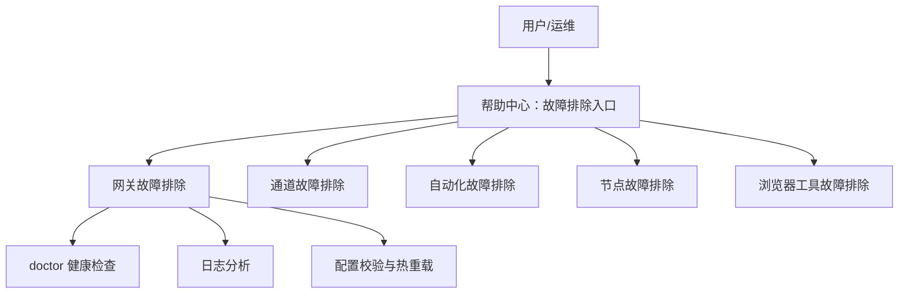
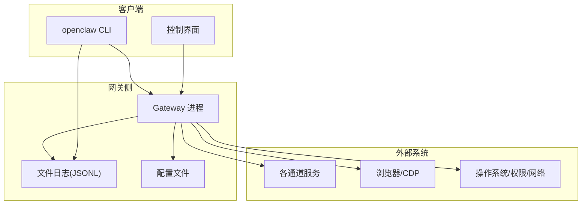
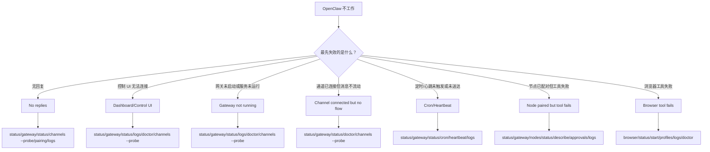
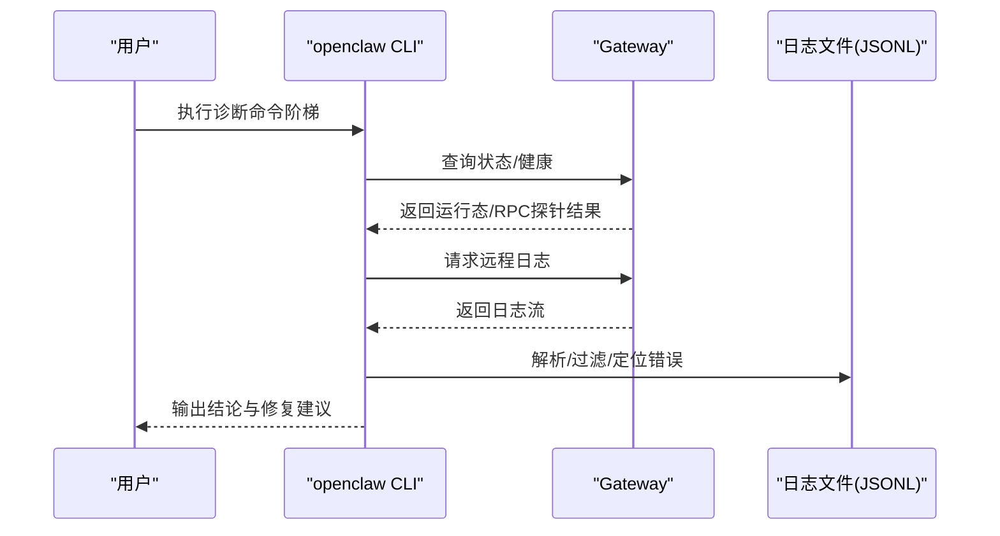
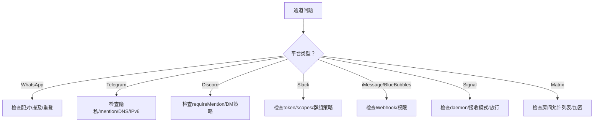
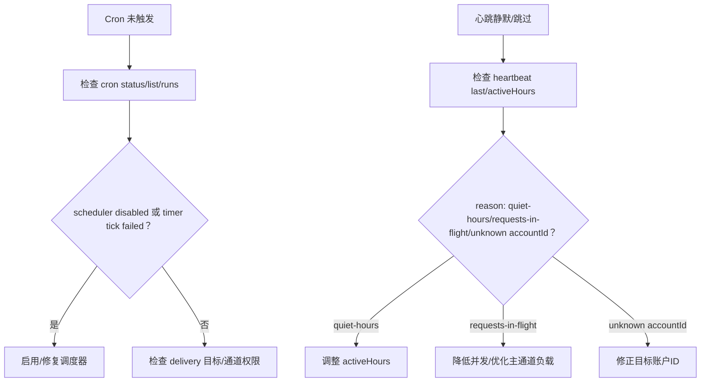
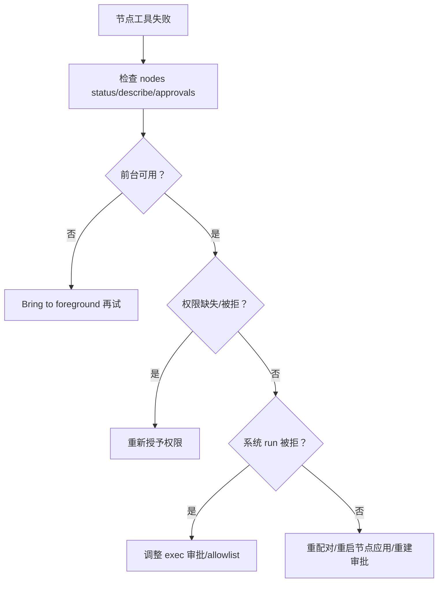
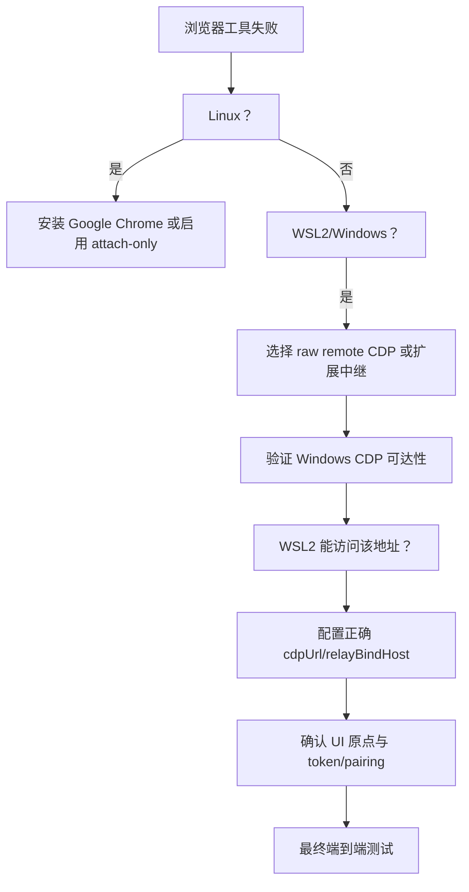
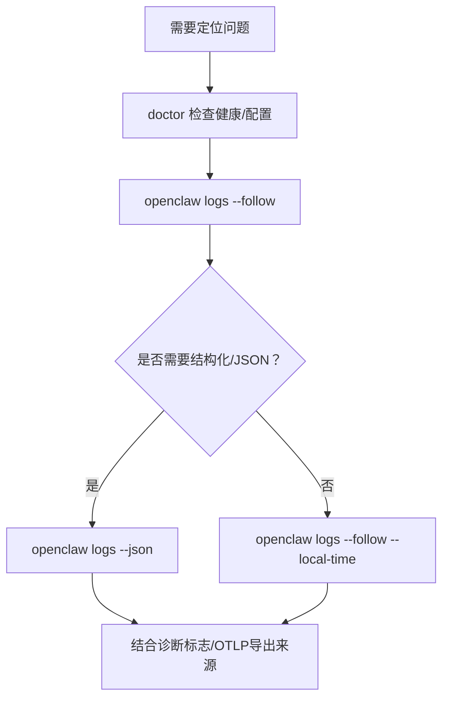
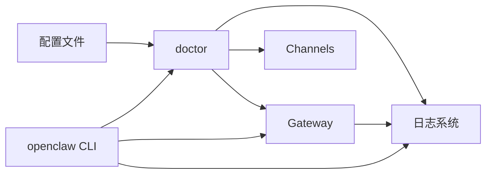

# 故障排除

<cite>
**本文引用的文件**
- [docs/help/troubleshooting.md](file://docs/help/troubleshooting.md)
- [docs/gateway/troubleshooting.md](file://docs/gateway/troubleshooting.md)
- [docs/channels/troubleshooting.md](file://docs/channels/troubleshooting.md)
- [docs/nodes/troubleshooting.md](file://docs/nodes/troubleshooting.md)
- [docs/automation/troubleshooting.md](file://docs/automation/troubleshooting.md)
- [docs/tools/browser-linux-troubleshooting.md](file://docs/tools/browser-linux-troubleshooting.md)
- [docs/tools/browser-wsl2-windows-remote-cdp-troubleshooting.md](file://docs/tools/browser-wsl2-windows-remote-cdp-troubleshooting.md)
- [docs/logging.md](file://docs/logging.md)
- [docs/cli/logs.md](file://docs/cli/logs.md)
- [docs/gateway/doctor.md](file://docs/gateway/doctor.md)
- [docs/cli/doctor.md](file://docs/cli/doctor.md)
- [docs/gateway/configuration.md](file://docs/gateway/configuration.md)
</cite>

## 目录
1. [简介](#简介)
2. [项目结构](#项目结构)
3. [核心组件](#核心组件)
4. [架构总览](#架构总览)
5. [详细组件分析](#详细组件分析)
6. [依赖关系分析](#依赖关系分析)
7. [性能考量](#性能考量)
8. [故障排除指南](#故障排除指南)
9. [结论](#结论)
10. [附录](#附录)

## 简介
本指南面向 OpenClaw 的使用者与运维人员，提供从安装到运行、从通道集成到网关服务、从客户端应用到日志分析的全链路故障排除方法。内容覆盖常见症状与根因定位、可复现的诊断命令阶梯、日志格式与关键信息识别、系统级问题排查（权限、网络、资源）、预防性维护与最佳实践，以及问题上报与跟踪流程。

## 项目结构
OpenClaw 的故障排除知识以“症状导向”的文档为主，辅以 CLI 参考与配置参考，形成“快速三板斧 + 深入 runbook”的分层结构：
- 快速三板斧：状态检查、网关健康、日志跟踪
- 深入 runbook：网关、通道、自动化、节点、浏览器等专题
- CLI 参考：doctor、logs、gateway status 等
- 配置参考：严格校验、热重载、环境变量与密钥注入

图示来源
- [docs/help/troubleshooting.md:13-299](file://docs/help/troubleshooting.md#L13-L299)
- [docs/gateway/troubleshooting.md:14-380](file://docs/gateway/troubleshooting.md#L14-L380)
- [docs/channels/troubleshooting.md:13-118](file://docs/channels/troubleshooting.md#L13-L118)
- [docs/automation/troubleshooting.md:14-123](file://docs/automation/troubleshooting.md#L14-L123)
- [docs/nodes/troubleshooting.md:13-115](file://docs/nodes/troubleshooting.md#L13-L115)
- [docs/tools/browser-linux-troubleshooting.md:9-140](file://docs/tools/browser-linux-troubleshooting.md#L9-L140)
- [docs/tools/browser-wsl2-windows-remote-cdp-troubleshooting.md:20-243](file://docs/tools/browser-wsl2-windows-remote-cdp-troubleshooting.md#L20-L243)

章节来源
- [docs/help/troubleshooting.md:13-299](file://docs/help/troubleshooting.md#L13-L299)

## 核心组件
- 网关（Gateway）：运行时、RPC 探针、绑定与鉴权、心跳与自动化调度
- 通道（Channels）：各平台接入（WhatsApp、Telegram、Discord、Slack、iMessage、Signal、Matrix 等）
- 自动化（Cron/Heartbeat）：定时任务与周期性检查
- 节点（Nodes）：移动端/桌面端设备配对、前台要求、权限与执行审批
- 浏览器工具（Browser）：CDP 启动、扩展中继、WSL2 与 Windows 远程 CDP
- 日志系统（Logging）：文件日志（JSONL）、控制台输出、CLI 尾随、OTLP 导出
- doctor 工具：健康检查、配置迁移与修复、服务与端口诊断

章节来源
- [docs/gateway/troubleshooting.md:14-380](file://docs/gateway/troubleshooting.md#L14-L380)
- [docs/channels/troubleshooting.md:13-118](file://docs/channels/troubleshooting.md#L13-L118)
- [docs/automation/troubleshooting.md:14-123](file://docs/automation/troubleshooting.md#L14-L123)
- [docs/nodes/troubleshooting.md:13-115](file://docs/nodes/troubleshooting.md#L13-L115)
- [docs/tools/browser-linux-troubleshooting.md:9-140](file://docs/tools/browser-linux-troubleshooting.md#L9-L140)
- [docs/tools/browser-wsl2-windows-remote-cdp-troubleshooting.md:20-243](file://docs/tools/browser-wsl2-windows-remote-cdp-troubleshooting.md#L20-L243)
- [docs/logging.md:10-353](file://docs/logging.md#L10-L353)
- [docs/gateway/doctor.md:9-331](file://docs/gateway/doctor.md#L9-L331)

## 架构总览
下图展示 OpenClaw 故障排除的关键交互路径：CLI 作为统一入口，doctor 提供健康检查与修复，logs 提供远程尾随日志，gateway/status 与 channels/status 提供运行态与连通性验证，配置系统负责严格校验与热重载。

图示来源
- [docs/logging.md:10-353](file://docs/logging.md#L10-L353)
- [docs/gateway/configuration.md:10-547](file://docs/gateway/configuration.md#L10-L547)
- [docs/gateway/troubleshooting.md:14-380](file://docs/gateway/troubleshooting.md#L14-L380)

## 详细组件分析

### 症状导向诊断流程（帮助中心）
帮助中心提供“首 60 秒”诊断阶梯与“决策树”，建议按顺序执行状态、网关、通道、doctor、日志等命令，快速定位问题类别与影响范围。

图示来源
- [docs/help/troubleshooting.md:68-299](file://docs/help/troubleshooting.md#L68-L299)

章节来源
- [docs/help/troubleshooting.md:13-299](file://docs/help/troubleshooting.md#L13-L299)

### 网关故障排除（深层 runbook）
- 命令阶梯：status、gateway status、logs、doctor、channels status --probe
- 关键信号：Runtime: running、RPC probe: ok、通道 ready/connected
- 常见签名：Anthropic 429、Gateway start blocked、refusing to bind、EADDRINUSE、device identity required、AUTH_TOKEN_MISMATCH、gateway connect failed
- 升级后问题：gateway.mode、gateway.remote.url、gateway.auth.mode、bind 与 auth 严格性变化、设备身份与配对状态变更

图示来源
- [docs/gateway/troubleshooting.md:14-380](file://docs/gateway/troubleshooting.md#L14-L380)
- [docs/logging.md:10-353](file://docs/logging.md#L10-L353)

章节来源
- [docs/gateway/troubleshooting.md:14-380](file://docs/gateway/troubleshooting.md#L14-L380)

### 通道集成故障排除
- 命令阶梯：status、gateway status、logs、doctor、channels status --probe
- 健康基线：Runtime: running、RPC probe: ok、通道 probe connected/ready
- 平台特定签名与修复：
  - WhatsApp：配对列表、提及策略、重登与凭据目录健康
  - Telegram：/start 后无回复、隐私模式、DNS/IPv6/代理到 api.telegram.org
  - Discord：群组忽略（requireMention）、DM 审批
  - Slack：Socket 模式、app/bot token 与 scopes、群组策略
  - iMessage/BlueBubbles：Webhook/服务器可达性、macOS 权限
  - Signal：daemon 可达性、接收模式、DM/群组放行
  - Matrix：房间允许列表、加密支持

图示来源
- [docs/channels/troubleshooting.md:13-118](file://docs/channels/troubleshooting.md#L13-L118)

章节来源
- [docs/channels/troubleshooting.md:13-118](file://docs/channels/troubleshooting.md#L13-L118)

### 自动化（Cron/Heartbeat）故障排除
- 命令阶梯：status、gateway status、cron status/list/runs、system heartbeat last、logs
- 关注点：cron 启用与 nextWake、run 历史（ok/skipped/error）、心跳跳过原因（quiet-hours/requests-in-flight/unknown accountId）
- 时间区与时钟陷阱：userTimezone、activeHours、host timezone 变更导致错峰

图示来源
- [docs/automation/troubleshooting.md:14-123](file://docs/automation/troubleshooting.md#L14-L123)

章节来源
- [docs/automation/troubleshooting.md:14-123](file://docs/automation/troubleshooting.md#L14-L123)

### 节点（Node）故障排除
- 命令阶梯：status、gateway status、logs、doctor、channels status --probe；随后 nodes status/describe/approvals
- 健康信号：节点已连接且具备所需能力、执行审批通过
- 前台要求：iOS/Android 的 canvas/screen/camera 需前台
- 权限矩阵：相机/屏幕/位置/系统 run 的平台差异与典型错误码
- 配对 vs 审批：设备配对（可否连接）与执行审批（能否执行）

图示来源
- [docs/nodes/troubleshooting.md:13-115](file://docs/nodes/troubleshooting.md#L13-L115)

章节来源
- [docs/nodes/troubleshooting.md:13-115](file://docs/nodes/troubleshooting.md#L13-L115)

### 浏览器工具故障排除（Linux 与 WSL2/Windows）
- Linux：snap Chromium 与 AppArmor 干扰导致 CDP 启动失败；推荐安装 Google Chrome 或使用 attach-only 模式
- WSL2/Windows：区分 raw remote CDP 与 Chrome 扩展中继；跨命名空间需正确设置 relayBindHost；UI 必须在安全上下文打开
- 分层验证：Windows Chrome CDP 可达性 → WSL2 可达性 → 正确的 cdpUrl → 控制 UI 原点匹配 → 扩展中继连接

图示来源
- [docs/tools/browser-linux-troubleshooting.md:9-140](file://docs/tools/browser-linux-troubleshooting.md#L9-L140)
- [docs/tools/browser-wsl2-windows-remote-cdp-troubleshooting.md:20-243](file://docs/tools/browser-wsl2-windows-remote-cdp-troubleshooting.md#L20-L243)

章节来源
- [docs/tools/browser-linux-troubleshooting.md:9-140](file://docs/tools/browser-linux-troubleshooting.md#L9-L140)
- [docs/tools/browser-wsl2-windows-remote-cdp-troubleshooting.md:20-243](file://docs/tools/browser-wsl2-windows-remote-cdp-troubleshooting.md#L20-L243)

### 日志分析方法与工具
- 日志位置：默认滚动文件（JSONL），可通过配置覆盖
- 读取方式：CLI 远程 tail（支持 pretty/compact/json/plain/no-color）、控制台输出、通道专用日志
- 日志格式：每行 JSON 对象，CLI/控制台解析为结构化输出
- 配置项：级别、控制台样式、敏感信息脱敏与正则脱敏
- 诊断事件：模型用量、webhook/消息队列/会话状态、OTLP 导出指标与追踪
- 建议：先 doctor，再 logs --follow，必要时提升日志级别或开启诊断标志

图示来源
- [docs/logging.md:10-353](file://docs/logging.md#L10-L353)
- [docs/cli/logs.md:9-29](file://docs/cli/logs.md#L9-L29)

章节来源
- [docs/logging.md:10-353](file://docs/logging.md#L10-L353)
- [docs/cli/logs.md:9-29](file://docs/cli/logs.md#L9-L29)

## 依赖关系分析
- doctor 与配置：doctor 在启动前进行配置归一化、迁移与修复，避免因未知键/非法值导致网关拒绝启动
- doctor 与网关：doctor 检测服务安装、端口冲突、令牌漂移、系统服务配置，必要时给出修复建议
- doctor 与通道：健康检查阶段探测通道状态，输出警告与修复建议
- doctor 与日志：当网关不可达时，引导使用 doctor 与 logs

图示来源
- [docs/gateway/doctor.md:59-331](file://docs/gateway/doctor.md#L59-L331)
- [docs/gateway/configuration.md:61-73](file://docs/gateway/configuration.md#L61-L73)
- [docs/logging.md:347-353](file://docs/logging.md#L347-L353)

章节来源
- [docs/gateway/doctor.md:59-331](file://docs/gateway/doctor.md#L59-L331)
- [docs/gateway/configuration.md:61-73](file://docs/gateway/configuration.md#L61-L73)
- [docs/logging.md:347-353](file://docs/logging.md#L347-L353)

## 性能考量
- 日志级别与导出：debug/trace 提升细节但增加 IO；OTLP 导出量大时应配合采样与过滤
- 队列与会话：关注队列深度、等待时间、会话卡滞；必要时降低并发或优化处理链
- 模型用量：长上下文请求可能触发 429，需禁用长上下文或启用额外用量
- 浏览器 CDP：headless/no-sandbox 在部分 Linux 发行版有效，但需注意安全边界

## 故障排除指南

### 通用诊断步骤（首 60 秒）
- 执行命令阶梯：status、status --all、gateway probe、gateway status、doctor、channels status --probe、logs --follow
- 观察健康信号：Runtime: running、RPC probe: ok、通道 ready/connected、日志稳定无重复致命错误
- 记录错误关键字：device identity required、AUTH_TOKEN_MISMATCH、gateway connect failed、EADDRINUSE、429、heartbeat skipped

章节来源
- [docs/help/troubleshooting.md:13-36](file://docs/help/troubleshooting.md#L13-L36)

### 安装与配置错误
- 配置严格校验：未知键/类型错误会导致网关拒绝启动；doctor 会指出具体问题并提供修复
- 热重载行为：大部分字段无需重启即时生效；网关服务器与基础设施相关变更需重启
- 环境变量与密钥：支持 env 注入、$include、SecretRef；注意替换规则与不可覆盖性

章节来源
- [docs/gateway/configuration.md:61-73](file://docs/gateway/configuration.md#L61-L73)
- [docs/gateway/configuration.md:349-387](file://docs/gateway/configuration.md#L349-L387)
- [docs/gateway/configuration.md:449-539](file://docs/gateway/configuration.md#L449-L539)

### 运行时故障（网关）
- 服务未运行：检查 gateway.mode、bind 与 auth 配置、端口占用；doctor 提供端口冲突与启动阻断提示
- 设备鉴权：nonce/signature 错误需更新客户端完成挑战-响应流程；必要时旋转设备令牌
- 升级后异常：核对 gateway.mode/remote.url/auth.mode；bind 与 auth 严格性变化；设备身份与配对状态

章节来源
- [docs/gateway/troubleshooting.md:152-181](file://docs/gateway/troubleshooting.md#L152-L181)
- [docs/gateway/troubleshooting.md:91-151](file://docs/gateway/troubleshooting.md#L91-L151)
- [docs/gateway/troubleshooting.md:307-380](file://docs/gateway/troubleshooting.md#L307-L380)

### 渠道集成故障
- 连接成功但无消息：检查配对/允许列表/提及策略；常见签名如 mention required、pairing/pending、missing_scope/Forbidden
- 平台专项：WhatsApp/Telegram/Discord/Slack/iMessage/Signal/Matrix 各有特定检查清单与修复建议

章节来源
- [docs/gateway/troubleshooting.md:182-212](file://docs/gateway/troubleshooting.md#L182-L212)
- [docs/channels/troubleshooting.md:13-118](file://docs/channels/troubleshooting.md#L13-L118)

### 自动化与心跳
- 未触发：检查 cron 启用与 nextWake；若调度器 tick 失败，查看周围堆栈/日志上下文
- 未送达：确认 delivery 目标与通道权限；心跳可能因 quiet-hours/requests-in-flight 被推迟

章节来源
- [docs/automation/troubleshooting.md:14-123](file://docs/automation/troubleshooting.md#L14-L123)

### 客户端应用（节点与浏览器）
- 节点：前台不可用、权限缺失、系统 run 被拒、allowlist miss；按“前台→权限→审批”顺序恢复
- 浏览器：Linux snap Chromium 干扰；WSL2/Windows 跨主机 CDP 与扩展中继拓扑需分层验证

章节来源
- [docs/nodes/troubleshooting.md:13-115](file://docs/nodes/troubleshooting.md#L13-L115)
- [docs/tools/browser-linux-troubleshooting.md:9-140](file://docs/tools/browser-linux-troubleshooting.md#L9-L140)
- [docs/tools/browser-wsl2-windows-remote-cdp-troubleshooting.md:20-243](file://docs/tools/browser-wsl2-windows-remote-cdp-troubleshooting.md#L20-L243)

### 日志分析方法与工具
- 使用 openclaw logs --follow 获取实时日志；--json 便于工具化处理
- 结合 doctor 与 doctor --repair 快速修复配置与服务问题
- 通过诊断标志与 OTLP 导出增强可观测性

章节来源
- [docs/cli/logs.md:9-29](file://docs/cli/logs.md#L9-L29)
- [docs/logging.md:10-353](file://docs/logging.md#L10-L353)
- [docs/gateway/doctor.md:14-45](file://docs/gateway/doctor.md#L14-L45)

### 系统级问题排查
- 权限：配置文件权限（建议 600）、状态目录写权限、云同步/SD 卡路径的 I/O 风险
- 网络：bind 非 loopback 地址需配置 auth；WSL2/Windows CDP 端口可达性；allowedOrigins 与安全上下文
- 资源：端口冲突（EADDRINUSE）、服务安装残留、systemd linger、版本管理器路径导致的依赖问题

章节来源
- [docs/gateway/doctor.md:181-331](file://docs/gateway/doctor.md#L181-L331)
- [docs/gateway/configuration.md:61-73](file://docs/gateway/configuration.md#L61-L73)
- [docs/tools/browser-wsl2-windows-remote-cdp-troubleshooting.md:79-243](file://docs/tools/browser-wsl2-windows-remote-cdp-troubleshooting.md#L79-L243)

### 预防性维护与最佳实践
- 定期运行 doctor，保持配置与服务状态健康
- 使用配置热重载减少停机；对网关服务器与基础设施变更采用显式重启
- 启用诊断标志与 OTLP 导出，建立持续可观测体系
- 通道与自动化配置遵循最小权限原则，定期审计 allowlist 与 scopes

章节来源
- [docs/gateway/doctor.md:59-84](file://docs/gateway/doctor.md#L59-L84)
- [docs/gateway/configuration.md:349-387](file://docs/gateway/configuration.md#L349-L387)
- [docs/logging.md:142-353](file://docs/logging.md#L142-L353)

### 问题上报与跟踪
- 收集信息：openclaw status --all、gateway status、logs --follow --json、doctor 输出、doctor --fix 前后对比
- 上报渠道：参考仓库的 issue 模板与社区指引，附带上述日志与配置片段（脱敏敏感信息）

## 结论
OpenClaw 的故障排除以“症状导向 + 命令阶梯 + 结构化日志”为核心，doctor 与配置系统提供强健的自愈与诊断能力。遵循本文档的分层方法，可快速定位并修复安装、配置、运行时、通道、自动化、节点与浏览器等场景下的常见问题，并通过日志与诊断事件构建可持续的可观测体系。

## 附录

### 常用命令速查
- openclaw status / --all
- openclaw gateway status / probe
- openclaw doctor
- openclaw channels status --probe
- openclaw logs --follow / --json
- openclaw cron status / list / runs
- openclaw system heartbeat last
- openclaw nodes status / describe / approvals
- openclaw browser status / start / profiles

章节来源
- [docs/help/troubleshooting.md:17-299](file://docs/help/troubleshooting.md#L17-L299)
- [docs/gateway/troubleshooting.md:14-380](file://docs/gateway/troubleshooting.md#L14-L380)
- [docs/automation/troubleshooting.md:14-123](file://docs/automation/troubleshooting.md#L14-L123)
- [docs/nodes/troubleshooting.md:13-115](file://docs/nodes/troubleshooting.md#L13-L115)
- [docs/tools/browser-linux-troubleshooting.md:9-140](file://docs/tools/browser-linux-troubleshooting.md#L9-L140)
- [docs/tools/browser-wsl2-windows-remote-cdp-troubleshooting.md:20-243](file://docs/tools/browser-wsl2-windows-remote-cdp-troubleshooting.md#L20-L243)
- [docs/logging.md:10-353](file://docs/logging.md#L10-L353)
- [docs/gateway/doctor.md:14-45](file://docs/gateway/doctor.md#L14-L45)