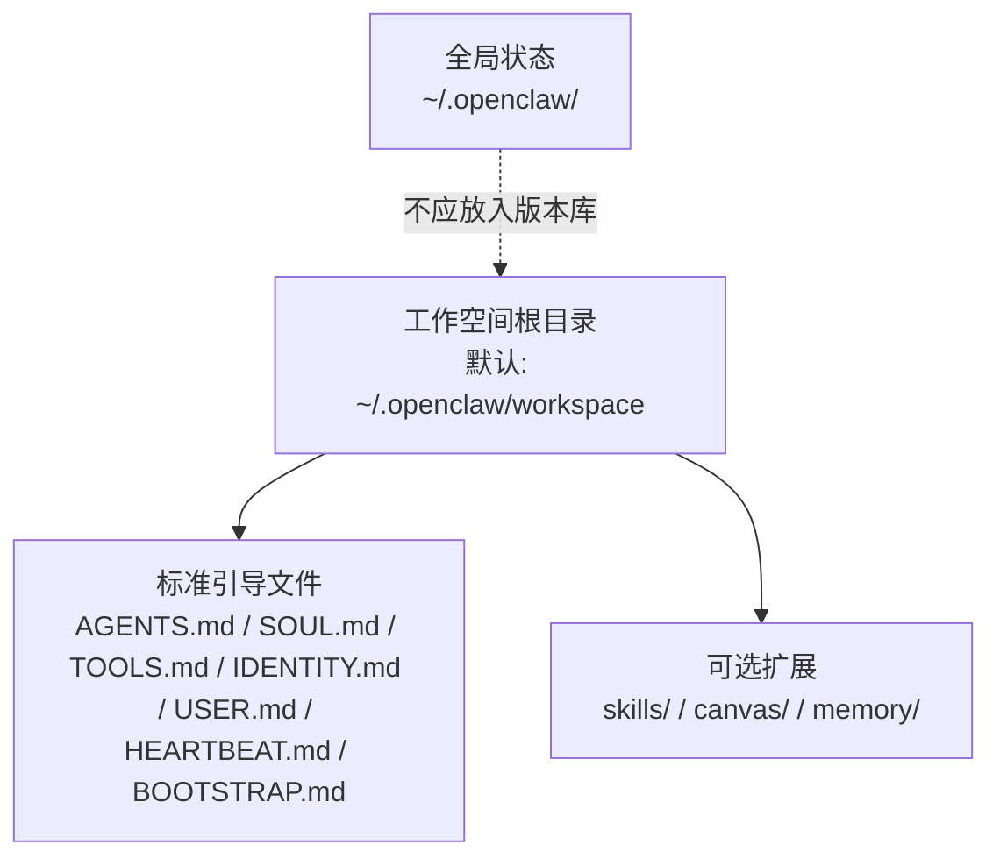
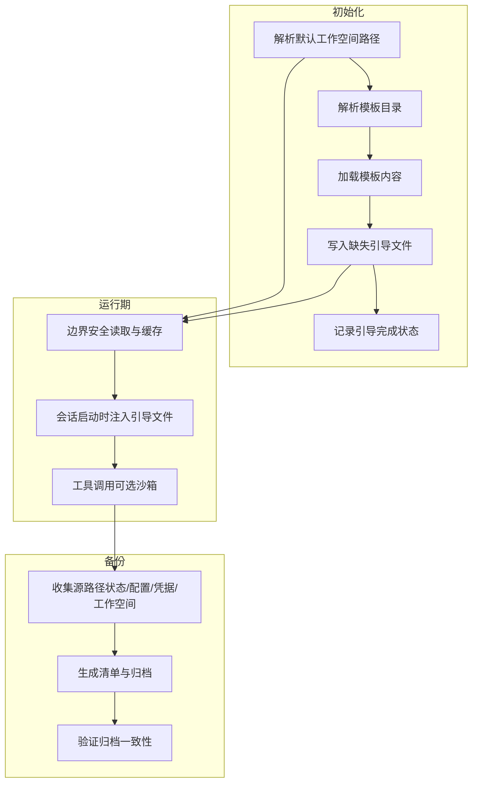
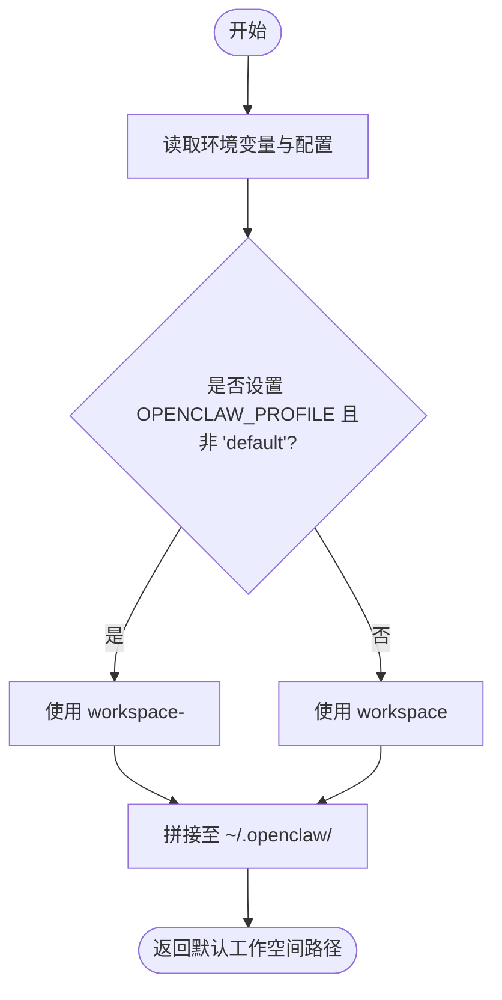
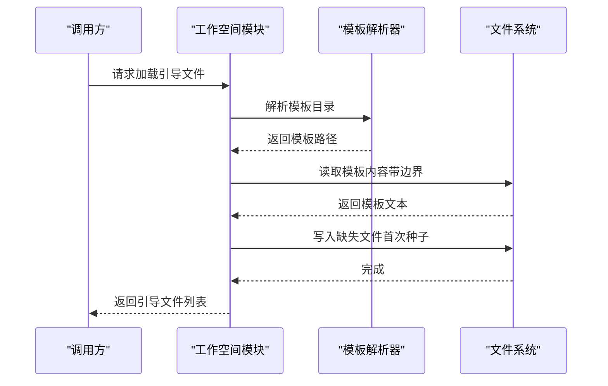
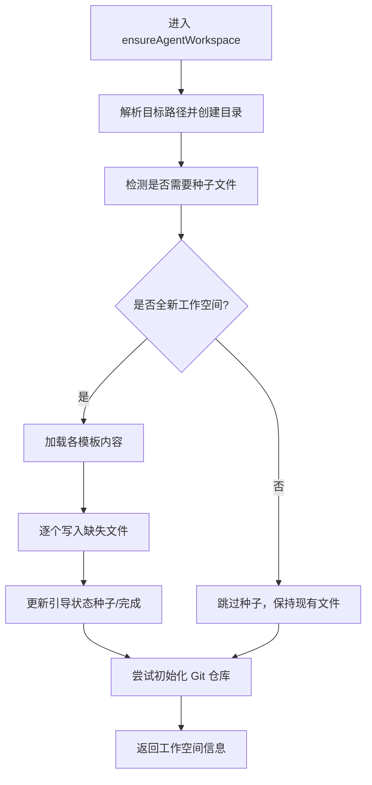
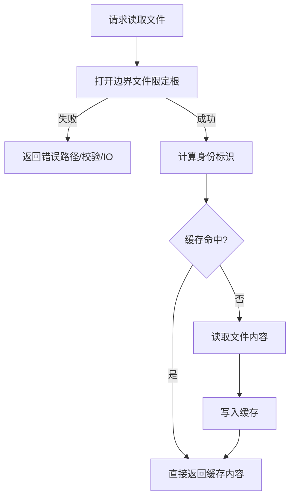
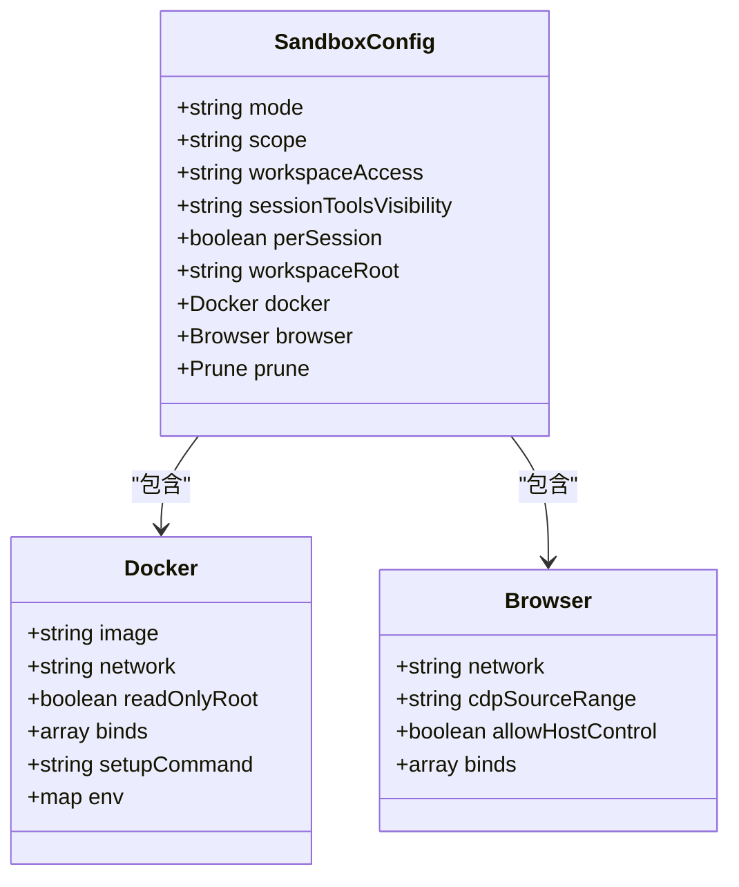
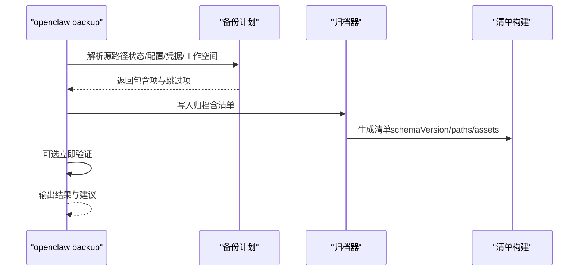
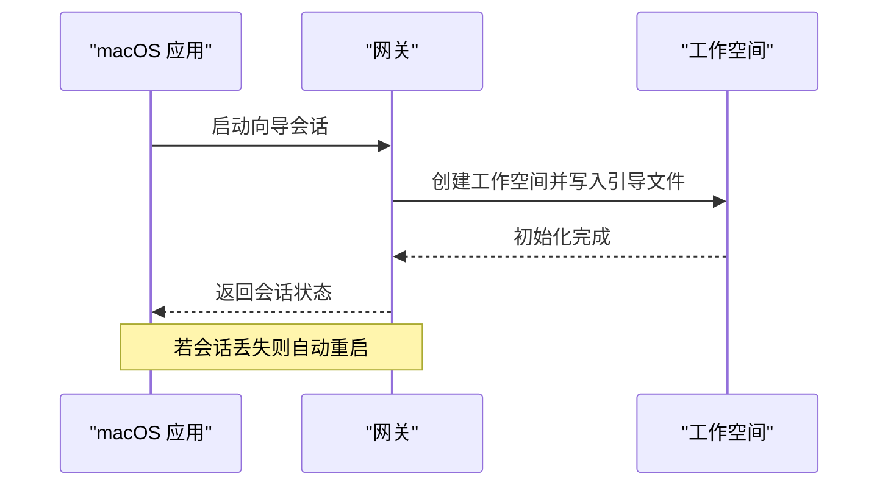
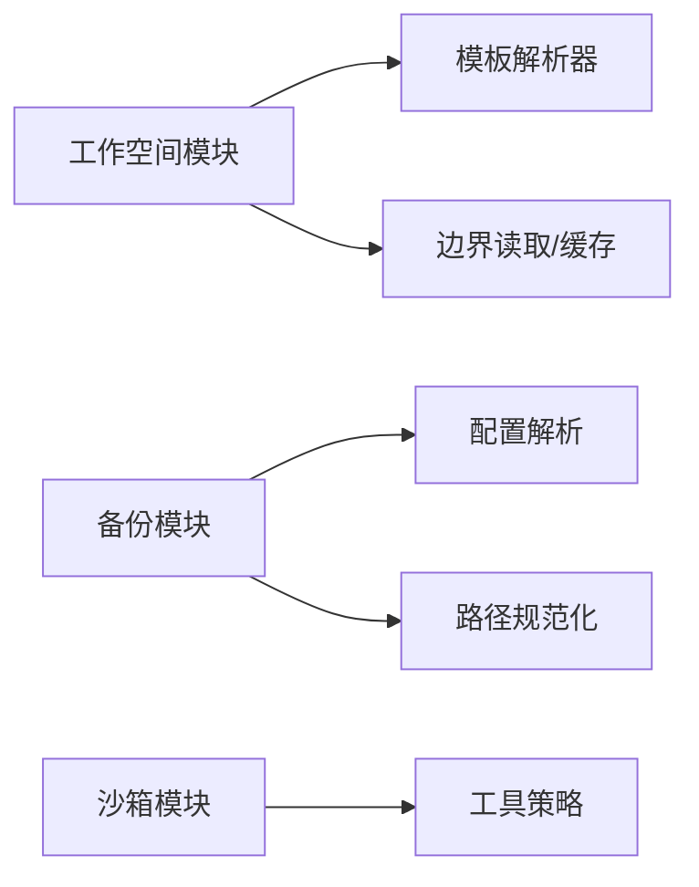

# 代理工作空间

<cite>
**本文引用的文件**
- [agent-workspace.md](file://docs/concepts/agent-workspace.md)
- [workspace.ts](file://src/agents/workspace.ts)
- [workspace-templates.ts](file://src/agents/workspace-templates.ts)
- [SOUL.md 模板](file://docs/reference/templates/SOUL.md)
- [TOOLS.md 模板](file://docs/reference/templates/TOOLS.md)
- [HEARTBEAT.md 模板](file://docs/reference/templates/HEARTBEAT.md)
- [AGENTS.md](file://AGENTS.md)
- [sandboxing.md](file://docs/gateway/sandboxing.md)
- [backup.md](file://docs/cli/backup.md)
- [backup-shared.ts](file://src/commands/backup-shared.ts)
- [backup-create.ts](file://src/infra/backup-create.ts)
- [AgentWorkspace.swift](file://apps/macos/Sources/OpenClaw/AgentWorkspace.swift)
- [onboarding.md](file://docs/start/onboarding.md)
</cite>

## 目录
1. [简介](#简介)
2. [项目结构](#项目结构)
3. [核心组件](#核心组件)
4. [架构总览](#架构总览)
5. [详细组件分析](#详细组件分析)
6. [依赖关系分析](#依赖关系分析)
7. [性能考量](#性能考量)
8. [故障排查指南](#故障排查指南)
9. [结论](#结论)
10. [附录](#附录)

## 简介
本文件系统化阐述 OpenClaw 代理工作空间的设计理念、文件布局、初始化流程、安全模型与运维实践。工作空间是代理的“家”，承载其运行时上下文、记忆与技能，是文件工具与会话交互的默认工作目录。它与全局配置区分开来，具备独立的文件系统边界与可选的沙箱隔离能力。

## 项目结构
- 工作空间默认位置与覆盖方式：可通过环境变量与配置文件进行定位与切换。
- 标准引导文件集合：包含 AGENTS.md、SOUL.md、TOOLS.md、IDENTITY.md、USER.md、HEARTBEAT.md、BOOTSTRAP.md 等。
- 可选扩展：skills/、canvas/、每日记忆目录等。
- 与全局状态分离：会话、凭据、配置等位于 ~/.openclaw/，不应纳入工作空间版本控制。

**章节来源**
- [agent-workspace.md:24-62](file://docs/concepts/agent-workspace.md#L24-L62)
- [agent-workspace.md:64-137](file://docs/concepts/agent-workspace.md#L64-L137)

## 核心组件
- 默认工作空间解析器：根据环境与配置解析默认路径。
- 引导文件加载与校验：按约定读取并缓存，支持边界检查与大小限制。
- 模板解析与注入：从包内或本地模板目录加载默认内容。
- 初始化与种子：在全新工作空间中写入缺失的引导文件，并维护引导完成状态。
- 备份与恢复：提供 CLI 备份命令与清单生成，支持仅配置备份与跳过工作空间。

**章节来源**
- [workspace.ts:12-24](file://src/agents/workspace.ts#L12-L24)
- [workspace.ts:48-88](file://src/agents/workspace.ts#L48-L88)
- [workspace.ts:104-130](file://src/agents/workspace.ts#L104-L130)
- [workspace.ts:321-459](file://src/agents/workspace.ts#L321-L459)
- [workspace-templates.ts:14-54](file://src/agents/workspace-templates.ts#L14-L54)
- [backup-shared.ts:13-38](file://src/commands/backup-shared.ts#L13-L38)
- [backup-create.ts:190-231](file://src/infra/backup-create.ts#L190-L231)

## 架构总览
工作空间由“路径解析—模板加载—引导文件种子—运行期读取—可选沙箱—备份归档”构成闭环。初始化阶段确保关键文件存在；运行期通过边界读取与缓存提升安全性与性能；沙箱模式下进一步限制工具执行范围；备份子系统提供可验证的归档与恢复能力。

**图表来源**
- [workspace.ts:12-24](file://src/agents/workspace.ts#L12-L24)
- [workspace.ts:321-459](file://src/agents/workspace.ts#L321-L459)
- [workspace.ts:498-555](file://src/agents/workspace.ts#L498-L555)
- [sandboxing.md:39-69](file://docs/gateway/sandboxing.md#L39-L69)
- [backup-shared.ts:106-138](file://src/commands/backup-shared.ts#L106-L138)
- [backup-create.ts:190-231](file://src/infra/backup-create.ts#L190-L231)

**章节来源**
- [workspace.ts:321-459](file://src/agents/workspace.ts#L321-L459)
- [sandboxing.md:39-69](file://docs/gateway/sandboxing.md#L39-L69)
- [backup-shared.ts:106-138](file://src/commands/backup-shared.ts#L106-L138)

## 详细组件分析

### 组件一：工作空间路径与默认位置
- 默认路径规则：基于用户主目录与配置文件中的 profile 设置，支持多配置文件场景。
- 覆盖方式：可在配置文件中直接指定工作空间路径，便于多环境或多用户隔离。

**图表来源**
- [workspace.ts:12-24](file://src/agents/workspace.ts#L12-L24)

**章节来源**
- [workspace.ts:12-24](file://src/agents/workspace.ts#L12-L24)
- [agent-workspace.md:24-37](file://docs/concepts/agent-workspace.md#L24-L37)

### 组件二：引导文件与模板系统
- 标准引导文件清单：AGENTS.md、SOUL.md、TOOLS.md、IDENTITY.md、USER.md、HEARTBEAT.md、BOOTSTRAP.md。
- 模板来源：优先从包内模板目录加载，回退到本地或内置回退路径。
- 加载与缓存：带边界检查与最大字节限制，避免越界与过大文件注入。
- 注入策略：运行期按需读取，缺失文件以“缺失标记”提示，避免中断会话。

**图表来源**
- [workspace.ts:498-555](file://src/agents/workspace.ts#L498-L555)
- [workspace.ts:104-130](file://src/agents/workspace.ts#L104-L130)
- [workspace-templates.ts:14-54](file://src/agents/workspace-templates.ts#L14-L54)

**章节来源**
- [workspace.ts:498-555](file://src/agents/workspace.ts#L498-L555)
- [workspace.ts:104-130](file://src/agents/workspace.ts#L104-L130)
- [workspace-templates.ts:14-54](file://src/agents/workspace-templates.ts#L14-L54)
- [agent-workspace.md:64-124](file://docs/concepts/agent-workspace.md#L64-L124)

### 组件三：初始化与种子流程
- 全新工作空间判定：若所有引导文件与部分用户内容均不存在，则视为全新。
- 种子写入：按模板写入缺失文件；对 BOOTSTRAP.md 的处理遵循引导完成状态机。
- 引导完成状态：通过状态文件记录种子时间与完成时间，避免重复种子。
- Git 初始化：对全新工作空间尝试初始化仓库，便于后续私有备份。

**图表来源**
- [workspace.ts:321-459](file://src/agents/workspace.ts#L321-L459)

**章节来源**
- [workspace.ts:321-459](file://src/agents/workspace.ts#L321-L459)

### 组件四：运行期读取与安全边界
- 边界安全读取：限定文件必须位于工作空间根下，防止越界访问。
- 缓存策略：基于 inode/dev/大小/修改时间组合的身份标识，避免重复 IO 与陈旧读取。
- 前言剥离：自动剥离 Front Matter，仅保留正文内容。
- 会话注入：按会话键过滤最小允许集，减少不必要的文件注入。

**图表来源**
- [workspace.ts:48-88](file://src/agents/workspace.ts#L48-L88)
- [workspace.ts:90-102](file://src/agents/workspace.ts#L90-L102)
- [workspace.ts:565-573](file://src/agents/workspace.ts#L565-L573)

**章节来源**
- [workspace.ts:48-88](file://src/agents/workspace.ts#L48-L88)
- [workspace.ts:90-102](file://src/agents/workspace.ts#L90-L102)
- [workspace.ts:565-573](file://src/agents/workspace.ts#L565-L573)

### 组件五：沙箱与访问控制
- 模式与作用域：支持关闭、仅非主会话、全部三种模式；作用域支持会话级、代理级、共享容器。
- 工作空间访问：支持无访问、只读挂载到 /agent、读写挂载到 /workspace。
- 浏览器沙箱：可选的沙箱浏览器容器，默认网络受限，支持绑定挂载与启动参数。
- 工具策略：沙箱前仍受工具策略约束；提升通道为显式豁免（如 elevated）。

**图表来源**
- [sandboxing.md:39-69](file://docs/gateway/sandboxing.md#L39-L69)
- [sandboxing.md:71-116](file://docs/gateway/sandboxing.md#L71-L116)

**章节来源**
- [sandboxing.md:39-69](file://docs/gateway/sandboxing.md#L39-L69)
- [sandboxing.md:71-116](file://docs/gateway/sandboxing.md#L71-L116)

### 组件六：备份与恢复
- 备份范围：状态目录、活动配置、凭据目录、工作空间（可选）。
- 清单与验证：归档内嵌清单，记录来源路径与归档布局；支持立即验证与独立验证。
- 配置异常处理：当配置无效但启用工作空间备份时，提供仅配置备份与仅配置跳过工作空间备份两种路径。
- 最小化归档：通过仅配置备份或禁用工作空间备份降低体积与耗时。

**图表来源**
- [backup-shared.ts:106-138](file://src/commands/backup-shared.ts#L106-L138)
- [backup-create.ts:190-231](file://src/infra/backup-create.ts#L190-L231)
- [backup.md:34-77](file://docs/cli/backup.md#L34-L77)

**章节来源**
- [backup-shared.ts:106-138](file://src/commands/backup-shared.ts#L106-L138)
- [backup-create.ts:190-231](file://src/infra/backup-create.ts#L190-L231)
- [backup.md:34-77](file://docs/cli/backup.md#L34-L77)

### 组件七：平台特定初始化（macOS）
- macOS 应用侧的引导逻辑：在首次运行时创建工作空间并写入引导文件，确保首次会话可用。
- 重启与会话丢失处理：在向导会话丢失时自动重启并重试，保障首次体验连续性。

**图表来源**
- [AgentWorkspace.swift:94-113](file://apps/macos/Sources/OpenClaw/AgentWorkspace.swift#L94-L113)

**章节来源**
- [AgentWorkspace.swift:94-113](file://apps/macos/Sources/OpenClaw/AgentWorkspace.swift#L94-L113)

## 依赖关系分析
- 模块耦合
  - 工作空间模块依赖模板解析器与边界读取工具。
  - 备份模块依赖配置解析与路径规范化工具。
  - 沙箱模块与工具策略共同决定执行边界。
- 外部依赖
  - Docker 与浏览器容器用于沙箱执行。
  - Git 用于工作空间私有备份。

**图表来源**
- [workspace.ts:104-130](file://src/agents/workspace.ts#L104-L130)
- [workspace.ts:48-88](file://src/agents/workspace.ts#L48-L88)
- [backup-shared.ts:106-138](file://src/commands/backup-shared.ts#L106-L138)
- [sandboxing.md:218-226](file://docs/gateway/sandboxing.md#L218-L226)

**章节来源**
- [workspace.ts:104-130](file://src/agents/workspace.ts#L104-L130)
- [workspace.ts:48-88](file://src/agents/workspace.ts#L48-L88)
- [backup-shared.ts:106-138](file://src/commands/backup-shared.ts#L106-L138)
- [sandboxing.md:218-226](file://docs/gateway/sandboxing.md#L218-L226)

## 性能考量
- 文件读取优化：边界安全读取与缓存显著降低重复 IO 与越界风险。
- 模板加载：模板内容缓存避免重复磁盘访问。
- 备份体积控制：通过仅配置备份或禁用工作空间备份降低归档体积与压缩时间。
- 沙箱选择：合理设置模式与作用域，平衡隔离强度与性能开销。

## 故障排查指南
- 引导文件缺失：运行期会注入“缺失文件”标记，确认文件是否存在或是否被越界读取阻止。
- 路径越界：边界读取会拒绝超出工作空间根的路径，检查相对路径与符号链接。
- 沙箱网络/挂载：若工具无法联网或访问宿主机文件，检查网络模式与绑定挂载配置。
- 备份验证失败：使用验证命令核对清单与归档一致性，排除路径穿越与重复条目。
- 首次体验问题（macOS）：若向导会话丢失，应用会自动重启并重试，确认权限与网关状态。

**章节来源**
- [workspace.ts:48-88](file://src/agents/workspace.ts#L48-L88)
- [sandboxing.md:185-198](file://docs/gateway/sandboxing.md#L185-L198)
- [backup.md:23-33](file://docs/cli/backup.md#L23-L33)
- [AgentWorkspace.swift:177-192](file://apps/macos/Sources/OpenClaw/AgentWorkspace.swift#L177-L192)

## 结论
工作空间是 OpenClaw 代理运行的核心载体，通过标准化的引导文件、严格的边界读取与可选的沙箱隔离，实现了可审计、可备份、可迁移的个人代理环境。结合私有 Git 备份与 CLI 备份工具，能够在不牺牲隐私的前提下实现高效运维与快速恢复。

## 附录

### 目录结构与文件职责
- AGENTS.md：代理操作守则与会话起始指导。
- SOUL.md：人格、语调与边界，每会话加载。
- USER.md：用户身份与称谓，每会话加载。
- IDENTITY.md：代理名称、气质与表情，首次种子生成。
- TOOLS.md：本地工具与约定，仅作参考。
- HEARTBEAT.md：可选的心跳清单，简短为佳。
- BOOTSTRAP.md：一次性首启仪式，完成后删除。
- MEMORY.md：可选长期记忆，推荐仅在私有会话加载。
- skills/：工作空间专属技能，覆盖内置同名技能。
- canvas/：节点显示的 UI 文件（例如 canvas/index.html）。

**章节来源**
- [agent-workspace.md:64-137](file://docs/concepts/agent-workspace.md#L64-L137)

### 初始化与模板填充
- 模板来源：包内 docs/reference/templates 或本地回退目录。
- 填充策略：仅在缺失时写入，避免覆盖已有内容；全新工作空间自动初始化 Git 仓库。
- 首次体验：macOS 应用侧在首次运行时创建工作空间并写入引导文件。

**章节来源**
- [workspace-templates.ts:14-54](file://src/agents/workspace-templates.ts#L14-L54)
- [workspace.ts:321-459](file://src/agents/workspace.ts#L321-L459)
- [AgentWorkspace.swift:94-113](file://apps/macos/Sources/OpenClaw/AgentWorkspace.swift#L94-L113)

### 安全模型与最佳实践
- 沙箱模式：通过模式、作用域与工作空间访问策略限制工具执行范围。
- 工具策略：沙箱前仍受工具策略约束，必要时使用显式豁免。
- 数据保护：工作空间作为私有记忆，建议放入私有 Git 仓库；避免在工作空间存放敏感凭据。
- 权限控制：macOS 首次体验中明确请求 TCC 权限，确保最小授权。

**章节来源**
- [sandboxing.md:39-69](file://docs/gateway/sandboxing.md#L39-L69)
- [sandboxing.md:218-226](file://docs/gateway/sandboxing.md#L218-L226)
- [agent-workspace.md:202-212](file://docs/concepts/agent-workspace.md#L202-L212)
- [onboarding.md:33-39](file://docs/start/onboarding.md#L33-L39)

### 备份、迁移与故障恢复
- 私有 Git 备份：初始化仓库后添加私有远程，定期推送。
- CLI 备份：创建包含状态、配置、凭据与可选工作空间的归档，支持立即验证。
- 迁移步骤：在新机器克隆仓库，设置工作空间路径并重新种子缺失文件。
- 故障恢复：若配置损坏但仍需备份，可使用仅配置备份或跳过工作空间备份。

**章节来源**
- [agent-workspace.md:138-230](file://docs/concepts/agent-workspace.md#L138-L230)
- [backup.md:13-21](file://docs/cli/backup.md#L13-L21)
- [backup.md:49-62](file://docs/cli/backup.md#L49-L62)