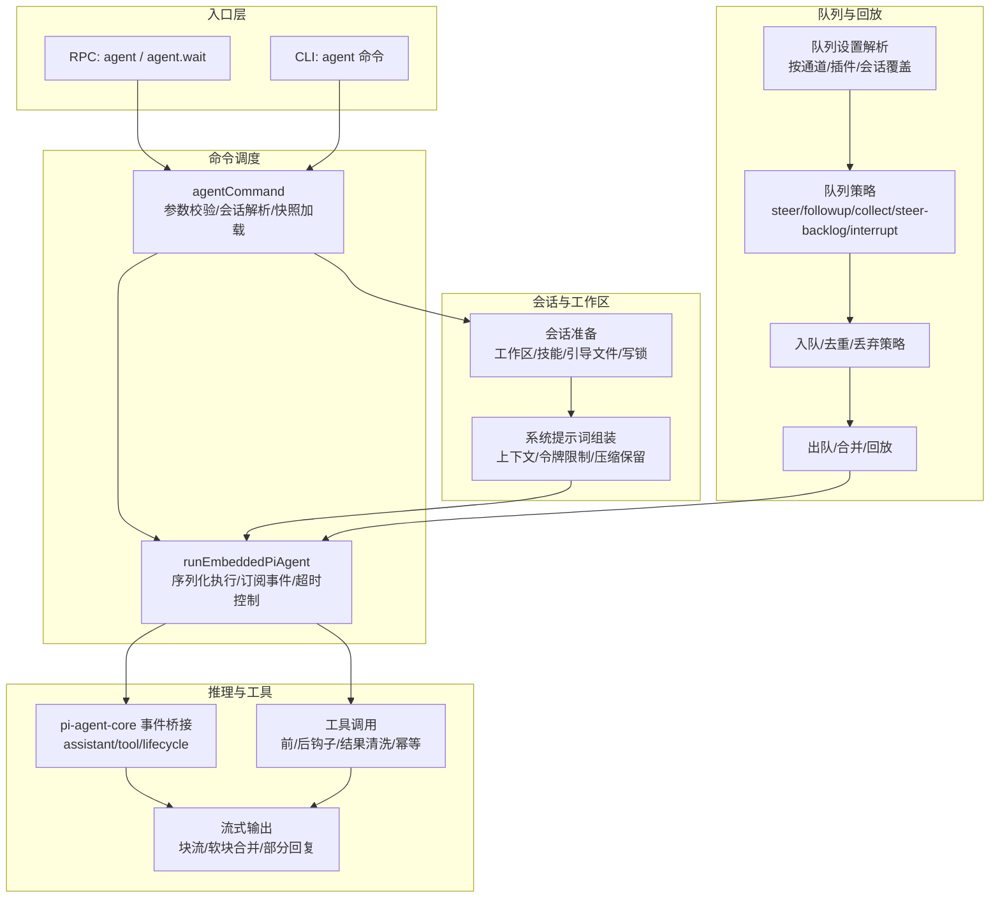
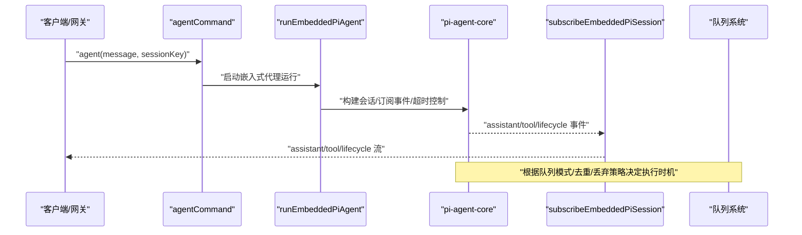
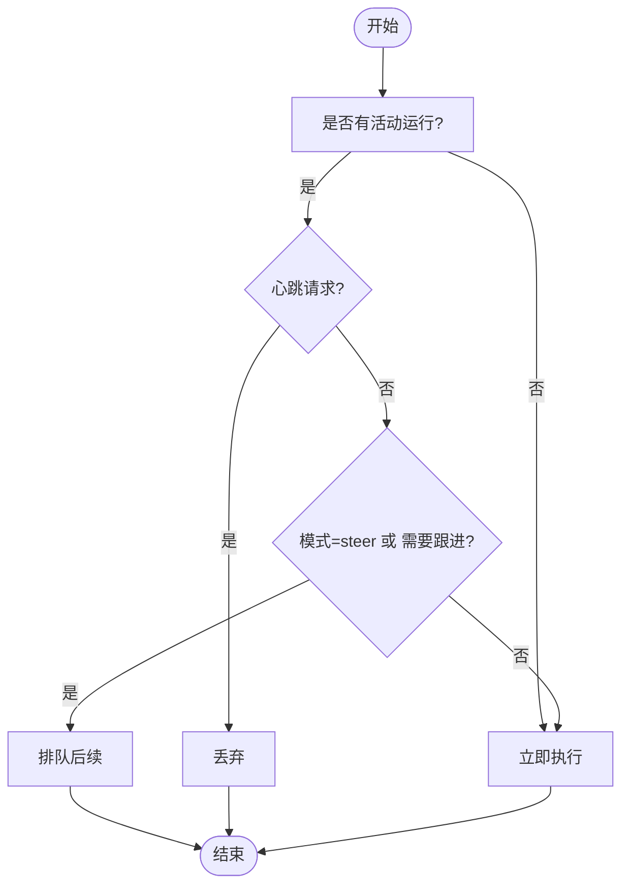
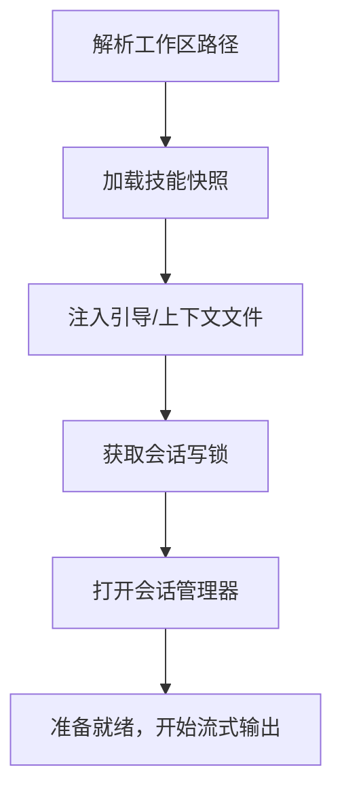
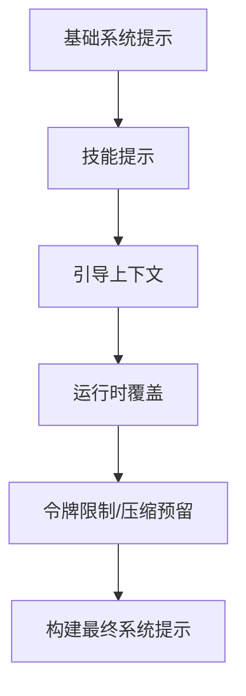
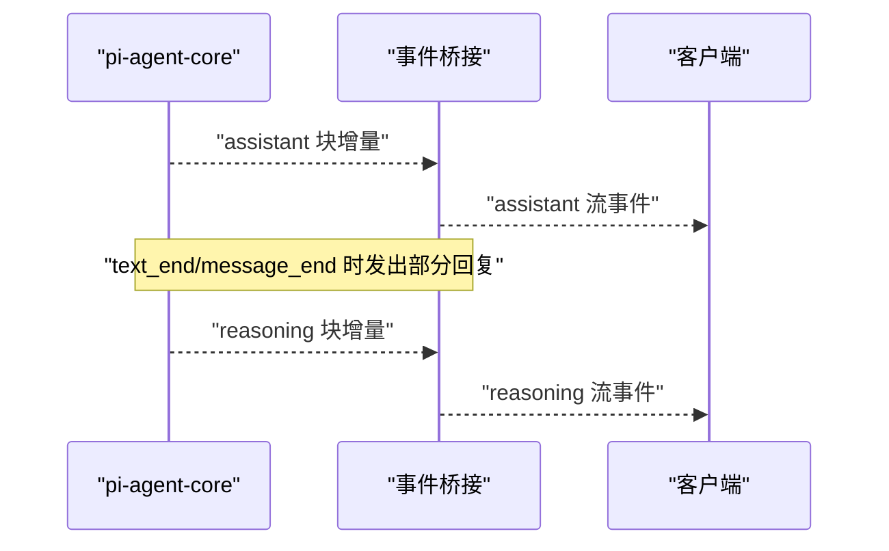
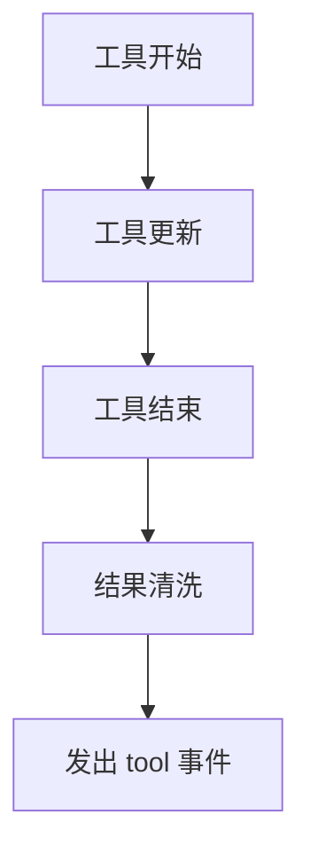
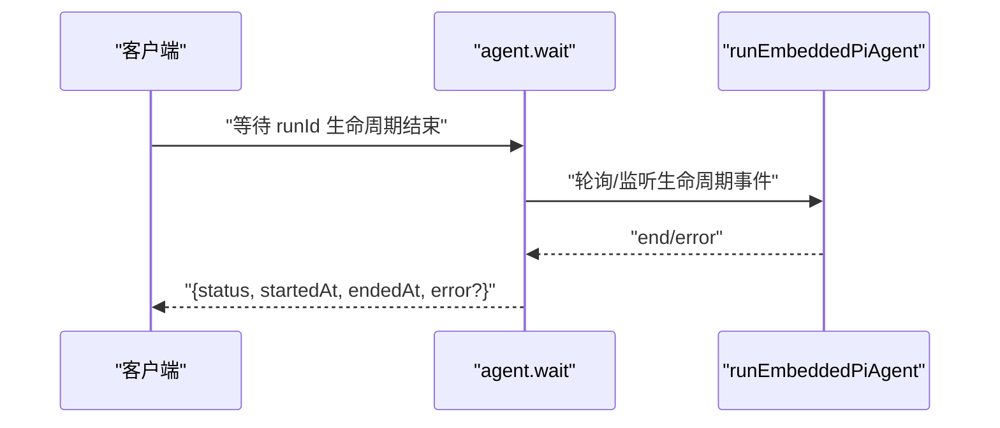
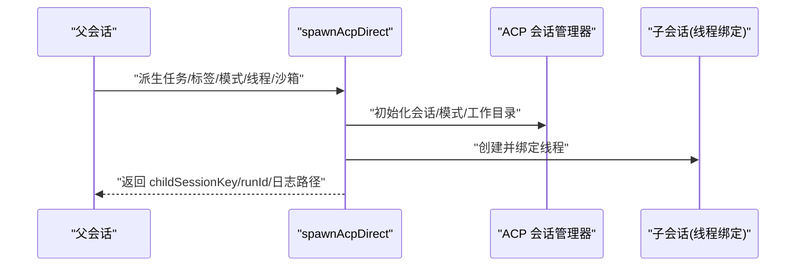
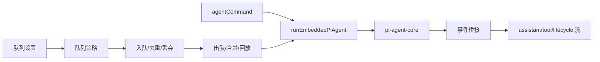

# 代理循环

<cite>
**本文引用的文件**
- [docs/concepts/agent-loop.md](file://docs/concepts/agent-loop.md)
- [src/agents/agent-scope.ts](file://src/agents/agent-scope.ts)
- [src/agents/acp-spawn.ts](file://src/agents/acp-spawn.ts)
- [src/auto-reply/reply/queue-policy.ts](file://src/auto-reply/reply/queue-policy.ts)
- [src/auto-reply/reply/queue/types.ts](file://src/auto-reply/reply/queue/types.ts)
- [src/auto-reply/reply/queue/settings.ts](file://src/auto-reply/reply/queue/settings.ts)
- [src/auto-reply/reply/queue/enqueue.ts](file://src/auto-reply/reply/queue/enqueue.ts)
- [src/auto-reply/reply/queue/drain.ts](file://src/auto-reply/reply/queue/drain.ts)
- [src/auto-reply/reply/queue/normalize.ts](file://src/auto-reply/reply/queue/normalize.ts)
- [src/auto-reply/reply/queue/cleanup.ts](file://src/auto-reply/reply/queue/cleanup.ts)
- [src/auto-reply/reply/queue/state.ts](file://src/auto-reply/reply/queue/state.ts)
- [src/auto-reply/reply/queue/directive-handling.queue-validation.ts](file://src/auto-reply/reply/directive-handling.queue-validation.ts)
- [src/sessions/input-provenance.ts](file://src/sessions/input-provenance.ts)
- [src/sessions/transcript-events.ts](file://src/sessions/transcript-events.ts)
- [src/sessions/session-id.ts](file://src/sessions/session-id.ts)
- [src/sessions/session-key-utils.ts](file://src/sessions/session-key-utils.ts)
- [src/sessions/send-policy.ts](file://src/sessions/send-policy.ts)
- [src/sessions/level-overrides.ts](file://src/sessions/level-overrides.ts)
- [src/routing/session-key.ts](file://src/routing/session-key.ts)
- [src/utils/delivery-context.ts](file://src/utils/delivery-context.ts)
- [src/agents/tools/sessions-helpers.ts](file://src/agents/tools/sessions-helpers.ts)
- [src/agents/subagent-announce.ts](file://src/agents/subagent-announce.ts)
- [src/agents/api-key-rotation.ts](file://src/agents/api-key-rotation.ts)
- [src/agents/apply-patch.ts](file://src/agents/apply-patch.ts)
- [src/agents/apply-patch-update.ts](file://src/agents/apply-patch-update.ts)
- [src/agents/auth-health.ts](file://src/agents/auth-health.ts)
- [src/agents/anthropic-payload-log.ts](file://src/agents/anthropic-payload-log.ts)
- [src/agents/announce-idempotency.ts](file://src/agents/announce-idempotency.ts)
- [src/agents/agent-paths.ts](file://src/agents/agent-paths.ts)
- [src/agents/agent-scope.test.ts](file://src/agents/agent-scope.test.ts)
- [src/agents/acp-spawn-parent-stream.ts](file://src/agents/acp-spawn-parent-stream.ts)
- [src/agents/acp-spawn-parent-stream.test.ts](file://src/agents/acp-spawn-parent-stream.test.ts)
- [src/agents/acp-spawn.test.ts](file://src/agents/acp-spawn.test.ts)
- [src/agents/subagent-announce.test.ts](file://src/agents/subagent-announce.test.ts)
- [src/agents/apply-patch.test.ts](file://src/agents/apply-patch.test.ts)
- [src/agents/apply-patch-update.test.ts](file://src/agents/apply-patch-update.test.ts)
- [src/agents/auth-health.test.ts](file://src/agents/auth-health.test.ts)
- [src/agents/anthropic-payload-log.test.ts](file://src/agents/anthropic-payload-log.test.ts)
- [src/agents/announce-idempotency.test.ts](file://src/agents/announce-idempotency.test.ts)
- [src/agents/agent-paths.test.ts](file://src/agents/agent-paths.test.ts)
- [src/auto-reply/reply/queue/queue-policy.test.ts](file://src/auto-reply/reply/queue/queue-policy.test.ts)
- [src/auto-reply/reply/queue/directive-handling.queue-validation.test.ts](file://src/auto-reply/reply/queue/directive-handling.queue-validation.test.ts)
- [src/auto-reply/reply/queue/state.test.ts](file://src/auto-reply/reply/queue/state.test.ts)
- [src/auto-reply/reply/queue/drain.test.ts](file://src/auto-reply/reply/queue/drain.test.ts)
- [src/auto-reply/reply/queue/enqueue.test.ts](file://src/auto-reply/reply/queue/enqueue.test.ts)
- [src/auto-reply/reply/queue/settings.test.ts](file://src/auto-reply/reply/queue/settings.test.ts)
- [src/auto-reply/reply/queue/normalize.test.ts](file://src/auto-reply/reply/queue/normalize.test.ts)
- [src/auto-reply/reply/queue/cleanup.test.ts](file://src/auto-reply/reply/queue/cleanup.test.ts)
- [src/auto-reply/reply/queue/directive-handling.queue-validation.ts](file://src/auto-reply/reply/directive-handling.queue-validation.ts)
</cite>

## 目录
1. [简介](#简介)
2. [项目结构](#项目结构)
3. [核心组件](#核心组件)
4. [架构总览](#架构总览)
5. [详细组件分析](#详细组件分析)
6. [依赖关系分析](#依赖关系分析)
7. [性能考量](#性能考量)
8. [故障排查指南](#故障排查指南)
9. [结论](#结论)
10. [附录](#附录)

## 简介
本文件系统性阐述 OpenClaw 代理循环（Agent Loop）的工作原理与实现细节，覆盖从输入接收、消息处理、思考过程、工具调用到输出生成的完整链路；深入解析循环内的状态管理（会话状态、工具调用状态、错误处理）、控制逻辑（队列模式 steer、followup、collect 的行为与适用场景）、流式处理机制（块流式传输与软块合并策略），并提供关键步骤与状态转换的代码路径参考，帮助读者在不直接阅读源码的情况下理解整体运行机制。

## 项目结构
OpenClaw 的代理循环由“入口层（RPC/CLI）—命令调度—会话准备—模型推理—工具执行—流式输出—持久化”构成。队列与去重、路由与回放、生命周期事件等横切关注点贯穿其中，确保并发安全、一致性与可观测性。

图示来源
- [docs/concepts/agent-loop.md:18-44](file://docs/concepts/agent-loop.md#L18-L44)
- [src/auto-reply/reply/queue/settings.ts:32-68](file://src/auto-reply/reply/queue/settings.ts#L32-L68)
- [src/auto-reply/reply/queue-policy.ts:5-21](file://src/auto-reply/reply/queue-policy.ts#L5-L21)
- [src/auto-reply/reply/queue/enqueue.ts:51-96](file://src/auto-reply/reply/queue/enqueue.ts#L51-L96)
- [src/auto-reply/reply/queue/drain.ts:66-173](file://src/auto-reply/reply/queue/drain.ts#L66-L173)

章节来源
- [docs/concepts/agent-loop.md:18-44](file://docs/concepts/agent-loop.md#L18-L44)

## 核心组件
- 入口与生命周期
  - RPC 接口：agent、agent.wait；CLI 命令；返回 runId 与时间戳，等待生命周期结束或错误。
  - 生命周期事件：start/end/error；等待接口在生命周期结束时返回状态与耗时。
- 会话与工作区
  - 工作区解析与创建；技能快照加载；引导/上下文文件注入；会话写锁与打开。
- 提示词组装与系统提示
  - 基础提示 + 技能提示 + 引导上下文 + 运行时覆盖；模型特定令牌限制与压缩预留。
- 队列与并发
  - 每会话串行化，可选全局队列；消息通道选择队列模式（collect/steer/followup）。
- 流式输出与部分回复
  - assistant 块流；text_end 或 message_end 触发部分回复；reasoning 可作为独立流或块回复。
- 工具执行与消息工具
  - tool 事件流；结果清洗；消息类工具去重确认。
- 补偿与重试
  - 自动压缩触发补偿事件与可能的重试；重试时清空内存缓冲与工具摘要避免重复输出。

章节来源
- [docs/concepts/agent-loop.md:18-44](file://docs/concepts/agent-loop.md#L18-L44)
- [docs/concepts/agent-loop.md:45-50](file://docs/concepts/agent-loop.md#L45-L50)
- [docs/concepts/agent-loop.md:52-63](file://docs/concepts/agent-loop.md#L52-L63)
- [docs/concepts/agent-loop.md:97-102](file://docs/concepts/agent-loop.md#L97-L102)
- [docs/concepts/agent-loop.md:104-109](file://docs/concepts/agent-loop.md#L104-L109)
- [docs/concepts/agent-loop.md:110-119](file://docs/concepts/agent-loop.md#L110-L119)
- [docs/concepts/agent-loop.md:121-125](file://docs/concepts/agent-loop.md#L121-L125)
- [docs/concepts/agent-loop.md:127-136](file://docs/concepts/agent-loop.md#L127-L136)
- [docs/concepts/agent-loop.md:138-149](file://docs/concepts/agent-loop.md#L138-L149)

## 架构总览
下图展示了代理循环的关键交互：入口层将请求交给 agentCommand，后者通过 runEmbeddedPiAgent 调度 pi-agent-core，订阅事件并通过 OpenClaw 的流桥接器转发 assistant/tool/lifecycle 事件；同时，队列模块根据配置决定是否立即执行、排队或丢弃新请求，并在合适时机进行合并与回放。

图示来源
- [docs/concepts/agent-loop.md:25-43](file://docs/concepts/agent-loop.md#L25-L43)
- [src/auto-reply/reply/queue/settings.ts:32-68](file://src/auto-reply/reply/queue/settings.ts#L32-L68)
- [src/auto-reply/reply/queue-policy.ts:5-21](file://src/auto-reply/reply/queue-policy.ts#L5-L21)

## 详细组件分析

### 组件A：队列模式与控制逻辑
- 模式定义
  - steer：抢占式插入当前运行；steer-backlog：在当前运行结束后插入历史积压；interrupt：中断当前运行；followup：仅排队后续；collect：合并批量后一次性执行。
- 解析与归一化
  - 支持多种别名与大小写变体；默认模式为 collect；支持按通道、插件、会话与内联选项覆盖。
- 执行决策
  - 当无活动运行：立即执行；
  - 心跳请求：丢弃；
  - 需要跟进或模式为 steer：排队后续；
  - 否则：立即执行。
- 丢弃策略
  - old/new/summarize：基于时间窗口或摘要聚合决定丢弃旧项或合并摘要。
- 去重与容量
  - 基于最近消息 ID 缓存与 prompt 内容去重；cap 控制最大队列长度。

图示来源
- [src/auto-reply/reply/queue-policy.ts:5-21](file://src/auto-reply/reply/queue-policy.ts#L5-L21)
- [src/auto-reply/reply/queue/normalize.ts:3-27](file://src/auto-reply/reply/queue/normalize.ts#L3-L27)
- [src/auto-reply/reply/queue/settings.ts:32-68](file://src/auto-reply/reply/queue/settings.ts#L32-L68)
- [src/auto-reply/reply/queue/enqueue.ts:51-96](file://src/auto-reply/reply/queue/enqueue.ts#L51-L96)
- [src/auto-reply/reply/queue/drain.ts:66-173](file://src/auto-reply/reply/queue/drain.ts#L66-L173)

章节来源
- [src/auto-reply/reply/queue/types.ts:9-18](file://src/auto-reply/reply/queue/types.ts#L9-L18)
- [src/auto-reply/reply/queue/normalize.ts:3-27](file://src/auto-reply/reply/queue/normalize.ts#L3-L27)
- [src/auto-reply/reply/queue/settings.ts:32-68](file://src/auto-reply/reply/queue/settings.ts#L32-L68)
- [src/auto-reply/reply/queue-policy.ts:5-21](file://src/auto-reply/reply/queue-policy.ts#L5-L21)
- [src/auto-reply/reply/queue/enqueue.ts:51-96](file://src/auto-reply/reply/queue/enqueue.ts#L51-L96)
- [src/auto-reply/reply/queue/drain.ts:66-173](file://src/auto-reply/reply/queue/drain.ts#L66-L173)
- [src/auto-reply/reply/queue/cleanup.ts:1-50](file://src/auto-reply/reply/queue/cleanup.ts#L1-L50)
- [src/auto-reply/reply/queue/state.ts:1-80](file://src/auto-reply/reply/queue/state.ts#L1-L80)

### 组件B：会话与工作区准备
- 工作区解析
  - 优先使用配置；否则回退到默认或状态目录下的工作区；路径规范化与安全检查。
- 技能与引导
  - 技能快照加载；引导/上下文文件注入系统提示报告。
- 写锁与打开
  - 获取会话写锁；SessionManager 打开并准备后再开始流式输出。

图示来源
- [src/agents/agent-scope.ts:256-272](file://src/agents/agent-scope.ts#L256-L272)
- [docs/concepts/agent-loop.md:52-57](file://docs/concepts/agent-loop.md#L52-L57)

章节来源
- [src/agents/agent-scope.ts:256-272](file://src/agents/agent-scope.ts#L256-L272)
- [docs/concepts/agent-loop.md:52-57](file://docs/concepts/agent-loop.md#L52-L57)

### 组件C：提示词组装与系统提示
- 组装来源
  - 基础提示 + 技能提示 + 引导上下文 + 运行时覆盖。
- 令牌与压缩
  - 应用模型特定限制与压缩预留；必要时触发压缩与重试。

图示来源
- [docs/concepts/agent-loop.md:59-63](file://docs/concepts/agent-loop.md#L59-L63)

章节来源
- [docs/concepts/agent-loop.md:59-63](file://docs/concepts/agent-loop.md#L59-L63)

### 组件D：流式处理与块流式传输
- 块流式传输
  - 在 text_end 或 message_end 触发部分回复；reasoning 可作为独立流或块回复。
- 软块合并策略
  - 合并多个小块为更连贯的回复；跨通道混合时保持逐条路由以避免错配。

图示来源
- [docs/concepts/agent-loop.md:97-102](file://docs/concepts/agent-loop.md#L97-L102)
- [src/auto-reply/reply/queue/drain.ts:80-129](file://src/auto-reply/reply/queue/drain.ts#L80-L129)

章节来源
- [docs/concepts/agent-loop.md:97-102](file://docs/concepts/agent-loop.md#L97-L102)
- [src/auto-reply/reply/queue/drain.ts:80-129](file://src/auto-reply/reply/queue/drain.ts#L80-L129)

### 组件E：工具调用与消息工具
- 工具事件流
  - tool 事件在工具开始/更新/结束时发出。
- 结果清洗与去重
  - 对结果进行大小与图像负载清洗；消息类工具发送去重，避免重复确认。
- 幂等与回放
  - 使用幂等键避免重复执行；队列回放时保持一致性。

图示来源
- [docs/concepts/agent-loop.md:104-109](file://docs/concepts/agent-loop.md#L104-L109)

章节来源
- [docs/concepts/agent-loop.md:104-109](file://docs/concepts/agent-loop.md#L104-L109)

### 组件F：生命周期与等待
- agent.wait
  - 等待生命周期 end/error；返回状态、起止时间与错误信息。
- 超时与中止
  - 默认等待超时；运行时超时在 runEmbeddedPiAgent 中强制中止。

图示来源
- [docs/concepts/agent-loop.md:41-43](file://docs/concepts/agent-loop.md#L41-L43)
- [docs/concepts/agent-loop.md:138-141](file://docs/concepts/agent-loop.md#L138-L141)

章节来源
- [docs/concepts/agent-loop.md:41-43](file://docs/concepts/agent-loop.md#L41-L43)
- [docs/concepts/agent-loop.md:138-141](file://docs/concepts/agent-loop.md#L138-L141)

### 组件G：ACp 子代理与线程绑定
- ACP 子代理派生
  - 支持运行态与会话态；线程绑定时持久化会话并创建子线程；支持将进度回传至父会话。
- 策略与权限
  - 根据沙箱状态与策略决定是否允许；目标代理需满足策略要求。
- 回传与日志
  - 可选将子会话流记录到父会话日志路径以便追踪。

图示来源
- [src/agents/acp-spawn.ts:403-762](file://src/agents/acp-spawn.ts#L403-L762)

章节来源
- [src/agents/acp-spawn.ts:403-762](file://src/agents/acp-spawn.ts#L403-L762)

## 依赖关系分析
- 组件耦合
  - agentCommand 依赖 runEmbeddedPiAgent；runEmbeddedPiAgent 依赖 pi-agent-core 事件与 OpenClaw 流桥接。
  - 队列系统与会话/通道/插件配置强耦合，通过 settings/normalize/state/enqueue/drain 协同工作。
- 外部依赖
  - 网关 RPC（agent/wait）、通道插件、会话存储、ACp 管理器。
- 循环依赖规避
  - 通过模块化拆分（队列、会话、工具、流桥接）避免直接循环引用。

图示来源
- [docs/concepts/agent-loop.md:25-43](file://docs/concepts/agent-loop.md#L25-L43)
- [src/auto-reply/reply/queue/settings.ts:32-68](file://src/auto-reply/reply/queue/settings.ts#L32-L68)
- [src/auto-reply/reply/queue-policy.ts:5-21](file://src/auto-reply/reply/queue-policy.ts#L5-L21)
- [src/auto-reply/reply/queue/enqueue.ts:51-96](file://src/auto-reply/reply/queue/enqueue.ts#L51-L96)
- [src/auto-reply/reply/queue/drain.ts:66-173](file://src/auto-reply/reply/queue/drain.ts#L66-L173)

章节来源
- [src/auto-reply/reply/queue/settings.ts:32-68](file://src/auto-reply/reply/queue/settings.ts#L32-L68)
- [src/auto-reply/reply/queue-policy.ts:5-21](file://src/auto-reply/reply/queue-policy.ts#L5-L21)
- [src/auto-reply/reply/queue/enqueue.ts:51-96](file://src/auto-reply/reply/queue/enqueue.ts#L51-L96)
- [src/auto-reply/reply/queue/drain.ts:66-173](file://src/auto-reply/reply/queue/drain.ts#L66-L173)

## 性能考量
- 队列批处理与去重
  - collect 模式合并批量请求，减少模型调用次数；去重避免重复计算。
- 去抖与容量控制
  - debounceMs 降低突发流量；cap 限制内存占用。
- 压缩与重试
  - 在令牌不足时触发压缩与重试，平衡吞吐与质量。
- 流式输出
  - 块流式传输与软块合并提升用户体验，降低端到端延迟。

## 故障排查指南
- 常见问题定位
  - agent.wait 超时：检查 runEmbeddedPiAgent 超时设置与网络/模型响应；确认生命周期事件是否正常发出。
  - 队列堆积：检查队列模式与去抖设置；确认 drop 策略是否合理；查看队列深度与最近入队项。
  - 工具执行异常：检查工具前/后钩子与结果清洗；核对幂等键与重复执行。
  - ACP 派生失败：核对沙箱策略、目标代理策略与线程绑定能力；查看会话文件持久化与绑定日志。
- 关键日志与事件
  - lifecycle/start/end/error；assistant/tool 流事件；队列 drain 错误日志。

章节来源
- [docs/concepts/agent-loop.md:138-149](file://docs/concepts/agent-loop.md#L138-L149)
- [src/auto-reply/reply/queue/drain.ts:161-163](file://src/auto-reply/reply/queue/drain.ts#L161-L163)
- [src/agents/acp-spawn.ts:642-654](file://src/agents/acp-spawn.ts#L642-L654)

## 结论
OpenClaw 代理循环通过严格的生命周期管理、队列控制与流式输出机制，在保证会话一致性的同时提供了高扩展性与可观测性。队列模式（steer/followup/collect/steer-backlog/interrupt）为不同业务场景提供了灵活的执行策略；块流式传输与软块合并提升了交互体验；工具钩子与幂等设计增强了可靠性。结合会话准备、系统提示组装与补偿重试，整体形成闭环的智能代理执行框架。

## 附录
- 代码路径参考（不含具体代码内容）
  - 入口与生命周期
    - [docs/concepts/agent-loop.md:18-44](file://docs/concepts/agent-loop.md#L18-L44)
  - 会话与工作区
    - [src/agents/agent-scope.ts:256-272](file://src/agents/agent-scope.ts#L256-L272)
    - [docs/concepts/agent-loop.md:52-57](file://docs/concepts/agent-loop.md#L52-L57)
  - 提示词组装
    - [docs/concepts/agent-loop.md:59-63](file://docs/concepts/agent-loop.md#L59-L63)
  - 队列模式与设置
    - [src/auto-reply/reply/queue/types.ts:9-18](file://src/auto-reply/reply/queue/types.ts#L9-L18)
    - [src/auto-reply/reply/queue/normalize.ts:3-27](file://src/auto-reply/reply/queue/normalize.ts#L3-L27)
    - [src/auto-reply/reply/queue/settings.ts:32-68](file://src/auto-reply/reply/queue/settings.ts#L32-L68)
    - [src/auto-reply/reply/queue-policy.ts:5-21](file://src/auto-reply/reply/queue-policy.ts#L5-L21)
  - 入队/去重/丢弃
    - [src/auto-reply/reply/queue/enqueue.ts:51-96](file://src/auto-reply/reply/queue/enqueue.ts#L51-L96)
  - 出队/合并/回放
    - [src/auto-reply/reply/queue/drain.ts:66-173](file://src/auto-reply/reply/queue/drain.ts#L66-L173)
  - 流式输出
    - [docs/concepts/agent-loop.md:97-102](file://docs/concepts/agent-loop.md#L97-L102)
  - 工具调用
    - [docs/concepts/agent-loop.md:104-109](file://docs/concepts/agent-loop.md#L104-L109)
  - ACP 子代理
    - [src/agents/acp-spawn.ts:403-762](file://src/agents/acp-spawn.ts#L403-L762)
  - 会话与路由
    - [src/routing/session-key.ts](file://src/routing/session-key.ts)
    - [src/utils/delivery-context.ts](file://src/utils/delivery-context.ts)
    - [src/agents/tools/sessions-helpers.ts](file://src/agents/tools/sessions-helpers.ts)
  - 输入与发送策略
    - [src/sessions/input-provenance.ts](file://src/sessions/input-provenance.ts)
    - [src/sessions/send-policy.ts](file://src/sessions/send-policy.ts)
  - 状态与清理
    - [src/auto-reply/reply/queue/state.ts:1-80](file://src/auto-reply/reply/queue/state.ts#L1-L80)
    - [src/auto-reply/reply/queue/cleanup.ts:1-50](file://src/auto-reply/reply/queue/cleanup.ts#L1-L50)
  - 验证与测试
    - [src/auto-reply/reply/queue/directive-handling.queue-validation.ts:19-50](file://src/auto-reply/reply/directive-handling.queue-validation.ts#L19-L50)
    - [src/auto-reply/reply/queue/queue-policy.test.ts:1-48](file://src/auto-reply/reply/queue/queue-policy.test.ts#L1-L48)
    - [src/auto-reply/reply/queue/settings.test.ts:1-69](file://src/auto-reply/reply/queue/settings.test.ts#L1-L69)
    - [src/auto-reply/reply/queue/enqueue.test.ts:1-109](file://src/auto-reply/reply/queue/enqueue.test.ts#L1-L109)
    - [src/auto-reply/reply/queue/drain.test.ts:1-174](file://src/auto-reply/reply/queue/drain.test.ts#L1-L174)
    - [src/auto-reply/reply/queue/state.test.ts:1-80](file://src/auto-reply/reply/queue/state.test.ts#L1-L80)
    - [src/auto-reply/reply/queue/normalize.test.ts:1-44](file://src/auto-reply/reply/queue/normalize.test.ts#L1-L44)
    - [src/auto-reply/reply/queue/cleanup.test.ts:1-50](file://src/auto-reply/reply/queue/cleanup.test.ts#L1-L50)
    - [src/agents/acp-spawn.test.ts:1-763](file://src/agents/acp-spawn.test.ts#L1-L763)
    - [src/agents/agent-scope.test.ts:1-339](file://src/agents/agent-scope.test.ts#L1-L339)
    - [src/agents/subagent-announce.test.ts:662-698](file://src/agents/subagent-announce.test.ts#L662-L698)
    - [src/agents/apply-patch.test.ts:1-200](file://src/agents/apply-patch.test.ts#L1-L200)
    - [src/agents/apply-patch-update.test.ts:1-200](file://src/agents/apply-patch-update.test.ts#L1-L200)
    - [src/agents/auth-health.test.ts:1-200](file://src/agents/auth-health.test.ts#L1-L200)
    - [src/agents/anthropic-payload-log.test.ts:1-200](file://src/agents/anthropic-payload-log.test.ts#L1-L200)
    - [src/agents/announce-idempotency.test.ts:1-200](file://src/agents/announce-idempotency.test.ts#L1-L200)
    - [src/agents/agent-paths.test.ts:1-200](file://src/agents/agent-paths.test.ts#L1-L200)
    - [src/agents/acp-spawn-parent-stream.test.ts:1-200](file://src/agents/acp-spawn-parent-stream.test.ts#L1-L200)
    - [src/agents/subagent-announce.test.ts:662-698](file://src/agents/subagent-announce.test.ts#L662-L698)