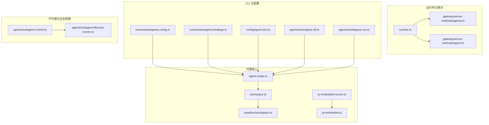
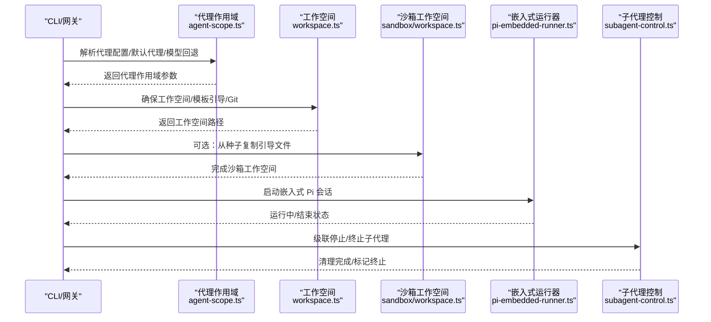
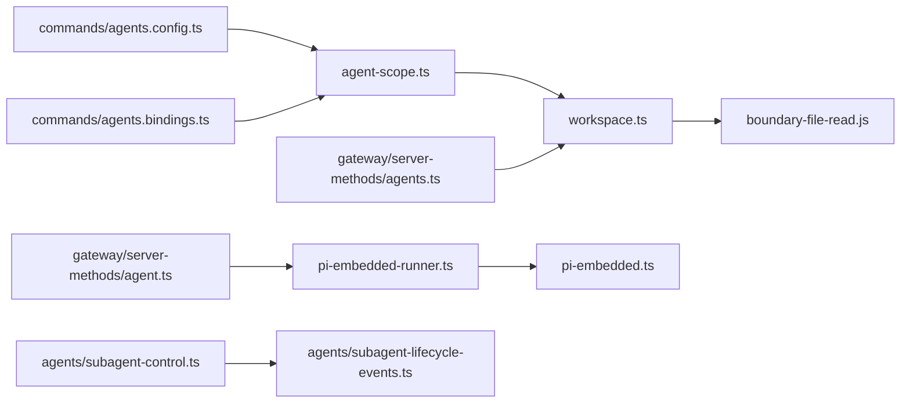
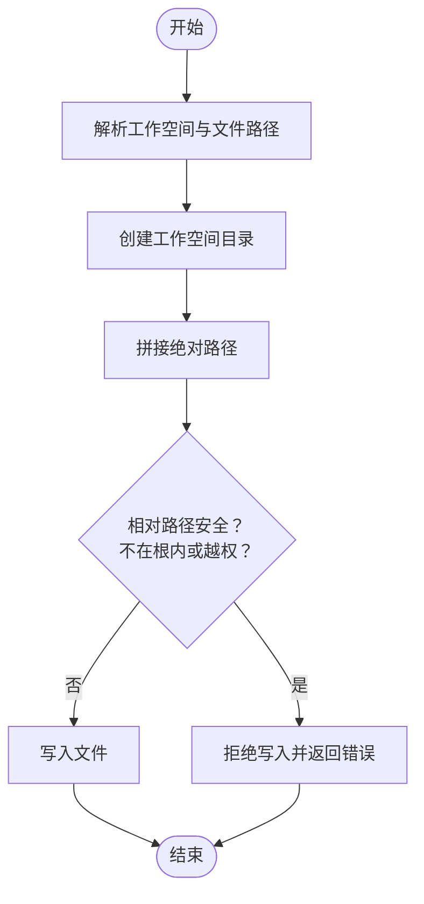

# 代理架构

<cite>
**本文引用的文件**
- [src/agents/agent-scope.ts](file://src/agents/agent-scope.ts)
- [src/agents/workspace.ts](file://src/agents/workspace.ts)
- [src/agents/sandbox/workspace.ts](file://src/agents/sandbox/workspace.ts)
- [src/agents/pi-embedded-runner.ts](file://src/agents/pi-embedded-runner.ts)
- [src/agents/pi-embedded.ts](file://src/agents/pi-embedded.ts)
- [src/runtime.ts](file://src/runtime.ts)
- [src/gateway/server-methods/agents.ts](file://src/gateway/server-methods/agents.ts)
- [src/gateway/server-methods/agent.ts](file://src/gateway/server-methods/agent.ts)
- [src/commands/agents.bindings.ts](file://src/commands/agents.bindings.ts)
- [src/commands/agents.config.ts](file://src/commands/agents.config.ts)
- [src/agents/subagent-control.ts](file://src/agents/subagent-control.ts)
- [src/agents/subagent-lifecycle-events.ts](file://src/agents/subagent-lifecycle-events.ts)
- [src/config/agent-dirs.ts](file://src/config/agent-dirs.ts)
- [src/agents/workspace-dir.ts](file://src/agents/workspace-dir.ts)
- [src/agents/workspace-run.ts](file://src/agents/workspace-run.ts)
</cite>

## 目录
1. [引言](#引言)
2. [项目结构](#项目结构)
3. [核心组件](#核心组件)
4. [架构总览](#架构总览)
5. [详细组件分析](#详细组件分析)
6. [依赖关系分析](#依赖关系分析)
7. [性能考量](#性能考量)
8. [故障排查指南](#故障排查指南)
9. [结论](#结论)
10. [附录](#附录)

## 引言
本文件面向 OpenClaw 代理架构，系统性阐述代理运行时的架构设计与实现要点，重点覆盖以下主题：
- pi-mono 集成：通过嵌入式 Pi 运行器在代理运行时内核中执行消息流、会话生命周期与工具拆分等能力。
- 代理作用域管理：代理 ID 解析、默认代理选择、会话键到代理的映射、模型回退策略解析。
- 路径解析与工作空间：工作空间目录布局、文件系统边界保护、模板引导与 Git 初始化。
- 生命周期管理：代理运行、暂停与终止的控制流，子代理级联停止与清理。
- 配置系统：代理列表、默认值、继承与覆盖规则，以及 CLI 对配置的增删改查。

本文件同时提供可定位的源码路径，便于读者深入理解实现细节。

## 项目结构
OpenClaw 的代理相关代码主要集中在 src/agents 下，并与配置、网关服务端方法、CLI 命令、沙箱工作空间等模块协同工作。下图给出与代理架构直接相关的模块关系概览：

**图表来源**
- [src/agents/agent-scope.ts:1-339](file://src/agents/agent-scope.ts#L1-L339)
- [src/agents/workspace.ts:1-656](file://src/agents/workspace.ts#L1-L656)
- [src/agents/sandbox/workspace.ts:1-66](file://src/agents/sandbox/workspace.ts#L1-L66)
- [src/agents/pi-embedded-runner.ts:1-29](file://src/agents/pi-embedded-runner.ts#L1-L29)
- [src/agents/pi-embedded.ts:1-16](file://src/agents/pi-embedded.ts#L1-L16)
- [src/runtime.ts:1-54](file://src/runtime.ts#L1-L54)
- [src/gateway/server-methods/agents.ts:707-751](file://src/gateway/server-methods/agents.ts#L707-L751)
- [src/gateway/server-methods/agent.ts:754-783](file://src/gateway/server-methods/agent.ts#L754-L783)
- [src/commands/agents.config.ts:127-178](file://src/commands/agents.config.ts#L127-L178)
- [src/commands/agents.bindings.ts:161-175](file://src/commands/agents.bindings.ts#L161-L175)
- [src/config/agent-dirs.ts:40-84](file://src/config/agent-dirs.ts#L40-L84)
- [src/agents/workspace-dir.ts](file://src/agents/workspace-dir.ts)
- [src/agents/workspace-run.ts](file://src/agents/workspace-run.ts)
- [src/agents/subagent-control.ts:331-585](file://src/agents/subagent-control.ts#L331-L585)
- [src/agents/subagent-lifecycle-events.ts:32-47](file://src/agents/subagent-lifecycle-events.ts#L32-L47)

**章节来源**
- [src/agents/agent-scope.ts:1-339](file://src/agents/agent-scope.ts#L1-L339)
- [src/agents/workspace.ts:1-656](file://src/agents/workspace.ts#L1-L656)
- [src/agents/sandbox/workspace.ts:1-66](file://src/agents/sandbox/workspace.ts#L1-L66)
- [src/agents/pi-embedded-runner.ts:1-29](file://src/agents/pi-embedded-runner.ts#L1-L29)
- [src/agents/pi-embedded.ts:1-16](file://src/agents/pi-embedded.ts#L1-L16)
- [src/runtime.ts:1-54](file://src/runtime.ts#L1-L54)
- [src/gateway/server-methods/agents.ts:707-751](file://src/gateway/server-methods/agents.ts#L707-L751)
- [src/gateway/server-methods/agent.ts:754-783](file://src/gateway/server-methods/agent.ts#L754-L783)
- [src/commands/agents.config.ts:127-178](file://src/commands/agents.config.ts#L127-L178)
- [src/commands/agents.bindings.ts:161-175](file://src/commands/agents.bindings.ts#L161-L175)
- [src/config/agent-dirs.ts:40-84](file://src/config/agent-dirs.ts#L40-L84)
- [src/agents/workspace-dir.ts](file://src/agents/workspace-dir.ts)
- [src/agents/workspace-run.ts](file://src/agents/workspace-run.ts)
- [src/agents/subagent-control.ts:331-585](file://src/agents/subagent-control.ts#L331-L585)
- [src/agents/subagent-lifecycle-events.ts:32-47](file://src/agents/subagent-lifecycle-events.ts#L32-L47)

## 核心组件
- 代理作用域与配置解析
  - 列举代理条目、解析默认代理 ID、按会话键解析代理 ID、解析代理配置与技能过滤、解析模型主模型与回退策略、解析工作空间与代理目录。
  - 参考路径：[src/agents/agent-scope.ts:46-145](file://src/agents/agent-scope.ts#L46-L145)、[src/agents/agent-scope.ts:256-339](file://src/agents/agent-scope.ts#L256-L339)

- 工作空间与沙箱
  - 默认工作空间目录解析、边界安全读取、模板引导文件写入、Git 初始化、最小化引导白名单、额外引导文件加载与诊断。
  - 沙箱工作空间：从种子工作空间复制引导文件并确保工作空间完整性。
  - 参考路径：[src/agents/workspace.ts:12-459](file://src/agents/workspace.ts#L12-L459)、[src/agents/sandbox/workspace.ts:17-65](file://src/agents/sandbox/workspace.ts#L17-L65)

- pi-mono 集成（嵌入式运行器）
  - 导出嵌入式 Pi 运行器接口：运行、中断、等待结束、历史限制、系统提示覆盖、工具拆分、沙箱信息构建等。
  - 参考路径：[src/agents/pi-embedded-runner.ts:1-29](file://src/agents/pi-embedded-runner.ts#L1-L29)、[src/agents/pi-embedded.ts:1-16](file://src/agents/pi-embedded.ts#L1-L16)

- 运行时环境
  - 统一日志输出、错误输出、退出行为；非退出型运行时用于测试与异常控制。
  - 参考路径：[src/runtime.ts:1-54](file://src/runtime.ts#L1-L54)

- 网关服务端方法（代理文件与生命周期）
  - 代理文件读写：边界校验、相对路径安全检查、写入根目录约束。
  - 代理生命周期查询：去重、超时处理、状态返回。
  - 参考路径：[src/gateway/server-methods/agents.ts:707-751](file://src/gateway/server-methods/agents.ts#L707-L751)、[src/gateway/server-methods/agent.ts:754-783](file://src/gateway/server-methods/agent.ts#L754-L783)

- CLI 配置与绑定
  - 应用代理配置（增改）、裁剪代理配置（删除）、移除路由绑定、冲突检测与报告。
  - 参考路径：[src/commands/agents.config.ts:127-178](file://src/commands/agents.config.ts#L127-L178)、[src/commands/agents.bindings.ts:161-175](file://src/commands/agents.bindings.ts#L161-L175)

- 子代理控制与生命周期事件
  - 杀死子代理运行、级联停止、更新会话存储、标记终止、生命周期结局结果映射。
  - 参考路径：[src/agents/subagent-control.ts:331-585](file://src/agents/subagent-control.ts#L331-L585)、[src/agents/subagent-lifecycle-events.ts:32-47](file://src/agents/subagent-lifecycle-events.ts#L32-L47)

**章节来源**
- [src/agents/agent-scope.ts:46-145](file://src/agents/agent-scope.ts#L46-L145)
- [src/agents/agent-scope.ts:256-339](file://src/agents/agent-scope.ts#L256-L339)
- [src/agents/workspace.ts:12-459](file://src/agents/workspace.ts#L12-L459)
- [src/agents/sandbox/workspace.ts:17-65](file://src/agents/sandbox/workspace.ts#L17-L65)
- [src/agents/pi-embedded-runner.ts:1-29](file://src/agents/pi-embedded-runner.ts#L1-L29)
- [src/agents/pi-embedded.ts:1-16](file://src/agents/pi-embedded.ts#L1-L16)
- [src/runtime.ts:1-54](file://src/runtime.ts#L1-L54)
- [src/gateway/server-methods/agents.ts:707-751](file://src/gateway/server-methods/agents.ts#L707-L751)
- [src/gateway/server-methods/agent.ts:754-783](file://src/gateway/server-methods/agent.ts#L754-L783)
- [src/commands/agents.config.ts:127-178](file://src/commands/agents.config.ts#L127-L178)
- [src/commands/agents.bindings.ts:161-175](file://src/commands/agents.bindings.ts#L161-L175)
- [src/agents/subagent-control.ts:331-585](file://src/agents/subagent-control.ts#L331-L585)
- [src/agents/subagent-lifecycle-events.ts:32-47](file://src/agents/subagent-lifecycle-events.ts#L32-L47)

## 架构总览
下图展示代理运行时的关键交互：CLI/网关调用配置解析与工作空间准备，随后通过嵌入式运行器驱动 Pi 会话，期间受子代理控制与生命周期事件管理。

**图表来源**
- [src/agents/agent-scope.ts:72-145](file://src/agents/agent-scope.ts#L72-L145)
- [src/agents/workspace.ts:321-459](file://src/agents/workspace.ts#L321-L459)
- [src/agents/sandbox/workspace.ts:17-65](file://src/agents/sandbox/workspace.ts#L17-L65)
- [src/agents/pi-embedded-runner.ts:12-29](file://src/agents/pi-embedded-runner.ts#L12-L29)
- [src/agents/subagent-control.ts:331-585](file://src/agents/subagent-control.ts#L331-L585)

## 详细组件分析

### 代理作用域与配置解析
- 代理条目与默认代理
  - 支持多代理列表、去重、默认代理选择（允许多个 default 标记时警告并使用首个）。
  - 参考路径：[src/agents/agent-scope.ts:46-84](file://src/agents/agent-scope.ts#L46-L84)

- 会话键到代理 ID 的解析
  - 支持显式传入、会话键解析、默认代理回退。
  - 参考路径：[src/agents/agent-scope.ts:86-111](file://src/agents/agent-scope.ts#L86-L111)

- 代理配置与模型回退
  - 解析代理显式模型主模型与回退数组；支持会话级覆盖；默认回退值来自全局 agents.defaults。
  - 参考路径：[src/agents/agent-scope.ts:118-145](file://src/agents/agent-scope.ts#L118-L145)、[src/agents/agent-scope.ts:178-254](file://src/agents/agent-scope.ts#L178-L254)

- 工作空间与代理目录解析
  - 工作空间优先使用代理配置，否则默认代理使用全局默认，否则基于状态目录生成；代理目录解析同理。
  - 参考路径：[src/agents/agent-scope.ts:256-339](file://src/agents/agent-scope.ts#L256-L339)、[src/config/agent-dirs.ts:59-84](file://src/config/agent-dirs.ts#L59-L84)

- 工作空间路径归属与匹配
  - 将给定路径归一化后判断其属于哪些代理的工作空间，按包含关系排序返回最具体匹配。
  - 参考路径：[src/agents/agent-scope.ts:295-328](file://src/agents/agent-scope.ts#L295-L328)

**章节来源**
- [src/agents/agent-scope.ts:46-145](file://src/agents/agent-scope.ts#L46-L145)
- [src/agents/agent-scope.ts:178-254](file://src/agents/agent-scope.ts#L178-L254)
- [src/agents/agent-scope.ts:256-339](file://src/agents/agent-scope.ts#L256-L339)
- [src/config/agent-dirs.ts:59-84](file://src/config/agent-dirs.ts#L59-L84)

### 工作空间组织与文件系统隔离
- 默认工作空间目录
  - 支持 OPENCLAW_PROFILE 区分不同配置文件集；默认位于用户家目录下的 .openclaw/workspace。
  - 参考路径：[src/agents/workspace.ts:12-22](file://src/agents/workspace.ts#L12-L22)

- 边界安全读取与缓存
  - 使用边界文件打开器限定访问范围，按设备号/inode/大小/修改时间组合标识缓存，避免陈旧读取。
  - 参考路径：[src/agents/workspace.ts:48-88](file://src/agents/workspace.ts#L48-L88)

- 模板引导与状态管理
  - 内置引导文件清单（如 AGENTS.md、SOUL.md、TOOLS.md 等），首次创建时写入；记录 onboarding 状态并迁移兼容。
  - 参考路径：[src/agents/workspace.ts:132-180](file://src/agents/workspace.ts#L132-L180)、[src/agents/workspace.ts:210-276](file://src/agents/workspace.ts#L210-L276)

- Git 初始化与品牌新工作空间
  - 在品牌新工作空间且 git 可用时初始化仓库，失败不阻断创建工作空间。
  - 参考路径：[src/agents/workspace.ts:278-319](file://src/agents/workspace.ts#L278-L319)

- 最小化引导白名单与会话过滤
  - 子代理与定时任务仅允许最小集合的引导文件，降低敏感信息暴露。
  - 参考路径：[src/agents/workspace.ts:557-573](file://src/agents/workspace.ts#L557-L573)

- 额外引导文件加载与诊断
  - 支持通配符模式解析，仅接受受支持的引导文件名，返回诊断信息。
  - 参考路径：[src/agents/workspace.ts:575-655](file://src/agents/workspace.ts#L575-L655)

- 沙箱工作空间
  - 可从种子工作空间复制引导文件，再确保工作空间完整性。
  - 参考路径：[src/agents/sandbox/workspace.ts:17-65](file://src/agents/sandbox/workspace.ts#L17-L65)

**章节来源**
- [src/agents/workspace.ts:12-180](file://src/agents/workspace.ts#L12-L180)
- [src/agents/workspace.ts:210-276](file://src/agents/workspace.ts#L210-L276)
- [src/agents/workspace.ts:278-319](file://src/agents/workspace.ts#L278-L319)
- [src/agents/workspace.ts:557-573](file://src/agents/workspace.ts#L557-L573)
- [src/agents/workspace.ts:575-655](file://src/agents/workspace.ts#L575-L655)
- [src/agents/sandbox/workspace.ts:17-65](file://src/agents/sandbox/workspace.ts#L17-L65)

### pi-mono 集成与运行时管理
- 接口导出
  - 运行嵌入式 Pi 代理、中断、等待结束、历史限制、系统提示覆盖、工具拆分、沙箱信息构建等。
  - 参考路径：[src/agents/pi-embedded-runner.ts:1-29](file://src/agents/pi-embedded-runner.ts#L1-L29)

- 扩展 API 类型声明
  - 通过扩展 API 暴露 runEmbeddedPiAgent 等能力，供外部集成。
  - 参考路径：[src/agents/pi-embedded.ts:1-16](file://src/agents/pi-embedded.ts#L1-L16)

**章节来源**
- [src/agents/pi-embedded-runner.ts:1-29](file://src/agents/pi-embedded-runner.ts#L1-L29)
- [src/agents/pi-embedded.ts:1-16](file://src/agents/pi-embedded.ts#L1-L16)

### 生命周期管理：启动、运行、暂停与终止
- 网关代理生命周期查询
  - 去重与超时处理，返回运行状态、开始/结束时间与错误信息。
  - 参考路径：[src/gateway/server-methods/agent.ts:754-783](file://src/gateway/server-methods/agent.ts#L754-L783)

- 代理文件写入与安全校验
  - 创建工作空间目录，解析目标路径，进行相对路径安全检查，确保写入受限于工作空间根。
  - 参考路径：[src/gateway/server-methods/agents.ts:714-751](file://src/gateway/server-methods/agents.ts#L714-L751)

- 子代理控制与级联停止
  - 校验控制器所有权、禁止叶子子代理控制其他会话、禁止自控；支持级联停止深度子代；更新会话存储并标记终止。
  - 参考路径：[src/agents/subagent-control.ts:526-585](file://src/agents/subagent-control.ts#L526-L585)、[src/agents/subagent-control.ts:331-371](file://src/agents/subagent-control.ts#L331-L371)

- 子代理生命周期结局映射
  - 将会话结束原因映射为生命周期结局（如重置、删除等）。
  - 参考路径：[src/agents/subagent-lifecycle-events.ts:32-47](file://src/agents/subagent-lifecycle-events.ts#L32-L47)

**章节来源**
- [src/gateway/server-methods/agent.ts:754-783](file://src/gateway/server-methods/agent.ts#L754-L783)
- [src/gateway/server-methods/agents.ts:714-751](file://src/gateway/server-methods/agents.ts#L714-L751)
- [src/agents/subagent-control.ts:331-585](file://src/agents/subagent-control.ts#L331-L585)
- [src/agents/subagent-lifecycle-events.ts:32-47](file://src/agents/subagent-lifecycle-events.ts#L32-L47)

### 配置系统：默认值、继承与覆盖
- 应用代理配置
  - 支持对代理名称、工作空间、代理目录、模型等字段进行增改，自动维护代理列表顺序与默认代理一致性。
  - 参考路径：[src/commands/agents.config.ts:127-178](file://src/commands/agents.config.ts#L127-L178)

- 裁剪代理配置
  - 删除指定代理条目，同时统计移除的绑定与允许项数量。
  - 参考路径：[src/commands/agents.config.ts:167-178](file://src/commands/agents.config.ts#L167-L178)

- 移除路由绑定
  - 识别并移除路由绑定，检测冲突与缺失，返回操作结果。
  - 参考路径：[src/commands/agents.bindings.ts:161-175](file://src/commands/agents.bindings.ts#L161-L175)

- 代理目录重复检测
  - 计算每个代理目录的占用者集合，发现重复时返回诊断信息。
  - 参考路径：[src/config/agent-dirs.ts:80-84](file://src/config/agent-dirs.ts#L80-L84)

**章节来源**
- [src/commands/agents.config.ts:127-178](file://src/commands/agents.config.ts#L127-L178)
- [src/commands/agents.bindings.ts:161-175](file://src/commands/agents.bindings.ts#L161-L175)
- [src/config/agent-dirs.ts:80-84](file://src/config/agent-dirs.ts#L80-L84)

### 具体实现示例（代码片段路径）
- 代理实例化与运行时管理
  - 运行嵌入式 Pi 代理：[src/agents/pi-embedded-runner.ts:12-19](file://src/agents/pi-embedded-runner.ts#L12-L19)
  - 获取运行状态与生命周期查询：[src/gateway/server-methods/agent.ts:754-783](file://src/gateway/server-methods/agent.ts#L754-L783)

- 配置加载与应用
  - 应用代理配置（增改）：[src/commands/agents.config.ts:127-178](file://src/commands/agents.config.ts#L127-L178)
  - 解析代理配置与模型回退：[src/agents/agent-scope.ts:118-145](file://src/agents/agent-scope.ts#L118-L145)

- 工作空间组织与隔离
  - 确保工作空间与模板引导：[src/agents/workspace.ts:321-459](file://src/agents/workspace.ts#L321-L459)
  - 沙箱工作空间复制与引导：[src/agents/sandbox/workspace.ts:17-65](file://src/agents/sandbox/workspace.ts#L17-L65)
  - 文件边界安全读取与缓存：[src/agents/workspace.ts:48-88](file://src/agents/workspace.ts#L48-L88)

- 子代理生命周期控制
  - 杀死子代理运行与级联停止：[src/agents/subagent-control.ts:331-585](file://src/agents/subagent-control.ts#L331-L585)
  - 生命周期结局映射：[src/agents/subagent-lifecycle-events.ts:32-47](file://src/agents/subagent-lifecycle-events.ts#L32-L47)

**章节来源**
- [src/agents/pi-embedded-runner.ts:12-19](file://src/agents/pi-embedded-runner.ts#L12-L19)
- [src/gateway/server-methods/agent.ts:754-783](file://src/gateway/server-methods/agent.ts#L754-L783)
- [src/commands/agents.config.ts:127-178](file://src/commands/agents.config.ts#L127-L178)
- [src/agents/agent-scope.ts:118-145](file://src/agents/agent-scope.ts#L118-L145)
- [src/agents/workspace.ts:321-459](file://src/agents/workspace.ts#L321-L459)
- [src/agents/sandbox/workspace.ts:17-65](file://src/agents/sandbox/workspace.ts#L17-L65)
- [src/agents/workspace.ts:48-88](file://src/agents/workspace.ts#L48-L88)
- [src/agents/subagent-control.ts:331-585](file://src/agents/subagent-control.ts#L331-L585)
- [src/agents/subagent-lifecycle-events.ts:32-47](file://src/agents/subagent-lifecycle-events.ts#L32-L47)

## 依赖关系分析
- 低耦合高内聚
  - 代理作用域与工作空间解耦，分别负责“配置解析”和“文件系统边界”，通过统一的路径解析与边界读取协作。
- 外部依赖
  - 运行时日志与退出行为由 runtime.ts 提供；网关服务端方法依赖边界文件读取与工作空间状态文件。
- 循环依赖规避
  - 通过导出类型与运行器接口分离，避免运行器与作用域之间的循环导入。

**图表来源**
- [src/agents/agent-scope.ts:1-339](file://src/agents/agent-scope.ts#L1-L339)
- [src/agents/workspace.ts:1-656](file://src/agents/workspace.ts#L1-L656)
- [src/agents/pi-embedded-runner.ts:1-29](file://src/agents/pi-embedded-runner.ts#L1-L29)
- [src/agents/pi-embedded.ts:1-16](file://src/agents/pi-embedded.ts#L1-L16)
- [src/gateway/server-methods/agents.ts:707-751](file://src/gateway/server-methods/agents.ts#L707-L751)
- [src/gateway/server-methods/agent.ts:754-783](file://src/gateway/server-methods/agent.ts#L754-L783)
- [src/commands/agents.config.ts:127-178](file://src/commands/agents.config.ts#L127-L178)
- [src/commands/agents.bindings.ts:161-175](file://src/commands/agents.bindings.ts#L161-L175)
- [src/agents/subagent-control.ts:331-585](file://src/agents/subagent-control.ts#L331-L585)
- [src/agents/subagent-lifecycle-events.ts:32-47](file://src/agents/subagent-lifecycle-events.ts#L32-L47)

**章节来源**
- [src/agents/agent-scope.ts:1-339](file://src/agents/agent-scope.ts#L1-L339)
- [src/agents/workspace.ts:1-656](file://src/agents/workspace.ts#L1-L656)
- [src/agents/pi-embedded-runner.ts:1-29](file://src/agents/pi-embedded-runner.ts#L1-L29)
- [src/agents/pi-embedded.ts:1-16](file://src/agents/pi-embedded.ts#L1-L16)
- [src/gateway/server-methods/agents.ts:707-751](file://src/gateway/server-methods/agents.ts#L707-L751)
- [src/gateway/server-methods/agent.ts:754-783](file://src/gateway/server-methods/agent.ts#L754-L783)
- [src/commands/agents.config.ts:127-178](file://src/commands/agents.config.ts#L127-L178)
- [src/commands/agents.bindings.ts:161-175](file://src/commands/agents.bindings.ts#L161-L175)
- [src/agents/subagent-control.ts:331-585](file://src/agents/subagent-control.ts#L331-L585)
- [src/agents/subagent-lifecycle-events.ts:32-47](file://src/agents/subagent-lifecycle-events.ts#L32-L47)

## 性能考量
- 缓存与边界读取
  - 工作空间文件按 inode/dev/size/mtime 组合缓存，减少重复 IO 与边界检查开销。
  - 参考路径：[src/agents/workspace.ts:48-88](file://src/agents/workspace.ts#L48-L88)
- 模板加载与并发
  - 模板内容缓存与 Promise 防抖，避免重复磁盘读取与并发重复请求。
  - 参考路径：[src/agents/workspace.ts:104-130](file://src/agents/workspace.ts#L104-L130)
- Git 可用性探测
  - 仅在需要时探测 git 可用性并缓存结果，避免每次初始化都执行命令。
  - 参考路径：[src/agents/workspace.ts:287-302](file://src/agents/workspace.ts#L287-L302)

[本节为通用指导，无需列出具体文件来源]

## 故障排查指南
- 工作空间文件读取失败
  - 检查边界文件读取返回的 reason（路径/校验/IO），确认文件是否在工作空间根内、大小是否超过限制、是否存在权限问题。
  - 参考路径：[src/agents/workspace.ts:48-88](file://src/agents/workspace.ts#L48-L88)

- 代理文件写入被拒绝
  - 确认相对路径未越权（.. 或绝对路径），确保写入目标在工作空间根内。
  - 参考路径：[src/gateway/server-methods/agents.ts:714-751](file://src/gateway/server-methods/agents.ts#L714-L751)

- 子代理无法控制其他会话
  - 叶子子代理不允许控制其他会话；检查控制器权限与会话键是否自控。
  - 参考路径：[src/agents/subagent-control.ts:562-585](file://src/agents/subagent-control.ts#L562-L585)

- 生命周期查询超时或状态异常
  - 检查去重逻辑与超时设置，确认运行状态与错误信息返回。
  - 参考路径：[src/gateway/server-methods/agent.ts:754-783](file://src/gateway/server-methods/agent.ts#L754-L783)

**章节来源**
- [src/agents/workspace.ts:48-88](file://src/agents/workspace.ts#L48-L88)
- [src/gateway/server-methods/agents.ts:714-751](file://src/gateway/server-methods/agents.ts#L714-L751)
- [src/agents/subagent-control.ts:562-585](file://src/agents/subagent-control.ts#L562-L585)
- [src/gateway/server-methods/agent.ts:754-783](file://src/gateway/server-methods/agent.ts#L754-L783)

## 结论
OpenClaw 的代理架构以“配置解析—工作空间—运行器—生命周期—控制”的清晰分层实现高内聚、低耦合的运行时体系。通过边界安全读取、最小化引导白名单与严格的路径校验，保障了工作空间隔离与安全性；通过嵌入式 Pi 运行器与子代理控制，实现了灵活的会话生命周期管理与级联治理。CLI 与网关服务端方法则提供了完善的配置与文件操作入口，满足日常运维与自动化场景需求。

[本节为总结性内容，无需列出具体文件来源]

## 附录
- 关键流程图：代理文件写入安全校验

**图表来源**
- [src/gateway/server-methods/agents.ts:714-751](file://src/gateway/server-methods/agents.ts#L714-L751)