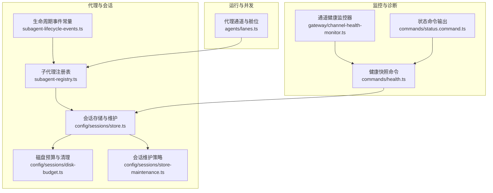
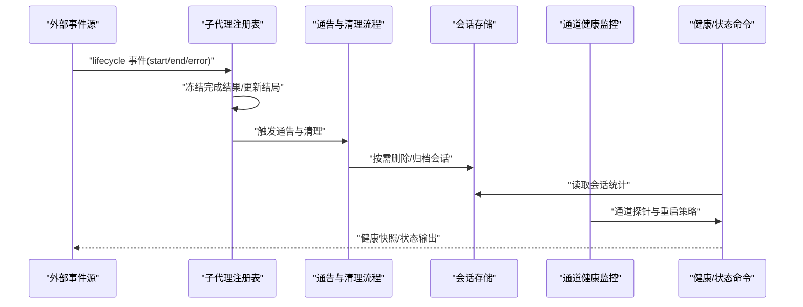
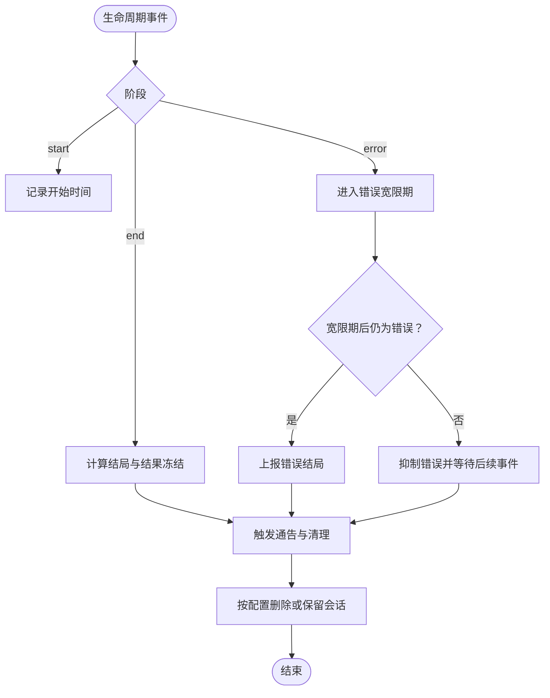
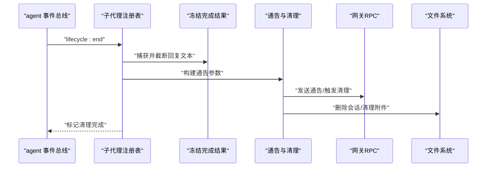
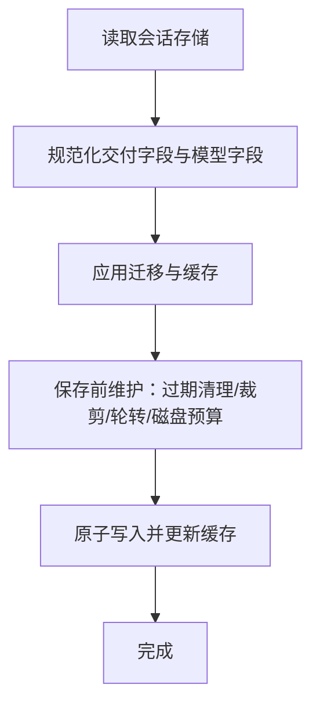
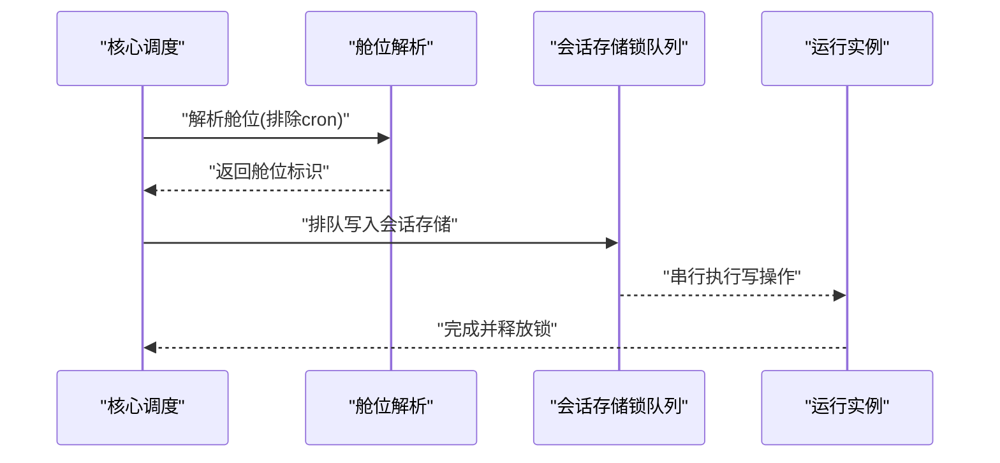
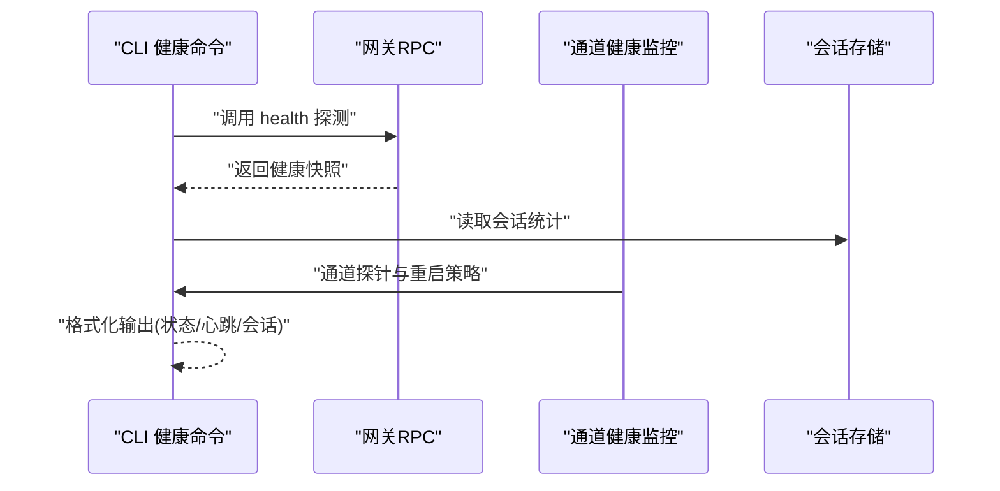
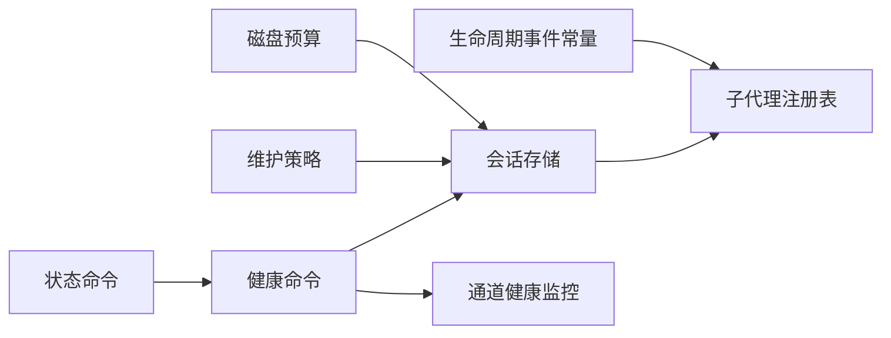

# 代理生命周期

<cite>
**本文引用的文件**
- [src/agents/subagent-lifecycle-events.ts](file://src/agents/subagent-lifecycle-events.ts)
- [src/agents/subagent-registry.ts](file://src/agents/subagent-registry.ts)
- [src/agents/subagent-registry.lifecycle-retry-grace.e2e.test.ts](file://src/agents/subagent-registry.lifecycle-retry-grace.e2e.test.ts)
- [src/agents/openclaw-tools.subagents.sessions-spawn.lifecycle.test.ts](file://src/agents/openclaw-tools.subagents.sessions-spawn.lifecycle.test.ts)
- [src/agents/lanes.ts](file://src/agents/lanes.ts)
- [src/config/sessions/store.ts](file://src/config/sessions/store.ts)
- [src/config/sessions/disk-budget.ts](file://src/config/sessions/disk-budget.ts)
- [src/config/sessions/store-maintenance.ts](file://src/config/sessions/store-maintenance.ts)
- [src/commands/health.ts](file://src/commands/health.ts)
- [src/commands/status.command.ts](file://src/commands/status.command.ts)
- [src/gateway/channel-health-monitor.ts](file://src/gateway/channel-health-monitor.ts)
</cite>

## 目录
1. [简介](#简介)
2. [项目结构](#项目结构)
3. [核心组件](#核心组件)
4. [架构总览](#架构总览)
5. [详细组件分析](#详细组件分析)
6. [依赖关系分析](#依赖关系分析)
7. [性能考量](#性能考量)
8. [故障排查指南](#故障排查指南)
9. [结论](#结论)
10. [附录](#附录)

## 简介
本文件系统性阐述 OpenClaw 代理的生命周期管理，覆盖从创建到销毁的全链路：初始化、启动、运行、暂停、恢复与终止；会话管理（创建、状态跟踪、工具结果处理、压缩清理）；并发控制（多代理调度、资源分配、冲突解决）；以及监控与诊断（健康检查、性能指标、错误报告）。文档同时给出生命周期钩子、状态转换触发条件与异常处理的最佳实践指引。

## 项目结构
围绕代理生命周期的关键模块分布如下：
- 代理运行时与生命周期编排：agents 子目录
- 会话存储与维护：config/sessions 子目录
- 健康检查与通道监控：commands/health.ts、gateway/channel-health-monitor.ts
- CLI 状态展示：commands/status.command.ts

**图表来源**
- [src/agents/subagent-registry.ts:1-800](file://src/agents/subagent-registry.ts#L1-L800)
- [src/agents/subagent-lifecycle-events.ts:1-48](file://src/agents/subagent-lifecycle-events.ts#L1-L48)
- [src/config/sessions/store.ts:1-800](file://src/config/sessions/store.ts#L1-L800)
- [src/config/sessions/disk-budget.ts:50-89](file://src/config/sessions/disk-budget.ts#L50-L89)
- [src/config/sessions/store-maintenance.ts:221-268](file://src/config/sessions/store-maintenance.ts#L221-L268)
- [src/agents/lanes.ts:1-15](file://src/agents/lanes.ts#L1-L15)
- [src/commands/health.ts:1-752](file://src/commands/health.ts#L1-L752)
- [src/gateway/channel-health-monitor.ts:76-111](file://src/gateway/channel-health-monitor.ts#L76-L111)
- [src/commands/status.command.ts:318-358](file://src/commands/status.command.ts#L318-L358)

**章节来源**
- [src/agents/subagent-registry.ts:1-800](file://src/agents/subagent-registry.ts#L1-L800)
- [src/config/sessions/store.ts:1-800](file://src/config/sessions/store.ts#L1-L800)
- [src/commands/health.ts:1-752](file://src/commands/health.ts#L1-L752)

## 核心组件
- 子代理生命周期事件与结局判定：定义生命周期结束原因与结局类型，提供会话重置/删除对应的结局映射。
- 子代理注册表：监听生命周期事件，完成运行记录的冻结、通告、清理与归档；实现错误宽限期、重试退避、孤儿运行清理等。
- 会话存储与维护：提供加载/保存、写锁队列、缓存、磁盘预算、过期清理、文件轮转等能力。
- 并发与舱位：通过“舱位”（lane）隔离不同类型的代理执行，避免竞争。
- 健康检查与通道监控：聚合通道账户探针、心跳、会话统计，输出健康快照与状态命令。

**章节来源**
- [src/agents/subagent-lifecycle-events.ts:1-48](file://src/agents/subagent-lifecycle-events.ts#L1-L48)
- [src/agents/subagent-registry.ts:1-800](file://src/agents/subagent-registry.ts#L1-L800)
- [src/config/sessions/store.ts:1-800](file://src/config/sessions/store.ts#L1-L800)
- [src/agents/lanes.ts:1-15](file://src/agents/lanes.ts#L1-L15)
- [src/commands/health.ts:1-752](file://src/commands/health.ts#L1-L752)
- [src/gateway/channel-health-monitor.ts:76-111](file://src/gateway/channel-health-monitor.ts#L76-L111)

## 架构总览
下图展示代理生命周期在系统中的交互路径：事件驱动、会话持久化、通告清理、健康监控与状态输出。

**图表来源**
- [src/agents/subagent-registry.ts:753-800](file://src/agents/subagent-registry.ts#L753-L800)
- [src/config/sessions/store.ts:340-520](file://src/config/sessions/store.ts#L340-L520)
- [src/gateway/channel-health-monitor.ts:76-111](file://src/gateway/channel-health-monitor.ts#L76-L111)
- [src/commands/health.ts:348-523](file://src/commands/health.ts#L348-L523)

## 详细组件分析

### 子代理生命周期事件与结局判定
- 定义生命周期结束原因（完成、错误、被杀、会话重置/删除）与结局（ok/error/timeout/killed/reset/deleted），并提供会话重置/删除到结局的映射函数。
- 在测试中验证：瞬时错误在宽限期内被抑制，终端错误在宽限期后上报；完成结果被冻结并保留，后续同会话刷新时可更新最终摘要；并发子代理的首次结果被稳定保留。

**图表来源**
- [src/agents/subagent-lifecycle-events.ts:1-48](file://src/agents/subagent-lifecycle-events.ts#L1-L48)
- [src/agents/subagent-registry.ts:279-313](file://src/agents/subagent-registry.ts#L279-L313)
- [src/agents/subagent-registry.lifecycle-retry-grace.e2e.test.ts:159-203](file://src/agents/subagent-registry.lifecycle-retry-grace.e2e.test.ts#L159-L203)

**章节来源**
- [src/agents/subagent-lifecycle-events.ts:1-48](file://src/agents/subagent-lifecycle-events.ts#L1-L48)
- [src/agents/subagent-registry.lifecycle-retry-grace.e2e.test.ts:1-384](file://src/agents/subagent-registry.lifecycle-retry-grace.e2e.test.ts#L1-L384)

### 子代理注册表：事件监听、通告与清理
- 事件监听：订阅 agent 事件流，处理 start/end/error，更新运行记录与结局。
- 结果冻结：在完成时捕获最终回复文本，进行长度截断与缓存，支持后续刷新。
- 通告与清理：根据运行配置决定是否发送告别消息、是否删除会话；对 completion 模式运行采用延迟等待与硬超时保护。
- 错误宽限期：嵌入式运行在模型重试期间可能产生瞬时 error，注册表延后清理，等待后续 start/end 抵消。
- 归档与清理：按配置定时归档过期运行，删除会话并清理附件目录。

**图表来源**
- [src/agents/subagent-registry.ts:451-530](file://src/agents/subagent-registry.ts#L451-L530)
- [src/agents/subagent-registry.ts:532-567](file://src/agents/subagent-registry.ts#L532-L567)
- [src/agents/subagent-registry.ts:714-751](file://src/agents/subagent-registry.ts#L714-L751)

**章节来源**
- [src/agents/subagent-registry.ts:1-800](file://src/agents/subagent-registry.ts#L1-L800)

### 会话存储与维护：创建、状态跟踪、清理
- 加载/保存：带缓存与 TTL 的读取、原子写入、Windows 兼容重试、写锁队列串行化。
- 维护策略：按时间戳过期清理、条目数量上限裁剪、磁盘预算强制清理、归档目录清理与文件轮转。
- 会话键规范化：兼容大小写与历史键，合并更新元数据时不刷新活动时间戳，保证空闲评估准确性。

**图表来源**
- [src/config/sessions/store.ts:195-270](file://src/config/sessions/store.ts#L195-L270)
- [src/config/sessions/store.ts:340-520](file://src/config/sessions/store.ts#L340-L520)
- [src/config/sessions/store.ts:521-533](file://src/config/sessions/store.ts#L521-L533)
- [src/config/sessions/store.ts:695-727](file://src/config/sessions/store.ts#L695-L727)

**章节来源**
- [src/config/sessions/store.ts:1-800](file://src/config/sessions/store.ts#L1-L800)
- [src/config/sessions/disk-budget.ts:50-89](file://src/config/sessions/disk-budget.ts#L50-L89)
- [src/config/sessions/store-maintenance.ts:221-268](file://src/config/sessions/store-maintenance.ts#L221-L268)

### 并发控制：多代理调度、资源分配与冲突解决
- 舱位隔离：区分 nested 与 subagent 舱位；cron 调度不继承 cron 舱位，避免内部工作与外部调度抢占。
- 写锁队列：同一会话存储文件的并发写入通过队列串行化，避免竞态与损坏。
- 运行恢复：重启后恢复未完成运行，按重试退避与到期策略继续通告清理。

**图表来源**
- [src/agents/lanes.ts:6-14](file://src/agents/lanes.ts#L6-L14)
- [src/config/sessions/store.ts:695-727](file://src/config/sessions/store.ts#L695-L727)
- [src/agents/subagent-registry.ts:648-678](file://src/agents/subagent-registry.ts#L648-L678)

**章节来源**
- [src/agents/lanes.ts:1-15](file://src/agents/lanes.ts#L1-L15)
- [src/config/sessions/store.ts:549-727](file://src/config/sessions/store.ts#L549-L727)
- [src/agents/subagent-registry.ts:648-678](file://src/agents/subagent-registry.ts#L648-L678)

### 监控与诊断：健康检查、性能指标与错误报告
- 健康快照：聚合通道账户探针、心跳间隔、会话统计，支持详细模式探测与调试输出。
- 通道健康监控：周期性检查通道运行状态，冷却窗口内限制重启次数，记录重启时间线。
- 状态命令：输出心跳间隔、最近会话、会话存储路径与计数，支持深度探测。

**图表来源**
- [src/commands/health.ts:348-523](file://src/commands/health.ts#L348-L523)
- [src/gateway/channel-health-monitor.ts:76-111](file://src/gateway/channel-health-monitor.ts#L76-L111)
- [src/commands/status.command.ts:318-358](file://src/commands/status.command.ts#L318-L358)

**章节来源**
- [src/commands/health.ts:1-752](file://src/commands/health.ts#L1-L752)
- [src/gateway/channel-health-monitor.ts:76-111](file://src/gateway/channel-health-monitor.ts#L76-L111)
- [src/commands/status.command.ts:318-358](file://src/commands/status.command.ts#L318-L358)

## 依赖关系分析
- 子代理注册表依赖生命周期事件常量、会话存储、通告与清理流程、上下文引擎回调与运行超时配置。
- 会话存储依赖缓存、磁盘预算、维护策略与写锁队列。
- 健康命令依赖通道插件、绑定映射、心跳汇总与会话存储。
- 通道健康监控依赖通道管理器运行时快照与重启记录。

**图表来源**
- [src/agents/subagent-lifecycle-events.ts:1-48](file://src/agents/subagent-lifecycle-events.ts#L1-L48)
- [src/agents/subagent-registry.ts:1-800](file://src/agents/subagent-registry.ts#L1-L800)
- [src/config/sessions/store.ts:1-800](file://src/config/sessions/store.ts#L1-L800)
- [src/config/sessions/disk-budget.ts:50-89](file://src/config/sessions/disk-budget.ts#L50-L89)
- [src/config/sessions/store-maintenance.ts:221-268](file://src/config/sessions/store-maintenance.ts#L221-L268)
- [src/commands/health.ts:1-752](file://src/commands/health.ts#L1-L752)
- [src/gateway/channel-health-monitor.ts:76-111](file://src/gateway/channel-health-monitor.ts#L76-L111)
- [src/commands/status.command.ts:318-358](file://src/commands/status.command.ts#L318-L358)

**章节来源**
- [src/agents/subagent-registry.ts:1-800](file://src/agents/subagent-registry.ts#L1-L800)
- [src/config/sessions/store.ts:1-800](file://src/config/sessions/store.ts#L1-L800)
- [src/commands/health.ts:1-752](file://src/commands/health.ts#L1-L752)

## 性能考量
- 缓存与 TTL：会话存储读取支持缓存与 TTL，减少频繁 IO。
- 写入串行化：通过写锁队列避免并发写入冲突，提升稳定性。
- 维护策略：定期过期清理、裁剪与磁盘预算强制清理，降低内存与磁盘压力。
- 通告退避：通告重试采用指数退避与最大重试次数，避免无限循环。
- 健康探测：命令层支持超时与详细模式，平衡诊断深度与性能开销。

[本节为通用指导，无需特定文件来源]

## 故障排查指南
- 生命周期事件缺失或延迟：检查事件监听是否启动、是否被孤儿运行影响；确认错误宽限期设置。
- 通告失败或重复：查看重试计数与到期策略；确认 completion 模式运行的硬超时与软超时配置。
- 会话未删除或残留：核对清理策略（delete/keep）、磁盘预算与维护模式；检查会话 ID 与键规范化。
- 通道不稳定：启用通道健康监控，观察冷却窗口与重启频率；调整重启阈值与探针超时。
- 健康命令无输出或错误：确认网关可达性与方法调用；在详细模式下查看探针与绑定信息。

**章节来源**
- [src/agents/subagent-registry.ts:568-646](file://src/agents/subagent-registry.ts#L568-L646)
- [src/config/sessions/store.ts:340-520](file://src/config/sessions/store.ts#L340-L520)
- [src/gateway/channel-health-monitor.ts:76-111](file://src/gateway/channel-health-monitor.ts#L76-L111)
- [src/commands/health.ts:525-751](file://src/commands/health.ts#L525-L751)

## 结论
OpenClaw 的代理生命周期以事件驱动为核心，结合会话存储的强一致维护、通告清理的稳健策略与通道健康监控，形成从创建到销毁的闭环管理。通过舱位隔离与写锁队列保障并发安全，借助健康命令与状态输出提供可观测性。遵循本文的生命周期钩子、状态转换与异常处理最佳实践，可有效提升系统的可靠性与可维护性。

[本节为总结，无需特定文件来源]

## 附录
- 代码示例路径（用于定位实现细节）
  - 生命周期事件常量与结局映射：[src/agents/subagent-lifecycle-events.ts:1-48](file://src/agents/subagent-lifecycle-events.ts#L1-L48)
  - 注册表事件监听与清理流程：[src/agents/subagent-registry.ts:753-800](file://src/agents/subagent-registry.ts#L753-L800)
  - 通告与清理主流程：[src/agents/subagent-registry.ts:532-567](file://src/agents/subagent-registry.ts#L532-L567)
  - 会话存储加载/保存与写锁：[src/config/sessions/store.ts:195-270](file://src/config/sessions/store.ts#L195-L270), [src/config/sessions/store.ts:511-533](file://src/config/sessions/store.ts#L511-L533), [src/config/sessions/store.ts:695-727](file://src/config/sessions/store.ts#L695-L727)
  - 维护策略与磁盘预算：[src/config/sessions/store-maintenance.ts:221-268](file://src/config/sessions/store-maintenance.ts#L221-L268), [src/config/sessions/disk-budget.ts:50-89](file://src/config/sessions/disk-budget.ts#L50-L89)
  - 健康快照与状态命令：[src/commands/health.ts:348-523](file://src/commands/health.ts#L348-L523), [src/commands/status.command.ts:318-358](file://src/commands/status.command.ts#L318-L358)
  - 通道健康监控：[src/gateway/channel-health-monitor.ts:76-111](file://src/gateway/channel-health-monitor.ts#L76-L111)