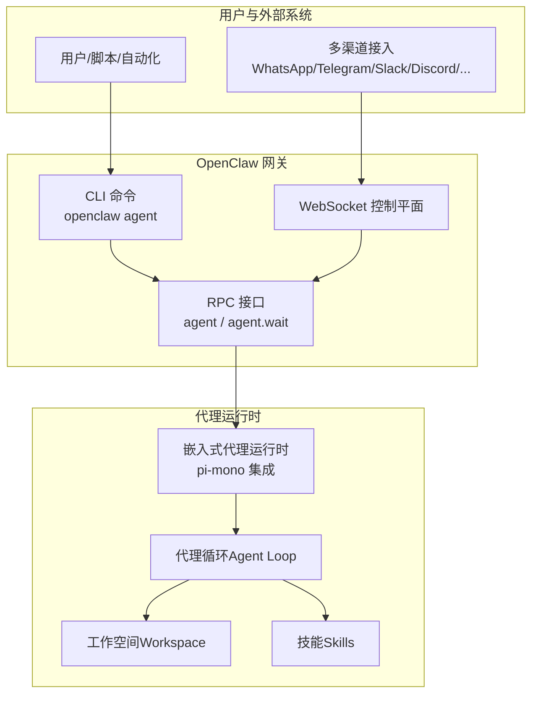
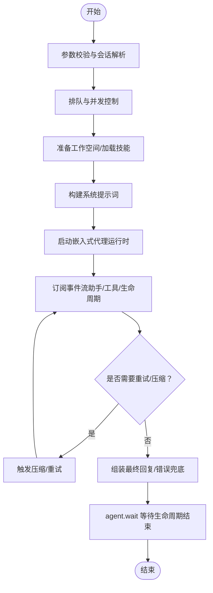
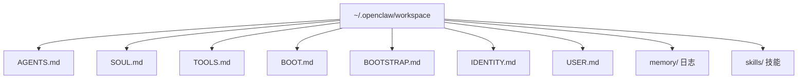
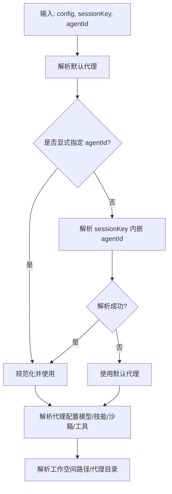
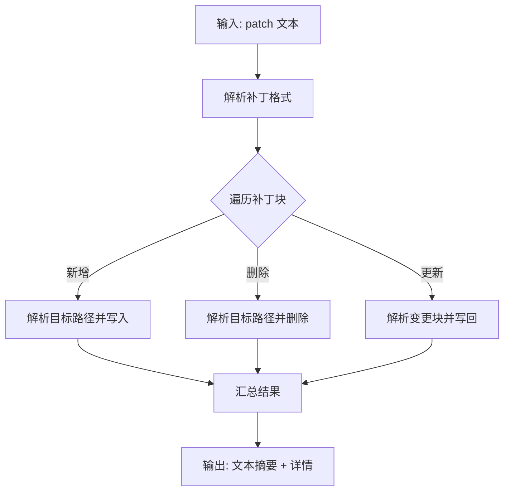
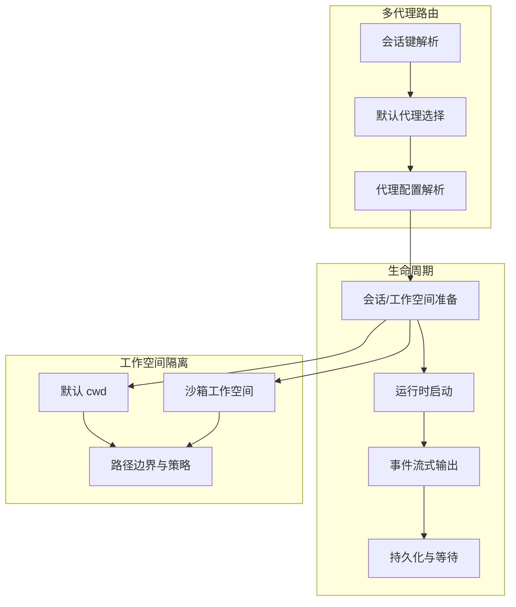
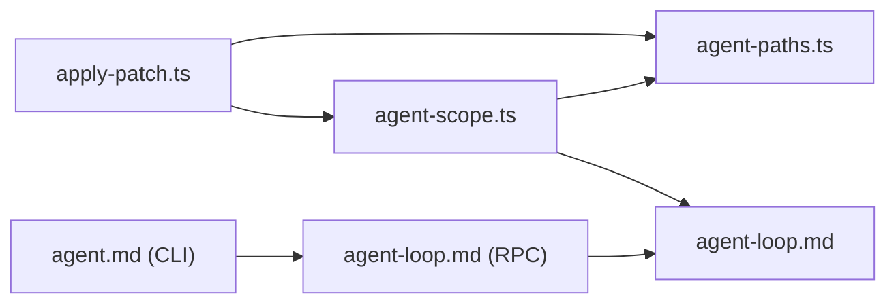

# 代理系统

<cite>
**本文引用的文件**
- [README.md](file://README.md)
- [AGENTS.md](file://AGENTS.md)
- [agent-loop.md](file://docs/concepts/agent-loop.md)
- [agent-workspace.md](file://docs/concepts/agent-workspace.md)
- [agent.md](file://docs/concepts/agent.md)
- [agent.md](file://docs/cli/agent.md)
- [agent-paths.ts](file://src/agents/agent-paths.ts)
- [agent-scope.ts](file://src/agents/agent-scope.ts)
- [apply-patch.ts](file://src/agents/apply-patch.ts)
</cite>

## 目录
1. [简介](#简介)
2. [项目结构](#项目结构)
3. [核心组件](#核心组件)
4. [架构总览](#架构总览)
5. [详细组件分析](#详细组件分析)
6. [依赖关系分析](#依赖关系分析)
7. [性能考量](#性能考量)
8. [故障排查指南](#故障排查指南)
9. [结论](#结论)
10. [附录](#附录)

## 简介
本文件面向 OpenClaw 代理系统的技术文档，围绕“多代理路由机制、代理工作空间组织与生命周期管理、代理循环（Agent Loop）全流程、工作空间隔离与权限控制、代理配置体系与安全策略”等主题进行系统化阐述，并结合仓库中的概念文档与源码文件，给出可操作的流程与图示，帮助开发者与运维人员快速理解并高效使用 OpenClaw 的代理能力。

## 项目结构
OpenClaw 的代理系统由“网关控制平面 + 嵌入式代理运行时（基于 pi-mono）+ 多通道接入 + 工作空间与技能体系”构成。其关键位置如下：
- 概念与参考：docs/concepts 下的 agent-loop、agent-workspace、agent 等文档
- CLI：docs/cli/agent.md 提供命令行入口与示例
- 核心实现：src/agents 下的路径解析、作用域与配置解析、补丁应用等模块
- 全局说明：README.md 与 AGENTS.md 提供安装、配置与安全要点



**图表来源**
- [agent-loop.md:18-50](file://docs/concepts/agent-loop.md#L18-L50)
- [agent.md:10-23](file://docs/concepts/agent.md#L10-L23)
- [agent.md:8-29](file://docs/cli/agent.md#L8-L29)

**章节来源**
- [README.md:185-239](file://README.md#L185-L239)
- [agent-loop.md:18-50](file://docs/concepts/agent-loop.md#L18-L50)
- [agent.md:10-23](file://docs/concepts/agent.md#L10-L23)
- [agent.md:8-29](file://docs/cli/agent.md#L8-L29)

## 核心组件
- 代理循环（Agent Loop）
  - 定义：从消息输入到推理、工具调用、流式回复、持久化的完整序列；支持生命周期事件与队列并发控制。
  - 关键点：入口（RPC/CLI）、队列与并发、会话与工作空间准备、系统提示词组装、插件/内部钩子、流式输出、压缩与重试、超时与早停。
- 代理工作空间（Agent Workspace）
  - 定义：代理的唯一工作目录，承载文件工具与上下文；默认位于 ~/.openclaw/workspace，可通过配置覆盖或按代理分隔。
  - 关键点：默认位置与覆盖、文件映射（AGENTS.md、SOUL.md、TOOLS.md、BOOT.md、BOOTSTRAP.md、IDENTITY.md、USER.md、memory/ 与 skills/）、Git 备份建议、沙箱模式下的隔离。
- 代理作用域与路由（Agent Scope & Routing）
  - 定义：根据会话键解析目标代理 ID，支持默认代理、显式代理与会话键内嵌代理标识；可按工作空间路径反查代理 ID。
  - 关键点：代理列表解析、默认代理选择、会话键解析、代理配置（模型、技能、沙箱、工具等）解析。
- 代理路径与环境（Agent Paths）
  - 定义：解析代理目录与注入环境变量（OPENCLAW_AGENT_DIR、PI_CODING_AGENT_DIR），确保运行时一致性。
  - 关键点：优先级覆盖、默认路径、用户路径解析。
- 补丁应用工具（apply_patch）
  - 定义：在工作空间内安全地应用补丁，支持添加、删除、更新与移动文件，内置边界检查与沙箱路径断言。
  - 关键点：补丁格式解析、文件操作封装、工作空间限制、沙箱桥接。

**章节来源**
- [agent-loop.md:10-149](file://docs/concepts/agent-loop.md#L10-L149)
- [agent-workspace.md:9-237](file://docs/concepts/agent-workspace.md#L9-L237)
- [agent-scope.ts:46-339](file://src/agents/agent-scope.ts#L46-L339)
- [agent-paths.ts:6-26](file://src/agents/agent-paths.ts#L6-L26)
- [apply-patch.ts:85-123](file://src/agents/apply-patch.ts#L85-L123)

## 架构总览
下图展示了从用户触发到代理循环完成一次完整“思考-工具-输出”的端到端流程，以及与工作空间、技能、队列的关系。

```mermaid
sequenceDiagram
participant User as "用户/脚本"
participant CLI as "CLI/openclaw agent"
participant RPC as "RPC : agent/agent.wait"
participant PI as "嵌入式代理运行时"
participant LOOP as "代理循环"
participant WS as "工作空间"
participant SK as "技能/工具"
User->>CLI : 触发一次代理回合
CLI->>RPC : 发送参数与会话信息
RPC->>LOOP : 分配 runId 并启动
LOOP->>WS : 准备工作空间/加载引导文件
LOOP->>SK : 加载技能快照/注入上下文
LOOP->>PI : 构建会话并订阅事件
PI-->>LOOP : 流式返回助手/工具事件
LOOP-->>RPC : 生命周期事件start/end/error
RPC-->>CLI : 返回 runId 或等待结果
CLI-->>User : 输出最终回复/错误
```

**图表来源**
- [agent-loop.md:23-50](file://docs/concepts/agent-loop.md#L23-L50)
- [agent.md:73-104](file://docs/concepts/agent.md#L73-L104)
- [agent.md:17-29](file://docs/cli/agent.md#L17-L29)

## 详细组件分析

### 组件一：代理循环（Agent Loop）
- 输入处理
  - 参数校验与会话解析：RPC 层接收参数，解析 sessionKey/sessionId，持久化元数据后立即返回 runId。
  - 队列与并发：每会话串行执行，必要时通过全局队列串行化，避免工具/会话竞态。
- 思考过程
  - 模型与思考/详细度默认值解析、技能快照加载、嵌入式代理运行时（pi-mono）启动。
  - 系统提示词构建：合并基础提示、技能、引导上下文与运行时覆盖项，考虑模型限制与压缩预留。
- 工具调用
  - 订阅工具事件与助手增量，按策略发出工具流与助手流；对消息类工具进行重复抑制与确认跟踪。
- 输出生成
  - 聚合助手文本/推理、工具摘要（当允许且详细）、错误兜底；过滤静默标记（如 NO_REPLY）；去重与最终 payload 组装。
- 生命周期与等待
  - 生命周期事件（start/end/error）通过工具流与助手流桥接；agent.wait 使用等待函数等待生命周期结束或错误，返回状态与时间戳。
- 超时与早停
  - agent.wait 默认等待超时；运行时有独立超时（agents.defaults.timeoutSeconds），超过则中止。



**图表来源**
- [agent-loop.md:23-149](file://docs/concepts/agent-loop.md#L23-L149)

**章节来源**
- [agent-loop.md:10-149](file://docs/concepts/agent-loop.md#L10-L149)

### 组件二：代理工作空间（Agent Workspace）
- 位置与布局
  - 默认位置：~/.openclaw/workspace；可通过配置覆盖；支持按代理创建独立工作空间（workspace-<id>）。
  - 文件映射：AGENTS.md、SOUL.md、TOOLS.md、BOOT.md、BOOTSTRAP.md、IDENTITY.md、USER.md、memory/、skills/ 等。
- 备份与迁移
  - 建议私有 Git 备份；推荐仅纳入工作空间内非敏感文件；迁移时单独拷贝 sessions/ 与配置。
- 隔离与权限
  - 默认工作目录即 cwd；若启用沙箱，非主会话可在沙箱工作空间中执行；工具解析相对路径以工作空间为根。
- Git 备份步骤
  - 初始化仓库、添加远程、日常提交与推送；建议忽略敏感文件。



**图表来源**
- [agent-workspace.md:64-125](file://docs/concepts/agent-workspace.md#L64-L125)

**章节来源**
- [agent-workspace.md:9-237](file://docs/concepts/agent-workspace.md#L9-L237)

### 组件三：代理作用域与路由（Agent Scope & Routing）
- 代理列表与默认代理
  - 解析 agents.list，去重并确定默认代理；若多个默认则警告并使用首个。
- 会话键解析
  - 支持在 sessionKey 中内嵌 agentId；否则优先显式传入，再回退到默认代理。
- 代理配置解析
  - 解析每个代理的名称、工作空间、代理目录、模型（含主模型与回退列表）、技能过滤、心跳、身份、群聊、子代理、沙箱与工具策略等。
- 工作空间路径与代理映射
  - 可根据工作空间路径反查匹配的代理 ID，并按路径长度排序返回最匹配者。



**图表来源**
- [agent-scope.ts:86-145](file://src/agents/agent-scope.ts#L86-L145)
- [agent-scope.ts:256-339](file://src/agents/agent-scope.ts#L256-L339)

**章节来源**
- [agent-scope.ts:46-339](file://src/agents/agent-scope.ts#L46-L339)

### 组件四：代理路径与环境（Agent Paths）
- 代理目录解析
  - 支持通过环境变量覆盖（OPENCLAW_AGENT_DIR、PI_CODING_AGENT_DIR）；否则使用默认 state 目录下的 agents/<id>/agent。
- 环境注入
  - 自动设置 OPENCLAW_AGENT_DIR 与 PI_CODING_AGENT_DIR，保证运行时一致。

**章节来源**
- [agent-paths.ts:6-26](file://src/agents/agent-paths.ts#L6-L26)

### 组件五：补丁应用工具（apply_patch）
- 功能概述
  - 在工作空间内安全应用补丁，支持新增、删除、更新与移动文件；自动解析补丁格式并按块应用。
- 安全与边界
  - 严格限制在工作空间根内；支持沙箱桥接；对路径别名进行策略约束；读写通过边界文件打开器或沙箱桥接。
- 结果汇总
  - 返回添加/修改/删除文件清单与人类可读摘要。



**图表来源**
- [apply-patch.ts:125-189](file://src/agents/apply-patch.ts#L125-L189)

**章节来源**
- [apply-patch.ts:85-123](file://src/agents/apply-patch.ts#L85-L123)
- [apply-patch.ts:229-276](file://src/agents/apply-patch.ts#L229-L276)
- [apply-patch.ts:351-495](file://src/agents/apply-patch.ts#L351-L495)

### 概念总览
- 多代理路由
  - 通过会话键与代理配置实现多代理隔离与路由；不同代理可拥有独立工作空间与模型策略。
- 代理生命周期
  - 从参数接受、会话准备、运行时启动、事件流式输出到持久化与等待结束，贯穿队列、压缩、重试与超时控制。
- 工作空间隔离
  - 默认工作目录即 cwd；启用沙箱后非主会话在沙箱工作空间执行；工具路径解析以工作空间为根，避免越权访问。



**图表来源**
- [agent-scope.ts:86-145](file://src/agents/agent-scope.ts#L86-L145)
- [agent-loop.md:23-50](file://docs/concepts/agent-loop.md#L23-L50)
- [agent-workspace.md:17-23](file://docs/concepts/agent-workspace.md#L17-L23)

## 依赖关系分析
- 组件耦合
  - agent-scope.ts 与 agent-paths.ts 协同决定代理的配置与运行目录；apply-patch.ts 依赖工作空间边界与沙箱桥接以保障安全。
- 外部依赖
  - 嵌入式代理运行时（pi-mono）集成；CLI 与 RPC 作为入口；队列与压缩/重试策略在 agent-loop.md 中定义。
- 潜在环路
  - 未见直接循环导入；配置解析与路径解析相互独立，通过公共常量与工具函数解耦。



**图表来源**
- [agent-scope.ts:1-339](file://src/agents/agent-scope.ts#L1-L339)
- [agent-paths.ts:1-26](file://src/agents/agent-paths.ts#L1-L26)
- [apply-patch.ts:1-583](file://src/agents/apply-patch.ts#L1-L583)
- [agent-loop.md:1-149](file://docs/concepts/agent-loop.md#L1-L149)
- [agent.md:1-29](file://docs/cli/agent.md#L1-L29)

**章节来源**
- [agent-scope.ts:1-339](file://src/agents/agent-scope.ts#L1-L339)
- [agent-paths.ts:1-26](file://src/agents/agent-paths.ts#L1-L26)
- [apply-patch.ts:1-583](file://src/agents/apply-patch.ts#L1-L583)
- [agent-loop.md:1-149](file://docs/concepts/agent-loop.md#L1-L149)
- [agent.md:1-29](file://docs/cli/agent.md#L1-L29)

## 性能考量
- 队列与并发
  - 每会话串行执行，避免工具/会话竞态；必要时通过全局队列串行化，降低上下文切换开销。
- 流式输出
  - 块流式（block streaming）与增量助手流减少首字延迟；合理设置块边界与合并策略，平衡实时性与消息粒度。
- 压缩与重试
  - 自动压缩与重试减少失败率；重试前清理内存缓冲与工具摘要，避免重复输出。
- 超时控制
  - 运行时超时与等待超时分别控制代理执行与等待阶段，防止长时间占用资源。

[本节为通用指导，无需特定文件引用]

## 故障排查指南
- 常见问题定位
  - 会话/工作空间准备失败：检查工作空间路径、权限与沙箱设置；确认引导文件存在与大小限制。
  - 工具执行异常：查看工具事件流与摘要；确认工具权限与路径边界；检查 apply_patch 的补丁格式与目标路径。
  - 超时与早停：调整 agents.defaults.timeoutSeconds 与 agent.wait 的超时；检查队列模式与消息积压。
- 诊断建议
  - 使用 openclaw doctor 检查配置与安全策略；查看日志子系统与会话 JSONL 转录。
  - 对于多代理场景，核对会话键与代理配置，确认默认代理与显式代理解析是否符合预期。

**章节来源**
- [agent-loop.md:138-149](file://docs/concepts/agent-loop.md#L138-L149)
- [agent-workspace.md:223-237](file://docs/concepts/agent-workspace.md#L223-L237)
- [apply-patch.ts:351-396](file://src/agents/apply-patch.ts#L351-L396)

## 结论
OpenClaw 的代理系统以“嵌入式运行时 + 工作空间 + 多通道接入”为核心，通过严格的代理循环与工作空间隔离、完善的路由与配置体系，实现了可扩展、可审计、可迁移的个人智能助理平台。遵循本文档的流程与最佳实践，可在保证安全的前提下高效构建与运维多代理场景。

[本节为总结，无需特定文件引用]

## 附录

### A. 代理创建、配置、执行与监控的完整流程（基于仓库内容）
- 创建与初始化
  - 使用 openclaw onboard 或 openclaw configure 初始化网关与工作空间；首次运行会创建默认引导文件。
- 配置
  - 设置 agents.defaults.workspace 与 channels.xxx.allowFrom 等关键配置；按需启用沙箱与模型回退。
- 执行
  - 通过 openclaw agent 命令触发一次代理回合；或通过 RPC agent/agent.wait 获取 runId 与最终状态。
- 监控
  - 查看会话 JSONL 转录与事件流；使用 openclaw doctor 检查健康与配置；关注队列模式与块流式设置。

**章节来源**
- [agent.md:17-29](file://docs/cli/agent.md#L17-L29)
- [agent-loop.md:23-50](file://docs/concepts/agent-loop.md#L23-L50)
- [agent-workspace.md:39-62](file://docs/concepts/agent-workspace.md#L39-L62)
- [README.md:318-338](file://README.md#L318-L338)