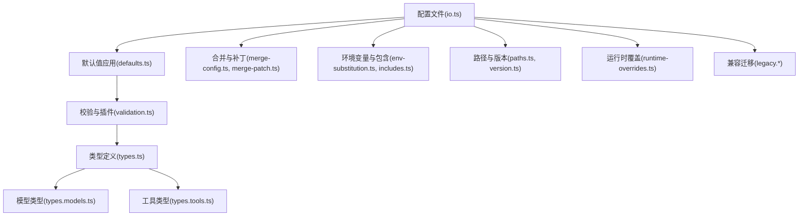
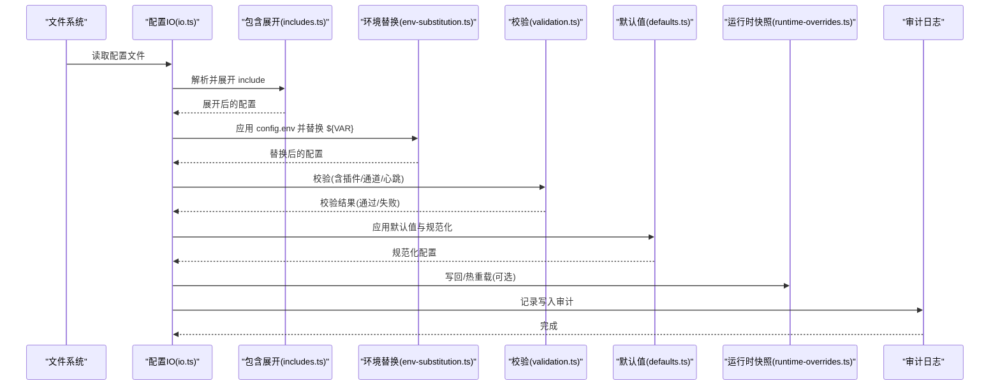
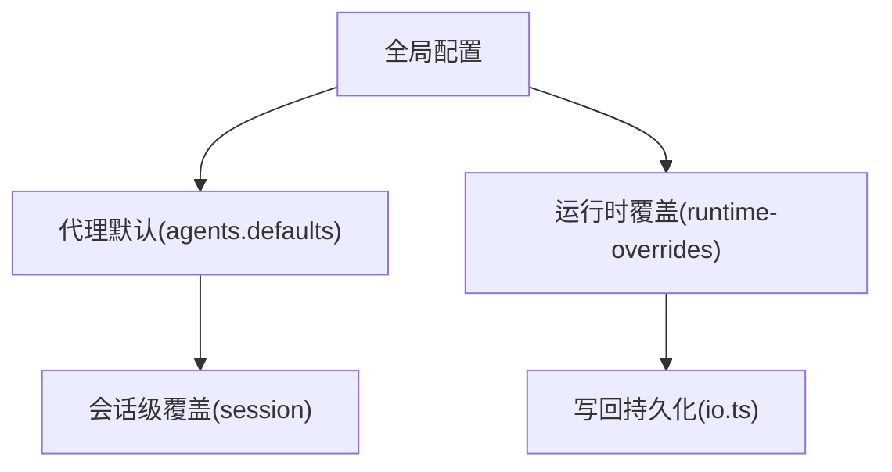
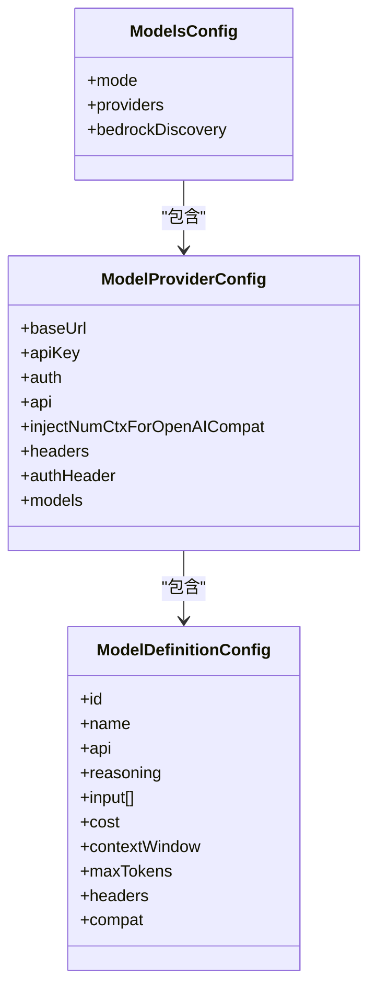
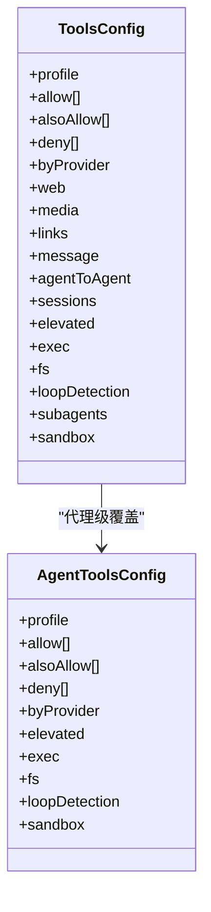
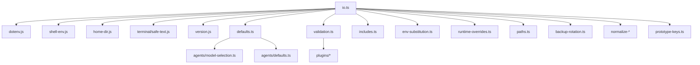

# 代理配置

<cite>
**本文引用的文件**
- [src/config/io.ts](file://src/config/io.ts)
- [src/config/defaults.ts](file://src/config/defaults.ts)
- [src/config/validation.ts](file://src/config/validation.ts)
- [src/config/types.ts](file://src/config/types.ts)
- [src/config/types.models.ts](file://src/config/types.models.ts)
- [src/config/types.tools.ts](file://src/config/types.tools.ts)
- [src/config/merge-config.ts](file://src/config/merge-config.ts)
- [src/config/merge-patch.ts](file://src/config/merge-patch.ts)
- [src/config/env-substitution.ts](file://src/config/env-substitution.ts)
- [src/config/includes.ts](file://src/config/includes.ts)
- [src/config/runtime-overrides.ts](file://src/config/runtime-overrides.ts)
- [src/config/paths.ts](file://src/config/paths.ts)
- [src/config/version.ts](file://src/config/version.ts)
- [src/config/talk.ts](file://src/config/talk.ts)
- [src/config/agent-limits.ts](file://src/config/agent-limits.ts)
- [src/agents/model-selection.ts](file://src/agents/model-selection.ts)
- [src/agents/defaults.ts](file://src/agents/defaults.ts)
- [src/infra/dotenv.js](file://src/infra/dotenv.js)
- [src/infra/shell-env.js](file://src/infra/shell-env.js)
- [src/infra/home-dir.js](file://src/infra/home-dir.js)
- [src/plugins/config-state.js](file://src/plugins/config-state.js)
- [src/plugins/manifest-registry.js](file://src/plugins/manifest-registry.js)
- [src/plugins/schema-validator.js](file://src/plugins/schema-validator.js)
- [src/shared/avatar-policy.js](file://src/shared/avatar-policy.js)
- [src/shared/net/ip.js](file://src/shared/net/ip.js)
- [src/utils.js](file://src/utils.js)
- [src/agents/owner-display.js](file://src/agents/owner-display.js)
- [src/terminal/safe-text.js](file://src/terminal/safe-text.js)
- [src/version.js](file://src/version.js)
- [src/config/backup-rotation.ts](file://src/config/backup-rotation.ts)
- [src/config/normalize-exec-safe-bin.ts](file://src/config/normalize-exec-safe-bin.ts)
- [src/config/normalize-paths.ts](file://src/config/normalize-paths.ts)
- [src/config/prototype-keys.ts](file://src/config/prototype-keys.ts)
- [src/config/redact-snapshot.ts](file://src/config/redact-snapshot.ts)
- [src/config/schema.hints.ts](file://src/config/schema.hints.ts)
- [src/config/schema.help.ts](file://src/config/schema.help.ts)
- [src/config/legacy.ts](file://src/config/legacy.ts)
- [src/config/legacy.migrations.ts](file://src/config/legacy.migrations.ts)
- [src/config/legacy.migrations.part-1.ts](file://src/config/legacy.migrations.part-1.ts)
- [src/config/legacy.migrations.part-2.ts](file://src/config/legacy.migrations.part-2.ts)
- [src/config/legacy.migrations.part-3.ts](file://src/config/legacy.migrations.part-3.ts)
- [src/config/legacy.rules.ts](file://src/config/legacy.rules.ts)
- [src/config/legacy.shared.ts](file://src/config/legacy.shared.ts)
- [src/config/legacy.migrate.ts](file://src/config/legacy.migrate.ts)
- [src/config/legacy.migrate.test.ts](file://src/config/legacy.migrate.test.ts)
- [src/config/legacy.migrate.test-helpers.ts](file://src/config/legacy.migrate.test-helpers.ts)
- [src/config/legacy.shared.test.ts](file://src/config/legacy.shared.test.ts)
- [src/config/legacy.rules.test.ts](file://src/config/legacy.rules.test.ts)
- [src/config/legacy.migrations.test.ts](file://src/config/legacy.migrations.test.ts)
- [src/config/legacy.migrations.part-1.test.ts](file://src/config/legacy.migrations.part-1.test.ts)
- [src/config/legacy.migrations.part-2.test.ts](file://src/config/legacy.migrations.part-2.test.ts)
- [src/config/legacy.migrations.part-3.test.ts](file://src/config/legacy.migrations.part-3.test.ts)
- [src/config/legacy.migrations.test-helpers.ts](file://src/config/legacy.migrations.test-helpers.ts)
- [src/config/legacy.config-detection.test.ts](file://src/config/legacy.config-detection.test.ts)
- [src/config/legacy.config-detection.accepts-imessage-dmpolicy.test.ts](file://src/config/legacy.config-detection.accepts-imessage-dmpolicy.test.ts)
- [src/config/legacy.config-detection.rejects-routing-allowfrom.test.ts](file://src/config/legacy.config-detection.rejects-routing-allowfrom.test.ts)
- [src/config/legacy.config-detection.accepts-imessage-dmpolicy.ts](file://src/config/legacy.config-detection.accepts-imessage-dmpolicy.ts)
- [src/config/legacy.config-detection.rejects-routing-allowfrom.ts](file://src/config/legacy.config-detection.rejects-routing-allowfrom.ts)
- [src/config/legacy.config-detection.ts](file://src/config/legacy.config-detection.ts)
- [src/config/legacy.config-detection.test-helpers.ts](file://src/config/legacy.config-detection.test-helpers.ts)
- [src/config/legacy.config-detection.test-helpers.ts](file://src/config/legacy.config-detection.test-helpers.ts)
- [src/config/legacy.config-detection.ts](file://src/config/legacy.config-detection.ts)
- [src/config/legacy.config-detection.test.ts](file://src/config/legacy.config-detection.test.ts)
- [src/config/legacy.config-detection.accepts-imessage-dmpolicy.ts](file://src/config/legacy.config-detection.accepts-imessage-dmpolicy.ts)
- [src/config/legacy.config-detection.rejects-routing-allowfrom.ts](file://src/config/legacy.config-detection.rejects-routing-allowfrom.ts)
- [src/config/legacy.config-detection.test-helpers.ts](file://src/config/legacy.config-detection.test-helpers.ts)
- [src/config/legacy.config-detection.test-helpers.ts](file://src/config/legacy.config-detection.test-helpers.ts)
- [src/config/legacy.config-detection.ts](file://src/config/legacy.config-detection.ts)
- [src/config/legacy.config-detection.test.ts](file://src/config/legacy.config-detection.test.ts)
- [src/config/legacy.config-detection.accepts-imessage-dmpolicy.ts](file://src/config/legacy.config-detection.accepts-imessage-dmpolicy.ts)
- [src/config/legacy.config-detection.rejects-routing-allowfrom.ts](file://src/config/legacy.config-detection.rejects-routing-allowfrom.ts)
- [src/config/legacy.config-detection.test-helpers.ts](file://src/config/legacy.config-detection.test-helpers.ts)
- [src/config/legacy.config-detection.test-helpers.ts](file://src/config/legacy.config-detection.test-helpers.ts)
- [src/config/legacy.config-detection.ts](file://src/config/legacy.config-detection.ts)
- [src/config/legacy.config-detection.test.ts](file://src/config/legacy.config-detection.test.ts)
- [src/config/legacy.config-detection.accepts-imessage-dmpolicy.ts](file://src/config/legacy.config-detection.accepts-imessage-dmpolicy.ts)
- [src/config/legacy.config-detection.rejects-routing-allowfrom.ts](file://src/config/legacy.config-detection.rejects-routing-allowfrom.ts)
- [src/config/legacy.config-detection.test-helpers.ts](file://src/config/legacy.config-detection.test-helpers.ts)
- [src/config/legacy.config-detection.test-helpers.ts](file://src/config/legacy.config-detection.test-helpers.ts)
- [src/config/legacy.config-detection.ts](file://src/config/legacy.config-detection.ts)
- [src/config/legacy.config-detection.test.ts](file://src/config/legacy.config-detection.test.ts)
- [src/config/legacy.config-detection.accepts-imessage-dmpolicy.ts](file://src/config/legacy.config-detection.accepts-imessage-dmpolicy.ts)
- [src/config/legacy.config-detection.rejects-routing-allowfrom.ts](file://src/config/legacy.config-detection.rejects-routing-allowfrom.ts)
- [src/config/legacy.config-detection.test-helpers.ts](file://src/config/legacy.config-detection.test-helpers.ts)
- [src/config/legacy.config-detection.test-helpers.ts](file://src/config/legacy.config-detection.test-helpers.ts)
- [src/config/legacy.config-detection.ts](file://src/config/legacy.config-detection.ts)
- [src/config/legacy.config-detection.test.ts](file://src/config/legacy.config-detection.test.ts)
- [src/config/legacy.config-detection.accepts-imessage-dmpolicy.ts](file://src/config/legacy.config-detection.accepts-imessage-dmpolicy.ts)
- [src/config/legacy.config-detection.rejects-routing-allowfrom.ts](file://src/config/legacy.config-detection.rejects-routing-allowfrom.ts)
- [src/config/legacy.config-detection.test-helpers.ts](file://src/config/legacy.config-detection.test-helpers.ts)
- [src/config/legacy.config-detection.test-helpers.ts](file://src/config/legacy.config-detection.test-helpers.ts)
- [src/config/legacy.config-detection.ts](file://src/config/legacy.config-detection.ts)
- [src/config/legacy.config-detection.test.ts](file://src/config/legacy.config-detection.test.ts)
- [src/config/legacy.config-detection.accepts-imessage-dmpolicy.ts](file://src/config/legacy.config-detection.accepts-imessage-dmpolicy.ts)
- [src/config/legacy.config-detection.rejects-routing-allowfrom.ts](file://src/config/legacy.config-detection.rejects-routing-allowfrom.ts)
- [src/config/legacy.config-detection.test-helpers.ts](file://src/config/legacy.config-detection.test-helpers.ts)
- [src/config/legacy.config-detection.test-helpers.ts](file://src/config/legacy.config-detection.test-helpers.ts......
</cite>

## 目录
1. [简介](#简介)
2. [项目结构](#项目结构)
3. [核心组件](#核心组件)
4. [架构总览](#架构总览)
5. [详细组件分析](#详细组件分析)
6. [依赖分析](#依赖分析)
7. [性能考虑](#性能考虑)
8. [故障排查指南](#故障排查指南)
9. [结论](#结论)
10. [附录](#附录)

## 简介
本文件面向 OpenClaw 代理配置系统，系统性阐述配置的层次结构（全局、代理特定、会话级）、优先级与继承关系；模型选择与切换（别名、提供商标识、自动故障转移）；系统提示词（模板、参数注入、动态调整）；工具权限与安全策略（白名单、执行限制、沙箱）；以及配置验证、热重载与版本兼容管理的最佳实践。

## 项目结构
OpenClaw 的配置子系统由“读写 IO”“默认值应用”“校验与插件解析”“类型定义”“合并与补丁”“环境变量与包含文件”等模块组成，形成从磁盘到运行时配置的完整闭环，并在启动与运行期支持热重载与版本兼容检查。

图表来源
- [src/config/io.ts:1-800](file://src/config/io.ts#L1-L800)
- [src/config/defaults.ts:1-537](file://src/config/defaults.ts#L1-L537)
- [src/config/validation.ts:1-605](file://src/config/validation.ts#L1-L605)
- [src/config/types.ts:1-36](file://src/config/types.ts#L1-L36)
- [src/config/types.models.ts:1-77](file://src/config/types.models.ts#L1-L77)
- [src/config/types.tools.ts:1-623](file://src/config/types.tools.ts#L1-L623)
- [src/config/merge-config.ts:1-39](file://src/config/merge-config.ts#L1-L39)
- [src/config/merge-patch.ts](file://src/config/merge-patch.ts)
- [src/config/env-substitution.ts](file://src/config/env-substitution.ts)
- [src/config/includes.ts](file://src/config/includes.ts)
- [src/config/runtime-overrides.ts](file://src/config/runtime-overrides.ts)
- [src/config/paths.ts](file://src/config/paths.ts)
- [src/config/version.ts](file://src/config/version.ts)
- [src/config/legacy.ts](file://src/config/legacy.ts)
- [src/config/legacy.migrations.ts](file://src/config/legacy.migrations.ts)

章节来源
- [src/config/io.ts:1-800](file://src/config/io.ts#L1-L800)
- [src/config/types.ts:1-36](file://src/config/types.ts#L1-L36)

## 核心组件
- 配置读写与热重载：负责从磁盘加载、解析、包含展开、环境变量替换、校验、默认值填充、写回与审计日志、哈希比较与变更路径收集。
- 默认值与规范化：对模型、代理并发、日志脱敏、上下文修剪、会话键等进行默认值与规范化处理。
- 插件与工具校验：解析插件清单、校验插件配置模式、通道合法性、心跳目标、工具循环检测等。
- 类型与模式：统一的配置类型定义与 Zod 模式，确保结构化约束与可扩展性。
- 合并与补丁：支持按段落合并与 JSON Merge Patch，用于增量更新与回退。
- 环境与包含：支持 dotenv 注入、shell 环境回退、配置 include 展开与路径归一化。
- 兼容与迁移：遗留配置检测与迁移、版本比较与未来版本警告。

章节来源
- [src/config/io.ts:1-800](file://src/config/io.ts#L1-L800)
- [src/config/defaults.ts:1-537](file://src/config/defaults.ts#L1-L537)
- [src/config/validation.ts:1-605](file://src/config/validation.ts#L1-L605)
- [src/config/types.models.ts:1-77](file://src/config/types.models.ts#L1-L77)
- [src/config/types.tools.ts:1-623](file://src/config/types.tools.ts#L1-L623)
- [src/config/merge-config.ts:1-39](file://src/config/merge-config.ts#L1-L39)
- [src/config/env-substitution.ts](file://src/config/env-substitution.ts)
- [src/config/includes.ts](file://src/config/includes.ts)
- [src/config/runtime-overrides.ts](file://src/config/runtime-overrides.ts)
- [src/config/paths.ts](file://src/config/paths.ts)
- [src/config/version.ts](file://src/config/version.ts)
- [src/config/legacy.ts](file://src/config/legacy.ts)

## 架构总览
下图展示从磁盘到运行时配置的关键流程：读取→包含展开→环境变量替换→校验→默认值应用→写回与审计→热重载与版本兼容检查。

图表来源
- [src/config/io.ts:734-800](file://src/config/io.ts#L734-L800)
- [src/config/includes.ts](file://src/config/includes.ts)
- [src/config/env-substitution.ts](file://src/config/env-substitution.ts)
- [src/config/validation.ts:229-286](file://src/config/validation.ts#L229-L286)
- [src/config/defaults.ts:213-347](file://src/config/defaults.ts#L213-L347)
- [src/config/runtime-overrides.ts](file://src/config/runtime-overrides.ts)

## 详细组件分析

### 配置层次结构与优先级
- 全局配置：位于配置根层级，影响所有代理与会话的默认行为（如模型、工具、日志、消息等）。
- 代理特定配置：在 agents.defaults 或 agents.list 中针对代理进行覆盖（并发、模型主备、心跳、上下文修剪等）。
- 会话级配置：通过 session.mainKey 与运行时注入实现，会话级别可覆盖代理默认，但不改变全局默认。
- 继承与优先级：代理默认覆盖全局；会话覆盖代理默认；运行时覆盖仅在热重载时生效且可被持久化写回。

图表来源
- [src/config/io.ts:734-800](file://src/config/io.ts#L734-L800)
- [src/config/defaults.ts:146-170](file://src/config/defaults.ts#L146-L170)
- [src/config/runtime-overrides.ts](file://src/config/runtime-overrides.ts)

章节来源
- [src/config/defaults.ts:146-170](file://src/config/defaults.ts#L146-L170)
- [src/config/io.ts:734-800](file://src/config/io.ts#L734-L800)

### 系统提示词：模板、参数注入与动态调整
- 提示词模板：通过 agents.defaults 或 agents.list 下的提示词字段进行模板化配置，支持多语言与多通道适配。
- 参数注入：利用环境变量替换机制（${VAR}）与 config.env，将外部参数注入到提示词模板中，避免硬编码。
- 动态调整：运行时覆盖（runtime-overrides）允许在不修改持久化配置的前提下临时调整提示词或相关参数，适用于 A/B 实验或紧急修复。

章节来源
- [src/config/env-substitution.ts](file://src/config/env-substitution.ts)
- [src/config/runtime-overrides.ts](file://src/config/runtime-overrides.ts)
- [src/config/validation.ts:229-286](file://src/config/validation.ts#L229-L286)

### 模型选择与切换：别名、提供商标识与自动故障转移
- 模型别名：内置常见提供商标识与别名映射，简化用户配置（如 gpt、gemini 等），并在代理默认中自动补全。
- 提供商标识：模型定义包含 provider 与 api 字段，支持多提供商与不同 API 兼容层（如 anthropic-messages、google-generative-ai 等）。
- 自动故障转移：通过 models.providers 的多模型列表与 fallbacks 语义，在主模型不可用时自动切换到备用模型；结合缓存保留策略与上下文修剪策略，提升稳定性。
- 令牌与成本：模型定义包含 cost、contextWindow、maxTokens 等字段，支持成本控制与上下文窗口优化。

图表来源
- [src/config/types.models.ts:72-77](file://src/config/types.models.ts#L72-L77)
- [src/config/types.models.ts:52-61](file://src/config/types.models.ts#L52-L61)
- [src/config/types.models.ts:34-50](file://src/config/types.models.ts#L34-L50)

章节来源
- [src/config/types.models.ts:1-77](file://src/config/types.models.ts#L1-L77)
- [src/config/defaults.ts:213-347](file://src/config/defaults.ts#L213-L347)
- [src/agents/model-selection.ts](file://src/agents/model-selection.ts)
- [src/agents/defaults.ts](file://src/agents/defaults.ts)

### 工具权限与安全策略：白名单、执行限制与沙箱
- 工具白名单与拒绝：支持全局与代理级的 allow/deny/alsoAllow，以及按提供商标识的细粒度覆盖。
- 执行限制：exec.host、exec.security、exec.ask 等字段控制执行宿主、安全模式与审批策略；safeBins 与 safeBinProfiles 支持受控命令执行。
- 沙箱策略：sandbox.tools.allow/deny 控制沙箱内可用工具集；workspaceOnly 限制文件系统访问范围。
- 循环检测：tool.loopDetection 提供重复调用、无进展轮询等检测阈值与告警/阻断策略。
- 升级执行：elevated 模式允许跨代理/跨会话的受限执行，需经 allowFrom 审批。

图表来源
- [src/config/types.tools.ts:445-623](file://src/config/types.tools.ts#L445-L623)
- [src/config/types.tools.ts:285-313](file://src/config/types.tools.ts#L285-L313)

章节来源
- [src/config/types.tools.ts:1-623](file://src/config/types.tools.ts#L1-L623)
- [src/config/normalize-exec-safe-bin.ts](file://src/config/normalize-exec-safe-bin.ts)

### 配置合并与补丁：增量更新与回退
- 分段合并：mergeConfigSection 支持对对象字段进行选择性覆盖与 unsetOnUndefined 删除。
- WhatsApp 配置合并：提供专用合并函数，便于按通道维度增量更新。
- JSON Merge Patch：支持生成最小差异补丁，便于回滚与审计。

章节来源
- [src/config/merge-config.ts:1-39](file://src/config/merge-config.ts#L1-L39)
- [src/config/merge-patch.ts](file://src/config/merge-patch.ts)

### 配置验证、热重载与版本兼容
- 验证：Zod 模式 + 插件清单校验 + 通道与心跳目标合法性检查；支持 warnings 输出。
- 热重载：运行时快照刷新与 handler 回调，支持在不重启进程的情况下应用新配置。
- 版本兼容：记录 lastTouchedVersion 与 lastTouchedAt，比较当前版本与配置版本，若配置来自未来版本则发出警告。

章节来源
- [src/config/validation.ts:229-286](file://src/config/validation.ts#L229-L286)
- [src/config/io.ts:144-158](file://src/config/io.ts#L144-L158)
- [src/config/version.ts](file://src/config/version.ts)
- [src/version.ts](file://src/version.js)

## 依赖分析
- 配置 IO 依赖 dotenv、shell-env、home-dir、终端安全文本、版本比较等基础设施。
- 默认值应用依赖模型选择、代理默认、Talk 配置等模块。
- 校验依赖插件清单注册表、JSON Schema 校验器、通道与网络策略等。
- 合并与补丁依赖路径归一化、原型键防护、备份轮转等辅助模块。

图表来源
- [src/config/io.ts:1-800](file://src/config/io.ts#L1-L800)
- [src/config/defaults.ts:1-537](file://src/config/defaults.ts#L1-L537)
- [src/config/validation.ts:1-605](file://src/config/validation.ts#L1-L605)
- [src/infra/dotenv.js](file://src/infra/dotenv.js)
- [src/infra/shell-env.js](file://src/infra/shell-env.js)
- [src/infra/home-dir.js](file://src/infra/home-dir.js)
- [src/terminal/safe-text.js](file://src/terminal/safe-text.js)
- [src/version.js](file://src/version.js)
- [src/agents/model-selection.ts](file://src/agents/model-selection.ts)
- [src/agents/defaults.ts](file://src/agents/defaults.ts)
- [src/plugins/config-state.js](file://src/plugins/config-state.js)
- [src/plugins/manifest-registry.js](file://src/plugins/manifest-registry.js)
- [src/plugins/schema-validator.js](file://src/plugins/schema-validator.js)
- [src/config/includes.ts](file://src/config/includes.ts)
- [src/config/env-substitution.ts](file://src/config/env-substitution.ts)
- [src/config/runtime-overrides.ts](file://src/config/runtime-overrides.ts)
- [src/config/paths.ts](file://src/config/paths.ts)
- [src/config/backup-rotation.ts](file://src/config/backup-rotation.ts)
- [src/config/normalize-exec-safe-bin.ts](file://src/config/normalize-exec-safe-bin.ts)
- [src/config/normalize-paths.ts](file://src/config/normalize-paths.ts)
- [src/config/prototype-keys.ts](file://src/config/prototype-keys.ts)

## 性能考虑
- 配置读取与解析：尽量减少 include 层级深度与大文件嵌入，避免在热路径上触发大规模重载。
- 默认值应用：仅在必要时进行，避免对未使用字段的过度计算。
- 校验与插件解析：在启动阶段完成，运行期通过运行时快照最小化变更。
- 日志与审计：写入审计文件为异步与追加写，注意磁盘空间与权限（700）。
- 模型与工具：合理设置并发与超时，避免阻塞代理循环。

## 故障排查指南
- 配置无效或报错：
  - 使用 validateConfigObjectRawWithPlugins 获取详细问题列表与建议值集合。
  - 关注 allowedValues 提示与 allowedValuesHiddenCount，快速定位非法值。
- 环境变量缺失：
  - 查看 env-substitution 警告，确认 ${VAR} 引用是否在 config.env 或进程环境中提供。
- 包含文件错误：
  - 检查 includes.ts 抛出的异常，确认 include 路径与权限。
- 运行时覆盖失败：
  - 检查 ConfigRuntimeRefreshError 与 clearOnRefreshFailure 回调。
- 版本不兼容：
  - 若配置 lastTouchedVersion 新于当前版本，将收到警告；建议升级运行时或降级配置。
- 插件问题：
  - plugins.entries 中不存在的插件 ID 将产生警告或错误；移除或修正插件条目。

章节来源
- [src/config/validation.ts:117-140](file://src/config/validation.ts#L117-L140)
- [src/config/validation.ts:300-306](file://src/config/validation.ts#L300-L306)
- [src/config/env-substitution.ts](file://src/config/env-substitution.ts)
- [src/config/includes.ts](file://src/config/includes.ts)
- [src/config/io.ts:153-158](file://src/config/io.ts#L153-L158)
- [src/config/version.ts](file://src/config/version.ts)
- [src/config/validation.ts:467-490](file://src/config/validation.ts#L467-490)

## 结论
OpenClaw 的代理配置系统以类型驱动、严格校验与可扩展插件为核心，通过“全局—代理—会话—运行时”的分层与优先级设计，实现了灵活而安全的配置管理。配合模型别名、提供商标识与自动故障转移，工具白名单与沙箱策略，以及热重载与版本兼容检查，满足从开发到生产的多样化需求。

## 附录
- 最佳实践
  - 使用 alsoAllow 增量添加而非完全替换 allow 列表。
  - 在 config.env 中集中管理敏感参数，配合 ${VAR} 注入。
  - 对模型与工具设置合理的并发与超时，启用循环检测保护。
  - 使用 merge-patch 生成最小差异补丁，便于回滚与审计。
  - 定期检查版本兼容性，避免配置来自未来版本导致的异常。
- 示例参考
  - 模型别名与默认值应用：[src/config/defaults.ts:213-347](file://src/config/defaults.ts#L213-L347)
  - 工具白名单与执行限制：[src/config/types.tools.ts:445-623](file://src/config/types.tools.ts#L445-L623)
  - 配置合并与补丁：[src/config/merge-config.ts:1-39](file://src/config/merge-config.ts#L1-L39)
  - 环境变量与包含：[src/config/env-substitution.ts](file://src/config/env-substitution.ts), [src/config/includes.ts](file://src/config/includes.ts)
  - 热重载与版本兼容：[src/config/io.ts:144-158](file://src/config/io.ts#L144-L158), [src/config/version.ts](file://src/config/version.ts)