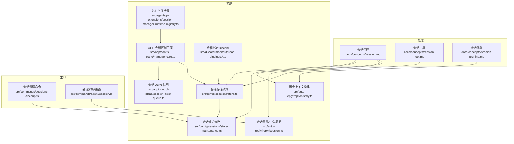
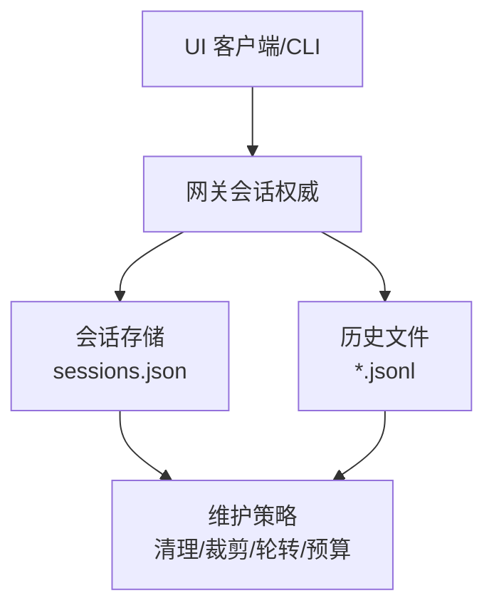
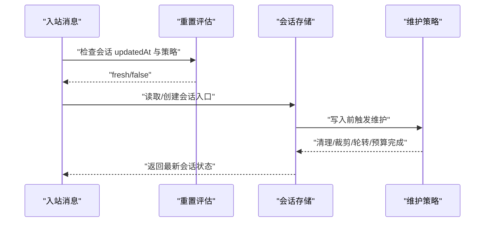
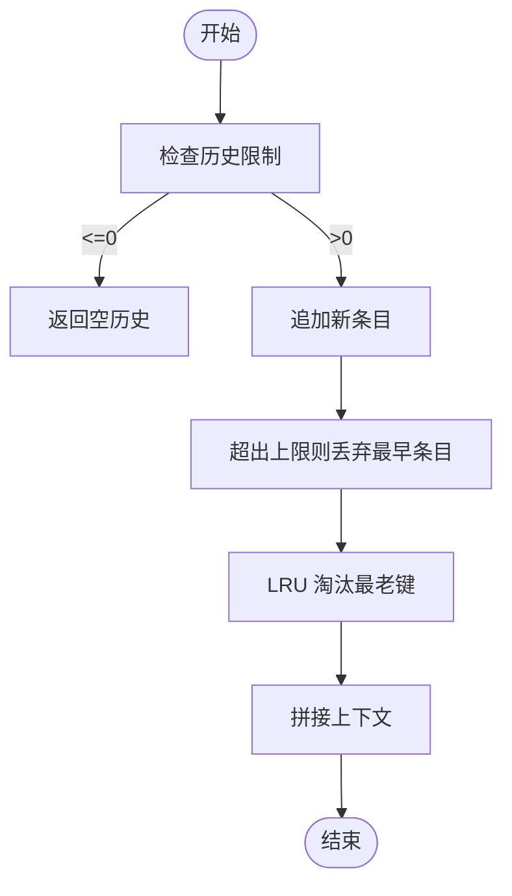
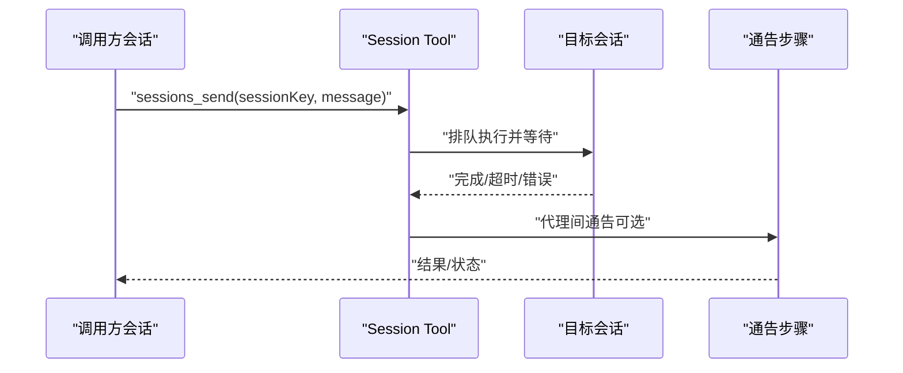
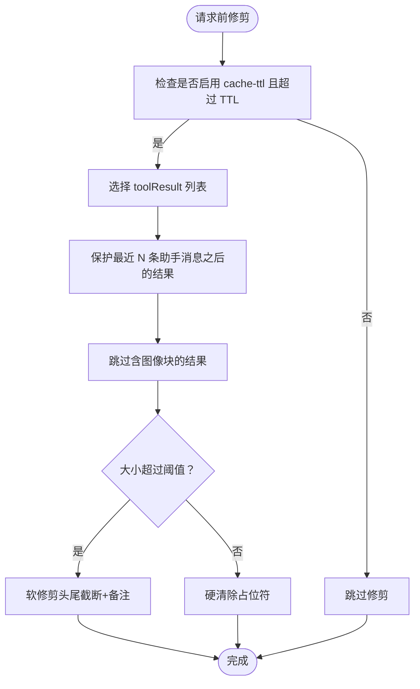
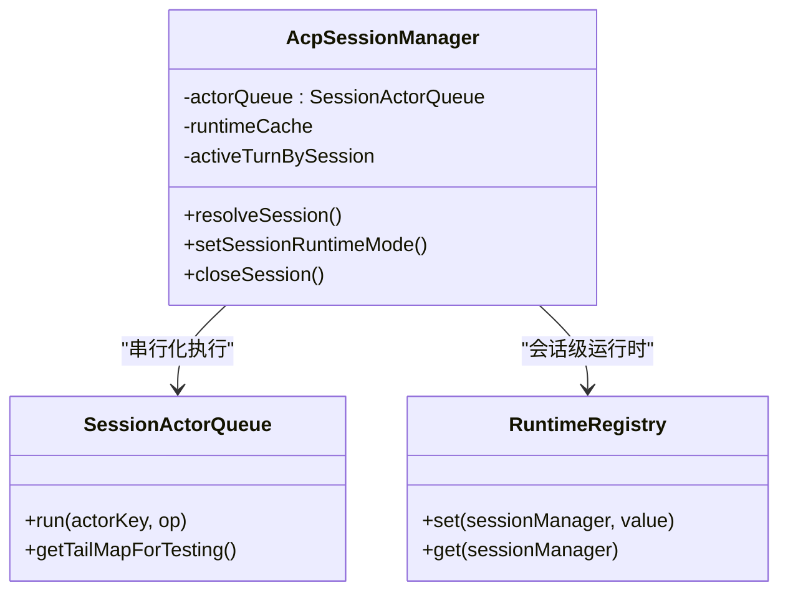
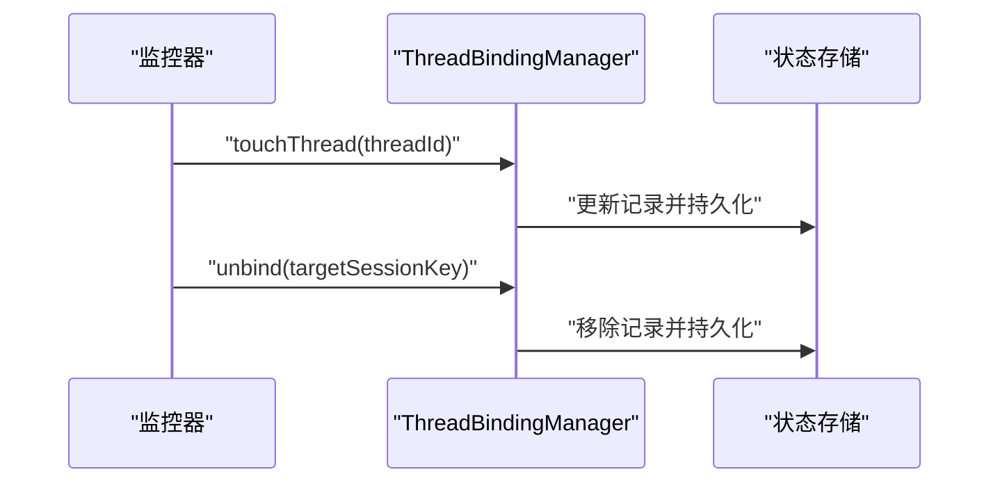
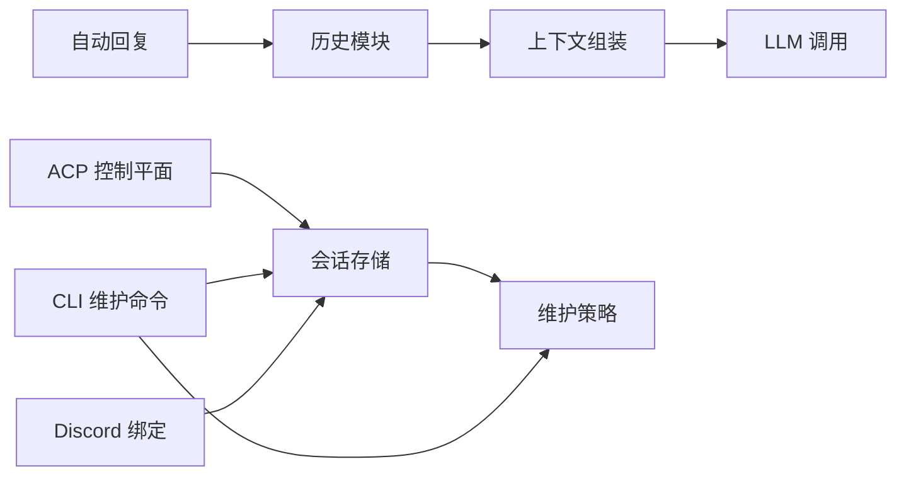

# 会话管理

<cite>
**本文引用的文件**
- [docs/concepts/session.md](file://docs/concepts/session.md)
- [docs/concepts/session-tool.md](file://docs/concepts/session-tool.md)
- [docs/concepts/session-pruning.md](file://docs/concepts/session-pruning.md)
- [src/config/sessions/store.ts](file://src/config/sessions/store.ts)
- [src/config/sessions/store-maintenance.ts](file://src/config/sessions/store-maintenance.ts)
- [src/auto-reply/reply/history.ts](file://src/auto-reply/reply/history.ts)
- [src/auto-reply/reply/session.ts](file://src/auto-reply/reply/session.ts)
- [src/commands/sessions-cleanup.ts](file://src/commands/sessions-cleanup.ts)
- [src/commands/agent/session.ts](file://src/commands/agent/session.ts)
- [src/acp/control-plane/manager.core.ts](file://src/acp/control-plane/manager.core.ts)
- [src/acp/control-plane/session-actor-queue.ts](file://src/acp/control-plane/session-actor-queue.ts)
- [src/agents/pi-extensions/session-manager-runtime-registry.ts](file://src/agents/pi-extensions/session-manager-runtime-registry.ts)
- [src/discord/monitor/thread-bindings.manager.ts](file://src/discord/monitor/thread-bindings.manager.ts)
- [src/discord/monitor/thread-bindings.state.ts](file://src/discord/monitor/thread-bindings.state.ts)
- [src/discord/monitor/thread-bindings.lifecycle.ts](file://src/discord/monitor/thread-bindings.lifecycle.ts)
</cite>

## 目录
1. [简介](#简介)
2. [项目结构](#项目结构)
3. [核心组件](#核心组件)
4. [架构总览](#架构总览)
5. [详细组件分析](#详细组件分析)
6. [依赖关系分析](#依赖关系分析)
7. [性能考量](#性能考量)
8. [故障排查指南](#故障排查指南)
9. [结论](#结论)
10. [附录](#附录)

## 简介
本文件系统性梳理 OpenClaw 的会话管理系统，围绕以下主题展开：
- 会话模型设计：主会话、群组隔离、激活模式与队列模式的区别与适用场景
- 会话状态管理：消息历史存储、上下文窗口管理、会话元数据维护
- 会话工具（Session Tool）：工具调用的会话绑定、结果持久化与状态同步
- 会话修剪（Session Pruning）策略：历史清理、内存优化与存储管理
- 提供端到端流程示例：会话创建、消息传递、工具调用与会话清理

## 项目结构
OpenClaw 将会话管理拆分为“概念文档 + 核心实现 + 命令行工具”的分层结构：
- 概念层：定义会话键规则、生命周期、维护策略与安全隔离
- 实现层：会话存储读写、维护（清理/裁剪/轮转）、历史上下文构建
- 工具层：CLI 维护命令、自动回复中的指令处理与队列模式、会话工具集

图表来源
- [docs/concepts/session.md:1-311](file://docs/concepts/session.md#L1-L311)
- [docs/concepts/session-tool.md:1-224](file://docs/concepts/session-tool.md#L1-L224)
- [docs/concepts/session-pruning.md:1-122](file://docs/concepts/session-pruning.md#L1-L122)
- [src/config/sessions/store.ts:1-800](file://src/config/sessions/store.ts#L1-L800)
- [src/config/sessions/store-maintenance.ts:1-328](file://src/config/sessions/store-maintenance.ts#L1-L328)
- [src/auto-reply/reply/history.ts:1-194](file://src/auto-reply/reply/history.ts#L1-L194)
- [src/auto-reply/reply/session.ts:528-564](file://src/auto-reply/reply/session.ts#L528-L564)
- [src/commands/sessions-cleanup.ts:52-202](file://src/commands/sessions-cleanup.ts#L52-L202)
- [src/commands/agent/session.ts:108-151](file://src/commands/agent/session.ts#L108-L151)
- [src/acp/control-plane/manager.core.ts:72-434](file://src/acp/control-plane/manager.core.ts#L72-L434)
- [src/acp/control-plane/session-actor-queue.ts:1-38](file://src/acp/control-plane/session-actor-queue.ts#L1-L38)
- [src/agents/pi-extensions/session-manager-runtime-registry.ts:1-29](file://src/agents/pi-extensions/session-manager-runtime-registry.ts#L1-L29)
- [src/discord/monitor/thread-bindings.manager.ts:198-673](file://src/discord/monitor/thread-bindings.manager.ts#L198-L673)
- [src/discord/monitor/thread-bindings.state.ts:64-525](file://src/discord/monitor/thread-bindings.state.ts#L64-L525)
- [src/discord/monitor/thread-bindings.lifecycle.ts:240-275](file://src/discord/monitor/thread-bindings.lifecycle.ts#L240-L275)

章节来源
- [docs/concepts/session.md:1-311](file://docs/concepts/session.md#L1-L311)
- [docs/concepts/session-tool.md:1-224](file://docs/concepts/session-tool.md#L1-L224)
- [docs/concepts/session-pruning.md:1-122](file://docs/concepts/session-pruning.md#L1-L122)

## 核心组件
- 会话存储与维护
  - 会话存储读写：原子写入、缓存、锁队列、迁移与归档
  - 维护策略：过期清理、条目裁剪、文件轮转、磁盘预算
- 历史与上下文
  - 历史映射与 LRU 清理、上下文拼接、待定历史记录
- 生命周期与重置
  - 会话键规则、重置策略（每日/空闲/按类型/按通道）、新会话生成
- 工具与队列
  - 内联指令解析与持久化、队列模式（per-message 覆盖）、会话工具集
- ACP 控制平面
  - 会话解析、运行时句柄、控制能力校验、会话 Actor 队列串行化
- 线程绑定（Discord）
  - 会话与线程绑定、空闲超时、持久化与加载

章节来源
- [src/config/sessions/store.ts:1-800](file://src/config/sessions/store.ts#L1-L800)
- [src/config/sessions/store-maintenance.ts:1-328](file://src/config/sessions/store-maintenance.ts#L1-L328)
- [src/auto-reply/reply/history.ts:1-194](file://src/auto-reply/reply/history.ts#L1-L194)
- [src/auto-reply/reply/session.ts:528-564](file://src/auto-reply/reply/session.ts#L528-L564)
- [src/commands/agent/session.ts:108-151](file://src/commands/agent/session.ts#L108-L151)
- [src/acp/control-plane/manager.core.ts:72-434](file://src/acp/control-plane/manager.core.ts#L72-L434)
- [src/acp/control-plane/session-actor-queue.ts:1-38](file://src/acp/control-plane/session-actor-queue.ts#L1-L38)
- [src/discord/monitor/thread-bindings.manager.ts:198-673](file://src/discord/monitor/thread-bindings.manager.ts#L198-L673)

## 架构总览
OpenClaw 的会话管理以“网关为主、客户端为辅”的权威模型运行。会话状态由网关持有，UI 客户端通过网关查询会话列表与令牌计数；会话存储采用原子写入与缓存，维护策略在写入路径执行；ACP 控制平面负责会话运行时的串行化与能力校验。

图表来源
- [docs/concepts/session.md:57-72](file://docs/concepts/session.md#L57-L72)
- [src/config/sessions/store.ts:340-520](file://src/config/sessions/store.ts#L340-L520)
- [src/config/sessions/store-maintenance.ts:130-148](file://src/config/sessions/store-maintenance.ts#L130-L148)

## 详细组件分析

### 会话模型与键空间设计
- 主会话与群组隔离
  - 主会话键：agent:<agentId>:<mainKey>（默认 main），用于连续性
  - 群组键：agent:<agentId>:<channel>:group:<id> 或 channel 形式
  - Discord 论坛主题：附加 :topic:<threadId>
- DM 隔离策略（dmScope）
  - main：所有 DM 共享主会话
  - per-peer：按发送者 id 隔离
  - per-channel-peer：按频道+发送者隔离
  - per-account-channel-peer：按账户+频道+发送者隔离
- 安全建议
  - 多用户共享收件箱时推荐使用 per-channel-peer 或更高隔离级别，并结合 identityLinks 合并同一人的跨频道会话

章节来源
- [docs/concepts/session.md:10-56](file://docs/concepts/session.md#L10-L56)
- [docs/concepts/session.md:189-201](file://docs/concepts/session.md#L189-L201)

### 会话状态管理与生命周期
- 存储与写入
  - 原子写入 sessions.json，失败重试与回退目录处理
  - 缓存 TTL 支持，避免频繁磁盘 IO
  - 写入前执行维护：过期清理、条目裁剪、归档旧会话历史、轮转大文件、磁盘预算
- 生命周期与重置
  - 评估下一次入站消息时判断是否过期
  - 支持每日重置（本地时间）与空闲重置（可叠加）
  - 支持按类型（direct/group/thread）与按通道覆盖
  - /new 或 /reset 触发新会话 ID 并可设置模型
- 元数据维护
  - 会话入口包含 origin（标签/提供商/路由）、令牌统计、思考/详细级别等字段
  - inbound 上下文可更新会话元数据（不刷新活动时间）

图表来源
- [src/commands/agent/session.ts:108-151](file://src/commands/agent/session.ts#L108-L151)
- [src/auto-reply/reply/session.ts:528-564](file://src/auto-reply/reply/session.ts#L528-L564)
- [src/config/sessions/store.ts:340-520](file://src/config/sessions/store.ts#L340-L520)
- [src/config/sessions/store-maintenance.ts:150-174](file://src/config/sessions/store-maintenance.ts#L150-L174)

章节来源
- [src/commands/agent/session.ts:108-151](file://src/commands/agent/session.ts#L108-L151)
- [src/auto-reply/reply/session.ts:528-564](file://src/auto-reply/reply/session.ts#L528-L564)
- [src/config/sessions/store.ts:195-270](file://src/config/sessions/store.ts#L195-L270)
- [src/config/sessions/store.ts:340-520](file://src/config/sessions/store.ts#L340-L520)
- [src/config/sessions/store-maintenance.ts:130-148](file://src/config/sessions/store-maintenance.ts#L130-L148)

### 消息历史存储与上下文窗口管理
- 历史映射与 LRU
  - 使用 Map 存储每个会话的历史片段，超过阈值时按插入顺序淘汰最老键
  - 待定历史记录支持在当前回合内暂存，最终合并到上下文
- 上下文拼接
  - 将历史文本与当前消息拼接，形成系统提示中的“自上次回复以来的消息”段落
- 清理策略
  - 可配置历史长度上限，避免无限增长

图表来源
- [src/auto-reply/reply/history.ts:13-28](file://src/auto-reply/reply/history.ts#L13-L28)
- [src/auto-reply/reply/history.ts:52-75](file://src/auto-reply/reply/history.ts#L52-L75)
- [src/auto-reply/reply/history.ts:106-125](file://src/auto-reply/reply/history.ts#L106-L125)
- [src/auto-reply/reply/history.ts:175-193](file://src/auto-reply/reply/history.ts#L175-L193)

章节来源
- [src/auto-reply/reply/history.ts:1-194](file://src/auto-reply/reply/history.ts#L1-L194)

### 会话工具（Session Tool）：调用、绑定与同步
- 工具集合
  - sessions_list、sessions_history、sessions_send、sessions_spawn
- 会话键与可见性
  - 键规则：main、group、cron、hook、node 等
  - 可见性：self（仅当前）、tree（当前+子会话）、agent（同 agent）、all（跨 agent，需授权）
- sessions_send
  - 支持阻塞等待或异步返回，带代理间通告与 ping-pong 回路
- sessions_spawn
  - 在隔离会话中启动子代理，支持线程绑定、附件、归档策略与通告

图表来源
- [docs/concepts/session-tool.md:78-106](file://docs/concepts/session-tool.md#L78-L106)
- [docs/concepts/session-tool.md:144-184](file://docs/concepts/session-tool.md#L144-L184)

章节来源
- [docs/concepts/session-tool.md:1-224](file://docs/concepts/session-tool.md#L1-L224)

### 会话修剪（Session Pruning）策略
- 目标
  - 在每次 LLM 请求前，从内存上下文中修剪旧的 toolResult，减少上下文膨胀
- 触发条件
  - Anthropic API 的 cache-ttl 模式：当最后一次调用已超过 TTL 且启用 cache-ttl
- 行为
  - 仅修剪 toolResult，保留用户/助手消息
  - 保护最近若干条助手消息
  - 图像块结果跳过修剪
  - 支持软修剪（头尾截断+备注）与硬清除（替换占位符）
- 与其他限流的关系
  - built-in 工具自带截断；修剪是额外的请求级清理层

图表来源
- [docs/concepts/session-pruning.md:13-19](file://docs/concepts/session-pruning.md#L13-L19)
- [docs/concepts/session-pruning.md:66-87](file://docs/concepts/session-pruning.md#L66-L87)

章节来源
- [docs/concepts/session-pruning.md:1-122](file://docs/concepts/session-pruning.md#L1-L122)

### ACP 控制平面与会话 Actor 队列
- 会话解析与运行时
  - 解析会话键、读取会话元数据、确保运行时句柄可用、校验控制能力
- 串行化与并发控制
  - 以会话为键的异步队列，保证同一会话内的操作串行执行
- 运行时注册表
  - 以对象身份为键的弱映射，用于会话级运行时注册与复用

图表来源
- [src/acp/control-plane/manager.core.ts:72-434](file://src/acp/control-plane/manager.core.ts#L72-L434)
- [src/acp/control-plane/session-actor-queue.ts:1-38](file://src/acp/control-plane/session-actor-queue.ts#L1-L38)
- [src/agents/pi-extensions/session-manager-runtime-registry.ts:1-29](file://src/agents/pi-extensions/session-manager-runtime-registry.ts#L1-L29)

章节来源
- [src/acp/control-plane/manager.core.ts:72-434](file://src/acp/control-plane/manager.core.ts#L72-L434)
- [src/acp/control-plane/session-actor-queue.ts:1-38](file://src/acp/control-plane/session-actor-queue.ts#L1-L38)
- [src/agents/pi-extensions/session-manager-runtime-registry.ts:1-29](file://src/agents/pi-extensions/session-manager-runtime-registry.ts#L1-L29)

### 线程绑定（Discord）与会话关联
- 绑定管理
  - 通过 ThreadBindingManager 将会话与线程绑定，支持空闲超时、最大存活时间、持久化与加载
- 生命周期
  - touchThread 更新活动时间与持久化
  - unbind 支持按会话或按线程解除绑定
- 状态持久化
  - 以 JSON 文件形式保存绑定记录，支持最小间隔持久化

图表来源
- [src/discord/monitor/thread-bindings.manager.ts:198-673](file://src/discord/monitor/thread-bindings.manager.ts#L198-L673)
- [src/discord/monitor/thread-bindings.state.ts:434-461](file://src/discord/monitor/thread-bindings.state.ts#L434-L461)
- [src/discord/monitor/thread-bindings.lifecycle.ts:240-275](file://src/discord/monitor/thread-bindings.lifecycle.ts#L240-L275)

章节来源
- [src/discord/monitor/thread-bindings.manager.ts:198-673](file://src/discord/monitor/thread-bindings.manager.ts#L198-L673)
- [src/discord/monitor/thread-bindings.state.ts:64-525](file://src/discord/monitor/thread-bindings.state.ts#L64-L525)
- [src/discord/monitor/thread-bindings.lifecycle.ts:240-275](file://src/discord/monitor/thread-bindings.lifecycle.ts#L240-L275)

## 依赖关系分析
- 低耦合高内聚
  - 会话存储与维护解耦于自动回复逻辑与 ACP 控制平面
  - 历史模块独立于存储，仅依赖键空间与限制参数
- 关键依赖链
  - 自动回复 → 历史构建 → 上下文组装 → LLM 调用
  - ACP 控制平面 → 会话存储（读取/写入）→ 维护策略
  - CLI 维护命令 → 维护策略 → 存储写入
- 外部集成点
  - Discord 线程绑定通过状态文件持久化，避免与核心存储耦合

图表来源
- [src/auto-reply/reply/history.ts:1-194](file://src/auto-reply/reply/history.ts#L1-L194)
- [src/config/sessions/store.ts:340-520](file://src/config/sessions/store.ts#L340-L520)
- [src/config/sessions/store-maintenance.ts:130-148](file://src/config/sessions/store-maintenance.ts#L130-L148)
- [src/commands/sessions-cleanup.ts:52-202](file://src/commands/sessions-cleanup.ts#L52-L202)
- [src/discord/monitor/thread-bindings.state.ts:434-461](file://src/discord/monitor/thread-bindings.state.ts#L434-L461)

章节来源
- [src/config/sessions/store.ts:340-520](file://src/config/sessions/store.ts#L340-L520)
- [src/config/sessions/store-maintenance.ts:130-148](file://src/config/sessions/store-maintenance.ts#L130-L148)
- [src/commands/sessions-cleanup.ts:52-202](file://src/commands/sessions-cleanup.ts#L52-L202)

## 性能考量
- 写入路径开销
  - 维护工作在写入路径执行，大规模会话存储会增加写延迟
  - 建议同时设置时间与数量限制，并在需要时启用磁盘预算
- 缓存与锁
  - 会话存储缓存与写锁队列降低竞争与重复 IO
- 历史与上下文
  - 合理的历史长度限制与修剪策略可显著降低上下文体积与计算成本

## 故障排查指南
- 维护预览与强制执行
  - 使用 openclaw sessions cleanup 预览影响或强制清理
- 会话重置问题
  - 检查重置策略（每日/空闲/按类型/按通道）与触发词
- 磁盘空间不足
  - 启用磁盘预算与高水位线，定期轮转 sessions.json
- 线程绑定异常
  - 检查绑定记录持久化与空闲超时设置

章节来源
- [src/commands/sessions-cleanup.ts:52-202](file://src/commands/sessions-cleanup.ts#L52-L202)
- [src/config/sessions/store-maintenance.ts:130-148](file://src/config/sessions/store-maintenance.ts#L130-L148)
- [src/discord/monitor/thread-bindings.state.ts:434-461](file://src/discord/monitor/thread-bindings.state.ts#L434-L461)

## 结论
OpenClaw 的会话管理体系通过权威的网关模型、健壮的存储与维护策略、灵活的键空间与隔离机制、以及完善的工具集与控制平面，实现了高可用、可扩展且安全的多通道会话管理。配合修剪与预算策略，可在长期内保持稳定的性能与资源占用。

## 附录
- 会话创建与消息传递（端到端流程示例）
  - 解析/重置会话键与策略：[src/commands/agent/session.ts:108-151](file://src/commands/agent/session.ts#L108-L151)
  - 读取/写入会话存储与维护：[src/config/sessions/store.ts:195-270](file://src/config/sessions/store.ts#L195-L270)、[src/config/sessions/store.ts:340-520](file://src/config/sessions/store.ts#L340-L520)
  - 构建历史上下文：[src/auto-reply/reply/history.ts:106-125](file://src/auto-reply/reply/history.ts#L106-L125)
  - 会话重置与状态清理：[src/auto-reply/reply/session.ts:528-564](file://src/auto-reply/reply/session.ts#L528-L564)
- 会话工具调用（sessions_send/sessions_spawn）
  - 工具行为与可见性：[docs/concepts/session-tool.md:78-106](file://docs/concepts/session-tool.md#L78-L106)、[docs/concepts/session-tool.md:144-184](file://docs/concepts/session-tool.md#L144-L184)
- 会话修剪（cache-ttl）
  - 触发与修剪策略：[docs/concepts/session-pruning.md:13-19](file://docs/concepts/session-pruning.md#L13-L19)、[docs/concepts/session-pruning.md:66-87](file://docs/concepts/session-pruning.md#L66-L87)
- 会话清理命令
  - 预览与执行：[src/commands/sessions-cleanup.ts:52-202](file://src/commands/sessions-cleanup.ts#L52-L202)