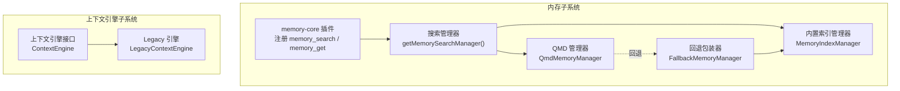
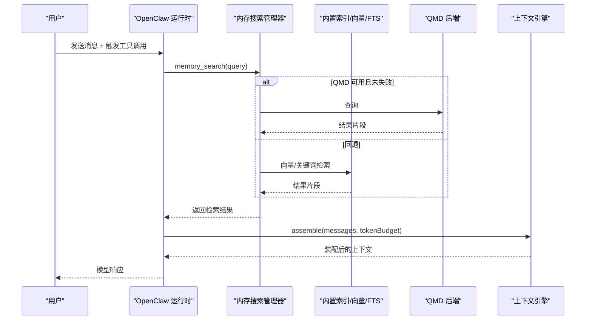
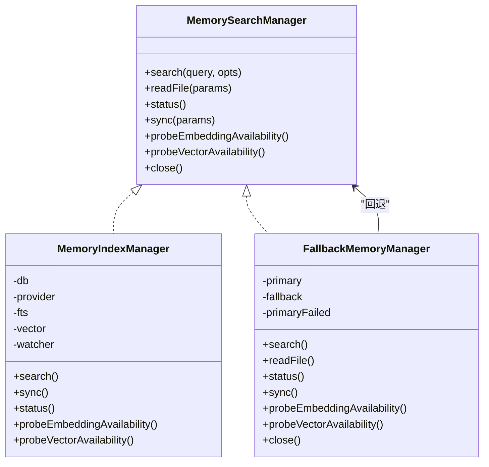
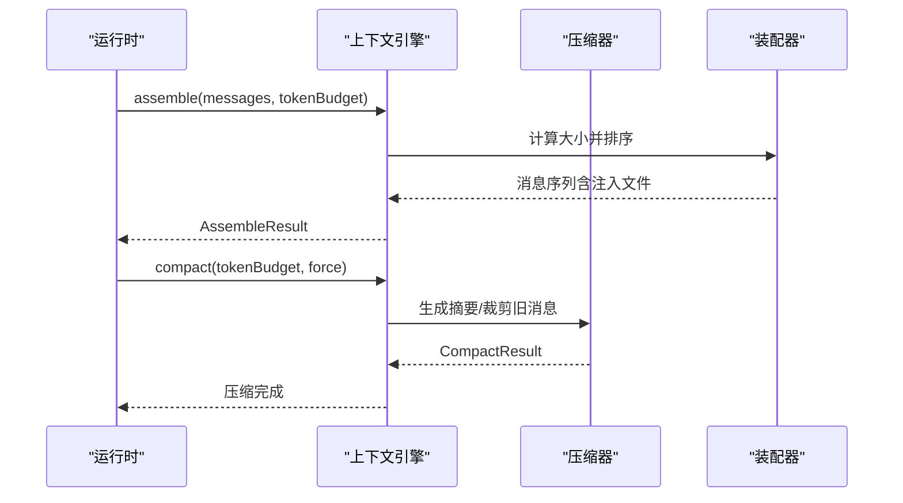
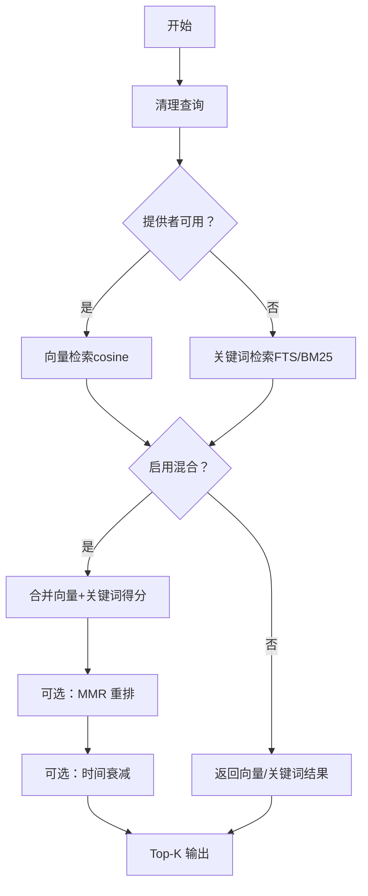
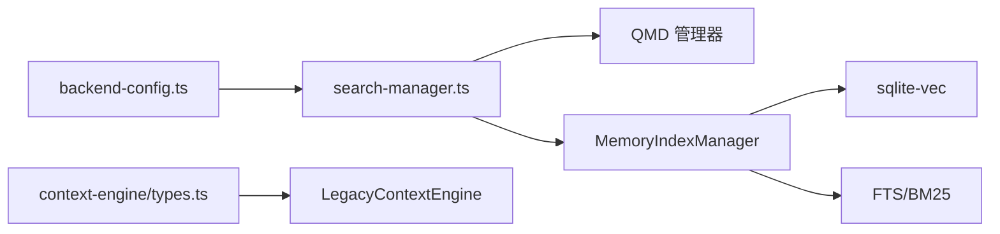

# 内存与上下文

<cite>
**本文引用的文件**
- [docs/concepts/memory.md](file://docs/concepts/memory.md)
- [docs/concepts/context.md](file://docs/concepts/context.md)
- [extensions/memory-core/index.ts](file://extensions/memory-core/index.ts)
- [src/memory/index.ts](file://src/memory/index.ts)
- [src/memory/backend-config.ts](file://src/memory/backend-config.ts)
- [src/memory/batch-runner.ts](file://src/memory/batch-runner.ts)
- [src/memory/batch-output.ts](file://src/memory/batch-output.ts)
- [src/memory/manager.ts](file://src/memory/manager.ts)
- [src/memory/search-manager.ts](file://src/memory/search-manager.ts)
- [src/memory/types.ts](file://src/memory/types.ts)
- [src/context-engine/index.ts](file://src/context-engine/index.ts)
- [src/context-engine/legacy.ts](file://src/context-engine/legacy.ts)
- [src/context-engine/types.ts](file://src/context-engine/types.ts)
</cite>

## 目录
1. [引言](#引言)
2. [项目结构](#项目结构)
3. [核心组件](#核心组件)
4. [架构总览](#架构总览)
5. [详细组件分析](#详细组件分析)
6. [依赖关系分析](#依赖关系分析)
7. [性能考量](#性能考量)
8. [故障排查指南](#故障排查指南)
9. [结论](#结论)
10. [附录：代码示例路径](#附录代码示例路径)

## 引言
本文件面向 OpenClaw 的“内存与上下文”系统，聚焦以下目标：
- 解释内存管理设计：会话记忆、长期存储与短期缓存的分层；Markdown 文件作为“事实来源”；自动预压缩刷新。
- 阐述上下文窗口（Context Window）：令牌预算、智能截断与压缩算法。
- 说明上下文构建机制：消息聚合、相关性评估与窗口优化。
- 解释内存搜索：向量检索、语义匹配、混合检索（BM25 + 向量）、重排与时间衰减。
- 提供可直接定位到源码的示例路径，帮助快速上手。

## 项目结构
OpenClaw 将“内存”和“上下文”拆分为两个主要子系统：
- 内存子系统：负责基于 Markdown 的文件级记忆、向量索引、搜索与读取工具。
- 上下文引擎子系统：负责将历史消息、工具调用结果等装配为模型可见的上下文，并在必要时进行压缩与截断。

**图表来源**
- [extensions/memory-core/index.ts:1-39](file://extensions/memory-core/index.ts#L1-L39)
- [src/memory/search-manager.ts:25-86](file://src/memory/search-manager.ts#L25-L86)
- [src/memory/manager.ts:61-239](file://src/memory/manager.ts#L61-L239)
- [src/context-engine/types.ts:68-168](file://src/context-engine/types.ts#L68-L168)
- [src/context-engine/legacy.ts:20-112](file://src/context-engine/legacy.ts#L20-L112)

**章节来源**
- [docs/concepts/memory.md:1-120](file://docs/concepts/memory.md#L1-L120)
- [docs/concepts/context.md:1-170](file://docs/concepts/context.md#L1-L170)

## 核心组件
- 内存搜索管理器
  - 负责根据配置选择后端（内置 SQLite 或 QMD），并提供统一的 search/readFile/status 接口。
  - 支持回退策略：当主后端失败时自动切换到内置索引。
- 内置索引管理器（MemoryIndexManager）
  - 基于 SQLite + sqlite-vec（可选）建立向量与关键词索引，支持混合检索、MMR 重排、时间衰减。
  - 提供增量同步、批处理嵌入、只读数据库恢复等能力。
- 上下文引擎（ContextEngine）
  - 定义可插拔的上下文组装、压缩与生命周期钩子；默认使用 Legacy 引擎以保持向后兼容。
- 配置解析
  - 内存后端配置解析（backend-config.ts）与 QMD 集合/更新/限制等参数解析。
- 批处理嵌入
  - 批请求分组、并发执行、输出行解析与错误收集。

**章节来源**
- [src/memory/types.ts:61-81](file://src/memory/types.ts#L61-L81)
- [src/memory/manager.ts:61-239](file://src/memory/manager.ts#L61-L239)
- [src/context-engine/types.ts:68-168](file://src/context-engine/types.ts#L68-L168)
- [src/context-engine/legacy.ts:20-112](file://src/context-engine/legacy.ts#L20-L112)
- [src/memory/backend-config.ts:297-355](file://src/memory/backend-config.ts#L297-L355)
- [src/memory/batch-runner.ts:12-65](file://src/memory/batch-runner.ts#L12-L65)
- [src/memory/batch-output.ts:17-56](file://src/memory/batch-output.ts#L17-L56)

## 架构总览
OpenClaw 的“内存与上下文”由两条主线协同工作：
- 内存主线：文件 → 分块 → 向量/关键词索引 → 搜索与读取 → 工具注入到上下文。
- 上下文主线：消息历史 + 工具调用结果 + 注入文件 → 上下文引擎装配 → 令牌预算控制 → 压缩/截断。

**图表来源**
- [src/memory/search-manager.ts:118-139](file://src/memory/search-manager.ts#L118-L139)
- [src/memory/manager.ts:257-365](file://src/memory/manager.ts#L257-L365)
- [src/context-engine/types.ts:122-126](file://src/context-engine/types.ts#L122-L126)

## 详细组件分析

### 组件一：内存搜索与索引（内置与 QMD）
- 统一入口
  - getMemorySearchManager：根据配置解析后端，优先 QMD，失败则回退内置索引。
  - FallbackMemoryManager：封装主后端失败后的回退逻辑，保证可用性。
- 内置索引（MemoryIndexManager）
  - 数据库：SQLite；向量表（可选 sqlite-vec）；FTS 表；嵌入缓存表。
  - 搜索：向量相似度（cosine）或关键词（BM25）；混合检索（向量权重 + 文本权重）；可选 MMR 与时间衰减。
  - 同步：文件监控（chokidar）+ 会话增量；定时任务；只读数据库自动恢复。
  - 批处理：OpenAI/Gemini/Voyage 批量嵌入；并发与轮询；错误聚合。
- QMD 后端
  - 通过外部进程运行 qmd，支持 search/vsearch/query 模式；集合（默认 + 自定义路径）；会话日志集合；范围访问控制；超时与限流；回退到内置索引。

**图表来源**
- [src/memory/types.ts:61-81](file://src/memory/types.ts#L61-L81)
- [src/memory/manager.ts:61-239](file://src/memory/manager.ts#L61-L239)
- [src/memory/search-manager.ts:104-246](file://src/memory/search-manager.ts#L104-L246)

**章节来源**
- [src/memory/search-manager.ts:25-86](file://src/memory/search-manager.ts#L25-L86)
- [src/memory/manager.ts:257-450](file://src/memory/manager.ts#L257-L450)
- [src/memory/backend-config.ts:297-355](file://src/memory/backend-config.ts#L297-L355)
- [src/memory/batch-runner.ts:12-65](file://src/memory/batch-runner.ts#L12-L65)
- [src/memory/batch-output.ts:17-56](file://src/memory/batch-output.ts#L17-L56)

### 组件二：上下文引擎与窗口管理
- 接口契约（ContextEngine）
  - bootstrap/ingest/ingestBatch/afterTurn/assemble/compact/prepareSubagentSpawn/onSubagentEnded/dispose。
  - Legacy 引擎保留原有压缩行为，向上层暴露一致的组装与压缩接口。
- 窗口管理要点
  - 令牌预算（tokenBudget）驱动上下文装配与压缩。
  - 智能截断：在不破坏语义的前提下裁剪过长内容。
  - 压缩算法：摘要化旧历史，减少上下文占用。
  - 相关性评估：结合工具调用、附件、会话历史等，按重要性排序注入。

**图表来源**
- [src/context-engine/types.ts:122-145](file://src/context-engine/types.ts#L122-L145)
- [src/context-engine/legacy.ts:72-107](file://src/context-engine/legacy.ts#L72-L107)

**章节来源**
- [src/context-engine/types.ts:68-168](file://src/context-engine/types.ts#L68-L168)
- [src/context-engine/legacy.ts:20-112](file://src/context-engine/legacy.ts#L20-L112)
- [docs/concepts/context.md:146-170](file://docs/concepts/context.md#L146-L170)

### 组件三：内存搜索流程（向量检索与混合检索）
- 流程概览
  - 输入查询 → 关键词提取（对话式查询）→ 向量检索（可选）+ 关键词检索（FTS/BM25）→ 合并与重排（MMR）→ 时间衰减 → Top-K 输出。
- 关键点
  - 向量维度一致性：变更模型或维度会触发重建索引。
  - FTS 不可用时降级为关键词检索。
  - 嵌入缓存：避免重复计算相同文本的向量。
  - 批处理嵌入：OpenAI/Gemini/Voyage 支持异步批量作业，降低总体成本与延迟。

**图表来源**
- [src/memory/manager.ts:257-365](file://src/memory/manager.ts#L257-L365)
- [src/memory/manager.ts:417-450](file://src/memory/manager.ts#L417-L450)

**章节来源**
- [docs/concepts/memory.md:446-511](file://docs/concepts/memory.md#L446-L511)
- [src/memory/manager.ts:367-450](file://src/memory/manager.ts#L367-L450)

### 组件四：工具与插件集成
- memory-core 插件
  - 注册 memory_search 与 memory_get 两个工具，绑定运行时工具工厂与会话键。
- CLI
  - 通过插件注册 memory 子命令，便于调试与手动检索。

**章节来源**
- [extensions/memory-core/index.ts:10-35](file://extensions/memory-core/index.ts#L10-L35)

## 依赖关系分析
- 内存子系统内部
  - search-manager 依据配置选择 QMD 或内置索引；QMD 失败时由回退包装器接管。
  - 内置索引依赖 sqlite-vec（可选）与 FTS；支持嵌入缓存与批处理。
- 上下文引擎
  - 默认使用 Legacy 引擎，保持与现有压缩/截断逻辑一致。
- 配置与解析
  - backend-config 对 QMD 的命令、集合、更新策略、范围访问等进行稳定解析，确保缓存键稳定。

**图表来源**
- [src/memory/backend-config.ts:297-355](file://src/memory/backend-config.ts#L297-L355)
- [src/memory/search-manager.ts:31-76](file://src/memory/search-manager.ts#L31-L76)
- [src/memory/manager.ts:222-233](file://src/memory/manager.ts#L222-L233)
- [src/context-engine/types.ts:68-168](file://src/context-engine/types.ts#L68-L168)
- [src/context-engine/legacy.ts:20-112](file://src/context-engine/legacy.ts#L20-L112)

**章节来源**
- [src/memory/backend-config.ts:297-355](file://src/memory/backend-config.ts#L297-L355)
- [src/memory/search-manager.ts:25-86](file://src/memory/search-manager.ts#L25-L86)
- [src/context-engine/index.ts:9-20](file://src/context-engine/index.ts#L9-L20)

## 性能考量
- 向量检索加速
  - sqlite-vec 可显著降低跨进程开销；缺失时回退到内存相似度计算。
- 混合检索
  - 向量擅长语义近似，关键词擅长精确匹配；合理设置权重与候选倍数，平衡召回与精度。
- MMR 与时间衰减
  - 在冗余结果较多时启用 MMR；对长期运行的代理启用时间衰减，避免陈旧信息主导。
- 批处理嵌入
  - 大规模索引时启用 OpenAI/Gemini/Voyage 批处理，缩短总耗时并降低成本。
- 文件监控与增量同步
  - 使用 chokidar 与定时器，避免全量扫描；会话增量阈值防止频繁写入。

[本节为通用指导，无需特定文件分析]

## 故障排查指南
- QMD 不可用或失败
  - 现象：memory_search 抛错或回退到内置索引。
  - 排查：检查 qmd 可执行文件、SQLite 扩展、网络与权限；确认搜索模式与超时配置。
  - 参考：回退包装器会在失败后记录警告并切换内置索引。
- 嵌入不可用
  - 现象：探针返回不可用，搜索仅关键词。
  - 排查：检查 API Key、网络连通性、模型/维度变化导致的重新索引。
- 只读数据库
  - 现象：SQLite 报只读错误。
  - 处理：自动重建连接并重试；检查磁盘权限与挂载状态。
- 批处理失败
  - 现象：批量嵌入多次失败被锁定。
  - 处理：检查并发、轮询间隔与超时；观察 lastError 与 lastProvider。

**章节来源**
- [src/memory/search-manager.ts:118-139](file://src/memory/search-manager.ts#L118-L139)
- [src/memory/manager.ts:452-552](file://src/memory/manager.ts#L452-L552)
- [src/memory/manager.ts:741-767](file://src/memory/manager.ts#L741-L767)
- [src/memory/manager.ts:769-800](file://src/memory/manager.ts#L769-L800)

## 结论
OpenClaw 的“内存与上下文”体系以“文件即真相”的理念为基础，通过可插拔的内存后端（内置 SQLite/QMD）与上下文引擎（Legacy/可扩展），实现了：
- 分层记忆：短期缓存（会话）、中期索引（向量/关键词）、长期存储（Markdown 文件）。
- 智能检索：向量 + BM25 混合、MMR 重排、时间衰减，兼顾语义与精确性。
- 窗口管理：基于令牌预算的上下文装配与压缩，保障模型输入可控。
- 可靠性：回退策略、批处理、只读恢复与增量同步，提升稳定性与性能。

[本节为总结，无需特定文件分析]

## 附录：代码示例路径
以下示例均提供到源码文件的路径，便于快速定位实现细节：

- 内存查询（search）
  - 入口：[src/memory/search-manager.ts:25-86](file://src/memory/search-manager.ts#L25-L86)
  - 搜索实现（内置）：[src/memory/manager.ts:257-365](file://src/memory/manager.ts#L257-L365)
  - 搜索实现（QMD 回退包装器）：[src/memory/search-manager.ts:118-139](file://src/memory/search-manager.ts#L118-L139)

- 上下文构建（assemble/compact）
  - 接口定义：[src/context-engine/types.ts:68-168](file://src/context-engine/types.ts#L68-L168)
  - Legacy 实现：[src/context-engine/legacy.ts:20-112](file://src/context-engine/legacy.ts#L20-L112)

- 上下文窗口管理（令牌预算与压缩）
  - 窗口说明与诊断命令：[docs/concepts/context.md:22-31](file://docs/concepts/context.md#L22-L31)

- 内存搜索优化（混合检索、MMR、时间衰减）
  - 混合检索与合并：[src/memory/manager.ts:417-450](file://src/memory/manager.ts#L417-L450)
  - 文档说明（权重、候选倍数、MMR、时间衰减）：[docs/concepts/memory.md:485-674](file://docs/concepts/memory.md#L485-L674)

- 批处理嵌入（OpenAI/Gemini/Voyage）
  - 执行器与分组：[src/memory/batch-runner.ts:12-65](file://src/memory/batch-runner.ts#L12-L65)
  - 输出解析与错误聚合：[src/memory/batch-output.ts:17-56](file://src/memory/batch-output.ts#L17-L56)

- 内存工具注册与 CLI
  - 插件注册工具：[extensions/memory-core/index.ts:10-35](file://extensions/memory-core/index.ts#L10-L35)

- 内存后端配置解析（QMD）
  - 配置解析与缓存键：[src/memory/backend-config.ts:297-355](file://src/memory/backend-config.ts#L297-L355)