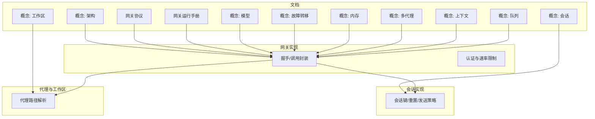
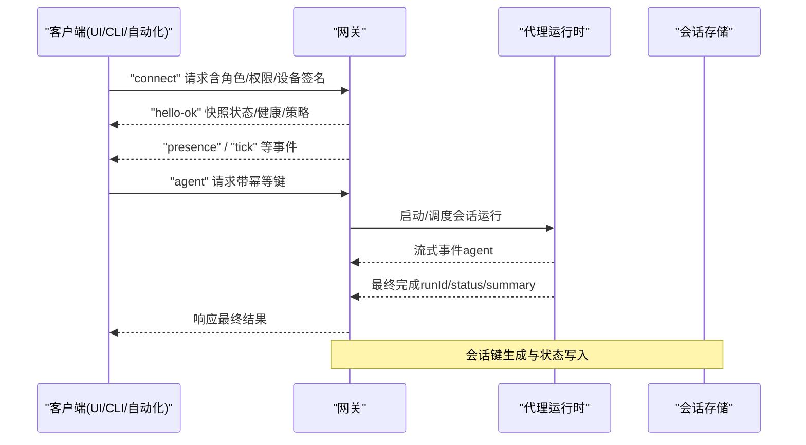
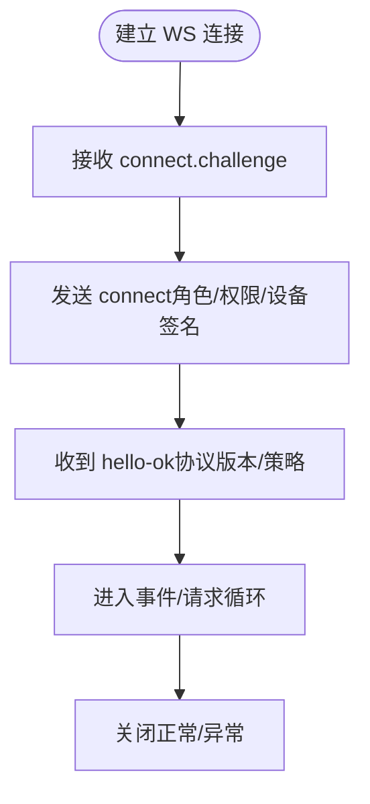
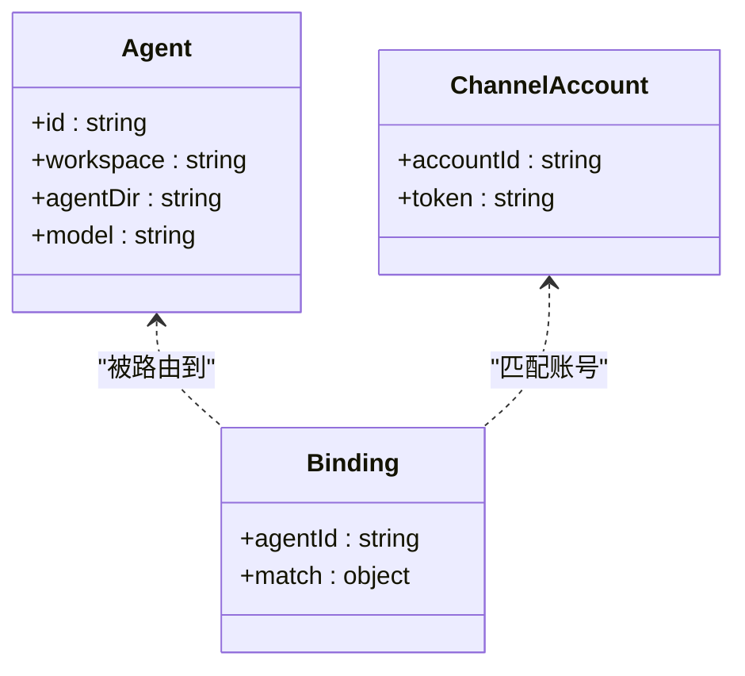
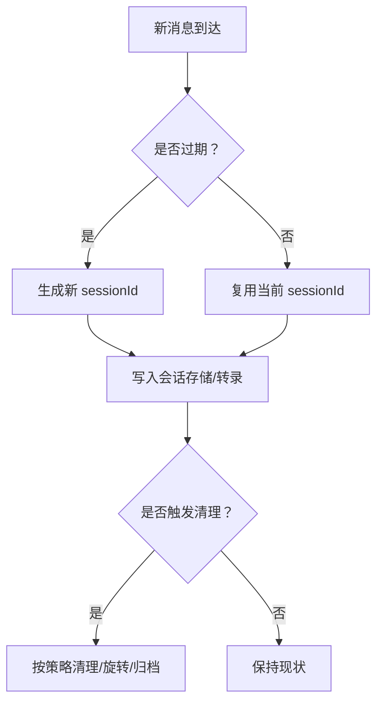
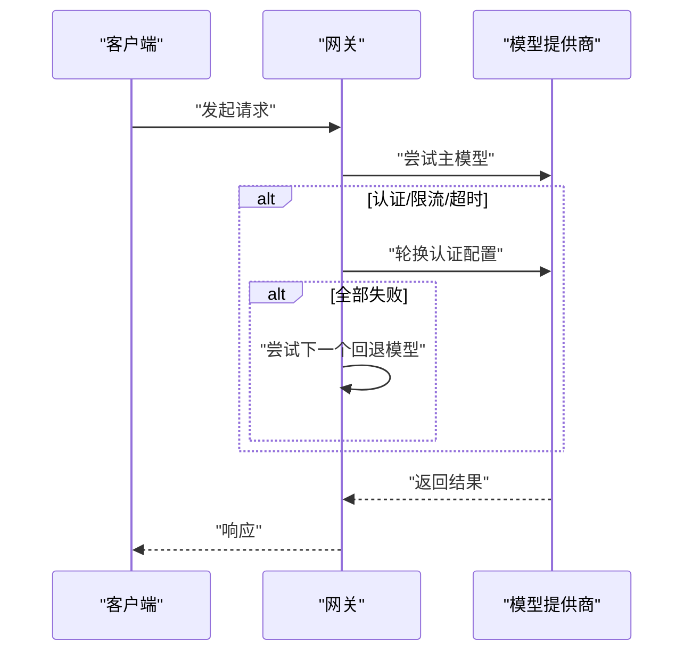
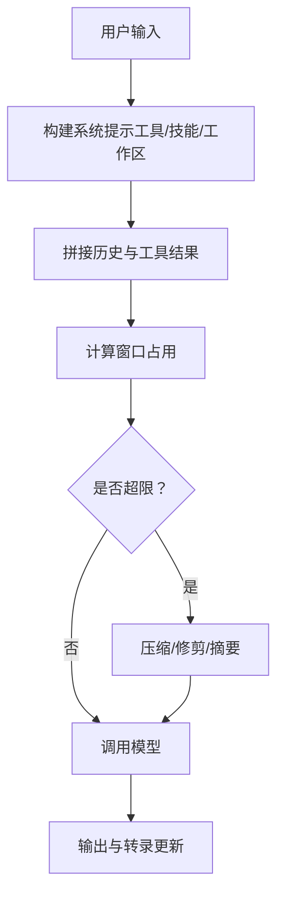
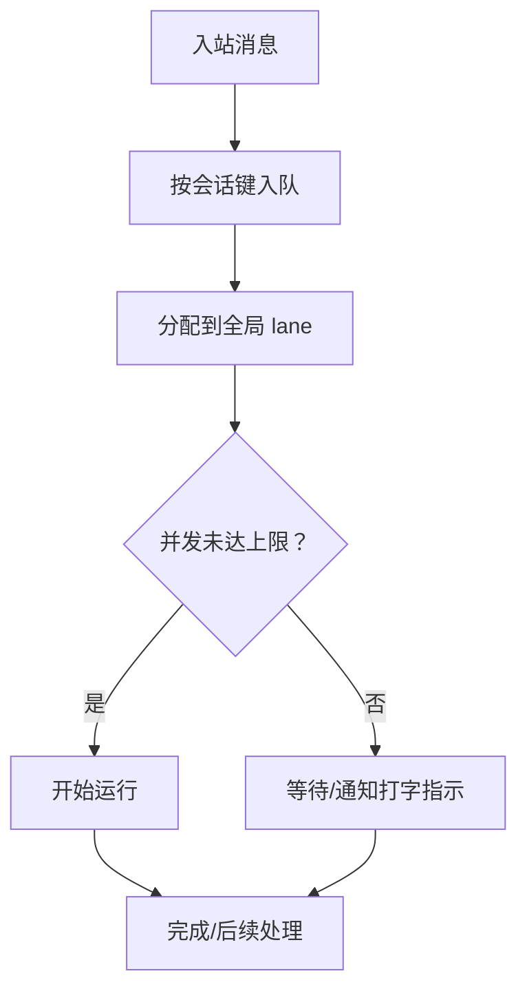
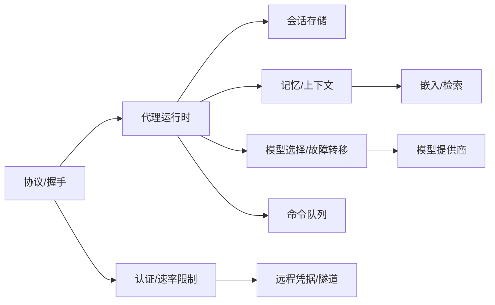

# 核心概念

<cite>
**本文引用的文件**
- [docs/concepts/architecture.md](file://docs/concepts/architecture.md)
- [docs/concepts/session.md](file://docs/concepts/session.md)
- [docs/concepts/models.md](file://docs/concepts/models.md)
- [docs/concepts/memory.md](file://docs/concepts/memory.md)
- [docs/gateway/index.md](file://docs/gateway/index.md)
- [docs/concepts/multi-agent.md](file://docs/concepts/multi-agent.md)
- [docs/concepts/context.md](file://docs/concepts/context.md)
- [docs/concepts/queue.md](file://docs/concepts/queue.md)
- [docs/concepts/model-failover.md](file://docs/concepts/model-failover.md)
- [docs/concepts/agent-workspace.md](file://docs/concepts/agent-workspace.md)
- [docs/gateway/protocol.md](file://docs/gateway/protocol.md)
- [src/gateway/call.ts](file://src/gateway/call.ts)
- [src/gateway/auth.ts](file://src/gateway/auth.ts)
- [src/sessions/session-id.ts](file://src/sessions/session-id.ts)
- [src/agents/agent-paths.ts](file://src/agents/agent-paths.ts)
</cite>

## 目录
1. [引言](#引言)
2. [项目结构](#项目结构)
3. [核心组件](#核心组件)
4. [架构总览](#架构总览)
5. [详细组件分析](#详细组件分析)
6. [依赖分析](#依赖分析)
7. [性能考量](#性能考量)
8. [故障排查指南](#故障排查指南)
9. [结论](#结论)
10. [附录](#附录)

## 引言
本文件面向 OpenClaw 的核心概念与实现，围绕“网关架构、代理系统、会话模型、模型系统、内存与上下文窗口”等主题，系统化阐述设计理念、组件关系与交互流程，并提供可操作的使用场景与排障建议。读者无需深入源码即可理解控制平面（WebSocket）、代理运行时与会话管理如何协同工作。

## 项目结构
OpenClaw 将“控制平面 + 通道连接 + 代理运行时 + 会话与记忆”统一在单进程网关中，通过 WebSocket 提供一致的协议面，同时承载节点能力与 UI 客户端。文档与源码分布如下：
- 文档层：位于 docs/ 下，覆盖架构、会话、模型、内存、队列、多代理、上下文、故障转移等概念性说明。
- 网关层：位于 src/gateway/，包含协议握手、认证、调用封装、TLS 与远程访问等实现。
- 会话层：位于 src/sessions/，负责会话键生成、重置策略、发送策略与转录事件。
- 代理与工作区：位于 src/agents/ 与 src/agents/ 路由相关模块，负责代理路径解析与多代理隔离。

图示来源
- [docs/concepts/architecture.md:1-140](file://docs/concepts/architecture.md#L1-L140)
- [docs/gateway/protocol.md:1-268](file://docs/gateway/protocol.md#L1-L268)
- [docs/gateway/index.md:1-262](file://docs/gateway/index.md#L1-L262)
- [src/gateway/call.ts:1-800](file://src/gateway/call.ts#L1-L800)
- [src/gateway/auth.ts:1-504](file://src/gateway/auth.ts#L1-L504)
- [src/sessions/session-id.ts:1-6](file://src/sessions/session-id.ts#L1-L6)
- [src/agents/agent-paths.ts:1-26](file://src/agents/agent-paths.ts#L1-L26)

章节来源
- [docs/concepts/architecture.md:1-140](file://docs/concepts/architecture.md#L1-L140)
- [docs/gateway/protocol.md:1-268](file://docs/gateway/protocol.md#L1-L268)
- [docs/gateway/index.md:1-262](file://docs/gateway/index.md#L1-L262)

## 核心组件
- 网关（Gateway）：单一长连接控制平面，承载通道连接、代理运行时、HTTP/WS 服务与事件推送；客户端（UI/CLI/自动化/节点）通过 WebSocket 连接。
- 代理运行时：在网关内执行的“智能体”运行环境，按会话键组织上下文，支持工具调用、技能加载与插件扩展。
- 会话管理：以“会话键”为单位持久化对话历史与状态，支持多种重置策略、发送策略与维护清理。
- 模型系统：提供模型选择、别名、回退链与认证轮换，结合故障转移策略保障可用性。
- 内存与上下文：工作区内的 Markdown 记忆文件作为“源事实”，上下文引擎在运行时组装系统提示与注入内容，受上下文窗口约束。

章节来源
- [docs/concepts/architecture.md:12-140](file://docs/concepts/architecture.md#L12-L140)
- [docs/concepts/session.md:1-311](file://docs/concepts/session.md#L1-L311)
- [docs/concepts/models.md:1-222](file://docs/concepts/models.md#L1-L222)
- [docs/concepts/memory.md:1-801](file://docs/concepts/memory.md#L1-L801)
- [docs/concepts/context.md:1-170](file://docs/concepts/context.md#L1-L170)

## 架构总览
OpenClaw 的控制平面采用“单网关、多客户端”的设计：所有消息表面（WhatsApp/Telegram/Slack/Discord/Signal/iMessage/WebChat）由网关统一持有与路由；控制面与节点通过 WebSocket 协议交互，支持设备身份、配对与鉴权。

图示来源
- [docs/concepts/architecture.md:59-140](file://docs/concepts/architecture.md#L59-L140)
- [docs/gateway/protocol.md:22-91](file://docs/gateway/protocol.md#L22-L91)

章节来源
- [docs/concepts/architecture.md:12-140](file://docs/concepts/architecture.md#L12-L140)
- [docs/gateway/protocol.md:17-91](file://docs/gateway/protocol.md#L17-L91)

## 详细组件分析

### 组件一：网关架构与协议
- 控制平面：统一的 WebSocket 协议，首帧必须是 connect；支持角色（operator/node）、作用域与能力声明；支持设备身份与配对。
- 运行模型：单进程承载路由、控制面与通道连接；默认绑定 loopback，支持本地/远程模式与 TLS 指纹校验。
- 远程访问：推荐 Tailscale/VPN，或 SSH 隧道；远端需正确鉴权与证书校验。

图示来源
- [docs/gateway/protocol.md:22-91](file://docs/gateway/protocol.md#L22-L91)
- [docs/gateway/index.md:68-124](file://docs/gateway/index.md#L68-L124)

章节来源
- [docs/gateway/protocol.md:1-268](file://docs/gateway/protocol.md#L1-L268)
- [docs/gateway/index.md:1-262](file://docs/gateway/index.md#L1-L262)

### 组件二：代理系统与多代理路由
- 多代理隔离：每个 agentId 对应独立工作区、状态目录与会话存储；认证资料按代理隔离。
- 路由规则：基于通道/账号/群组/成员等维度的“最具体优先”匹配；支持每通道/全局并发与队列模式。
- 工作区：默认位于 ~/.openclaw/workspace，可按代理单独配置；支持沙箱与工具限制。

图示来源
- [docs/concepts/multi-agent.md:10-553](file://docs/concepts/multi-agent.md#L10-L553)
- [src/agents/agent-paths.ts:1-26](file://src/agents/agent-paths.ts#L1-L26)

章节来源
- [docs/concepts/multi-agent.md:1-553](file://docs/concepts/multi-agent.md#L1-L553)
- [src/agents/agent-paths.ts:1-26](file://src/agents/agent-paths.ts#L1-L26)

### 组件三：会话模型与生命周期
- 会话键规则：主会话、按用户/通道/账号隔离、群组/频道隔离；支持会话元数据 origin 字段记录来源。
- 重置策略：每日重置（默认 4:00 当地时间）、空闲重置（可叠加），支持按类型/通道覆盖。
- 发送策略：按会话键前缀/原始键前缀进行允许/拒绝控制；支持运行时覆盖。
- 维护清理：支持按时间/条目数/磁盘配额清理，支持旋转 sessions.json 与归档删除/重置文件。

图示来源
- [docs/concepts/session.md:177-218](file://docs/concepts/session.md#L177-L218)
- [src/sessions/session-id.ts:1-6](file://src/sessions/session-id.ts#L1-L6)

章节来源
- [docs/concepts/session.md:1-311](file://docs/concepts/session.md#L1-L311)
- [src/sessions/session-id.ts:1-6](file://src/sessions/session-id.ts#L1-L6)

### 组件四：模型系统与故障转移
- 选择顺序：主模型 → 回退链 → 提供商内部认证轮换。
- 配置与扫描：支持别名、提供商参数、扫描免费模型并探测工具/图像能力。
- 故障转移：认证轮换（OAuth/API Key）、冷却退避、账单禁用与模型回退；会话粘性避免频繁切换。

图示来源
- [docs/concepts/models.md:16-153](file://docs/concepts/models.md#L16-L153)
- [docs/concepts/model-failover.md:1-153](file://docs/concepts/model-failover.md#L1-L153)

章节来源
- [docs/concepts/models.md:1-222](file://docs/concepts/models.md#L1-L222)
- [docs/concepts/model-failover.md:1-153](file://docs/concepts/model-failover.md#L1-L153)

### 组件五：内存与上下文窗口
- 记忆来源：工作区内 Markdown 文件（每日日志、长期记忆），作为“源事实”；自动预压缩提醒与向量检索。
- 上下文装配：系统提示（工具列表/技能/工作区注入）+ 历史 + 工具调用/结果 + 附件；受模型上下文窗口限制。
- 检索增强：支持本地/远程嵌入、BM25 关键词检索、MMR 多样化与时间衰减；可选 QMD 后端。

图示来源
- [docs/concepts/context.md:79-170](file://docs/concepts/context.md#L79-L170)
- [docs/concepts/memory.md:446-520](file://docs/concepts/memory.md#L446-L520)

章节来源
- [docs/concepts/memory.md:1-801](file://docs/concepts/memory.md#L1-L801)
- [docs/concepts/context.md:1-170](file://docs/concepts/context.md#L1-L170)

### 组件六：命令队列与并发控制
- 设计目标：串行化自动回复运行，避免资源竞争；在会话粒度与全局并发间平衡。
- 模式：collect/steer/followup/steer-backlog/interrupt 等；支持去抖、上限与溢出策略。
- 局部保证：按会话键排队，确保同一会话只有一条运行；全局通过 lanes 与并发上限控制。

图示来源
- [docs/concepts/queue.md:17-90](file://docs/concepts/queue.md#L17-L90)

章节来源
- [docs/concepts/queue.md:1-90](file://docs/concepts/queue.md#L1-L90)

## 依赖分析
- 组件耦合
  - 网关协议与认证：协议定义（TypeBox/JSON Schema）与实现（握手/鉴权/速率限制）紧密耦合，确保安全与一致性。
  - 会话与运行时：会话键决定运行时上下文与存储位置；运行时依赖会话状态与模型选择。
  - 多代理与路由：绑定规则决定消息归属；工作区与工具策略影响运行行为。
- 外部依赖
  - 远程访问：Tailscale/SSH 隧道；TLS 指纹校验；远程凭据解析。
  - 模型提供商：OpenRouter/各厂商 API；认证轮换与冷却退避。
  - 搜索后端：sqlite-vec/QMD/远程嵌入；批处理与缓存。

图示来源
- [docs/gateway/protocol.md:1-268](file://docs/gateway/protocol.md#L1-L268)
- [src/gateway/auth.ts:1-504](file://src/gateway/auth.ts#L1-L504)
- [docs/concepts/models.md:1-222](file://docs/concepts/models.md#L1-L222)
- [docs/concepts/memory.md:1-801](file://docs/concepts/memory.md#L1-L801)
- [docs/concepts/queue.md:1-90](file://docs/concepts/queue.md#L1-L90)

章节来源
- [src/gateway/auth.ts:1-504](file://src/gateway/auth.ts#L1-L504)
- [src/gateway/call.ts:1-800](file://src/gateway/call.ts#L1-L800)

## 性能考量
- 会话存储写放大：大规模会话存储会增加写路径延迟；建议启用强制清理模式并设置合理上限与磁盘预算。
- 上下文窗口：大文件注入与工具 schema 会显著增加上下文开销；建议使用压缩/修剪与分页检索。
- 模型调用：并发与队列策略影响吞吐；合理设置全局并发与 per-session 队列模式可提升稳定性。
- 搜索性能：sqlite-vec 扩展与向量缓存可显著降低检索成本；批处理嵌入适合大规模索引。

## 故障排查指南
- 连接失败
  - 非 loopback 明文 ws:// 被阻断；请改用 wss:// 或本地回环。
  - 远端模式缺少 gateway.remote.url；请配置或切换为本地模式。
  - 设备签名/配对问题：检查 connect.challenge 与设备指纹一致性。
- 鉴权错误
  - TOKEN/PASSWORD 不匹配；确认客户端携带正确凭据或使用设备令牌。
  - Tailscale/代理头认证：检查代理配置与用户头字段。
- 远程访问
  - SSH 隧道：确保本地端口映射与凭据一致。
  - TLS 指纹：必要时配置指纹校验或使用本地证书运行时。
- 会话与队列
  - 会话未刷新：检查重置策略与维护清理；必要时手动清理或调整策略。
  - 队列卡顿：查看 verbose 日志中的排队耗时；调整去抖/上限/溢出策略。

章节来源
- [docs/gateway/index.md:235-262](file://docs/gateway/index.md#L235-L262)
- [src/gateway/call.ts:186-226](file://src/gateway/call.ts#L186-L226)
- [src/gateway/auth.ts:378-504](file://src/gateway/auth.ts#L378-L504)

## 结论
OpenClaw 通过“单网关 + WebSocket 控制平面 + 代理运行时 + 会话与记忆”的一体化设计，在多通道、多代理与复杂认证场景下提供了高内聚、低耦合的运行时体系。借助明确的会话键规则、模型回退与故障转移、队列并发控制与上下文窗口管理，系统在可用性、安全性与可运维性之间取得良好平衡。建议在生产部署中启用强制清理、合理并发与 TLS 校验，并结合文档提供的 CLI 与诊断命令进行持续观测与优化。

## 附录
- 使用场景示例（路径指引）
  - 启动与健康检查：[网关运行手册:27-66](file://docs/gateway/index.md#L27-L66)
  - 远程访问与隧道：[网关运行手册:108-123](file://docs/gateway/index.md#L108-L123)
  - 模型选择与扫描：[模型 CLI:116-206](file://docs/concepts/models.md#L116-L206)
  - 会话重置与维护：[会话管理:177-218](file://docs/concepts/session.md#L177-L218)
  - 内存与检索：[内存:446-520](file://docs/concepts/memory.md#L446-L520)
  - 上下文检查：[上下文:22-30](file://docs/concepts/context.md#L22-L30)
  - 多代理路由：[多代理路由:172-217](file://docs/concepts/multi-agent.md#L172-L217)
  - 队列模式与选项：[命令队列:25-76](file://docs/concepts/queue.md#L25-L76)
  - 故障转移与认证轮换：[模型故障转移:42-153](file://docs/concepts/model-failover.md#L42-L153)
  - 工作区布局与备份：[代理工作区:64-137](file://docs/concepts/agent-workspace.md#L64-L137)
  - 协议握手与角色：[网关协议:22-91](file://docs/gateway/protocol.md#L22-L91)