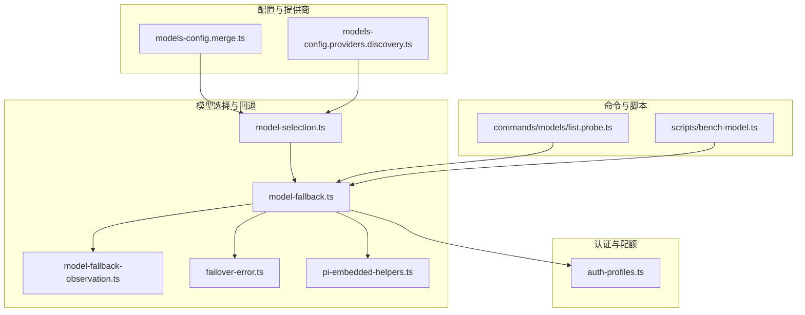
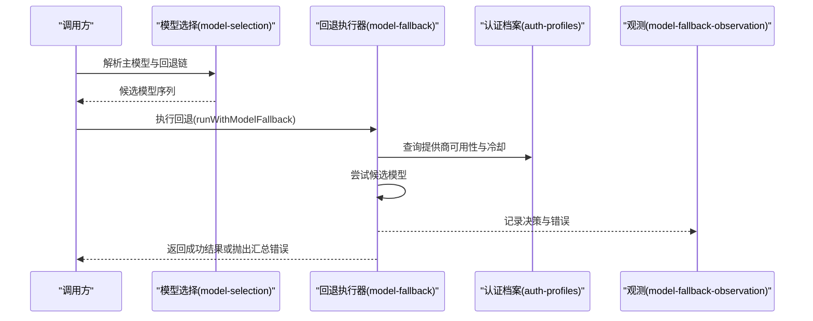
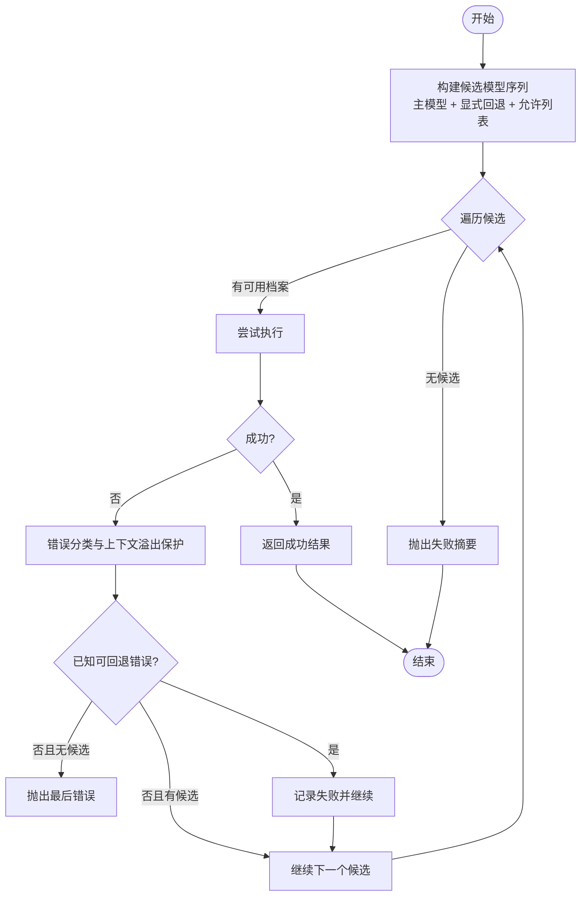
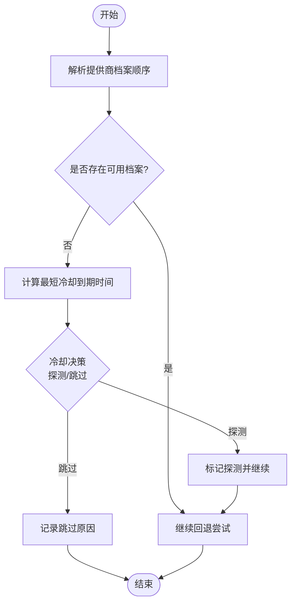
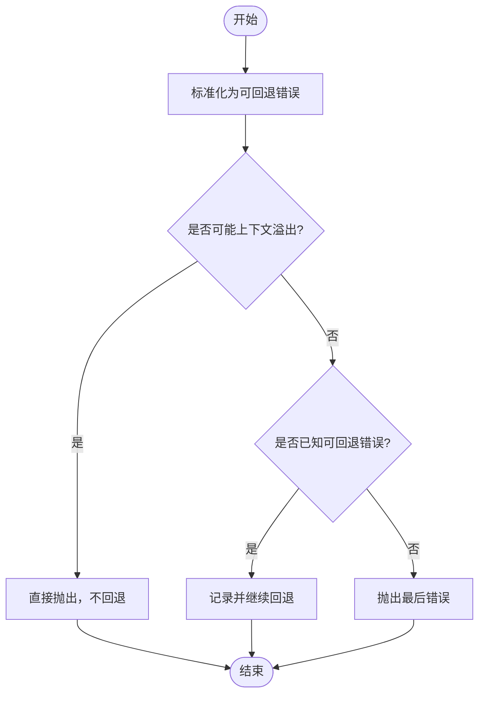
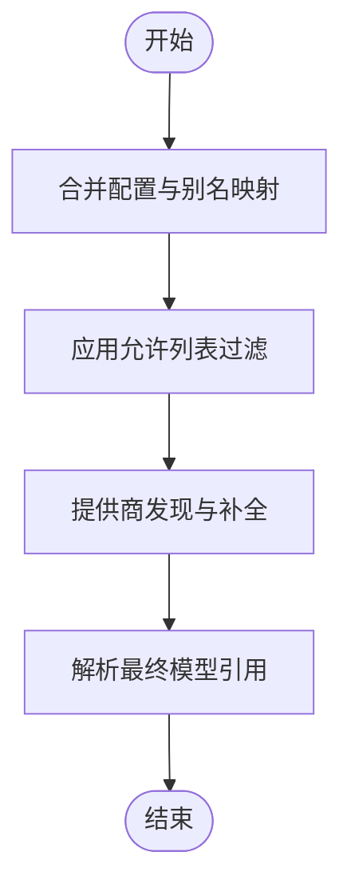
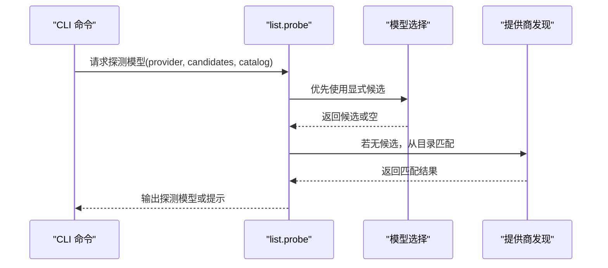
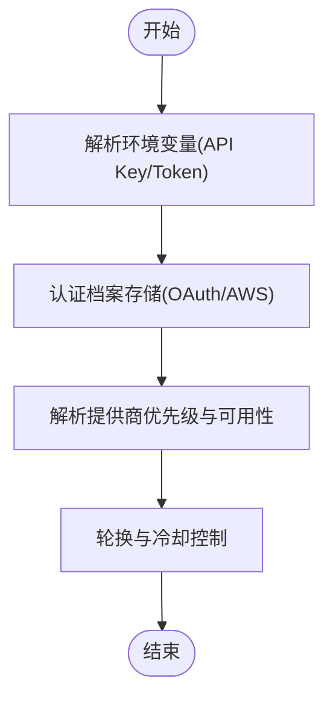
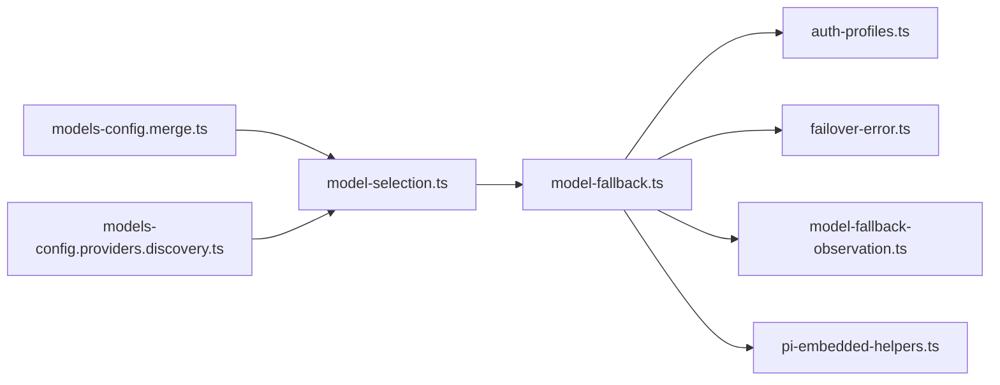

# 模型系统

<cite>
**本文引用的文件**
- [src/agents/model-fallback.ts](file://src/agents/model-fallback.ts)
- [src/agents/auth-profiles.ts](file://src/agents/auth-profiles.ts)
- [src/agents/model-selection.ts](file://src/agents/model-selection.ts)
- [src/agents/failover-error.ts](file://src/agents/failover-error.ts)
- [src/agents/pi-embedded-helpers.ts](file://src/agents/pi-embedded-helpers.ts)
- [src/agents/model-fallback-observation.ts](file://src/agents/model-fallback-observation.ts)
- [src/agents/models-config.merge.ts](file://src/agents/models-config.merge.ts)
- [src/agents/models-config.providers.discovery.ts](file://src/agents/models-config.providers.discovery.ts)
- [src/agents/models-config.providers.auth-provenance.test.ts](file://src/agents/models-config.providers.auth-provenance.test.ts)
- [src/agents/models-config.fills-missing-provider-apikey-from-env-var.test.ts](file://src/agents/models-config.fills-missing-provider-apikey-from-env-var.test.ts)
- [src/agents/model-auth.profiles.test.ts](file://src/agents/model-auth.profiles.test.ts)
- [src/agents/model-auth-env-vars.ts](file://src/agents/model-auth-env-vars.ts)
- [src/agents/model-auth-label.ts](file://src/agents/model-auth-label.ts)
- [src/agents/model-auth-markers.ts](file://src/agents/model-auth-markers.ts)
- [src/agents/live-model-errors.ts](file://src/agents/live-model-errors.ts)
- [src/agents/live-model-filter.ts](file://src/agents/live-model-filter.ts)
- [src/agents/defaults.ts](file://src/agents/defaults.ts)
- [src/commands/models/list.probe.ts](file://src/commands/models/list.probe.ts)
- [docs/concepts/model-failover.md](file://docs/concepts/model-failover.md)
- [docs/concepts/models.md](file://docs/concepts/models.md)
- [docs/providers/openai.md](file://docs/providers/openai.md)
- [docs/providers/anthropic.md](file://docs/providers/anthropic.md)
- [docs/providers/index.md](file://docs/providers/index.md)
- [scripts/bench-model.ts](file://scripts/bench-model.ts)
</cite>

## 目录
1. [简介](#简介)
2. [项目结构](#项目结构)
3. [核心组件](#核心组件)
4. [架构总览](#架构总览)
5. [详细组件分析](#详细组件分析)
6. [依赖关系分析](#依赖关系分析)
7. [性能考量](#性能考量)
8. [故障排查指南](#故障排查指南)
9. [结论](#结论)
10. [附录](#附录)

## 简介
本文件面向 OpenClaw 的“模型系统”，系统性阐述以下主题：
- 模型选择机制：模型发现、别名解析、允许列表与显式回退链的构建与优先级排序。
- 模型提供商集成：对多家提供商（如 OpenAI、Anthropic、Google Gemini 等）的统一接入与认证配置。
- 故障转移（Model Failover）：自动切换条件、回退策略、冷却探测与错误分类。
- 认证配置：API 密钥管理、环境变量注入、凭据轮换与可用性判定。
- 性能监控与观测：失败决策记录、探测节流与运行时可观测性。

本文件以源码为依据，结合概念文档与脚本示例，帮助读者从高层到代码级全面理解模型系统的实现与使用。

## 项目结构
模型系统主要由以下模块构成：
- 模型选择与回退：负责候选模型的收集、排序与回退执行。
- 认证与配额：负责认证档案存储、可用性判定与冷却状态管理。
- 错误分类与上下文溢出保护：确保非可重试错误不被误触发回退。
- 配置合并与提供商发现：统一模型配置来源，支持静态与动态发现。
- 命令行探测与观测：提供探测与状态查询能力，辅助运维与排障。

图表来源
- [src/agents/model-fallback.ts:505-769](file://src/agents/model-fallback.ts#L505-L769)
- [src/agents/model-selection.ts](file://src/agents/model-selection.ts)
- [src/agents/auth-profiles.ts](file://src/agents/auth-profiles.ts)
- [src/agents/models-config.merge.ts](file://src/agents/models-config.merge.ts)
- [src/agents/models-config.providers.discovery.ts](file://src/agents/models-config.providers.discovery.ts)
- [src/commands/models/list.probe.ts:140-173](file://src/commands/models/list.probe.ts#L140-L173)
- [scripts/bench-model.ts](file://scripts/bench-model.ts)

章节来源
- [src/agents/model-fallback.ts:1-823](file://src/agents/model-fallback.ts#L1-L823)
- [src/agents/model-selection.ts](file://src/agents/model-selection.ts)
- [src/agents/auth-profiles.ts](file://src/agents/auth-profiles.ts)
- [src/agents/models-config.merge.ts](file://src/agents/models-config.merge.ts)
- [src/agents/models-config.providers.discovery.ts](file://src/agents/models-config.providers.discovery.ts)
- [src/commands/models/list.probe.ts:140-173](file://src/commands/models/list.probe.ts#L140-L173)
- [scripts/bench-model.ts](file://scripts/bench-model.ts)

## 核心组件
- 模型回退执行器：根据配置与当前请求，生成候选模型序列，按序尝试并记录每次尝试结果；在冷却或特定错误条件下进行探测或跳过。
- 认证档案与冷却：维护每个提供商的认证档案顺序与冷却状态，决定是否允许探测或直接跳过。
- 错误分类与上下文溢出保护：将异常归类为可回退错误，并避免对上下文溢出等不可重试错误进行回退。
- 配置合并与提供商发现：将用户配置、别名映射、允许列表与动态发现结果整合，形成最终可用的模型候选集。
- 命令行探测：用于诊断与状态查询，支持按提供商选择探测模型并映射认证探针原因码。

章节来源
- [src/agents/model-fallback.ts:505-769](file://src/agents/model-fallback.ts#L505-L769)
- [src/agents/auth-profiles.ts](file://src/agents/auth-profiles.ts)
- [src/agents/failover-error.ts](file://src/agents/failover-error.ts)
- [src/agents/pi-embedded-helpers.ts](file://src/agents/pi-embedded-helpers.ts)
- [src/agents/models-config.merge.ts](file://src/agents/models-config.merge.ts)
- [src/agents/models-config.providers.discovery.ts](file://src/agents/models-config.providers.discovery.ts)
- [src/commands/models/list.probe.ts:140-173](file://src/commands/models/list.probe.ts#L140-L173)

## 架构总览
模型系统通过“配置 → 选择 → 回退 → 观测”的闭环实现高可用推理服务。其关键路径如下：
- 配置层：合并用户配置、别名与允许列表，结合提供商发现结果。
- 选择层：解析主模型与回退链，构建候选集（尊重允许列表与显式回退）。
- 回退层：按候选顺序尝试，结合认证冷却与错误分类，决定探测或跳过。
- 观测层：记录每次决策与错误信息，便于追踪与调试。

图表来源
- [src/agents/model-selection.ts](file://src/agents/model-selection.ts)
- [src/agents/model-fallback.ts:505-769](file://src/agents/model-fallback.ts#L505-L769)
- [src/agents/auth-profiles.ts](file://src/agents/auth-profiles.ts)
- [src/agents/model-fallback-observation.ts](file://src/agents/model-fallback-observation.ts)

## 详细组件分析

### 组件一：模型选择与回退（runWithModelFallback）
该函数是回退执行的核心，负责：
- 构建候选模型序列：包含主模型与配置的回退链，尊重允许列表与显式回退。
- 冷却探测：当所有认证档案均处于冷却时，基于节流与到期时间决定是否探测主模型。
- 错误分类与上下文溢出保护：对不可重试错误直接中止回退循环。
- 失败汇总：若所有候选均失败，输出结构化失败摘要。

图表来源
- [src/agents/model-fallback.ts:505-769](file://src/agents/model-fallback.ts#L505-L769)
- [src/agents/failover-error.ts](file://src/agents/failover-error.ts)
- [src/agents/pi-embedded-helpers.ts](file://src/agents/pi-embedded-helpers.ts)

章节来源
- [src/agents/model-fallback.ts:505-769](file://src/agents/model-fallback.ts#L505-L769)

### 组件二：认证档案与冷却（auth-profiles）
认证档案模块负责：
- 提供商档案顺序：按优先级排列可用档案。
- 冷却状态：判断档案是否在冷却期内，以及最短冷却到期时间。
- 可用性推断：根据多个档案的状态推断整体可用性与失败原因（如鉴权、账单、速率限制等）。

图表来源
- [src/agents/auth-profiles.ts](file://src/agents/auth-profiles.ts)
- [src/agents/model-fallback.ts:540-652](file://src/agents/model-fallback.ts#L540-L652)

章节来源
- [src/agents/auth-profiles.ts](file://src/agents/auth-profiles.ts)
- [src/agents/model-fallback.ts:540-652](file://src/agents/model-fallback.ts#L540-L652)

### 组件三：错误分类与上下文溢出保护
- 错误分类：将异常标准化为可回退错误，提取状态码、HTTP 状态、错误原因等。
- 上下文溢出保护：识别可能由上下文超限导致的错误，避免将其作为可回退错误处理。

图表来源
- [src/agents/failover-error.ts](file://src/agents/failover-error.ts)
- [src/agents/pi-embedded-helpers.ts](file://src/agents/pi-embedded-helpers.ts)

章节来源
- [src/agents/failover-error.ts](file://src/agents/failover-error.ts)
- [src/agents/pi-embedded-helpers.ts](file://src/agents/pi-embedded-helpers.ts)

### 组件四：配置合并与提供商发现
- 配置合并：将用户配置、别名映射、允许列表与默认值合并，形成最终模型引用。
- 提供商发现：支持静态与动态发现，补充缺失的提供商配置（如基础 URL、API 类型等）。

图表来源
- [src/agents/models-config.merge.ts](file://src/agents/models-config.merge.ts)
- [src/agents/models-config.providers.discovery.ts](file://src/agents/models-config.providers.discovery.ts)

章节来源
- [src/agents/models-config.merge.ts](file://src/agents/models-config.merge.ts)
- [src/agents/models-config.providers.discovery.ts](file://src/agents/models-config.providers.discovery.ts)

### 组件五：命令行探测与状态查询
- 探测模型选择：按提供商优先选择探测模型，若无显式候选则从目录中匹配。
- 探针原因码映射：将认证档案可用性原因映射为探针原因码，便于诊断。

图表来源
- [src/commands/models/list.probe.ts:140-173](file://src/commands/models/list.probe.ts#L140-L173)

章节来源
- [src/commands/models/list.probe.ts:140-173](file://src/commands/models/list.probe.ts#L140-L173)

### 组件六：认证配置与凭据注入
- 环境变量注入：支持多种提供商的 API Key 环境变量命名规范，自动注入。
- 凭据轮换：通过认证档案存储与可用性判定，实现多档案轮换与冷却控制。
- OAuth 与 AWS SDK：部分提供商支持 OAuth 或 AWS SDK 模式，优先级与来源不同。

图表来源
- [src/agents/model-auth.profiles.test.ts:52-429](file://src/agents/model-auth.profiles.test.ts#L52-L429)
- [src/agents/model-auth-env-vars.ts](file://src/agents/model-auth-env-vars.ts)
- [src/agents/model-auth-label.ts](file://src/agents/model-auth-label.ts)
- [src/agents/model-auth-markers.ts](file://src/agents/model-auth-markers.ts)

章节来源
- [src/agents/model-auth.profiles.test.ts:52-429](file://src/agents/model-auth.profiles.test.ts#L52-L429)
- [src/agents/model-auth-env-vars.ts](file://src/agents/model-auth-env-vars.ts)
- [src/agents/model-auth-label.ts](file://src/agents/model-auth-label.ts)
- [src/agents/model-auth-markers.ts](file://src/agents/model-auth-markers.ts)

## 依赖关系分析
- 模块内聚：模型选择与回退高度内聚，围绕候选构建与回退执行展开。
- 耦合点：回退执行器依赖认证档案模块进行冷却与可用性判定；依赖错误分类模块进行错误标准化；依赖观测模块记录决策。
- 外部依赖：配置合并与提供商发现模块依赖用户配置与外部发现机制。

图表来源
- [src/agents/model-fallback.ts:505-769](file://src/agents/model-fallback.ts#L505-L769)
- [src/agents/model-selection.ts](file://src/agents/model-selection.ts)
- [src/agents/auth-profiles.ts](file://src/agents/auth-profiles.ts)
- [src/agents/models-config.merge.ts](file://src/agents/models-config.merge.ts)
- [src/agents/models-config.providers.discovery.ts](file://src/agents/models-config.providers.discovery.ts)

章节来源
- [src/agents/model-fallback.ts:505-769](file://src/agents/model-fallback.ts#L505-L769)
- [src/agents/model-selection.ts](file://src/agents/model-selection.ts)
- [src/agents/auth-profiles.ts](file://src/agents/auth-profiles.ts)
- [src/agents/models-config.merge.ts](file://src/agents/models-config.merge.ts)
- [src/agents/models-config.providers.discovery.ts](file://src/agents/models-config.providers.discovery.ts)

## 性能考量
- 探测节流：对同一提供商/会话的作用域进行探测节流，避免频繁探测造成额外负载。
- 冷却探测：在冷却期临近结束时进行探测，减少不必要的等待。
- 允许列表与显式回退：在保证安全的前提下，尽量缩小候选集，降低失败概率与重试成本。
- 观测与日志：结构化的失败决策记录有助于定位瓶颈与热点问题。

## 故障排查指南
- 使用命令行探测：通过探测命令快速验证模型可用性与认证状态。
- 查看失败摘要：回退失败时输出结构化摘要，包含每个候选的错误原因与状态。
- 检查认证档案：确认提供商档案是否在冷却、是否缺少 API Key 或凭证过期。
- 运行基准脚本：使用基准脚本评估不同模型的性能表现，辅助选择与优化。

章节来源
- [src/commands/models/list.probe.ts:140-173](file://src/commands/models/list.probe.ts#L140-L173)
- [src/agents/model-fallback.ts:180-198](file://src/agents/model-fallback.ts#L180-L198)
- [src/agents/model-auth.profiles.test.ts:52-429](file://src/agents/model-auth.profiles.test.ts#L52-L429)
- [scripts/bench-model.ts](file://scripts/bench-model.ts)

## 结论
OpenClaw 的模型系统通过“配置 → 选择 → 回退 → 观测”的闭环设计，在保障高可用的同时兼顾了灵活性与可观测性。其认证与冷却机制、错误分类与上下文溢出保护、以及命令行探测与基准脚本，共同构成了完善的模型生命周期管理体系。对于多提供商集成，系统提供了统一的接入与配置方式，便于扩展与维护。

## 附录
- 概念参考
  - [模型故障转移](file://docs/concepts/model-failover.md)
  - [模型与回退](file://docs/concepts/models.md)
- 提供商参考
  - [OpenAI](file://docs/providers/openai.md)
  - [Anthropic](file://docs/providers/anthropic.md)
  - [提供商索引](file://docs/providers/index.md)
- 代码示例路径（仅路径，不含具体代码内容）
  - 模型配置与认证设置：[src/agents/models-config.fills-missing-provider-apikey-from-env-var.test.ts](file://src/agents/models-config.fills-missing-provider-apikey-from-env-var.test.ts)
  - 认证探针与可用性判定：[src/agents/models-config.providers.auth-provenance.test.ts](file://src/agents/models-config.providers.auth-provenance.test.ts)
  - 认证档案迁移与建议：[src/agents/model-auth.profiles.test.ts:52-117](file://src/agents/model-auth.profiles.test.ts#L52-L117)
  - 模型探测与状态查询：[src/commands/models/list.probe.ts:140-173](file://src/commands/models/list.probe.ts#L140-L173)
  - 性能基准评估：[scripts/bench-model.ts](file://scripts/bench-model.ts)