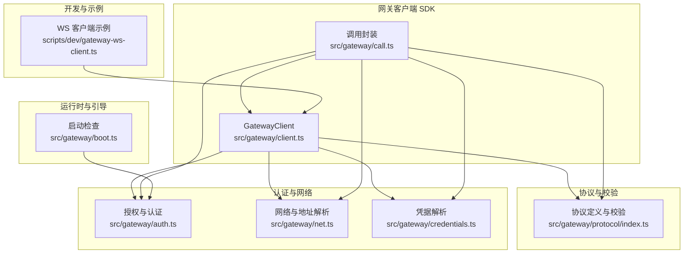
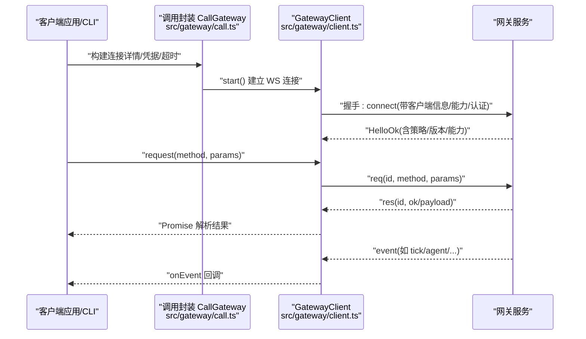
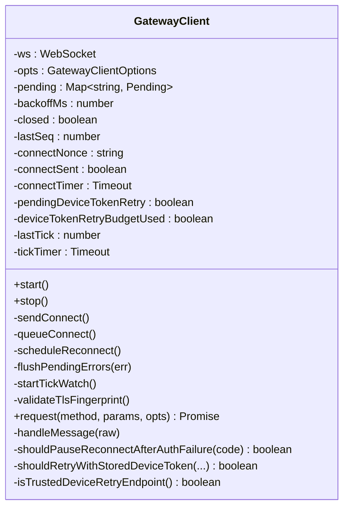
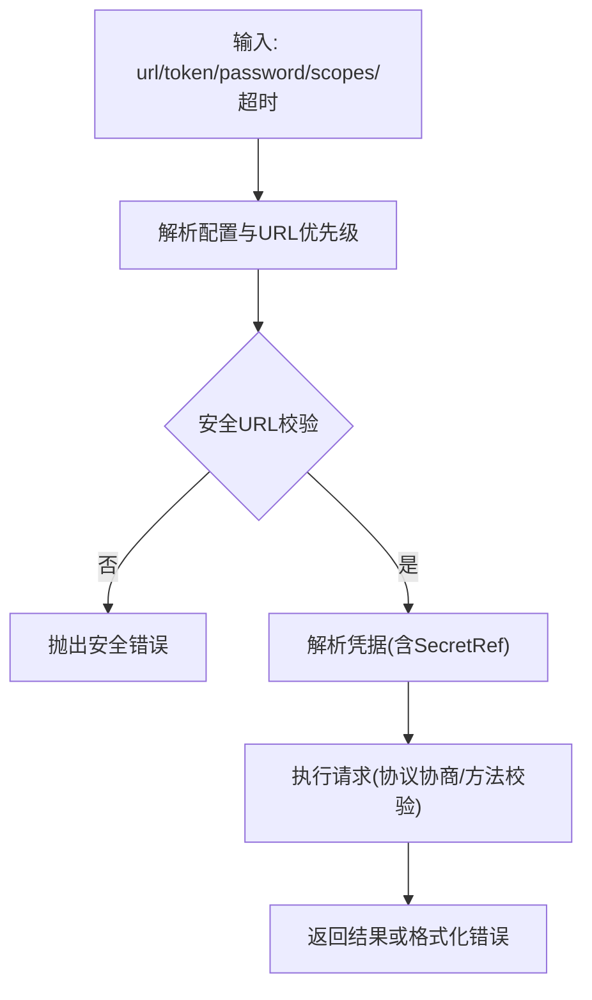
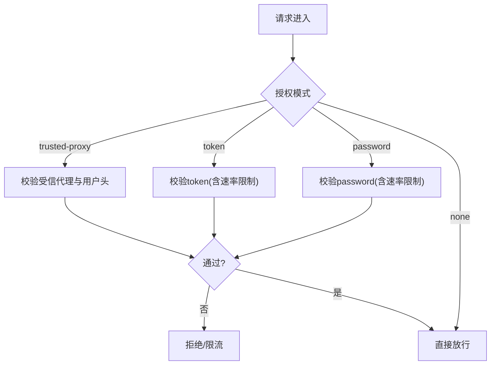
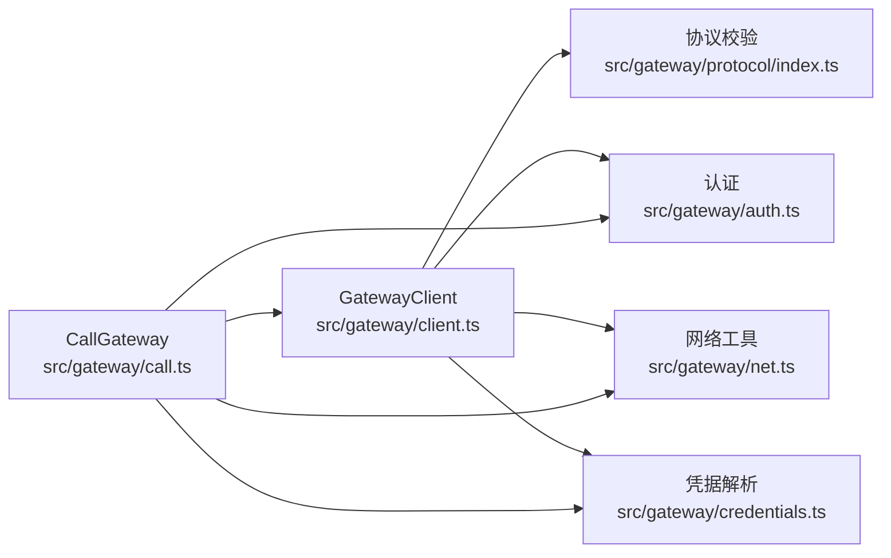

# 网关架构

<cite>
**本文引用的文件**
- [src/gateway/client.ts](file://src/gateway/client.ts)
- [src/gateway/call.ts](file://src/gateway/call.ts)
- [src/gateway/auth.ts](file://src/gateway/auth.ts)
- [src/gateway/net.ts](file://src/gateway/net.ts)
- [src/gateway/protocol/index.ts](file://src/gateway/protocol/index.ts)
- [src/gateway/credentials.ts](file://src/gateway/credentials.ts)
- [src/gateway/boot.ts](file://src/gateway/boot.ts)
- [scripts/dev/gateway-ws-client.ts](file://scripts/dev/gateway-ws-client.ts)
- [docs/cli/gateway.md](file://docs/cli/gateway.md)
- [docs/gateway/configuration.md](file://docs/gateway/configuration.md)
- [docs/gateway/authentication.md](file://docs/gateway/authentication.md)
- [docs/gateway/discovery.md](file://docs/gateway/discovery.md)
- [docs/gateway/protocol.md](file://docs/gateway/protocol.md)
- [docs/gateway/heartbeat.md](file://docs/gateway/heartbeat.md)
- [docs/gateway/secrets.md](file://docs/gateway/secrets.md)
- [apps/macos/Sources/OpenClaw/GatewayDiscoveryBrowserSupport.swift](file://apps/macos/Sources/OpenClaw/GatewayDiscoveryBrowserSupport.swift)
- [apps/android/app/src/main/java/.../ChatMessageViews.kt](file://apps/android/app/src/main/java/ai/openclaw/app/ui/chat/ChatMessageViews.kt)
- [apps/shared/OpenClawKit/Sources/OpenClawKit/GatewayDiscoveryBrowserSupport.swift](file://apps/shared/OpenClawKit/Sources/OpenClawKit/GatewayDiscoveryBrowserSupport.swift)
</cite>

## 目录
1. [引言](#引言)
2. [项目结构](#项目结构)
3. [核心组件](#核心组件)
4. [架构总览](#架构总览)
5. [详细组件分析](#详细组件分析)
6. [依赖关系分析](#依赖关系分析)
7. [性能考量](#性能考量)
8. [故障排查指南](#故障排查指南)
9. [结论](#结论)
10. [附录](#附录)

## 引言
本文件面向 OpenClaw 网关架构，系统性阐述其作为“单一长连接守护进程”的设计理念与实现细节。重点覆盖：
- WebSocket 控制平面的握手与认证流程
- 组件间交互模式与数据流向
- 网关职责边界：维护提供商连接、暴露类型化 WS API、验证入站帧与发出事件
- 客户端（mac 应用、CLI、Web 管理界面、自动化工具）与网关的连接方式与通信协议
- 节点系统（macOS/iOS/Android/headless）通过统一 WS 服务器接入与设备身份验证机制
- 提供连接生命周期、请求响应模式与事件订阅机制的具体代码路径示例

## 项目结构
OpenClaw 网关相关代码主要位于 src/gateway 目录，围绕“客户端 SDK + 协议校验 + 认证 + 网络工具 + 凭据解析”构建，同时配套 CLI 文档与多平台集成示例。

**图表来源**
- [src/gateway/client.ts:109-674](file://src/gateway/client.ts#L109-L674)
- [src/gateway/call.ts:38-700](file://src/gateway/call.ts#L38-L700)
- [src/gateway/protocol/index.ts:1-673](file://src/gateway/protocol/index.ts#L1-L673)
- [src/gateway/auth.ts:1-504](file://src/gateway/auth.ts#L1-L504)
- [src/gateway/net.ts:1-457](file://src/gateway/net.ts#L1-L457)
- [src/gateway/credentials.ts:1-351](file://src/gateway/credentials.ts#L1-L351)
- [src/gateway/boot.ts:1-204](file://src/gateway/boot.ts#L1-L204)
- [scripts/dev/gateway-ws-client.ts](file://scripts/dev/gateway-ws-client.ts)

**章节来源**
- [src/gateway/client.ts:109-674](file://src/gateway/client.ts#L109-L674)
- [src/gateway/call.ts:38-700](file://src/gateway/call.ts#L38-L700)
- [src/gateway/protocol/index.ts:1-673](file://src/gateway/protocol/index.ts#L1-L673)
- [src/gateway/auth.ts:1-504](file://src/gateway/auth.ts#L1-L504)
- [src/gateway/net.ts:1-457](file://src/gateway/net.ts#L1-L457)
- [src/gateway/credentials.ts:1-351](file://src/gateway/credentials.ts#L1-L351)
- [src/gateway/boot.ts:1-204](file://src/gateway/boot.ts#L1-L204)
- [scripts/dev/gateway-ws-client.ts](file://scripts/dev/gateway-ws-client.ts)

## 核心组件
- 网关客户端 GatewayClient：负责建立与维护 WebSocket 连接、发送请求、接收事件、处理重连与心跳检测、设备令牌缓存与重试策略。
- 调用封装 CallGateway：提供高层 API，解析配置、凭据与 TLS 指纹，构建连接详情，执行请求并返回结果。
- 协议与校验：基于 Ajv 的 Schema 校验，确保请求/响应/事件帧格式正确。
- 认证与授权：支持 none/token/password/trusted-proxy 模式，含速率限制、Tailscale 头部认证、受信代理链解析。
- 网络工具：安全 URL 校验、本地/私有地址判断、代理链解析、绑定主机选择等。
- 凭据解析：从配置、环境变量、SecretRef 解析 token/password，支持本地/远程优先级与回退策略。
- 启动检查：读取 BOOT.md 并以消息工具执行引导任务，记录会话映射快照与恢复。

**章节来源**
- [src/gateway/client.ts:109-674](file://src/gateway/client.ts#L109-L674)
- [src/gateway/call.ts:38-700](file://src/gateway/call.ts#L38-L700)
- [src/gateway/protocol/index.ts:253-458](file://src/gateway/protocol/index.ts#L253-L458)
- [src/gateway/auth.ts:217-485](file://src/gateway/auth.ts#L217-L485)
- [src/gateway/net.ts:411-456](file://src/gateway/net.ts#L411-L456)
- [src/gateway/credentials.ts:253-323](file://src/gateway/credentials.ts#L253-L323)
- [src/gateway/boot.ts:138-203](file://src/gateway/boot.ts#L138-L203)

## 架构总览
下图展示了从客户端到网关的典型交互：客户端通过 CallGateway 解析目标、凭据与 TLS 指纹，建立安全 WS 连接；握手阶段由 GatewayClient 发送 connect 请求，网关返回 HelloOk 并下发策略；随后客户端可发起方法调用并订阅事件。

**图表来源**
- [src/gateway/call.ts:779-800](file://src/gateway/call.ts#L779-L800)
- [src/gateway/client.ts:134-251](file://src/gateway/client.ts#L134-L251)
- [src/gateway/client.ts:369-415](file://src/gateway/client.ts#L369-L415)
- [src/gateway/protocol/index.ts:173-183](file://src/gateway/protocol/index.ts#L173-L183)

**章节来源**
- [src/gateway/call.ts:137-226](file://src/gateway/call.ts#L137-L226)
- [src/gateway/client.ts:134-251](file://src/gateway/client.ts#L134-L251)
- [src/gateway/protocol/index.ts:173-183](file://src/gateway/protocol/index.ts#L173-L183)

## 详细组件分析

### 组件一：GatewayClient（长连接客户端）
- 职责
  - 建立/维护 WS 连接，支持 TLS 指纹校验与受信代理场景
  - 握手挑战与响应，发送 connect 参数（客户端元数据、能力、权限、角色、作用域、设备签名）
  - 请求/响应管理：分配 ID、等待最终响应、处理 accepted 流程
  - 事件处理：校验事件帧、更新序列号、处理 tick 心跳、gap 检测
  - 重连与退避：异常关闭后指数退避，支持设备令牌重试预算
  - 关闭清理：清空待处理队列、清理定时器、必要时清除设备令牌缓存
- 关键流程
  - start() -> open -> queueConnect() -> 收到 connect.challenge -> sendConnect() -> HelloOk
  - request() -> 发送 req -> 等待 res -> 解析 payload 或 GatewayClientRequestError
  - on("close") -> flushPendingErrors() -> scheduleReconnect()

**图表来源**
- [src/gateway/client.ts:109-674](file://src/gateway/client.ts#L109-L674)

**章节来源**
- [src/gateway/client.ts:134-251](file://src/gateway/client.ts#L134-L251)
- [src/gateway/client.ts:267-415](file://src/gateway/client.ts#L267-L415)
- [src/gateway/client.ts:497-554](file://src/gateway/client.ts#L497-L554)
- [src/gateway/client.ts:556-574](file://src/gateway/client.ts#L556-L574)
- [src/gateway/client.ts:576-618](file://src/gateway/client.ts#L576-L618)
- [src/gateway/client.ts:620-645](file://src/gateway/client.ts#L620-L645)
- [src/gateway/client.ts:647-672](file://src/gateway/client.ts#L647-L672)

### 组件二：调用封装 CallGateway（高层 API）
- 职责
  - 解析配置与 URL 优先级（CLI > 环境变量 > 配置），生成连接详情
  - 安全 URL 校验（ws:// 仅 loopback，wss:// 或 break-glass）
  - 解析凭据（显式/配置/环境变量/SecretRef），支持本地/远程优先级与回退
  - 执行请求，支持最小/最大协议版本协商与所需方法校验
  - 返回错误格式化（包含 close 原因与连接详情）
- 关键流程
  - buildGatewayConnectionDetails() -> resolveGatewayCredentialsWithSecretInputs() -> executeGatewayRequestWithScopes()

**图表来源**
- [src/gateway/call.ts:137-226](file://src/gateway/call.ts#L137-L226)
- [src/gateway/call.ts:330-351](file://src/gateway/call.ts#L330-L351)
- [src/gateway/call.ts:652-700](file://src/gateway/call.ts#L652-L700)

**章节来源**
- [src/gateway/call.ts:137-226](file://src/gateway/call.ts#L137-L226)
- [src/gateway/call.ts:330-351](file://src/gateway/call.ts#L330-L351)
- [src/gateway/call.ts:652-700](file://src/gateway/call.ts#L652-L700)

### 组件三：认证与授权（HTTP/WS）
- 职责
  - 解析授权模式：none/token/password/trusted-proxy，并支持 Tailscale 头部认证
  - 受信代理链解析：X-Forwarded-For/X-Real-IP，严格拒绝代理回退到代理自身
  - 速率限制：按 IP 限流，失败计数，成功重置
  - 本地直连判定：结合 Host/Loopback/Trusted Proxy 判断
- 关键流程
  - authorizeGatewayConnect() -> trusted-proxy 校验 -> Tailscale 头部校验 -> token/password 校验 -> 速率限制

**图表来源**
- [src/gateway/auth.ts:378-485](file://src/gateway/auth.ts#L378-L485)
- [src/gateway/auth.ts:335-372](file://src/gateway/auth.ts#L335-L372)
- [src/gateway/auth.ts:448-481](file://src/gateway/auth.ts#L448-L481)

**章节来源**
- [src/gateway/auth.ts:217-292](file://src/gateway/auth.ts#L217-L292)
- [src/gateway/auth.ts:378-485](file://src/gateway/auth.ts#L378-L485)
- [src/gateway/auth.ts:125-146](file://src/gateway/auth.ts#L125-L146)

### 组件四：协议与校验
- 职责
  - 定义请求/响应/事件帧结构与协议版本
  - 使用 Ajv 对帧进行 Schema 校验，提供错误格式化
- 关键点
  - validateRequestFrame/validateResponseFrame/validateEventFrame
  - PROTOCOL_VERSION 协商与 requiredMethods 校验

**章节来源**
- [src/gateway/protocol/index.ts:253-458](file://src/gateway/protocol/index.ts#L253-L458)
- [src/gateway/protocol/index.ts:561-564](file://src/gateway/protocol/index.ts#L561-L564)

### 组件五：网络与地址解析
- 职责
  - 安全 WS URL 校验（CWE-319），默认仅允许 loopback 明文，支持 break-glass
  - 本地/私有地址识别、代理链解析、绑定主机选择策略
- 关键点
  - isSecureWebSocketUrl()、isLoopbackHost()/isPrivateOrLoopbackHost()
  - resolveClientIp()、isTrustedProxyAddress()

**章节来源**
- [src/gateway/net.ts:411-456](file://src/gateway/net.ts#L411-L456)
- [src/gateway/net.ts:156-185](file://src/gateway/net.ts#L156-L185)
- [src/gateway/net.ts:221-271](file://src/gateway/net.ts#L221-L271)

### 组件六：凭据解析与 SecretRef
- 职责
  - 从配置/环境变量/显式参数解析 token/password
  - 支持 SecretRef 在命令路径中逐步解析，不可用时报错
  - 本地/远程模式下的优先级与回退策略
- 关键点
  - resolveGatewayCredentialsFromConfig()、resolvePreferredGatewaySecretInputs()
  - GatewaySecretRefUnavailableError

**章节来源**
- [src/gateway/credentials.ts:253-323](file://src/gateway/credentials.ts#L253-L323)
- [src/gateway/credentials.ts:53-77](file://src/gateway/credentials.ts#L53-L77)

### 组件七：启动检查与会话映射
- 职责
  - 读取 BOOT.md，构造引导提示，调用 agent 执行
  - 快照主会话映射，执行后恢复，保证引导过程对会话状态无副作用
- 关键点
  - runBootOnce()、snapshotMainSessionMapping()、restoreMainSessionMapping()

**章节来源**
- [src/gateway/boot.ts:138-203](file://src/gateway/boot.ts#L138-L203)

## 依赖关系分析
- 组件耦合
  - GatewayClient 依赖协议校验、认证、网络与凭据模块
  - CallGateway 依赖 GatewayClient 与上述模块，提供高层 API
  - 认证模块依赖网络与 Tailscale 工具，提供授权结果
- 外部依赖
  - ws 客户端、Ajv 校验库、Node 内置 crypto/net/os
- 循环依赖
  - 未见循环导入；各模块职责清晰，接口稳定

**图表来源**
- [src/gateway/call.ts:38-700](file://src/gateway/call.ts#L38-L700)
- [src/gateway/client.ts:109-674](file://src/gateway/client.ts#L109-L674)
- [src/gateway/protocol/index.ts:1-673](file://src/gateway/protocol/index.ts#L1-L673)
- [src/gateway/auth.ts:1-504](file://src/gateway/auth.ts#L1-L504)
- [src/gateway/net.ts:1-457](file://src/gateway/net.ts#L1-L457)
- [src/gateway/credentials.ts:1-351](file://src/gateway/credentials.ts#L1-L351)

**章节来源**
- [src/gateway/call.ts:38-700](file://src/gateway/call.ts#L38-L700)
- [src/gateway/client.ts:109-674](file://src/gateway/client.ts#L109-L674)

## 性能考量
- 连接复用：单个长连接承载多请求/事件，减少握手开销
- 心跳与保活：tick 心跳检测静默断连，避免资源泄漏
- 退避重连：指数退避降低风暴效应
- 负载与背压：事件帧序列号与 gap 检测，便于有序处理
- TLS 指纹校验：一次性校验，避免重复握手成本

[本节为通用指导，无需特定文件引用]

## 故障排查指南
- 连接失败
  - 检查安全 URL：ws:// 仅 loopback，远程请使用 wss:// 或受信任隧道
  - 查看 TLS 指纹：若启用指纹校验，确认与证书一致
  - 观察 close 代码与原因：常见为 1008（策略违规）、1006（异常断开）
- 认证问题
  - 检查授权模式与凭据：token/password 是否匹配
  - 速率限制：频繁失败会被限流，等待 retryAfterMs
  - 受信代理：确认 X-Forwarded-* 与受信代理列表配置
- 设备令牌
  - 若出现设备令牌不匹配，客户端会清理缓存并触发设备令牌重试预算
- 协议与方法
  - 确认最小/最大协议版本与所需方法是否满足当前网关能力

**章节来源**
- [src/gateway/client.ts:144-168](file://src/gateway/client.ts#L144-L168)
- [src/gateway/client.ts:211-244](file://src/gateway/client.ts#L211-L244)
- [src/gateway/auth.ts:415-431](file://src/gateway/auth.ts#L415-L431)
- [src/gateway/auth.ts:433-481](file://src/gateway/auth.ts#L433-L481)
- [src/gateway/call.ts:731-748](file://src/gateway/call.ts#L731-L748)

## 结论
OpenClaw 网关采用“单一长连接守护进程 + 类型化 WS API + 强约束认证”的架构设计，通过严格的协议校验、安全 URL 策略与受信代理链解析，确保在多平台节点与多类客户端场景下的安全、可靠与高性能通信。GatewayClient 与 CallGateway 将复杂性封装在清晰的接口之下，既满足自动化工具的高吞吐需求，也保障了 GUI/CLI 的易用性。

[本节为总结，无需特定文件引用]

## 附录

### 客户端接入与通信协议要点
- 连接目标解析
  - CLI 覆盖优先于环境变量，再回退到配置；远程模式需设置 gateway.remote.url
  - 安全 URL 校验：ws:// 仅 loopback，wss:// 或 break-glass
- 认证方式
  - 支持 none/token/password/trusted-proxy；可启用 Tailscale 头部认证
  - 速率限制与本地直连判定
- 协议版本与方法
  - 最小/最大协议版本协商
  - requiredMethods 校验，确保方法可用
- 事件与心跳
  - 事件帧校验，tick 心跳保活，gap 检测

**章节来源**
- [src/gateway/call.ts:137-226](file://src/gateway/call.ts#L137-L226)
- [src/gateway/auth.ts:378-485](file://src/gateway/auth.ts#L378-L485)
- [src/gateway/protocol/index.ts:253-458](file://src/gateway/protocol/index.ts#L253-L458)

### 节点系统接入与设备身份验证
- 统一 WS 服务器：macOS/iOS/Android/headless 节点均通过相同 WS 服务器接入
- 设备身份验证：客户端携带设备签名（公钥、签名、时间戳、nonce），网关验证后下发设备令牌
- 设备令牌重试：在受信任端点与预算内自动重试，提升容错

**章节来源**
- [src/gateway/client.ts:283-343](file://src/gateway/client.ts#L283-L343)
- [src/gateway/client.ts:395-476](file://src/gateway/client.ts#L395-L476)
- [src/gateway/client.ts:478-495](file://src/gateway/client.ts#L478-L495)

### 开发与示例参考
- 开发用 WS 客户端示例：用于快速验证网关行为与协议
- CLI 文档：gateway 子命令与配置说明
- 网关配置与认证文档：权威参考

**章节来源**
- [scripts/dev/gateway-ws-client.ts](file://scripts/dev/gateway-ws-client.ts)
- [docs/cli/gateway.md](file://docs/cli/gateway.md)
- [docs/gateway/configuration.md](file://docs/gateway/configuration.md)
- [docs/gateway/authentication.md](file://docs/gateway/authentication.md)
- [docs/gateway/discovery.md](file://docs/gateway/discovery.md)
- [docs/gateway/protocol.md](file://docs/gateway/protocol.md)
- [docs/gateway/heartbeat.md](file://docs/gateway/heartbeat.md)
- [docs/gateway/secrets.md](file://docs/gateway/secrets.md)