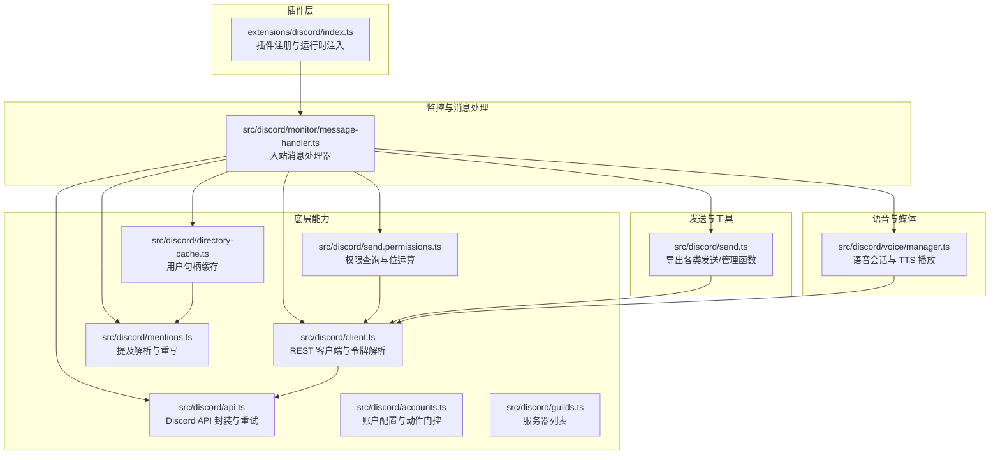
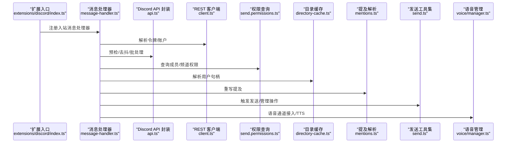
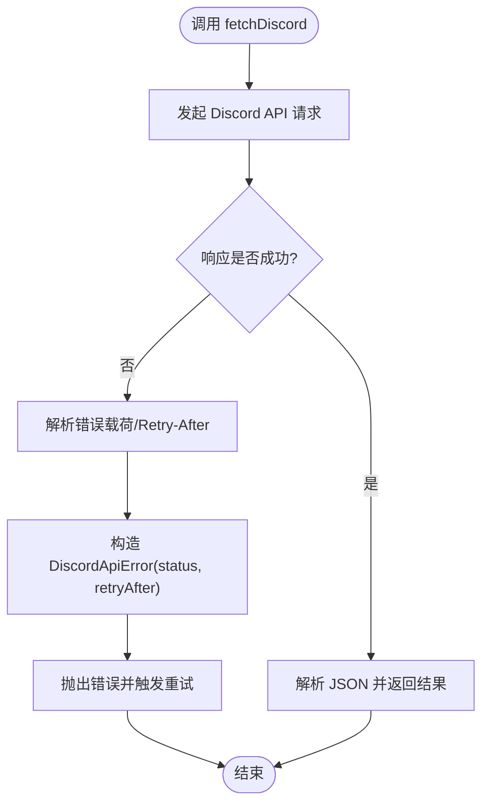
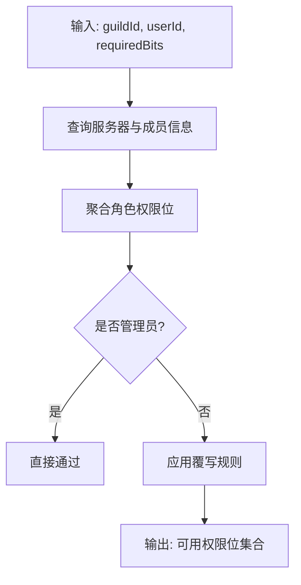
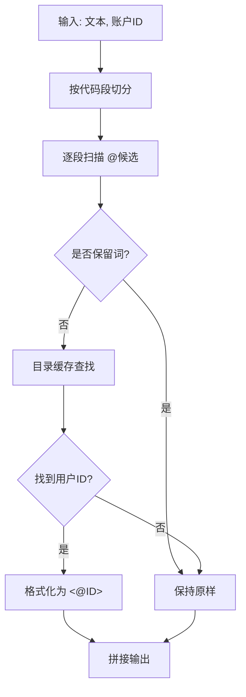
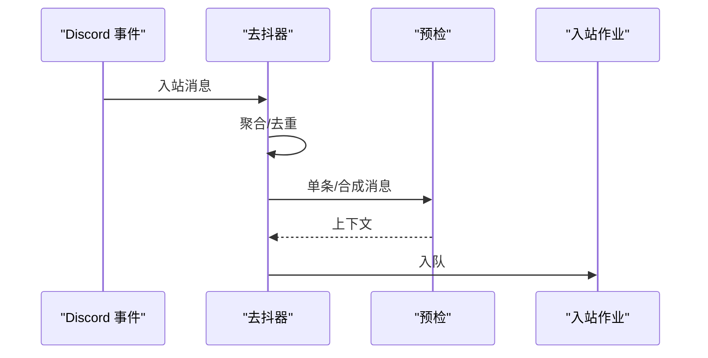
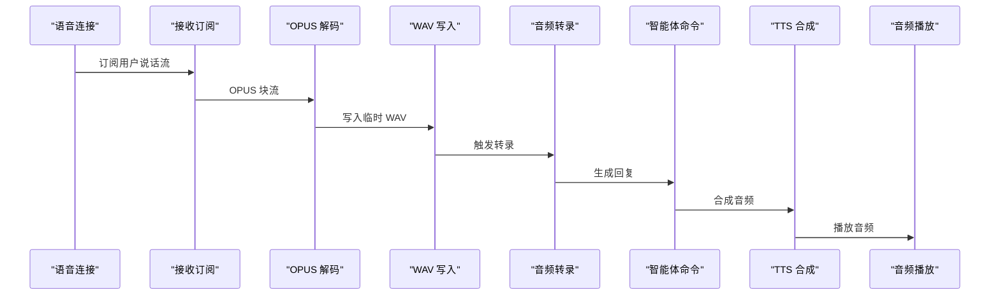
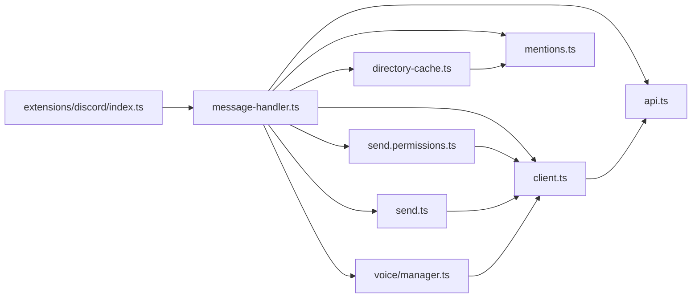
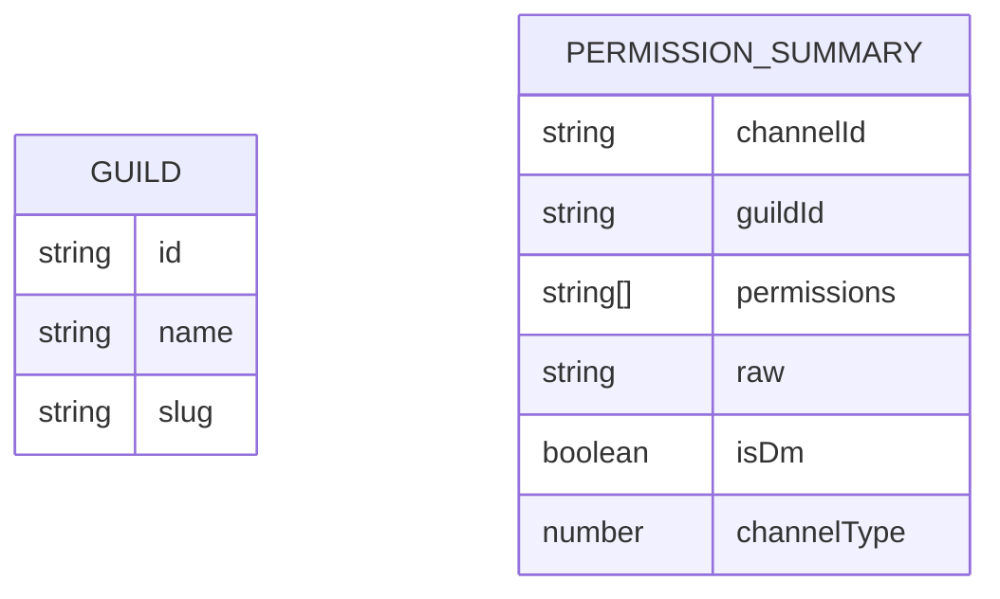

# Discord 集成

<cite>
**本文引用的文件**
- [extensions/discord/index.ts](file://extensions/discord/index.ts)
- [skills/discord/SKILL.md](file://skills/discord/SKILL.md)
- [src/discord/api.ts](file://src/discord/api.ts)
- [src/discord/client.ts](file://src/discord/client.ts)
- [src/discord/send.ts](file://src/discord/send.ts)
- [src/discord/mentions.ts](file://src/discord/mentions.ts)
- [src/discord/directory-cache.ts](file://src/discord/directory-cache.ts)
- [src/discord/send.permissions.ts](file://src/discord/send.permissions.ts)
- [src/discord/guilds.ts](file://src/discord/guilds.ts)
- [src/discord/voice/manager.ts](file://src/discord/voice/manager.ts)
- [src/discord/monitor/message-handler.ts](file://src/discord/monitor/message-handler.ts)
- [src/discord/accounts.ts](file://src/discord/accounts.ts)
</cite>

## 目录
1. [简介](#简介)
2. [项目结构](#项目结构)
3. [核心组件](#核心组件)
4. [架构总览](#架构总览)
5. [详细组件分析](#详细组件分析)
6. [依赖关系分析](#依赖关系分析)
7. [性能考量](#性能考量)
8. [故障排查指南](#故障排查指南)
9. [结论](#结论)
10. [附录](#附录)

## 简介
本技术文档面向在 OpenClaw 中集成 Discord 的开发者与运维人员，系统性阐述如何通过内置的 Discord 插件与底层能力完成消息收发、权限校验、目录缓存、提及解析、语音通道接入、活动与表情包等高级功能。文档同时覆盖 Discord API 的错误与速率限制处理、安全注意事项以及最佳实践。

## 项目结构
OpenClaw 将 Discord 集成拆分为“插件入口”“底层能力层”“监控与消息处理层”“语音与媒体理解层”等模块，形成清晰的分层架构。插件入口负责注册与运行时注入；底层能力层提供 REST 客户端、重试与错误处理、权限查询与目录缓存；监控层负责入站消息的预检、去抖与工作队列；语音层提供语音通道接入、音频解码、转录与 TTS 播放。

**图表来源**
- [extensions/discord/index.ts:1-20](file://extensions/discord/index.ts#L1-L20)
- [src/discord/monitor/message-handler.ts:1-187](file://src/discord/monitor/message-handler.ts#L1-L187)
- [src/discord/api.ts:1-137](file://src/discord/api.ts#L1-L137)
- [src/discord/client.ts:1-89](file://src/discord/client.ts#L1-L89)
- [src/discord/send.permissions.ts:1-233](file://src/discord/send.permissions.ts#L1-L233)
- [src/discord/directory-cache.ts:1-112](file://src/discord/directory-cache.ts#L1-L112)
- [src/discord/mentions.ts:1-84](file://src/discord/mentions.ts#L1-L84)
- [src/discord/accounts.ts:1-90](file://src/discord/accounts.ts#L1-L90)
- [src/discord/guilds.ts:1-30](file://src/discord/guilds.ts#L1-L30)
- [src/discord/send.ts:1-82](file://src/discord/send.ts#L1-L82)
- [src/discord/voice/manager.ts:1-800](file://src/discord/voice/manager.ts#L1-L800)

**章节来源**
- [extensions/discord/index.ts:1-20](file://extensions/discord/index.ts#L1-L20)
- [src/discord/monitor/message-handler.ts:1-187](file://src/discord/monitor/message-handler.ts#L1-L187)

## 核心组件
- 插件入口与运行时注入：负责注册 Discord 通道、注入运行时与子代理钩子。
- REST 客户端与令牌解析：统一解析账户令牌、构建 RequestClient、封装重试策略。
- Discord API 封装：对 Discord API 基础路径、错误格式化、429 重试头解析与抛错进行统一封装。
- 权限系统：基于位字段计算成员在服务器与频道中的权限，支持管理员豁免与覆盖规则。
- 目录缓存与提及解析：维护用户句柄到 ID 的映射，支持 Markdown 代码段内忽略与保留字过滤。
- 入站消息处理：预检、去抖、批处理、工作队列与超时控制。
- 发送工具集：导出频道/角色/消息/反应/表情/贴图/线程/搜索等操作。
- 语音管理：语音通道接入、OPUS 解码、音频转录、TTS 合成与播放、解密失败恢复。

**章节来源**
- [src/discord/client.ts:1-89](file://src/discord/client.ts#L1-L89)
- [src/discord/api.ts:1-137](file://src/discord/api.ts#L1-L137)
- [src/discord/send.permissions.ts:1-233](file://src/discord/send.permissions.ts#L1-L233)
- [src/discord/directory-cache.ts:1-112](file://src/discord/directory-cache.ts#L1-L112)
- [src/discord/mentions.ts:1-84](file://src/discord/mentions.ts#L1-L84)
- [src/discord/monitor/message-handler.ts:1-187](file://src/discord/monitor/message-handler.ts#L1-L187)
- [src/discord/send.ts:1-82](file://src/discord/send.ts#L1-L82)
- [src/discord/voice/manager.ts:1-800](file://src/discord/voice/manager.ts#L1-L800)

## 架构总览
下图展示从插件入口到消息处理、权限查询、目录解析与语音处理的关键交互路径。

**图表来源**
- [extensions/discord/index.ts:1-20](file://extensions/discord/index.ts#L1-L20)
- [src/discord/monitor/message-handler.ts:1-187](file://src/discord/monitor/message-handler.ts#L1-L187)
- [src/discord/api.ts:1-137](file://src/discord/api.ts#L1-L137)
- [src/discord/client.ts:1-89](file://src/discord/client.ts#L1-L89)
- [src/discord/send.permissions.ts:1-233](file://src/discord/send.permissions.ts#L1-L233)
- [src/discord/directory-cache.ts:1-112](file://src/discord/directory-cache.ts#L1-L112)
- [src/discord/mentions.ts:1-84](file://src/discord/mentions.ts#L1-L84)
- [src/discord/send.ts:1-82](file://src/discord/send.ts#L1-L82)
- [src/discord/voice/manager.ts:1-800](file://src/discord/voice/manager.ts#L1-L800)

## 详细组件分析

### 插件入口与运行时注入
- 负责设置运行时、注册 Discord 通道与子代理钩子，使上层能力在运行期可用。
- 通过空配置模式与插件 ID、名称、描述等元信息完成插件注册。

**章节来源**
- [extensions/discord/index.ts:1-20](file://extensions/discord/index.ts#L1-L20)

### REST 客户端与令牌解析
- 支持显式令牌或从配置解析令牌，合并账户级配置，构造 RequestClient。
- 提供带重试策略的客户端工厂，结合账户配置与显式重试参数。

**章节来源**
- [src/discord/client.ts:1-89](file://src/discord/client.ts#L1-L89)
- [src/discord/accounts.ts:1-90](file://src/discord/accounts.ts#L1-L90)

### Discord API 封装与速率限制处理
- 统一基础路径与请求头（Bot 令牌），对非 2xx 响应抛出带状态码与可选 Retry-After 的错误。
- 自动解析 JSON 错误体与 Retry-After 头，支持指数退避与抖动的重试策略。
- 对 429 场景按 payload.retry_after 或 Retry-After 决定等待时间。

**图表来源**
- [src/discord/api.ts:96-137](file://src/discord/api.ts#L96-L137)

**章节来源**
- [src/discord/api.ts:1-137](file://src/discord/api.ts#L1-L137)

### 权限系统：服务器与频道权限
- 成员服务器权限：聚合 everyone 角色与成员角色的权限位，支持管理员豁免。
- 频道权限：在服务器权限基础上叠加 permission_overwrites，分别处理 @everyone、成员角色与机器人自身覆写。
- 提供“任一满足/全部满足”的权限判断辅助方法，便于细粒度授权。

**图表来源**
- [src/discord/send.permissions.ts:60-233](file://src/discord/send.permissions.ts#L60-L233)

**章节来源**
- [src/discord/send.permissions.ts:1-233](file://src/discord/send.permissions.ts#L1-L233)

### 目录缓存与提及解析
- 目录缓存：以账户维度维护句柄到用户 ID 的映射，支持去除识别码后回退匹配，具备容量上限与淘汰机制。
- 提及解析：在纯文本中识别 @xxx，排除保留词（everyone、here），并仅在 Markdown 代码段外进行替换；最终格式化为 Discord 语法。

**图表来源**
- [src/discord/mentions.ts:41-84](file://src/discord/mentions.ts#L41-L84)
- [src/discord/directory-cache.ts:60-112](file://src/discord/directory-cache.ts#L60-L112)

**章节来源**
- [src/discord/directory-cache.ts:1-112](file://src/discord/directory-cache.ts#L1-L112)
- [src/discord/mentions.ts:1-84](file://src/discord/mentions.ts#L1-L84)

### 入站消息处理：预检、去抖与批处理
- 预检：在进入去抖前先过滤机器人自言自语，避免占用去抖窗口。
- 去抖：按作者+频道键聚合短时间内的多条消息，生成合成消息；支持媒体存在性判断。
- 工作队列：将预检后的上下文投递到入站工作器执行后续逻辑。

**图表来源**
- [src/discord/monitor/message-handler.ts:162-187](file://src/discord/monitor/message-handler.ts#L162-L187)

**章节来源**
- [src/discord/monitor/message-handler.ts:1-187](file://src/discord/monitor/message-handler.ts#L1-L187)

### 发送工具集与高级功能
- 频道管理：创建/删除/编辑/移动频道、设置/移除频道权限。
- 服务器与成员：列出服务器、获取成员/角色/频道信息、踢/封禁/限时、创建活动。
- 消息：发送/编辑/删除/读取/搜索、置顶/取消置顶、创建线程、投票。
- 表情与贴图：列出、上传表情与贴图。
- 反应：列出/添加/移除反应。
- 组件消息：推荐使用组件 v2（不与 embeds 混用）。

**章节来源**
- [src/discord/send.ts:1-82](file://src/discord/send.ts#L1-L82)

### 语音通道与媒体理解
- 语音接入：自动加入配置的语音频道，订阅说话事件，处理断线与销毁事件。
- 音频处理：OPUS 流解码为 PCM，写入 WAV 文件，估算时长，触发媒体理解转录。
- 回复流程：根据转录内容生成回复，解析 TTS 指令，合成音频并播放。
- 安全与稳定性：检测解密失败并进行自动重连恢复，记录解密失败次数与窗口。

**图表来源**
- [src/discord/voice/manager.ts:563-718](file://src/discord/voice/manager.ts#L563-L718)

**章节来源**
- [src/discord/voice/manager.ts:1-800](file://src/discord/voice/manager.ts#L1-L800)

### 技能与使用指南
- 使用 message 工具通过 channel=discord 发送消息，支持静默通知、媒体附件、组件 v2 与传统 embeds。
- 目标与动作示例：发送、带媒体、反应、读取、编辑/删除、投票、置顶、创建线程、搜索、设置在线状态。
- 写作风格：简洁口语化，避免 Markdown 表格，使用 <@USER_ID> 提及用户。

**章节来源**
- [skills/discord/SKILL.md:1-198](file://skills/discord/SKILL.md#L1-L198)

## 依赖关系分析
- 插件入口依赖运行时与通道注册；消息处理器依赖预检、去抖、权限与目录能力。
- REST 客户端依赖令牌解析与账户配置；API 封装依赖重试与错误格式化。
- 权限查询依赖 Discord API 类型与路由；目录缓存依赖账户维度键空间。
- 语音管理依赖 Carbon 客户端与 @discordjs/voice，结合媒体理解与 TTS。

**图表来源**
- [extensions/discord/index.ts:1-20](file://extensions/discord/index.ts#L1-L20)
- [src/discord/monitor/message-handler.ts:1-187](file://src/discord/monitor/message-handler.ts#L1-L187)
- [src/discord/api.ts:1-137](file://src/discord/api.ts#L1-L137)
- [src/discord/client.ts:1-89](file://src/discord/client.ts#L1-L89)
- [src/discord/send.permissions.ts:1-233](file://src/discord/send.permissions.ts#L1-L233)
- [src/discord/directory-cache.ts:1-112](file://src/discord/directory-cache.ts#L1-L112)
- [src/discord/mentions.ts:1-84](file://src/discord/mentions.ts#L1-L84)
- [src/discord/send.ts:1-82](file://src/discord/send.ts#L1-L82)
- [src/discord/voice/manager.ts:1-800](file://src/discord/voice/manager.ts#L1-L800)

**章节来源**
- [src/discord/accounts.ts:1-90](file://src/discord/accounts.ts#L1-L90)
- [src/discord/guilds.ts:1-30](file://src/discord/guilds.ts#L1-L30)

## 性能考量
- 去抖与批处理：减少重复预检与工作队列压力，提升吞吐。
- 缓存与重试：目录缓存降低重复解析成本；API 重试与抖动避免雪崩。
- 语音处理：OPUS 解码与临时文件写入需注意磁盘与 CPU 开销；最小片段时长阈值避免噪声干扰。
- 权限查询：批量/并发查询时注意 API 速率限制与幂等性。

[本节为通用指导，无需特定文件引用]

## 故障排查指南
- 429 与 Retry-After：检查错误载荷与头部，确认重试等待时间；必要时降低并发或调整重试策略。
- 机器人自言自语：确保预检阶段已过滤 botUserId，避免占用去抖窗口。
- 权限不足：使用 hasAnyGuildPermissionDiscord/hasAllGuildPermissionsDiscord 明确所需权限位；检查覆写规则与管理员豁免。
- 提及未生效：确认不在代码段内、句柄未被保留词占用、目录缓存命中；必要时刷新缓存。
- 语音解密失败：关注解密失败计数与窗口，超过阈值自动重连；检查 DAVE 加密与容错配置。

**章节来源**
- [src/discord/api.ts:108-137](file://src/discord/api.ts#L108-L137)
- [src/discord/monitor/message-handler.ts:162-187](file://src/discord/monitor/message-handler.ts#L162-L187)
- [src/discord/send.permissions.ts:94-147](file://src/discord/send.permissions.ts#L94-L147)
- [src/discord/mentions.ts:41-84](file://src/discord/mentions.ts#L41-L84)
- [src/discord/voice/manager.ts:720-776](file://src/discord/voice/manager.ts#L720-L776)

## 结论
OpenClaw 的 Discord 集成以插件化入口为核心，配合完善的 REST 封装、权限系统、目录缓存与入站消息处理流水线，实现了从消息收发到语音交互的全链路能力。通过明确的动作门控、速率限制与错误处理策略，可在生产环境中稳定运行并扩展高级功能。

[本节为总结，无需特定文件引用]

## 附录

### 关键数据模型与类型
- 服务器摘要：包含 id、name、slug 字段，用于 UI 与路由。
- 权限摘要：包含可用权限位集合、原始位字符串、是否 DM、频道类型等。

**图表来源**
- [src/discord/guilds.ts:4-30](file://src/discord/guilds.ts#L4-L30)
- [src/discord/send.permissions.ts:154-233](file://src/discord/send.permissions.ts#L154-L233)

**章节来源**
- [src/discord/guilds.ts:1-30](file://src/discord/guilds.ts#L1-L30)
- [src/discord/send.permissions.ts:154-233](file://src/discord/send.permissions.ts#L154-L233)