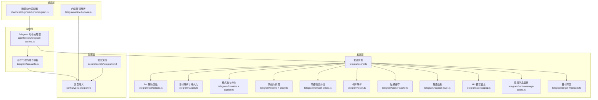
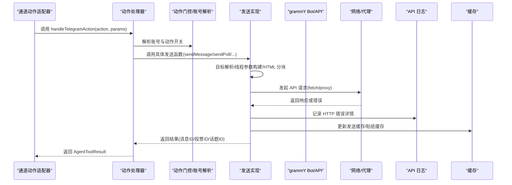
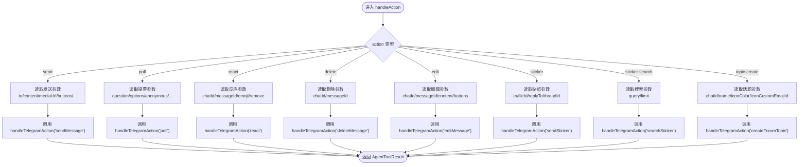
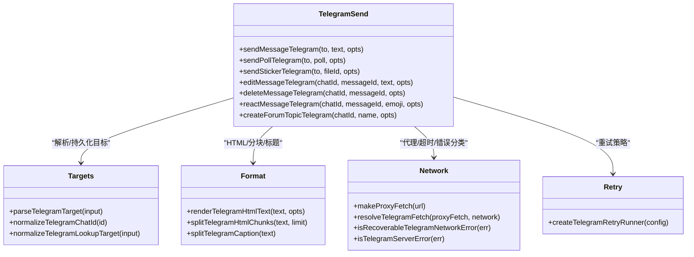
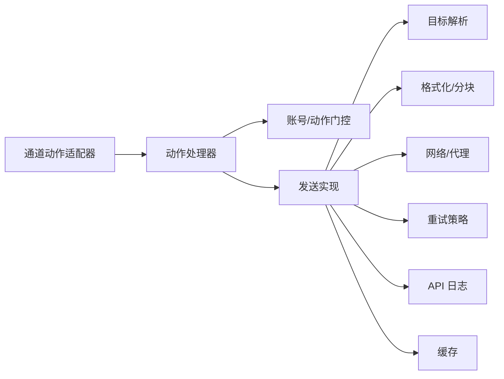

# Telegram 集成

<cite>
**本文引用的文件**
- [src/telegram/send.ts](file://src/telegram/send.ts)
- [src/telegram/accounts.ts](file://src/telegram/accounts.ts)
- [src/telegram/inline-buttons.ts](file://src/telegram/inline-buttons.ts)
- [src/telegram/button-types.ts](file://src/telegram/button-types.ts)
- [src/telegram/targets.ts](file://src/telegram/targets.ts)
- [src/telegram/format.ts](file://src/telegram/format.ts)
- [src/telegram/caption.ts](file://src/telegram/caption.ts)
- [src/telegram/fetch.ts](file://src/telegram/fetch.ts)
- [src/telegram/proxy.ts](file://src/telegram/proxy.ts)
- [src/telegram/network-errors.ts](file://src/telegram/network-errors.ts)
- [src/telegram/token.ts](file://src/telegram/token.ts)
- [src/telegram/sticker-cache.ts](file://src/telegram/sticker-cache.ts)
- [src/telegram/reaction-level.ts](file://src/telegram/reaction-level.ts)
- [src/telegram/bot/helpers.ts](file://src/telegram/bot/helpers.ts)
- [src/telegram/api-logging.ts](file://src/telegram/api-logging.ts)
- [src/telegram/sent-message-cache.ts](file://src/telegram/sent-message-cache.ts)
- [src/telegram/target-writeback.ts](file://src/telegram/target-writeback.ts)
- [src/agents/tools/telegram-actions.ts](file://src/agents/tools/telegram-actions.ts)
- [src/channels/plugins/actions/telegram.ts](file://src/channels/plugins/actions/telegram.ts)
- [src/config/types.telegram.ts](file://src/config/types.telegram.ts)
- [docs/channels/telegram.md](file://docs/channels/telegram.md)
</cite>

## 目录
1. [简介](#简介)
2. [项目结构](#项目结构)
3. [核心组件](#核心组件)
4. [架构总览](#架构总览)
5. [详细组件分析](#详细组件分析)
6. [依赖关系分析](#依赖关系分析)
7. [性能考量](#性能考量)
8. [故障排除指南](#故障排除指南)
9. [结论](#结论)
10. [附录](#附录)

## 简介
本文件面向需要在 OpenClaw 中集成 Telegram 渠道的工程师与运维人员，系统性阐述基于 grammY 框架的 Telegram Bot API 集成实现，覆盖消息路由、内联键盘与按钮、文件上传下载、频道/群组权限管理、管理员权限与成员验证、配置项（含 Webhook、代理、自定义命令）、以及故障排除与安全最佳实践。内容严格基于仓库源码与官方文档，确保技术细节准确可追溯。

## 项目结构
OpenClaw 将 Telegram 集成划分为“通道层”“动作层”“发送层”“配置层”“工具层”等模块，形成清晰的分层职责与依赖关系：
- 通道层：负责将 Telegram Bot API 的入站事件转换为统一的消息格式，并进行会话键构建与路由。
- 动作层：提供对 Telegram 原生能力的封装（如发送文本、媒体、投票、贴纸、话题等），并支持内联键盘按钮。
- 发送层：基于 grammY 客户端，实现消息发送、编辑、删除、反应、投票、贴纸、论坛话题创建等功能；内置重试、超时、代理、网络错误分类与回退策略。
- 配置层：定义 Telegram 账号、能力、策略、网络、Webhook、代理、动作开关、反应级别与通知等配置类型与默认值。
- 工具层：为自动化与代理工具提供统一的动作接口，屏蔽底层 API 细节。

图表来源
- [src/channels/plugins/actions/telegram.ts:1-288](file://src/channels/plugins/actions/telegram.ts#L1-L288)
- [src/agents/tools/telegram-actions.ts:1-479](file://src/agents/tools/telegram-actions.ts#L1-L479)
- [src/telegram/send.ts:1-1525](file://src/telegram/send.ts#L1-L1525)
- [src/telegram/accounts.ts:1-209](file://src/telegram/accounts.ts#L1-L209)
- [src/telegram/inline-buttons.ts:1-68](file://src/telegram/inline-buttons.ts#L1-L68)
- [src/config/types.telegram.ts:1-264](file://src/config/types.telegram.ts#L1-L264)
- [docs/channels/telegram.md:1-975](file://docs/channels/telegram.md#L1-L975)

章节来源
- [src/channels/plugins/actions/telegram.ts:1-288](file://src/channels/plugins/actions/telegram.ts#L1-L288)
- [src/agents/tools/telegram-actions.ts:1-479](file://src/agents/tools/telegram-actions.ts#L1-L479)
- [src/telegram/send.ts:1-1525](file://src/telegram/send.ts#L1-L1525)
- [src/telegram/accounts.ts:1-209](file://src/telegram/accounts.ts#L1-L209)
- [src/telegram/inline-buttons.ts:1-68](file://src/telegram/inline-buttons.ts#L1-L68)
- [src/config/types.telegram.ts:1-264](file://src/config/types.telegram.ts#L1-L264)
- [docs/channels/telegram.md:1-975](file://docs/channels/telegram.md#L1-L975)

## 核心组件
- grammY Bot 客户端与 API 包装：封装 sendMessage、editMessageText、deleteMessage、setMessageReaction、sendPhoto/Animation/Video/Audio/Document、sendPoll、sendSticker、createForumTopic 等方法，统一参数校验、线程/回复参数构建、HTML 解析回退、错误分类与重试。
- 动作门控与账号解析：根据配置与账号维度合并动作开关（如 sendMessage、poll、reactions、sticker、deleteMessage、editMessage、createForumTopic），并解析默认/指定账号的令牌。
- 内联按钮与键盘：解析按钮数组，限制 callback_data 长度，支持样式标记，按作用域（off/dm/group/all/allowlist）与目标聊天类型（DM/群组）进行启用控制。
- 目标解析与持久化：支持用户名、数字 ID、带 topic 的目标字符串，解析并持久化到配置，避免后续重复解析。
- 网络与代理：支持 SOCKS/HTTP 代理，自动选择 IPv4/IPv6，DNS 结果顺序控制，客户端超时配置，错误重试策略。
- 贴纸搜索与缓存：本地缓存贴纸描述，减少重复视觉识别调用。
- 反应级别与通知：控制机器人自身反应能力与对外部反应的通知策略。
- Webhook 与长轮询：默认长轮询，支持本地 Webhook 监听与反向代理部署。

章节来源
- [src/telegram/send.ts:1-1525](file://src/telegram/send.ts#L1-L1525)
- [src/agents/tools/telegram-actions.ts:1-479](file://src/agents/tools/telegram-actions.ts#L1-L479)
- [src/telegram/accounts.ts:1-209](file://src/telegram/accounts.ts#L1-L209)
- [src/telegram/inline-buttons.ts:1-68](file://src/telegram/inline-buttons.ts#L1-L68)
- [src/telegram/targets.ts:1-200](file://src/telegram/targets.ts#L1-L200)
- [src/telegram/fetch.ts:1-200](file://src/telegram/fetch.ts#L1-L200)
- [src/telegram/proxy.ts:1-200](file://src/telegram/proxy.ts#L1-L200)
- [src/telegram/network-errors.ts:1-200](file://src/telegram/network-errors.ts#L1-L200)
- [src/telegram/sticker-cache.ts:1-200](file://src/telegram/sticker-cache.ts#L1-L200)
- [src/telegram/reaction-level.ts:1-200](file://src/telegram/reaction-level.ts#L1-L200)
- [src/telegram/api-logging.ts:1-200](file://src/telegram/api-logging.ts#L1-L200)
- [src/telegram/sent-message-cache.ts:1-200](file://src/telegram/sent-message-cache.ts#L1-L200)
- [src/telegram/target-writeback.ts:1-200](file://src/telegram/target-writeback.ts#L1-L200)
- [src/config/types.telegram.ts:1-264](file://src/config/types.telegram.ts#L1-L264)
- [docs/channels/telegram.md:1-975](file://docs/channels/telegram.md#L1-L975)

## 架构总览
下图展示从“通道动作适配器”到“grammY API”的调用链路，以及关键中间件（目标解析、格式化、网络、重试、错误日志、缓存、写回）的作用点。

图表来源
- [src/channels/plugins/actions/telegram.ts:124-286](file://src/channels/plugins/actions/telegram.ts#L124-L286)
- [src/agents/tools/telegram-actions.ts:92-478](file://src/agents/tools/telegram-actions.ts#L92-L478)
- [src/telegram/send.ts:588-946](file://src/telegram/send.ts#L588-L946)
- [src/telegram/api-logging.ts:1-200](file://src/telegram/api-logging.ts#L1-L200)
- [src/telegram/sent-message-cache.ts:1-200](file://src/telegram/sent-message-cache.ts#L1-L200)
- [src/telegram/sticker-cache.ts:1-200](file://src/telegram/sticker-cache.ts#L1-L200)

## 详细组件分析

### 组件一：通道动作适配器（Telegram）
- 职责：将通用动作名称映射到 Telegram 原生动作，读取并校验参数，提取工具发送上下文，支持按钮能力探测。
- 关键点：
  - 列举可用动作：根据账号动作门控与投票可见性状态动态启用 send/poll/react/delete/edit/sticker/sticker-search/topic-create。
  - 支持按钮：通过 isTelegramInlineButtonsEnabled 判断是否允许内联键盘。
  - 参数读取：统一读取 to/chatId/channelId/messageId/threadId/buttons/asVoice/silent 等。
- 适用场景：自动化脚本、代理工具、技能调用通过统一接口触发 Telegram 发送、投票、贴纸、话题创建等操作。

图表来源
- [src/channels/plugins/actions/telegram.ts:68-286](file://src/channels/plugins/actions/telegram.ts#L68-L286)

章节来源
- [src/channels/plugins/actions/telegram.ts:1-288](file://src/channels/plugins/actions/telegram.ts#L1-L288)

### 组件二：动作处理器（Telegram）
- 职责：集中处理 Telegram 动作，执行动作门控检查、参数校验、令牌解析、调用底层发送函数，并返回标准化结果。
- 关键点：
  - 内联按钮校验：当启用内联按钮时，按 scope（off/dm/group/all/allowlist）与目标类型（DM/群组）进行限制。
  - 投票可见性：根据匿名/公开标志解析最终可见性。
  - 反应软失败：反应失败返回 jsonResult(false) 而非抛错，避免模型重试循环。
  - 令牌缺失：统一提示缺少 botToken 并拒绝执行。
- 适用场景：代理工具、自动化脚本、技能调用统一入口。

章节来源
- [src/agents/tools/telegram-actions.ts:1-479](file://src/agents/tools/telegram-actions.ts#L1-L479)

### 组件三：发送实现（grammY 包装）
- 职责：封装 grammY Bot API，提供发送文本、媒体、投票、贴纸、编辑、删除、反应、创建话题等能力。
- 关键点：
  - 目标解析：支持用户名、数字 ID、带 topic 的目标字符串，解析后持久化到配置。
  - 线程与回复：自动构建 message_thread_id、reply_to_message_id、reply_parameters。
  - 文本分块：HTML/Markdown 自动渲染，超过长度自动分块；HTML 解析失败自动回退纯文本。
  - 媒体发送：根据 MIME 推断类型，自动选择 sendPhoto/Animation/Video/Audio/Document；视频注释不支持 caption，自动拆分为后续文本。
  - 错误处理：区分“消息未修改”“线程不存在”“聊天不存在”等错误，提供回退策略（移除 thread_id 重试、记录诊断日志）。
  - 重试策略：针对可恢复网络错误与服务端错误进行指数退避重试。
  - 客户端优化：缓存 ApiClientOptions，支持代理、超时、IPv4/IPv6 选择、DNS 结果顺序。
- 适用场景：所有 Telegram 发送路径的统一实现。

图表来源
- [src/telegram/send.ts:588-1525](file://src/telegram/send.ts#L588-L1525)
- [src/telegram/targets.ts:1-200](file://src/telegram/targets.ts#L1-L200)
- [src/telegram/format.ts:1-200](file://src/telegram/format.ts#L1-L200)
- [src/telegram/caption.ts:1-200](file://src/telegram/caption.ts#L1-L200)
- [src/telegram/fetch.ts:1-200](file://src/telegram/fetch.ts#L1-L200)
- [src/telegram/proxy.ts:1-200](file://src/telegram/proxy.ts#L1-L200)
- [src/telegram/network-errors.ts:1-200](file://src/telegram/network-errors.ts#L1-L200)

章节来源
- [src/telegram/send.ts:1-1525](file://src/telegram/send.ts#L1-L1525)

### 组件四：内联按钮与键盘
- 职责：解析按钮数组，限制 callback_data 长度，支持样式标记，按作用域与目标类型启用。
- 关键点：
  - 作用域解析：支持 off/dm/group/all/allowlist，默认 allowlist。
  - 目标类型：当 scope 限定为 dm 或 group 时，要求传入数字 chat_id。
  - 样式：支持 danger/success/primary 三种样式。
- 适用场景：在发送消息时附加交互按钮，点击回调以 callback_data 形式传递给代理。

章节来源
- [src/telegram/inline-buttons.ts:1-68](file://src/telegram/inline-buttons.ts#L1-L68)
- [src/telegram/button-types.ts:1-200](file://src/telegram/button-types.ts#L1-L200)
- [src/agents/tools/telegram-actions.ts:37-90](file://src/agents/tools/telegram-actions.ts#L37-L90)

### 组件五：账号与动作门控
- 职责：合并全局与账号级动作开关，解析默认账号，提供投票动作状态判断。
- 关键点：
  - 合并策略：全局 actions 与账号 actions 叠加，账号优先。
  - 默认账号：优先绑定路由的账号，其次配置的 defaultAccount，最后默认账号。
  - 投票门控：sendMessage 与 poll 必须同时开启才允许发送投票。
- 适用场景：在多账号或多策略环境下，精确控制每个账号的动作能力。

章节来源
- [src/telegram/accounts.ts:137-209](file://src/telegram/accounts.ts#L137-L209)
- [src/agents/tools/telegram-actions.ts:260-313](file://src/agents/tools/telegram-actions.ts#L260-L313)

### 组件六：配置类型与默认值
- 职责：定义 Telegram 账号、能力、策略、网络、Webhook、代理、动作开关、反应级别与通知等配置项。
- 关键点：
  - 动作开关：reactions、sendMessage、poll、deleteMessage、editMessage、sticker、createForumTopic。
  - 能力开关：inlineButtons 支持 off/dm/group/all/allowlist。
  - Webhook：webhookUrl、webhookSecret、webhookPath、webhookHost、webhookPort、webhookCertPath。
  - 网络：network.autoSelectFamily、network.dnsResultOrder、proxy、timeoutSeconds、retry。
  - 反应：reactionNotifications、reactionLevel。
  - 其他：dmPolicy、groupPolicy、replyToMode、textChunkLimit、chunkMode、linkPreview、streaming/blockStreaming、mediaMaxMb、ackReaction、responsePrefix 等。
- 适用场景：通过配置文件/环境变量控制 Telegram 行为，满足不同部署与安全需求。

章节来源
- [src/config/types.telegram.ts:1-264](file://src/config/types.telegram.ts#L1-L264)
- [docs/channels/telegram.md:731-975](file://docs/channels/telegram.md#L731-L975)

## 依赖关系分析
- 组件耦合：
  - 通道动作适配器依赖动作处理器与账号解析。
  - 动作处理器依赖账号解析、令牌解析、发送实现、内联按钮解析、反应级别。
  - 发送实现依赖目标解析、格式化、网络/代理、错误分类、重试、API 日志、缓存、写回。
- 外部依赖：
  - grammY Bot/ApiClient：Telegram Bot API 客户端。
  - Node fetch/proxy：网络请求与代理支持。
  - 本地文件系统：贴纸缓存、目标写回。
- 循环依赖：
  - 未发现直接循环依赖；各模块通过函数调用与类型导入解耦。

图表来源
- [src/channels/plugins/actions/telegram.ts:1-288](file://src/channels/plugins/actions/telegram.ts#L1-L288)
- [src/agents/tools/telegram-actions.ts:1-479](file://src/agents/tools/telegram-actions.ts#L1-L479)
- [src/telegram/send.ts:1-1525](file://src/telegram/send.ts#L1-L1525)

章节来源
- [src/channels/plugins/actions/telegram.ts:1-288](file://src/channels/plugins/actions/telegram.ts#L1-L288)
- [src/agents/tools/telegram-actions.ts:1-479](file://src/agents/tools/telegram-actions.ts#L1-L479)
- [src/telegram/send.ts:1-1525](file://src/telegram/send.ts#L1-L1525)

## 性能考量
- 文本分块与 HTML 回退：自动按 4000 字符分块，HTML 解析失败自动回退纯文本，平衡渲染质量与传输效率。
- 媒体发送优化：根据 MIME 自动选择最优 API，视频注释不支持 caption 时自动拆分文本，避免二次往返。
- 线程与回复参数：仅在必要时携带 thread_id 与 reply 参数，减少无效字段。
- 重试策略：对可恢复网络错误与服务端错误进行指数退避，降低抖动影响。
- 客户端缓存：缓存 ApiClientOptions，减少重复初始化开销。
- 代理与网络：支持代理、IPv4/IPv6 选择与 DNS 结果顺序，提升跨环境稳定性。

## 故障排除指南
- 常见问题与定位要点：
  - Bot 不响应非提及群组消息：检查隐私模式与 mention 要求；必要时禁用隐私模式并重新添加机器人。
  - Bot 完全看不到群组消息：确认 groups 配置与 groupPolicy；检查日志中的跳过原因。
  - 命令工作不完全：检查发送者授权（pairing/allowFrom）与命令注册可达性（DNS/HTTPS 到 api.telegram.org）。
  - 轮询/网络不稳定：Node 22+ 与自定义 fetch/proxy 可能导致立即中断；建议启用代理或调整 IPv4/IPv6 选择；验证 DNS 解析。
- 诊断与修复：
  - 使用 openclaw channels status 与 --probe 检查配置与成员资格。
  - 使用 openclaw logs --follow 观察入站/出站日志与错误堆栈。
  - 对于贴纸搜索与缓存问题，检查本地缓存文件与网络访问。
- 安全建议：
  - 优先使用 numeric user ID 进行 allowFrom；避免使用 @username。
  - 在公网部署 webhook 时，务必设置 webhookSecret 并通过反向代理暴露。
  - 限制内联按钮作用域（inlineButtons）至 dm/group/all/allowlist，避免越权。

章节来源
- [docs/channels/telegram.md:820-885](file://docs/channels/telegram.md#L820-L885)

## 结论
OpenClaw 的 Telegram 集成以 grammY 为核心，围绕“通道动作适配器—动作处理器—发送实现—配置与工具”的分层设计，提供了稳定、可扩展且易于运维的 Bot API 集成方案。通过严格的动作门控、目标解析与持久化、网络与代理支持、HTML/分块与错误回退、以及丰富的配置项，既能满足日常消息与多媒体发送，也能覆盖投票、贴纸、论坛话题等高级能力。配合完善的故障排除与安全最佳实践，可在生产环境中可靠运行。

## 附录

### 配置项速查（关键字段）
- 启动与认证：enabled、botToken、tokenFile、accounts.*（tokenFile 必须指向常规文件，拒绝符号链接）
- 访问控制：dmPolicy、allowFrom、groupPolicy、groupAllowFrom、groups、groups.*.topics.*、顶层 bindings[]（type: "acp"）
- 执行审批：execApprovals、accounts.*.execApprovals
- 命令与菜单：commands.native、commands.nativeSkills、customCommands
- 线程与回复：replyToMode
- 流式预览：streaming（预览）、blockStreaming
- 格式化与投递：textChunkLimit、chunkMode、linkPreview、responsePrefix
- 媒体与网络：mediaMaxMb、timeoutSeconds、retry、network.autoSelectFamily、proxy
- Webhook：webhookUrl、webhookSecret、webhookPath、webhookHost、webhookPort
- 动作与能力：capabilities.inlineButtons、actions.sendMessage|editMessage|deleteMessage|reactions|sticker
- 反应：reactionNotifications、reactionLevel
- 写入与历史：configWrites、historyLimit、dmHistoryLimit、dms.*.historyLimit

章节来源
- [docs/channels/telegram.md:889-975](file://docs/channels/telegram.md#L889-L975)