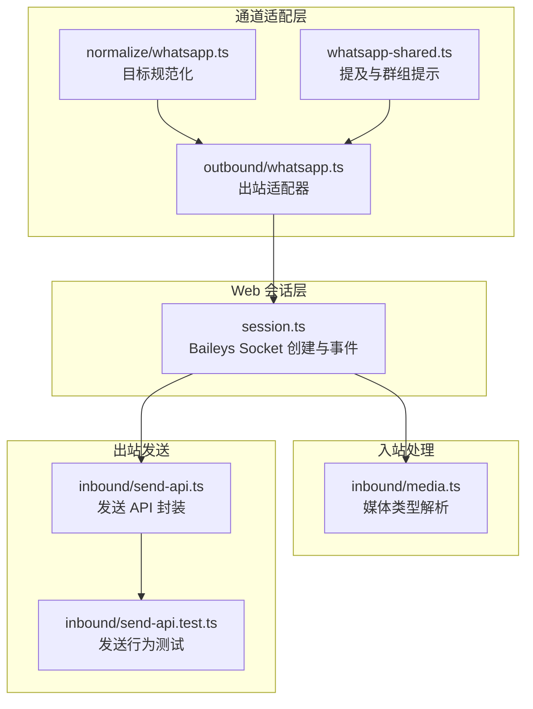
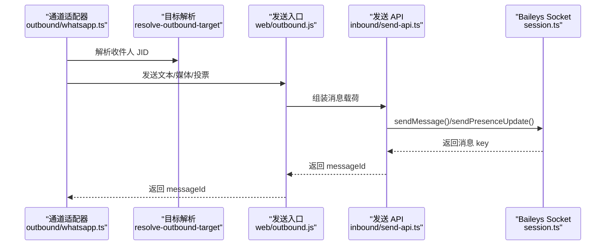
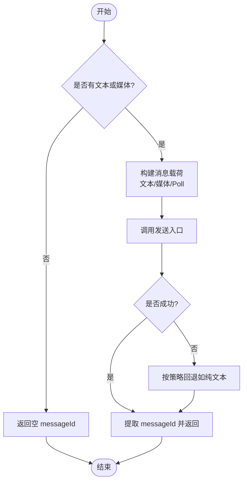
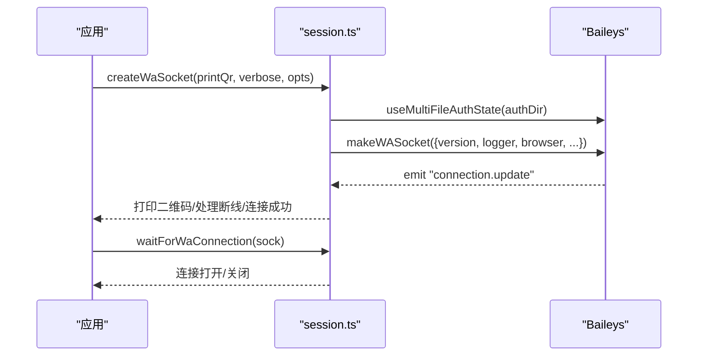
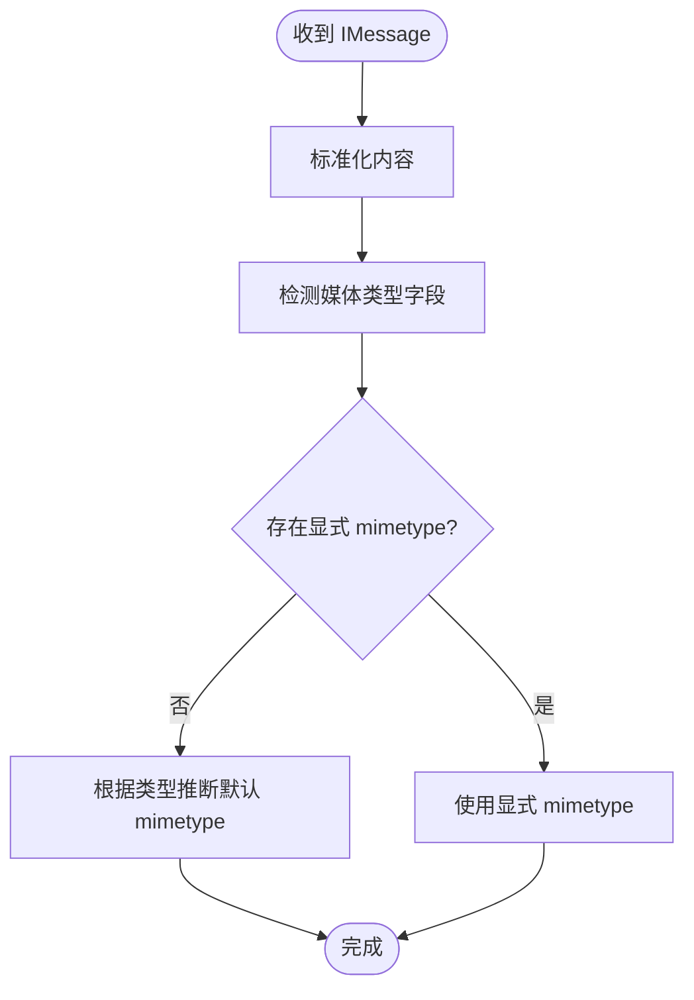
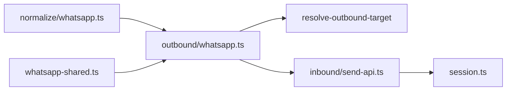

# WhatsApp 集成

<cite>
**本文引用的文件**
- [docs/channels/whatsapp.md](file://docs/channels/whatsapp.md)
- [src/web/session.ts](file://src/web/session.ts)
- [src/web/inbound/media.ts](file://src/web/inbound/media.ts)
- [src/web/inbound/send-api.ts](file://src/web/inbound/send-api.ts)
- [src/web/inbound/send-api.test.ts](file://src/web/inbound/send-api.test.ts)
- [src/channels/plugins/outbound/whatsapp.ts](file://src/channels/plugins/outbound/whatsapp.ts)
- [src/channels/plugins/normalize/whatsapp.ts](file://src/channels/plugins/normalize/whatsapp.ts)
- [src/channels/plugins/whatsapp-shared.ts](file://src/channels/plugins/whatsapp-shared.ts)
</cite>

## 目录
1. [简介](#简介)
2. [项目结构](#项目结构)
3. [核心组件](#核心组件)
4. [架构总览](#架构总览)
5. [详细组件分析](#详细组件分析)
6. [依赖关系分析](#依赖关系分析)
7. [性能考虑](#性能考虑)
8. [故障排除指南](#故障排除指南)
9. [结论](#结论)
10. [附录](#附录)

## 简介
本技术文档面向在 OpenClaw 中集成 WhatsApp 渠道（基于 Baileys 的 WhatsApp Web）的开发者与运维人员，系统性阐述以下内容：
- Baileys 客户端库的使用方式与会话管理
- 消息处理与媒体传输机制
- 认证流程（二维码登录、会话持久化、令牌轮换）
- 消息格式转换（富文本、多媒体、位置与联系人）
- 配置指南（API 密钥、Webhook、环境变量）
- 常见问题排查与性能优化建议

## 项目结构
与 WhatsApp 集成相关的关键模块分布如下：
- 通道适配层：负责入站/出站消息路由、分片与目标解析
- Web 会话层：封装 Baileys 连接、认证状态与事件处理
- 入站媒体处理：媒体类型推断、下载与占位符生成
- 出站发送 API：统一的发送接口，支持文本、图片、视频、音频（PTT）、文档与投票
- 规范化与提示：目标地址规范化、提及模式与群组引导提示



**图表来源**
- [src/channels/plugins/outbound/whatsapp.ts:1-74](file://src/channels/plugins/outbound/whatsapp.ts#L1-L74)
- [src/channels/plugins/normalize/whatsapp.ts:1-26](file://src/channels/plugins/normalize/whatsapp.ts#L1-L26)
- [src/channels/plugins/whatsapp-shared.ts:1-18](file://src/channels/plugins/whatsapp-shared.ts#L1-L18)
- [src/web/session.ts:1-313](file://src/web/session.ts#L1-L313)
- [src/web/inbound/media.ts:1-40](file://src/web/inbound/media.ts#L1-L40)
- [src/web/inbound/send-api.ts:1-114](file://src/web/inbound/send-api.ts#L1-L114)
- [src/web/inbound/send-api.test.ts:1-159](file://src/web/inbound/send-api.test.ts#L1-L159)

**章节来源**
- [src/channels/plugins/outbound/whatsapp.ts:1-74](file://src/channels/plugins/outbound/whatsapp.ts#L1-L74)
- [src/web/session.ts:1-313](file://src/web/session.ts#L1-L313)

## 核心组件
- 通道适配器（WhatsApp 出站）
  - 负责文本分片、目标解析、媒体发送与投票发送
  - 默认文本块大小与最大选项数限制
- Web 会话（Baileys）
  - 多文件认证状态存储、浏览器指纹、连接更新事件、二维码打印
  - WebSocket 错误处理与连接等待
- 入站媒体处理
  - 媒体类型解析与默认 MIME 推断
- 出站发送 API
  - 统一发送接口：文本、图片、视频（含动图播放）、音频（PTT）、文档、投票、反应、正在输入
  - 发送结果消息 ID 解析与活动记录

**章节来源**
- [src/channels/plugins/outbound/whatsapp.ts:12-74](file://src/channels/plugins/outbound/whatsapp.ts#L12-L74)
- [src/web/session.ts:90-161](file://src/web/session.ts#L90-L161)
- [src/web/inbound/media.ts:15-40](file://src/web/inbound/media.ts#L15-L40)
- [src/web/inbound/send-api.ts:20-114](file://src/web/inbound/send-api.ts#L20-L114)

## 架构总览
下图展示从通道适配到 Baileys Socket 的整体调用链路与数据流。



**图表来源**
- [src/channels/plugins/outbound/whatsapp.ts:18-73](file://src/channels/plugins/outbound/whatsapp.ts#L18-L73)
- [src/web/inbound/send-api.ts:28-111](file://src/web/inbound/send-api.ts#L28-L111)
- [src/web/session.ts:108-121](file://src/web/session.ts#L108-L121)

## 详细组件分析

### 通道适配器（WhatsApp 出站）
- 功能要点
  - 文本分片与模式选择（长度/换行）
  - 目标解析：将外部收件人映射为 WhatsApp JID
  - 媒体发送：图片、视频（动图播放可选）、音频（PTT）、文档（带文件名）
  - 投票发送：最多 12 个选项
  - 发送结果统一返回 messageId
- 性能与可靠性
  - 文本块上限 4000 字符
  - 媒体发送失败时优先回退为纯文本警告（避免静默丢弃）



**图表来源**
- [src/channels/plugins/outbound/whatsapp.ts:20-73](file://src/channels/plugins/outbound/whatsapp.ts#L20-L73)

**章节来源**
- [src/channels/plugins/outbound/whatsapp.ts:12-74](file://src/channels/plugins/outbound/whatsapp.ts#L12-L74)

### Web 会话（Baileys Socket）
- 关键能力
  - 多文件认证状态存储与备份恢复
  - 自动保存凭证队列，避免并发写入冲突
  - 连接更新事件：二维码打印、断线原因、在线提示
  - WebSocket 错误捕获，防止未处理异常导致进程崩溃
  - 连接等待工具函数
- 认证与会话管理
  - 浏览器指纹固定为应用标识
  - 同步全量历史关闭，减少启动开销
  - 在线状态标记关闭，避免不必要的状态广播



**图表来源**
- [src/web/session.ts:90-161](file://src/web/session.ts#L90-L161)
- [src/web/session.ts:163-184](file://src/web/session.ts#L163-L184)

**章节来源**
- [src/web/session.ts:90-161](file://src/web/session.ts#L90-L161)
- [src/web/session.ts:163-184](file://src/web/session.ts#L163-L184)

### 入站媒体处理
- 媒体类型解析
  - 显式 MIME 优先
  - 语音消息与音频默认为 OGG Opus
  - 图片默认 JPEG，视频默认 MP4，贴图为 WEBP
- 下载与占位符
  - 使用 Baileys 提供的下载与内容标准化工具
  - 媒体仅消息场景生成占位符，便于后续路由与上下文拼接



**图表来源**
- [src/web/inbound/media.ts:6-40](file://src/web/inbound/media.ts#L6-L40)

**章节来源**
- [src/web/inbound/media.ts:1-40](file://src/web/inbound/media.ts#L1-L40)

### 出站发送 API
- 支持的消息类型
  - 文本：直接发送
  - 图片：可带标题（caption）
  - 视频：可带标题与动图播放开关
  - 音频：PTT（Push-to-Talk），强制 OGG
  - 文档：可自定义文件名
  - 投票：最多 12 个选项
  - 反应：对指定消息进行表情反应
  - 正在输入：向对方 JID 发送“正在输入”状态
- 结果与活动记录
  - 从发送结果中解析 messageId，若不可用则回退为“unknown”
  - 记录通道活动（方向：出站）

```mermaid
classDiagram
class SendAPI {
+sendMessage(to, text, mediaBuffer?, mediaType?, options?) Promise~{messageId}~
+sendPoll(to, poll) Promise~{messageId}~
+sendReaction(chatJid, messageId, emoji, fromMe, participant?) Promise~void~
+sendComposingTo(to) Promise~void~
}
class BaileysSock {
+sendMessage(jid, content) Promise~unknown~
+sendPresenceUpdate(presence, jid?) Promise~unknown~
}
SendAPI --> BaileysSock : "调用"
```

**图表来源**
- [src/web/inbound/send-api.ts:20-114](file://src/web/inbound/send-api.ts#L20-L114)

**章节来源**
- [src/web/inbound/send-api.ts:1-114](file://src/web/inbound/send-api.ts#L1-L114)
- [src/web/inbound/send-api.test.ts:10-159](file://src/web/inbound/send-api.test.ts#L10-L159)

### 目标规范化与群组提示
- 目标规范化
  - 支持电话号码与 handle/whatsapp: 前缀
  - 对通配符“*”保留原样，其余条目进行规范化
- 群组引导提示
  - 提供群组介绍提示，明确参与者 JID 的含义
- 提及模式
  - 基于自身 E.164 号码生成提及正则，用于去除或识别机器人提及

**章节来源**
- [src/channels/plugins/normalize/whatsapp.ts:1-26](file://src/channels/plugins/normalize/whatsapp.ts#L1-L26)
- [src/channels/plugins/whatsapp-shared.ts:1-18](file://src/channels/plugins/whatsapp-shared.ts#L1-L18)

## 依赖关系分析
- 组件耦合
  - 通道适配器依赖目标解析与发送入口
  - 发送 API 依赖 Baileys Socket
  - 会话层独立于业务逻辑，通过事件驱动与上层解耦
- 外部依赖
  - Baileys（多文件认证、缓存密钥、版本协商）
  - qrcode-terminal（二维码打印）
- 潜在循环依赖
  - 当前模块间采用单向依赖，未发现循环导入



**图表来源**
- [src/channels/plugins/outbound/whatsapp.ts:1-74](file://src/channels/plugins/outbound/whatsapp.ts#L1-L74)
- [src/web/inbound/send-api.ts:1-114](file://src/web/inbound/send-api.ts#L1-L114)
- [src/web/session.ts:1-313](file://src/web/session.ts#L1-L313)
- [src/channels/plugins/normalize/whatsapp.ts:1-26](file://src/channels/plugins/normalize/whatsapp.ts#L1-L26)
- [src/channels/plugins/whatsapp-shared.ts:1-18](file://src/channels/plugins/whatsapp-shared.ts#L1-L18)

**章节来源**
- [src/channels/plugins/outbound/whatsapp.ts:1-74](file://src/channels/plugins/outbound/whatsapp.ts#L1-L74)
- [src/web/inbound/send-api.ts:1-114](file://src/web/inbound/send-api.ts#L1-L114)
- [src/web/session.ts:1-313](file://src/web/session.ts#L1-L313)
- [src/channels/plugins/normalize/whatsapp.ts:1-26](file://src/channels/plugins/normalize/whatsapp.ts#L1-L26)
- [src/channels/plugins/whatsapp-shared.ts:1-18](file://src/channels/plugins/whatsapp-shared.ts#L1-L18)

## 性能考虑
- 连接与重连
  - 使用连接等待工具函数避免阻塞；WebSocket 错误被捕获以防止崩溃
- 认证与存储
  - 凭证保存采用串行队列，先备份再写入，降低损坏风险
- 文本分片
  - 默认 4000 字符上限，换行模式优先段落边界，提升可读性
- 媒体处理
  - 图片自动优化与尺寸控制，避免超限
  - 媒体发送失败时优先回退为文本警告，保证用户体验
- 日志与可观测性
  - 会话层日志级别可按需开启，避免生产环境噪声

**章节来源**
- [src/web/session.ts:34-84](file://src/web/session.ts#L34-L84)
- [src/web/session.ts:153-159](file://src/web/session.ts#L153-L159)
- [src/channels/plugins/outbound/whatsapp.ts:14-16](file://src/channels/plugins/outbound/whatsapp.ts#L14-L16)
- [docs/channels/whatsapp.md:309-316](file://docs/channels/whatsapp.md#L309-L316)

## 故障排除指南
- 未链接（需要二维码）
  - 症状：通道状态显示未链接
  - 处理：执行登录命令并检查状态
- 已链接但断开/重连循环
  - 症状：反复断开/重连
  - 处理：运行诊断命令与日志跟踪；必要时重新登录
- 发送时无活跃监听器
  - 症状：出站发送失败
  - 处理：确保网关已运行且账户已链接
- 群组消息被忽略
  - 检查顺序：群策略、允许列表、群组允许列表、提及规则、配置重复键覆盖
- Bun 运行时警告
  - 建议使用 Node 运行 WhatsApp/Telegram 网关以获得稳定体验

**章节来源**
- [docs/channels/whatsapp.md:374-424](file://docs/channels/whatsapp.md#L374-L424)

## 结论
本集成以 Baileys 为核心，结合多文件认证、事件驱动的会话管理与完善的出站发送 API，实现了对 WhatsApp Web 的稳定接入。通道适配器提供一致的发送语义与分片策略，入站媒体处理与目标规范化保障了消息与路由的准确性。配合详尽的配置项与故障排除指引，可在生产环境中可靠运行。

## 附录

### 配置参考（摘要）
- 访问控制
  - 直聊策略与允许列表、群组策略与允许列表、提及规则
- 交付与媒体
  - 文本分片上限与模式、媒体大小限制、动图播放、回退策略
- 多账户与凭据
  - 账户选择与凭据路径、登出行为
- 运维与操作
  - 配置写入开关、心跳与重连参数、去抖间隔

**章节来源**
- [docs/channels/whatsapp.md:426-446](file://docs/channels/whatsapp.md#L426-L446)