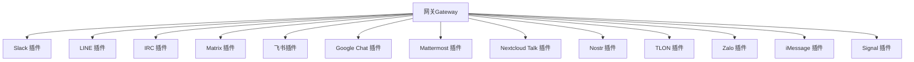
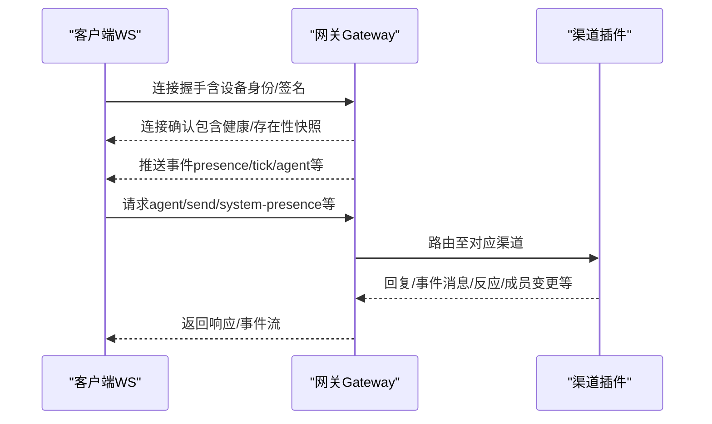
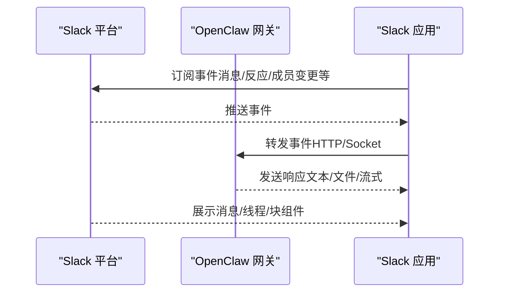
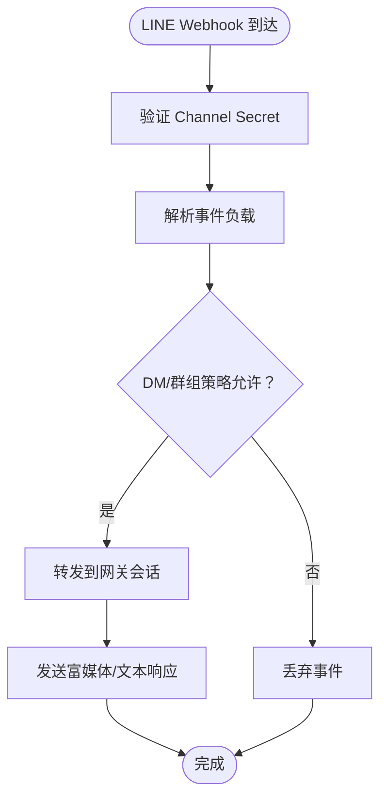
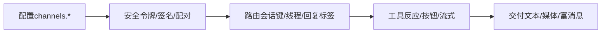

# 其他渠道集成

<cite>
**本文引用的文件**
- [docs/channels/index.md](file://docs/channels/index.md)
- [docs/channels/slack.md](file://docs/channels/slack.md)
- [docs/channels/line.md](file://docs/channels/line.md)
- [docs/channels/irc.md](file://docs/channels/irc.md)
- [docs/channels/matrix.md](file://docs/channels/matrix.md)
- [docs/channels/feishu.md](file://docs/channels/feishu.md)
- [docs/channels/googlechat.md](file://docs/channels/googlechat.md)
- [docs/channels/mattermost.md](file://docs/channels/mattermost.md)
- [docs/channels/nextcloud-talk.md](file://docs/channels/nextcloud-talk.md)
- [docs/channels/nostr.md](file://docs/channels/nostr.md)
- [docs/channels/tlon.md](file://docs/channels/tlon.md)
- [docs/channels/zalo.md](file://docs/channels/zalo.md)
- [docs/channels/imessage.md](file://docs/channels/imessage.md)
- [docs/channels/signal.md](file://docs/channels/signal.md)
- [docs/gateway/configuration.md](file://docs/gateway/configuration.md)
- [docs/concepts/architecture.md](file://docs/concepts/architecture.md)
- [docs/channels/troubleshooting.md](file://docs/channels/troubleshooting.md)
</cite>

## 目录
1. [简介](#简介)
2. [项目结构](#项目结构)
3. [核心组件](#核心组件)
4. [架构总览](#架构总览)
5. [详细组件分析](#详细组件分析)
6. [依赖关系分析](#依赖关系分析)
7. [性能考量](#性能考量)
8. [故障排查指南](#故障排查指南)
9. [结论](#结论)
10. [附录](#附录)

## 简介
本文件面向需要在 OpenClaw 中集成多种即时通讯渠道（Slack、LINE、IRC、Matrix、飞书、Google Chat、Mattermost、Nextcloud Talk、Nostr、TLON、Zalo、iMessage、Signal 等）的工程团队与平台工程师，系统化梳理各渠道的技术特点、接入方式、API 限制、配置要点与安全控制，并总结通用集成模式与最佳实践。文档同时提供渠道选择指南与迁移建议，帮助在多渠道场景下实现一致的路由、会话与交付体验。

## 项目结构
OpenClaw 通过“网关（Gateway）+ 多通道插件”的架构统一管理各类 IM 渠道。每个渠道以独立插件或内置模块形式存在，遵循统一的配置模型、访问控制与会话路由规则。核心能力包括：
- 统一配置模型：channels.<provider> 下的分节配置，支持环境变量、密钥引用与热重载
- 访问控制：DM 策略（pairing/allowlist/open/disabled）、群组策略（open/allowlist/disabled）、发送者白名单与提及门控
- 会话与路由：按渠道/账号/对话目标隔离会话，支持线程/回复标签、历史上下文与多代理绑定
- 安全与合规：设备配对、令牌校验、签名验证、速率限制与最小权限原则

图表来源
- [docs/concepts/architecture.md:12-26](file://docs/concepts/architecture.md#L12-L26)

章节来源
- [docs/channels/index.md:14-48](file://docs/channels/index.md#L14-L48)
- [docs/gateway/configuration.md:74-105](file://docs/gateway/configuration.md#L74-L105)

## 核心组件
- 配置与治理
  - channels.<provider>：各渠道专属配置入口，覆盖认证、策略、行为与能力开关
  - 环境变量与密钥引用：支持 env/file/exec 等 SecretRef 模式
  - 热重载：大部分字段无需重启即可生效
- 访问控制
  - DM 策略：pairing（默认）、allowlist、open、disabled
  - 群组策略：open、allowlist、disabled；支持 per-channel 与 per-room 规则
  - 提及门控：基于 @mention 或正则表达式（mentionPatterns）
- 会话与路由
  - DM/群组/线程：按会话键隔离；支持线程后缀与回复标签
  - 多代理绑定：通过 bindings 将不同 peer 映射到不同 agent
- 安全与合规
  - 设备配对：WS 连接需设备身份与签名挑战
  - 令牌与签名：各渠道的 botToken/signingSecret/appToken 等
  - 速率限制与最小权限：工具动作、按钮回调、媒体大小等均有上限与开关

章节来源
- [docs/gateway/configuration.md:135-177](file://docs/gateway/configuration.md#L135-L177)
- [docs/concepts/architecture.md:93-109](file://docs/concepts/architecture.md#L93-L109)

## 架构总览
OpenClaw 的网关作为单一控制面，承载所有消息表面（多渠道连接），并通过 WebSocket 对外提供统一的控制平面 API。客户端（桌面/CLI/Web）与节点（移动端/无头）均通过 WS 连接网关，实现状态同步、事件订阅与命令下发。

图表来源
- [docs/concepts/architecture.md:59-78](file://docs/concepts/architecture.md#L59-L78)

章节来源
- [docs/concepts/architecture.md:12-26](file://docs/concepts/architecture.md#L12-L26)

## 详细组件分析

### Slack 集成
- 技术特点
  - 支持 Socket Mode 与 HTTP Events API 双模式；默认 Socket Mode
  - 事件订阅：app_mention/message.*、reaction_*、member_*、channel_rename、pin_* 等
  - 响应能力：文本分片、文件上传、线程回复、打字指示、打字反应、块级预览（可选）
- 认证与权限
  - Socket Mode：appToken（connections:write）+ botToken（chat:write 等）
  - HTTP 模式：botToken + signingSecret；支持 per-account webhookPath
- 访问控制
  - DM：pairing/allowlist/open/disabled；支持 per-account allowFrom
  - 群组：open/allowlist/disabled；支持 per-channel requireMention 与 users 白名单
- 高级功能
  - Slash 命令：可启用原生命令或单命令模式；参数菜单自适应渲染
  - 交互式组件：Block Kit 事件映射为系统事件；支持 actions.* 工具门控
  - 流式输出：支持 native streaming（assistant:write scope）
- 配置要点
  - mode/auth、DM/群组策略、线程/历史、文本分片/媒体上限、流式与交互开关
- 故障排查
  - Socket 连接失败、HTTP Webhook 未达、命令未触发、DM 忽略等

图表来源
- [docs/channels/slack.md:24-121](file://docs/channels/slack.md#L24-L121)

章节来源
- [docs/channels/slack.md:10-131](file://docs/channels/slack.md#L10-L131)
- [docs/channels/slack.md:136-205](file://docs/channels/slack.md#L136-L205)
- [docs/channels/slack.md:284-339](file://docs/channels/slack.md#L284-L339)
- [docs/channels/slack.md:433-490](file://docs/channels/slack.md#L433-L490)
- [docs/channels/slack.md:492-555](file://docs/channels/slack.md#L492-L555)

### LINE 集成
- 技术特点
  - 基于 Messaging API 的 Webhook；支持 DM、群聊、富媒体（Flex/模板/Quick Replies）、位置
  - 不支持反应与线程
- 认证与权限
  - Channel access token + Channel secret；支持 per-account webhookPath
- 访问控制
  - DM：pairing/allowlist/open/disabled；支持 per-group allowFrom
  - 群组：groupPolicy + groupAllowFrom；运行时缺失配置回退为 allowlist
- 行为特性
  - 文本分片（5000 字符）、Markdown 转换为 Flex 卡片、媒体下载上限（默认 10MB）
  - 支持 channelData.line 富消息参数
- 故障排查
  - Webhook 验证失败、媒体下载超限、无入站事件

图表来源
- [docs/channels/line.md:34-70](file://docs/channels/line.md#L34-L70)

章节来源
- [docs/channels/line.md:10-19](file://docs/channels/line.md#L10-L19)
- [docs/channels/line.md:110-142](file://docs/channels/line.md#L110-L142)
- [docs/channels/line.md:144-185](file://docs/channels/line.md#L144-L185)
- [docs/channels/line.md:186-194](file://docs/channels/line.md#L186-L194)

### IRC 集成
- 技术特点
  - 经典 IRC 协议；支持频道与私信；TLS 默认开启
  - 两层门禁：频道准入（groupPolicy）+ 发送者准入（groupAllowFrom）
- 访问控制
  - DM：pairing/allowlist/open/disabled；sender allowlist 使用稳定标识（nick!user@host）
  - 群组：groupPolicy + groups["#channel"]；默认提及门控
- 行为特性
  - mentionPatterns 用于非提及触发；per-channel requireMention 控制
  - toolsBySender 支持按发送者差异化授权
- 故障排查
  - 允许列表仅针对 DM；群组消息被丢弃通常因 policy/allowFrom/mention 三者之一不满足

章节来源
- [docs/channels/irc.md:13-45](file://docs/channels/irc.md#L13-L45)
- [docs/channels/irc.md:46-127](file://docs/channels/irc.md#L46-L127)
- [docs/channels/irc.md:178-185](file://docs/channels/irc.md#L178-L185)
- [docs/channels/irc.md:237-242](file://docs/channels/irc.md#L237-L242)

### Matrix 集成
- 技术特点
  - 用户态登录任意 Homeserver；支持 DM、房间、线程、富文本、媒体、反应、轮询/自动加入
  - 支持端到端加密（Rust 加密 SDK，首次连接需设备验证）
- 认证与权限
  - 访问令牌或用户名+密码；支持 per-account 配置与名称
  - E2EE：encryption 开启后需在其他客户端确认验证
- 访问控制
  - DM：pairing/allowlist/open/disabled；支持 full user ID（@user:server）
  - 房间：groupPolicy + groups（支持别名与 ID）；autoJoin/autoJoinAllowlist 控制入室
- 行为特性
  - 线程回复控制（threadReplies/off/inbound/always）；replyToMode 控制回复元数据
  - 支持 Polls（发送）、入站投票开始转文本
- 故障排查
  - 登录但忽略消息：房间策略或允许列表；加密房间：加密支持与设置匹配

章节来源
- [docs/channels/matrix.md:8-16](file://docs/channels/matrix.md#L8-L16)
- [docs/channels/matrix.md:111-137](file://docs/channels/matrix.md#L111-L137)
- [docs/channels/matrix.md:180-224](file://docs/channels/matrix.md#L180-L224)
- [docs/channels/matrix.md:248-304](file://docs/channels/matrix.md#L248-L304)

### 飞书（Feishu）集成
- 技术特点
  - WebSocket 事件订阅（无需公网 Webhook）；支持 DM、群组、富文本、图片、文件、音频、视频、贴纸
  - 支持流式卡片输出（blockStreaming）
- 认证与权限
  - App ID/App Secret；支持 per-account 与域名（feishu/lark）
  - 事件订阅：im.message.receive_v1；支持 verificationToken（webhook 模式）
- 访问控制
  - DM：pairing/allowlist/open/disabled；open 需 allowFrom 包含 "*"
  - 群组：groupPolicy + groupAllowFrom；per-chat requireMention
- 行为特性
  - typingIndicator/resolveSenderNames 优化配额；textChunkLimit（默认 2000）、mediaMaxMb（默认 30MB）
  - 支持多代理路由（bindings）与群组/用户 ID 获取
- 故障排查
  - 机器人未响应：检查应用发布、事件订阅、长连接、权限与网关状态

章节来源
- [docs/channels/feishu.md:9-26](file://docs/channels/feishu.md#L9-L26)
- [docs/channels/feishu.md:164-287](file://docs/channels/feishu.md#L164-L287)
- [docs/channels/feishu.md:299-391](file://docs/channels/feishu.md#L299-L391)
- [docs/channels/feishu.md:482-587](file://docs/channels/feishu.md#L482-L587)

### Google Chat（Chat API）集成
- 技术特点
  - HTTP Webhook（仅 HTTP）；支持 DM 与 Spaces；支持交互式功能
- 认证与权限
  - 服务账号（JSON Key 文件或 SecretRef）；audienceType/audience 校验
  - webhookPath 默认 /googlechat；支持 per-account 配置
- 访问控制
  - DM：pairing（默认）；Spaces：requireMention（可配置 botUser）
  - allowFrom 支持 users/<userId>；raw email 仅在 dangerouslyAllowNameMatching 启用时用于 allowlist 匹配
- 行为特性
  - typingIndicator 支持 none/message/reaction；媒体下载受 mediaMaxMb 限制
- 故障排查
  - 405 Method Not Allowed：通道未配置/插件未启用/未重启；Webhook URL 与事件订阅核对

章节来源
- [docs/channels/googlechat.md:8-11](file://docs/channels/googlechat.md#L8-L11)
- [docs/channels/googlechat.md:139-162](file://docs/channels/googlechat.md#L139-L162)
- [docs/channels/googlechat.md:163-206](file://docs/channels/googlechat.md#L163-L206)
- [docs/channels/googlechat.md:209-262](file://docs/channels/googlechat.md#L209-L262)

### Mattermost 集成
- 技术特点
  - Bot Token + WebSocket 事件；支持 DM、群组、DM/群组按钮（inlineButtons）
- 认证与权限
  - botToken + baseUrl；支持 per-account commands/native 命令回调路径与回调 URL
- 访问控制
  - DM：pairing/allowlist/open/disabled；群组：groupPolicy + groupAllowFrom
  - chatmode（oncall/onmessage/onchar）替代 requireMention
- 行为特性
  - inlineButtons：按钮样式与回调校验（HMAC-SHA256）；回调 URL 可指定外部基地址
  - 目标识别：user:<id>、channel:<id>、@username（用户 ID 解析）
- 故障排查
  - 按钮点击无效：ID 仅允许字母数字、回调可达性、AllowedUntrustedInternalConnections 配置

章节来源
- [docs/channels/mattermost.md:9-13](file://docs/channels/mattermost.md#L9-L13)
- [docs/channels/mattermost.md:58-96](file://docs/channels/mattermost.md#L58-L96)
- [docs/channels/mattermost.md:132-164](file://docs/channels/mattermost.md#L132-L164)
- [docs/channels/mattermost.md:185-242](file://docs/channels/mattermost.md#L185-L242)
- [docs/channels/mattermost.md:358-370](file://docs/channels/mattermost.md#L358-L370)

### Nextcloud Talk 集成
- 技术特点
  - Webhook Bot；支持 DM、房间、反应、Markdown；媒体上传受限（URL）
- 认证与权限
  - baseUrl + botSecret；支持 per-account 配置
- 访问控制
  - DM：pairing/allowlist/open/disabled；群组：groupPolicy + rooms
  - DM 类型区分依赖 apiUser/apiPassword（可选）
- 行为特性
  - webhookPublicUrl 用于反向代理场景；textChunkLimit、blockStreaming、mediaMaxMb 可调
- 故障排查
  - 无法发起 DM：用户需先发消息；Webhook 不可达；媒体上传限制

章节来源
- [docs/channels/nextcloud-talk.md:8-10](file://docs/channels/nextcloud-talk.md#L8-L10)
- [docs/channels/nextcloud-talk.md:33-68](file://docs/channels/nextcloud-talk.md#L33-L68)
- [docs/channels/nextcloud-talk.md:70-97](file://docs/channels/nextcloud-talk.md#L70-L97)
- [docs/channels/nextcloud-talk.md:109-139](file://docs/channels/nextcloud-talk.md#L109-L139)

### Nostr 集成
- 技术特点
  - 分布式协议；NIP-04 加密 DM；默认插件（需手动安装）
- 认证与权限
  - privateKey（nsec/hex）；relays（默认两个中继）
  - allowFrom 为公钥集合（npub/hex）
- 行为特性
  - profile 元数据发布；DM 策略与配对码；多中继冗余与去重
- 故障排查
  - 私钥有效、中继可达、enabled 未关闭；重复响应属预期

章节来源
- [docs/channels/nostr.md:9-13](file://docs/channels/nostr.md#L9-L13)
- [docs/channels/nostr.md:72-114](file://docs/channels/nostr.md#L72-L114)
- [docs/channels/nostr.md:167-175](file://docs/channels/nostr.md#L167-L175)
- [docs/channels/nostr.md:203-234](file://docs/channels/nostr.md#L203-L234)

### TLON（Urbit）集成
- 技术特点
  - DM、群组提及、线程回复、富文本（Markdown 转换）、图片上传；暂不支持反应/Polls
- 认证与权限
  - ship/url/code；ownerShip 自动授权；dmAllowlist/autoAcceptDmInvites/autoAcceptGroupInvites
  - per-channel authorization.rule
- 行为特性
  - autoDiscoverChannels；delivery targets 支持 dm/~ship 与 group:~host/channel
- 故障排查
  - DM/群组被忽略：allowlist 未配置或未授权；连接错误：ship URL 可达性与 allowPrivateNetwork

章节来源
- [docs/channels/tlon.md:8-15](file://docs/channels/tlon.md#L8-L15)
- [docs/channels/tlon.md:111-146](file://docs/channels/tlon.md#L111-L146)
- [docs/channels/tlon.md:232-277](file://docs/channels/tlon.md#L232-L277)

### Zalo 集成
- 技术特点
  - Bot API；DM 支持；群组策略可控（默认 allowlist）
- 认证与权限
  - botToken；支持 webhookUrl/webhookSecret/webhookPath；长轮询与 webhook 互斥
- 访问控制
  - DM：pairing/allowlist/open/disabled；群组：groupPolicy + groupAllowFrom
  - 用户 ID 为纯数字；streaming 默认阻断（2000 字限制）
- 行为特性
  - textChunkLimit（2000）、mediaMaxMb（默认 5）、typing indicator
- 故障排查
  - 令牌有效、配对批准、webhook HTTPS 与 secret 校验

章节来源
- [docs/channels/zalo.md:8-10](file://docs/channels/zalo.md#L8-L10)
- [docs/channels/zalo.md:120-133](file://docs/channels/zalo.md#L120-L133)
- [docs/channels/zalo.md:159-207](file://docs/channels/zalo.md#L159-L207)

### iMessage（已废弃，推荐 BlueBubbles）
- 技术特点
  - 旧版 imsg JSON-RPC over stdio；不推荐新部署
- 认证与权限
  - dbPath/cliPath；DM 策略与群组策略；附件根目录白名单
- 行为特性
  - 会话键按 DM/群组隔离；支持远程 SSH wrapper 与附件 SCP
- 故障排查
  - 权限缺失（Full Disk Access/Automation）、远程附件失败、macOS 提示遗漏

章节来源
- [docs/channels/imessage.md:9-17](file://docs/channels/imessage.md#L9-L17)
- [docs/channels/imessage.md:134-185](file://docs/channels/imessage.md#L134-L185)
- [docs/channels/imessage.md:247-286](file://docs/channels/imessage.md#L247-L286)
- [docs/channels/imessage.md:304-368](file://docs/channels/imessage.md#L304-L368)

### Signal 集成
- 技术特点
  - signal-cli JSON-RPC + SSE；DM/群组；typing indicator、读回执（DM）
- 认证与权限
  - account（E.164）+ cliPath/httpUrl；DM 策略与群组策略
- 行为特性
  - textChunkLimit（默认 4000）、newline 分片、mediaMaxMb（默认 8）、ignoreAttachments
  - reactions 工具与 level 控制；group history 上下文
- 故障排查
  - 守护进程可达、账户/接收模式正确、配对批准、号码模型（避免自收自）

章节来源
- [docs/channels/signal.md:9-11](file://docs/channels/signal.md#L9-L11)
- [docs/channels/signal.md:182-250](file://docs/channels/signal.md#L182-L250)
- [docs/channels/signal.md:251-326](file://docs/channels/signal.md#L251-L326)

## 依赖关系分析
- 统一配置与安全
  - channels.<provider> 下的配置共享相同的 DM/群组策略、提及门控与会话键命名约定
  - 环境变量与 SecretRef 在各渠道中一致使用，便于集中管理
- 传输与路由
  - 所有渠道最终汇聚到网关的统一 WS API，事件与请求经由网关进行路由与会话绑定
- 工具与能力
  - 各渠道在 actions.* 与 capabilities.* 中暴露能力边界，工具策略与最小权限原则贯穿全局

图表来源
- [docs/gateway/configuration.md:135-177](file://docs/gateway/configuration.md#L135-L177)
- [docs/concepts/architecture.md:93-109](file://docs/concepts/architecture.md#L93-L109)

章节来源
- [docs/gateway/configuration.md:349-387](file://docs/gateway/configuration.md#L349-L387)

## 性能考量
- 传输与并发
  - Socket Mode（Slack）与 WebSocket（Matrix/Nextcloud Talk）减少公网暴露面；HTTP Webhook（Google Chat/Feishu/Zalo）需严格路径与速率限制
- 事件与回压
  - 合理设置 textChunkLimit、mediaMaxMb 与 blockStreaming，避免大包与长链路阻塞
- 会话与历史
  - historyLimit 与 thread 历史范围控制上下文规模，降低模型成本与延迟
- 加密与验证
  - E2EE（Matrix）与签名/令牌（LINE/Slack/Google Chat）增加 CPU 开销，建议在高吞吐场景评估

## 故障排查指南
- 快速检查清单
  - openclaw status、openclaw gateway status、openclaw logs --follow、openclaw doctor、openclaw channels status --probe
- 渠道级常见症状与修复
  - Slack：Socket/HTTP 模式校验、appToken/botToken、事件订阅、DM 策略
  - LINE：Webhook 验证、body 限制、媒体上限
  - IRC：groupPolicy/allowFrom/mention gating
  - Matrix：groupPolicy/allowlist、E2EE 与设备验证
  - 飞书：应用发布、事件订阅、长连接、权限
  - Google Chat：405 错误、Audience 校验、Webhook URL
  - Mattermost：按钮回调可达性、AllowedUntrustedInternalConnections、ID 仅字母数字
  - Nextcloud Talk：Webhook 可达、DM 类型识别
  - Nostr：私钥、中继可达、enabled
  - TLON：ship URL 可达、allowPrivateNetwork（本地网络）
  - Zalo：webhook HTTPS/secret、长轮询与 webhook 互斥
  - iMessage：权限、远程附件、macOS 提示
  - Signal：守护进程、账户/接收模式、配对批准

章节来源
- [docs/channels/troubleshooting.md:13-118](file://docs/channels/troubleshooting.md#L13-L118)

## 结论
OpenClaw 通过统一的网关与配置模型，实现了多渠道的一致接入体验。在实际落地中，建议优先采用 Socket/WebSocket/长连接模式以降低公网暴露风险；结合 per-account 与 per-channel 策略实现精细化访问控制；利用 SecretRef 与环境变量集中管理凭证；通过工具与能力开关约束最小权限；最后以故障排查清单快速定位问题。对于新项目，优先考虑 Slack、LINE、Matrix、飞书、Google Chat、Mattermost、Nextcloud Talk、Nostr、TLON、Zalo、Signal 等渠道，依据业务场景与合规要求选择合适模式与能力集。

## 附录
- 渠道选择指南
  - 企业内网优先：Matrix（E2EE）、飞书（长连接）、Mattermost（按钮/命令）
  - 公共生态：Slack（块组件/流式）、Google Chat（私有应用）
  - 地区适配：LINE（日韩）、Zalo（越南）、TLON（去中心化）
  - 隐私优先：Signal（端到端）、Nostr（去中心化）
  - 老系统兼容：iMessage（BlueBubbles 替代方案）
- 迁移建议
  - 从 imsg 迁移到 BlueBubbles（macOS 生态）
  - 从 HTTP Webhook 迁移到 Socket/WebSocket（提升稳定性与安全性）
  - 从 allowlist 迁移到 pairing + allowlist（增强安全）
  - 从 per-channel requireMention 迁移到 per-channel users 白名单（更细粒度）