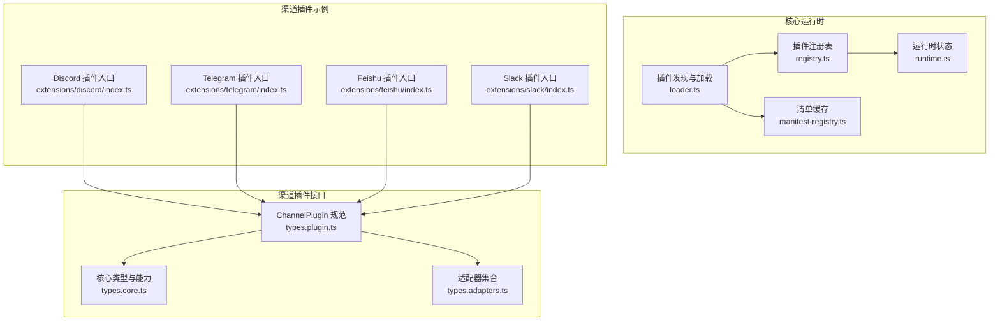
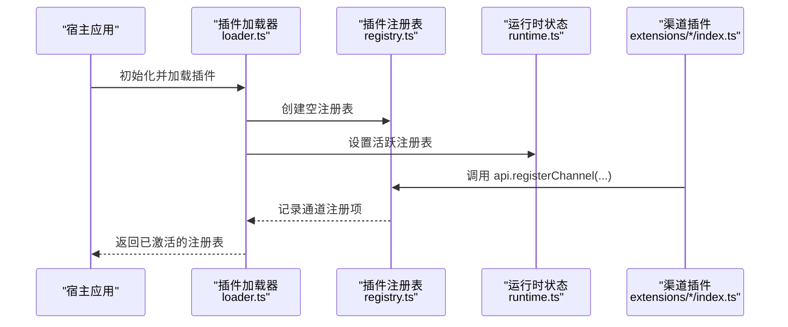
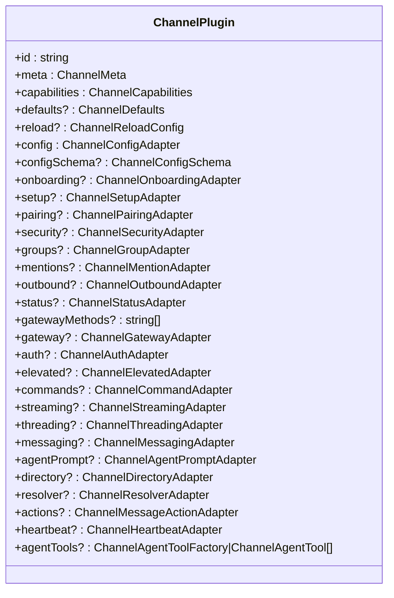
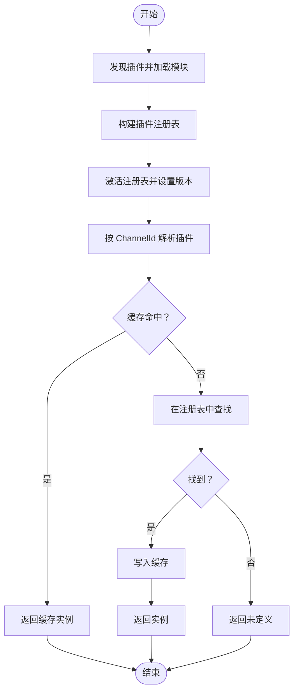
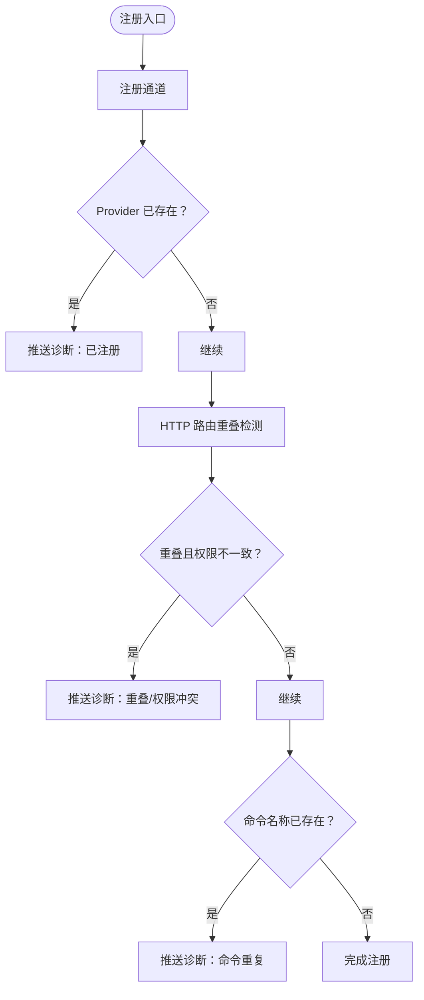
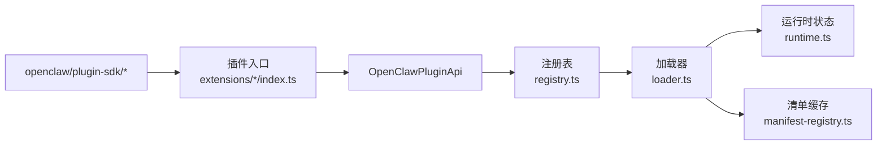

# 渠道插件架构

<cite>
**本文引用的文件**
- [load.ts](file://src/channels/plugins/load.ts)
- [registry-loader.ts](file://src/channels/plugins/registry-loader.ts)
- [runtime.ts](file://src/plugins/runtime.ts)
- [manifest-registry.ts](file://src/plugins/manifest-registry.ts)
- [loader.ts](file://src/plugins/loader.ts)
- [types.plugin.ts](file://src/channels/plugins/types.plugin.ts)
- [types.core.ts](file://src/channels/plugins/types.core.ts)
- [types.adapters.ts](file://src/channels/plugins/types.adapters.ts)
- [registry.ts](file://src/plugins/registry.ts)
- [types.ts](file://src/plugins/types.ts)
- [discord/index.ts](file://extensions/discord/index.ts)
- [telegram/index.ts](file://extensions/telegram/index.ts)
- [feishu/index.ts](file://extensions/feishu/index.ts)
- [slack/index.ts](file://extensions/slack/index.ts)
</cite>

## 目录
1. [简介](#简介)
2. [项目结构](#项目结构)
3. [核心组件](#核心组件)
4. [架构总览](#架构总览)
5. [详细组件分析](#详细组件分析)
6. [依赖关系分析](#依赖关系分析)
7. [性能考量](#性能考量)
8. [故障排查指南](#故障排查指南)
9. [结论](#结论)
10. [附录](#附录)

## 简介
本文件面向 OpenClaw 的渠道插件架构，系统性阐述插件化渠道系统的设计与实现，重点覆盖以下方面：
- ChannelPlugin 接口规范与标准化适配器
- 插件生命周期管理与动态加载机制
- 插件注册表的工作原理（缓存、版本与去重）
- 消息处理、状态管理与配置解析的统一抽象
- 插件开发最佳实践（错误处理、性能优化、安全）
- 调试与测试方法论

## 项目结构
OpenClaw 将“渠道插件”作为独立扩展模块，位于 extensions 目录下，每个渠道插件以独立包形式存在，并通过 openclaw/plugin-sdk 子路径导出其类型与工具。核心运行时在 src/plugins 下实现插件发现、加载、注册与运行时管理；渠道专用类型与适配器位于 src/channels/plugins。

图表来源
- [loader.ts:1-200](file://src/plugins/loader.ts#L1-L200)
- [registry.ts:168-183](file://src/plugins/registry.ts#L168-L183)
- [runtime.ts:1-49](file://src/plugins/runtime.ts#L1-L49)
- [manifest-registry.ts:47-77](file://src/plugins/manifest-registry.ts#L47-L77)
- [types.plugin.ts:49-85](file://src/channels/plugins/types.plugin.ts#L49-L85)
- [types.core.ts:11-194](file://src/channels/plugins/types.core.ts#L11-L194)
- [types.adapters.ts:24-384](file://src/channels/plugins/types.adapters.ts#L24-L384)
- [discord/index.ts:1-20](file://extensions/discord/index.ts#L1-L20)
- [telegram/index.ts:1-18](file://extensions/telegram/index.ts#L1-L18)
- [feishu/index.ts:1-66](file://extensions/feishu/index.ts#L1-L66)
- [slack/index.ts:1-18](file://extensions/slack/index.ts#L1-L18)

章节来源
- [loader.ts:1-200](file://src/plugins/loader.ts#L1-L200)
- [registry.ts:168-183](file://src/plugins/registry.ts#L168-L183)
- [runtime.ts:1-49](file://src/plugins/runtime.ts#L1-L49)
- [manifest-registry.ts:47-77](file://src/plugins/manifest-registry.ts#L47-L77)
- [types.plugin.ts:49-85](file://src/channels/plugins/types.plugin.ts#L49-L85)
- [types.core.ts:11-194](file://src/channels/plugins/types.core.ts#L11-L194)
- [types.adapters.ts:24-384](file://src/channels/plugins/types.adapters.ts#L24-L384)
- [discord/index.ts:1-20](file://extensions/discord/index.ts#L1-L20)
- [telegram/index.ts:1-18](file://extensions/telegram/index.ts#L1-L18)
- [feishu/index.ts:1-66](file://extensions/feishu/index.ts#L1-L66)
- [slack/index.ts:1-18](file://extensions/slack/index.ts#L1-L18)

## 核心组件
- ChannelPlugin 接口：定义渠道插件的标识、元数据、能力集与可选适配器集合，涵盖配置、认证、网关、消息、线程、目录、心跳等能力。
- 注册表与运行时：集中管理已加载插件、通道注册项、HTTP 路由、命令、钩子等；维护全局活跃注册表与版本号，支持缓存失效与重建。
- 动态加载与缓存：按需从注册表解析并缓存 ChannelPlugin 实例，基于活跃注册表变更清空缓存，避免重复解析。
- 配置与校验：提供 JSON Schema 驱动的配置校验与 UI 提示，支持插件配置模式与敏感字段标记。
- 适配器体系：将渠道差异抽象为一组适配器（如配置、状态、网关、消息、线程、目录、解析、安全等），统一调用入口。

章节来源
- [types.plugin.ts:49-85](file://src/channels/plugins/types.plugin.ts#L49-L85)
- [types.core.ts:76-159](file://src/channels/plugins/types.core.ts#L76-L159)
- [types.adapters.ts:24-384](file://src/channels/plugins/types.adapters.ts#L24-L384)
- [registry.ts:129-142](file://src/plugins/registry.ts#L129-L142)
- [runtime.ts:25-49](file://src/plugins/runtime.ts#L25-L49)
- [registry-loader.ts:9-35](file://src/channels/plugins/registry-loader.ts#L9-L35)
- [loader.ts:175-194](file://src/plugins/loader.ts#L175-L194)

## 架构总览
OpenClaw 的渠道插件采用“插件 SDK + 运行时 + 注册表”的分层设计。插件通过 openclaw/plugin-sdk 子路径导出类型与工具，核心运行时负责发现、加载、注册与运行时注入；渠道插件在 register 钩子中调用 api.registerChannel 完成注册。

图表来源
- [loader.ts:442-445](file://src/plugins/loader.ts#L442-L445)
- [registry.ts:402-428](file://src/plugins/registry.ts#L402-L428)
- [runtime.ts:25-49](file://src/plugins/runtime.ts#L25-L49)
- [discord/index.ts:12-16](file://extensions/discord/index.ts#L12-L16)
- [telegram/index.ts:11-14](file://extensions/telegram/index.ts#L11-L14)
- [feishu/index.ts:53-56](file://extensions/feishu/index.ts#L53-L56)
- [slack/index.ts:11-14](file://extensions/slack/index.ts#L11-L14)

## 详细组件分析

### ChannelPlugin 接口规范
ChannelPlugin 是渠道插件的契约，包含：
- 基本信息：id、meta、capabilities
- 可选能力：onboarding、setup、pairing、security、groups、mentions、outbound、status、gateway、auth、elevated、commands、streaming、threading、messaging、agentPrompt、directory、resolver、actions、heartbeat
- 配置与默认值：config、configSchema、defaults、reload
- 代理工具：agentTools

图表来源
- [types.plugin.ts:49-85](file://src/channels/plugins/types.plugin.ts#L49-L85)

章节来源
- [types.plugin.ts:49-85](file://src/channels/plugins/types.plugin.ts#L49-L85)

### 插件生命周期与动态加载
- 插件发现与加载：通过 loader.ts 完成插件发现、模块解析、注册表构建与运行时激活。
- 注册表与版本：runtime.ts 维护全局活跃注册表与版本号，当注册表变更时版本递增，用于触发缓存失效。
- 渠道插件解析：registry-loader.ts 提供 createChannelRegistryLoader，按 ChannelId 从活跃注册表查找并缓存 ChannelPlugin；若注册表变化则清空缓存。
- 加载流程关键点：loader.ts 中的 activatePluginRegistry 会设置活跃注册表并初始化全局钩子运行器；warnAboutUntrackedLoadedPlugins 用于诊断未受控加载的插件。

图表来源
- [registry-loader.ts:9-35](file://src/channels/plugins/registry-loader.ts#L9-L35)
- [runtime.ts:25-49](file://src/plugins/runtime.ts#L25-L49)
- [loader.ts:442-445](file://src/plugins/loader.ts#L442-L445)

章节来源
- [registry-loader.ts:9-35](file://src/channels/plugins/registry-loader.ts#L9-L35)
- [runtime.ts:25-49](file://src/plugins/runtime.ts#L25-L49)
- [loader.ts:412-445](file://src/plugins/loader.ts#L412-L445)

### 插件注册表与去重机制
- 注册表结构：registry.ts 定义了 PluginRegistry，包含 plugins、tools、hooks、typedHooks、channels、providers、gatewayHandlers、httpRoutes、cliRegistrars、services、commands、diagnostics 等。
- 渠道注册：registerChannel 将 ChannelPlugin 归档到 channels 列表，记录 pluginId、plugin、dock、source。
- 去重与冲突检测：registerProvider 对同名 Provider 进行去重检查；registerHttpRoute 对路径与匹配模式进行重叠检测与替换策略校验；registerCommand 通过插件命令系统进行名称唯一性校验。
- 诊断日志：对重复、冲突、缺失参数等情况推送诊断信息，便于定位问题。

图表来源
- [registry.ts:402-428](file://src/plugins/registry.ts#L402-L428)
- [registry.ts:430-457](file://src/plugins/registry.ts#L430-L457)
- [registry.ts:318-400](file://src/plugins/registry.ts#L318-L400)
- [registry.ts:487-517](file://src/plugins/registry.ts#L487-L517)

章节来源
- [registry.ts:129-142](file://src/plugins/registry.ts#L129-L142)
- [registry.ts:402-428](file://src/plugins/registry.ts#L402-L428)
- [registry.ts:430-457](file://src/plugins/registry.ts#L430-L457)
- [registry.ts:318-400](file://src/plugins/registry.ts#L318-L400)
- [registry.ts:487-517](file://src/plugins/registry.ts#L487-L517)

### 标准化接口与适配器
- 配置与账户：ChannelConfigAdapter 提供账户列表、解析、启用/禁用、删除、描述快照、允许来源解析与格式化、默认目标解析等。
- 状态与探测：ChannelStatusAdapter 支持摘要构建、账户探测、审计、快照生成、状态枚举、问题收集等。
- 网关与登录：ChannelGatewayAdapter 提供启动/停止账户、二维码登录、登出等；ChannelAuthAdapter 提供登录入口。
- 消息与线程：ChannelOutboundAdapter 支持直发/网关/混合投递、分片、文本限制、投票发送；ChannelThreadingAdapter 支持回复模式、显式标签、工具上下文构建。
- 目录与解析：ChannelDirectoryAdapter 提供自我、用户/群组列表与成员查询；ChannelResolverAdapter 支持多输入解析。
- 安全与配对：ChannelSecurityAdapter 提供 DM 策略与告警收集；ChannelPairingAdapter 提供配对条目归一化与审批通知。

```mermaid
classDiagram
class ChannelConfigAdapter {
+listAccountIds(cfg)
+resolveAccount(cfg, accountId)
+setAccountEnabled(params)
+deleteAccount(params)
+isEnabled(account, cfg)
+describeAccount(account, cfg)
+resolveAllowFrom(params)
+formatAllowFrom(params)
+resolveDefaultTo(params)
}
class ChannelStatusAdapter {
+buildChannelSummary(params)
+probeAccount(params)
+auditAccount(params)
+buildAccountSnapshot(params)
+collectStatusIssues(accounts)
}
class ChannelGatewayAdapter {
+startAccount(ctx)
+stopAccount(ctx)
+loginWithQrStart(params)
+loginWithQrWait(params)
+logoutAccount(ctx)
}
class ChannelOutboundAdapter {
+deliveryMode
+chunker
+sendPayload(ctx)
+sendText(ctx)
+sendMedia(ctx)
+sendPoll(ctx)
}
class ChannelThreadingAdapter {
+resolveReplyToMode(params)
+buildToolContext(params)
}
class ChannelDirectoryAdapter {
+self(params)
+listPeers(params)
+listGroups(params)
+listGroupMembers(params)
}
class ChannelResolverAdapter {
+resolveTargets(params)
}
class ChannelSecurityAdapter {
+resolveDmPolicy(ctx)
+collectWarnings(ctx)
}
class ChannelPairingAdapter {
+normalizeAllowEntry(entry)
+notifyApproval(params)
}
```

图表来源
- [types.adapters.ts:52-81](file://src/channels/plugins/types.adapters.ts#L52-L81)
- [types.adapters.ts:127-166](file://src/channels/plugins/types.adapters.ts#L127-L166)
- [types.adapters.ts:275-289](file://src/channels/plugins/types.adapters.ts#L275-L289)
- [types.adapters.ts:108-125](file://src/channels/plugins/types.adapters.ts#L108-L125)
- [types.adapters.ts:232-284](file://src/channels/plugins/types.adapters.ts#L232-L284)
- [types.adapters.ts:335-344](file://src/channels/plugins/types.adapters.ts#L335-L344)
- [types.adapters.ts:356-364](file://src/channels/plugins/types.adapters.ts#L356-L364)
- [types.adapters.ts:378-383](file://src/channels/plugins/types.adapters.ts#L378-L383)
- [types.adapters.ts:265-273](file://src/channels/plugins/types.adapters.ts#L265-L273)

章节来源
- [types.adapters.ts:52-81](file://src/channels/plugins/types.adapters.ts#L52-L81)
- [types.adapters.ts:127-166](file://src/channels/plugins/types.adapters.ts#L127-L166)
- [types.adapters.ts:275-289](file://src/channels/plugins/types.adapters.ts#L275-L289)
- [types.adapters.ts:108-125](file://src/channels/plugins/types.adapters.ts#L108-L125)
- [types.adapters.ts:232-284](file://src/channels/plugins/types.adapters.ts#L232-L284)
- [types.adapters.ts:335-344](file://src/channels/plugins/types.adapters.ts#L335-L344)
- [types.adapters.ts:356-364](file://src/channels/plugins/types.adapters.ts#L356-L364)
- [types.adapters.ts:378-383](file://src/channels/plugins/types.adapters.ts#L378-L383)
- [types.adapters.ts:265-273](file://src/channels/plugins/types.adapters.ts#L265-L273)

### 配置解析与缓存策略
- 配置校验：loader.ts 中 validatePluginConfig 使用 JSON Schema 对插件配置进行校验，支持缓存键与错误映射。
- 清单缓存：manifest-registry.ts 提供插件清单缓存，支持环境变量控制缓存时长与禁用策略，默认缓存窗口较短以合并启动阶段的突发刷新。
- 插件 SDK 别名与导出路徑：loader.ts 支持 openclaw/plugin-sdk/* 的别名解析，自动选择 src 或 dist，确保开发与生产环境兼容。

章节来源
- [loader.ts:175-194](file://src/plugins/loader.ts#L175-L194)
- [manifest-registry.ts:47-77](file://src/plugins/manifest-registry.ts#L47-L77)
- [loader.ts:53-88](file://src/plugins/loader.ts#L53-L88)
- [loader.ts:117-158](file://src/plugins/loader.ts#L117-L158)

### 插件开发最佳实践
- 错误处理：使用 loader.ts 中的 recordPluginError 记录错误并推送诊断；对弃用 API 提示迁移方案。
- 性能优化：利用 registry-loader.ts 的按需解析与缓存；合理设置 reload.configPrefixes 以减少不必要的重载；manifest-registry.ts 的缓存窗口有助于启动阶段吞吐。
- 安全考虑：通过 ChannelSecurityAdapter 提供 DM 策略与告警；ChannelPairingAdapter 规范允许来源条目；敏感配置字段建议在 configSchema 中标注。
- 兼容性：遵循 openclaw/plugin-sdk 子路径导出，避免导入 monolithic 根路径；使用 ChannelGatewayAdapter 的 channelRuntime 时注意可选性与向后兼容。

章节来源
- [loader.ts:256-284](file://src/plugins/loader.ts#L256-L284)
- [registry-loader.ts:9-35](file://src/channels/plugins/registry-loader.ts#L9-L35)
- [manifest-registry.ts:47-77](file://src/plugins/manifest-registry.ts#L47-L77)
- [types.adapters.ts:184-238](file://src/channels/plugins/types.adapters.ts#L184-L238)
- [types.adapters.ts:265-273](file://src/channels/plugins/types.adapters.ts#L265-L273)
- [scripts/check-no-monolithic-plugin-sdk-entry-imports.ts:73-103](file://scripts/check-no-monolithic-plugin-sdk-entry-imports.ts#L73-L103)

### 调试与测试方法论
- 启动与加载：通过 loader.ts 的 activatePluginRegistry 激活注册表并初始化钩子；使用 warnAboutUntrackedLoadedPlugins 检测未受控加载的插件。
- 配置校验：validatePluginConfig 提供 JSON Schema 校验结果，便于在开发阶段快速定位配置问题。
- 插件示例：各渠道插件入口展示了如何在 register 中调用 api.registerChannel 并注入运行时，可作为开发模板。

章节来源
- [loader.ts:442-445](file://src/plugins/loader.ts#L442-L445)
- [loader.ts:412-440](file://src/plugins/loader.ts#L412-L440)
- [loader.ts:175-194](file://src/plugins/loader.ts#L175-L194)
- [discord/index.ts:12-16](file://extensions/discord/index.ts#L12-L16)
- [telegram/index.ts:11-14](file://extensions/telegram/index.ts#L11-L14)
- [feishu/index.ts:53-56](file://extensions/feishu/index.ts#L53-L56)
- [slack/index.ts:11-14](file://extensions/slack/index.ts#L11-L14)

## 依赖关系分析
- 插件入口与 SDK：各渠道插件通过 openclaw/plugin-sdk/* 导入类型与工具，再在 register 中注册 ChannelPlugin。
- 运行时注入：插件在 register 中调用 api.runtime 获取运行时能力，注入到渠道运行时模块。
- 注册表耦合：ChannelPlugin 通过 api.registerChannel 注册到 PluginRegistry.channles，后续由 registry-loader.ts 按 id 解析。

图表来源
- [discord/index.ts:1-3](file://extensions/discord/index.ts#L1-L3)
- [telegram/index.ts:1-3](file://extensions/telegram/index.ts#L1-L3)
- [feishu/index.ts:1-3](file://extensions/feishu/index.ts#L1-L3)
- [slack/index.ts:1-3](file://extensions/slack/index.ts#L1-L3)
- [registry.ts:402-428](file://src/plugins/registry.ts#L402-L428)
- [loader.ts:442-445](file://src/plugins/loader.ts#L442-L445)
- [runtime.ts:25-49](file://src/plugins/runtime.ts#L25-L49)
- [manifest-registry.ts:47-77](file://src/plugins/manifest-registry.ts#L47-L77)

章节来源
- [discord/index.ts:1-3](file://extensions/discord/index.ts#L1-L3)
- [telegram/index.ts:1-3](file://extensions/telegram/index.ts#L1-L3)
- [feishu/index.ts:1-3](file://extensions/feishu/index.ts#L1-L3)
- [slack/index.ts:1-3](file://extensions/slack/index.ts#L1-L3)
- [registry.ts:402-428](file://src/plugins/registry.ts#L402-L428)
- [loader.ts:442-445](file://src/plugins/loader.ts#L442-L445)
- [runtime.ts:25-49](file://src/plugins/runtime.ts#L25-L49)
- [manifest-registry.ts:47-77](file://src/plugins/manifest-registry.ts#L47-L77)

## 性能考量
- 缓存策略：registry-loader.ts 使用 Map 缓存 ChannelPlugin 实例，结合 runtime.ts 的版本号在注册表切换时清空缓存，避免陈旧实例。
- 清单缓存：manifest-registry.ts 默认 1 秒缓存窗口，适合启动阶段的高并发刷新场景，可通过环境变量调整或禁用。
- 配置校验：validatePluginConfig 复用缓存键，减少重复校验开销。
- 分片与限流：ChannelOutboundAdapter 的分片与文本限制有助于控制消息体积与频率，降低下游压力。

章节来源
- [registry-loader.ts:9-35](file://src/channels/plugins/registry-loader.ts#L9-L35)
- [runtime.ts:25-49](file://src/plugins/runtime.ts#L25-L49)
- [manifest-registry.ts:47-77](file://src/plugins/manifest-registry.ts#L47-L77)
- [loader.ts:175-194](file://src/plugins/loader.ts#L175-L194)
- [types.adapters.ts:108-125](file://src/channels/plugins/types.adapters.ts#L108-L125)

## 故障排查指南
- 未受控加载插件：loader.ts 的 warnAboutUntrackedLoadedPlugins 会记录警告并建议通过 plugins.allow 或安装记录固定信任。
- 注册冲突：registry.ts 的 registerHttpRoute、registerProvider、registerCommand 对重复/冲突进行诊断并记录错误级别诊断。
- 配置错误：validatePluginConfig 返回错误列表，便于定位 JSON Schema 校验失败项。
- 版本与缓存：若出现插件未更新或缓存异常，检查 runtime.ts 的版本号是否递增以及 registry-loader.ts 的缓存清空逻辑。

章节来源
- [loader.ts:412-440](file://src/plugins/loader.ts#L412-L440)
- [registry.ts:318-400](file://src/plugins/registry.ts#L318-L400)
- [registry.ts:430-457](file://src/plugins/registry.ts#L430-L457)
- [registry.ts:487-517](file://src/plugins/registry.ts#L487-L517)
- [loader.ts:175-194](file://src/plugins/loader.ts#L175-L194)
- [runtime.ts:25-49](file://src/plugins/runtime.ts#L25-L49)
- [registry-loader.ts:9-35](file://src/channels/plugins/registry-loader.ts#L9-L35)

## 结论
OpenClaw 的渠道插件架构通过标准化的 ChannelPlugin 接口与适配器体系，实现了跨渠道的一致性与可扩展性。结合插件注册表、运行时状态与动态加载机制，系统在性能、安全与可维护性之间取得平衡。开发者可参考本文档的接口规范、最佳实践与调试方法，高效构建与维护渠道插件。

## 附录
- 插件入口示例：各渠道插件均在入口文件中导出插件对象并在 register 中调用 api.registerChannel 完成注册。
- 类型与工具：通过 openclaw/plugin-sdk/* 子路径导入类型与工具，确保开发与运行时一致性。

章节来源
- [discord/index.ts:7-16](file://extensions/discord/index.ts#L7-L16)
- [telegram/index.ts:6-14](file://extensions/telegram/index.ts#L6-L14)
- [feishu/index.ts:48-62](file://extensions/feishu/index.ts#L48-L62)
- [slack/index.ts:6-14](file://extensions/slack/index.ts#L6-L14)
- [types.ts:1-200](file://src/plugins/types.ts#L1-L200)